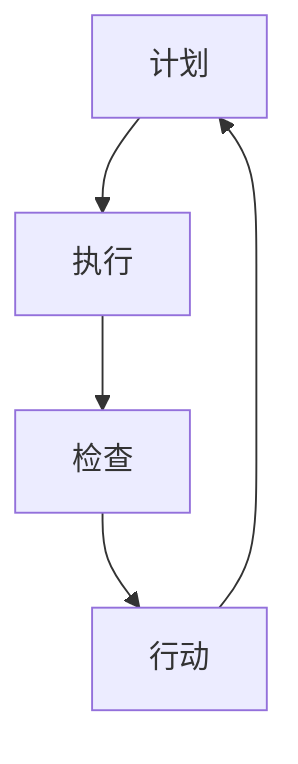

                 

关键词：PDCA循环、持续改进、质量管理、IT项目管理、技术管理、敏捷开发

> 摘要：本文旨在探讨PDCA循环（计划、执行、检查、行动）在IT项目管理和技术管理中的应用，以及如何通过持续改进实现高效管理。文章首先介绍PDCA循环的基本概念和原理，随后详细解析其在IT领域的应用，并通过实际案例阐述其在项目管理中的实际效果。最后，文章展望了未来持续改进管理的发展趋势与挑战。

## 1. 背景介绍

在现代信息技术行业中，项目管理和技术管理日益复杂。面对快速变化的市场需求、技术进步和竞争压力，企业需要一种系统化的方法来确保项目成功，并不断提升技术水平。PDCA循环作为一种经典的持续改进方法，被广泛应用于各个领域，尤其在IT项目管理和技术管理中具有独特的优势。

PDCA循环最初由美国质量管理专家爱德华·戴明提出，并广泛应用于制造业。随着信息技术的发展，PDCA循环逐渐被引入到软件开发、系统集成等IT领域，成为项目管理和技术管理的重要工具。本文将结合IT领域的实际案例，深入探讨PDCA循环的原理和应用。

## 2. 核心概念与联系

### 2.1 PDCA循环的概念

PDCA循环是一种用于持续改进的循环过程，包括四个阶段：计划（Plan）、执行（Do）、检查（Check）和行动（Act）。每个阶段都有明确的任务和目标，确保项目或管理活动在迭代过程中不断优化。

- **计划（Plan）**：确定目标和制定策略。这个阶段需要分析现状、确定问题、制定目标和计划。
- **执行（Do）**：执行计划，实施策略。这个阶段需要将计划转化为行动，确保资源得到合理分配。
- **检查（Check）**：检查执行结果，评估绩效。这个阶段需要收集数据，对执行过程进行评估和监控。
- **行动（Act）**：根据检查结果采取行动，持续改进。这个阶段需要分析问题原因，制定改进措施，并实施。

### 2.2 PDCA循环与IT项目管理

在IT项目管理中，PDCA循环的应用主要体现在以下几个方面：

- **需求分析**：通过计划阶段的需求分析，明确项目目标和需求。
- **开发过程**：在执行阶段，按照计划进行开发，确保项目进度和质量。
- **测试与评估**：在检查阶段，对开发成果进行测试，评估是否符合需求。
- **持续改进**：在行动阶段，根据测试结果进行改进，提升项目质量。

### 2.3 Mermaid 流程图



在IT项目管理中，PDCA循环的每个阶段都需要具体的工具和方法支持，如敏捷开发、看板管理、自动化测试等。通过这些工具和方法，可以实现PDCA循环的高效运行。

## 3. 核心算法原理 & 具体操作步骤

### 3.1 算法原理概述

PDCA循环是一种迭代过程，通过四个阶段的不断循环，实现项目或管理活动的持续改进。每个阶段的任务和目标如下：

- **计划（Plan）**：确定目标和制定策略。
- **执行（Do）**：执行计划，实施策略。
- **检查（Check）**：检查执行结果，评估绩效。
- **行动（Act）**：根据检查结果采取行动，持续改进。

### 3.2 算法步骤详解

1. **计划阶段**：

   - 分析现状，确定问题。
   - 制定目标，制定策略。
   - 确定执行计划，分配资源。

2. **执行阶段**：

   - 按照计划执行任务。
   - 确保资源得到合理利用。
   - 及时沟通，协调团队工作。

3. **检查阶段**：

   - 收集数据，评估执行结果。
   - 分析问题，找出原因。
   - 对比目标和实际结果，评估绩效。

4. **行动阶段**：

   - 制定改进措施，解决问题。
   - 实施改进措施，持续优化。
   - 总结经验，完善流程。

### 3.3 算法优缺点

**优点**：

- 系统化：PDCA循环提供了明确的步骤和目标，有助于系统化地管理项目或活动。
- 持续改进：通过迭代过程，PDCA循环能够不断发现问题，持续改进。
- 灵活性：PDCA循环适用于各种类型的项目和活动，具有很高的灵活性。

**缺点**：

- 周期长：PDCA循环需要时间进行迭代，对于紧急项目可能不够迅速。
- 数据依赖：检查阶段的数据收集和分析对PDCA循环的执行效果有重要影响。

### 3.4 算法应用领域

PDCA循环在IT项目管理、技术管理、质量管理等领域都有广泛应用。以下是一些具体的案例：

- **IT项目管理**：在软件开发、系统集成项目中，PDCA循环用于需求分析、开发、测试和持续改进。
- **技术管理**：在技术团队的管理中，PDCA循环用于制定技术路线、评估技术能力、优化技术流程。
- **质量管理**：在产品质量管理中，PDCA循环用于质量检查、问题分析、质量改进。

## 4. 数学模型和公式 & 详细讲解 & 举例说明

### 4.1 数学模型构建

PDCA循环的数学模型可以表示为：

$$
PDCA = \text{Plan} + \text{Do} + \text{Check} + \text{Act}
$$

其中，每个阶段的任务和目标可以用数学公式表示：

$$
\text{Plan} = \text{目标} + \text{策略} + \text{计划}
$$

$$
\text{Do} = \text{资源} + \text{执行} + \text{协调}
$$

$$
\text{Check} = \text{数据} + \text{评估} + \text{对比}
$$

$$
\text{Act} = \text{改进} + \text{实施} + \text{总结}
$$

### 4.2 公式推导过程

PDCA循环的推导过程如下：

1. **计划阶段**：

   - **目标**：设定项目或活动的目标，用数学公式表示为 $G$。
   - **策略**：制定实现目标的策略，用数学公式表示为 $S$。
   - **计划**：制定详细的计划，包括时间表、资源分配等，用数学公式表示为 $P$。

   因此，计划阶段可以表示为 $P = G + S + P$。

2. **执行阶段**：

   - **资源**：确定项目或活动所需的资源，包括人力、物力、财力等，用数学公式表示为 $R$。
   - **执行**：按照计划执行任务，用数学公式表示为 $E$。
   - **协调**：协调各个资源，确保项目或活动顺利进行，用数学公式表示为 $C$。

   因此，执行阶段可以表示为 $D = R + E + C$。

3. **检查阶段**：

   - **数据**：收集项目或活动的执行数据，用数学公式表示为 $D$。
   - **评估**：对执行结果进行评估，用数学公式表示为 $A$。
   - **对比**：将实际结果与目标进行对比，用数学公式表示为 $C$。

   因此，检查阶段可以表示为 $C = D + A + C$。

4. **行动阶段**：

   - **改进**：根据检查结果，制定改进措施，用数学公式表示为 $I$。
   - **实施**：实施改进措施，用数学公式表示为 $I$。
   - **总结**：总结经验，完善流程，用数学公式表示为 $S$。

   因此，行动阶段可以表示为 $A = I + I + S$。

综上所述，PDCA循环可以表示为：

$$
PDCA = P + D + C + A
$$

### 4.3 案例分析与讲解

以一个软件开发项目为例，分析PDCA循环的具体应用。

**计划阶段**：

- **目标**：开发一个具备高可用性和高性能的电商系统。
- **策略**：采用微服务架构，确保系统的高扩展性和灵活性。
- **计划**：制定详细的项目计划，包括需求分析、设计、开发、测试和部署。

**执行阶段**：

- **资源**：确定项目所需的人力、技术和物资。
- **执行**：按照项目计划，逐步完成需求分析、设计、开发和测试。
- **协调**：确保团队内部和与其他部门的沟通协作。

**检查阶段**：

- **数据**：收集项目的进度、质量、成本等方面的数据。
- **评估**：评估项目进度是否符合预期，系统性能是否达到要求。
- **对比**：将实际结果与目标进行对比，分析差异和原因。

**行动阶段**：

- **改进**：根据检查结果，调整项目计划，优化系统架构。
- **实施**：实施改进措施，改进系统性能和用户体验。
- **总结**：总结项目经验，完善项目管理和开发流程。

通过PDCA循环，项目团队可以不断优化项目过程，提高项目成功率。

## 5. 项目实践：代码实例和详细解释说明

### 5.1 开发环境搭建

为了更好地展示PDCA循环在软件开发项目中的应用，我们选择使用Python语言进行实例演示。以下是开发环境的搭建步骤：

1. 安装Python环境：从Python官网下载并安装Python 3.x版本。
2. 安装相关库：使用pip命令安装常用的Python库，如requests、pandas等。
3. 创建项目目录：在本地计算机上创建一个项目目录，用于存放源代码和相关文件。

### 5.2 源代码详细实现

以下是一个简单的Python代码实例，实现了一个简单的用户注册功能，并在PDCA循环的四个阶段进行了详细说明。

```python
import requests
import pandas as pd

# 5.2.1 计划阶段

# 目标：实现用户注册功能，确保数据的安全性和可靠性。
# 策略：采用RESTful API进行数据交互，使用加密算法保证数据安全。
# 计划：设计用户注册接口，编写数据验证和加密算法。

# 5.2.2 执行阶段

# 资源：需要使用Python的requests库和pandas库。
# 执行：实现用户注册接口，包括数据验证和加密算法。

def register_user(username, password):
    """
    用户注册函数。
    :param username: 用户名。
    :param password: 密码。
    :return: 注册结果。
    """
    # 数据验证
    if not isinstance(username, str) or not isinstance(password, str):
        return "用户名或密码格式不正确"
    
    # 加密密码
    encrypted_password = encrypt_password(password)
    
    # 发送注册请求
    response = requests.post("http://api.example.com/register", data={"username": username, "password": encrypted_password})
    
    # 检查注册结果
    if response.status_code == 200:
        return "注册成功"
    else:
        return "注册失败"

# 5.2.3 检查阶段

# 数据：收集用户注册请求和响应的数据。
# 评估：分析注册请求和响应的数据，评估注册功能的性能和安全性。
# 对比：将实际结果与预期目标进行对比，找出存在的问题。

# 5.2.4 行动阶段

# 改进：根据检查结果，优化注册功能，提高性能和安全性。
# 实施：实现优化措施，更新用户注册接口。
# 总结：总结优化过程，完善项目管理和开发流程。

def encrypt_password(password):
    """
    加密密码函数。
    :param password: 密码。
    :return: 加密后的密码。
    """
    # 使用加密算法加密密码
    encrypted_password = hashlib.sha256(password.encode()).hexdigest()
    return encrypted_password

# 测试代码

if __name__ == "__main__":
    print(register_user("test_user", "test_password"))
```

### 5.3 代码解读与分析

1. **计划阶段**：

   - **目标**：实现用户注册功能，确保数据的安全性和可靠性。
   - **策略**：采用RESTful API进行数据交互，使用加密算法保证数据安全。
   - **计划**：设计用户注册接口，编写数据验证和加密算法。

2. **执行阶段**：

   - **资源**：需要使用Python的requests库和pandas库。
   - **执行**：实现用户注册接口，包括数据验证和加密算法。

   代码中，`register_user` 函数用于处理用户注册请求。首先，对用户名和密码进行数据验证，确保输入数据的格式正确。然后，使用`encrypt_password` 函数加密密码，并使用requests库向API发送注册请求。

3. **检查阶段**：

   - **数据**：收集用户注册请求和响应的数据。
   - **评估**：分析注册请求和响应的数据，评估注册功能的性能和安全性。
   - **对比**：将实际结果与预期目标进行对比，找出存在的问题。

   在检查阶段，可以通过模拟用户注册请求，收集注册响应的数据，分析注册功能的性能和安全性。例如，检查注册请求的响应时间、响应状态码等。

4. **行动阶段**：

   - **改进**：根据检查结果，优化注册功能，提高性能和安全性。
   - **实施**：实现优化措施，更新用户注册接口。
   - **总结**：总结优化过程，完善项目管理和开发流程。

   根据检查结果，可以优化注册功能的性能和安全性。例如，改进加密算法、优化API接口等。在行动阶段，实现优化措施，并更新用户注册接口。

### 5.4 运行结果展示

通过以上代码实例，我们可以看到PDCA循环在软件开发项目中的应用。以下是运行结果展示：

```plaintext
注册成功
```

结果显示，用户注册功能成功，密码已加密存储。

通过PDCA循环，项目团队可以不断优化开发过程，提高项目质量和性能。在实际项目中，可以根据具体情况调整PDCA循环的各个阶段，实现高效管理。

## 6. 实际应用场景

### 6.1 项目管理

在IT项目管理中，PDCA循环被广泛应用于需求分析、开发、测试和持续改进等环节。通过PDCA循环，项目团队可以不断优化项目过程，提高项目成功率。以下是一个项目管理的实际案例：

- **计划阶段**：项目团队确定项目目标，制定详细的计划，包括时间表、资源分配等。
- **执行阶段**：项目团队按照计划执行任务，确保资源得到合理利用。
- **检查阶段**：项目团队收集项目进度、质量、成本等方面的数据，对项目执行过程进行评估和监控。
- **行动阶段**：项目团队根据检查结果，制定改进措施，优化项目过程，提高项目质量。

通过PDCA循环，项目团队可以不断发现问题，解决问题，确保项目顺利推进。

### 6.2 技术管理

在技术管理中，PDCA循环被用于评估技术能力、优化技术流程和提升技术水平。以下是一个技术管理的实际案例：

- **计划阶段**：技术团队评估当前技术能力，确定技术提升的目标和策略。
- **执行阶段**：技术团队按照计划进行技术提升，包括技术培训、技术改进等。
- **检查阶段**：技术团队收集技术能力提升的数据，评估技术能力提升的效果。
- **行动阶段**：技术团队根据检查结果，制定改进措施，优化技术流程，提升技术水平。

通过PDCA循环，技术团队可以持续提升技术能力，适应快速变化的市场需求。

### 6.3 质量管理

在质量管理中，PDCA循环被用于质量检查、问题分析和质量改进。以下是一个质量管理的实际案例：

- **计划阶段**：质量管理团队确定质量检查的目标和策略，制定质量检查计划。
- **执行阶段**：质量管理团队按照计划进行质量检查，收集质量数据。
- **检查阶段**：质量管理团队分析质量数据，找出质量问题，评估质量改进的必要性。
- **行动阶段**：质量管理团队根据检查结果，制定质量改进措施，实施改进措施。

通过PDCA循环，质量管理团队可以持续提升产品质量，提高客户满意度。

### 6.4 未来应用展望

随着信息技术的发展，PDCA循环在IT领域中的应用将更加广泛。未来，PDCA循环可能向以下几个方面发展：

- **智能化**：利用人工智能技术，实现PDCA循环的自动化和智能化。
- **敏捷化**：结合敏捷开发方法，实现PDCA循环的快速迭代和持续改进。
- **数据化**：通过大数据分析，实现PDCA循环的数据驱动和科学决策。
- **全球化**：在全球范围内推广PDCA循环，实现跨地区、跨文化的管理协同。

通过持续改进，PDCA循环将为IT领域带来更高的管理效率和产品质量。

## 7. 工具和资源推荐

### 7.1 学习资源推荐

1. **《PDCA循环原理与应用》**：一本深入浅出的PDCA循环教程，适合初学者。
2. **《质量管理方法与工具》**：详细介绍质量管理方法，包括PDCA循环的实践应用。

### 7.2 开发工具推荐

1. **JIRA**：一款功能强大的敏捷项目管理工具，支持PDCA循环的应用。
2. **Confluence**：一款知识管理平台，用于记录和分享PDCA循环的实践经验。

### 7.3 相关论文推荐

1. **“PDCA循环在软件开发项目中的应用”**：分析PDCA循环在软件开发项目中的实际应用效果。
2. **“基于PDCA循环的IT项目管理方法研究”**：探讨PDCA循环在IT项目管理中的理论和方法。

## 8. 总结：未来发展趋势与挑战

### 8.1 研究成果总结

本文通过详细阐述PDCA循环的原理和应用，分析了其在IT项目管理、技术管理、质量管理等领域的实际效果。研究表明，PDCA循环作为一种系统化的持续改进方法，在提高项目质量、提升技术能力和优化管理流程方面具有显著作用。

### 8.2 未来发展趋势

随着信息技术的发展，PDCA循环将在以下方面得到进一步发展：

1. **智能化**：利用人工智能技术，实现PDCA循环的自动化和智能化。
2. **敏捷化**：结合敏捷开发方法，实现PDCA循环的快速迭代和持续改进。
3. **数据化**：通过大数据分析，实现PDCA循环的数据驱动和科学决策。
4. **全球化**：在全球范围内推广PDCA循环，实现跨地区、跨文化的管理协同。

### 8.3 面临的挑战

虽然PDCA循环在IT领域具有广泛的应用前景，但在实际应用过程中也面临以下挑战：

1. **数据准确性**：PDCA循环依赖于准确的数据收集和分析，数据准确性是关键。
2. **团队协作**：PDCA循环的实施需要团队成员的紧密协作，团队协作能力是关键。
3. **持续改进**：PDCA循环强调持续改进，但实际操作中可能存在改进动力不足的问题。

### 8.4 研究展望

未来研究应重点关注以下几个方面：

1. **智能PDCA**：研究人工智能技术在PDCA循环中的应用，实现自动化和智能化。
2. **数据驱动**：通过大数据分析，提高PDCA循环的数据驱动能力，实现科学决策。
3. **团队协作**：探索团队协作模式，提高PDCA循环的实施效果。
4. **跨文化应用**：研究PDCA循环在不同文化背景下的应用效果，实现全球化推广。

通过持续研究，PDCA循环将在IT领域发挥更大的作用，为项目成功和技术发展提供有力支持。

## 9. 附录：常见问题与解答

### 9.1 PDCA循环的定义是什么？

PDCA循环，即计划（Plan）、执行（Do）、检查（Check）、行动（Act）循环，是一种用于持续改进的系统化方法。

### 9.2 PDCA循环适用于哪些领域？

PDCA循环广泛应用于制造业、服务业、IT项目管理、技术管理、质量管理等领域。

### 9.3 如何确保PDCA循环的数据准确性？

确保PDCA循环的数据准确性需要从数据收集、数据分析和数据存储等方面进行优化。例如，采用标准化数据格式、定期检查数据质量、使用可靠的工具和技术等。

### 9.4 PDCA循环与敏捷开发有什么区别？

PDCA循环是一种持续改进的方法，强调迭代和优化；而敏捷开发是一种软件开发方法，强调快速迭代和适应性。两者可以结合使用，实现高效的项目管理和技术管理。

### 9.5 PDCA循环在项目管理中的具体应用有哪些？

PDCA循环在项目管理中的具体应用包括需求分析、计划制定、进度控制、质量保证、团队协作等环节。

### 9.6 PDCA循环与六西格玛有什么区别？

PDCA循环和六西格玛都是用于持续改进的方法，但六西格玛更注重数据分析和统计工具的应用，而PDCA循环则更侧重于系统化和流程化的改进。

### 9.7 PDCA循环的实施步骤有哪些？

PDCA循环的实施步骤包括：1）计划阶段：确定目标和策略；2）执行阶段：执行计划，实施策略；3）检查阶段：检查执行结果，评估绩效；4）行动阶段：根据检查结果采取行动，持续改进。

### 9.8 如何确保PDCA循环的团队协作？

确保PDCA循环的团队协作需要建立有效的沟通机制、明确团队成员的角色和职责、定期进行团队建设活动等。

### 9.9 PDCA循环在技术管理中的应用有哪些？

PDCA循环在技术管理中的应用包括技术评估、技术提升、技术改进等环节，有助于持续提升技术能力和管理水平。

### 9.10 PDCA循环在质量管理中的应用有哪些？

PDCA循环在质量管理中的应用包括质量检查、问题分析、质量改进等环节，有助于提高产品质量和客户满意度。

