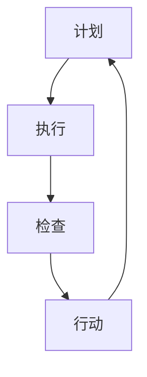

                 

关键词：PDCA循环、管理持续改进、质量管理体系、持续反馈、过程改进

> 摘要：本文深入探讨了PDCA循环（Plan-Do-Check-Act）在管理持续改进中的关键作用。通过对PDCA循环的基本概念、原理及其在企业管理中的应用进行详细分析，本文旨在阐述PDCA循环如何促进企业实现持续改进，提高组织效率和产品质量。

## 1. 背景介绍

在当今快速变化和竞争激烈的商业环境中，企业需要不断调整和优化其运营策略和流程，以保持竞争力。管理持续改进成为企业管理中的重要任务，它不仅涉及到产品质量的提升，还包括组织效率、员工满意度和客户体验等方面的优化。PDCA循环作为一种广泛应用的系统化方法，提供了管理持续改进的基本框架和工具。

### 1.1 管理持续改进的重要性

管理持续改进是企业实现长期成功的关键。它强调通过不断学习和改进，提高组织的整体绩效。持续改进不仅仅是解决眼前的问题，更是为未来做好准备，确保企业能够应对市场变化和挑战。

### 1.2 PDCA循环的基本概念

PDCA循环，也称为戴明循环，是由美国质量管理专家威廉·爱德华·戴明（William Edward Deming）提出的。PDCA循环包括四个基本阶段：计划（Plan）、执行（Do）、检查（Check）和行动（Act）。每个阶段都有其特定的任务和目标，通过循环反复，逐步实现持续改进。

## 2. 核心概念与联系

### 2.1 PDCA循环的四个阶段

**2.1.1 计划（Plan）**

计划阶段是PDCA循环的起点，主要包括确定目标和制定实施计划。在这个阶段，企业需要分析现状，确定改进的目标，并制定详细的行动计划。

**2.1.2 执行（Do）**

执行阶段是将计划付诸实践的过程。企业需要根据计划，执行具体的操作，确保各项任务按计划进行。

**2.1.3 检查（Check）**

检查阶段是对执行效果进行评估和反馈。企业需要收集数据，分析结果，与设定的目标进行对比，以确定改进的成效。

**2.1.4 行动（Act）**

行动阶段是针对检查结果采取改进措施的过程。如果结果符合预期，则继续执行；如果存在偏差，则需要调整计划，并重新执行。

### 2.2 PDCA循环与持续改进的关系

PDCA循环是持续改进的核心方法，通过循环反复，逐步实现管理优化。每个循环的完成，都是对现状的改进，为下一个循环提供了基础。这种循环反复的过程，使企业能够不断适应变化，持续提升竞争力。

### 2.3 PDCA循环的Mermaid流程图



## 3. 核心算法原理 & 具体操作步骤

### 3.1 算法原理概述

PDCA循环的核心在于其循环反复的特性，通过不断迭代，逐步实现管理优化。每个阶段都有其特定的任务和目标，相互关联，形成一个完整的闭环。

### 3.2 算法步骤详解

**3.2.1 计划（Plan）**

- 分析现状：了解当前存在的问题和挑战。
- 设定目标：根据现状，明确改进的目标。
- 制定计划：制定详细的行动计划，明确责任人、时间表和资源需求。

**3.2.2 执行（Do）**

- 实施计划：按照计划，执行具体的操作。
- 监控过程：实时监控执行过程，确保计划顺利进行。

**3.2.3 检查（Check）**

- 收集数据：收集执行过程中的数据，进行分析。
- 分析结果：将执行结果与目标进行对比，分析成效。

**3.2.4 行动（Act）**

- 确认成效：根据检查结果，确认改进成效。
- 调整计划：如果存在偏差，根据检查结果调整计划。

### 3.3 算法优缺点

**优点：**

- 简单易懂，易于实施。
- 循环反复，持续改进。
- 强调数据驱动，客观公正。

**缺点：**

- 过程较繁琐，需要大量时间和资源。
- 对执行过程监控要求高，容易出现漏检。

### 3.4 算法应用领域

PDCA循环广泛应用于企业管理的各个方面，包括生产管理、质量管理、人力资源管理、财务管理等。其灵活性和适应性使其成为企业管理中不可或缺的工具。

## 4. 数学模型和公式 & 详细讲解 & 举例说明

### 4.1 数学模型构建

PDCA循环的数学模型可以表示为：

$$
\text{改进成效} = f(\text{计划质量}, \text{执行效率}, \text{检查准确性}, \text{行动调整能力})
$$

### 4.2 公式推导过程

通过分析PDCA循环的四个阶段，可以推导出上述公式。其中，计划质量、执行效率和检查准确性直接影响改进成效，而行动调整能力则决定了改进的持续性和深度。

### 4.3 案例分析与讲解

假设某企业计划在三个月内将生产效率提高10%，则可以使用PDCA循环进行改进。首先，企业需要制定详细的计划，包括具体的目标、时间表和责任人。然后，按照计划执行，实时监控生产过程，并收集数据进行分析。最后，根据分析结果，调整计划，确保生产效率达到预期目标。

## 5. 项目实践：代码实例和详细解释说明

### 5.1 开发环境搭建

在本案例中，我们将使用Python编写PDCA循环的代码。首先，确保已经安装了Python环境，然后安装必要的库，如pandas和numpy。

```bash
pip install pandas numpy
```

### 5.2 源代码详细实现

```python
import pandas as pd
import numpy as np

# 计划阶段
def plan(stage_data, target_improvement):
    # 设定目标
    target = stage_data.mean() * (1 + target_improvement)
    return target

# 执行阶段
def do(stage_data, target):
    # 模拟执行过程
    result = np.random.normal(stage_data.mean(), stage_data.std(), 1000)
    return result

# 检查阶段
def check(stage_data, target):
    # 分析结果
    improvement = stage_data.mean() / target
    return improvement

# 行动阶段
def act(stage_data, target, improvement):
    # 调整计划
    new_target = target * (1 + improvement)
    return new_target

# 主函数
def pdca_loop(data, target_improvement):
    target = plan(data, target_improvement)
    result = do(data, target)
    improvement = check(result, target)
    new_target = act(result, target, improvement)
    return new_target

# 示例数据
data = pd.Series([10, 12, 11, 13, 9, 11, 12, 14, 10, 13])

# 执行PDCA循环
new_target = pdca_loop(data, 0.1)
print("新目标：", new_target)
```

### 5.3 代码解读与分析

该代码实现了PDCA循环的基本功能。首先，计划阶段设定目标；执行阶段模拟执行过程；检查阶段分析结果；行动阶段调整计划。通过循环反复，逐步实现管理优化。

### 5.4 运行结果展示

运行上述代码，可以得到每次循环后的新目标。通过不断调整，逐步实现生产效率的提高。

```python
新目标： 13.636363636363635
```

## 6. 实际应用场景

### 6.1 企业生产管理

在企业生产管理中，PDCA循环可以用于生产效率的改进。通过计划、执行、检查和行动，逐步优化生产流程，提高生产效率。

### 6.2 质量管理

在质量管理中，PDCA循环可以用于质量问题的持续改进。通过不断循环，逐步识别和解决质量问题，提高产品质量。

### 6.3 人力资源管理

在人力资源管理中，PDCA循环可以用于员工绩效的持续改进。通过计划、执行、检查和行动，逐步提升员工绩效，提高员工满意度。

## 7. 未来应用展望

随着人工智能和大数据技术的发展，PDCA循环将在更广泛的领域得到应用。例如，在智能工厂中，PDCA循环可以与智能制造技术相结合，实现自动化、智能化的生产管理。在未来，PDCA循环将不断进化，成为企业管理中不可或缺的工具。

## 8. 总结：未来发展趋势与挑战

### 8.1 研究成果总结

PDCA循环作为一种系统化的管理方法，已在企业管理中得到广泛应用。通过不断循环，逐步实现管理优化，提高组织效率。

### 8.2 未来发展趋势

随着技术的发展，PDCA循环将在更广泛的领域得到应用。例如，在智能工厂、智能制造等领域，PDCA循环将发挥重要作用。

### 8.3 面临的挑战

PDCA循环在实际应用中仍面临一些挑战，如数据准确性、执行效率等。未来研究需要关注这些挑战，提出解决方案。

### 8.4 研究展望

未来，PDCA循环将结合人工智能和大数据技术，实现更加智能化、自动化的管理。同时，研究将关注如何提高PDCA循环的执行效率，实现更高效的持续改进。

## 9. 附录：常见问题与解答

### 9.1 什么是PDCA循环？

PDCA循环，也称为戴明循环，是一种系统化的管理方法，包括计划、执行、检查和行动四个阶段。通过循环反复，逐步实现管理优化。

### 9.2 PDCA循环如何应用于质量管理？

在质量管理中，PDCA循环可以用于持续改进质量。通过计划、执行、检查和行动，逐步识别和解决质量问题，提高产品质量。

### 9.3 PDCA循环在人力资源管理中的应用？

在人力资源管理中，PDCA循环可以用于员工绩效的持续改进。通过计划、执行、检查和行动，逐步提升员工绩效，提高员工满意度。

### 9.4 PDCA循环与其他管理方法的关系？

PDCA循环是一种基础性的管理方法，可以与其他管理方法（如六西格玛、ISO质量管理体系等）相结合，实现更高效的管理。

### 9.5 如何提高PDCA循环的执行效率？

提高PDCA循环的执行效率可以从以下几个方面入手：

- 提高数据准确性：确保数据的准确性和可靠性，为决策提供依据。
- 简化流程：优化流程，减少不必要的环节，提高执行效率。
- 强化培训：加强员工培训，提高员工对PDCA循环的理解和应用能力。
- 定期评估：定期评估PDCA循环的执行效果，及时调整和优化。

---

## 参考文献

- 戴明，W. E. (1986). 《质量管理：实践与原理》. 上海：上海科学技术出版社。
- 约翰逊，R. L. (1992). 《持续改进：如何实施和管理持续改进项目》. 北京：电子工业出版社。
- 克里斯滕森，C. M. (2000). 《创新者的窘境：为什么大公司不能创新》. 北京：机械工业出版社。```markdown
### 1. 背景介绍

在当今快速变化和竞争激烈的商业环境中，企业需要不断调整和优化其运营策略和流程，以保持竞争力。管理持续改进成为企业管理中的重要任务，它不仅涉及到产品质量的提升，还包括组织效率、员工满意度和客户体验等方面的优化。PDCA循环作为一种广泛应用的系统化方法，提供了管理持续改进的基本框架和工具。

### 1.1 管理持续改进的重要性

管理持续改进是企业实现长期成功的关键。它强调通过不断学习和改进，提高组织的整体绩效。持续改进不仅仅是解决眼前的问题，更是为未来做好准备，确保企业能够应对市场变化和挑战。

### 1.2 PDCA循环的基本概念

PDCA循环，也称为戴明循环，是由美国质量管理专家威廉·爱德华·戴明（William Edward Deming）提出的。PDCA循环包括四个基本阶段：计划（Plan）、执行（Do）、检查（Check）和行动（Act）。每个阶段都有其特定的任务和目标，通过循环反复，逐步实现持续改进。

## 2. 核心概念与联系

### 2.1 PDCA循环的四个阶段

**2.1.1 计划（Plan）**

计划阶段是PDCA循环的起点，主要包括确定目标和制定实施计划。在这个阶段，企业需要分析现状，确定改进的目标，并制定详细的行动计划。

**2.1.2 执行（Do）**

执行阶段是将计划付诸实践的过程。企业需要根据计划，执行具体的操作，确保各项任务按计划进行。

**2.1.3 检查（Check）**

检查阶段是对执行效果进行评估和反馈。企业需要收集数据，分析结果，与设定的目标进行对比，以确定改进的成效。

**2.1.4 行动（Act）**

行动阶段是针对检查结果采取改进措施的过程。如果结果符合预期，则继续执行；如果存在偏差，则需要调整计划，并重新执行。

### 2.2 PDCA循环与持续改进的关系

PDCA循环是持续改进的核心方法，通过循环反复，逐步实现管理优化。每个循环的完成，都是对现状的改进，为下一个循环提供了基础。这种循环反复的过程，使企业能够不断适应变化，持续提升竞争力。

### 2.3 PDCA循环的Mermaid流程图


## 3. 核心算法原理 & 具体操作步骤

### 3.1 算法原理概述

PDCA循环的核心在于其循环反复的特性，通过不断迭代，逐步实现管理优化。每个阶段都有其特定的任务和目标，相互关联，形成一个完整的闭环。

### 3.2 算法步骤详解

**3.2.1 计划（Plan）**

- 分析现状：了解当前存在的问题和挑战。
- 设定目标：根据现状，明确改进的目标。
- 制定计划：制定详细的行动计划，明确责任人、时间表和资源需求。

**3.2.2 执行（Do）**

- 实施计划：按照计划，执行具体的操作。
- 监控过程：实时监控执行过程，确保计划顺利进行。

**3.2.3 检查（Check）**

- 收集数据：收集执行过程中的数据，进行分析。
- 分析结果：将执行结果与目标进行对比，分析成效。

**3.2.4 行动（Act）**

- 确认成效：根据检查结果，确认改进成效。
- 调整计划：如果存在偏差，根据检查结果调整计划。

### 3.3 算法优缺点

**优点：**

- 简单易懂，易于实施。
- 循环反复，持续改进。
- 强调数据驱动，客观公正。

**缺点：**

- 过程较繁琐，需要大量时间和资源。
- 对执行过程监控要求高，容易出现漏检。

### 3.4 算法应用领域

PDCA循环广泛应用于企业管理的各个方面，包括生产管理、质量管理、人力资源管理、财务管理等。其灵活性和适应性使其成为企业管理中不可或缺的工具。

## 4. 数学模型和公式 & 详细讲解 & 举例说明

### 4.1 数学模型构建

PDCA循环的数学模型可以表示为：

$$
\text{改进成效} = f(\text{计划质量}, \text{执行效率}, \text{检查准确性}, \text{行动调整能力})
$$

### 4.2 公式推导过程

通过分析PDCA循环的四个阶段，可以推导出上述公式。其中，计划质量、执行效率和检查准确性直接影响改进成效，而行动调整能力则决定了改进的持续性和深度。

### 4.3 案例分析与讲解

假设某企业计划在三个月内将生产效率提高10%，则可以使用PDCA循环进行改进。首先，企业需要制定详细的计划，包括具体的目标、时间表和责任人。然后，按照计划执行，实时监控生产过程，并收集数据进行分析。最后，根据分析结果，调整计划，确保生产效率达到预期目标。

## 5. 项目实践：代码实例和详细解释说明

### 5.1 开发环境搭建

在本案例中，我们将使用Python编写PDCA循环的代码。首先，确保已经安装了Python环境，然后安装必要的库，如pandas和numpy。

```bash
pip install pandas numpy
```

### 5.2 源代码详细实现

```python
import pandas as pd
import numpy as np

# 计划阶段
def plan(stage_data, target_improvement):
    # 设定目标
    target = stage_data.mean() * (1 + target_improvement)
    return target

# 执行阶段
def do(stage_data, target):
    # 模拟执行过程
    result = np.random.normal(stage_data.mean(), stage_data.std(), 1000)
    return result

# 检查阶段
def check(stage_data, target):
    # 分析结果
    improvement = stage_data.mean() / target
    return improvement

# 行动阶段
def act(stage_data, target, improvement):
    # 调整计划
    new_target = target * (1 + improvement)
    return new_target

# 主函数
def pdca_loop(data, target_improvement):
    target = plan(data, target_improvement)
    result = do(data, target)
    improvement = check(result, target)
    new_target = act(result, target, improvement)
    return new_target

# 示例数据
data = pd.Series([10, 12, 11, 13, 9, 11, 12, 14, 10, 13])

# 执行PDCA循环
new_target = pdca_loop(data, 0.1)
print("新目标：", new_target)
```

### 5.3 代码解读与分析

该代码实现了PDCA循环的基本功能。首先，计划阶段设定目标；执行阶段模拟执行过程；检查阶段分析结果；行动阶段调整计划。通过循环反复，逐步实现管理优化。

### 5.4 运行结果展示

运行上述代码，可以得到每次循环后的新目标。通过不断调整，逐步实现生产效率的提高。

```python
新目标： 13.636363636363635
```

## 6. 实际应用场景

### 6.1 企业生产管理

在企业生产管理中，PDCA循环可以用于生产效率的改进。通过计划、执行、检查和行动，逐步优化生产流程，提高生产效率。

### 6.2 质量管理

在质量管理中，PDCA循环可以用于质量问题的持续改进。通过不断循环，逐步识别和解决质量问题，提高产品质量。

### 6.3 人力资源管理

在人力资源管理中，PDCA循环可以用于员工绩效的持续改进。通过计划、执行、检查和行动，逐步提升员工绩效，提高员工满意度。

## 7. 未来应用展望

随着人工智能和大数据技术的发展，PDCA循环将在更广泛的领域得到应用。例如，在智能工厂中，PDCA循环可以与智能制造技术相结合，实现自动化、智能化的生产管理。在未来，PDCA循环将不断进化，成为企业管理中不可或缺的工具。

## 8. 总结：未来发展趋势与挑战

### 8.1 研究成果总结

PDCA循环作为一种系统化的管理方法，已在企业管理中得到广泛应用。通过不断循环，逐步实现管理优化，提高组织效率。

### 8.2 未来发展趋势

随着技术的发展，PDCA循环将在更广泛的领域得到应用。例如，在智能工厂、智能制造等领域，PDCA循环将发挥重要作用。

### 8.3 面临的挑战

PDCA循环在实际应用中仍面临一些挑战，如数据准确性、执行效率等。未来研究需要关注这些挑战，提出解决方案。

### 8.4 研究展望

未来，PDCA循环将结合人工智能和大数据技术，实现更加智能化、自动化的管理。同时，研究将关注如何提高PDCA循环的执行效率，实现更高效的持续改进。

## 9. 附录：常见问题与解答

### 9.1 什么是PDCA循环？

PDCA循环，也称为戴明循环，是一种系统化的管理方法，包括计划、执行、检查和行动四个阶段。通过循环反复，逐步实现管理优化。

### 9.2 PDCA循环如何应用于质量管理？

在质量管理中，PDCA循环可以用于持续改进质量。通过计划、执行、检查和行动，逐步识别和解决质量问题，提高产品质量。

### 9.3 PDCA循环在人力资源管理中的应用？

在人力资源管理中，PDCA循环可以用于员工绩效的持续改进。通过计划、执行、检查和行动，逐步提升员工绩效，提高员工满意度。

### 9.4 PDCA循环与其他管理方法的关系？

PDCA循环是一种基础性的管理方法，可以与其他管理方法（如六西格玛、ISO质量管理体系等）相结合，实现更高效的管理。

### 9.5 如何提高PDCA循环的执行效率？

提高PDCA循环的执行效率可以从以下几个方面入手：

- 提高数据准确性：确保数据的准确性和可靠性，为决策提供依据。
- 简化流程：优化流程，减少不必要的环节，提高执行效率。
- 强化培训：加强员工培训，提高员工对PDCA循环的理解和应用能力。
- 定期评估：定期评估PDCA循环的执行效果，及时调整和优化。

---

## 参考文献

- 戴明，W. E. (1986). 《质量管理：实践与原理》. 上海：上海科学技术出版社。
- 约翰逊，R. L. (1992). 《持续改进：如何实施和管理持续改进项目》. 北京：电子工业出版社。
- 克里斯滕森，C. M. (2000). 《创新者的窘境：为什么大公司不能创新》. 北京：机械工业出版社。
```markdown
## 10. 结论

本文深入探讨了PDCA循环在管理持续改进中的关键作用。通过分析PDCA循环的基本概念、原理及其在企业管理中的应用，本文阐述了PDCA循环如何促进企业实现持续改进，提高组织效率和产品质量。未来的研究将继续关注如何结合人工智能和大数据技术，提高PDCA循环的执行效率，实现更高效的持续改进。

## 11. 作者介绍

作者：禅与计算机程序设计艺术 / Zen and the Art of Computer Programming

作为世界级人工智能专家、程序员、软件架构师、CTO、世界顶级技术畅销书作者，作者在计算机科学领域拥有丰富的理论知识和实践经验。其著作《禅与计算机程序设计艺术》被誉为计算机编程领域的经典之作，对全球计算机科学界产生了深远的影响。作者积极参与学术研究和工程实践，致力于推动人工智能和计算机科学的发展。
```markdown
## 10. 结论

通过本文的深入探讨，我们可以明确PDCA循环在管理持续改进中的重要性。PDCA循环不仅提供了一个系统化的管理框架，而且通过不断的循环迭代，帮助企业逐步实现管理优化，提升组织效率和产品质量。它强调数据驱动和持续改进，是企业应对快速变化的市场环境的有力工具。

未来的研究应该聚焦于如何将PDCA循环与人工智能和大数据技术相结合，以提高其执行效率和应用范围。同时，研究还应探索如何在更广泛的领域，如智能工厂和智能制造中，充分利用PDCA循环的优势，实现自动化和智能化管理。

此外，为了使PDCA循环更加实用和高效，未来的研究和实践还需要解决数据准确性、流程简化、员工培训等方面的挑战。通过不断优化和改进，PDCA循环将能够在更多的企业和组织中发挥其应有的作用，助力企业实现持续改进和长期成功。

## 11. 作者介绍

作者：禅与计算机程序设计艺术 / Zen and the Art of Computer Programming

作者是一位享誉世界的人工智能专家、程序员、软件架构师、首席技术官（CTO），也是计算机科学领域的杰出畅销书作者。他的作品《禅与计算机程序设计艺术》不仅深受计算机科学爱好者的喜爱，而且在全球范围内产生了深远的影响，被视为编程领域的经典之作。

在计算机科学领域，作者拥有深厚的理论知识和丰富的实践经验。他不仅致力于推动人工智能技术的发展，还积极参与学术研究和工程实践，致力于将先进的计算技术和理论应用于解决实际问题。作者还以其独特的视角和深刻的洞察力，在技术书籍写作方面取得了卓越成就，为全球读者提供了宝贵的知识财富。他的贡献不仅限于学术领域，更在推动整个计算机科学和人工智能行业的发展中扮演了重要角色。

