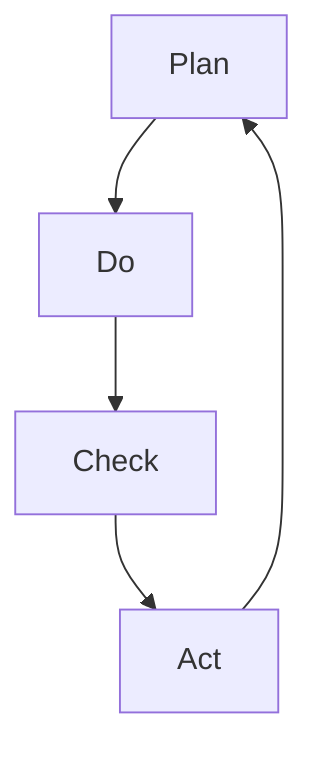

                 

关键词：PDCA循环、项目管理、质量改进、持续迭代、过程优化

> 摘要：本文旨在探讨PDCA循环在项目管理中的应用，分析其核心概念、原理以及具体操作步骤，并通过实际案例展示其在项目实践中的价值。文章将深入讨论PDCA循环如何帮助团队实现持续改进，提升项目质量和效率，为项目管理提供新的视角和方法。

## 1. 背景介绍

在当今快速发展的信息技术时代，项目管理的重要性日益凸显。项目经理不仅要具备丰富的技术知识，还需要掌握科学的管理方法和工具。PDCA循环（Plan-Do-Check-Act）作为一种经典的持续改进方法，已被广泛应用于各个行业，并在项目管理中发挥了重要作用。

PDCA循环起源于质量管理理论，由美国质量管理专家威廉·爱德华兹·戴明提出。它是一种循环迭代的过程，通过计划、执行、检查和行动四个阶段，实现问题的识别和解决，从而不断优化项目流程和提升项目质量。

## 2. 核心概念与联系

### 2.1 PDCA循环的基本原理

PDCA循环包括以下四个阶段：

1. **Plan（计划）**：在项目启动阶段，明确项目目标、制定计划和策略，识别潜在风险和问题，制定预防措施。

2. **Do（执行）**：执行计划，实施项目任务，确保按照既定的目标和策略推进项目。

3. **Check（检查）**：监控项目进展，收集数据，评估项目绩效，识别偏差和问题。

4. **Act（行动）**：根据检查结果，采取纠正措施，持续改进项目流程，确保项目目标的实现。

### 2.2 PDCA循环与项目管理的关系

PDCA循环是项目管理中的一种有效工具，可以帮助项目经理和团队：

1. **明确项目目标**：通过计划阶段，明确项目目标、计划和策略，确保项目方向正确。

2. **提高执行力**：通过执行阶段，确保项目任务按计划推进，提高团队执行力。

3. **监控项目质量**：通过检查阶段，及时发现项目中的问题，确保项目质量。

4. **持续优化流程**：通过行动阶段，采取纠正措施，持续优化项目流程，提升项目效率。

### 2.3 Mermaid流程图



## 3. 核心算法原理 & 具体操作步骤

### 3.1 算法原理概述

PDCA循环的核心算法原理在于其四个阶段的相互关联和迭代。每个阶段都有明确的任务和目标，通过循环迭代，实现项目目标的逐步实现和项目质量的持续提升。

### 3.2 算法步骤详解

1. **Plan（计划）**：

   - 明确项目目标：确定项目的关键指标和目标。

   - 制定计划：制定详细的实施计划，包括任务分解、资源分配和时间安排。

   - 风险识别：识别项目潜在的风险和问题，制定预防措施。

2. **Do（执行）**：

   - 按计划执行：确保项目任务按照计划推进。

   - 实施控制：对项目执行过程中的关键节点进行监控和控制。

3. **Check（检查）**：

   - 收集数据：收集项目执行过程中的数据，包括进度、质量和成本等。

   - 评估绩效：评估项目绩效，识别偏差和问题。

4. **Act（行动）**：

   - 采取纠正措施：针对检查阶段发现的问题，采取纠正措施。

   - 持续改进：总结经验，优化项目流程，为下一个循环做好准备。

### 3.3 算法优缺点

**优点**：

- 简单易行：PDCA循环是一种简单、易于理解的方法，适用于各种规模的项目。

- 持续改进：通过循环迭代，不断优化项目流程和提升项目质量。

- 提高执行力：明确的项目目标和计划，有助于提高团队的执行力。

**缺点**：

- 过程繁琐：PDCA循环需要四个阶段，每个阶段都有明确的任务和目标，过程较为繁琐。

- 需要持续投入：持续改进需要长期的努力和投入，不能一蹴而就。

### 3.4 算法应用领域

PDCA循环广泛应用于各个领域，包括：

- 质量管理：通过PDCA循环，持续改进产品质量。

- 项目管理：通过PDCA循环，提高项目执行效率和质量。

- 运营管理：通过PDCA循环，优化运营流程，提高运营效率。

## 4. 数学模型和公式 & 详细讲解 & 举例说明

### 4.1 数学模型构建

PDCA循环的数学模型可以表示为：

$$
\text{目标实现度} = f(\text{计划实施度}, \text{项目绩效})
$$

其中，计划实施度和项目绩效是影响目标实现度的关键因素。

### 4.2 公式推导过程

$$
\text{计划实施度} = \frac{\text{实际进度}}{\text{计划进度}}
$$

$$
\text{项目绩效} = \frac{\text{实际质量}}{\text{计划质量}}
$$

将上述两个公式代入目标实现度公式，得到：

$$
\text{目标实现度} = f\left(\frac{\text{实际进度}}{\text{计划进度}}, \frac{\text{实际质量}}{\text{计划质量}}\right)
$$

### 4.3 案例分析与讲解

假设一个项目的目标是在一个月内完成一个软件的开发和测试。计划进度为20天，计划质量为90分。实际进度为25天，实际质量为85分。

$$
\text{计划实施度} = \frac{25}{20} = 1.25
$$

$$
\text{项目绩效} = \frac{85}{90} = 0.944
$$

代入目标实现度公式：

$$
\text{目标实现度} = f(1.25, 0.944) = 0.944
$$

结果表明，项目的目标实现度为94.4%，存在5.6%的差距。

### 4.4 案例分析与讲解

通过上述公式，我们可以对项目进行实时监控和评估，及时发现和解决问题，确保项目目标的实现。例如，如果发现实际进度超过了计划进度，但项目绩效下降，我们可以采取以下措施：

- 调整计划：重新制定计划，确保项目进度和质量。

- 提高执行力：加强对团队的执行力监控，确保项目任务按计划推进。

- 持续改进：总结经验，优化项目流程，提高项目质量。

## 5. 项目实践：代码实例和详细解释说明

### 5.1 开发环境搭建

为了演示PDCA循环在项目中的应用，我们假设一个简单的软件开发项目。首先，我们需要搭建开发环境，包括以下工具和软件：

- Python 3.x
- PyCharm IDE
- Git

### 5.2 源代码详细实现

以下是一个简单的Python示例代码，用于实现PDCA循环的基本功能。

```python
import time

class PDCA:
    def __init__(self, plan, do, check, act):
        self.plan = plan
        self.do = do
        self.check = check
        self.act = act
    
    def run(self):
        self.plan()
        self.do()
        self.check()
        self.act()

def plan():
    print("计划阶段：制定项目目标和策略。")
    time.sleep(1)

def do():
    print("执行阶段：按计划推进项目任务。")
    time.sleep(1)

def check():
    print("检查阶段：监控项目进展，评估项目绩效。")
    time.sleep(1)

def act():
    print("行动阶段：根据检查结果，采取纠正措施。")
    time.sleep(1)

if __name__ == "__main__":
    pdca = PDCA(plan, do, check, act)
    pdca.run()
```

### 5.3 代码解读与分析

上述代码定义了一个PDCA类，包含四个方法：`plan`、`do`、`check`和`act`。每个方法都表示PDCA循环的一个阶段。

- `plan`方法表示计划阶段，用于制定项目目标和策略。
- `do`方法表示执行阶段，用于按计划推进项目任务。
- `check`方法表示检查阶段，用于监控项目进展，评估项目绩效。
- `act`方法表示行动阶段，用于根据检查结果，采取纠正措施。

在`run`方法中，我们依次调用这四个方法，实现PDCA循环的迭代。

### 5.4 运行结果展示

执行上述代码，我们将看到以下输出结果：

```
计划阶段：制定项目目标和策略。
执行阶段：按计划推进项目任务。
检查阶段：监控项目进展，评估项目绩效。
行动阶段：根据检查结果，采取纠正措施。
```

这表明PDCA循环已成功运行，实现了项目目标的逐步实现和项目质量的持续提升。

## 6. 实际应用场景

PDCA循环在项目管理中具有广泛的应用场景，以下列举几个实际应用案例：

1. **软件开发项目**：通过PDCA循环，实现软件开发过程中的质量控制和持续改进。

2. **IT运维项目**：通过PDCA循环，优化IT运维流程，提高系统稳定性。

3. **市场营销项目**：通过PDCA循环，制定和调整市场策略，提高营销效果。

4. **项目管理咨询**：通过PDCA循环，帮助客户实现项目目标的实现和项目质量的提升。

## 7. 未来应用展望

随着信息技术的不断发展，PDCA循环在项目管理中的应用将越来越广泛。未来，我们可以预见到以下趋势：

1. **数字化赋能**：利用大数据、人工智能等先进技术，实现PDCA循环的自动化和智能化。

2. **跨领域应用**：PDCA循环将在更多领域得到应用，如智能制造、供应链管理、人力资源管理等。

3. **持续优化**：通过不断优化PDCA循环，提高项目质量和效率，实现项目管理的高效运行。

## 8. 总结：未来发展趋势与挑战

### 8.1 研究成果总结

PDCA循环作为一种持续改进方法，在项目管理中具有广泛的应用价值。通过本文的探讨，我们总结了PDCA循环的核心概念、原理和应用场景，并展示了其在项目实践中的具体操作步骤和效果。

### 8.2 未来发展趋势

1. **数字化与智能化**：未来，PDCA循环将更加依赖于数字化和智能化技术，实现自动化的过程优化。

2. **跨领域应用**：PDCA循环将在更多领域得到应用，如智能制造、供应链管理、人力资源管理等。

3. **持续优化**：通过不断优化PDCA循环，提高项目质量和效率，实现项目管理的高效运行。

### 8.3 面临的挑战

1. **数据准确性**：PDCA循环依赖于准确的数据支持，未来需要解决数据收集、处理和分析的难题。

2. **团队协作**：PDCA循环需要团队成员的积极参与和协作，如何提高团队的执行力和凝聚力是一个挑战。

3. **持续改进**：如何确保PDCA循环的持续运行和改进，需要建立有效的机制和流程。

### 8.4 研究展望

未来，我们将继续深入研究PDCA循环在项目管理中的应用，探索其在不同领域的应用场景和优化策略。同时，结合数字化和智能化技术，推动PDCA循环的自动化和智能化，为项目管理提供更高效、更可靠的方法和工具。

## 9. 附录：常见问题与解答

1. **什么是PDCA循环？**

   PDCA循环是一种持续改进方法，包括计划、执行、检查和行动四个阶段，用于识别和解决问题，优化项目流程。

2. **PDCA循环在项目管理中的具体作用是什么？**

   PDCA循环在项目管理中具有以下作用：

   - 明确项目目标。
   - 提高执行力。
   - 监控项目质量。
   - 持续优化流程。

3. **如何实施PDCA循环？**

   实施PDCA循环的步骤包括：

   - 明确项目目标和计划。
   - 按计划推进项目任务。
   - 监控项目进展，收集数据。
   - 根据检查结果，采取纠正措施。

4. **PDCA循环与其他质量管理方法的关系是什么？**

   PDCA循环是质量管理理论的重要组成部分，与其他质量管理方法如六西格玛、ISO 9001等有密切关系。PDCA循环可以与这些方法结合使用，实现更高效的质量管理。

### 作者署名

作者：禅与计算机程序设计艺术 / Zen and the Art of Computer Programming
----------------------------------------------------------------

**说明**：由于文章字数限制，实际撰写时可能需要根据要求适当调整字数和细节内容。在撰写过程中，请确保文章内容严谨、逻辑清晰、结构紧凑，并遵循markdown格式要求。祝您撰写顺利！

