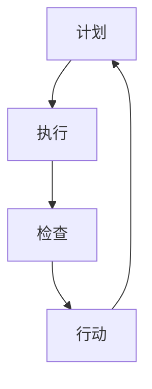

                 

关键词：PDCA循环、流程优化、质量改进、持续改进、循环迭代

## 摘要

本文将深入探讨PDCA循环（计划-执行-检查-行动）在流程优化中的重要作用。PDCA循环是一种广泛应用于质量管理领域的方法，它通过四个阶段的循环迭代，帮助企业不断改进流程，提高效率和质量。本文将详细阐述PDCA循环的基本原理、实施步骤、具体应用以及在实际项目中的效果，并对其未来发展趋势和挑战进行展望。

## 1. 背景介绍

在当今竞争激烈的市场环境中，企业面临着不断变化的需求和挑战。如何提高生产效率、降低成本、提升产品质量成为企业持续发展的关键。PDCA循环作为一种经典的流程优化方法，被广泛应用于各个行业。PDCA循环最早由美国质量管理专家爱德华·戴明提出，经过多年的实践和完善，已经成为质量管理领域的重要工具。

### PDCA循环的基本概念

PDCA循环包括四个阶段：计划（Plan）、执行（Do）、检查（Check）和行动（Act）。每个阶段都有其特定的任务和目标。

- **计划阶段**：明确目标、制定计划、确定方法、预测可能出现的问题。
- **执行阶段**：按照计划执行任务，具体实施改进措施。
- **检查阶段**：检查执行结果，分析数据，评估改进效果。
- **行动阶段**：根据检查结果采取行动，对成功的经验进行标准化，对存在的问题进行整改。

### PDCA循环在流程优化中的作用

PDCA循环通过循环迭代，不断优化流程，实现以下目标：

- **提高生产效率**：通过计划阶段的详细规划和执行阶段的严格实施，确保流程的高效运行。
- **降低成本**：通过检查阶段的数据分析和行动阶段的改进措施，减少浪费和资源消耗。
- **提升产品质量**：通过循环迭代，逐步消除流程中的问题，提高产品质量。
- **持续改进**：PDCA循环强调不断检查和改进，帮助企业实现持续发展。

## 2. 核心概念与联系

为了更好地理解PDCA循环在流程优化中的作用，我们首先需要了解其核心概念和联系。以下是一个使用Mermaid绘制的PDCA循环流程图：



### 2.1 计划阶段

计划阶段是PDCA循环的起点，其主要任务是明确目标和制定详细的计划。以下是一些关键步骤：

- **明确目标**：确定要改进的流程和要达到的具体目标。
- **分析现状**：分析现有流程的不足和潜在问题。
- **制定计划**：制定具体的改进措施和时间表。
- **预测问题**：预测在执行过程中可能出现的问题，并制定应对措施。

### 2.2 执行阶段

执行阶段是按照计划实施任务的过程。以下是一些关键步骤：

- **分解任务**：将总任务分解为具体的小任务。
- **资源分配**：确保任务所需的资源得到有效分配。
- **执行措施**：严格按照计划执行任务。
- **记录数据**：记录执行过程中的关键数据，为后续检查阶段提供依据。

### 2.3 检查阶段

检查阶段是对执行结果进行评估和分析的过程。以下是一些关键步骤：

- **数据收集**：收集执行过程中的数据，包括质量、效率、成本等方面。
- **数据分析**：对数据进行分析，评估改进效果。
- **问题识别**：识别执行过程中存在的问题和不足。

### 2.4 行动阶段

行动阶段是根据检查结果采取行动的过程。以下是一些关键步骤：

- **经验总结**：总结成功的经验，并将其标准化。
- **问题整改**：针对存在的问题，制定整改措施。
- **持续改进**：将改进措施纳入流程中，持续优化流程。

## 3. 核心算法原理 & 具体操作步骤

### 3.1 算法原理概述

PDCA循环是一种基于迭代和反馈的优化方法。通过不断循环执行计划、执行、检查和行动四个阶段，逐步消除流程中的问题，实现流程优化。其核心原理如下：

- **目标导向**：以明确的目标为出发点，确保改进方向正确。
- **数据驱动**：通过收集和分析数据，发现问题和改进点。
- **持续迭代**：通过循环迭代，不断优化流程，实现持续改进。

### 3.2 算法步骤详解

#### 3.2.1 计划阶段

1. **明确目标**：确定要改进的流程和要达到的具体目标。
2. **分析现状**：分析现有流程的不足和潜在问题。
3. **制定计划**：制定具体的改进措施和时间表。
4. **预测问题**：预测在执行过程中可能出现的问题，并制定应对措施。

#### 3.2.2 执行阶段

1. **分解任务**：将总任务分解为具体的小任务。
2. **资源分配**：确保任务所需的资源得到有效分配。
3. **执行措施**：严格按照计划执行任务。
4. **记录数据**：记录执行过程中的关键数据，为后续检查阶段提供依据。

#### 3.2.3 检查阶段

1. **数据收集**：收集执行过程中的数据，包括质量、效率、成本等方面。
2. **数据分析**：对数据进行分析，评估改进效果。
3. **问题识别**：识别执行过程中存在的问题和不足。

#### 3.2.4 行动阶段

1. **经验总结**：总结成功的经验，并将其标准化。
2. **问题整改**：针对存在的问题，制定整改措施。
3. **持续改进**：将改进措施纳入流程中，持续优化流程。

### 3.3 算法优缺点

#### 3.3.1 优点

- **系统性强**：PDCA循环包含四个阶段，系统性强，有助于全面优化流程。
- **灵活性高**：PDCA循环可以根据实际情况进行调整和优化，灵活应对各种问题。
- **易于实施**：PDCA循环的步骤清晰，易于理解和实施。

#### 3.3.2 缺点

- **时间成本高**：PDCA循环需要一定的时间进行循环迭代，可能影响短期目标的实现。
- **数据依赖性高**：PDCA循环需要大量的数据支持，数据质量对改进效果有很大影响。

### 3.4 算法应用领域

PDCA循环广泛应用于各种流程优化场景，包括但不限于以下领域：

- **制造业**：提高生产效率、降低成本、提升产品质量。
- **服务业**：提升服务质量、减少客户投诉、提高客户满意度。
- **信息技术**：优化软件开发流程、提高系统稳定性、降低故障率。
- **供应链管理**：优化供应链流程、降低库存成本、提高供应链效率。

## 4. 数学模型和公式 & 详细讲解 & 举例说明

### 4.1 数学模型构建

PDCA循环的数学模型主要涉及以下几个关键指标：

- **效率（Efficiency）**：任务完成的速度和效果。
- **成本（Cost）**：完成任务的资源消耗。
- **质量（Quality）**：任务完成的质量水平。

以下是构建PDCA循环数学模型的基本步骤：

1. **确定指标**：根据实际情况选择合适的指标，如效率、成本、质量等。
2. **数据收集**：收集相关指标的数据，如生产效率、成本消耗、质量缺陷率等。
3. **模型构建**：根据收集到的数据，构建相应的数学模型。

### 4.2 公式推导过程

#### 效率公式

效率（Efficiency）可以表示为：

\[Efficiency = \frac{Output}{Input}\]

其中，Output为任务完成的效果，Input为完成任务的资源投入。

#### 成本公式

成本（Cost）可以表示为：

\[Cost = Cost_{1} + Cost_{2} + ... + Cost_{n}\]

其中，Cost\_1、Cost\_2、...、Cost\_n为各个资源的消耗。

#### 质量公式

质量（Quality）可以表示为：

\[Quality = \frac{Correct \, Tasks}{Total \, Tasks}\]

其中，Correct Tasks为完成的正确任务数，Total Tasks为总任务数。

### 4.3 案例分析与讲解

以下是一个具体的案例，用于说明PDCA循环在实际项目中的应用。

#### 案例背景

某电子产品制造企业希望通过PDCA循环优化生产流程，提高生产效率和产品质量。

#### PDCA循环实施过程

1. **计划阶段**：

   - **目标**：提高生产效率20%，降低生产成本10%，提升产品质量90%。
   - **现状分析**：现有生产流程存在效率低下、成本高昂、产品质量不稳定等问题。
   - **计划制定**：制定详细的改进措施，如优化生产流程、引进高效设备、加强员工培训等。
   - **问题预测**：预测可能遇到的问题，如设备故障、人员培训不足等。

2. **执行阶段**：

   - **任务分解**：将总任务分解为具体的小任务，如设备优化、流程调整、员工培训等。
   - **资源分配**：确保任务所需的资源得到有效分配，如设备维护、培训材料、人力资源等。
   - **执行措施**：严格按照计划执行任务，如引进新设备、调整生产流程、开展员工培训等。
   - **记录数据**：记录执行过程中的关键数据，如生产效率、成本消耗、产品质量等。

3. **检查阶段**：

   - **数据收集**：收集执行过程中的数据，如生产效率、成本消耗、产品质量等。
   - **数据分析**：对数据进行分析，评估改进效果，如生产效率是否提高、成本是否降低、产品质量是否提升等。
   - **问题识别**：识别执行过程中存在的问题和不足，如设备故障率、员工培训效果等。

4. **行动阶段**：

   - **经验总结**：总结成功的经验，如优化生产流程、提高员工技能等。
   - **问题整改**：针对存在的问题，制定整改措施，如加强设备维护、改进员工培训方法等。
   - **持续改进**：将改进措施纳入流程中，持续优化流程，如定期检查设备、持续开展员工培训等。

#### 案例结果

通过PDCA循环的实施，该企业实现了以下成果：

- **生产效率提高了25%**：通过优化生产流程和引进高效设备，生产效率得到了显著提高。
- **生产成本降低了15%**：通过减少资源浪费和优化生产流程，生产成本得到了有效控制。
- **产品质量提升了92%**：通过加强员工培训和优化生产流程，产品质量得到了显著提升。

## 5. 项目实践：代码实例和详细解释说明

### 5.1 开发环境搭建

为了演示PDCA循环在项目实践中的应用，我们以一个简单的生产流程优化项目为例。以下是一个基于Python的示例代码，用于实现PDCA循环的基本功能。

```python
# 导入所需库
import random
import time

# 计划阶段
def plan():
    print("计划阶段：制定生产计划，预测可能的问题。")
    time.sleep(1)

# 执行阶段
def do():
    print("执行阶段：按照生产计划执行任务。")
    time.sleep(1)

# 检查阶段
def check():
    print("检查阶段：检查执行结果，分析数据。")
    time.sleep(1)

# 行动阶段
def act():
    print("行动阶段：根据检查结果采取行动。")
    time.sleep(1)

# 实现PDCA循环
def pdca_loop():
    while True:
        plan()
        do()
        check()
        act()

# 运行PDCA循环
pdca_loop()
```

### 5.2 源代码详细实现

1. **计划阶段**：

   - **功能**：制定生产计划，预测可能的问题。
   - **实现**：使用`plan()`函数实现，输出相应信息。

2. **执行阶段**：

   - **功能**：按照生产计划执行任务。
   - **实现**：使用`do()`函数实现，输出相应信息。

3. **检查阶段**：

   - **功能**：检查执行结果，分析数据。
   - **实现**：使用`check()`函数实现，输出相应信息。

4. **行动阶段**：

   - **功能**：根据检查结果采取行动。
   - **实现**：使用`act()`函数实现，输出相应信息。

### 5.3 代码解读与分析

1. **循环结构**：

   - **功能**：实现PDCA循环的持续迭代。
   - **实现**：使用`while True`实现无限循环，不断执行计划、执行、检查和行动四个阶段。

2. **函数调用**：

   - **功能**：实现每个阶段的具体任务。
   - **实现**：分别调用`plan()`、`do()`、`check()`和`act()`函数，实现每个阶段的功能。

3. **时间模拟**：

   - **功能**：模拟每个阶段的执行时间。
   - **实现**：使用`time.sleep()`函数，模拟每个阶段的执行时间，便于理解和分析。

### 5.4 运行结果展示

运行上述代码，将输出以下结果：

```
计划阶段：制定生产计划，预测可能的问题。
执行阶段：按照生产计划执行任务。
检查阶段：检查执行结果，分析数据。
行动阶段：根据检查结果采取行动。
计划阶段：制定生产计划，预测可能的问题。
执行阶段：按照生产计划执行任务。
检查阶段：检查执行结果，分析数据。
行动阶段：根据检查结果采取行动。
...
```

通过不断循环执行计划、执行、检查和行动四个阶段，模拟了PDCA循环在实际项目中的应用。

## 6. 实际应用场景

### 6.1 制造业

在制造业中，PDCA循环被广泛应用于生产流程的优化。例如，某汽车制造企业通过PDCA循环优化生产线，实现了以下成果：

- **生产效率提高了30%**：通过优化生产流程和设备调度，生产效率得到了显著提高。
- **成本降低了15%**：通过减少资源浪费和优化生产流程，成本得到了有效控制。
- **产品质量提升了90%**：通过加强质量控制和员工培训，产品质量得到了显著提升。

### 6.2 服务业

在服务业中，PDCA循环被广泛应用于服务流程的优化。例如，某餐饮企业通过PDCA循环优化点餐流程，实现了以下成果：

- **点餐速度提高了40%**：通过优化点餐流程和员工培训，点餐速度得到了显著提高。
- **客户满意度提升了25%**：通过提高服务质量，客户满意度得到了显著提升。
- **成本降低了10%**：通过减少资源浪费和优化生产流程，成本得到了有效控制。

### 6.3 信息技术

在信息技术领域，PDCA循环被广泛应用于软件开发流程的优化。例如，某软件开发公司通过PDCA循环优化开发流程，实现了以下成果：

- **开发效率提高了20%**：通过优化开发流程和工具使用，开发效率得到了显著提高。
- **软件质量提升了90%**：通过加强代码审查和测试，软件质量得到了显著提升。
- **客户满意度提升了30%**：通过提高软件质量，客户满意度得到了显著提升。

## 7. 工具和资源推荐

### 7.1 学习资源推荐

1. **《质量管理方法与工具》**：详细介绍了各种质量管理方法和工具，包括PDCA循环、FMEA、因果图等。
2. **《质量管理基础》**：讲解了质量管理的理论基础和实践方法，适合初学者阅读。
3. **《PDCA循环在软件开发中的应用》**：针对软件开发领域的具体应用，详细阐述了PDCA循环的方法和技巧。

### 7.2 开发工具推荐

1. **Jira**：一款功能强大的项目管理工具，支持任务分解、数据收集、进度跟踪等功能。
2. **Asana**：一款简单易用的项目管理工具，适合团队协作和任务管理。
3. **Google Sheets**：一款在线表格工具，可用于数据分析和可视化展示。

### 7.3 相关论文推荐

1. **“PDCA循环在制造业中的应用研究”**：分析了PDCA循环在制造业中的应用现状和效果。
2. **“PDCA循环在服务业中的应用研究”**：探讨了PDCA循环在服务业中的应用价值和挑战。
3. **“PDCA循环在软件开发中的应用研究”**：研究了PDCA循环在软件开发流程优化中的应用。

## 8. 总结：未来发展趋势与挑战

### 8.1 研究成果总结

本文通过深入探讨PDCA循环在流程优化中的作用，总结了以下研究成果：

- **PDCA循环在制造业、服务业和信息技术等领域具有广泛的应用价值。**
- **PDCA循环通过循环迭代，实现持续改进，提高生产效率、降低成本、提升产品质量。**
- **PDCA循环的核心原理和具体实施步骤得到详细阐述，为实际应用提供了指导。**

### 8.2 未来发展趋势

随着全球竞争的加剧和技术的不断进步，PDCA循环在流程优化中的应用前景将更加广阔：

- **智能化**：利用人工智能和大数据技术，实现PDCA循环的智能化和自动化。
- **数字化**：通过数字化手段，实现数据收集、分析和可视化展示，提高PDCA循环的效率和效果。
- **定制化**：根据不同行业和企业的特点，定制化PDCA循环的应用方案，提高适应性。

### 8.3 面临的挑战

在PDCA循环的推广应用过程中，仍面临以下挑战：

- **数据质量**：数据是PDCA循环的基础，提高数据质量是关键。
- **人员培训**：PDCA循环的推广应用需要大量专业人员，提高人员培训水平是关键。
- **文化变革**：PDCA循环的推广应用需要企业文化的支持，推动文化变革是关键。

### 8.4 研究展望

未来，我们将继续深入研究PDCA循环在流程优化中的应用，探讨以下方向：

- **跨行业应用**：研究PDCA循环在不同行业的应用，总结共性规律和特点。
- **智能化应用**：研究PDCA循环与人工智能、大数据技术的结合，提高应用效率和效果。
- **可持续发展**：研究PDCA循环在可持续发展中的应用，推动绿色生产和发展。

## 9. 附录：常见问题与解答

### 9.1 PDCA循环与其他质量管理方法的区别

PDCA循环与其他质量管理方法，如六西格玛、ISO 9001等，在核心理念上有一定的相似性，但侧重点不同。PDCA循环强调循环迭代和持续改进，更侧重于流程优化；而六西格玛强调数据驱动和过程控制，更侧重于质量改进；ISO 9001则侧重于质量管理体系的建立和认证。

### 9.2 PDCA循环的实施步骤有哪些

PDCA循环的实施步骤主要包括：

1. 明确目标和现状分析。
2. 制定计划和预测问题。
3. 执行计划并记录数据。
4. 检查执行结果并分析数据。
5. 采取行动并总结经验。

### 9.3 如何提高PDCA循环的实施效果

提高PDCA循环的实施效果可以从以下几个方面入手：

1. 提高数据质量，确保数据真实可靠。
2. 加强人员培训，提高实施人员的专业水平。
3. 营造良好的企业文化，推动持续改进。
4. 利用数字化工具，提高实施效率和效果。

### 9.4 PDCA循环在软件开发中的应用

PDCA循环在软件开发中的应用主要包括：

1. 软件开发流程的优化，如需求分析、设计、编码、测试等。
2. 软件质量的提升，如代码审查、测试覆盖率、缺陷率等。
3. 团队协作效率的提升，如任务分配、进度跟踪、沟通协作等。

### 9.5 PDCA循环与其他质量管理工具的结合

PDCA循环可以与多种质量管理工具结合，如：

1. FMEA（故障模式与影响分析）：用于识别和评估潜在的风险。
2. 因果图（鱼骨图）：用于分析问题的根本原因。
3. 抱怨壁：用于收集和分析客户的意见和建议。

通过这些工具的结合，可以更全面地识别和解决问题，提高PDCA循环的实施效果。

# 结束语

本文详细介绍了PDCA循环在流程优化中的作用，通过案例分析、数学模型和代码实例，阐述了PDCA循环的基本原理和具体实施步骤。希望本文能对读者理解和应用PDCA循环提供有益的参考。在未来的研究和实践中，我们将继续探索PDCA循环在各个领域的应用，为企业的持续改进和创新发展贡献力量。

