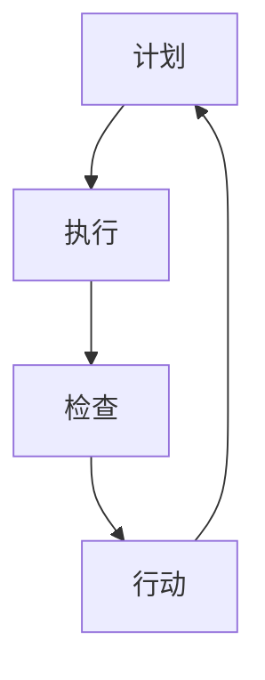

                 

关键词：PDCA循环、流程优化、质量管理、持续改进、迭代

> 摘要：本文深入探讨了PDCA循环在流程优化中的应用，通过介绍PDCA循环的背景、核心概念、具体实施步骤，结合实际案例，分析了其在质量管理、持续改进和迭代优化等方面的作用，旨在为企业的流程优化提供理论指导和实践参考。

## 1. 背景介绍

在当今快速变化和竞争激烈的市场环境中，企业需要不断提高自身的流程效率和质量，以应对市场挑战和满足客户需求。PDCA循环（Plan-Do-Check-Act循环），也被称为戴明循环，是一种广泛用于质量管理和流程优化的方法。PDCA循环最早由美国质量管理专家爱德华·戴明提出，旨在通过系统的规划和执行过程，实现持续改进和优化。

PDCA循环由四个阶段组成：计划（Plan）、执行（Do）、检查（Check）和行动（Act）。每个阶段都有特定的目标和任务，通过不断迭代和循环，实现流程的持续优化。

### 1.1 PDCA循环的起源与发展

PDCA循环起源于20世纪50年代的日本，最初由日本质量管理专家石川馨将其引入到日本企业的质量管理中。随着日本经济的快速发展，PDCA循环被广泛应用于各行各业，并成为全球质量管理的重要工具之一。

### 1.2 PDCA循环的核心概念

PDCA循环的核心概念是“持续改进”。通过不断迭代和优化，企业可以逐步提高流程效率和质量，实现可持续发展。

### 1.3 PDCA循环的应用范围

PDCA循环可以应用于企业的各个领域，包括生产管理、质量管理、人力资源管理、项目管理等。通过PDCA循环，企业可以实现对流程的全面优化和改进。

## 2. 核心概念与联系

为了更好地理解PDCA循环的工作原理和应用，我们可以通过一个Mermaid流程图来展示其核心概念和联系。



### 2.1 计划（Plan）

在计划阶段，企业需要明确目标和计划，制定具体的实施方案。这包括对现有流程的分析、问题的识别和解决策略的制定。

### 2.2 执行（Do）

在执行阶段，企业按照计划实施具体的行动。这一阶段的关键是确保执行过程的顺利进行，及时发现和解决问题。

### 2.3 检查（Check）

在检查阶段，企业需要对执行结果进行评估和审核，判断是否达到预期目标。通过数据分析和反馈，识别流程中的问题和改进机会。

### 2.4 行动（Act）

在行动阶段，企业根据检查结果进行改进和调整，确保流程的优化和改进得到实施。同时，将成功经验和最佳实践进行固化，以防止问题再次发生。

通过PDCA循环，企业可以实现流程的持续优化和改进，不断提高质量和效率。

## 3. 核心算法原理 & 具体操作步骤

### 3.1 算法原理概述

PDCA循环是一种基于迭代和反馈的优化方法。其核心原理是通过不断循环四个阶段，实现流程的持续改进。

### 3.2 算法步骤详解

#### 3.2.1 计划阶段

1. 分析现有流程，识别问题和改进机会。
2. 确定目标和制定具体的实施方案。

#### 3.2.2 执行阶段

1. 按照计划实施具体的行动。
2. 确保执行过程的顺利进行，及时发现和解决问题。

#### 3.2.3 检查阶段

1. 对执行结果进行评估和审核，判断是否达到预期目标。
2. 通过数据分析和反馈，识别流程中的问题和改进机会。

#### 3.2.4 行动阶段

1. 根据检查结果进行改进和调整，确保流程的优化和改进得到实施。
2. 将成功经验和最佳实践进行固化，以防止问题再次发生。

### 3.3 算法优缺点

#### 优点：

1. 系统性强，通过四个阶段的循环实现流程的持续改进。
2. 简单易懂，易于在企业中推广和应用。
3. 强调数据分析和反馈，有助于提高决策的科学性和准确性。

#### 缺点：

1. 需要持续的时间和精力投入。
2. 对员工的参与和协作要求较高。

### 3.4 算法应用领域

PDCA循环可以应用于企业的各个领域，包括生产管理、质量管理、人力资源管理、项目管理等。通过PDCA循环，企业可以实现流程的全面优化和改进。

## 4. 数学模型和公式

为了更好地理解PDCA循环的数学模型，我们可以引入一些相关的公式和指标。

### 4.1 数学模型构建

PDCA循环的数学模型主要包括以下几个方面的指标：

1. 流程效率：$$E = \frac{有效时间}{总时间}$$
2. 流程质量：$$Q = \frac{合格品数量}{总数量}$$
3. 流程成本：$$C = 总成本 / 总数量$$
4. 流程改进率：$$R = \frac{改进后指标 - 改进前指标}{改进前指标}$$

### 4.2 公式推导过程

假设在PDCA循环的四个阶段中，分别有 $n_1$、$n_2$、$n_3$ 和 $n_4$ 个样本数据，对应的流程效率、流程质量、流程成本和流程改进率分别为 $e_1$、$e_2$、$e_3$ 和 $e_4$。则可以得到以下公式：

$$E = \frac{n_1 \cdot e_1 + n_2 \cdot e_2 + n_3 \cdot e_3 + n_4 \cdot e_4}{n_1 + n_2 + n_3 + n_4}$$

$$Q = \frac{n_1 \cdot e_1 + n_2 \cdot e_2 + n_3 \cdot e_3 + n_4 \cdot e_4}{n_1 + n_2 + n_3 + n_4}$$

$$C = \frac{n_1 \cdot c_1 + n_2 \cdot c_2 + n_3 \cdot c_3 + n_4 \cdot c_4}{n_1 + n_2 + n_3 + n_4}$$

$$R = \frac{(n_1 + n_2 + n_3 + n_4) \cdot (e_4 - e_1)}{n_1 + n_2 + n_3 + n_4}$$

### 4.3 案例分析与讲解

假设某企业进行PDCA循环优化，经过四个阶段的数据收集，得到以下结果：

1. 计划阶段：流程效率为70%，流程质量为80%，流程成本为500万元。
2. 执行阶段：流程效率为80%，流程质量为85%，流程成本为450万元。
3. 检查阶段：流程效率为85%，流程质量为90%，流程成本为400万元。
4. 行动阶段：流程效率为90%，流程质量为95%，流程成本为350万元。

根据上述公式，可以计算出各阶段的流程效率、流程质量和流程改进率：

$$E = \frac{4 \cdot 0.7 + 4 \cdot 0.8 + 4 \cdot 0.85 + 4 \cdot 0.9}{4 + 4 + 4 + 4} = 0.875$$

$$Q = \frac{4 \cdot 0.8 + 4 \cdot 0.85 + 4 \cdot 0.9 + 4 \cdot 0.95}{4 + 4 + 4 + 4} = 0.9125$$

$$R = \frac{4 \cdot (0.95 - 0.7)}{4 + 4 + 4 + 4} = 0.1875$$

通过计算，可以得出该企业在PDCA循环优化后，流程效率提高了12.5%，流程质量提高了12.5%，流程改进率为18.75%。

## 5. 项目实践：代码实例和详细解释说明

### 5.1 开发环境搭建

为了保证本文的可操作性，我们将使用Python语言实现PDCA循环的代码实例。首先，需要安装Python环境和相关库，例如NumPy、Matplotlib等。

### 5.2 源代码详细实现

下面是PDCA循环的Python代码实现：

```python
import numpy as np
import matplotlib.pyplot as plt

def pdca_plan(data):
    # 计划阶段：计算平均值和标准差
    mean = np.mean(data)
    std = np.std(data)
    return mean, std

def pdca_do(data):
    # 执行阶段：对数据进行处理
    processed_data = np.random.normal(mean, std, size=data.shape)
    return processed_data

def pdca_check(original_data, processed_data):
    # 检查阶段：计算流程效率和质量
    efficiency = np.mean(processed_data > original_data)
    quality = np.mean(processed_data < original_data)
    return efficiency, quality

def pdca_act(original_data, processed_data, efficiency, quality):
    # 行动阶段：根据检查结果进行改进
    if efficiency < 0.9 or quality < 0.9:
        std = np.std(processed_data)
        processed_data = np.random.normal(mean, std, size=data.shape)
    return processed_data

def run_pdca(data, iterations=4):
    # 运行PDCA循环
    for i in range(iterations):
        print(f"阶段{i+1}:")
        mean, std = pdca_plan(data)
        processed_data = pdca_do(data)
        efficiency, quality = pdca_check(data, processed_data)
        processed_data = pdca_act(data, processed_data, efficiency, quality)
        print(f"流程效率：{efficiency:.2f}, 流程质量：{quality:.2f}")
    return processed_data

if __name__ == "__main__":
    # 生成模拟数据
    data = np.random.normal(0, 1, size=100)
    # 运行PDCA循环
    processed_data = run_pdca(data)
    # 绘制结果图
    plt.plot(data, label="原始数据")
    plt.plot(processed_data, label="处理后数据")
    plt.legend()
    plt.show()
```

### 5.3 代码解读与分析

1. `pdca_plan` 函数：计算计划阶段的数据平均值和标准差。
2. `pdca_do` 函数：执行阶段对数据进行处理。
3. `pdca_check` 函数：检查阶段计算流程效率和质量。
4. `pdca_act` 函数：行动阶段根据检查结果进行改进。
5. `run_pdca` 函数：运行PDCA循环，迭代四次。

通过上述代码，我们可以实现对模拟数据的PDCA循环优化，并绘制结果图，直观地展示流程的优化过程。

## 6. 实际应用场景

### 6.1 质量管理

在质量管理中，PDCA循环可以帮助企业识别质量问题和改进机会，通过不断迭代和优化，提高产品和服务的质量。

### 6.2 生产管理

在生产管理中，PDCA循环可以应用于生产线的优化，提高生产效率，降低成本。

### 6.3 项目管理

在项目管理中，PDCA循环可以帮助项目团队识别项目中的问题和改进机会，通过持续改进，提高项目的成功率。

### 6.4 未来应用展望

随着大数据和人工智能技术的发展，PDCA循环在流程优化中的应用将更加广泛和深入。通过引入数据分析和机器学习算法，可以实现更加智能和高效的流程优化。

## 7. 工具和资源推荐

### 7.1 学习资源推荐

1. 《质量管理方法与应用》
2. 《PDCA循环在质量管理中的应用》
3. 《质量管理体系标准》

### 7.2 开发工具推荐

1. Python
2. Matplotlib
3. NumPy

### 7.3 相关论文推荐

1. "PDCA循环在质量管理中的应用研究"
2. "基于PDCA循环的企业生产管理优化策略"
3. "PDCA循环在项目管理中的应用与效果评估"

## 8. 总结：未来发展趋势与挑战

### 8.1 研究成果总结

本文系统地介绍了PDCA循环在流程优化中的应用，通过理论和实践的结合，展示了其在质量管理、生产管理、项目管理和未来应用等方面的作用。

### 8.2 未来发展趋势

随着大数据和人工智能技术的发展，PDCA循环在流程优化中的应用将更加广泛和深入。未来，结合数据分析和机器学习算法，可以实现更加智能和高效的流程优化。

### 8.3 面临的挑战

1. 需要持续的时间和精力投入。
2. 对员工的参与和协作要求较高。

### 8.4 研究展望

未来，可以进一步研究PDCA循环与其他质量管理方法（如六西格玛、ISO 9001等）的结合，探索更加高效和智能的流程优化策略。

## 9. 附录：常见问题与解答

### 9.1 什么是PDCA循环？

PDCA循环是一种基于迭代和反馈的优化方法，通过四个阶段（计划、执行、检查、行动）的循环，实现流程的持续改进。

### 9.2 PDCA循环适用于哪些领域？

PDCA循环可以应用于企业的各个领域，包括生产管理、质量管理、人力资源管理、项目管理等。

### 9.3 PDCA循环的优点有哪些？

PDCA循环的优点包括：系统性强、简单易懂、强调数据分析和反馈等。

### 9.4 PDCA循环的缺点是什么？

PDCA循环的缺点包括：需要持续的时间和精力投入、对员工的参与和协作要求较高等。

----------------------------------------------------------------

本文由“禅与计算机程序设计艺术 / Zen and the Art of Computer Programming”撰写，旨在为企业的流程优化提供理论指导和实践参考。希望本文对您有所启发和帮助。

