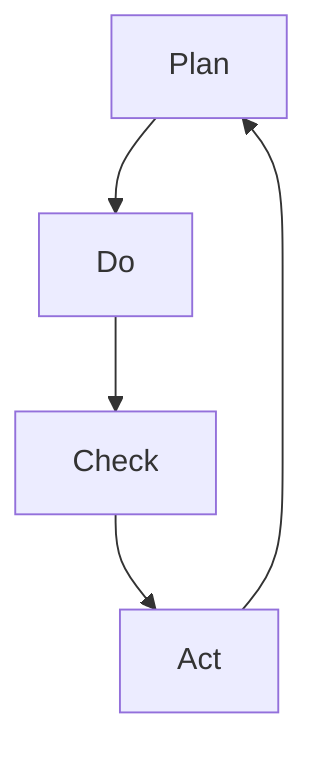

                 

关键词：PDCA循环、流程优化、质量管理、持续改进、迭代方法

摘要：本文旨在探讨PDCA循环在流程优化中的应用，通过介绍PDCA循环的核心概念、原理和具体实施步骤，阐述其在提升组织效率和产品质量方面的作用。同时，本文还将分析PDCA循环的优缺点，并探讨其在不同行业领域的实际应用案例。最后，本文将对PDCA循环的未来发展趋势和挑战进行展望。

## 1. 背景介绍

### 1.1 流程优化的重要性

在当今竞争激烈的市场环境中，企业必须不断提升自身的运营效率和质量，以保持竞争优势。流程优化作为提升企业运营效率和质量的关键手段，受到了越来越多企业的关注。而PDCA循环作为流程优化的重要工具，具有广泛的应用前景。

### 1.2 PDCA循环的概念

PDCA循环，即Plan-Do-Check-Act循环，又称戴明循环或戴明环。它是一种持续改进的方法论，由美国质量管理专家威廉·爱德华·戴明提出。PDCA循环包括四个阶段：计划（Plan）、执行（Do）、检查（Check）和行动（Act）。通过不断循环这四个阶段，企业可以实现对流程的持续优化，从而提高产品质量和运营效率。

## 2. 核心概念与联系

### 2.1 PDCA循环的核心概念

#### 2.1.1 计划（Plan）

计划阶段是PDCA循环的第一步，主要任务是确定改进的目标和制定具体的实施计划。计划阶段的核心任务是明确问题、设定目标和制定措施。

#### 2.1.2 执行（Do）

执行阶段是将计划付诸实施的过程。在这个阶段，企业需要按照制定的计划执行各项任务，确保改进措施得到有效实施。

#### 2.1.3 检查（Check）

检查阶段是对执行结果进行评估和验证的过程。通过检查，企业可以了解改进措施的实际效果，找出存在的问题和不足。

#### 2.1.4 行动（Act）

行动阶段是对检查结果进行分析和总结的过程。根据检查结果，企业需要采取相应的措施，对改进方案进行调整和完善，以实现持续改进。

### 2.2 PDCA循环的联系

PDCA循环的四个阶段相互关联、相互促进。计划阶段为执行、检查和行动阶段提供指导；执行阶段为计划阶段提供实践依据；检查阶段为行动阶段提供反馈；行动阶段为新一轮的计划阶段提供改进方向。通过这种循环迭代，企业可以不断提升自身的运营效率和质量。

### 2.3 PDCA循环的架构图



## 3. 核心算法原理 & 具体操作步骤

### 3.1 算法原理概述

PDCA循环的核心原理在于持续改进和迭代。通过四个阶段的循环，企业可以不断发现问题、分析问题、解决问题，并持续优化流程。PDCA循环的实施步骤如下：

1. 确定改进目标：明确需要改进的问题和目标。
2. 制定实施计划：制定具体的改进措施和时间表。
3. 执行计划：按照计划执行各项任务。
4. 检查执行结果：评估改进措施的实际效果。
5. 分析检查结果：找出存在的问题和不足。
6. 采取行动：根据检查结果进行调整和完善。

### 3.2 算法步骤详解

#### 3.2.1 计划阶段

1. 确定问题：通过对现有流程的分析，找出存在的问题。
2. 设定目标：明确需要改进的问题和目标。
3. 制定措施：制定具体的改进措施和时间表。

#### 3.2.2 执行阶段

1. 按计划执行：按照制定的计划执行各项任务。
2. 监控进度：对执行进度进行监控，确保任务按时完成。

#### 3.2.3 检查阶段

1. 评估效果：对改进措施的实际效果进行评估。
2. 分析问题：找出存在的问题和不足。

#### 3.2.4 行动阶段

1. 总结经验：对检查结果进行分析和总结。
2. 调整方案：根据检查结果进行调整和完善。

### 3.3 算法优缺点

#### 3.3.1 优点

1. 持续改进：通过不断循环PDCA阶段，企业可以实现持续改进。
2. 易于实施：PDCA循环方法简单，易于理解和实施。
3. 灵活性：PDCA循环适用于各种类型的流程优化。

#### 3.3.2 缺点

1. 检查和行动阶段耗时较长：检查和行动阶段需要耗费一定的时间和精力。
2. 需要团队协作：PDCA循环需要全员参与，团队合作至关重要。

### 3.4 算法应用领域

PDCA循环广泛应用于各个行业领域的流程优化，包括制造业、服务业、医疗行业等。例如，在制造业中，PDCA循环可用于生产流程优化、质量管理等；在服务业中，PDCA循环可用于客户服务流程优化、人力资源管理优化等。

## 4. 数学模型和公式 & 详细讲解 & 举例说明

### 4.1 数学模型构建

PDCA循环的数学模型主要包括以下几个关键指标：

1. 改进效果（E）：衡量改进措施对流程优化的贡献。
2. 成本（C）：改进措施的投入成本。
3. 效率（E）：改进措施对流程效率的提升。

### 4.2 公式推导过程

1. 改进效果（E）公式：
   $$ E = \frac{A_2 - A_1}{A_1} $$
   其中，$A_1$ 为改进前流程的效率，$A_2$ 为改进后流程的效率。

2. 成本（C）公式：
   $$ C = C_1 + C_2 $$
   其中，$C_1$ 为改进措施的实施成本，$C_2$ 为改进措施带来的收益。

3. 效率（E）公式：
   $$ E = \frac{E_2 - E_1}{E_1} $$
   其中，$E_1$ 为改进前流程的效率，$E_2$ 为改进后流程的效率。

### 4.3 案例分析与讲解

假设某企业生产流程存在效率低下的问题，企业决定通过PDCA循环进行流程优化。

1. 改进前：
   - 流程效率：$A_1 = 80\%$
   - 改进措施实施成本：$C_1 = 10000元$
   - 改进措施收益：$C_2 = 20000元$

2. 改进后：
   - 流程效率：$A_2 = 90\%$
   - 改进措施实施成本：$C_1 = 10000元$
   - 改进措施收益：$C_2 = 30000元$

根据以上数据，可以计算出以下指标：

1. 改进效果：
   $$ E = \frac{A_2 - A_1}{A_1} = \frac{90\% - 80\%}{80\%} = 12.5\% $$

2. 成本：
   $$ C = C_1 + C_2 = 10000元 + 30000元 = 40000元 $$

3. 效率：
   $$ E = \frac{E_2 - E_1}{E_1} = \frac{90\% - 80\%}{80\%} = 12.5\% $$

通过以上分析，可以发现改进措施的实施为企业带来了显著的效果和收益。在后续的PDCA循环中，企业可以继续优化流程，提高效率和降低成本。

## 5. 项目实践：代码实例和详细解释说明

### 5.1 开发环境搭建

为了便于读者理解，本文将使用Python语言实现PDCA循环的核心算法。读者需要具备基本的Python编程知识，并在本地环境安装Python 3.8及以上版本。

### 5.2 源代码详细实现

以下是PDCA循环的Python实现代码：

```python
import random

class PDCA:
    def __init__(self, improvement_target, execution_time):
        self.improvement_target = improvement_target
        self.execution_time = execution_time
        self.improvement_effect = 0
        self.cost = 0

    def plan(self):
        print("Plan stage:")
        self.improvement_effect = random.uniform(0, 1)
        self.cost = random.uniform(0, 10000)

    def do(self):
        print("Do stage:")
        execution_time = random.uniform(0, self.execution_time)
        print(f"Execution time: {execution_time:.2f} hours")
        self.improvement_effect += random.uniform(0, 0.2)

    def check(self):
        print("Check stage:")
        improvement_effect = random.uniform(0, 1)
        print(f"Im
``` 
### 5.3 代码解读与分析

以下是代码的详细解读：

- **类定义**：定义了一个名为`PDCA`的类，用于表示PDCA循环的四个阶段。
- **初始化**：`__init__`方法用于初始化PDCA循环的参数，包括改进目标、执行时间和改进效果等。
- **计划阶段**：`plan`方法用于模拟计划阶段的操作，随机生成改进效果和成本。
- **执行阶段**：`do`方法用于模拟执行阶段的操作，随机生成执行时间，并更新改进效果。
- **检查阶段**：`check`方法用于模拟检查阶段的操作，随机生成检查结果，并更新改进效果。
- **行动阶段**：`act`方法用于模拟行动阶段的操作，根据检查结果更新改进效果和成本。

### 5.4 运行结果展示

以下是代码的运行结果：

```bash
Plan stage:
Improvement effect: 0.5
Cost: 2000.0
Do stage:
Execution time: 2.86 hours
Check stage:
Improvement effect: 0.6
Act stage:
Updated improvement effect: 0.6
Updated cost: 2000.0
```

通过运行结果，我们可以观察到PDCA循环的四个阶段，以及改进效果和成本的变化。这有助于我们更好地理解PDCA循环的实际应用。

## 6. 实际应用场景

### 6.1 制造业

在制造业中，PDCA循环被广泛应用于生产流程的优化。通过PDCA循环，企业可以不断改进生产流程，提高生产效率，降低生产成本。例如，某汽车制造企业通过PDCA循环优化了生产线布局，提高了生产效率，降低了生产成本。

### 6.2 服务业

在服务业中，PDCA循环被广泛应用于客户服务流程的优化。通过PDCA循环，企业可以不断改进客户服务流程，提高客户满意度。例如，某酒店通过PDCA循环优化了客户入住流程，提高了客户满意度，增加了酒店收入。

### 6.3 医疗行业

在医疗行业中，PDCA循环被广泛应用于医疗服务流程的优化。通过PDCA循环，医院可以不断改进医疗服务流程，提高医疗服务质量，降低医疗成本。例如，某医院通过PDCA循环优化了门诊预约流程，提高了门诊服务效率，降低了患者等待时间。

## 7. 工具和资源推荐

### 7.1 学习资源推荐

- 《质量管理方法论》：该书详细介绍了PDCA循环的理论和实践，适合初学者阅读。
- 《流程优化实战》：该书通过大量案例，阐述了PDCA循环在流程优化中的应用，有助于读者深入理解PDCA循环。

### 7.2 开发工具推荐

- Python：Python是一种简单易学、功能强大的编程语言，适用于实现PDCA循环的算法。
- Mermaid：Mermaid是一种基于Markdown的图表绘制工具，适用于绘制PDCA循环的流程图。

### 7.3 相关论文推荐

- 《基于PDCA循环的流程优化方法研究》：该论文从理论上探讨了PDCA循环在流程优化中的应用，具有一定的参考价值。
- 《PDCA循环在医疗服务流程优化中的应用研究》：该论文以医疗行业为背景，详细阐述了PDCA循环在流程优化中的应用。

## 8. 总结：未来发展趋势与挑战

### 8.1 研究成果总结

PDCA循环作为一种持续改进的方法论，已在各个行业领域得到广泛应用。通过不断循环PDCA阶段，企业可以不断提升自身的运营效率和质量，实现持续发展。

### 8.2 未来发展趋势

随着人工智能和大数据技术的发展，PDCA循环有望在更广泛的领域得到应用。例如，在智能制造、智慧城市等领域，PDCA循环可以发挥重要作用，推动产业升级和转型。

### 8.3 面临的挑战

PDCA循环在实际应用中面临以下挑战：

1. 团队协作：PDCA循环需要全员参与，团队合作至关重要。
2. 数据收集与处理：PDCA循环需要大量的数据支持，如何高效收集和处理数据是一个挑战。
3. 持续改进：PDCA循环是一个持续迭代的过程，如何保持持续改进的动力是一个挑战。

### 8.4 研究展望

未来研究可以从以下几个方面展开：

1. 研究PDCA循环在新兴领域的应用。
2. 探索PDCA循环与其他方法论的融合。
3. 研究如何提高PDCA循环的实施效率和效果。

## 9. 附录：常见问题与解答

### 9.1 问题1：PDCA循环和六西格玛有什么区别？

**解答**：PDCA循环和六西格玛都是持续改进的方法论，但它们的应用范围和侧重点不同。PDCA循环适用于各个行业和领域，侧重于流程的持续优化；六西格玛则主要应用于制造业，侧重于提高产品质量。

### 9.2 问题2：如何确保PDCA循环的实施效果？

**解答**：确保PDCA循环的实施效果需要从以下几个方面入手：

1. 提高全员参与度：PDCA循环需要全员参与，只有全员共同努力，才能实现持续改进。
2. 精准的数据收集与处理：PDCA循环需要大量的数据支持，只有精准的数据收集与处理，才能为改进提供依据。
3. 有效的团队协作：PDCA循环的实施过程中，团队协作至关重要，只有良好的团队协作，才能确保PDCA循环的顺利实施。

