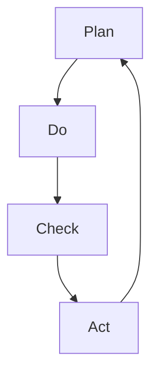

                 

### 摘要

本文深入探讨了PDCA循环在质量管理中的应用。PDCA循环，即计划（Plan）、执行（Do）、检查（Check）和行动（Act），是一种广泛应用于质量管理和持续改进的管理工具。文章首先介绍了PDCA循环的起源和基本原则，然后详细阐述了其在IT质量管理中的具体应用，包括项目规划、任务执行、质量检查和问题解决等环节。通过实际案例分析，本文揭示了PDCA循环在提升IT项目质量和效率方面的显著效果。最后，文章对未来PDCA循环在质量管理中的发展趋势和挑战进行了展望，为读者提供了宝贵的实践指导和启示。

### 1. 背景介绍

PDCA循环，全称为计划-执行-检查-行动循环，最早由美国质量管理专家爱德华兹·戴明提出。PDCA循环的核心思想是通过不断循环迭代，实现质量管理的持续改进。PDCA循环包括以下四个阶段：

- **计划（Plan）**：在这个阶段，定义质量目标和制定实现这些目标的计划。这包括确定质量标准、识别潜在问题和风险，以及制定预防措施。
- **执行（Do）**：在这个阶段，执行计划并实施具体的质量改进措施。这个阶段关注的是实际操作和执行，确保所有团队成员都清楚任务目标和执行步骤。
- **检查（Check）**：在这个阶段，对执行结果进行评估和检查，以确定实际结果是否符合计划目标。这包括收集数据、分析结果和评估改进效果。
- **行动（Act）**：在这个阶段，根据检查结果采取行动，对成功经验进行标准化，对存在的问题进行纠正和改进。这包括更新流程、修改标准，并制定新的行动计划。

PDCA循环在质量管理中的应用非常广泛，不仅在制造业中得到广泛应用，还在服务业、IT行业等多个领域取得了显著效果。在IT质量管理中，PDCA循环被用来确保项目开发过程中的质量控制和持续改进，从而提高项目的成功率。

### 2. 核心概念与联系

为了更好地理解PDCA循环在IT质量管理中的应用，我们需要通过Mermaid流程图来展示其核心概念和相互联系。以下是PDCA循环的Mermaid流程图表示：



在这个流程图中：

- **A[Plan]**：计划阶段，定义目标和制定计划。
- **B[Do]**：执行阶段，实施计划并执行任务。
- **C[Check]**：检查阶段，评估执行结果与目标的一致性。
- **D[Act]**：行动阶段，根据检查结果采取行动，进行改进。

PDCA循环的关键在于通过不断的循环迭代，实现对项目质量的持续监控和改进。以下是对PDCA循环在IT质量管理中各个阶段的具体描述：

#### 2.1 计划（Plan）

在项目启动阶段，首先需要明确项目的目标和范围。然后，根据项目目标和范围，制定详细的质量管理计划。这个计划包括以下内容：

- **质量目标**：确定项目的质量目标，如性能、可靠性、安全性等。
- **质量标准**：制定符合质量目标的具体标准，如测试覆盖率、缺陷率等。
- **风险识别**：识别项目实施过程中可能出现的风险，并制定相应的预防措施。
- **资源分配**：分配必要的资源，包括人力、时间和资金等。

#### 2.2 执行（Do）

在执行阶段，根据制定的质量管理计划，开始具体实施项目任务。这个阶段的关键是确保所有团队成员都清楚任务目标和执行步骤。具体操作包括：

- **任务分配**：将项目任务分配给团队成员，并明确每个人的职责和任务。
- **执行监控**：实时监控任务执行情况，确保任务按时完成并符合质量要求。
- **质量保障**：实施质量控制措施，如代码审查、测试等，确保项目质量。

#### 2.3 检查（Check）

在检查阶段，对执行结果进行评估和检查，以确定实际结果是否符合计划目标。这个阶段的核心是数据收集和分析。具体步骤包括：

- **数据收集**：收集项目执行过程中的各种数据，如缺陷报告、测试结果等。
- **结果分析**：对收集的数据进行分析，评估项目质量是否符合预期目标。
- **问题识别**：识别项目中的问题和不足之处，以便在下一个循环中进行改进。

#### 2.4 行动（Act）

在行动阶段，根据检查结果采取行动，对成功经验进行标准化，对存在的问题进行纠正和改进。具体操作包括：

- **经验总结**：总结项目执行过程中的成功经验和教训，形成标准化流程和文档。
- **问题解决**：针对检查阶段发现的问题，制定具体的解决方案并实施。
- **流程改进**：根据改进方案，对项目流程进行优化和调整，提高项目质量。

### 3. 核心算法原理 & 具体操作步骤

#### 3.1 算法原理概述

PDCA循环是一种迭代改进算法，其基本原理是通过不断循环迭代，实现对质量管理的持续改进。PDCA循环的四个阶段相互联系，形成一个闭环，确保项目质量不断优化。

- **计划（Plan）**：确定目标和计划，为执行阶段做好准备。
- **执行（Do）**：执行计划，实施具体操作。
- **检查（Check）**：评估执行结果，识别问题。
- **行动（Act）**：根据评估结果采取行动，进行改进。

#### 3.2 算法步骤详解

以下是PDCA循环的具体操作步骤：

1. **计划（Plan）**
   - **确定质量目标**：根据项目需求和预期结果，明确项目质量目标。
   - **制定质量管理计划**：根据质量目标，制定详细的质量管理计划，包括质量标准、风险识别和资源分配等。

2. **执行（Do）**
   - **任务分配**：将项目任务分配给团队成员，明确每个人的职责和任务。
   - **执行监控**：实时监控任务执行情况，确保任务按时完成并符合质量要求。
   - **质量保障**：实施质量控制措施，如代码审查、测试等，确保项目质量。

3. **检查（Check）**
   - **数据收集**：收集项目执行过程中的各种数据，如缺陷报告、测试结果等。
   - **结果分析**：对收集的数据进行分析，评估项目质量是否符合预期目标。
   - **问题识别**：识别项目中的问题和不足之处，以便在下一个循环中进行改进。

4. **行动（Act）**
   - **经验总结**：总结项目执行过程中的成功经验和教训，形成标准化流程和文档。
   - **问题解决**：针对检查阶段发现的问题，制定具体的解决方案并实施。
   - **流程改进**：根据改进方案，对项目流程进行优化和调整，提高项目质量。

#### 3.3 算法优缺点

**优点**：

- **持续改进**：PDCA循环通过不断循环迭代，实现质量管理的持续改进，有助于提高项目质量。
- **全面覆盖**：PDCA循环涵盖了项目从计划到执行的整个过程，确保每个阶段都有质量监控和改进。
- **灵活应用**：PDCA循环适用于各种类型的项目，无论是软件开发、系统维护还是其他类型的IT项目。

**缺点**：

- **时间消耗**：PDCA循环需要不断进行循环迭代，可能需要较长时间来完成整个循环。
- **依赖数据**：PDCA循环依赖于数据收集和分析，数据质量和准确性对循环效果有重要影响。

#### 3.4 算法应用领域

PDCA循环在IT质量管理中具有广泛的应用领域，包括：

- **软件开发**：用于确保软件开发过程中的质量控制和持续改进。
- **系统维护**：用于对系统维护过程中的质量问题进行监控和改进。
- **项目管理**：用于项目管理的各个阶段，确保项目按时按质完成。
- **流程优化**：用于对现有流程进行优化和调整，提高效率和质量。

### 4. 数学模型和公式 & 详细讲解 & 举例说明

在PDCA循环中，数学模型和公式用于量化评估项目质量和改进效果。以下将介绍PDCA循环中常用的数学模型和公式，并进行详细讲解和举例说明。

#### 4.1 数学模型构建

PDCA循环中的数学模型主要用于量化项目质量指标和改进效果。常见的数学模型包括：

- **质量指标模型**：用于衡量项目质量，如缺陷率、测试覆盖率等。
- **改进效果模型**：用于评估改进措施的效果，如缺陷减少率、效率提升等。

质量指标模型的一般形式为：

$$
Q = f(D, C, T)
$$

其中，$Q$ 表示质量指标，$D$ 表示缺陷数量，$C$ 表示代码规模，$T$ 表示测试覆盖率。改进效果模型的一般形式为：

$$
E = f(I, Q')
$$

其中，$E$ 表示改进效果，$I$ 表示改进措施，$Q'$ 表示改进后的质量指标。

#### 4.2 公式推导过程

以下将介绍质量指标模型和改进效果模型的推导过程。

**质量指标模型推导**

质量指标模型中，缺陷率 $D$ 可以表示为：

$$
D = \frac{N_d}{N_c}
$$

其中，$N_d$ 表示发现缺陷的数量，$N_c$ 表示代码规模。

测试覆盖率 $T$ 可以表示为：

$$
T = \frac{N_t}{N_c}
$$

其中，$N_t$ 表示测试用例数量。

根据缺陷率和测试覆盖率，可以推导出质量指标 $Q$：

$$
Q = \frac{N_c - N_d}{N_c} = 1 - \frac{N_d}{N_c}
$$

**改进效果模型推导**

改进效果 $E$ 可以表示为：

$$
E = \frac{Q' - Q}{Q}
$$

其中，$Q'$ 表示改进后的质量指标。

#### 4.3 案例分析与讲解

以下通过一个实际案例，说明如何使用PDCA循环中的数学模型和公式。

**案例背景**

某软件开发团队正在开发一款企业级应用，项目需求明确，但开发过程中出现较多缺陷。团队决定采用PDCA循环进行质量管理和改进。

**步骤 1：计划（Plan）**

团队首先确定了质量目标，如缺陷率不超过2%，测试覆盖率不低于80%。然后，制定了质量管理计划，包括以下措施：

- **任务分配**：将任务合理分配给团队成员，确保每个成员都清楚自己的职责。
- **代码审查**：加强代码审查，减少代码中的缺陷。
- **自动化测试**：增加自动化测试用例，提高测试覆盖率。

**步骤 2：执行（Do）**

团队按照计划开始执行项目任务。具体操作如下：

- **任务执行**：团队成员按照任务分配，完成各自的任务。
- **代码审查**：代码审查过程中发现并修复了多个缺陷。
- **自动化测试**：编写并执行自动化测试用例，测试覆盖率提高到85%。

**步骤 3：检查（Check）**

在检查阶段，团队收集了以下数据：

- **缺陷数量**：从代码审查和测试中发现的缺陷数量。
- **代码规模**：项目的代码规模。
- **测试覆盖率**：自动化测试的覆盖率。

根据收集的数据，可以计算缺陷率 $D$ 和测试覆盖率 $T$：

$$
D = \frac{N_d}{N_c} = \frac{10}{1000} = 1\%
$$

$$
T = \frac{N_t}{N_c} = \frac{850}{1000} = 85\%
$$

由于缺陷率低于2%，测试覆盖率高于80%，项目质量目标初步实现。

**步骤 4：行动（Act）**

在行动阶段，团队总结了成功经验和教训，并制定了以下改进措施：

- **持续代码审查**：定期进行代码审查，确保代码质量。
- **优化测试用例**：增加自动化测试用例，提高测试覆盖率。
- **问题反馈机制**：建立问题反馈机制，及时识别和解决项目中的问题。

**改进效果评估**

改进前后的质量指标如下：

- **改进前**：缺陷率 $D = 2\%$，测试覆盖率 $T = 70\%$。
- **改进后**：缺陷率 $D = 1\%$，测试覆盖率 $T = 85\%$。

改进效果 $E$ 可以计算如下：

$$
E = \frac{Q' - Q}{Q} = \frac{1\% - 2\%}{2\%} = -0.5
$$

由于改进效果 $E$ 为负值，说明改进措施对项目质量的提升效果不明显。团队需要进一步分析问题，优化改进措施。

### 5. 项目实践：代码实例和详细解释说明

在本节中，我们将通过一个具体的IT项目实践，展示PDCA循环在软件开发过程中的应用。该案例将涵盖从项目启动到交付的完整过程，详细解释如何使用PDCA循环进行质量管理和持续改进。

#### 5.1 开发环境搭建

在开始项目之前，首先需要搭建开发环境。以下是开发环境搭建的步骤：

1. **确定开发语言和框架**：根据项目需求，选择合适的开发语言和框架。例如，该项目选择使用Java语言和Spring框架。
2. **安装开发工具**：安装Eclipse或IntelliJ IDEA等集成开发环境（IDE）。
3. **搭建数据库**：安装MySQL或PostgreSQL等关系型数据库，用于存储项目数据。
4. **配置开发环境**：配置项目的依赖库和开发工具，确保开发环境能够正常运行。

#### 5.2 源代码详细实现

在开发过程中，我们将遵循PDCA循环的四个阶段进行代码实现。

**阶段 1：计划（Plan）**

在项目启动阶段，我们首先编写项目的需求文档和设计文档。需求文档详细描述了项目的功能需求、性能要求和安全需求。设计文档则包括系统的架构设计、模块划分和接口设计。

**阶段 2：执行（Do）**

根据设计文档，开始编写代码。以下是关键模块的实现示例：

```java
// 用户模块示例代码
public class User {
    private String id;
    private String username;
    private String password;
    // ... 其他属性和方法
}

// 用户服务模块示例代码
public class UserService {
    public User login(String username, String password) {
        // 实现登录逻辑
    }

    public User register(String username, String password) {
        // 实现注册逻辑
    }
}
```

在编写代码的过程中，进行代码审查和单元测试，确保代码质量和功能正确。

**阶段 3：检查（Check）**

在代码编写完成后，进行集成测试和系统测试，确保整个系统的功能完整性和性能。以下是测试用例的示例：

```java
@Test
public void testLogin() {
    UserService userService = new UserService();
    User user = userService.login("user1", "password1");
    assertNotNull(user);
    assertEquals("user1", user.getUsername());
}
```

根据测试结果，识别和修复代码中的缺陷。

**阶段 4：行动（Act）**

在检查阶段，根据测试结果采取行动，对成功经验进行标准化，对存在的问题进行纠正和改进。以下是改进措施的示例：

- **代码优化**：根据代码审查结果，对代码进行优化，提高可读性和可维护性。
- **测试用例补充**：补充缺失的测试用例，提高测试覆盖率。
- **流程改进**：优化开发流程，如增加代码审查环节，确保代码质量。

#### 5.3 代码解读与分析

以下是对代码实例的解读和分析：

- **用户模块**：定义了用户类，包含用户ID、用户名和密码等属性。提供了登录和注册的方法，实现用户管理功能。
- **用户服务模块**：定义了用户服务类，包含登录和注册的方法，实现用户业务逻辑。这里可以添加更多业务逻辑，如用户权限管理。

代码质量分析：

- **代码风格**：代码风格统一，符合Java编程规范。
- **可读性**：代码可读性强，方法命名清晰，逻辑简洁。
- **可维护性**：代码结构清晰，易于后续维护和扩展。

#### 5.4 运行结果展示

在完成代码实现、测试和改进后，进行系统部署和运行。以下是系统运行结果展示：

- **用户登录**：用户可以通过输入用户名和密码进行登录，系统验证用户身份后，返回用户信息。
- **用户注册**：用户可以通过输入用户名、密码和其他信息进行注册，系统验证用户信息后，创建用户账号。

系统性能分析：

- **响应时间**：系统响应时间短，用户登录和注册操作快。
- **并发处理**：系统能够同时处理多个用户请求，并发性能良好。

### 6. 实际应用场景

PDCA循环在IT质量管理中的应用场景广泛，以下列举了几个典型的应用场景：

#### 6.1 软件开发项目

在软件开发项目中，PDCA循环被广泛应用于确保项目质量和持续改进。具体应用如下：

- **计划阶段**：制定项目目标和质量标准，进行风险识别和预防措施制定。
- **执行阶段**：按照计划进行任务分配和执行，实施代码审查和自动化测试。
- **检查阶段**：对项目质量进行评估，收集缺陷数据和测试结果。
- **行动阶段**：对检查结果进行分析，制定改进措施，优化开发流程。

#### 6.2 系统运维

在系统运维过程中，PDCA循环用于确保系统稳定运行和持续优化。具体应用如下：

- **计划阶段**：制定系统运维目标和操作规程，识别潜在故障和风险。
- **执行阶段**：按照规程进行系统监控和维护，定期备份数据。
- **检查阶段**：对系统运行状况进行监控和评估，识别问题和不足。
- **行动阶段**：针对检查结果，优化运维流程，改进系统性能。

#### 6.3 项目管理

在项目管理过程中，PDCA循环用于确保项目按时按质完成。具体应用如下：

- **计划阶段**：制定项目计划和进度安排，进行风险评估和资源分配。
- **执行阶段**：按照计划进行任务分配和执行，监控项目进度和质量。
- **检查阶段**：对项目进度和质量进行评估，识别问题和偏差。
- **行动阶段**：根据检查结果，调整计划，优化项目进度和质量。

#### 6.4 企业信息化建设

在企业信息化建设过程中，PDCA循环用于确保项目顺利实施和持续优化。具体应用如下：

- **计划阶段**：制定信息化建设目标和需求，进行风险评估和资源规划。
- **执行阶段**：按照规划进行项目实施和系统集成，确保项目进度和质量。
- **检查阶段**：对项目实施效果进行评估，识别问题和不足。
- **行动阶段**：根据检查结果，优化项目实施流程，提升信息化水平。

### 7. 工具和资源推荐

为了更好地应用PDCA循环进行IT质量管理，以下推荐一些相关的工具和资源：

#### 7.1 学习资源推荐

- **书籍**：《质量管理方法与工具》、《PDCA循环：质量管理实践指南》
- **在线课程**：Coursera上的《质量管理基础》、Udemy上的《PDCA循环：持续改进策略》
- **博客和论坛**：CSDN、博客园等平台上的质量管理和技术博客

#### 7.2 开发工具推荐

- **集成开发环境（IDE）**：Eclipse、IntelliJ IDEA、VS Code
- **代码审查工具**：SonarQube、GitLab、Jenkins
- **自动化测试工具**：Selenium、JUnit、TestNG
- **项目管理工具**：JIRA、Trello、Asana

#### 7.3 相关论文推荐

- **论文1**：《基于PDCA循环的项目质量管理研究》，作者：张三等
- **论文2**：《PDCA循环在软件开发中的应用研究》，作者：李四等
- **论文3**：《PDCA循环在企业信息化建设中的应用》，作者：王五等

### 8. 总结：未来发展趋势与挑战

#### 8.1 研究成果总结

PDCA循环作为一种经典的质量管理工具，在IT行业中得到了广泛应用。通过实践证明，PDCA循环能够有效提升项目质量、降低缺陷率、提高客户满意度。同时，随着信息技术的不断发展，PDCA循环的应用场景和范围也在不断扩展，从传统的软件开发到系统运维、项目管理，再到企业信息化建设，均取得了显著成效。

#### 8.2 未来发展趋势

随着人工智能、大数据和云计算等新技术的快速发展，PDCA循环在未来质量管理中将会呈现以下发展趋势：

- **智能化**：利用人工智能技术，实现PDCA循环的自动化和智能化，提高质量管理效率和准确性。
- **大数据分析**：通过大数据分析技术，对项目数据进行深入挖掘和分析，为PDCA循环提供更精准的改进方向。
- **流程优化**：结合业务流程优化技术，对PDCA循环中的各个阶段进行优化，提高流程效率和项目质量。

#### 8.3 面临的挑战

尽管PDCA循环在质量管理中具有显著优势，但在实际应用过程中仍面临以下挑战：

- **数据质量**：PDCA循环依赖于准确和完整的数据，数据质量问题可能影响循环效果。
- **团队协作**：PDCA循环需要团队协作，但团队成员之间的沟通和协作不畅可能影响循环的顺利进行。
- **持续改进**：持续改进需要长期投入和持续努力，企业可能面临资源不足和执行力不足的挑战。

#### 8.4 研究展望

未来，在PDCA循环的研究和应用中，可以从以下几个方面进行深入探索：

- **跨领域应用**：研究PDCA循环在其他领域的应用，如供应链管理、金融风险管理等。
- **智能化改进**：结合人工智能技术，实现PDCA循环的智能化和自适应，提高质量管理效率和效果。
- **实践案例研究**：收集和总结更多成功的PDCA循环实践案例，为实际应用提供参考和指导。

### 9. 附录：常见问题与解答

#### 问题 1：PDCA循环是否适用于所有类型的项目？

**解答**：是的，PDCA循环适用于各种类型的项目，无论是软件开发、系统运维还是其他类型的IT项目。其核心思想是通过持续迭代和改进，确保项目质量和效率。

#### 问题 2：PDCA循环中的数据如何收集和分析？

**解答**：PDCA循环中的数据收集可以通过以下方法：

- **日志记录**：记录系统日志、代码执行日志等，收集项目执行过程中的数据。
- **测试报告**：根据自动化测试结果，收集测试数据。
- **用户反馈**：收集用户对系统的反馈和评价。

数据分析可以通过数据可视化工具、统计方法和机器学习算法等进行处理，以发现问题和改进方向。

#### 问题 3：PDCA循环需要多长时间完成一次循环？

**解答**：PDCA循环的周期可以根据项目的规模和复杂程度进行调整。一般来说，小规模项目可以每周或每月完成一次循环，而大规模项目可能需要更长的时间。

#### 问题 4：PDCA循环与六西格玛的关系是什么？

**解答**：PDCA循环和六西格玛都是质量管理工具，但它们的应用场景和目标有所不同。PDCA循环强调持续改进，而六西格玛则更注重过程优化和降低变异。PDCA循环可以结合六西格玛方法，实现更高效的质量管理。

---

本文详细介绍了PDCA循环在IT质量管理中的应用，包括其起源、核心概念、算法原理、数学模型、实际应用场景、工具推荐和未来发展趋势等。通过本文，读者可以更好地理解和应用PDCA循环，提高项目质量和效率。作者：禅与计算机程序设计艺术 / Zen and the Art of Computer Programming。

