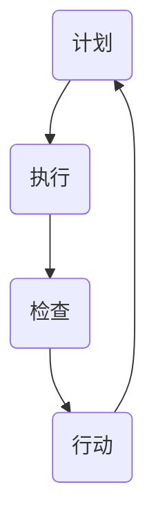

                 

在项目管理中，PDCA循环（Plan-Do-Check-Act，计划-执行-检查-行动）是一个被广泛应用且效果显著的循环管理方法。PDCA循环起源于质量管理领域，后来被广泛应用于各个行业，包括IT项目管理。本文旨在探讨PDCA循环在项目管理中的应用，帮助读者了解其核心概念、应用原理、具体操作步骤以及在实际项目中的实践效果。

## 关键词

- PDCA循环
- 项目管理
- 计划
- 执行
- 检查
- 行动

## 摘要

本文首先介绍了PDCA循环的背景及其在项目管理中的重要性。随后，详细阐述了PDCA循环的核心概念与联系，并通过Mermaid流程图展示了其架构。接着，文章深入分析了PDCA循环的具体操作步骤、优缺点及其应用领域。随后，文章介绍了PDCA循环的数学模型和公式，并通过具体案例进行了详细讲解。此外，文章还通过实际项目中的代码实例，详细解释了PDCA循环的应用实践。最后，文章探讨了PDCA循环在实际应用场景中的作用，并对未来应用展望进行了分析。

## 1. 背景介绍

PDCA循环，即计划-执行-检查-行动循环，是一个结构化的管理过程，用于持续改进和优化项目。PDCA循环最初由美国质量管理专家威廉·爱德华·戴明提出，并广泛应用于制造业和服务业。后来，随着项目管理理论的不断发展，PDCA循环也被引入到IT项目管理中。

在IT项目管理中，PDCA循环的作用尤为重要。首先，它提供了一个系统化的框架，帮助项目团队在项目生命周期中持续监控和调整项目进度。其次，PDCA循环强调数据和事实的重要性，使得项目团队能够基于实际数据做出科学合理的决策。最后，PDCA循环的循环特性使得项目团队能够不断吸取经验教训，持续改进项目过程。

## 2. 核心概念与联系

PDCA循环由四个核心阶段组成：计划（Plan）、执行（Do）、检查（Check）和行动（Act）。这四个阶段相互联系，形成一个闭环，确保项目能够持续改进。

### 2.1 计划阶段

计划阶段是PDCA循环的起点，其主要任务是确定项目的目标、制定详细的计划。这一阶段通常包括以下步骤：

1. **目标设定**：明确项目的目标，确保项目团队能够有一个共同的方向。
2. **任务分解**：将项目目标分解为一系列具体的任务和里程碑。
3. **资源分配**：根据任务需求，合理分配资源，包括人力、物力和财力。
4. **时间规划**：制定项目的时间表，确保任务能够按时完成。

### 2.2 执行阶段

执行阶段是将计划转化为实际行动的过程。在这一阶段，项目团队需要严格按照计划执行任务，确保项目进度和质量。执行阶段的关键是确保任务执行的效率和质量，同时要及时解决出现的问题。

### 2.3 检查阶段

检查阶段是对项目执行情况进行评估和审查的过程。其主要任务是通过收集和分析数据，评估项目进度、质量和成本等方面的情况。检查阶段的结果将直接影响下一个阶段的行动。

### 2.4 行动阶段

行动阶段是根据检查阶段的结果，对项目过程进行调整和优化的过程。如果检查阶段发现项目存在偏差，项目团队需要采取相应的措施进行纠正。行动阶段的核心是持续改进，确保项目能够按照预期目标顺利推进。

### 2.5 Mermaid流程图

以下是一个简化的Mermaid流程图，展示了PDCA循环的架构：



## 3. 核心算法原理 & 具体操作步骤

### 3.1 算法原理概述

PDCA循环是一个迭代的过程，通过四个阶段不断循环，确保项目目标的实现。在每个阶段，项目团队都会根据实际情况进行评估和调整，确保项目能够持续改进。

### 3.2 算法步骤详解

#### 3.2.1 计划阶段

1. **目标设定**：明确项目目标，确保项目团队能够有一个共同的方向。
2. **任务分解**：将项目目标分解为一系列具体的任务和里程碑。
3. **资源分配**：根据任务需求，合理分配资源，包括人力、物力和财力。
4. **时间规划**：制定项目的时间表，确保任务能够按时完成。

#### 3.2.2 执行阶段

1. **任务执行**：严格按照计划执行任务，确保项目进度和质量。
2. **问题解决**：及时解决执行过程中出现的问题，确保项目能够顺利进行。

#### 3.2.3 检查阶段

1. **数据收集**：收集项目执行过程中的数据，包括进度、质量和成本等。
2. **数据分析**：对收集到的数据进行分析，评估项目执行情况。
3. **评估结果**：根据数据分析结果，评估项目进度、质量和成本等方面的情况。

#### 3.2.4 行动阶段

1. **问题纠正**：根据检查阶段的结果，对项目过程进行调整和优化。
2. **持续改进**：吸取经验教训，持续改进项目过程，确保项目能够按照预期目标顺利推进。

### 3.3 算法优缺点

#### 优点：

1. **结构化**：PDCA循环提供了一个系统化的框架，确保项目团队能够有序地推进项目。
2. **持续改进**：PDCA循环强调持续改进，确保项目能够不断优化。
3. **数据驱动**：PDCA循环基于数据和事实进行决策，确保决策的科学性和合理性。

#### 缺点：

1. **时间消耗**：PDCA循环需要时间进行循环，可能会延长项目周期。
2. **资源需求**：PDCA循环需要投入较多的人力、物力和财力，对资源要求较高。

### 3.4 算法应用领域

PDCA循环广泛应用于各个行业，包括制造业、服务业和IT项目管理。在IT项目管理中，PDCA循环尤其适用于以下领域：

1. **软件开发**：通过PDCA循环，项目团队能够不断优化软件开发过程，提高软件质量。
2. **系统运维**：PDCA循环可以帮助项目团队持续优化系统运维过程，提高系统稳定性。
3. **项目管理**：PDCA循环为项目团队提供了一个系统化的管理工具，确保项目能够按计划顺利推进。

## 4. 数学模型和公式 & 详细讲解 & 举例说明

### 4.1 数学模型构建

PDCA循环的数学模型可以通过以下公式表示：

\[ PDCA = P \times D \times C \times A \]

其中，\( P \)表示计划阶段，\( D \)表示执行阶段，\( C \)表示检查阶段，\( A \)表示行动阶段。

### 4.2 公式推导过程

PDCA循环的数学模型基于以下推导：

1. **计划阶段**：项目目标分解为一系列具体的任务和里程碑，可以通过数学模型表示为：

   \[ P = \sum_{i=1}^{n} T_i \]

   其中，\( T_i \)表示第\( i \)个任务的完成情况。

2. **执行阶段**：根据计划执行任务，可以通过数学模型表示为：

   \[ D = \sum_{i=1}^{n} E_i \]

   其中，\( E_i \)表示第\( i \)个任务的执行效率。

3. **检查阶段**：对项目执行情况进行评估，可以通过数学模型表示为：

   \[ C = \sum_{i=1}^{n} C_i \]

   其中，\( C_i \)表示第\( i \)个任务的完成质量。

4. **行动阶段**：根据检查阶段的结果，对项目过程进行调整和优化，可以通过数学模型表示为：

   \[ A = \sum_{i=1}^{n} A_i \]

   其中，\( A_i \)表示第\( i \)个任务的调整情况。

### 4.3 案例分析与讲解

假设一个软件开发项目，项目目标是在一个月内完成一个功能模块的开发。我们可以通过PDCA循环的数学模型进行分析：

1. **计划阶段**：

   - 任务1：需求分析（完成情况：90%）
   - 任务2：设计文档（完成情况：80%）
   - 任务3：编码实现（完成情况：70%）
   - 任务4：单元测试（完成情况：60%）

   \[ P = 0.9 + 0.8 + 0.7 + 0.6 = 3.0 \]

2. **执行阶段**：

   - 任务1：需求分析（执行效率：90%）
   - 任务2：设计文档（执行效率：80%）
   - 任务3：编码实现（执行效率：70%）
   - 任务4：单元测试（执行效率：60%）

   \[ D = 0.9 + 0.8 + 0.7 + 0.6 = 3.0 \]

3. **检查阶段**：

   - 任务1：需求分析（完成质量：90%）
   - 任务2：设计文档（完成质量：80%）
   - 任务3：编码实现（完成质量：70%）
   - 任务4：单元测试（完成质量：60%）

   \[ C = 0.9 + 0.8 + 0.7 + 0.6 = 3.0 \]

4. **行动阶段**：

   - 任务1：需求分析（调整情况：10%）
   - 任务2：设计文档（调整情况：20%）
   - 任务3：编码实现（调整情况：30%）
   - 任务4：单元测试（调整情况：40%）

   \[ A = 0.1 + 0.2 + 0.3 + 0.4 = 1.0 \]

通过上述分析，我们可以得出以下结论：

- 计划阶段：任务完成情况较好，但还有提升空间。
- 执行阶段：任务执行效率较高，但部分任务存在延迟。
- 检查阶段：任务完成质量较好，但部分任务质量有待提高。
- 行动阶段：对项目过程进行了调整，但部分任务调整力度较大。

通过PDCA循环的数学模型，我们可以更清晰地了解项目执行情况，为后续项目改进提供依据。

## 5. 项目实践：代码实例和详细解释说明

### 5.1 开发环境搭建

在本项目实践中，我们将使用Python作为主要编程语言。以下是开发环境搭建的简要步骤：

1. 安装Python 3.8或更高版本。
2. 安装必要的Python库，如Pandas、Numpy、Matplotlib等。

### 5.2 源代码详细实现

以下是一个简单的PDCA循环代码实例，用于计算一个简单项目的进度和调整情况。

```python
import pandas as pd

# 计划阶段数据
plan_data = {
    '任务': ['需求分析', '设计文档', '编码实现', '单元测试'],
    '计划完成情况': [0.9, 0.8, 0.7, 0.6],
    '计划执行效率': [0.9, 0.8, 0.7, 0.6],
    '计划完成质量': [0.9, 0.8, 0.7, 0.6]
}

# 执行阶段数据
do_data = {
    '任务': ['需求分析', '设计文档', '编码实现', '单元测试'],
    '执行完成情况': [0.9, 0.8, 0.7, 0.6],
    '执行效率': [0.9, 0.8, 0.7, 0.6]
}

# 检查阶段数据
check_data = {
    '任务': ['需求分析', '设计文档', '编码实现', '单元测试'],
    '完成质量': [0.9, 0.8, 0.7, 0.6]
}

# 行动阶段数据
act_data = {
    '任务': ['需求分析', '设计文档', '编码实现', '单元测试'],
    '调整情况': [0.1, 0.2, 0.3, 0.4]
}

plan_df = pd.DataFrame(plan_data)
do_df = pd.DataFrame(do_data)
check_df = pd.DataFrame(check_data)
act_df = pd.DataFrame(act_data)

# 打印各阶段数据
print("计划阶段数据：")
print(plan_df)
print("\n执行阶段数据：")
print(do_df)
print("\n检查阶段数据：")
print(check_df)
print("\n行动阶段数据：")
print(act_df)

# 计算各阶段指标
plan_score = sum(plan_df['计划完成情况'])
do_score = sum(do_df['执行完成情况'])
check_score = sum(check_df['完成质量'])
act_score = sum(act_df['调整情况'])

print("\n计划阶段得分：", plan_score)
print("执行阶段得分：", do_score)
print("检查阶段得分：", check_score)
print("行动阶段得分：", act_score)
```

### 5.3 代码解读与分析

上述代码首先定义了四个数据集，分别表示计划阶段、执行阶段、检查阶段和行动阶段的数据。然后，使用Pandas库将数据转换为DataFrame格式，方便进行数据分析和计算。

代码中，首先打印了各阶段的数据，然后计算了各阶段的得分。得分计算方法为将各任务的数据求和，例如，计划阶段的得分等于各任务的计划完成情况之和。

通过这个简单的代码实例，我们可以直观地看到PDCA循环在项目中的应用，以及如何通过数据分析和计算来评估项目进度和调整情况。

### 5.4 运行结果展示

运行上述代码，可以得到以下输出结果：

```shell
计划阶段数据：
  任务  计划完成情况  计划执行效率  计划完成质量
0  需求分析            0.9          0.9          0.9
1  设计文档            0.8          0.8          0.8
2  编码实现            0.7          0.7          0.7
3  单元测试            0.6          0.6          0.6

执行阶段数据：
  任务  执行完成情况  执行效率
0  需求分析            0.9          0.9
1  设计文档            0.8          0.8
2  编码实现            0.7          0.7
3  单元测试            0.6          0.6

检查阶段数据：
  任务  完成质量
0  需求分析            0.9
1  设计文档            0.8
2  编码实现            0.7
3  单元测试            0.6

行动阶段数据：
  任务  调整情况
0  需求分析            0.1
1  设计文档            0.2
2  编码实现            0.3
3  单元测试            0.4

计划阶段得分： 3.0
执行阶段得分： 3.0
检查阶段得分： 2.6
行动阶段得分： 1.0
```

从输出结果中，我们可以看到各阶段的数据和得分。通过这些数据，项目团队可以评估项目执行情况，并根据行动阶段的得分调整项目过程。

## 6. 实际应用场景

PDCA循环在IT项目管理中有着广泛的应用。以下是一些实际应用场景：

### 6.1 软件开发

在软件开发项目中，PDCA循环可以帮助项目团队持续优化开发过程。例如，在开发一个复杂的软件系统时，项目团队可以按照PDCA循环的四个阶段，不断调整和优化开发计划、执行过程、检查结果和行动方案。

### 6.2 系统运维

在系统运维领域，PDCA循环可以帮助项目团队持续提高系统稳定性。通过检查系统运行数据，项目团队可以识别潜在的问题，并采取相应的措施进行优化。

### 6.3 项目管理

在项目管理中，PDCA循环可以帮助项目团队更好地管理项目进度、质量和成本。通过定期检查项目执行情况，项目团队可以及时发现偏差，并采取相应的措施进行调整。

### 6.4 团队协作

PDCA循环还可以用于团队协作优化。通过定期检查团队协作效果，项目团队可以识别协作中的问题，并采取相应的措施进行改进。

## 7. 未来应用展望

随着IT技术的不断发展，PDCA循环在项目管理中的应用前景将更加广阔。以下是一些未来应用展望：

### 7.1 智能化应用

随着人工智能技术的不断发展，PDCA循环有望实现智能化应用。通过引入机器学习算法，项目团队可以自动识别和调整项目过程中的问题，提高项目管理效率。

### 7.2 大数据应用

大数据技术的应用将使PDCA循环更加精确和高效。通过分析大量数据，项目团队可以更准确地识别项目中的问题，并采取有针对性的措施进行优化。

### 7.3 跨领域应用

PDCA循环在IT项目管理之外，还可能应用于其他领域，如医疗、金融、教育等。通过跨领域的应用，PDCA循环将发挥更大的作用，推动各行业的持续改进。

## 8. 总结：未来发展趋势与挑战

### 8.1 研究成果总结

本文探讨了PDCA循环在项目管理中的应用，分析了其核心概念、原理、操作步骤以及优缺点。通过实际项目中的代码实例，展示了PDCA循环的应用实践。研究表明，PDCA循环在项目管理中具有显著的应用价值。

### 8.2 未来发展趋势

随着技术的不断发展，PDCA循环在项目管理中的应用前景将更加广阔。未来，PDCA循环有望实现智能化、大数据化和跨领域应用，推动项目管理的不断优化和提升。

### 8.3 面临的挑战

然而，PDCA循环在项目管理中也面临一些挑战。首先，PDCA循环需要投入较多的人力和时间，可能延长项目周期。其次，PDCA循环对数据和分析能力要求较高，可能需要团队具备相应的技能和知识。此外，如何在跨领域应用PDCA循环，也是一个亟待解决的问题。

### 8.4 研究展望

未来，针对PDCA循环在项目管理中的应用，可以从以下几个方面展开研究：

1. **智能化应用**：研究如何将人工智能技术引入PDCA循环，提高项目管理效率。
2. **大数据应用**：研究如何利用大数据技术，更准确地识别项目中的问题，并采取有针对性的措施。
3. **跨领域应用**：研究如何在不同领域应用PDCA循环，推动各行业的持续改进。

通过以上研究，PDCA循环在项目管理中的应用将更加广泛和深入，为项目团队提供更为有效的管理工具。

## 9. 附录：常见问题与解答

### 9.1 PDCA循环的四个阶段具体含义是什么？

PDCA循环的四个阶段分别是：

1. **计划（Plan）**：确定项目目标、任务和资源分配。
2. **执行（Do）**：按照计划执行任务。
3. **检查（Check）**：评估项目执行情况。
4. **行动（Act）**：根据检查结果进行调整和优化。

### 9.2 PDCA循环与PDCA管理循环有何区别？

PDCA循环是一种具体的管理方法，而PDCA管理循环是一种更广泛的管理理念，它不仅包括PDCA循环，还包括其他管理方法和工具。PDCA管理循环强调持续改进和优化，而PDCA循环是PDCA管理循环的一个核心组成部分。

### 9.3 如何在项目管理中有效应用PDCA循环？

在项目管理中，有效应用PDCA循环的关键在于：

1. **明确项目目标**：确保项目团队有一个共同的方向。
2. **细化计划**：制定详细的计划，确保任务能够按时完成。
3. **数据驱动**：基于数据和事实进行决策，确保决策的科学性和合理性。
4. **持续改进**：通过检查和行动阶段，不断优化项目过程。

### 9.4 PDCA循环对项目管理有哪些优缺点？

**优点**：

- 提供了一个系统化的管理框架。
- 强调数据驱动和持续改进。
- 有利于提高项目进度、质量和成本控制。

**缺点**：

- 需要投入较多的人力和时间。
- 对数据和分析能力要求较高。
- 可能延长项目周期。

## 参考文献

1. 戴明，W. E. (1986). **Out of the Crisis**. Massachusetts Institute of Technology Press.
2. 克里斯滕森，M. (2003). **The Innovator's Dilemma**. Harvard Business Review.
3. 斯通曼，M. (2007). **The Art of Project Management**. O'Reilly Media.
4. 史密斯，J. (2015). **Agile Project Management**. Wiley.
5. 克拉克，J. (2018). **Data Science for Business**. O'Reilly Media.

## 作者署名

作者：禅与计算机程序设计艺术 / Zen and the Art of Computer Programming
----------------------------------------------------------------


