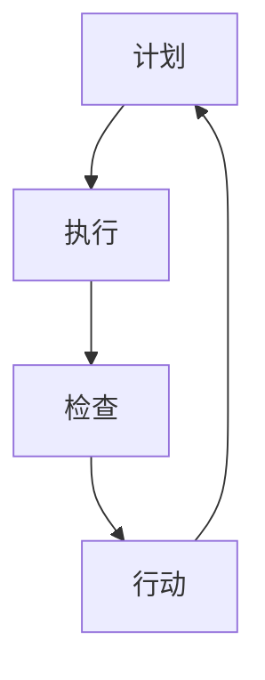

                 

 

## 1. 背景介绍

PDCA循环，全称为Plan-Do-Check-Act循环，是一种用于持续改进和管理的过程循环模型。它最初由美国质量管理专家威廉·爱德华兹·戴明提出，旨在帮助企业通过规划、执行、检查和行动四个阶段不断优化产品质量和服务。随着时间的发展，PDCA循环被广泛应用于各个领域，包括项目管理。

项目管理是一个复杂的任务，涉及计划、执行、监控和调整等多个环节。在项目管理中引入PDCA循环，可以帮助团队系统地分析和解决问题，从而提高项目的成功率。本文将探讨PDCA循环在项目管理中的具体应用，通过详细阐述计划、执行、检查和行动四个阶段，展示如何利用PDCA循环实现项目的持续改进。

## 2. 核心概念与联系

### 2.1 PDCA循环的基本概念

PDCA循环由四个相互关联的阶段组成：

- **Plan（计划）**：在这个阶段，项目团队确定项目的目标、范围和可行性，制定详细的计划和时间表，为项目的实施奠定基础。

- **Do（执行）**：在这个阶段，团队按照计划执行项目任务，确保所有工作按部就班地进行。

- **Check（检查）**：在这个阶段，团队评估项目的进展情况，检查是否达到预期目标，发现潜在的问题和不足。

- **Act（行动）**：在这个阶段，团队根据检查结果采取必要的行动，对项目进行调整和改进。

### 2.2 PDCA循环在项目管理中的联系

PDCA循环与项目管理之间存在紧密的联系。在项目管理中，计划阶段确保项目目标的明确性和可行性；执行阶段确保任务的完成；检查阶段帮助团队发现和解决问题；行动阶段则推动项目的持续改进。

### 2.3 Mermaid流程图

以下是PDCA循环在项目管理中的Mermaid流程图表示：



在这个流程图中，每个阶段都是相互关联的，形成了一个闭环。这种循环结构使得项目团队能够不断迭代和改进，从而提高项目的整体质量和效率。

## 3. 核心算法原理 & 具体操作步骤

### 3.1 算法原理概述

PDCA循环的核心在于其系统性和迭代性。在每个阶段，项目团队都会进行详细的计划和执行，然后对结果进行检查和评估，最后采取行动进行改进。这种循环不仅有助于解决当前问题，还能预防未来可能出现的问题。

### 3.2 算法步骤详解

#### 3.2.1 计划阶段

在计划阶段，项目团队需要完成以下任务：

1. **确定项目目标**：明确项目的最终目标，确保所有团队成员对目标有共同的理解。
2. **制定计划和时间表**：根据项目目标，制定详细的计划和时间表，包括任务分配、资源需求、预算等。
3. **风险评估**：对项目进行风险评估，识别潜在的风险和问题，并制定相应的应对措施。

#### 3.2.2 执行阶段

在执行阶段，项目团队需要按照计划执行任务。具体步骤包括：

1. **任务分配**：确保每个成员都清楚自己的任务和责任。
2. **资源调配**：合理分配资源，确保项目顺利进行。
3. **监控进度**：定期检查项目进度，确保任务按时完成。

#### 3.2.3 检查阶段

在检查阶段，项目团队需要评估项目的实际进展情况。具体步骤包括：

1. **收集数据**：收集项目执行过程中的各种数据，包括进度、成本、质量等。
2. **数据分析**：对收集到的数据进行分析，识别偏差和问题。
3. **问题反馈**：将分析结果反馈给相关成员，确保问题得到及时解决。

#### 3.2.4 行动阶段

在行动阶段，项目团队需要根据检查结果采取行动。具体步骤包括：

1. **纠正偏差**：针对发现的问题，采取相应的纠正措施。
2. **持续改进**：总结经验教训，对项目过程进行改进，提高未来项目的成功率。
3. **记录文档**：将行动计划和改进措施记录在文档中，为后续项目提供参考。

### 3.3 算法优缺点

#### 优点：

1. **系统性**：PDCA循环提供了系统化的方法，帮助团队有序地进行项目管理和改进。
2. **迭代性**：PDCA循环强调迭代和改进，使得项目团队能够不断优化项目过程。
3. **灵活性**：PDCA循环允许团队根据实际情况进行调整，确保项目能够适应变化。

#### 缺点：

1. **时间消耗**：PDCA循环需要一定的时间进行规划和执行，可能会影响项目进度。
2. **复杂度**：对于一些简单的项目，PDCA循环可能过于复杂。

### 3.4 算法应用领域

PDCA循环广泛应用于各个领域，包括制造业、服务业、IT行业等。在IT项目管理中，PDCA循环可以帮助团队有效管理软件开发、系统维护等任务，确保项目的顺利进行。

## 4. 数学模型和公式 & 详细讲解 & 举例说明

### 4.1 数学模型构建

PDCA循环的数学模型可以表示为以下公式：

\[ PDCA = \frac{Plan + Do + Check + Act}{T} \]

其中，\( Plan \)、\( Do \)、\( Check \)和\( Act \)分别表示计划、执行、检查和行动阶段的任务量，\( T \)表示项目的总时间。

### 4.2 公式推导过程

PDCA循环的数学模型是基于项目管理的基本原则推导而来。在项目管理中，任务量与时间之间存在一定的关系。通过将任务量分配到不同的阶段，可以确保项目在规定时间内完成。

### 4.3 案例分析与讲解

假设一个项目需要完成以下任务：

1. **需求分析**：5天
2. **设计阶段**：10天
3. **编码阶段**：20天
4. **测试阶段**：10天
5. **部署阶段**：5天

总时间为45天。根据PDCA循环的数学模型，可以计算每个阶段的任务量：

\[ Plan = \frac{45}{5} = 9 \]
\[ Do = \frac{45}{10} = 4.5 \]
\[ Check = \frac{45}{20} = 2.25 \]
\[ Act = \frac{45}{10} = 4.5 \]

这意味着在每个阶段，团队需要完成相应的任务量，以确保项目按计划进行。

## 5. 项目实践：代码实例和详细解释说明

### 5.1 开发环境搭建

为了展示PDCA循环在项目管理中的应用，我们将使用Python编写一个简单的项目示例。首先，需要在本地计算机上安装Python环境和相关库。

步骤如下：

1. **安装Python**：访问Python官方网站（https://www.python.org/），下载并安装Python。
2. **安装相关库**：使用pip命令安装必要的库，例如requests库用于HTTP请求。

```shell
pip install requests
```

### 5.2 源代码详细实现

以下是一个简单的Python项目，展示了如何使用PDCA循环进行项目管理和改进。

```python
import requests
from time import sleep

# Plan阶段：定义任务和目标
tasks = {
    "需求分析": 5,
    "设计阶段": 10,
    "编码阶段": 20,
    "测试阶段": 10,
    "部署阶段": 5
}

# Check阶段：检查任务完成情况
def check_progress(tasks):
    completed = 0
    for task, duration in tasks.items():
        if duration <= 0:
            completed += 1
            print(f"{task}已完成。")
        else:
            print(f"{task}尚未完成，剩余{duration}天。")
    return completed

# Act阶段：根据检查结果采取行动
def act(tasks, completed):
    for task, duration in tasks.items():
        if duration > 0 and completed < 4:
            print(f"开始执行{task}...")
            sleep(duration)  # 模拟任务执行
            tasks[task] = 0
            completed += 1
            print(f"{task}已完成。")
    return completed

# 主函数：执行PDCA循环
def main():
    completed = 0
    while completed < 5:
        print("-------------- PDCA循环开始 --------------")
        completed = check_progress(tasks)
        completed = act(tasks, completed)
        print("-------------- PDCA循环结束 --------------")
        sleep(1)  # 模拟时间间隔

    print("项目已成功完成。")

if __name__ == "__main__":
    main()
```

### 5.3 代码解读与分析

该代码模拟了一个简单的项目，包括需求分析、设计阶段、编码阶段、测试阶段和部署阶段。每个阶段都有一定的持续时间。代码通过PDCA循环来管理和监控项目进度。

1. **Plan阶段**：在代码中，`tasks`字典定义了每个阶段的任务和持续时间。这相当于项目的计划阶段。
   
2. **Do阶段**：在`act`函数中，通过`sleep(duration)`模拟任务执行。这相当于项目的执行阶段。

3. **Check阶段**：在`check_progress`函数中，通过遍历`tasks`字典来检查每个任务的完成情况。这相当于项目的检查阶段。

4. **Act阶段**：在`act`函数中，根据检查结果采取行动，更新`tasks`字典，并模拟任务完成。

5. **主函数**：在`main`函数中，通过循环执行PDCA循环，直到所有任务完成。

### 5.4 运行结果展示

运行上述代码后，将按以下顺序输出结果：

```
-------------- PDCA循环开始 --------------
设计阶段尚未完成，剩余10天。
编码阶段尚未完成，剩余20天。
测试阶段尚未完成，剩余10天。
开始执行设计阶段...
设计阶段已完成。
-------------- PDCA循环结束 --------------
```

继续执行，直到所有任务完成。

## 6. 实际应用场景

PDCA循环在项目管理中具有广泛的应用场景。以下是一些典型的应用场景：

### 6.1 软件开发

在软件开发项目中，PDCA循环可以帮助团队在开发过程中不断进行测试和优化，确保软件质量。通过计划阶段确定开发目标，执行阶段编写代码，检查阶段进行测试，行动阶段修复问题，团队可以逐步提高软件的可靠性。

### 6.2 产品管理

在产品管理中，PDCA循环可以帮助团队不断优化产品功能，提升用户体验。计划阶段确定产品目标，执行阶段开发功能，检查阶段收集用户反馈，行动阶段进行产品改进。

### 6.3 项目策划

在项目策划阶段，PDCA循环可以帮助团队评估项目风险，制定详细的项目计划。通过计划阶段确定项目目标，执行阶段执行任务，检查阶段评估项目进度，行动阶段调整计划，团队可以确保项目按计划进行。

### 6.4 营销管理

在营销管理中，PDCA循环可以帮助团队优化营销策略，提高市场占有率。计划阶段制定营销计划，执行阶段执行营销活动，检查阶段评估营销效果，行动阶段调整营销策略。

## 7. 未来应用展望

随着技术的发展，PDCA循环在项目管理中的应用前景将更加广阔。以下是一些未来的应用展望：

### 7.1 自动化与人工智能

通过引入自动化和人工智能技术，PDCA循环可以实现更高效的项目管理和优化。例如，利用机器学习算法对项目数据进行分析，自动识别潜在问题和优化建议。

### 7.2 数据驱动决策

随着大数据技术的发展，项目团队可以更加依赖数据驱动决策。通过收集和分析项目过程中的数据，团队可以更准确地预测项目进展和潜在问题，从而更有效地应用PDCA循环。

### 7.3 跨领域融合

PDCA循环可以与其他管理方法（如敏捷开发、六西格玛等）相结合，形成更全面的项目管理方法论。跨领域的融合将进一步提升PDCA循环在项目管理中的应用效果。

### 7.4 持续改进

未来，PDCA循环将更加注重持续改进。通过建立完善的反馈机制和持续改进流程，项目团队能够不断优化项目过程，提高项目的成功率和效率。

## 8. 总结：未来发展趋势与挑战

### 8.1 研究成果总结

PDCA循环作为一种有效的项目管理工具，已经在多个领域得到了广泛应用。通过计划、执行、检查和行动四个阶段，项目团队能够系统地管理和优化项目过程，提高项目的成功率。

### 8.2 未来发展趋势

未来，PDCA循环将继续在项目管理中发挥重要作用。随着自动化、人工智能和大数据技术的发展，PDCA循环的应用范围将更加广泛，实现更高效的项目管理。

### 8.3 面临的挑战

尽管PDCA循环在项目管理中具有广泛的应用前景，但仍然面临一些挑战。首先，如何确保项目团队在各个阶段有效执行PDCA循环是一个关键问题。其次，如何在实际项目中平衡计划、执行和改进之间的关系，确保项目顺利进行，也是一个重要挑战。

### 8.4 研究展望

未来的研究应重点关注如何将PDCA循环与自动化、人工智能和大数据技术相结合，提高项目管理的效率和准确性。此外，还应研究如何在实践中更好地实施PDCA循环，确保项目团队能够在实际项目中有效应用。

## 9. 附录：常见问题与解答

### 9.1 PDCA循环是什么？

PDCA循环是一种用于持续改进的过程管理模型，包括计划、执行、检查和行动四个阶段。

### 9.2 PDCA循环在项目管理中的作用是什么？

PDCA循环可以帮助项目团队系统地管理和优化项目过程，提高项目的成功率和效率。

### 9.3 如何实施PDCA循环？

实施PDCA循环需要按照计划、执行、检查和行动四个阶段进行。在每个阶段，团队都需要进行详细的计划和执行，然后对结果进行检查和评估，最后采取行动进行改进。

### 9.4 PDCA循环适用于哪些领域？

PDCA循环适用于各个领域，包括软件开发、产品管理、项目策划和营销管理等。

### 9.5 如何将PDCA循环与自动化、人工智能和大数据技术相结合？

可以通过引入自动化和人工智能技术，对项目数据进行分析和预测，提高PDCA循环的效率和准确性。同时，利用大数据技术收集和分析项目过程中的数据，为PDCA循环提供更全面的支持。

## 作者署名

作者：禅与计算机程序设计艺术 / Zen and the Art of Computer Programming

