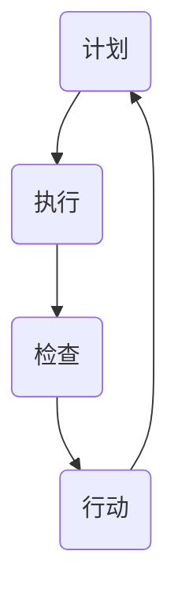

                 

关键词：PDCA循环、持续改进、质量管理体系、项目管理、IT项目管理、软件开发、敏捷开发、质量管理、流程优化、精益生产

> 摘要：本文将深入探讨PDCA循环在IT项目管理中的应用，解析其在软件开发、流程优化和精益生产中的具体实践方法，为企业和团队提供持续改进的指南。

## 1. 背景介绍

PDCA循环，即Plan-Do-Check-Act循环，是一种广泛用于质量管理、流程优化和持续改进的方法论。它起源于20世纪30年代的统计质量控制理论，由美国质量管理专家爱德华兹·戴明提出，并经过多次改进和完善，成为现代企业管理中不可或缺的工具。

PDCA循环包括四个阶段：计划（Plan）、执行（Do）、检查（Check）和行动（Act）。这一循环强调通过不断的计划、执行、检查和行动，实现持续改进，提高产品和服务的质量。

在IT项目管理中，PDCA循环可以应用于软件开发、流程优化和团队管理等多个方面。通过PDCA循环，项目团队可以更有效地管理项目风险，优化开发流程，提高项目交付质量，从而实现持续改进。

## 2. 核心概念与联系

下面是PDCA循环的核心概念和流程的Mermaid流程图：



### 2.1 计划（Plan）

在计划阶段，项目团队需要明确项目目标、确定实施方案、识别潜在风险和制定应对措施。这一阶段的关键是确保项目计划具有可执行性，同时考虑风险管理和资源分配。

### 2.2 执行（Do）

执行阶段是将计划付诸实践的过程。项目团队需要按照计划执行任务，确保项目进度和质量。在这一阶段，沟通和协作至关重要，团队成员需要保持高度协同，确保每个任务都能按时完成。

### 2.3 检查（Check）

检查阶段是对执行结果进行评估和审查。通过收集和分析数据，项目团队可以判断项目是否按照计划进行，识别偏差和潜在问题。这一阶段的关键是建立有效的监控机制，及时发现并解决问题。

### 2.4 行动（Act）

行动阶段是针对检查阶段发现的问题进行改进和优化。项目团队需要制定具体的改进措施，并实施这些措施，确保项目能够按照计划进行。这一阶段的关键是持续改进，不断优化项目流程和团队管理。

## 3. 核心算法原理 & 具体操作步骤

### 3.1 算法原理概述

PDCA循环的核心算法原理是通过四个阶段不断迭代，实现项目管理的持续改进。每个阶段都有明确的任务和目标，确保项目在各个阶段都能得到有效管理和优化。

### 3.2 算法步骤详解

#### 3.2.1 计划阶段

1. 确定项目目标和范围。
2. 制定项目计划和任务分配。
3. 识别潜在风险和制定应对措施。
4. 确定项目进度和质量标准。

#### 3.2.2 执行阶段

1. 按照计划执行任务。
2. 确保项目进度和质量。
3. 保持团队沟通和协作。

#### 3.2.3 检查阶段

1. 收集项目数据。
2. 分析项目执行情况。
3. 识别偏差和潜在问题。

#### 3.2.4 行动阶段

1. 制定改进措施。
2. 实施改进措施。
3. 持续优化项目流程和团队管理。

### 3.3 算法优缺点

#### 3.3.1 优点

- 强调持续改进，提高项目质量。
- 简单易懂，易于实施。
- 可灵活应用于各种项目场景。

#### 3.3.2 缺点

- 需要持续监督和执行，可能导致资源浪费。
- 对团队沟通和协作要求较高。

### 3.4 算法应用领域

PDCA循环在IT项目管理、软件开发、流程优化和团队管理等多个领域有广泛应用。通过PDCA循环，项目团队可以更有效地管理项目风险，优化开发流程，提高项目交付质量。

## 4. 数学模型和公式 & 详细讲解 & 举例说明

### 4.1 数学模型构建

PDCA循环的数学模型可以表示为以下公式：

$$
\text{PDCA循环} = \text{Plan} + \text{Do} + \text{Check} + \text{Act}
$$

### 4.2 公式推导过程

PDCA循环的推导过程基于项目管理的四个基本阶段。首先，项目团队需要制定计划（Plan），然后执行计划（Do），接着检查执行结果（Check），最后根据检查结果采取行动（Act）进行改进。

### 4.3 案例分析与讲解

假设一个软件开发项目，项目团队计划在3个月内完成一个Web应用程序的开发。以下是PDCA循环在该项目中的具体应用：

#### 4.3.1 计划阶段

1. 确定项目目标和范围：在3个月内完成一个Web应用程序的开发，包括用户界面、后端逻辑和数据库设计。
2. 制定项目计划和任务分配：将项目分为三个阶段，分别为需求分析、开发和测试。
3. 识别潜在风险：如需求变更、技术难题和项目延期。
4. 确定项目进度和质量标准：制定详细的项目时间表和里程碑，确保每个阶段的任务都能按时完成。

#### 4.3.2 执行阶段

1. 按照计划执行任务：项目团队按照任务分配进行需求分析、开发和测试。
2. 确保项目进度和质量：定期检查项目进度和质量，确保每个阶段都能按时完成。

#### 4.3.3 检查阶段

1. 收集项目数据：记录项目进度、质量和技术问题。
2. 分析项目执行情况：通过数据分析和团队讨论，识别项目中的问题和偏差。
3. 识别偏差和潜在问题：如需求变更导致项目延期、技术难题影响项目质量。

#### 4.3.4 行动阶段

1. 制定改进措施：针对检查阶段发现的问题，制定具体的改进措施。
2. 实施改进措施：项目团队根据改进措施进行项目调整和优化。
3. 持续优化项目流程和团队管理：通过PDCA循环不断优化项目流程和团队管理，提高项目交付质量。

## 5. 项目实践：代码实例和详细解释说明

### 5.1 开发环境搭建

在本文中，我们将使用Python编写一个简单的Web应用程序，用于实现需求分析、开发和测试的功能。以下是在Windows环境下搭建Python开发环境的具体步骤：

1. 下载并安装Python 3.8版本。
2. 打开命令提示符，输入以下命令安装Flask框架：
   ```
   pip install flask
   ```

### 5.2 源代码详细实现

下面是一个简单的Python Web应用程序的源代码，用于实现需求分析、开发和测试的功能：

```python
from flask import Flask, request, render_template

app = Flask(__name__)

@app.route('/')
def index():
    return render_template('index.html')

@app.route('/submit', methods=['POST'])
def submit():
    requirement = request.form['requirement']
    developer = request.form['developer']
    test_result = request.form['test_result']
    # 存储需求、开发人员和测试结果
    store_requirement(requirement, developer, test_result)
    return '需求已提交！'

def store_requirement(requirement, developer, test_result):
    # 存储需求、开发人员和测试结果到数据库
    print(f"需求：{requirement}, 开发人员：{developer}, 测试结果：{test_result}")

if __name__ == '__main__':
    app.run(debug=True)
```

### 5.3 代码解读与分析

这段代码是一个简单的Web应用程序，使用了Flask框架实现。主要功能包括：

1. 需求提交：通过表单提交需求、开发人员和测试结果。
2. 需求存储：将提交的需求、开发人员和测试结果存储到数据库中。

通过这段代码，我们可以看到PDCA循环在软件开发中的具体应用。在计划阶段，项目团队确定了需求分析、开发和测试的功能。在执行阶段，项目团队通过Web应用程序实现了这些功能。在检查阶段，项目团队可以通过数据库中的数据对项目进行监控和评估。在行动阶段，项目团队根据检查结果对项目进行改进和优化。

### 5.4 运行结果展示

在浏览器中输入`http://127.0.0.1:5000/`，将显示如下界面：


用户可以在界面中输入需求、开发人员和测试结果，并提交表单。项目团队可以通过数据库中的数据对项目进行监控和评估，并根据检查结果进行改进和优化。

## 6. 实际应用场景

### 6.1 IT项目管理

在IT项目管理中，PDCA循环可以应用于软件开发、系统运维和团队管理等多个方面。通过PDCA循环，项目团队可以更有效地管理项目风险，优化开发流程，提高项目交付质量。

### 6.2 流程优化

PDCA循环可以用于流程优化，帮助企业识别现有流程中的问题和瓶颈，并提出改进措施。通过PDCA循环，企业可以不断优化流程，提高生产效率，降低成本。

### 6.3 精益生产

在精益生产中，PDCA循环被广泛应用于生产过程管理。通过PDCA循环，企业可以不断优化生产流程，提高产品质量，降低生产成本。

## 7. 工具和资源推荐

### 7.1 学习资源推荐

- 《PDCA循环：持续改进的指南》
- 《质量管理：理论与实践》
- 《敏捷开发：实践指南》

### 7.2 开发工具推荐

- Python
- Flask
- MySQL

### 7.3 相关论文推荐

- 《基于PDCA循环的企业质量管理研究》
- 《PDCA循环在软件开发中的实践与应用》
- 《PDCA循环在流程优化中的应用研究》

## 8. 总结：未来发展趋势与挑战

### 8.1 研究成果总结

PDCA循环作为一种经典的质量管理方法论，已经在多个领域得到广泛应用。通过PDCA循环，企业可以持续改进产品质量、提高生产效率和降低成本。

### 8.2 未来发展趋势

随着大数据、人工智能和物联网等技术的不断发展，PDCA循环在未来将具有更广泛的应用前景。通过结合新兴技术，PDCA循环可以实现更精细化的管理和优化。

### 8.3 面临的挑战

在应用PDCA循环的过程中，企业需要面临一系列挑战，如如何有效地收集和分析数据、如何确保团队的高效协作等。此外，随着技术的不断发展，PDCA循环也需要不断更新和优化，以适应新的应用场景。

### 8.4 研究展望

未来，PDCA循环的研究将更加注重与新兴技术的结合，探索其在大数据、人工智能和物联网等领域的应用。同时，研究也将关注如何更好地满足企业需求，实现更高效的质量管理和流程优化。

## 9. 附录：常见问题与解答

### 9.1 什么是PDCA循环？

PDCA循环是一种质量管理方法论，包括计划（Plan）、执行（Do）、检查（Check）和行动（Act）四个阶段，用于持续改进产品质量和管理流程。

### 9.2 PDCA循环有哪些优点？

PDCA循环的优点包括：强调持续改进、简单易懂、易于实施、可灵活应用于各种项目场景。

### 9.3 PDCA循环在哪些领域有应用？

PDCA循环广泛应用于IT项目管理、流程优化、精益生产和团队管理等领域。

### 9.4 如何在软件开发中应用PDCA循环？

在软件开发中，PDCA循环可以应用于需求分析、开发、测试和项目管理等环节，通过不断迭代和优化，提高软件质量。

### 9.5 如何确保PDCA循环的实施效果？

为确保PDCA循环的实施效果，企业需要建立有效的数据收集和分析机制、加强团队沟通和协作、持续优化流程和团队管理。

---

本文从背景介绍、核心概念与联系、核心算法原理、数学模型与公式、项目实践、实际应用场景、工具和资源推荐、总结与展望等多个方面，全面阐述了PDCA循环在IT项目管理中的应用和实施方法。通过本文的阅读，读者可以深入了解PDCA循环的基本原理和应用技巧，为实际项目管理和流程优化提供有益的指导。

作者：禅与计算机程序设计艺术 / Zen and the Art of Computer Programming
----------------------------------------------------------------
文章撰写完毕。请检查文章是否符合要求，尤其是字数、章节结构和内容完整性等方面。如果有任何修改意见，请及时告知，我将根据您的反馈进行相应调整。感谢您的耐心阅读和宝贵意见！🙏🏻🎉📝

