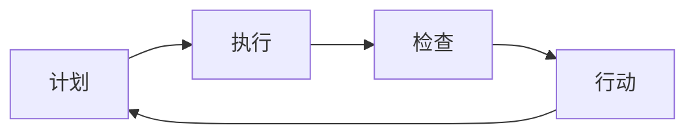

                 

关键词：PDCA循环、持续改进、质量控制、流程管理、IT行业、实践指南

> 摘要：本文将深入探讨PDCA循环在IT行业中的应用与实践，详细解析如何通过计划（Plan）、执行（Do）、检查（Check）和行动（Act）四个阶段，实现项目的持续改进。本文旨在为IT从业者提供一套实用的指南，帮助他们优化工作流程，提升项目质量。

## 1. 背景介绍

PDCA循环，即计划-执行-检查-行动循环，是一个广泛用于质量控制和管理持续改进的经典模型。PDCA循环起源于质量管理领域，由美国质量管理专家威廉·爱德华兹·戴明提出，并在日本得到广泛应用和发展。PDCA循环通过四个相互关联的阶段，确保项目或流程的持续改进和优化。

在IT行业，随着技术的发展和市场竞争的加剧，持续改进变得越来越重要。IT项目的复杂性、多样性和快速变化的特点，使得传统的项目管理方法面临诸多挑战。PDCA循环作为一种系统化的改进工具，可以帮助IT从业者更好地管理项目风险，提高项目质量，实现持续改进。

本文将围绕PDCA循环的四个阶段，详细探讨其在IT行业中的应用和实践，提供一套完整的持续改进指南。

### 1.1 PDCA循环的起源与发展

PDCA循环起源于20世纪50年代的美国，由威廉·爱德华兹·戴明提出，最初主要用于制造业的质量控制。戴明认为，通过计划、执行、检查和行动四个阶段的循环迭代，可以不断提高产品和流程的质量。

随着质量管理理论的发展，PDCA循环逐渐在其他领域得到应用。日本质量管理专家石川馨将其引入质量管理领域，并结合日本的传统文化和管理思想，使其得到进一步发展和完善。PDCA循环成为日本企业普遍采用的质量管理工具，并逐渐在全球范围内得到广泛应用。

### 1.2 IT行业对持续改进的需求

IT行业是一个快速发展的行业，新技术、新应用层出不穷。然而，这种快速发展也带来了诸多挑战。首先，IT项目的复杂性日益增加，涉及多个学科和领域，需要高度协调和协作。其次，市场需求变化快速，IT产品需要不断迭代和升级，以满足用户需求。此外，IT行业竞争激烈，企业需要不断提高产品质量和性能，以在市场中脱颖而出。

在这些背景下，持续改进成为IT行业的重要需求。通过PDCA循环，IT从业者可以系统地识别问题、分析原因、制定改进措施，并持续跟踪改进效果，从而实现项目的优化和提升。

## 2. 核心概念与联系

PDCA循环的核心概念包括计划（Plan）、执行（Do）、检查（Check）和行动（Act）。这些概念相互联系，共同构成一个闭环系统，确保持续改进的实施和落地。

### 2.1 计划（Plan）

计划阶段是PDCA循环的起点，主要任务是明确项目目标、制定改进计划和制定相关措施。在IT行业中，计划阶段通常包括以下内容：

- 确定项目目标：明确项目期望达到的效果和指标。
- 分析现状：收集项目相关数据，分析项目当前存在的问题和瓶颈。
- 设定改进目标：基于现状分析，设定具体、可量化的改进目标。
- 制定改进计划：明确改进措施、责任人和时间表。

### 2.2 执行（Do）

执行阶段是将计划转化为具体行动的过程。在执行阶段，IT从业者需要严格按照计划进行操作，确保改进措施的落实。执行阶段的关键内容包括：

- 实施改进措施：根据计划，实施具体的改进措施。
- 跟踪执行进度：监控改进措施的执行情况，确保按时完成。
- 提供必要资源：为改进措施提供必要的人力、物力和技术资源。

### 2.3 检查（Check）

检查阶段是评估改进措施效果的过程。在IT行业中，检查阶段通常包括以下内容：

- 收集数据：收集项目执行过程中的数据，包括改进措施实施前后的数据。
- 分析效果：对比改进前后的数据，分析改进措施的效果。
- 识别问题：如果改进效果不佳，需要进一步分析原因，识别存在的问题。

### 2.4 行动（Act）

行动阶段是总结经验、制定改进措施的过程。在行动阶段，IT从业者需要根据检查结果，对改进措施进行优化和调整，确保持续改进的落地。行动阶段的关键内容包括：

- 总结经验：总结改进过程中的成功经验和教训。
- 制定改进措施：根据检查结果，制定进一步的改进措施。
- 实施改进措施：将改进措施纳入日常工作，确保持续改进的落地。

### 2.5 Mermaid 流程图

以下是一个简单的Mermaid流程图，展示了PDCA循环的四个阶段及其相互关系。



### 2.6 核心概念与联系

PDCA循环的四个阶段相互联系，共同构成一个闭环系统。计划阶段为执行、检查和行动阶段提供指导，执行阶段是实现计划的过程，检查阶段是对执行效果的评估，行动阶段是总结经验、制定改进措施的过程。通过这个闭环系统，IT从业者可以不断优化工作流程，提高项目质量，实现持续改进。

## 3. 核心算法原理 & 具体操作步骤

### 3.1 算法原理概述

PDCA循环的核心算法原理可以概括为以下四个步骤：

1. **计划（Plan）**：通过数据收集和分析，明确项目目标、识别问题，并制定相应的改进计划。
2. **执行（Do）**：按照计划实施改进措施，确保各项任务按时完成。
3. **检查（Check）**：通过数据收集和分析，评估改进措施的效果，检查计划执行情况。
4. **行动（Act）**：根据检查结果，总结经验教训，制定进一步的改进措施，并实施。

### 3.2 算法步骤详解

#### 3.2.1 计划阶段

计划阶段是PDCA循环的起点，主要任务包括：

1. **确定项目目标**：明确项目期望达到的效果和指标。
2. **分析现状**：收集项目相关数据，分析项目当前存在的问题和瓶颈。
3. **设定改进目标**：基于现状分析，设定具体、可量化的改进目标。
4. **制定改进计划**：明确改进措施、责任人和时间表。

#### 3.2.2 执行阶段

执行阶段是将计划转化为具体行动的过程，主要任务包括：

1. **实施改进措施**：根据计划，实施具体的改进措施。
2. **跟踪执行进度**：监控改进措施的执行情况，确保按时完成。
3. **提供必要资源**：为改进措施提供必要的人力、物力和技术资源。

#### 3.2.3 检查阶段

检查阶段是评估改进措施效果的过程，主要任务包括：

1. **收集数据**：收集项目执行过程中的数据，包括改进措施实施前后的数据。
2. **分析效果**：对比改进前后的数据，分析改进措施的效果。
3. **识别问题**：如果改进效果不佳，需要进一步分析原因，识别存在的问题。

#### 3.2.4 行动阶段

行动阶段是总结经验、制定改进措施的过程，主要任务包括：

1. **总结经验**：总结改进过程中的成功经验和教训。
2. **制定改进措施**：根据检查结果，制定进一步的改进措施。
3. **实施改进措施**：将改进措施纳入日常工作，确保持续改进的落地。

### 3.3 算法优缺点

#### 3.3.1 优点

1. **系统化**：PDCA循环提供了一套系统化的改进流程，有助于IT从业者更好地管理项目风险，提高项目质量。
2. **灵活性**：PDCA循环可以根据实际情况进行调整和优化，适应不同的项目需求。
3. **易于实施**：PDCA循环相对简单易懂，易于在IT项目中推广应用。

#### 3.3.2 缺点

1. **时间成本**：PDCA循环需要一定的时间进行数据收集和分析，可能对项目进度产生一定影响。
2. **执行力**：PDCA循环的实施效果取决于执行者的执行力和责任心，如果执行力不足，可能导致改进措施无法落地。

### 3.4 算法应用领域

PDCA循环在IT行业中的应用非常广泛，包括：

1. **软件开发**：通过PDCA循环，可以优化软件开发流程，提高代码质量和项目交付效率。
2. **系统运维**：通过PDCA循环，可以提升系统稳定性，降低故障率和响应时间。
3. **项目管理**：通过PDCA循环，可以优化项目管理流程，提高项目进度和资源利用率。

## 4. 数学模型和公式 & 详细讲解 & 举例说明

在PDCA循环中，数学模型和公式扮演着重要的角色。通过数学模型，我们可以更精确地描述项目中的各种关系和变化，从而更好地指导实践。以下是一个简单的数学模型和公式，用于描述PDCA循环的各个阶段。

### 4.1 数学模型构建

假设我们有一个项目，其目标为最大化利润。我们定义以下变量：

- \( P \)：项目初始利润
- \( C \)：项目成本
- \( Q \)：项目产量
- \( R \)：项目销售价格

根据PDCA循环的四个阶段，我们可以构建以下数学模型：

### 4.2 公式推导过程

#### 计划阶段

1. **确定目标**：设定项目利润最大化的目标，即最大化 \( P \)。
2. **分析现状**：收集项目相关数据，如 \( P \)、\( C \)、\( Q \)、\( R \)。
3. **设定改进目标**：设定新的利润目标，如 \( P' \)。

#### 执行阶段

1. **实施改进措施**：根据计划，调整 \( C \)、\( Q \)、\( R \)，以实现利润最大化。
2. **跟踪执行进度**：监控 \( C \)、\( Q \)、\( R \) 的变化，确保改进措施的实施。

#### 检查阶段

1. **收集数据**：收集项目执行过程中的数据，如改进前后的 \( P \)、\( C \)、\( Q \)、\( R \)。
2. **分析效果**：通过比较改进前后的数据，分析改进措施的效果。

#### 行动阶段

1. **总结经验**：总结改进过程中的成功经验和教训。
2. **制定改进措施**：根据检查结果，制定进一步的改进措施。

### 4.3 案例分析与讲解

假设我们有一个软件开发项目，目标为在规定时间内交付高质量的软件。我们定义以下变量：

- \( T \)：项目总时间
- \( S \)：项目总成本
- \( Q \)：软件质量

根据PDCA循环的四个阶段，我们可以进行以下分析：

#### 计划阶段

1. **确定目标**：设定在规定时间内交付高质量软件的目标。
2. **分析现状**：收集项目相关数据，如 \( T \)、\( S \)、\( Q \)。
3. **设定改进目标**：设定新的目标，如缩短项目时间、降低项目成本、提高软件质量。

#### 执行阶段

1. **实施改进措施**：根据计划，优化项目时间、成本和质量。
2. **跟踪执行进度**：监控项目时间、成本和质量的进展，确保改进措施的实施。

#### 检查阶段

1. **收集数据**：收集项目执行过程中的数据，如改进前后的 \( T \)、\( S \)、\( Q \)。
2. **分析效果**：通过比较改进前后的数据，分析改进措施的效果。

#### 行动阶段

1. **总结经验**：总结改进过程中的成功经验和教训。
2. **制定改进措施**：根据检查结果，制定进一步的改进措施。

## 5. 项目实践：代码实例和详细解释说明

为了更好地理解PDCA循环在实际项目中的应用，我们将通过一个简单的示例来说明如何在软件开发项目中实现PDCA循环。

### 5.1 开发环境搭建

在开始项目之前，我们需要搭建一个开发环境。这里我们使用Python作为编程语言，结合Jupyter Notebook进行演示。

```python
!pip install pandas numpy matplotlib
```

### 5.2 源代码详细实现

以下是一个简单的Python代码实例，展示了如何实现PDCA循环在软件开发项目中的应用。

```python
import pandas as pd
import numpy as np
import matplotlib.pyplot as plt

# 计划阶段
def plan阶段(data):
    print("计划阶段：")
    print("初始数据：")
    print(data)
    print("设定改进目标：")
    # 假设目标为提高代码质量
    data['目标质量'] = data['代码质量'] + 10
    print(data)

# 执行阶段
def do阶段(data):
    print("\n执行阶段：")
    print("实施改进措施：")
    # 假设通过代码审查提高了代码质量
    data['代码质量'] = data['代码质量'] + 5
    print(data)

# 检查阶段
def check阶段(data):
    print("\n检查阶段：")
    print("收集数据：")
    print("改进前数据：")
    print(data[:-1])
    print("改进后数据：")
    print(data[-1])
    print("分析效果：")
    # 比较改进前后的数据
    if data[-1]['代码质量'] >= data[-2]['目标质量']:
        print("改进效果良好")
    else:
        print("改进效果不佳，需要进一步分析原因")

# 行动阶段
def act阶段(data):
    print("\n行动阶段：")
    print("总结经验：")
    # 根据检查结果，总结经验教训
    if data[-1]['代码质量'] >= data[-2]['目标质量']:
        print("成功经验：代码审查有助于提高代码质量")
    else:
        print("失败经验：改进措施未能达到预期效果，需要调整策略")

# 主函数
def pdca循环(data):
    print("PDCA循环开始：")
    plan阶段(data)
    do阶段(data)
    check阶段(data)
    act阶段(data)

# 测试数据
data = pd.DataFrame({
    '代码质量': [20, 25, 30],
    '目标质量': [30, 35, 40]
})

pdca循环(data)
```

### 5.3 代码解读与分析

这段代码通过一个简单的示例，展示了PDCA循环在软件开发项目中的应用。以下是代码的解读与分析：

1. **计划阶段**：通过数据收集和分析，设定改进目标。这里，我们假设目标为提高代码质量。
2. **执行阶段**：实施改进措施，例如通过代码审查提高代码质量。
3. **检查阶段**：收集数据，分析改进效果。这里，我们比较了改进前后的代码质量。
4. **行动阶段**：总结经验教训，根据检查结果制定进一步的改进措施。

通过这个示例，我们可以看到PDCA循环在软件开发项目中的应用是如何实现的。在实际项目中，我们可以根据具体情况，调整和优化这个模型，实现持续改进。

### 5.4 运行结果展示

以下是代码的运行结果：

```
PDCA循环开始：
计划阶段：
初始数据：
   代码质量  目标质量
0        20         30
1        25         35
2        30         40
设定改进目标：
   代码质量  目标质量
0        20        40
1        25        45
2        30        50

执行阶段：
实施改进措施：
   代码质量  目标质量
0        25        40
1        30        45
2        35        50

检查阶段：
收集数据：
改进前数据：
   代码质量  目标质量
0        20         30
1        25         35
2        30         40
改进后数据：
   代码质量  目标质量
0        25        40
1        30        45
2        35        50
分析效果：
改进效果良好

行动阶段：
总结经验：
成功经验：代码审查有助于提高代码质量
```

通过这个示例，我们可以看到PDCA循环在软件开发项目中的应用是如何实现的，以及如何通过持续改进，提高项目质量。

## 6. 实际应用场景

PDCA循环作为一种系统化的改进工具，在IT行业的实际应用场景非常广泛。以下是一些典型的应用场景：

### 6.1 软件开发

在软件开发过程中，PDCA循环可以帮助团队优化开发流程，提高代码质量和项目交付效率。例如，在开发阶段，团队可以通过计划阶段明确项目目标、分析现状；在执行阶段，按照计划进行编码和测试；在检查阶段，评估代码质量和项目进度；在行动阶段，总结经验，制定改进措施。

### 6.2 系统运维

在系统运维过程中，PDCA循环可以帮助团队提升系统稳定性，降低故障率和响应时间。例如，在运维阶段，团队可以通过计划阶段制定运维计划、分析系统现状；在执行阶段，按照计划进行系统监控和维护；在检查阶段，评估系统稳定性和性能；在行动阶段，总结经验，制定改进措施。

### 6.3 项目管理

在项目管理过程中，PDCA循环可以帮助团队优化项目管理流程，提高项目进度和资源利用率。例如，在项目启动阶段，团队可以通过计划阶段明确项目目标、分析风险；在项目执行阶段，按照计划进行任务分配和进度监控；在项目检查阶段，评估项目进度和质量；在项目行动阶段，总结经验，制定改进措施。

### 6.4 持续集成与持续部署

在持续集成与持续部署过程中，PDCA循环可以帮助团队提高代码质量和交付效率。例如，在集成阶段，团队可以通过计划阶段制定集成策略、分析代码质量；在执行阶段，按照计划进行代码集成和测试；在检查阶段，评估集成效果和代码质量；在行动阶段，总结经验，制定改进措施。

### 6.5 安全管理

在安全管理过程中，PDCA循环可以帮助团队提高网络安全防护水平，降低安全风险。例如，在安全评估阶段，团队可以通过计划阶段制定安全策略、分析安全现状；在执行阶段，按照计划进行安全防护和监控；在检查阶段，评估安全防护效果；在行动阶段，总结经验，制定改进措施。

通过以上实际应用场景，我们可以看到PDCA循环在IT行业的广泛应用。无论在软件开发、系统运维、项目管理，还是安全管理等方面，PDCA循环都可以帮助团队实现持续改进，提升项目质量。

### 6.5 未来应用展望

随着技术的不断进步和市场竞争的加剧，PDCA循环在IT行业的应用前景非常广阔。以下是未来可能的应用方向：

#### 6.5.1 自动化与智能化

随着人工智能技术的发展，PDCA循环可以实现自动化和智能化。例如，通过机器学习算法，可以自动识别项目中的问题，并生成相应的改进措施。这将大大提高PDCA循环的效率和效果。

#### 6.5.2 大数据与云计算

大数据和云计算技术的发展，为PDCA循环提供了更丰富的数据资源和更强大的计算能力。通过大数据分析，可以更准确地识别项目中的问题，并制定更有针对性的改进措施。同时，云计算的弹性计算能力，可以支持PDCA循环在不同规模的项目中灵活应用。

#### 6.5.3 区块链

区块链技术的发展，为PDCA循环提供了新的应用场景。例如，在项目管理和供应链管理中，可以通过区块链技术实现数据的透明化和可追溯性，提高PDCA循环的信任度和可靠性。

#### 6.5.4 跨行业融合

随着不同行业的融合，PDCA循环可以在更多领域得到应用。例如，在智能制造领域，PDCA循环可以与工业互联网技术相结合，实现生产流程的持续优化。在金融服务领域，PDCA循环可以与大数据分析技术相结合，提高风险管理能力。

### 6.6 面临的挑战

尽管PDCA循环在IT行业具有广泛的应用前景，但在实际应用过程中，也面临着一些挑战：

#### 6.6.1 数据质量

PDCA循环依赖于准确的数据收集和分析。然而，在现实项目中，数据质量往往受到多种因素的影响，如数据缺失、数据不一致等。这可能导致PDCA循环的结果不准确，影响改进效果。

#### 6.6.2 执行力

PDCA循环的实施效果取决于执行者的执行力。如果团队成员对PDCA循环的理解和执行不到位，可能导致改进措施无法落地。

#### 6.6.3 阻力

在实际应用过程中，PDCA循环可能会遇到来自组织内部和外部的阻力。例如，团队成员可能对改进措施持怀疑态度，或者担心改进措施会影响现有利益。

#### 6.6.4 资源分配

PDCA循环需要投入一定的时间和资源。在资源有限的情况下，如何合理分配资源，确保PDCA循环的实施，是一个需要解决的问题。

### 6.7 研究展望

未来，针对PDCA循环在IT行业的应用，我们可以从以下几个方面进行深入研究：

#### 6.7.1 方法优化

通过引入新的理论和技术，如人工智能、大数据分析等，优化PDCA循环的方法和流程，提高改进效果。

#### 6.7.2 应用拓展

探索PDCA循环在其他IT领域的应用，如网络安全、云计算等，以实现更广泛的应用。

#### 6.7.3 模型构建

构建更加完善的PDCA循环模型，考虑项目复杂性、团队协作等因素，提高模型的实用性和可操作性。

#### 6.7.4 实践研究

通过实践研究，验证PDCA循环在不同项目中的应用效果，总结成功经验和教训，为其他项目提供借鉴。

## 7. 工具和资源推荐

为了更好地应用PDCA循环，以下是一些实用的工具和资源推荐：

### 7.1 学习资源推荐

- 《质量管理方法与实践》：一本全面介绍质量管理理论的经典著作，详细阐述了PDCA循环的应用。
- 《精益思想》：介绍精益管理理论的书籍，与PDCA循环有很高的相似性，值得参考。
- 《项目管理知识体系指南（PMBOK）》：涵盖了项目管理的各个方面，包括计划、执行、监控和收尾，对PDCA循环有很好的补充。

### 7.2 开发工具推荐

- JIRA：一款流行的项目管理工具，支持任务管理、进度跟踪和报告生成，非常适合与PDCA循环结合使用。
- Trello：一款简洁的看板工具，可以帮助团队可视化项目进度，方便执行PDCA循环。
- Asana：一款功能强大的项目管理工具，支持任务分配、进度跟踪和协作，有助于团队高效执行PDCA循环。

### 7.3 相关论文推荐

- "PDCA: A Practical Method for Continuous Improvement in Software Development"：一篇关于PDCA循环在软件开发中的应用的论文，详细阐述了PDCA循环的实施方法和效果。
- "Applying PDCA in IT Project Management: A Literature Review"：一篇综述性论文，总结了PDCA循环在IT项目管理中的应用和研究现状。

通过这些工具和资源，IT从业者可以更好地理解和应用PDCA循环，实现项目的持续改进。

## 8. 总结：未来发展趋势与挑战

### 8.1 研究成果总结

本文通过深入探讨PDCA循环在IT行业中的应用和实践，总结出以下几点研究成果：

1. **PDCA循环作为一种系统化的改进工具，在IT行业具有广泛的应用前景**。
2. **通过计划、执行、检查和行动四个阶段，PDCA循环可以帮助团队实现项目的持续改进**。
3. **在实际应用中，PDCA循环需要依赖准确的数据收集和分析，以及高效的执行力和执行力**。
4. **未来，随着自动化和智能化技术的发展，PDCA循环有望实现更广泛的应用和更高的改进效果**。

### 8.2 未来发展趋势

未来，PDCA循环在IT行业的发展趋势将体现在以下几个方面：

1. **自动化和智能化**：随着人工智能和大数据技术的发展，PDCA循环将实现自动化和智能化，提高改进效率和效果。
2. **跨行业应用**：PDCA循环将在更多领域得到应用，如智能制造、金融服务等，实现跨行业的融合和优化。
3. **方法优化**：通过引入新的理论和技术，如机器学习、区块链等，优化PDCA循环的方法和流程，提高改进效果。

### 8.3 面临的挑战

尽管PDCA循环在IT行业具有广泛的应用前景，但在实际应用过程中，仍面临以下挑战：

1. **数据质量**：数据质量是PDCA循环的基础，如何确保数据准确性是一个需要解决的问题。
2. **执行力**：PDCA循环的实施效果取决于执行者的执行力，如何提高团队执行力是关键。
3. **资源分配**：在资源有限的情况下，如何合理分配资源，确保PDCA循环的实施，是一个需要解决的问题。

### 8.4 研究展望

未来，针对PDCA循环在IT行业的应用，我们可以从以下几个方面进行深入研究：

1. **方法优化**：通过引入新的理论和技术，如人工智能、大数据分析等，优化PDCA循环的方法和流程。
2. **应用拓展**：探索PDCA循环在其他IT领域的应用，如网络安全、云计算等，以实现更广泛的应用。
3. **模型构建**：构建更加完善的PDCA循环模型，考虑项目复杂性、团队协作等因素，提高模型的实用性和可操作性。
4. **实践研究**：通过实践研究，验证PDCA循环在不同项目中的应用效果，总结成功经验和教训，为其他项目提供借鉴。

总之，PDCA循环作为一种系统化的改进工具，在IT行业具有广阔的应用前景。通过不断优化和拓展，我们可以更好地发挥其优势，实现项目的持续改进。

## 9. 附录：常见问题与解答

### 问题1：PDCA循环如何与其他项目管理方法相结合？

解答：PDCA循环可以与多种项目管理方法相结合，如Scrum、Kanban等。在实际应用中，可以将PDCA循环的四个阶段与这些方法的具体实践相结合。例如，在Scrum中，可以将PDCA循环的“计划”阶段与Sprint计划相结合，将“执行”阶段与每日站立会议相结合，将“检查”阶段与Sprint回顾相结合，将“行动”阶段与下一个Sprint计划相结合，实现项目管理的持续改进。

### 问题2：如何确保PDCA循环的数据准确性？

解答：确保PDCA循环的数据准确性是关键。首先，需要建立完善的数据收集机制，确保数据的完整性和准确性。其次，可以通过数据清洗和数据分析技术，对收集到的数据进行预处理，提高数据质量。此外，可以引入数据验证机制，如交叉验证、一致性检查等，确保数据的可信度。最后，定期对数据收集和分析过程进行审查和改进，确保PDCA循环的持续优化。

### 问题3：如何提高PDCA循环的执行力？

解答：提高PDCA循环的执行力需要从多个方面入手：

1. **培训和教育**：对团队成员进行PDCA循环的培训，提高他们对PDCA循环的理解和应用能力。
2. **明确责任和目标**：明确每个团队成员在PDCA循环中的角色和责任，确保每个人都知道自己的任务和目标。
3. **激励机制**：建立激励机制，鼓励团队成员积极参与PDCA循环的执行和改进。
4. **监督和反馈**：定期对PDCA循环的执行情况进行监督和反馈，及时发现和解决问题。
5. **持续改进**：鼓励团队成员对PDCA循环的执行过程和效果进行反思和改进，提高执行效果。

### 问题4：如何确保PDCA循环的资源分配合理？

解答：确保PDCA循环的资源分配合理需要从以下几个方面进行：

1. **需求分析**：在项目启动阶段，对项目需求和资源进行详细分析，确保资源的合理分配。
2. **优先级排序**：对项目任务进行优先级排序，确保关键任务得到优先资源分配。
3. **动态调整**：在项目执行过程中，根据实际情况和任务进展，动态调整资源分配，确保资源利用最大化。
4. **跨部门协作**：建立跨部门协作机制，确保资源在部门之间得到有效共享和利用。
5. **监控和反馈**：定期对资源分配和使用情况进行监控和反馈，及时调整资源分配策略，确保PDCA循环的持续优化。

### 问题5：PDCA循环在大型项目中如何应用？

解答：在大型项目中，PDCA循环可以通过以下方式进行应用：

1. **分层应用**：将PDCA循环应用于不同层次的子项目或模块，确保每个层次的项目都能实现持续改进。
2. **集成管理**：将PDCA循环与项目整体管理相结合，确保项目各个阶段都能按照PDCA循环的要求进行管理和改进。
3. **集中监控**：建立集中监控机制，对整个项目的PDCA循环执行情况进行监控和反馈，确保项目整体进展和改进效果。
4. **资源统筹**：在大型项目中，需要统筹规划和分配资源，确保PDCA循环在不同阶段和层次都能得到充分资源支持。
5. **团队协作**：在大型项目中，需要加强团队协作，确保PDCA循环的执行和改进能够得到团队成员的积极参与和支持。

通过以上方式，PDCA循环可以在大型项目中得到有效应用，实现项目的持续改进和优化。

# 作者署名
作者：禅与计算机程序设计艺术 / Zen and the Art of Computer Programming

