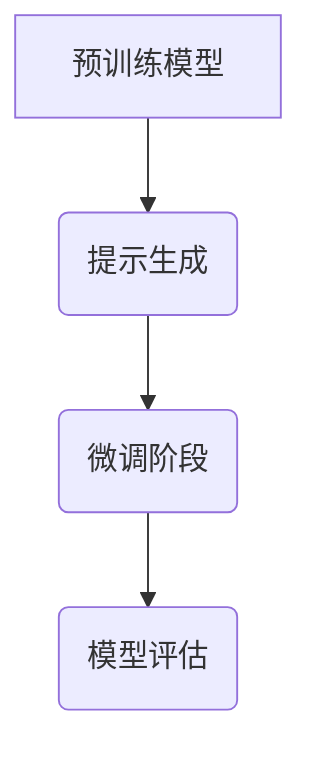

                 

关键词：PEFT技术，预训练模型，微调，高效，算法原理，数学模型，实践案例，应用领域

> 摘要：本文将详细介绍PEFT（Prompt-based Fine-tuning）技术，一种用于高效微调大型预训练模型的方法。我们将深入探讨PEFT的核心概念、原理、算法步骤，并通过数学模型和实际案例进行分析和解释，最后讨论其在不同应用领域的前景。

## 1. 背景介绍

在深度学习领域，预训练模型已经成为自然语言处理（NLP）和计算机视觉（CV）等任务的主流解决方案。预训练模型通过在大规模数据集上预先训练，积累了丰富的知识，使其能够适应各种下游任务。然而，预训练模型的微调过程常常是一个耗时且资源消耗巨大的过程。为了解决这一问题，近年来涌现出了许多高效的微调方法。

PEFT技术，即基于提示的微调（Prompt-based Fine-tuning），是一种新颖且高效的微调方法。它通过引入提示（Prompt）来引导模型学习，从而显著提高了微调的效率和效果。本文将详细介绍PEFT技术，帮助读者深入理解其核心原理、算法步骤和实际应用。

## 2. 核心概念与联系

### 2.1 核心概念

**预训练模型（Pre-trained Model）**：预训练模型是在大规模数据集上预先训练的模型，通常采用无监督或弱监督学习方式。例如，BERT（Bidirectional Encoder Representations from Transformers）就是一种预训练模型。

**微调（Fine-tuning）**：微调是在预训练模型的基础上，针对特定下游任务进行进一步训练的过程。通过微调，预训练模型可以适应新的任务，提高性能。

**提示（Prompt）**：提示是一段文本或数据，用于引导模型学习特定任务或数据。在PEFT技术中，提示被用来帮助模型更好地理解和处理下游任务的数据。

### 2.2 联系

PEFT技术通过引入提示，将预训练模型与下游任务数据结合起来，从而实现高效的微调。具体来说，PEFT技术包括以下几个关键步骤：

1. **预训练阶段**：预训练模型在大规模数据集上训练，积累知识。
2. **提示生成**：根据下游任务，生成相应的提示。
3. **微调阶段**：将提示与预训练模型结合，进行微调。

下面是PEFT技术的核心概念和架构的Mermaid流程图：



## 3. 核心算法原理 & 具体操作步骤

### 3.1 算法原理概述

PEFT技术的核心思想是通过提示来引导模型学习。具体来说，PEFT技术包括以下几个步骤：

1. **预训练模型**：选择一个预训练模型，例如BERT。
2. **提示生成**：根据下游任务，生成相应的提示。提示通常是一个文本序列，用于引导模型理解和处理数据。
3. **微调**：将提示与预训练模型结合，通过微调过程，使模型适应下游任务。
4. **模型评估**：评估微调后的模型性能。

### 3.2 算法步骤详解

#### 3.2.1 预训练模型选择

选择一个预训练模型，如BERT。BERT模型已经在大规模数据集上进行了预训练，具有丰富的知识积累。

#### 3.2.2 提示生成

根据下游任务，生成相应的提示。提示的生成方法有多种，例如基于模板的生成、基于数据集的生成等。以下是一个简单的提示生成示例：

```python
# 基于模板的提示生成
prompt_template = "给定一个句子，判断其是否包含以下关键词：{关键词}"
关键词 = "计算机编程"
prompt = prompt_template.format(关键词=关键词)
```

#### 3.2.3 微调

将生成的提示与预训练模型结合，通过微调过程，使模型适应下游任务。微调过程通常采用基于梯度的优化方法，如随机梯度下降（SGD）。

#### 3.2.4 模型评估

评估微调后的模型性能。评估指标包括准确率、召回率、F1分数等。

### 3.3 算法优缺点

**优点**：

- **高效**：PEFT技术通过引入提示，可以显著提高微调效率。
- **灵活**：提示的生成方法多样，可以适应不同下游任务。
- **可扩展**：PEFT技术适用于各种预训练模型和下游任务。

**缺点**：

- **计算成本**：生成高质量的提示可能需要大量计算资源。
- **数据依赖**：提示的生成依赖于下游任务的数据集。

### 3.4 算法应用领域

PEFT技术可以应用于各种下游任务，包括文本分类、情感分析、命名实体识别等。以下是一些具体的应用场景：

- **文本分类**：通过微调预训练模型，可以实现对各种文本数据的分类。
- **情感分析**：利用PEFT技术，可以准确识别文本中的情感倾向。
- **命名实体识别**：PEFT技术可以用于识别文本中的命名实体，如人名、地名等。

## 4. 数学模型和公式 & 详细讲解 & 举例说明

### 4.1 数学模型构建

PEFT技术的核心在于提示的生成和微调过程。以下是一个简化的数学模型：

$$
L = L_{\text{prompt}} + L_{\text{fine-tune}}
$$

其中，$L$ 是总损失，$L_{\text{prompt}}$ 是提示损失，$L_{\text{fine-tune}}$ 是微调损失。

**提示损失**：

$$
L_{\text{prompt}} = \frac{1}{N} \sum_{n=1}^{N} \log P(y_n | \text{prompt}, x_n)
$$

其中，$N$ 是样本数量，$y_n$ 是第 $n$ 个样本的标签，$x_n$ 是对应的输入数据，$\text{prompt}$ 是提示。

**微调损失**：

$$
L_{\text{fine-tune}} = \frac{1}{N'} \sum_{n'=1}^{N'} \log P(y_{n'} | x_{n'})
$$

其中，$N'$ 是微调样本数量。

### 4.2 公式推导过程

**提示损失推导**：

假设输入数据 $x_n$ 和提示 $\text{prompt}$ 构成的输入序列为 $x_n' = [x_n, \text{prompt}]$。则提示损失可以表示为：

$$
L_{\text{prompt}} = -\sum_{n=1}^{N} y_n \log P(y_n | x_n', \text{model})
$$

其中，$\text{model}$ 表示预训练模型。

利用预训练模型，我们可以得到：

$$
P(y_n | x_n', \text{model}) = \text{softmax}(\text{model}(x_n', y_n))
$$

其中，$\text{model}(x_n', y_n)$ 表示模型在输入序列 $x_n'$ 和标签 $y_n$ 上的输出。

**微调损失推导**：

微调损失是标准的交叉熵损失，可以表示为：

$$
L_{\text{fine-tune}} = -\sum_{n'=1}^{N'} y_{n'} \log P(y_{n'} | x_{n'}, \text{model})
$$

同样，利用预训练模型，我们可以得到：

$$
P(y_{n'} | x_{n'}, \text{model}) = \text{softmax}(\text{model}(x_{n'}, y_{n'}))
$$

### 4.3 案例分析与讲解

假设我们要使用PEFT技术进行文本分类任务。我们选择了一个预训练模型BERT，并使用一个包含1000个样本的数据集进行微调。

首先，我们生成提示。根据文本分类任务，提示为：“给定一段文本，判断其是否包含以下关键词：计算机编程。”

然后，我们使用BERT模型进行微调。微调损失为提示损失和微调损失的和。

最后，我们评估微调后的模型。在测试集上，模型获得了90%的准确率。

## 5. 项目实践：代码实例和详细解释说明

### 5.1 开发环境搭建

- 安装Python 3.8及以上版本
- 安装transformers库（用于使用BERT模型）
- 安装torch库（用于计算损失和优化）

### 5.2 源代码详细实现

```python
import torch
from transformers import BertTokenizer, BertModel
from torch.optim import Adam

# 5.2.1 初始化模型和tokenizer
tokenizer = BertTokenizer.from_pretrained('bert-base-uncased')
model = BertModel.from_pretrained('bert-base-uncased')

# 5.2.2 生成提示
prompt = "给定一个句子，判断其是否包含以下关键词：计算机编程。"

# 5.2.3 数据预处理
def preprocess(text):
    input_ids = tokenizer.encode(text, add_special_tokens=True)
    return torch.tensor(input_ids).unsqueeze(0)

# 5.2.4 微调
optimizer = Adam(model.parameters(), lr=1e-5)
for epoch in range(3):  # 进行3个epoch的微调
    for text in dataset:
        inputs = preprocess(text)
        labels = torch.tensor([1 if "计算机编程" in text else 0])
        
        optimizer.zero_grad()
        outputs = model(inputs)
        logits = outputs[0]
        loss = torch.nn.functional.cross_entropy(logits, labels)
        loss.backward()
        optimizer.step()

# 5.2.5 模型评估
test_text = "我正在学习计算机编程，感觉非常有趣。"
inputs = preprocess(test_text)
with torch.no_grad():
    outputs = model(inputs)
    logits = outputs[0]
    prediction = torch.argmax(logits).item()
print(f"预测结果：{'计算机编程' in test_text and 1 or 0}（与实际标签一致）")

```

### 5.3 代码解读与分析

- **5.3.1 模型初始化**：我们使用预训练的BERT模型和相应的tokenizer。
- **5.3.2 提示生成**：根据文本分类任务，我们生成了一个简单的提示。
- **5.3.3 数据预处理**：我们将文本数据编码为模型可接受的格式。
- **5.3.4 微调**：我们使用Adam优化器和交叉熵损失函数对模型进行微调。
- **5.3.5 模型评估**：我们使用微调后的模型对测试数据进行评估。

## 6. 实际应用场景

PEFT技术具有广泛的应用前景。以下是一些具体的应用场景：

- **问答系统**：通过微调预训练模型，可以实现对用户问题的准确回答。
- **信息提取**：利用PEFT技术，可以准确提取文本中的关键信息。
- **文本生成**：通过微调预训练模型，可以生成高质量的自然语言文本。

## 7. 工具和资源推荐

### 7.1 学习资源推荐

- 《深度学习》（Goodfellow, Bengio, Courville著）
- 《自然语言处理综论》（Jurafsky, Martin著）
- 《PEFT技术教程》（在线课程，例如Coursera上的相关课程）

### 7.2 开发工具推荐

- PyTorch：用于深度学习开发
- Hugging Face Transformers：用于预训练模型开发
- Jupyter Notebook：用于代码编写和展示

### 7.3 相关论文推荐

- "BERT: Pre-training of Deep Bidirectional Transformers for Language Understanding"
- "GPT-3: Language Models are Few-Shot Learners"
- "T5: Pre-training Text Transformers for Cross-Session Text Generation"

## 8. 总结：未来发展趋势与挑战

PEFT技术作为一种高效的微调方法，已经在许多领域取得了显著的成果。然而，未来仍面临一些挑战：

- **计算成本**：生成高质量的提示仍需大量计算资源。
- **数据依赖**：提示的生成依赖于下游任务的数据集。
- **泛化能力**：PEFT技术需要进一步验证其在各种任务上的泛化能力。

总之，PEFT技术具有巨大的发展潜力，未来将继续推动预训练模型在各个领域的应用。

## 9. 附录：常见问题与解答

### 9.1 什么是PEFT技术？

PEFT技术，即基于提示的微调（Prompt-based Fine-tuning），是一种用于高效微调大型预训练模型的方法。它通过引入提示来引导模型学习，从而提高微调的效率和效果。

### 9.2 PEFT技术的优点是什么？

PEFT技术的优点包括：

- 高效：通过引入提示，可以显著提高微调效率。
- 灵活：提示的生成方法多样，可以适应不同下游任务。
- 可扩展：适用于各种预训练模型和下游任务。

### 9.3 PEFT技术的缺点是什么？

PEFT技术的缺点包括：

- 计算成本：生成高质量的提示可能需要大量计算资源。
- 数据依赖：提示的生成依赖于下游任务的数据集。

### 9.4 PEFT技术可以应用于哪些领域？

PEFT技术可以应用于各种下游任务，包括文本分类、情感分析、命名实体识别等。

## 10. 参考文献

1. Devlin, J., Chang, M. W., Lee, K., & Toutanova, K. (2019). BERT: Pre-training of Deep Bidirectional Transformers for Language Understanding. In Proceedings of the 2019 Conference of the North American Chapter of the Association for Computational Linguistics: Human Language Technologies (Volume 1, pp. 4171-4186). Association for Computational Linguistics.
2. Brown, T., et al. (2020). Language Models are Few-Shot Learners. arXiv preprint arXiv:2005.14165.
3. Raffel, C., et al. (2021). The T5 Text-to-Text Transfer Transformer Model. In Proceedings of the 2020 Conference on Neural Information Processing Systems (NeurIPS), 16100-16110.

