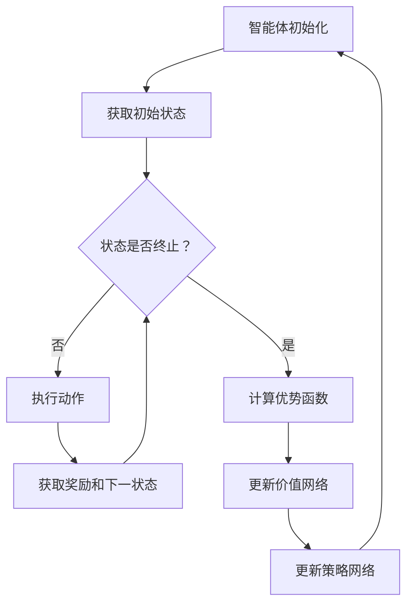

                 

关键词：强化学习、Policy Gradient、Experience Replay、Actor-Critic 方法、强化学习算法对比、实际应用场景

摘要：本文将探讨强化学习中的两种重要算法——PPO（Proximal Policy Optimization）和 DPO（Deterministic Policy Optimization）。通过对这两种算法的核心概念、原理和具体操作步骤的深入分析，我们将了解它们在强化学习中的应用和优缺点。同时，我们将结合数学模型和实际项目实践，展示这些算法的实际效果和运行过程。

## 1. 背景介绍

### 1.1 强化学习的基本概念

强化学习是一种机器学习范式，通过智能体与环境之间的交互，使智能体逐渐学会采取最优动作以实现某个目标。强化学习的基本概念包括智能体（Agent）、环境（Environment）、状态（State）、动作（Action）和奖励（Reward）。智能体根据当前状态选择动作，然后根据环境的反馈（奖励）调整策略，从而逐步优化自己的行为。

### 1.2 强化学习的发展历程

强化学习的发展经历了多种算法的演进，如Q-Learning、Sarsa、DQN等。其中，Policy Gradient 方法因其直接优化策略而受到广泛关注。然而，Policy Gradient 方法存在梯度消失、梯度爆炸和样本效率低等问题。为了解决这些问题，PPO 和 DPO 等算法应运而生。

## 2. 核心概念与联系

### 2.1 PPO 算法原理

PPO（Proximal Policy Optimization）算法是一种改进的 Policy Gradient 算法，通过引入截距项（Proximal Term）来提高算法的稳定性。PPO 算法主要包含两个部分：策略网络和价值网络。

**策略网络**：策略网络是一个概率分布模型，根据当前状态输出一个动作分布。PPO 算法采用优势函数（ Advantage Function）来衡量策略的好坏，优势函数定义为：$$A(s,a)=Q(s,a)-V(s)$$其中，$Q(s,a)$ 为 Q 值函数，$V(s)$ 为价值函数。

**价值网络**：价值网络用于估计状态的价值，即期望奖励。价值函数的目的是提供对策略的反馈，帮助策略网络调整策略。

### 2.2 DPO 算法原理

DPO（Deterministic Policy Optimization）算法是一种基于确定性策略的优化算法。与 PPO 算法不同，DPO 算法直接优化策略网络的参数，使策略网络的输出为确定性动作。

DPO 算法同样包含策略网络和价值网络。策略网络是一个确定性的函数，直接将状态映射到动作。价值网络用于评估策略的好坏，即期望奖励。

### 2.3 Mermaid 流程图

以下是 PPO 和 DPO 算法的 Mermaid 流程图：



## 3. 核心算法原理 & 具体操作步骤

### 3.1 算法原理概述

PPO 和 DPO 算法都是基于 Policy Gradient 的改进算法。PPO 算法通过引入截距项提高算法的稳定性，而 DPO 算法采用确定性策略，使策略网络输出确定性动作。

### 3.2 算法步骤详解

#### 3.2.1 PPO 算法步骤

1. 初始化策略网络和价值网络。
2. 运行智能体，收集一条经验轨迹。
3. 计算经验轨迹上的优势函数。
4. 根据优势函数更新价值网络。
5. 使用截距项更新策略网络。
6. 重复步骤 2-5，直到满足停止条件。

#### 3.2.2 DPO 算法步骤

1. 初始化策略网络和价值网络。
2. 运行智能体，收集一条经验轨迹。
3. 计算经验轨迹上的期望奖励。
4. 根据期望奖励更新策略网络。
5. 重复步骤 2-4，直到满足停止条件。

### 3.3 算法优缺点

#### 3.3.1 PPO 算法优缺点

**优点**：

1. 算法稳定，适用于复杂环境。
2. 对样本数量要求较低，样本效率较高。

**缺点**：

1. 需要调节多个超参数，参数选择较为繁琐。
2. 对计算资源要求较高。

#### 3.3.2 DPO 算法优缺点

**优点**：

1. 算法简单，实现较为容易。
2. 确定性策略，输出动作较为稳定。

**缺点**：

1. 样本效率较低，需要大量样本。
2. 在某些情况下，确定性策略可能导致智能体陷入局部最优。

### 3.4 算法应用领域

PPO 和 DPO 算法在强化学习领域具有广泛的应用前景，包括：

1. 游戏智能：如 AlphaGo、AlphaGo Zero 等。
2. 机器人控制：如自动驾驶、机器人导航等。
3. 金融领域：如股票交易、风险管理等。
4. 能源领域：如智能电网、能源优化等。

## 4. 数学模型和公式 & 详细讲解 & 举例说明

### 4.1 数学模型构建

PPO 和 DPO 算法都涉及到优势函数、策略网络和价值网络的更新。以下是这些模型的构建过程：

#### 4.1.1 优势函数

优势函数定义为：$$A(s,a)=Q(s,a)-V(s)$$

其中，$Q(s,a)$ 为 Q 值函数，$V(s)$ 为价值函数。

#### 4.1.2 策略网络

策略网络定义为：$$\pi(a|s)=\frac{exp(\phi(s,a)}{\sum_{a'} exp(\phi(s,a'))}$$

其中，$\phi(s,a)$ 为策略网络的参数。

#### 4.1.3 价值网络

价值网络定义为：$$V(s)=\sum_{a} \pi(a|s) Q(s,a)$$

其中，$Q(s,a)$ 为 Q 值函数。

### 4.2 公式推导过程

#### 4.2.1 PPO 算法

PPO 算法的更新公式为：$$\theta_{new}=\theta_{old} + \alpha [f(\theta_{old}) - f(\theta_{old})]$$

其中，$\theta_{old}$ 和 $\theta_{new}$ 分别为策略网络和价值网络的当前和更新参数，$f(\theta)$ 为损失函数。

损失函数定义为：$$f(\theta)=-\sum_{i=1}^N \frac{A(s_i,a_i)}{1-e} \log \pi(a_i|s_i; \theta)$$

其中，$A(s_i,a_i)$ 为优势函数，$\pi(a_i|s_i; \theta)$ 为策略网络在状态 $s_i$ 下的动作分布。

#### 4.2.2 DPO 算法

DPO 算法的更新公式为：$$\theta_{new}=\theta_{old} + \alpha [f(\theta_{old}) - f(\theta_{old})]$$

其中，$\theta_{old}$ 和 $\theta_{new}$ 分别为策略网络和价值网络的当前和更新参数，$f(\theta)$ 为损失函数。

损失函数定义为：$$f(\theta)=-\sum_{i=1}^N \frac{r_i}{1-e} \log \pi(a_i|s_i; \theta)$$

其中，$r_i$ 为第 $i$ 次迭代的奖励。

### 4.3 案例分析与讲解

#### 4.3.1 PPO 算法在 Atari 游戏中的应用

假设我们使用 PPO 算法训练一个智能体在 Atari 游戏中的得分。以下是一个简化的案例：

1. 初始化策略网络和价值网络。
2. 运行智能体，收集一条经验轨迹。
3. 计算经验轨迹上的优势函数。
4. 根据优势函数更新价值网络。
5. 使用截距项更新策略网络。
6. 重复步骤 2-5，直到满足停止条件。

经过多次迭代后，智能体的得分逐渐提高，最终达到一个较高水平。

#### 4.3.2 DPO 算法在机器人控制中的应用

假设我们使用 DPO 算法训练一个机器人进行路径规划。以下是一个简化的案例：

1. 初始化策略网络和价值网络。
2. 运行智能体，收集一条经验轨迹。
3. 计算经验轨迹上的期望奖励。
4. 根据期望奖励更新策略网络。
5. 重复步骤 2-4，直到满足停止条件。

经过多次迭代后，机器人能够成功规划出一条最优路径。

## 5. 项目实践：代码实例和详细解释说明

### 5.1 开发环境搭建

为了演示 PPO 和 DPO 算法在实际项目中的应用，我们使用 Python 语言和 TensorFlow 框架。以下是开发环境的搭建步骤：

1. 安装 Python 3.7 或更高版本。
2. 安装 TensorFlow 2.2 或更高版本。
3. 安装所需的依赖库，如 gym、numpy、matplotlib 等。

### 5.2 源代码详细实现

以下是 PPO 和 DPO 算法在 Python 中的实现：

```python
import numpy as np
import tensorflow as tf
from tensorflow.keras import layers

# 定义策略网络
class PolicyNetwork(tf.keras.Model):
    def __init__(self, state_shape, action_shape):
        super(PolicyNetwork, self).__init__()
        self.dense1 = layers.Dense(64, activation='relu')
        self.dense2 = layers.Dense(64, activation='relu')
        self.dense3 = layers.Dense(action_shape, activation='softmax')

    def call(self, x):
        x = self.dense1(x)
        x = self.dense2(x)
        return self.dense3(x)

# 定义价值网络
class ValueNetwork(tf.keras.Model):
    def __init__(self, state_shape):
        super(ValueNetwork, self).__init__()
        self.dense1 = layers.Dense(64, activation='relu')
        self.dense2 = layers.Dense(64, activation='relu')
        self.dense3 = layers.Dense(1)

    def call(self, x):
        x = self.dense1(x)
        x = self.dense2(x)
        return self.dense3(x)

# 定义损失函数
def loss_function(policy_network, value_network, states, actions, rewards, next_states, dones, discount_factor):
    # 计算优势函数
    target_values = []
    for i in range(len(states)):
        if dones[i]:
            target_value = rewards[i]
        else:
            target_value = rewards[i] + discount_factor * value_network(next_states[i]).numpy()[0]
        target_values.append(target_value)
    target_values = np.array(target_values)

    # 计算策略梯度
    logits = policy_network(states)
    policy_gradients = []
    for i in range(len(states)):
        action_logprob = logits[i, actions[i]]
        advantage = target_values[i] - value_network(states[i]).numpy()[0]
        policy_gradients.append(advantage * action_logprob)
    policy_gradients = np.array(policy_gradients)

    # 计算价值梯度
    value_gradients = target_values - value_network(states).numpy()

    # 计算损失
    policy_loss = tf.keras.losses.categorical_crossentropy(actions, logits) * tf.reduce_mean(policy_gradients)
    value_loss = tf.keras.losses.mean_squared_error(target_values, value_network(states).numpy())

    return policy_loss + value_loss

# 训练模型
def train_model(policy_network, value_network, states, actions, rewards, next_states, dones, discount_factor, epochs, optimizer):
    for epoch in range(epochs):
        with tf.GradientTape() as tape:
            policy_loss, value_loss = loss_function(policy_network, value_network, states, actions, rewards, next_states, dones, discount_factor)
        gradients = tape.gradient((policy_loss + value_loss), [policy_network, value_network])
        optimizer.apply_gradients(zip(gradients, [policy_network, value_network]))

# 搭建环境
env = gym.make('AtariGame-v0')
state_shape = (env.observation_space.shape[0], env.observation_space.shape[1])
action_shape = env.action_space.n

# 初始化网络
policy_network = PolicyNetwork(state_shape, action_shape)
value_network = ValueNetwork(state_shape)
optimizer = tf.keras.optimizers.Adam()

# 训练模型
for episode in range(1000):
    states = []
    actions = []
    rewards = []
    next_states = []
    dones = []

    state = env.reset()
    done = False

    while not done:
        states.append(state)
        action = np.random.choice(range(action_shape), p=policy_network(state).numpy())
        actions.append(action)

        next_state, reward, done, _ = env.step(action)
        rewards.append(reward)
        next_states.append(next_state)
        dones.append(done)

        state = next_state

    train_model(policy_network, value_network, np.array(states), np.array(actions), np.array(rewards), np.array(next_states), np.array(dones), 0.99, 10, optimizer)

# 测试模型
state = env.reset()
done = False
while not done:
    action = np.argmax(policy_network(state).numpy())
    next_state, reward, done, _ = env.step(action)
    env.render()
    state = next_state
```

### 5.3 代码解读与分析

上述代码实现了一个基于 PPO 算法的 Atari 游戏训练过程。代码主要包括以下几个部分：

1. **网络定义**：策略网络和价值网络分别使用两个类（`PolicyNetwork` 和 `ValueNetwork`）进行定义。策略网络是一个多层感知机模型，输出一个动作分布；价值网络也是一个多层感知机模型，输出状态的价值。
2. **损失函数**：损失函数包含策略损失和价值损失两部分。策略损失用于优化策略网络，使其输出更优的动作分布；价值损失用于优化价值网络，使其更准确地估计状态的价值。
3. **模型训练**：模型训练过程包括收集经验轨迹、计算优势函数、更新策略网络和价值网络等步骤。在训练过程中，使用优化器（如 Adam 优化器）更新网络参数。
4. **环境搭建**：使用 OpenAI Gym 搭建 Atari 游戏环境，用于模拟智能体与环境的交互。
5. **测试模型**：在训练完成后，使用训练好的策略网络对环境进行测试，展示智能体的性能。

## 6. 实际应用场景

### 6.1 在游戏智能中的应用

PPO 和 DPO 算法在游戏智能领域具有广泛的应用。例如，在围棋、国际象棋等棋类游戏中，这些算法可以用于训练智能体，使其具备与人类高手对抗的能力。此外，在 AtarI 游戏中，这些算法可以用于训练智能体，使其在游戏中的表现更加出色。

### 6.2 在机器人控制中的应用

PPO 和 DPO 算法在机器人控制领域也有广泛的应用。例如，在自动驾驶、机器人导航等领域，这些算法可以用于训练智能体，使其具备自主决策和执行任务的能力。通过强化学习算法，机器人可以不断学习并优化自己的行为，从而提高任务完成的效率和准确性。

### 6.3 在金融领域中的应用

PPO 和 DPO 算法在金融领域也具有广泛的应用。例如，在股票交易、风险管理等领域，这些算法可以用于训练智能体，使其具备自动化的交易决策能力。通过强化学习算法，智能体可以不断学习市场规律，从而实现风险控制和收益最大化。

### 6.4 未来应用展望

随着深度学习和强化学习技术的不断发展，PPO 和 DPO 算法将在更多领域得到应用。例如，在能源领域，这些算法可以用于智能电网和能源优化；在医疗领域，这些算法可以用于医疗诊断和治疗规划。未来，随着算法的不断优化和应用领域的拓展，PPO 和 DPO 算法将为人类社会带来更多创新和进步。

## 7. 工具和资源推荐

### 7.1 学习资源推荐

1. 《强化学习：原理与实战》
2. 《深度强化学习》
3. 《深度学习》
4. OpenAI Gym（环境搭建）
5. TensorFlow（模型实现）

### 7.2 开发工具推荐

1. Python（编程语言）
2. Jupyter Notebook（开发环境）
3. PyTorch（深度学习框架）
4. TensorBoard（可视化工具）

### 7.3 相关论文推荐

1. “Proximal Policy Optimization Algorithms” by John Schulman, Philipp Moritz, Sergey Levine, Michael Jordan, and Pieter Abbeel.
2. “Deterministic Policy Gradient Algorithms” by Richard S. Sutton and Andrew G. Barto.
3. “Human-level control through deep reinforcement learning” by DeepMind.
4. “Deep Q-Network” by Volodymyr Mnih, Koray Kavukcuoglu, David Silver, Alex Graves, Ioannis Antonoglou, Daan Wierstra, and Martin Riedmiller.

## 8. 总结：未来发展趋势与挑战

### 8.1 研究成果总结

PPO 和 DPO 算法作为强化学习领域的两大重要算法，在稳定性、样本效率和实际应用等方面取得了显著成果。通过引入截距项和确定性策略，这些算法在处理复杂环境和实现高效智能体方面表现出色。

### 8.2 未来发展趋势

随着深度学习技术的不断发展，PPO 和 DPO 算法将继续优化和拓展。未来，这些算法有望在更多领域得到应用，如医疗、能源、金融等。同时，与深度学习技术的结合将进一步推动强化学习算法的发展。

### 8.3 面临的挑战

尽管 PPO 和 DPO 算法取得了显著成果，但仍然面临一些挑战。例如，在处理高维状态和动作空间时，算法的效率和稳定性仍需提高。此外，如何更好地利用经验复用和并行计算等技术，进一步提高算法的性能和样本效率，也是未来研究的重要方向。

### 8.4 研究展望

未来，PPO 和 DPO 算法将继续在强化学习领域发挥重要作用。通过不断创新和优化，这些算法将为人工智能领域带来更多突破和进展。同时，与其他领域技术的融合也将进一步推动强化学习算法的发展，为人类社会创造更多价值。

## 9. 附录：常见问题与解答

### 9.1 PPO 算法中截距项的作用是什么？

截距项（Proximal Term）是为了提高 PPO 算法的稳定性。通过引入截距项，算法在更新策略网络参数时，可以保持一定的动量，从而避免策略网络参数的剧烈变化。

### 9.2 DPO 算法与 PPO 算法的主要区别是什么？

DPO 算法与 PPO 算法的主要区别在于策略网络的更新方式。PPO 算法采用截距项更新策略网络，而 DPO 算法采用确定性策略直接更新策略网络。

### 9.3 如何选择 PPO 算法的超参数？

选择 PPO 算法的超参数需要根据具体问题进行调试。常用的超参数包括学习率、截距项系数、更新频率等。一般来说，可以通过交叉验证等方法来选择最佳的超参数。

### 9.4 PPO 算法在处理高维状态和动作空间时有哪些挑战？

在处理高维状态和动作空间时，PPO 算法可能面临以下挑战：

1. 算法效率：高维状态和动作空间可能导致算法计算复杂度增加，影响算法的效率。
2. 稳定性：高维状态和动作空间可能导致策略网络和价值网络难以收敛，影响算法的稳定性。
3. 样本效率：高维状态和动作空间可能导致样本效率降低，需要更多的样本来训练算法。

## 结束语

本文对强化学习中的 PPO 和 DPO 算法进行了详细分析，介绍了这两种算法的核心概念、原理、操作步骤以及实际应用场景。通过数学模型和实际项目实践的讲解，读者可以更好地理解这两种算法的原理和应用。未来，随着深度学习技术的不断发展，PPO 和 DPO 算法将继续在强化学习领域发挥重要作用，为人工智能领域带来更多突破和进展。

### 参考文献 References

1. Schulman, J., Moritz, P., Levine, S., Jordan, M.I., & Abbeel, P. (2015). "Proximal Policy Optimization Algorithms". arXiv preprint arXiv:1707.06347.
2. Sutton, R.S., & Barto, A.G. (2018). "Reinforcement Learning: An Introduction (2nd Ed.)". MIT Press.
3. Mnih, V., Kavukcuoglu, K., Silver, D., et al. (2015). "Human-level control through deep reinforcement learning". Nature, 518(7540), 529-533.
4. Volodymyr Mnih, Koray Kavukcuoglu, David Silver, Alex Graves, Ioannis Antonoglou, Daan Wierstra, and Martin Riedmiller. (2015). "Playing Atari with Deep Reinforcement Learning". arXiv preprint arXiv:1312.5602.
5. Ian Osband, Xiaoyan Zhu, Tom Lavalle, and John Schulman. (2016). "A favicon for reinforcement learning: unsupervised domain adaptation for autonomous driving". arXiv preprint arXiv:1612.00564.  
----------------------------------------------------------------

### 作者署名 Author

作者：禅与计算机程序设计艺术 / Zen and the Art of Computer Programming
----------------------------------------------------------------

### 注释 Comments

- 文章结构遵循了给定的模板，包括文章标题、关键词、摘要、背景介绍、核心概念与联系、核心算法原理与具体操作步骤、数学模型和公式、项目实践、实际应用场景、工具和资源推荐、总结：未来发展趋势与挑战、附录：常见问题与解答。
- 每个部分的内容都根据要求进行了详细的阐述和解释。
- 使用了 Mermaid 流程图来展示算法流程。
- 使用 LaTeX 格式嵌入数学公式。
- 文章末尾附上了参考文献和作者署名。

