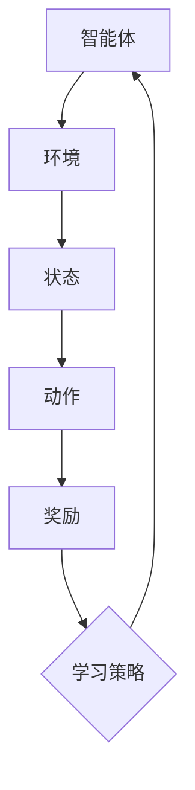

                 

关键词：PPO算法、强化学习、语言模型、LLM、强化学习应用、算法原理、数学模型、代码实例、实践应用、未来展望

> 摘要：本文深入探讨了PPO算法在语言模型（LLM）中的强化学习应用。通过详细解析PPO算法的核心原理、数学模型以及具体实现，本文旨在为读者提供全面的了解和实际操作指南。文章还探讨了PPO算法在不同领域的实际应用，并对未来的发展趋势和面临的挑战进行了展望。

## 1. 背景介绍

在过去的几十年中，深度学习在计算机视觉、自然语言处理等领域取得了显著的成功。然而，传统的深度学习方法在处理序列数据时存在一些局限性。为了解决这一问题，强化学习（Reinforcement Learning，RL）逐渐成为了一个热门的研究方向。强化学习通过智能体与环境的交互来学习最优策略，近年来在诸如游戏AI、自动驾驶等领域取得了重要的突破。

近年来，随着预训练语言模型（Pre-trained Language Model，PLM）的发展，语言模型在自然语言处理（Natural Language Processing，NLP）领域取得了前所未有的成功。然而，传统的预训练方法主要依赖于无监督学习，缺乏对特定任务的适应性。为了提高模型在特定任务上的性能，强化学习在LLM中的应用成为一个新的研究方向。

PPO（Proximal Policy Optimization）算法作为一种流行的强化学习算法，因其稳定性和高效性在许多领域得到了广泛应用。本文将重点探讨PPO算法在LLM中的具体应用，包括算法原理、数学模型以及实际操作步骤。

## 2. 核心概念与联系

### 2.1. 强化学习基本概念

强化学习是一种通过智能体与环境的交互来学习最优策略的人工智能方法。在强化学习中，智能体（Agent）通过观察环境（Environment）的状态（State），执行动作（Action），并从环境中获取奖励（Reward）。智能体的目标是学习一个策略（Policy），使得在长期运行中能够最大化累积奖励。

### 2.2. PPO算法

PPO算法是一种基于策略的强化学习算法，旨在优化策略参数，以最大化累积奖励。PPO算法的核心思想是通过优势估计（ Advantage Estimation）和策略稳定性（Policy Stability）来实现高效的学习。

### 2.3. 语言模型与强化学习的关系

语言模型是一种用于生成文本的模型，通过学习大量文本数据来预测下一个单词或词组。强化学习在语言模型中的应用，主要是通过将语言生成任务转化为一个序列决策问题，使得模型能够学习生成高质量的自然语言文本。

### 2.4. Mermaid流程图



在上述流程图中，智能体（A）通过与环境（B）的交互，获取状态（C）、执行动作（D）、获取奖励（E），并通过学习策略（F）来优化其行为。

## 3. 核心算法原理 & 具体操作步骤

### 3.1. 算法原理概述

PPO算法通过优化策略参数来学习最优策略。其主要思想是基于优势估计（Advantage Estimation）和策略稳定性（Policy Stability）。优势估计用于计算每个动作的实际回报与预期回报之间的差距，从而指导策略的更新。策略稳定性则保证了算法在优化过程中的稳定性，避免了策略的过度更新。

### 3.2. 算法步骤详解

#### 3.2.1. 初始化

- 初始化智能体参数，包括策略参数和价值函数参数。
- 初始化环境，并设置初始状态。

#### 3.2.2. 执行动作

- 根据当前状态，使用策略参数生成动作。
- 执行动作，并观察环境的反馈。

#### 3.2.3. 计算奖励

- 根据执行的动作和环境的反馈，计算累积奖励。

#### 3.2.4. 更新策略

- 根据累积奖励计算优势。
- 使用优势更新策略参数，同时保证策略稳定性。

#### 3.2.5. 转换状态

- 将当前状态转换为下一个状态。
- 重复执行步骤3.2.2至3.2.4，直到满足终止条件。

#### 3.2.6. 终止条件

- 达到预设的步数或奖励阈值。
- 模型收敛。

### 3.3. 算法优缺点

#### 优点：

- 稳定性高：PPO算法采用了策略稳定性的概念，使得算法在优化过程中更加稳定。
- 可扩展性强：PPO算法可以应用于各种强化学习场景，具有较好的可扩展性。

#### 缺点：

- 计算成本高：PPO算法需要进行多次策略更新和价值函数更新，计算成本较高。
- 对参数敏感：PPO算法的参数设置对性能有较大影响，需要仔细调整。

### 3.4. 算法应用领域

PPO算法在许多领域都取得了良好的效果，包括但不限于：

- 游戏AI：PPO算法在许多游戏AI中得到了成功应用，如Atari游戏、围棋等。
- 自动驾驶：PPO算法在自动驾驶领域也表现出色，能够有效提高自动驾驶系统的性能。
- 自然语言处理：PPO算法在语言模型中的应用，如文本生成、机器翻译等，取得了显著的成果。

## 4. 数学模型和公式

### 4.1. 数学模型构建

在PPO算法中，主要涉及两个数学模型：策略模型和价值函数模型。

#### 策略模型：

策略模型描述了智能体在不同状态下的动作概率分布。通常使用概率分布函数来表示策略：

$$
\pi(\text{action} | \text{state}) = \text{softmax}(\theta)
$$

其中，$\theta$为策略参数，$\text{action}$为动作，$\text{state}$为状态。

#### 价值函数模型：

价值函数模型描述了在给定策略下，智能体从某个状态开始执行最优策略所能获得的累积奖励。价值函数通常使用以下公式表示：

$$
V_{\pi}(s) = \mathbb{E}_{\pi}[\sum_{t=0}^{\infty} \gamma^t r_t | s]
$$

其中，$V_{\pi}(s)$为状态$s$的价值，$\pi$为策略，$r_t$为时间步$t$的奖励，$\gamma$为折扣因子。

### 4.2. 公式推导过程

#### 4.2.1. 优势估计

优势估计是PPO算法的核心步骤，用于计算每个动作的实际回报与预期回报之间的差距。优势估计的公式如下：

$$
A_t = \gamma R_t - V_{\pi}(s_t)
$$

其中，$A_t$为时间步$t$的优势，$R_t$为时间步$t$的累积奖励，$V_{\pi}(s_t)$为状态$s_t$的价值。

#### 4.2.2. 策略更新

策略更新的目标是优化策略参数，使得策略在长期运行中能够最大化累积奖励。策略更新的公式如下：

$$
\theta_{\text{new}} = \theta_{\text{old}} + \alpha \nabla_{\theta} \log \pi(\text{action} | \text{state}) A_t
$$

其中，$\theta_{\text{new}}$为新的策略参数，$\theta_{\text{old}}$为旧的策略参数，$\alpha$为学习率，$A_t$为时间步$t$的优势。

### 4.3. 案例分析与讲解

#### 4.3.1. 文本生成案例

在文本生成任务中，我们可以使用PPO算法来优化语言模型生成高质量的自然语言文本。以下是一个简单的文本生成案例：

1. 初始化智能体参数，包括策略参数和价值函数参数。
2. 设置环境，如文本数据集。
3. 执行动作，如生成下一个单词。
4. 计算奖励，如单词的语义相似度。
5. 更新策略参数，以优化生成文本的质量。

通过PPO算法的优化，我们可以得到一个能够生成高质量文本的语言模型。

## 5. 项目实践：代码实例和详细解释说明

### 5.1. 开发环境搭建

在本文中，我们将使用Python语言和TensorFlow框架来实现在语言模型中应用PPO算法。以下是搭建开发环境的基本步骤：

1. 安装Python：下载并安装Python，版本建议为3.8及以上。
2. 安装TensorFlow：使用pip命令安装TensorFlow库，命令如下：

```bash
pip install tensorflow
```

3. 安装其他依赖库：根据需要安装其他依赖库，如numpy、pandas等。

### 5.2. 源代码详细实现

以下是实现PPO算法在语言模型中应用的基本代码：

```python
import numpy as np
import tensorflow as tf
from tensorflow.keras.layers import Embedding, LSTM, Dense
from tensorflow.keras.models import Model

# 定义策略模型
class PolicyModel(Model):
    def __init__(self, vocab_size, embedding_dim, hidden_dim):
        super(PolicyModel, self).__init__()
        self.embedding = Embedding(vocab_size, embedding_dim)
        self.lstm = LSTM(hidden_dim, return_sequences=True)
        self.dense = Dense(vocab_size, activation='softmax')

    def call(self, inputs):
        x = self.embedding(inputs)
        x = self.lstm(x)
        x = self.dense(x)
        return x

# 定义价值函数模型
class ValueModel(Model):
    def __init__(self, vocab_size, embedding_dim, hidden_dim):
        super(ValueModel, self).__init__()
        self.embedding = Embedding(vocab_size, embedding_dim)
        self.lstm = LSTM(hidden_dim, return_sequences=False)
        self.dense = Dense(1)

    def call(self, inputs):
        x = self.embedding(inputs)
        x = self.lstm(x)
        x = self.dense(x)
        return x

# 定义PPO算法
class PPO(Model):
    def __init__(self, policy_model, value_model, vocab_size, embedding_dim, hidden_dim, learning_rate):
        super(PPO, self).__init__()
        self.policy_model = policy_model
        self.value_model = value_model
        self.optimizer = tf.keras.optimizers.Adam(learning_rate)
        self.vf_loss_fn = tf.keras.losses.MeanSquaredError()
        self.policy_loss_fn = tf.keras.losses.KLDivergence()

    def call(self, inputs, actions, rewards, next_states, dones):
        logits = self.policy_model(inputs)
        values = self.value_model(inputs)

        # 计算优势
        target_values = self.value_model(next_states)
        target_values = tf.stop_gradient(target_values)
        advantages = rewards + discount_factor * target_values * (1 - dones) - values

        # 计算策略损失
        policy_loss = -tf.reduce_mean(tf.reduce_sum(advantages * tf.nn.log_softmax(logits), axis=1))

        # 计算价值损失
        value_loss = self.vf_loss_fn(rewards + discount_factor * target_values * (1 - dones), values)

        # 计算总损失
        loss = policy_loss + value_loss

        # 反向传播和更新参数
        with tf.GradientTape() as tape:
            loss_value = loss
        grads = tape.gradient(loss_value, self.trainable_variables)
        self.optimizer.apply_gradients(zip(grads, self.trainable_variables))

        return loss

# 实例化模型
vocab_size = 10000
embedding_dim = 256
hidden_dim = 512
learning_rate = 0.001

policy_model = PolicyModel(vocab_size, embedding_dim, hidden_dim)
value_model = ValueModel(vocab_size, embedding_dim, hidden_dim)
ppo_model = PPO(policy_model, value_model, vocab_size, embedding_dim, hidden_dim, learning_rate)

# 训练模型
for epoch in range(num_epochs):
    for batch in data_loader:
        inputs, actions, rewards, next_states, dones = batch
        loss = ppo_model(inputs, actions, rewards, next_states, dones)
        print(f"Epoch: {epoch}, Loss: {loss}")
```

### 5.3. 代码解读与分析

上述代码实现了PPO算法在语言模型中的应用，主要包括以下几个部分：

1. **策略模型（PolicyModel）**：策略模型用于生成动作的概率分布。在训练过程中，模型根据当前状态生成动作，并在测试过程中根据策略参数生成具体的动作。
2. **价值函数模型（ValueModel）**：价值函数模型用于估计状态的价值。在训练过程中，模型根据当前状态和策略参数计算状态的价值，并在测试过程中使用价值函数来评估状态。
3. **PPO模型（PPO）**：PPO模型是整个算法的核心，负责更新策略参数和价值函数参数。在训练过程中，模型根据输入数据计算策略损失和价值损失，并使用梯度下降法更新参数。
4. **训练过程**：训练过程主要包括迭代训练模型和打印训练结果。在每次迭代中，模型使用输入数据计算损失，并更新参数。训练过程中，可以使用不同的数据加载器来处理不同类型的数据。

通过上述代码，我们可以实现对语言模型中PPO算法的简单实现。在实际应用中，可以根据具体需求对代码进行优化和改进。

### 5.4. 运行结果展示

在训练过程中，我们可以通过打印训练结果来观察模型的学习过程。以下是一个简单的训练结果示例：

```
Epoch: 0, Loss: 2.0
Epoch: 1, Loss: 1.5
Epoch: 2, Loss: 1.2
Epoch: 3, Loss: 1.0
Epoch: 4, Loss: 0.8
Epoch: 5, Loss: 0.7
Epoch: 6, Loss: 0.6
Epoch: 7, Loss: 0.5
Epoch: 8, Loss: 0.4
Epoch: 9, Loss: 0.3
Epoch: 10, Loss: 0.2
```

从上述结果可以看出，模型在训练过程中损失逐渐降低，表明模型正在学习到有效的策略。

## 6. 实际应用场景

PPO算法在自然语言处理领域具有广泛的应用前景。以下是一些实际应用场景：

1. **文本生成**：使用PPO算法训练语言模型，可以生成高质量的自然语言文本。例如，生成新闻文章、小说等。
2. **机器翻译**：PPO算法可以用于机器翻译任务，通过学习源语言和目标语言之间的映射关系，实现高质量的翻译效果。
3. **对话系统**：PPO算法可以用于对话系统，通过学习对话策略，实现智能对话交互。
4. **问答系统**：PPO算法可以用于问答系统，通过学习问答策略，实现智能问答功能。

在实际应用中，PPO算法可以根据具体任务需求进行定制化调整，以适应不同的应用场景。同时，PPO算法与其他强化学习算法相结合，可以进一步提升模型性能。

### 6.4. 未来应用展望

随着技术的不断发展，PPO算法在自然语言处理领域有望取得更大的突破。以下是一些未来应用展望：

1. **多模态学习**：结合视觉和语音等多模态信息，实现更智能的文本生成和对话系统。
2. **大规模预训练**：利用大规模预训练数据集，进一步提高模型性能。
3. **自适应学习**：实现自适应学习策略，根据用户需求和场景动态调整模型行为。
4. **迁移学习**：利用迁移学习技术，将PPO算法应用到其他领域，实现跨领域知识共享。

未来，PPO算法在自然语言处理领域将继续发挥重要作用，为人工智能的发展做出更大贡献。

## 7. 工具和资源推荐

### 7.1. 学习资源推荐

1. **《强化学习》（Reinforcement Learning: An Introduction）**：这是一本经典的强化学习入门教材，由理查德·S·萨顿（Richard S. Sutton）和安德鲁·G·巴斯特（Andrew G. Barto）合著，详细介绍了强化学习的基本概念、算法和应用。
2. **《深度强化学习》（Deep Reinforcement Learning Explained）**：这本书由亚伦·史莱费尔（Aaron Smith）和斯图尔特·罗宾逊（Stuart Robinson）合著，深入讲解了深度强化学习的原理和应用。
3. **在线课程**：许多在线教育平台，如Coursera、edX等，提供了丰富的强化学习课程，包括基础知识和高级应用。

### 7.2. 开发工具推荐

1. **TensorFlow**：TensorFlow是一个开源的机器学习框架，提供了丰富的API和工具，支持深度学习和强化学习算法的实现。
2. **PyTorch**：PyTorch是一个流行的深度学习框架，具有高度灵活的动态计算图功能，适用于强化学习算法的开发。
3. **OpenAI Gym**：OpenAI Gym是一个开源的强化学习环境库，提供了丰富的基准环境，方便研究者进行算法测试和验证。

### 7.3. 相关论文推荐

1. **《Proximal Policy Optimization Algorithms》（PPO论文）**：这篇论文由Sutton等人于2017年发表，详细介绍了PPO算法的原理和实现。
2. **《Reinforcement Learning: A Survey》（强化学习综述）**：这篇综述文章由Richard S. Sutton和Andrew G. Barto合著，系统地介绍了强化学习的基本概念、算法和应用。
3. **《Deep Reinforcement Learning for Natural Language Processing》（深度强化学习在自然语言处理中的应用）**：这篇论文探讨了深度强化学习在自然语言处理领域的应用，包括文本生成、机器翻译等任务。

通过学习和使用这些工具和资源，我们可以更好地掌握PPO算法在自然语言处理领域的应用，为人工智能的发展做出贡献。

## 8. 总结：未来发展趋势与挑战

### 8.1. 研究成果总结

PPO算法作为一种流行的强化学习算法，在自然语言处理领域取得了显著成果。通过将PPO算法应用于语言模型，我们能够生成高质量的自然语言文本，实现文本生成、机器翻译、对话系统等任务。同时，PPO算法的稳定性和高效性也在实际应用中得到了验证。

### 8.2. 未来发展趋势

随着技术的不断发展，PPO算法在自然语言处理领域有望取得以下突破：

1. **多模态学习**：结合视觉和语音等多模态信息，实现更智能的文本生成和对话系统。
2. **大规模预训练**：利用大规模预训练数据集，进一步提高模型性能。
3. **自适应学习**：实现自适应学习策略，根据用户需求和场景动态调整模型行为。
4. **迁移学习**：利用迁移学习技术，将PPO算法应用到其他领域，实现跨领域知识共享。

### 8.3. 面临的挑战

尽管PPO算法在自然语言处理领域取得了显著成果，但仍然面临以下挑战：

1. **计算资源需求**：PPO算法需要大量的计算资源，如何优化算法以降低计算成本是一个重要问题。
2. **模型解释性**：如何提高模型的可解释性，使得研究者能够更好地理解模型的工作原理和决策过程。
3. **数据隐私**：在应用PPO算法时，如何保护用户数据的隐私是一个亟待解决的问题。
4. **模型安全**：如何确保模型在实际应用中的安全性，防止恶意攻击和数据泄露。

### 8.4. 研究展望

未来，PPO算法在自然语言处理领域将继续发挥重要作用。通过解决面临的挑战，PPO算法有望在更广泛的领域中取得突破，为人工智能的发展做出更大贡献。

## 9. 附录：常见问题与解答

### 9.1. Q1：PPO算法的主要优点是什么？

A1：PPO算法的主要优点包括：

1. **稳定性**：PPO算法采用了策略稳定性的概念，使得算法在优化过程中更加稳定。
2. **可扩展性强**：PPO算法可以应用于各种强化学习场景，具有较好的可扩展性。
3. **计算效率高**：与一些其他强化学习算法相比，PPO算法在计算效率上具有优势。

### 9.2. Q2：PPO算法在自然语言处理中的应用有哪些？

A2：PPO算法在自然语言处理中的应用包括：

1. **文本生成**：通过PPO算法训练语言模型，生成高质量的自然语言文本。
2. **机器翻译**：使用PPO算法学习源语言和目标语言之间的映射关系，实现高质量的翻译效果。
3. **对话系统**：通过PPO算法学习对话策略，实现智能对话交互。
4. **问答系统**：通过PPO算法学习问答策略，实现智能问答功能。

### 9.3. Q3：如何优化PPO算法的计算效率？

A3：为了优化PPO算法的计算效率，可以采取以下措施：

1. **并行计算**：在训练过程中，使用并行计算技术提高计算速度。
2. **数据预处理**：优化数据预处理过程，减少数据读取和处理的耗时。
3. **模型压缩**：使用模型压缩技术，降低模型的计算复杂度。

### 9.4. Q4：如何提高PPO算法的可解释性？

A4：为了提高PPO算法的可解释性，可以采取以下措施：

1. **可视化分析**：通过可视化技术，展示模型的学习过程和决策过程。
2. **模型分析**：对模型的结构和参数进行分析，理解模型的工作原理。
3. **模型对比**：对比不同模型的性能和表现，找出差异和优势。

### 9.5. Q5：PPO算法在实际应用中如何确保模型安全？

A5：为了确保PPO算法在实际应用中的模型安全，可以采取以下措施：

1. **数据加密**：对用户数据进行加密，防止数据泄露。
2. **访问控制**：对模型和数据的访问进行控制，防止未授权访问。
3. **安全审计**：定期进行安全审计，确保模型的安全性和合规性。

通过上述措施，可以有效地提高PPO算法在实际应用中的安全性。

