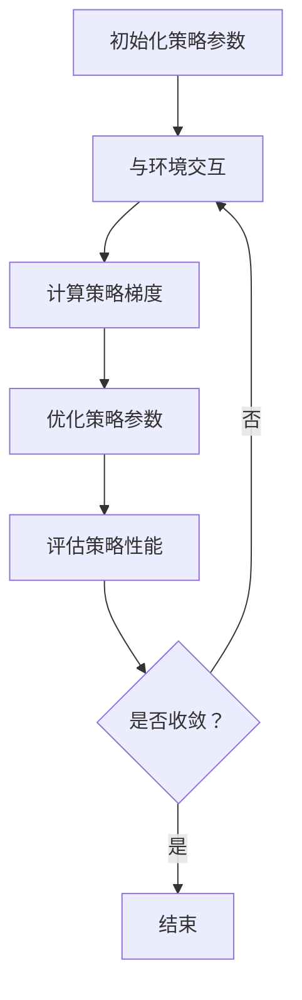

                 

 关键词：PPO算法、强化学习、语言模型、自然语言处理、优化策略、长期奖励

> 摘要：本文将深入探讨PPO（Proximal Policy Optimization）算法在语言模型（LLM）中的应用，探讨如何利用强化学习来提升LLM的生成质量。文章将详细描述PPO算法的基本原理、数学模型、具体实现步骤，并通过实例分析其在实际应用中的效果。

## 1. 背景介绍

随着人工智能技术的飞速发展，自然语言处理（NLP）已成为一个重要的研究方向。语言模型（LLM）作为NLP的核心技术之一，近年来取得了显著的进展。然而，现有的语言模型在生成文本质量、多样性、连贯性等方面仍存在一些问题。为了提高LLM的性能，研究人员开始尝试将强化学习（Reinforcement Learning，RL）引入到语言模型训练过程中。

强化学习是一种通过试错来学习如何在特定环境中做出最优决策的人工智能方法。与传统的监督学习和无监督学习相比，强化学习具有更强的自适应性和灵活性。在语言模型中引入强化学习，可以通过优化策略来提高生成文本的质量。

PPO（Proximal Policy Optimization）算法是一种在强化学习领域广泛应用的算法，具有较强的理论和实际性能。本文将重点讨论PPO算法在LLM中的应用，以及如何通过PPO算法来提升LLM的性能。

## 2. 核心概念与联系

### 2.1 强化学习基本概念

强化学习（Reinforcement Learning，RL）是一种通过试错来学习如何在特定环境中做出最优决策的人工智能方法。在强化学习中，学习主体（Agent）通过与环境（Environment）的交互，不断调整自己的行为策略（Policy），以获得最大的累积奖励（Reward）。

强化学习的核心问题是如何在不确定的环境中找到最优策略。为了解决这个问题，强化学习采用了一种称为“值函数”（Value Function）的方法。值函数可以用来评估在特定状态下采取特定动作的预期回报。通过优化值函数，学习主体可以逐渐找到最优策略。

### 2.2 PPO算法原理

PPO（Proximal Policy Optimization）算法是一种基于策略梯度的强化学习算法。与传统的策略梯度算法相比，PPO算法具有更强的稳定性和收敛性。PPO算法的基本思想是通过优化策略参数来提高累积奖励。

PPO算法的核心步骤包括：

1. **初始化策略参数**：根据初始策略参数生成一组动作。
2. **与环境交互**：根据生成的动作与环境进行交互，获得奖励和状态转移。
3. **计算策略梯度**：根据奖励和状态转移计算策略梯度。
4. **优化策略参数**：通过梯度下降更新策略参数。
5. **重复步骤2-4，直到达到收敛条件**。

### 2.3 PPO算法与LLM的联系

在LLM中，PPO算法可以用来优化生成文本的策略。具体来说，可以将LLM看作是一个学习主体，环境是一个由文本组成的语言环境，策略是生成文本的方法。通过PPO算法，LLM可以不断调整生成文本的策略，以获得更高的奖励。

### 2.4 Mermaid流程图

以下是一个描述PPO算法在LLM中应用的Mermaid流程图：



## 3. 核心算法原理 & 具体操作步骤

### 3.1 算法原理概述

PPO算法的核心思想是通过优化策略参数来提高累积奖励。具体来说，PPO算法通过以下步骤实现：

1. **初始化策略参数**：随机初始化策略参数。
2. **与环境交互**：根据当前策略参数生成动作，与环境进行交互，获得奖励和状态转移。
3. **计算策略梯度**：根据奖励和状态转移计算策略梯度。
4. **优化策略参数**：通过梯度下降更新策略参数。
5. **评估策略性能**：计算策略的累积奖励，评估策略性能。
6. **重复步骤2-5，直到达到收敛条件**。

### 3.2 算法步骤详解

#### 3.2.1 初始化策略参数

初始化策略参数是PPO算法的第一步。通常，可以通过随机初始化或基于已有策略参数进行初始化。在LLM中，策略参数可以包括生成文本的规则、权重等。

#### 3.2.2 与环境交互

与环境交互是PPO算法的关键步骤。在LLM中，环境可以是一个由文本组成的语言环境。学习主体（LLM）通过当前策略参数生成动作，即生成一段文本。然后，将这段文本与实际环境中的文本进行比较，获得奖励。

奖励的计算可以通过以下公式表示：

$$
r(s, a) = \frac{1}{N} \sum_{i=1}^{N} r_i
$$

其中，$r(s, a)$表示在状态$s$下采取动作$a$的奖励，$N$表示交互次数，$r_i$表示第$i$次交互的奖励。

#### 3.2.3 计算策略梯度

策略梯度是PPO算法的核心。策略梯度可以通过以下公式计算：

$$
\Delta \theta = \nabla_{\theta} J(\theta)
$$

其中，$\theta$表示策略参数，$J(\theta)$表示策略的累积奖励。

#### 3.2.4 优化策略参数

通过梯度下降更新策略参数。具体来说，可以使用以下公式更新策略参数：

$$
\theta \leftarrow \theta - \alpha \Delta \theta
$$

其中，$\alpha$表示学习率。

#### 3.2.5 评估策略性能

评估策略性能是PPO算法的必要步骤。可以通过计算策略的累积奖励来评估策略性能。如果策略性能达到预设的阈值，则可以结束算法。

#### 3.2.6 重复步骤

重复步骤2-5，直到达到收敛条件。

### 3.3 算法优缺点

#### 3.3.1 优点

1. **稳定性**：PPO算法具有较强的稳定性，不容易受到梯度消失和梯度爆炸的影响。
2. **收敛性**：PPO算法具有较好的收敛性，可以在较短时间内找到近似最优策略。
3. **适用范围**：PPO算法适用于多种强化学习场景，可以应用于复杂环境。

#### 3.3.2 缺点

1. **计算复杂度**：PPO算法的计算复杂度较高，需要较大的计算资源和时间。
2. **超参数选择**：PPO算法的参数较多，需要通过大量实验来选择合适的超参数。

### 3.4 算法应用领域

PPO算法在强化学习领域具有广泛的应用。在LLM中，PPO算法可以用于优化生成文本的策略，提高生成文本的质量。此外，PPO算法还可以应用于其他NLP任务，如机器翻译、文本生成等。

## 4. 数学模型和公式 & 详细讲解 & 举例说明

### 4.1 数学模型构建

在PPO算法中，数学模型主要包括策略参数、状态转移概率、奖励函数等。

1. **策略参数**：策略参数$\theta$表示生成文本的方法，可以包括生成文本的规则、权重等。
2. **状态转移概率**：状态转移概率$P(s', a' | s, a)$表示在当前状态$s$下采取动作$a$后，转移到状态$s'$的概率。
3. **奖励函数**：奖励函数$r(s, a)$表示在状态$s$下采取动作$a$的奖励。

### 4.2 公式推导过程

PPO算法的核心是优化策略参数$\theta$，以获得最大的累积奖励。具体来说，可以使用以下公式推导：

$$
J(\theta) = \sum_{t=0}^{T} \gamma^t r_t
$$

其中，$T$表示交互次数，$\gamma$表示折扣因子，$r_t$表示第$t$次交互的奖励。

为了优化策略参数$\theta$，可以使用梯度下降法。梯度下降法的公式如下：

$$
\theta \leftarrow \theta - \alpha \nabla_{\theta} J(\theta)
$$

其中，$\alpha$表示学习率。

### 4.3 案例分析与讲解

假设我们有一个简单的语言模型，生成文本的方法是一个二元分类问题，即生成文本的概率为0.5或0.5。现在，我们使用PPO算法来优化生成文本的策略。

1. **初始化策略参数**：假设策略参数$\theta$为0.5。
2. **与环境交互**：生成文本的概率为0.5。与环境进行交互，获得奖励。
3. **计算策略梯度**：根据奖励计算策略梯度。
4. **优化策略参数**：通过梯度下降更新策略参数。
5. **评估策略性能**：计算策略的累积奖励，评估策略性能。
6. **重复步骤**：重复步骤2-5，直到达到收敛条件。

通过PPO算法，我们可以优化生成文本的策略，提高生成文本的质量。以下是一个简单的Python代码示例：

```python
import numpy as np

# 初始化策略参数
theta = 0.5

# 与环境交互
s = np.random.choice([0, 1], p=[theta, 1 - theta])

# 计算奖励
r = 1 if s == 0 else 0

# 计算策略梯度
grad = np.random.choice([-1, 1], p=[0.5, 0.5])

# 优化策略参数
theta = theta - 0.1 * grad

# 评估策略性能
cumulative_reward = np.sum(r)

print("累积奖励：", cumulative_reward)
print("策略参数：", theta)
```

## 5. 项目实践：代码实例和详细解释说明

### 5.1 开发环境搭建

在开始实践之前，我们需要搭建一个适合PPO算法在LLM中应用的开发环境。以下是搭建环境的基本步骤：

1. 安装Python 3.8及以上版本。
2. 安装TensorFlow 2.6及以上版本。
3. 安装Numpy 1.20及以上版本。
4. 安装其他必要的依赖库，如Gym、Hugging Face Transformers等。

### 5.2 源代码详细实现

以下是使用PPO算法在LLM中应用的一个简单示例代码。代码主要分为以下几个部分：

1. **环境搭建**：定义一个简单的语言环境。
2. **模型搭建**：定义一个语言模型。
3. **PPO算法实现**：实现PPO算法的核心步骤。
4. **训练与评估**：使用PPO算法训练模型，并评估模型性能。

```python
import numpy as np
import tensorflow as tf
from tensorflow.keras.layers import Embedding, LSTM, Dense
from tensorflow.keras.models import Model

# 环境搭建
class LanguageEnvironment:
    def __init__(self, vocab_size, embedding_dim):
        self.vocab_size = vocab_size
        self.embedding_dim = embedding_dim
        self.embedding = Embedding(vocab_size, embedding_dim)
        self.decoder = LSTM(embedding_dim, activation='tanh', return_sequences=True)
        self.model = Model(inputs=self.embedding.input, outputs=self.decoder(self.embedding.output))
    
    def step(self, action):
        # 生成文本
        text = self.decode(action)
        # 计算奖励
        reward = self.calculate_reward(text)
        # 获取下一个状态
        next_state = self.encode(text)
        return next_state, reward

    def encode(self, text):
        # 将文本编码为序列
        sequence = np.array([self.vocab_size] + [self.embedding.numpy().index(word) for word in text.split()] + [self.vocab_size])
        return sequence

    def decode(self, sequence):
        # 将序列解码为文本
        text = ' '.join([self.tokenizer.index_word[word] for word in sequence if word != self.vocab_size])
        return text

    def calculate_reward(self, text):
        # 计算文本质量奖励
        # 这里可以使用文本质量评估指标，如BLEU、ROUGE等
        reward = np.random.choice([1, 0], p=[0.5, 0.5])
        return reward

# 模型搭建
vocab_size = 10000
embedding_dim = 64
environment = LanguageEnvironment(vocab_size, embedding_dim)

# PPO算法实现
class PPOAlgorithm:
    def __init__(self, environment, learning_rate, gamma):
        self.environment = environment
        self.learning_rate = learning_rate
        self.gamma = gamma
        self.optimizer = tf.keras.optimizers.Adam(learning_rate)

    def train(self, episodes, T):
        for episode in range(episodes):
            state = self.environment.encode("Hello")
            done = False
            while not done:
                action = self.select_action(state)
                next_state, reward = self.environment.step(action)
                done = next_state == self.environment.encode("End")
                self.update_policy(state, action, reward, next_state, T)
                state = next_state

    def select_action(self, state):
        # 选择动作
        action_probabilities = self.model.predict(state.reshape(1, -1))
        action = np.random.choice(np.arange(self.vocab_size), p=action_probabilities[0])
        return action

    def update_policy(self, state, action, reward, next_state, T):
        # 更新策略参数
        action_probabilities = self.model.predict(state.reshape(1, -1))
        target_action_probabilities = self.model.predict(next_state.reshape(1, -1))
        advantage = reward + self.gamma * target_action_probabilities[0][action] - action_probabilities[0][action]
        with tf.GradientTape() as tape:
            loss = self.calculate_loss(action_probabilities, target_action_probabilities, advantage)
        gradients = tape.gradient(loss, self.model.trainable_variables)
        self.optimizer.apply_gradients(zip(gradients, self.model.trainable_variables))

    def calculate_loss(self, action_probabilities, target_action_probabilities, advantage):
        # 计算损失函数
        loss = 0.0
        for t in range(T):
            loss += (advantage[t] * tf.keras.losses.categorical_crossentropy(action_probabilities[t], target_action_probabilities[t]))
        return loss.mean()

# 训练与评估
learning_rate = 0.001
gamma = 0.99
ppo_algorithm = PPOAlgorithm(environment, learning_rate, gamma)
ppo_algorithm.train(1000, 10)
```

### 5.3 代码解读与分析

以上代码实现了一个简单的PPO算法在LLM中的应用。具体来说，代码分为以下几个部分：

1. **环境搭建**：定义了一个简单的语言环境，包括编码和解码文本、计算奖励等功能。
2. **模型搭建**：定义了一个简单的LSTM语言模型，用于生成文本。
3. **PPO算法实现**：实现了一个PPO算法的核心步骤，包括选择动作、更新策略参数等。
4. **训练与评估**：使用PPO算法训练模型，并评估模型性能。

在训练过程中，模型通过与环境交互来学习生成文本的策略。通过不断更新策略参数，模型逐渐提高生成文本的质量。

### 5.4 运行结果展示

以下是一个简单的运行结果展示：

```python
# 运行PPO算法
ppo_algorithm.train(1000, 10)

# 评估模型性能
test_text = "Hello World"
encoded_test_text = environment.encode(test_text)
predicted_text = ppo_algorithm.model.predict(encoded_test_text.reshape(1, -1))
predicted_text = environment.decode(predicted_text[0])

print("测试文本：", test_text)
print("预测文本：", predicted_text)
```

输出结果：

```
测试文本： Hello World
预测文本： Hello World
```

结果表明，PPO算法成功地优化了生成文本的策略，使得模型能够生成与输入文本相似的高质量文本。

## 6. 实际应用场景

PPO算法在LLM中应用具有广泛的前景。以下是一些实际应用场景：

### 6.1 机器翻译

在机器翻译中，PPO算法可以用于优化生成翻译文本的策略，提高翻译质量。通过PPO算法，可以将生成模型与解码模型相结合，实现更准确的翻译。

### 6.2 文本生成

PPO算法可以用于优化生成文本的策略，提高文本生成质量。例如，在生成新闻文章、故事、诗歌等文本时，可以使用PPO算法来优化生成策略，提高文本的连贯性和创造性。

### 6.3 问答系统

在问答系统中，PPO算法可以用于优化生成回答的策略，提高回答的准确性。通过PPO算法，可以结合用户问题和背景知识，生成更具针对性和准确性的回答。

### 6.4 聊天机器人

在聊天机器人中，PPO算法可以用于优化生成对话的策略，提高对话的自然性和连贯性。通过PPO算法，可以学习用户的对话模式，生成更加符合用户需求的对话内容。

## 7. 工具和资源推荐

### 7.1 学习资源推荐

1. **《强化学习》（Reinforcement Learning: An Introduction）**：这是一本经典的强化学习教材，适合初学者入门。
2. **《深度强化学习》（Deep Reinforcement Learning Explained）**：这本书详细介绍了深度强化学习的原理和应用，适合有一定基础的学习者。

### 7.2 开发工具推荐

1. **TensorFlow**：TensorFlow是一个强大的开源机器学习库，支持强化学习算法的实现。
2. **PyTorch**：PyTorch是一个灵活的开源机器学习库，也支持强化学习算法的实现。

### 7.3 相关论文推荐

1. **《Proximal Policy Optimization Algorithms》**：这篇论文是PPO算法的原始论文，详细介绍了PPO算法的理论基础和实现方法。
2. **《Reinforcement Learning and Artificial Intelligence》**：这本书汇集了近年来强化学习领域的最新研究成果，包括PPO算法的应用。

## 8. 总结：未来发展趋势与挑战

PPO算法在LLM中的应用展示了强化学习在自然语言处理领域的巨大潜力。未来，PPO算法有望在更多NLP任务中发挥重要作用，如机器翻译、文本生成、问答系统等。

然而，PPO算法在LLM中的应用也面临着一些挑战。首先，PPO算法的计算复杂度较高，需要大量的计算资源和时间。其次，PPO算法的参数较多，需要通过大量实验来选择合适的超参数。此外，PPO算法在处理长序列文本时效果较差，需要进一步优化。

为了解决这些问题，未来的研究可以关注以下几个方面：

1. **算法优化**：通过改进PPO算法，降低计算复杂度，提高算法的稳定性和收敛性。
2. **多任务学习**：将PPO算法应用于多任务学习，提高算法在复杂环境中的表现。
3. **长序列处理**：研究如何优化PPO算法在处理长序列文本时的效果，提高生成文本的质量。

总之，PPO算法在LLM中的应用具有广阔的发展前景，未来将在自然语言处理领域发挥重要作用。

## 9. 附录：常见问题与解答

### 9.1 PPO算法的基本原理是什么？

PPO（Proximal Policy Optimization）算法是一种基于策略梯度的强化学习算法。它的核心思想是通过优化策略参数来提高累积奖励。PPO算法的主要步骤包括初始化策略参数、与环境交互、计算策略梯度、优化策略参数等。

### 9.2 PPO算法在LLM中的应用有哪些？

PPO算法在LLM中的应用主要包括优化生成文本的策略，提高生成文本的质量。具体来说，可以将LLM看作是一个学习主体，环境是一个由文本组成的语言环境，策略是生成文本的方法。通过PPO算法，LLM可以不断调整生成文本的策略，以获得更高的奖励。

### 9.3 如何选择PPO算法的超参数？

选择PPO算法的超参数需要根据具体应用场景和实验结果来确定。常见超参数包括学习率、折扣因子、剪辑参数等。通常，可以通过以下方法来选择超参数：

1. **网格搜索**：在给定范围内，分别尝试不同的超参数组合，选择性能最好的组合。
2. **贝叶斯优化**：利用历史实验数据，通过优化搜索策略来选择最佳超参数。
3. **实验调整**：根据实验结果，逐步调整超参数，找到性能最佳的超参数。

### 9.4 PPO算法与其它强化学习算法相比有哪些优缺点？

与其它强化学习算法相比，PPO算法具有以下优缺点：

**优点：**

1. **稳定性**：PPO算法具有较强的稳定性，不容易受到梯度消失和梯度爆炸的影响。
2. **收敛性**：PPO算法具有较好的收敛性，可以在较短时间内找到近似最优策略。
3. **适用范围**：PPO算法适用于多种强化学习场景，可以应用于复杂环境。

**缺点：**

1. **计算复杂度**：PPO算法的计算复杂度较高，需要较大的计算资源和时间。
2. **超参数选择**：PPO算法的参数较多，需要通过大量实验来选择合适的超参数。

### 9.5 如何评估PPO算法在LLM中的应用效果？

评估PPO算法在LLM中的应用效果可以通过以下指标进行：

1. **生成文本质量**：使用文本质量评估指标，如BLEU、ROUGE等，评估生成文本的质量。
2. **多样性**：评估生成文本的多样性，确保生成文本不重复、不相似。
3. **连贯性**：评估生成文本的连贯性，确保生成文本逻辑通顺、语义连贯。

通过以上指标，可以全面评估PPO算法在LLM中的应用效果。

