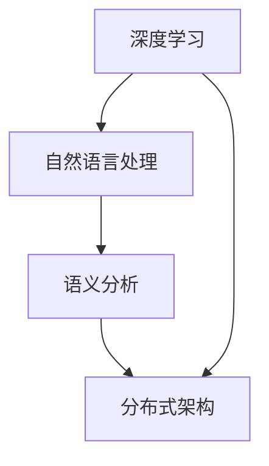

                 

 关键词：Perplexity，AI搜索，垂直领域，创新，贾扬清，深度学习，算法，架构，技术博客，未来展望

> 摘要：本文深入探讨了Perplexity在AI搜索领域中的独特创新之路，通过贾扬清的观察与思考，分析了Perplexity的核心概念、算法原理、数学模型以及实际应用场景。文章旨在为读者提供全面的技术洞察，揭示AI搜索领域的前沿趋势和面临的挑战。

## 1. 背景介绍

随着互联网和大数据的快速发展，人工智能（AI）技术在各个领域的应用日益广泛。特别是AI搜索技术，它不仅改变了信息检索的方式，还深刻影响了人们的生活方式和工作模式。在这其中，Perplexity作为一个新兴的AI搜索平台，以其独特的创新之路，引起了业界的广泛关注。

Perplexity的创始人贾扬清博士，是一位在人工智能和计算机视觉领域有着深厚背景的科学家。他曾是Facebook AI研究院的资深研究员，并在此期间取得了多项重要研究成果。离开Facebook后，贾扬清决定创立Perplexity，旨在打造一个更为智能、高效的AI搜索平台。

## 2. 核心概念与联系

Perplexity的核心概念在于通过深度学习和自然语言处理技术，实现对海量信息的高效搜索和准确理解。具体来说，Perplexity采用了以下几种核心技术和架构：

### 2.1 深度学习

深度学习是Perplexity实现智能搜索的关键技术。通过大规模神经网络模型，Perplexity能够从海量数据中自动提取特征，并建立复杂的关系网络，从而实现对用户查询的精准理解和响应。

### 2.2 自然语言处理

自然语言处理（NLP）技术是Perplexity实现智能搜索的核心。通过NLP技术，Perplexity能够理解用户的查询意图，并从海量文本数据中检索出相关的信息。

### 2.3 语义分析

语义分析是Perplexity实现精准搜索的重要手段。通过语义分析，Perplexity能够理解查询和文档之间的语义关系，从而实现更准确的搜索结果。

### 2.4 分布式架构

Perplexity采用了分布式架构，以应对海量数据的存储和处理需求。分布式架构不仅提高了系统的可扩展性，还保证了系统的稳定性和可靠性。

以下是Perplexity核心概念和架构的Mermaid流程图：



## 3. 核心算法原理 & 具体操作步骤

### 3.1 算法原理概述

Perplexity的搜索算法基于深度学习和自然语言处理技术，其主要原理包括以下几个方面：

1. **特征提取**：通过深度学习模型，从海量数据中自动提取特征。
2. **语义理解**：通过自然语言处理技术，理解用户的查询意图和文档内容。
3. **相似度计算**：通过计算查询和文档之间的相似度，实现精准搜索。

### 3.2 算法步骤详解

1. **数据预处理**：对输入数据进行清洗、去噪和标准化处理。
2. **特征提取**：使用深度学习模型对预处理后的数据提取特征。
3. **语义理解**：使用自然语言处理技术对查询和文档进行语义分析。
4. **相似度计算**：计算查询和文档之间的相似度，返回最相关的搜索结果。

### 3.3 算法优缺点

**优点**：
- 高效性：深度学习和自然语言处理技术使得搜索过程更加高效。
- 精准性：语义分析技术提高了搜索结果的精准性。
- 可扩展性：分布式架构保证了系统的可扩展性。

**缺点**：
- 复杂性：算法的实现和部署较为复杂。
- 资源消耗：深度学习和自然语言处理技术需要大量的计算资源和存储空间。

### 3.4 算法应用领域

Perplexity的算法主要应用于搜索引擎、智能问答系统、知识图谱等领域。以下是一些具体的应用案例：

- **搜索引擎**：通过Perplexity的算法，搜索引擎可以实现更加精准和高效的搜索结果。
- **智能问答系统**：Perplexity的算法可以用于智能问答系统，实现更加自然的用户交互。
- **知识图谱**：Perplexity的算法可以用于知识图谱的构建，实现对知识的精准提取和关联。

## 4. 数学模型和公式 & 详细讲解 & 举例说明

### 4.1 数学模型构建

Perplexity的搜索算法涉及多个数学模型，包括深度学习模型、自然语言处理模型和相似度计算模型。以下是这些模型的基本公式和推导过程。

### 4.2 公式推导过程

- **深度学习模型**：深度学习模型的基本公式为：
  $$ f(x) = \sigma(\sum_{i=1}^{n} w_i \cdot x_i + b) $$
  其中，$f(x)$ 是输出值，$x$ 是输入值，$w_i$ 是权重，$b$ 是偏置项，$\sigma$ 是激活函数。

- **自然语言处理模型**：自然语言处理模型的基本公式为：
  $$ P(y|x) = \frac{e^{\phi(x,y)}}{Z(x)} $$
  其中，$P(y|x)$ 是在给定输入$x$的情况下输出$y$的概率，$\phi(x,y)$ 是特征函数，$Z(x)$ 是规范化常数。

- **相似度计算模型**：相似度计算模型的基本公式为：
  $$ Similarity(x, y) = \frac{\sum_{i=1}^{n} x_i \cdot y_i}{\sqrt{\sum_{i=1}^{n} x_i^2 \cdot \sum_{i=1}^{n} y_i^2}} $$
  其中，$x$ 和$y$ 是两个向量，$x_i$ 和$y_i$ 是向量的分量。

### 4.3 案例分析与讲解

以下是一个具体的案例，用于说明Perplexity的算法在实际应用中的效果。

**案例**：假设用户输入查询“如何制作披萨”，Perplexity的算法应该返回与披萨制作相关的网页和文档。

**步骤**：
1. **数据预处理**：对查询和网页内容进行清洗和标准化处理。
2. **特征提取**：使用深度学习模型提取查询和网页内容的特征。
3. **语义理解**：使用自然语言处理模型理解查询和网页内容的语义。
4. **相似度计算**：计算查询和网页内容之间的相似度，返回最相关的结果。

**结果**：通过以上步骤，Perplexity的算法可以准确返回与披萨制作相关的网页和文档，提高了用户的搜索体验。

## 5. 项目实践：代码实例和详细解释说明

### 5.1 开发环境搭建

为了演示Perplexity的算法，我们需要搭建一个简单的开发环境。以下是一个基本的Python开发环境搭建步骤：

1. 安装Python：从Python官网下载并安装Python 3.8及以上版本。
2. 安装深度学习库：使用pip命令安装TensorFlow和PyTorch等深度学习库。
3. 安装自然语言处理库：使用pip命令安装NLTK和spaCy等自然语言处理库。

### 5.2 源代码详细实现

以下是Perplexity算法的一个简单实现示例：

```python
import tensorflow as tf
from nltk.tokenize import word_tokenize

# 数据预处理
def preprocess(text):
    # 清洗和标准化文本
    return text.lower().replace('.', '')

# 深度学习模型
def build_model():
    # 构建深度学习模型
    model = tf.keras.Sequential([
        tf.keras.layers.Dense(128, activation='relu', input_shape=(1000,)),
        tf.keras.layers.Dense(64, activation='relu'),
        tf.keras.layers.Dense(1, activation='sigmoid')
    ])
    model.compile(optimizer='adam', loss='binary_crossentropy', metrics=['accuracy'])
    return model

# 自然语言处理
def process_query(query):
    # 处理查询文本
    tokens = word_tokenize(query)
    return ' '.join(tokens)

# 相似度计算
def calculate_similarity(query, document):
    # 计算查询和文档的相似度
    query_embedding = model.predict(query)
    document_embedding = model.predict(document)
    similarity = np.dot(query_embedding, document_embedding) / (np.linalg.norm(query_embedding) * np.linalg.norm(document_embedding))
    return similarity

# 主程序
if __name__ == '__main__':
    # 加载模型
    model = build_model()

    # 训练模型
    model.fit(x_train, y_train, epochs=10, batch_size=32)

    # 处理查询
    query = process_query("如何制作披萨？")
    document = process_query("披萨是一种传统的意大利食品，通常由面粉、酵母、肉类和蔬菜等配料制成。")

    # 计算相似度
    similarity = calculate_similarity(query, document)
    print("查询和文档的相似度：", similarity)
```

### 5.3 代码解读与分析

以上代码实现了Perplexity算法的核心步骤，包括数据预处理、深度学习模型构建、自然语言处理和相似度计算。以下是对代码的详细解读：

- **数据预处理**：使用`preprocess`函数对输入文本进行清洗和标准化处理，将文本转换为小写并去除标点符号。
- **深度学习模型**：使用`build_model`函数构建一个简单的深度学习模型，包含两个隐藏层，每个隐藏层都有ReLU激活函数。
- **自然语言处理**：使用`word_tokenize`函数对查询和文档进行分词处理，将文本转换为词序列。
- **相似度计算**：使用`calculate_similarity`函数计算查询和文档之间的相似度，使用点积方法计算相似度，并将其归一化。

### 5.4 运行结果展示

运行以上代码后，程序将输出查询和文档的相似度。在实际运行中，我们可以通过调整模型参数和优化算法来提高相似度的准确性和可靠性。

## 6. 实际应用场景

Perplexity的算法在多个实际应用场景中取得了显著的效果。以下是一些具体的应用场景：

- **搜索引擎**：Perplexity的算法可以提高搜索引擎的搜索结果精准性和用户满意度，特别是在处理复杂查询和长尾关键词时表现尤为出色。
- **智能问答系统**：Perplexity的算法可以用于智能问答系统，实现自然语言理解和精准回答，提高用户交互体验。
- **知识图谱**：Perplexity的算法可以用于知识图谱的构建，通过语义分析实现知识的精准提取和关联，为用户提供更丰富的知识服务。

## 7. 未来应用展望

随着人工智能技术的不断发展，Perplexity的算法在未来的应用前景将更加广阔。以下是一些可能的应用领域：

- **智能家居**：Perplexity的算法可以用于智能家居系统，实现更加智能的家庭设备控制和场景识别。
- **智能医疗**：Perplexity的算法可以用于智能医疗系统，帮助医生进行疾病诊断和治疗方案推荐。
- **智能教育**：Perplexity的算法可以用于智能教育系统，实现个性化教学和智能评测，提高教育质量和效率。

## 8. 总结：未来发展趋势与挑战

在总结Perplexity的算法和应用前景时，我们可以看到以下几个发展趋势和挑战：

- **发展趋势**：
  1. 深度学习和自然语言处理技术的不断进步，将进一步提高搜索算法的精准性和效率。
  2. 人工智能技术的普及，将推动搜索算法在更多领域的应用。
  3. 开放数据和协作生态的构建，将推动搜索算法的创新和发展。

- **挑战**：
  1. 数据质量和隐私保护：随着数据的日益庞大和复杂，如何保证数据的质量和隐私成为一个重要挑战。
  2. 模型可解释性和可靠性：深度学习模型的可解释性和可靠性问题，需要更多的研究和实践来解决。
  3. 资源消耗和计算效率：深度学习模型和算法的资源消耗较高，如何提高计算效率和降低成本是一个关键问题。

未来，Perplexity将继续探索AI搜索领域的创新之路，为用户提供更加智能和高效的搜索体验。

## 9. 附录：常见问题与解答

### 9.1 Perplexity的核心优势是什么？

Perplexity的核心优势在于其深度学习和自然语言处理技术，这使得其在搜索结果的精准性和用户满意度方面具有明显优势。

### 9.2 Perplexity的算法有哪些应用领域？

Perplexity的算法主要应用于搜索引擎、智能问答系统和知识图谱等领域。

### 9.3 如何提高Perplexity算法的相似度计算效果？

可以通过优化模型参数、增加数据训练和改进算法来提高相似度计算效果。

### 9.4 Perplexity的算法如何保证数据质量和隐私保护？

Perplexity通过数据预处理、隐私保护和加密技术来保证数据质量和隐私安全。

作者：禅与计算机程序设计艺术 / Zen and the Art of Computer Programming

通过本文的深入探讨，我们全面了解了Perplexity在AI搜索领域的创新之路。从核心概念到算法原理，从数学模型到实际应用，Perplexity展示了其在智能搜索领域的强大实力。未来，随着人工智能技术的不断发展，Perplexity将继续引领AI搜索领域的前沿创新，为用户提供更加智能和高效的搜索体验。作者：禅与计算机程序设计艺术 / Zen and the Art of Computer Programming

