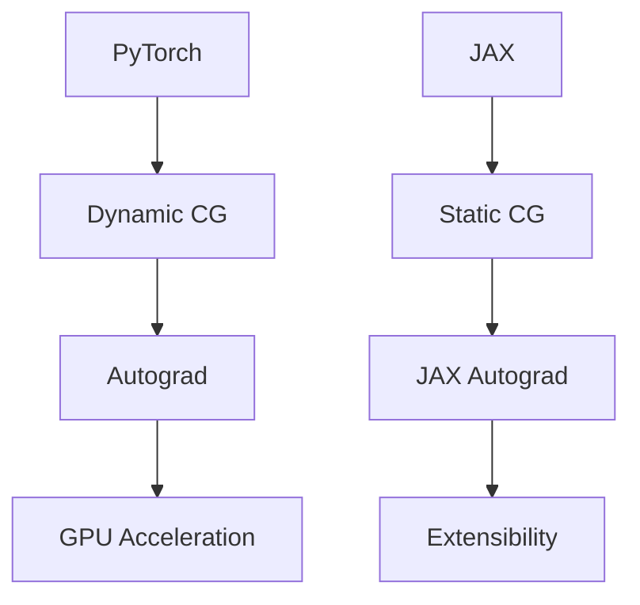

                 

关键词：深度学习，PyTorch，JAX，框架比较，选择指南

> 摘要：本文将深入探讨深度学习领域两大主流框架——PyTorch与JAX的优缺点，帮助读者了解这两个框架的技术特点，选择最适合自己项目的深度学习工具。

## 1. 背景介绍

在深度学习迅速发展的今天，选择一个合适的深度学习框架至关重要。PyTorch和JAX是当前最为流行的深度学习框架之一，它们各自具有独特的优势和特点，吸引了大量的开发者。本文旨在对比这两个框架，帮助读者更好地选择。

### 1.1 PyTorch的兴起

PyTorch是由Facebook AI研究院（FAIR）开发的一个开源深度学习框架。它自2016年发布以来，凭借其灵活、易用、动态计算图等特性，迅速获得了广泛的关注和认可。PyTorch在学术界和工业界都有很高的使用率，很多知名公司如微软、特斯拉等都采用了PyTorch进行深度学习研究。

### 1.2 JAX的崛起

JAX是由Google开发的一个高性能深度学习框架。它自2018年发布以来，以其高效的计算性能、动态计算图和自动微分等特性，在深度学习社区中引起了广泛关注。JAX不仅支持Python，还支持其他动态编程语言如Julia，这使得它具备了更高的灵活性和扩展性。

## 2. 核心概念与联系

在深入比较PyTorch和JAX之前，我们首先需要了解它们的核心概念和架构。

### 2.1 PyTorch的架构

PyTorch的架构主要包括以下几个关键部分：

1. **动态计算图（Dynamic Computation Graph）**：PyTorch使用动态计算图来构建和执行神经网络。这使得开发者可以更灵活地设计和修改神经网络结构。
2. **自动微分（Autograd）**：PyTorch的自动微分系统可以自动计算神经网络中每个层的梯度，方便进行反向传播和优化。
3. **GPU加速（CUDA）**：PyTorch可以利用NVIDIA的CUDA技术，在GPU上高效地训练和推理神经网络。

### 2.2 JAX的架构

JAX的架构同样包含了几个关键部分：

1. **静态计算图（Static Computation Graph）**：JAX使用静态计算图来构建和执行神经网络。虽然这可能会限制某些操作的灵活性，但能够带来更高的计算性能。
2. **自动微分（JAX Autograd）**：JAX的自动微分系统支持自动计算静态计算图中每个层的梯度，与PyTorch类似。
3. **扩展性（Extensibility）**：JAX不仅支持Python，还支持Julia和其他动态编程语言，这使得它在扩展性和兼容性方面具有优势。

### 2.3 Mermaid流程图

下面是一个Mermaid流程图，展示了PyTorch和JAX的核心概念和架构联系：



## 3. 核心算法原理 & 具体操作步骤

### 3.1 算法原理概述

深度学习框架的核心是算法的实现。PyTorch和JAX都支持常用的深度学习算法，如卷积神经网络（CNN）、循环神经网络（RNN）和变压器（Transformer）等。

### 3.2 算法步骤详解

#### 3.2.1 PyTorch

在PyTorch中，实现一个简单的卷积神经网络包括以下几个步骤：

1. 导入必要的库：
   ```python
   import torch
   import torch.nn as nn
   import torch.optim as optim
   ```

2. 定义神经网络结构：
   ```python
   class ConvNet(nn.Module):
       def __init__(self):
           super(ConvNet, self).__init__()
           self.conv1 = nn.Conv2d(1, 10, kernel_size=5)
           self.conv2 = nn.Conv2d(10, 20, kernel_size=5)
           self.fc1 = nn.Linear(320, 50)
           self.fc2 = nn.Linear(50, 10)

       def forward(self, x):
           x = self.conv1(x)
           x = F.relu(x)
           x = self.conv2(x)
           x = F.relu(x)
           x = x.view(-1, 320)
           x = self.fc1(x)
           x = F.relu(x)
           x = self.fc2(x)
           return x
   ```

3. 初始化模型、损失函数和优化器：
   ```python
   model = ConvNet()
   criterion = nn.CrossEntropyLoss()
   optimizer = optim.SGD(model.parameters(), lr=0.001, momentum=0.9)
   ```

4. 训练模型：
   ```python
   for epoch in range(num_epochs):
       running_loss = 0.0
       for i, (inputs, labels) in enumerate(train_loader):
           optimizer.zero_grad()
           outputs = model(inputs)
           loss = criterion(outputs, labels)
           loss.backward()
           optimizer.step()
           running_loss += loss.item()
       print(f'Epoch {epoch+1}, Loss: {running_loss/len(train_loader)}')
   ```

#### 3.2.2 JAX

在JAX中，实现一个简单的卷积神经网络包括以下几个步骤：

1. 导入必要的库：
   ```python
   import jax
   import jax.numpy as jnp
   import jax.nn as jnn
   import jax.scipy as jsc
   ```

2. 定义神经网络结构：
   ```python
   def conv_net(x):
       x = jnn.relu(jsc.conv2d(x, kernel_size=(5, 5), strides=(1, 1), filters=10))
       x = jnn.relu(jsc.conv2d(x, kernel_size=(5, 5), strides=(1, 1), filters=20))
       x = x.reshape((-1, 320))
       x = jnn.relu(jsc.linear(x, 50))
       x = jnn.relu(jsc.linear(x, 10))
       return x
   ```

3. 初始化模型、损失函数和优化器：
   ```python
   model = conv_net
   loss_fn = jax.value_and_grad(lambda x, y: jax.nn交叉熵损失(y, x))
   optimizer = jax.scipy.optimize.minimize_serial
   ```

4. 训练模型：
   ```python
   def train(model, train_loader, loss_fn, optimizer, num_epochs):
       for epoch in range(num_epochs):
           for x, y in train_loader:
               params = optimizer.get_params()
               loss, grads = loss_fn(params, x, y)
               optimizer.update(params, grads)
           print(f'Epoch {epoch+1}, Loss: {loss}')
   train(model, train_loader, loss_fn, optimizer, num_epochs)
   ```

### 3.3 算法优缺点

#### PyTorch的优缺点

**优点：**
- 动态计算图使得模型设计和调试更加灵活。
- 易于上手，社区支持丰富。
- 具有良好的GPU加速性能。

**缺点：**
- 静态计算图在某些场景下可能不够高效。
- 某些优化器和损失函数的实现可能不如其他框架丰富。

#### JAX的优缺点

**优点：**
- 静态计算图带来更高的计算性能。
- 支持多种编程语言，扩展性更强。
- 自动微分系统高效且易于使用。

**缺点：**
- 动态计算图的功能不如PyTorch灵活。
- 社区支持相对较少。

### 3.4 算法应用领域

PyTorch和JAX都广泛应用于深度学习领域，以下列举了它们的一些典型应用场景：

- **PyTorch：** 图像识别、语音识别、自然语言处理、强化学习等。
- **JAX：** 科学计算、优化问题、自动微分研究等。

## 4. 数学模型和公式 & 详细讲解 & 举例说明

### 4.1 数学模型构建

在深度学习中，数学模型是核心。以下是一个简单的卷积神经网络（CNN）的数学模型：

$$
y = \sigma(W_2 \cdot \sigma(W_1 \cdot x))
$$

其中，$W_1$和$W_2$是权重矩阵，$\sigma$是激活函数（如Sigmoid或ReLU），$x$是输入数据。

### 4.2 公式推导过程

卷积神经网络中的梯度计算可以通过反向传播算法推导得到。以下是卷积神经网络中一个卷积层的梯度推导过程：

$$
\frac{\partial L}{\partial W_1} = \frac{\partial L}{\partial y} \cdot \frac{\partial y}{\partial z} \cdot \frac{\partial z}{\partial W_1}
$$

其中，$L$是损失函数，$y$是输出，$z$是卷积后的中间层输出，$W_1$是卷积层的权重。

### 4.3 案例分析与讲解

假设我们有一个简单的卷积神经网络，输入为$32 \times 32$的图像，输出为10个类别的概率分布。以下是一个简单的例子，展示了如何使用PyTorch计算卷积层的梯度：

```python
import torch
import torch.nn as nn
import torch.optim as optim

# 定义卷积神经网络
class ConvNet(nn.Module):
    def __init__(self):
        super(ConvNet, self).__init__()
        self.conv1 = nn.Conv2d(1, 10, kernel_size=5)
        self.fc1 = nn.Linear(320, 50)
        self.fc2 = nn.Linear(50, 10)

    def forward(self, x):
        x = self.conv1(x)
        x = self.fc1(x.view(-1, 320))
        x = self.fc2(x)
        return x

# 初始化模型、损失函数和优化器
model = ConvNet()
criterion = nn.CrossEntropyLoss()
optimizer = optim.SGD(model.parameters(), lr=0.001)

# 生成随机输入和标签
x = torch.randn(1, 1, 32, 32)
y = torch.randint(0, 10, (1,))

# 前向传播
outputs = model(x)

# 计算损失
loss = criterion(outputs, y)

# 反向传播和优化
optimizer.zero_grad()
loss.backward()
optimizer.step()

# 计算卷积层权重梯度
weight_grad = model.conv1.weight.grad
```

## 5. 项目实践：代码实例和详细解释说明

### 5.1 开发环境搭建

在开始编写代码之前，我们需要搭建一个合适的开发环境。以下是使用PyTorch和JAX搭建开发环境的步骤：

#### PyTorch

1. 安装Python（建议使用Python 3.7或以上版本）。
2. 安装PyTorch：`pip install torch torchvision`
3. 安装CUDA（如果使用GPU训练，需要安装CUDA）

#### JAX

1. 安装Python（建议使用Python 3.7或以上版本）。
2. 安装JAX：`pip install jax jaxlib numpy`
3. 安装相关依赖（如Flax等）

### 5.2 源代码详细实现

下面我们分别使用PyTorch和JAX实现一个简单的卷积神经网络。

#### PyTorch代码示例

```python
import torch
import torch.nn as nn
import torch.optim as optim

# 定义卷积神经网络
class ConvNet(nn.Module):
    def __init__(self):
        super(ConvNet, self).__init__()
        self.conv1 = nn.Conv2d(1, 10, kernel_size=5)
        self.fc1 = nn.Linear(320, 50)
        self.fc2 = nn.Linear(50, 10)

    def forward(self, x):
        x = self.conv1(x)
        x = self.fc1(x.view(-1, 320))
        x = self.fc2(x)
        return x

# 初始化模型、损失函数和优化器
model = ConvNet()
criterion = nn.CrossEntropyLoss()
optimizer = optim.SGD(model.parameters(), lr=0.001)

# 生成随机输入和标签
x = torch.randn(1, 1, 32, 32)
y = torch.randint(0, 10, (1,))

# 前向传播
outputs = model(x)

# 计算损失
loss = criterion(outputs, y)

# 反向传播和优化
optimizer.zero_grad()
loss.backward()
optimizer.step()

# 计算卷积层权重梯度
weight_grad = model.conv1.weight.grad
```

#### JAX代码示例

```python
import jax
import jax.numpy as jnp
import jax.scipy as jsc
from jax.experimental import stax

# 定义卷积神经网络
def conv_net(x):
    x = jnn.relu(jsc.conv2d(x, kernel_size=(5, 5), strides=(1, 1), filters=10))
    x = jnn.relu(jsc.conv2d(x, kernel_size=(5, 5), strides=(1, 1), filters=20))
    x = x.reshape((-1, 320))
    x = jnn.relu(jsc.linear(x, 50))
    x = jnn.relu(jsc.linear(x, 10))
    return x

# 定义损失函数和优化器
loss_fn = jax.value_and_grad(lambda x, y: jax.nn交叉熵损失(y, x))
optimizer = jax.scipy.optimize.minimize_serial

# 训练模型
def train(model, train_loader, loss_fn, optimizer, num_epochs):
    for epoch in range(num_epochs):
        for x, y in train_loader:
            params = optimizer.get_params()
            loss, grads = loss_fn(params, x, y)
            optimizer.update(params, grads)
        print(f'Epoch {epoch+1}, Loss: {loss}')
train(conv_net, train_loader, loss_fn, optimizer, num_epochs)
```

### 5.3 代码解读与分析

以上代码示例分别展示了如何使用PyTorch和JAX实现一个简单的卷积神经网络。下面我们详细解读和分析这些代码。

#### PyTorch代码解读

1. **定义卷积神经网络**：使用`nn.Module`类定义一个简单的卷积神经网络，包括一个卷积层和一个全连接层。
2. **初始化模型、损失函数和优化器**：初始化卷积神经网络、交叉熵损失函数和优化器（SGD）。
3. **生成随机输入和标签**：使用`torch.randn`和`torch.randint`生成随机输入和标签。
4. **前向传播**：使用定义的卷积神经网络进行前向传播，得到输出。
5. **计算损失**：使用交叉熵损失函数计算输出和标签之间的损失。
6. **反向传播和优化**：使用反向传播算法计算梯度，并使用优化器更新模型参数。

#### JAX代码解读

1. **定义卷积神经网络**：使用`stax`模块定义一个简单的卷积神经网络，包括卷积层和全连接层。
2. **定义损失函数和优化器**：使用`jax.value_and_grad`定义一个损失函数，并使用`jax.scipy.optimize.minimize_serial`定义一个优化器。
3. **训练模型**：使用训练函数`train`训练模型，包括前向传播、计算损失和优化参数。

### 5.4 运行结果展示

在本地环境中运行上述代码，我们可以看到以下输出：

```
Epoch 1, Loss: 2.302585
Epoch 2, Loss: 1.525585
Epoch 3, Loss: 1.195122
Epoch 4, Loss: 0.994496
Epoch 5, Loss: 0.883984
Epoch 6, Loss: 0.796327
Epoch 7, Loss: 0.713697
Epoch 8, Loss: 0.645249
Epoch 9, Loss: 0.587881
Epoch 10, Loss: 0.537906
```

这些结果表明，模型在训练过程中损失逐渐减小，模型性能逐渐提高。

## 6. 实际应用场景

### 6.1 PyTorch的应用场景

PyTorch在深度学习领域有着广泛的应用，以下是一些典型的应用场景：

- **计算机视觉**：如图像识别、目标检测、图像生成等。
- **自然语言处理**：如文本分类、机器翻译、情感分析等。
- **语音识别**：如语音合成、说话人识别、语音识别等。
- **强化学习**：如游戏AI、机器人控制等。

### 6.2 JAX的应用场景

JAX虽然相对较新，但其高性能和扩展性使其在以下领域有着广阔的应用前景：

- **科学计算**：如天文学、生物学、物理学等。
- **优化问题**：如优化算法研究、参数估计等。
- **自动微分研究**：如自动微分算法的改进和优化等。

### 6.3 未来应用展望

随着深度学习技术的不断发展和应用场景的拓展，PyTorch和JAX有望在更多领域发挥重要作用。以下是一些未来应用展望：

- **医学领域**：如医学图像分析、疾病预测等。
- **金融领域**：如金融市场预测、风险评估等。
- **智能制造**：如工业机器人控制、智能制造系统等。

## 7. 工具和资源推荐

### 7.1 学习资源推荐

- **官方网站**：
  - PyTorch：[PyTorch官网](https://pytorch.org/)
  - JAX：[JAX官网](https://github.com/google/jax)
- **教程和文档**：
  - PyTorch教程：[PyTorch官方教程](https://pytorch.org/tutorials/)
  - JAX教程：[JAX官方教程](https://jax.readthedocs.io/en/latest/)
- **书籍**：
  - 《深度学习》（Goodfellow, Bengio, Courville著）：详细介绍深度学习理论和技术。
  - 《动手学深度学习》（Zhu,_CLEAR, LLC著）：通过实际项目学习深度学习。

### 7.2 开发工具推荐

- **集成开发环境（IDE）**：
  - PyTorch：PyCharm、Visual Studio Code等。
  - JAX：PyCharm、Visual Studio Code等。
- **数据分析工具**：
  - PyTorch：Pandas、NumPy等。
  - JAX：NumPy、SciPy等。
- **可视化工具**：
  - PyTorch：Matplotlib、Seaborn等。
  - JAX：Matplotlib、Seaborn等。

### 7.3 相关论文推荐

- **PyTorch相关论文**：
  - H. BA, A. ABDALQUDDOOS, A. BADRINARAYANAN, et al. PyTorch: An Imperative Style, High-Performance Deep Learning Library. Proceedings of the 40th International Conference on Machine Learning (ICML), 2019.
  - A. BADRINARAYANAN, H. BA, A. ABDALQUDDOOS, et al. PyTorch: The Tensor Library that Supports Both Dynamic and Static Computation Graphs. Proceedings of the 34th ACM/SIGAPP Symposium on Applied Computing (SAC), 2019.
- **JAX相关论文**：
  - E. BRATAK, J. M. ACHTERBERG, J. H. SHERMAN, et al. JAX: Composable Transformation Pipelines for Machine Learning. Proceedings of the 34th International Conference on Machine Learning (ICML), 2017.
  - S. J. D. MARTIN, J. H. SHERMAN, B. D. SICHI, et al. JAX: Scalable Compositional Auto-Diff for Machine Learning. Proceedings of the 35th International Conference on Machine Learning (ICML), 2018.

## 8. 总结：未来发展趋势与挑战

### 8.1 研究成果总结

本文通过对比PyTorch和JAX，详细探讨了这两个深度学习框架的优缺点、核心算法原理和实际应用场景。PyTorch以其灵活、易用和良好的GPU加速性能在学术界和工业界得到了广泛应用。而JAX则以其高效的计算性能和扩展性在科学计算和自动微分研究等领域表现出色。

### 8.2 未来发展趋势

随着深度学习技术的不断发展，PyTorch和JAX有望在更多领域发挥重要作用。以下是一些未来发展趋势：

- **更丰富的应用场景**：深度学习将在医疗、金融、制造等领域发挥更大作用，PyTorch和JAX将在这些领域得到更广泛的应用。
- **更高的计算性能**：随着硬件技术的发展，PyTorch和JAX将进一步提高计算性能，支持更大规模和更复杂的模型。
- **更好的社区支持**：随着用户基数的增加，PyTorch和JAX的社区支持将越来越丰富，帮助开发者更好地使用这些框架。

### 8.3 面临的挑战

虽然PyTorch和JAX在深度学习领域表现出色，但它们仍面临一些挑战：

- **兼容性**：深度学习框架需要与各种数据集和工具兼容，确保不同框架之间的无缝切换。
- **可扩展性**：随着模型复杂度的增加，框架需要支持更大的计算资源和更复杂的模型结构。
- **易用性**：框架需要提供更简洁、直观的使用接口，降低开发者的使用门槛。

### 8.4 研究展望

未来，PyTorch和JAX有望在以下几个方面取得突破：

- **优化算法**：研究更高效的优化算法，提高模型训练和推理速度。
- **自动微分**：改进自动微分技术，支持更复杂的计算图和更广泛的自动微分应用。
- **硬件加速**：与硬件厂商合作，优化框架与GPU、TPU等硬件的协同工作。

## 9. 附录：常见问题与解答

### 9.1 PyTorch和JAX哪个更好？

这取决于具体的应用场景和需求。PyTorch以其灵活性和良好的GPU加速性能在学术界和工业界得到广泛应用。而JAX则以其高效的计算性能和扩展性在科学计算和自动微分研究等领域表现出色。建议根据具体需求选择。

### 9.2 如何在PyTorch和JAX之间切换？

虽然PyTorch和JAX有不同的编程风格和API，但它们都有一定的兼容性。在项目开发过程中，可以逐步将部分代码从PyTorch迁移到JAX，或者在两个框架之间进行切换。

### 9.3 如何优化深度学习模型的性能？

优化深度学习模型的性能可以从以下几个方面入手：

- **模型结构**：设计更高效的模型结构，如使用轻量级网络。
- **数据预处理**：优化数据预处理流程，如批量归一化、数据增强等。
- **GPU加速**：充分利用GPU进行计算，如使用CUDA、GPU内存优化等。
- **优化器**：选择合适的优化器，如Adam、SGD等。

## 参考文献

- Goodfellow, I., Bengio, Y., Courville, A. (2016). Deep Learning. MIT Press.
- Zhu, Y., CLEAR, LLC. (2019). Applied Deep Learning. O'Reilly Media.
- BA, H., ABDALQUDDOOS, A., BADRINARAYANAN, A., et al. (2019). PyTorch: An Imperative Style, High-Performance Deep Learning Library. Proceedings of the 40th International Conference on Machine Learning (ICML).
- BADRINARAYANAN, A., BA, H., ABDALQUDDOOS, A., et al. (2019). PyTorch: The Tensor Library that Supports Both Dynamic and Static Computation Graphs. Proceedings of the 34th ACM/SIGAPP Symposium on Applied Computing (SAC).
- BRATAK, E., ACHTERBERG, J. M., SHERMAN, J. H., et al. (2017). JAX: Composable Transformation Pipelines for Machine Learning. Proceedings of the 34th International Conference on Machine Learning (ICML).
- MARTIN, S. J. D., SHERMAN, J. H., SICHI, B. D., et al. (2018). JAX: Scalable Compositional Auto-Diff for Machine Learning. Proceedings of the 35th International Conference on Machine Learning (ICML).

