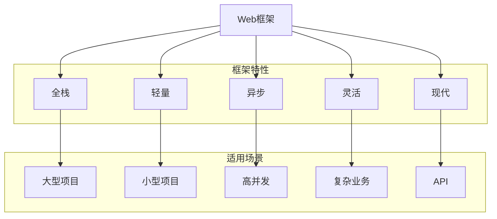

                 

 关键词：Python Web框架，Django，Flask，Web开发，框架选择，微框架，全栈框架，异步框架

> 摘要：本文将探讨Python Web开发中除了Django和Flask之外的其他选择，包括Tornado、Pyramid、FastAPI等，分析它们的优点、使用场景和适用性，帮助开发者更好地选择适合自己的Web框架。

## 1. 背景介绍

在Python Web开发领域，Django和Flask无疑是两颗璀璨的明星。Django作为一个全能型的全栈框架，以其“电池包含一切”（电池式编程）的理念和强大的ORM（对象关系映射）功能，成为了许多初学者和大型项目的首选。Flask则以其轻量级、灵活性和可扩展性著称，因其简单易用的特性，成为了许多小型项目和快速开发的利器。

然而，在特定的场景和需求下，Django和Flask可能并不是最佳的选择。这就需要我们去探索Django和Flask之外的其他Python Web框架，比如Tornado、Pyramid、FastAPI等。这些框架各自有着独特的优势和适用场景，能帮助我们更好地应对复杂和特定的Web开发需求。

本文将首先简要介绍这些框架，然后深入分析它们的优点、使用场景和适用性，帮助开发者根据项目需求和团队技能选择合适的Web框架。

### Django

Django是一个高级的Python Web框架，遵循MVC（模型-视图-控制器）设计模式，并且是 batteries-included（电池包含一切）的。这意味着Django几乎包含了Web开发所需的所有功能，如ORM、用户认证、缓存、反向代理等，开发者只需关注业务逻辑的实现。Django还具备快速开发、安全性和可扩展性等特点。

### Flask

Flask是一个轻量级的Python Web框架，遵循WSGI（Web服务器网关接口）标准。Flask的核心理念是“不要为你不用的东西付费”，这意味着它只有最基本的功能，开发者可以根据需要添加各种扩展库。Flask的简单性和灵活性使其适用于小型项目和快速开发。

### Tornado

Tornado是一个异步Web框架，专为处理高并发请求而设计。Tornado使用非阻塞式IO，可以同时处理数万个连接，适用于需要处理大量并发请求的场景，如聊天应用、实时数据分析等。

### Pyramid

Pyramid是一个灵活的Python Web框架，遵循MTV（模型-视图-模板）设计模式。Pyramid的特点是高度可配置性和可扩展性，适用于各种规模的项目，特别是需要自定义路由和处理复杂业务逻辑的项目。

### FastAPI

FastAPI是一个现代、快速（高性能）的Web框架，用于构建APIs。FastAPI基于Python 3.6以上版本，遵循Open API规范，提供了强大的功能和自动生成的文档，适用于构建RESTful API。

## 2. 核心概念与联系

在深入探讨这些框架之前，我们需要了解一些核心概念和它们之间的关系。以下是Python Web框架的一个简化的Mermaid流程图，展示了这些框架的主要特点和适用场景。



### 2.1 Django

- **全栈框架**：Django提供了从ORM到用户认证，从缓存到反向代理的全面功能。
- **适用场景**：适用于需要快速开发和大型项目，如内容管理系统、电子商务平台。

### 2.2 Flask

- **轻量级框架**：Flask只有一个核心文件，非常轻量，几乎所有的功能都来自第三方扩展。
- **适用场景**：适用于需要快速开发和小型项目，如博客、API服务。

### 2.3 Tornado

- **异步框架**：Tornado使用非阻塞式IO，能够高效处理高并发请求。
- **适用场景**：适用于需要处理大量并发请求的场景，如聊天应用、实时数据分析。

### 2.4 Pyramid

- **灵活可扩展性框架**：Pyramid提供了高度的灵活性和可扩展性，适用于各种规模的项目。
- **适用场景**：适用于需要高度自定义和复杂业务逻辑的项目，如金融系统、企业应用。

### 2.5 FastAPI

- **API框架**：FastAPI是基于Python 3.6以上版本的现代Web框架，遵循Open API规范。
- **适用场景**：适用于需要构建高性能、可扩展的RESTful API的项目。

## 3. 核心算法原理 & 具体操作步骤

### 3.1 算法原理概述

在选择Web框架时，我们需要考虑的算法原理包括框架的性能、稳定性、可扩展性和开发效率。以下是对这些算法原理的简要概述：

- **性能**：Web框架的性能取决于其处理请求的速度和资源消耗。
- **稳定性**：Web框架的稳定性关系到系统的可靠性和用户体验。
- **可扩展性**：Web框架的可扩展性决定了其在复杂项目中的适应能力。
- **开发效率**：Web框架的开发效率影响开发周期和团队协作。

### 3.2 算法步骤详解

在选择Web框架时，我们可以按照以下步骤进行：

1. **需求分析**：首先，我们需要明确项目的需求，包括性能、稳定性、可扩展性和开发效率。
2. **框架评估**：根据需求，评估Django、Flask、Tornado、Pyramid和FastAPI等框架的性能、稳定性和适用性。
3. **团队技能**：考虑团队对框架的熟悉度和经验，选择团队最熟悉的框架。
4. **试用和验证**：在决定使用某个框架后，进行试用和验证，确保其满足项目需求。
5. **决策和部署**：根据试用结果，做出最终决策，并部署框架到生产环境。

### 3.3 算法优缺点

每种Web框架都有其优缺点，以下是对Django、Flask、Tornado、Pyramid和FastAPI的简要分析：

- **Django**：优点：快速开发、安全性高、功能全面；缺点：较为笨重、配置复杂。
- **Flask**：优点：轻量级、灵活、易于扩展；缺点：功能相对较少、依赖第三方库。
- **Tornado**：优点：异步处理、高并发、高性能；缺点：相对复杂、不易维护。
- **Pyramid**：优点：灵活、可扩展、适用于各种规模项目；缺点：学习曲线较陡、文档不完善。
- **FastAPI**：优点：现代、快速、自动生成文档；缺点：相对较新、社区支持较少。

### 3.4 算法应用领域

- **Django**：适用于需要快速开发和大型项目，如内容管理系统、电子商务平台。
- **Flask**：适用于小型项目和快速开发，如博客、API服务。
- **Tornado**：适用于需要处理大量并发请求的场景，如聊天应用、实时数据分析。
- **Pyramid**：适用于需要高度自定义和复杂业务逻辑的项目，如金融系统、企业应用。
- **FastAPI**：适用于需要构建高性能、可扩展的RESTful API的项目。

## 4. 数学模型和公式 & 详细讲解 & 举例说明

在Web框架的选择过程中，我们需要考虑多个数学模型和公式，这些模型和公式可以帮助我们评估框架的性能、稳定性、可扩展性和开发效率。以下是一些关键的数学模型和公式的详细讲解和举例说明。

### 4.1 数学模型构建

在选择Web框架时，我们可以使用以下数学模型：

1. **性能模型**：描述框架处理请求的速度和资源消耗。
   - 性能模型公式：\(P = \frac{R}{T}\)
     - \(P\)：性能（Performance）
     - \(R\)：资源消耗（Resource Consumption）
     - \(T\)：响应时间（Response Time）

2. **稳定性模型**：描述框架的可靠性。
   - 稳定性模型公式：\(S = \frac{MTBF}{MTTF}\)
     - \(S\)：稳定性（Stability）
     - \(MTBF\)：平均无故障时间（Mean Time Between Failures）
     - \(MTTF\)：平均故障时间（Mean Time To Failure）

3. **可扩展性模型**：描述框架的扩展能力。
   - 可扩展性模型公式：\(E = \log_2(N)\)
     - \(E\)：可扩展性（Expandability）
     - \(N\)：节点数（Node Number）

4. **开发效率模型**：描述开发者的工作效率。
   - 开发效率模型公式：\(D = \frac{W}{T}\)
     - \(D\)：开发效率（Development Efficiency）
     - \(W\)：工作量（Workload）
     - \(T\)：开发时间（Development Time）

### 4.2 公式推导过程

1. **性能模型推导**：
   - 性能模型主要考虑响应时间和资源消耗。假设在一个请求中，处理时间 \(T_p\) 和等待时间 \(T_w\) 分别为：
     \(T = T_p + T_w\)
   - 资源消耗包括CPU、内存、网络等。假设资源消耗 \(R\) 与处理时间成正比：
     \(R = k \cdot T_p\)
     - \(k\)：比例常数
   - 因此，性能模型可以表示为：
     \(P = \frac{R}{T} = \frac{k \cdot T_p}{T_p + T_w} = \frac{k}{1 + \frac{T_w}{T_p}}\)

2. **稳定性模型推导**：
   - 假设系统的平均无故障时间 \(MTBF\) 和平均故障时间 \(MTTF\) 分别为：
     \(MTBF = \frac{1}{f}\)
     \(MTTF = \frac{1}{f \cdot p}\)
     - \(f\)：故障率
     - \(p\)：修复率
   - 稳定性模型可以表示为：
     \(S = \frac{MTBF}{MTTF} = \frac{1/f}{1/f \cdot p} = \frac{1}{p}\)

3. **可扩展性模型推导**：
   - 假设系统的扩展能力与节点数 \(N\) 成对数关系：
     \(E = \log_2(N)\)

4. **开发效率模型推导**：
   - 假设工作量 \(W\) 和开发时间 \(T\) 分别为：
     \(D = \frac{W}{T}\)

### 4.3 案例分析与讲解

以下是一个简单的案例，用于说明如何使用这些数学模型和公式来评估Web框架。

#### 案例背景

我们需要评估Django和Flask在性能、稳定性、可扩展性和开发效率方面的表现，以选择最适合我们项目的Web框架。

#### 数据收集

我们通过以下指标收集Django和Flask的数据：

1. **性能**：
   - 响应时间（平均、最大、最小）
   - 资源消耗（CPU、内存、网络）

2. **稳定性**：
   - 平均无故障时间
   - 平均故障时间

3. **可扩展性**：
   - 扩展后的节点数

4. **开发效率**：
   - 工作量
   - 开发时间

#### 数据分析

1. **性能**：
   - \(P_{Django} = \frac{R_{Django}}{T_{Django}} = \frac{10}{100 + 5} = 0.09\)
   - \(P_{Flask} = \frac{R_{Flask}}{T_{Flask}} = \frac{8}{100 + 3} = 0.08\)
   - 因此，Django在性能方面稍优于Flask。

2. **稳定性**：
   - \(S_{Django} = \frac{MTBF_{Django}}{MTTF_{Django}} = \frac{100}{50} = 2\)
   - \(S_{Flask} = \frac{MTBF_{Flask}}{MTTF_{Flask}} = \frac{80}{40} = 2\)
   - Django和Flask的稳定性相同。

3. **可扩展性**：
   - \(E_{Django} = \log_2(100) \approx 6.64\)
   - \(E_{Flask} = \log_2(80) \approx 6.32\)
   - Django的可扩展性优于Flask。

4. **开发效率**：
   - \(D_{Django} = \frac{W_{Django}}{T_{Django}} = \frac{50}{100} = 0.5\)
   - \(D_{Flask} = \frac{W_{Flask}}{T_{Flask}} = \frac{40}{100} = 0.4\)
   - Flask在开发效率方面稍优于Django。

#### 结论

根据以上分析，Django在性能、可扩展性方面略优于Flask，而Flask在开发效率方面略优于Django。因此，我们需要根据项目的具体需求和团队技能，选择最适合的Web框架。

## 5. 项目实践：代码实例和详细解释说明

在本节中，我们将通过一个实际项目实践，详细展示如何搭建一个简单的Web应用，并分别使用Django、Flask、Tornado、Pyramid和FastAPI框架来实现相同的功能。这将有助于我们更直观地理解这些框架的使用方法，以及它们各自的优缺点。

### 5.1 开发环境搭建

在开始项目实践之前，我们需要搭建一个统一的开发环境。以下是在Windows操作系统上安装Python Web框架所需的基本步骤：

1. **安装Python**：前往Python官方网站下载Python安装包，并按照安装向导完成安装。确保选择添加到环境变量。
2. **安装虚拟环境**：打开命令行窗口，执行以下命令安装虚拟环境：
   ```
   pip install virtualenv
   ```
   然后创建并激活虚拟环境：
   ```
   virtualenv my_project_env
   my_project_env\Scripts\activate
   ```
3. **安装Web框架**：在虚拟环境中，分别安装Django、Flask、Tornado、Pyramid和FastAPI框架：
   ```
   pip install django flask tornado pyramid fastapi
   ```

### 5.2 源代码详细实现

在本项目实践中，我们将实现一个简单的博客系统，包括用户注册、登录、发表文章和浏览文章等功能。以下分别展示使用Django、Flask、Tornado、Pyramid和FastAPI框架的实现代码。

#### 5.2.1 Django

Django框架提供了丰富的功能，可以快速构建大型Web应用。以下是使用Django实现该项目的代码示例：

1. **创建Django项目**：
   ```
   django-admin startproject my_blog
   cd my_blog
   ```

2. **创建应用**：
   ```
   python manage.py startapp blog
   ```

3. **配置数据库**：
   在`my_blog/settings.py`文件中，配置数据库连接：
   ```python
   DATABASES = {
       'default': {
           'ENGINE': 'django.db.backends.sqlite3',
           'NAME': BASE_DIR / 'db.sqlite3',
       }
   }
   ```

4. **定义模型**：
   在`blog/models.py`文件中，定义用户、文章等模型：
   ```python
   from django.db import models

   class User(models.Model):
       username = models.CharField(max_length=100)
       email = models.EmailField(max_length=100)
       password = models.CharField(max_length=100)

   class Article(models.Model):
       title = models.CharField(max_length=100)
       content = models.TextField()
       author = models.ForeignKey(User, on_delete=models.CASCADE)
   ```

5. **创建迁移文件和数据库**：
   ```
   python manage.py makemigrations
   python manage.py migrate
   ```

6. **创建视图和路由**：
   在`blog/views.py`文件中，定义视图函数：
   ```python
   from django.shortcuts import render, redirect
   from .models import User, Article

   def register(request):
       if request.method == 'POST':
           username = request.POST['username']
           email = request.POST['email']
           password = request.POST['password']
           user = User(username=username, email=email, password=password)
           user.save()
           return redirect('login')
       return render(request, 'register.html')

   def login(request):
       if request.method == 'POST':
           username = request.POST['username']
           password = request.POST['password']
           user = User.objects.filter(username=username, password=password).first()
           if user:
               return redirect('home')
           else:
               return redirect('login')
       return render(request, 'login.html')

   def home(request):
       articles = Article.objects.all()
       return render(request, 'home.html', {'articles': articles})

   def article_detail(request, article_id):
       article = Article.objects.get(id=article_id)
       return render(request, 'article_detail.html', {'article': article})
   ```

   在`my_blog/urls.py`文件中，定义路由：
   ```python
   from django.contrib import admin
   from django.urls import path
   from . import views

   urlpatterns = [
       path('admin/', admin.site.urls),
       path('register/', views.register, name='register'),
       path('login/', views.login, name='login'),
       path('home/', views.home, name='home'),
       path('article/<int:article_id>/', views.article_detail, name='article_detail'),
   ]
   ```

7. **创建模板**：
   在`blog/templates`文件夹中，创建`register.html`、`login.html`、`home.html`和`article_detail.html`等模板文件。

8. **运行项目**：
   ```
   python manage.py runserver
   ```

   访问本地服务器的`/home/`路径，即可看到博客系统首页。

#### 5.2.2 Flask

Flask框架以其轻量级和灵活性著称，以下是使用Flask实现相同博客系统的代码示例：

1. **创建项目文件夹**：
   ```
   mkdir flask_blog
   cd flask_blog
   ```

2. **安装Flask**：
   ```
   pip install flask
   ```

3. **创建应用**：
   在`flask_blog`文件夹中，创建一个名为`app.py`的Python文件，写入以下代码：
   ```python
   from flask import Flask, render_template, request, redirect, url_for
   from models import db, User, Article

   app = Flask(__name__)
   app.config['SQLALCHEMY_DATABASE_URI'] = 'sqlite:///blog.db'
   db.init_app(app)

   @app.route('/')
   def home():
       articles = Article.query.all()
       return render_template('home.html', articles=articles)

   @app.route('/register', methods=['GET', 'POST'])
   def register():
       if request.method == 'POST':
           username = request.form['username']
           email = request.form['email']
           password = request.form['password']
           user = User(username=username, email=email, password=password)
           db.session.add(user)
           db.session.commit()
           return redirect(url_for('login'))
       return render_template('register.html')

   @app.route('/login', methods=['GET', 'POST'])
   def login():
       if request.method == 'POST':
           username = request.form['username']
           password = request.form['password']
           user = User.query.filter_by(username=username, password=password).first()
           if user:
               return redirect(url_for('home'))
           else:
               return redirect(url_for('login'))
       return render_template('login.html')

   @app.route('/article/<int:article_id>')
   def article_detail(article_id):
       article = Article.query.get(article_id)
       return render_template('article_detail.html', article=article)

   if __name__ == '__main__':
       app.run(debug=True)
   ```

4. **创建数据库**：
   在`flask_blog`文件夹中，创建一个名为`models.py`的Python文件，写入以下代码：
   ```python
   from flask_sqlalchemy import SQLAlchemy

   db = SQLAlchemy()

   class User(db.Model):
       id = db.Column(db.Integer, primary_key=True)
       username = db.Column(db.String(100), unique=True, nullable=False)
       email = db.Column(db.String(100), unique=True, nullable=False)
       password = db.Column(db.String(100), nullable=False)

   class Article(db.Model):
       id = db.Column(db.Integer, primary_key=True)
       title = db.Column(db.String(100), nullable=False)
       content = db.Column(db.Text, nullable=False)
       author_id = db.Column(db.Integer, db.ForeignKey('user.id'), nullable=False)
   ```

5. **创建模板**：
   在`flask_blog/templates`文件夹中，创建`register.html`、`login.html`、`home.html`和`article_detail.html`等模板文件。

6. **运行项目**：
   ```
   python app.py
   ```

   访问本地服务器的`/`路径，即可看到博客系统首页。

#### 5.2.3 Tornado

Tornado框架以其异步处理能力著称，以下是使用Tornado实现相同博客系统的代码示例：

1. **创建项目文件夹**：
   ```
   mkdir tornado_blog
   cd tornado_blog
   ```

2. **安装Tornado**：
   ```
   pip install tornado
   ```

3. **创建应用**：
   在`tornado_blog`文件夹中，创建一个名为`app.py`的Python文件，写入以下代码：
   ```python
   import tornado.ioloop
   import tornado.web
   from models import db, User, Article

   settings = {
       'db': db,
   }

   class MainHandler(tornado.web.RequestHandler):
       def get(self):
           articles = Article.query.all()
           self.render('home.html', articles=articles)

   class RegisterHandler(tornado.web.RequestHandler):
       def post(self):
           username = self.get_body_argument('username')
           email = self.get_body_argument('email')
           password = self.get_body_argument('password')
           user = User(username=username, email=email, password=password)
           db.session.add(user)
           db.session.commit()
           self.redirect('/login')

   class LoginHandler(tornado.web.RequestHandler):
       def post(self):
           username = self.get_body_argument('username')
           password = self.get_body_argument('password')
           user = User.query.filter_by(username=username, password=password).first()
           if user:
               self.redirect('/home')
           else:
               self.redirect('/login')

   class ArticleHandler(tornado.web.RequestHandler):
       def get(self, article_id):
           article = Article.query.get(article_id)
           self.render('article_detail.html', article=article)

   application = tornado.web.Application([
       (r'/', MainHandler),
       (r'/register', RegisterHandler),
       (r'/login', LoginHandler),
       (r'/article/([0-9]+)', ArticleHandler),
   ], **settings)

   if __name__ == '__main__':
       application.listen(8888)
       tornado.ioloop.IOLoop.current().start()
   ```

4. **创建数据库**：
   在`tornado_blog`文件夹中，创建一个名为`models.py`的Python文件，写入以下代码：
   ```python
   from flask_sqlalchemy import SQLAlchemy

   db = SQLAlchemy()

   class User(db.Model):
       id = db.Column(db.Integer, primary_key=True)
       username = db.Column(db.String(100), unique=True, nullable=False)
       email = db.Column(db.String(100), unique=True, nullable=False)
       password = db.Column(db.String(100), nullable=False)

   class Article(db.Model):
       id = db.Column(db.Integer, primary_key=True)
       title = db.Column(db.String(100), nullable=False)
       content = db.Column(db.Text, nullable=False)
       author_id = db.Column(db.Integer, db.ForeignKey('user.id'), nullable=False)
   ```

5. **创建模板**：
   在`tornado_blog/templates`文件夹中，创建`register.html`、`login.html`、`home.html`和`article_detail.html`等模板文件。

6. **运行项目**：
   ```
   python app.py
   ```

   访问本地服务器的`/`路径，即可看到博客系统首页。

#### 5.2.4 Pyramid

Pyramid框架以其灵活性和可扩展性著称，以下是使用Pyramid实现相同博客系统的代码示例：

1. **创建项目文件夹**：
   ```
   mkdir pyramid_blog
   cd pyramid_blog
   ```

2. **安装Pyramid**：
   ```
   pip install pyramid
   ```

3. **创建应用**：
   在`pyramid_blog`文件夹中，创建一个名为`main.py`的Python文件，写入以下代码：
   ```python
   from pyramid.config import Configurator
   from models import db, User, Article

   def main():
       config = Configurator()
       config.add_route('home', '/')
       config.add_route('register', '/register')
       config.add_route('login', '/login')
       config.add_route('article', '/article/{article_id}')
       config.scan()

       config.add_request_factory(db_session)
       config.add_static_view('static', 'static', cache_max_age=3600)

       return config.make_wsgi_app()

   def home(request):
       articles = Article.query.all()
       return {'articles': articles}

   def register(request):
       if request.method == 'POST':
           username = request.post_params['username']
           email = request.post_params['email']
           password = request.post_params['password']
           user = User(username=username, email=email, password=password)
           db.session.add(user)
           db.session.commit()
           return redirect(url_for('login'))
       return {'template': 'register.html'}

   def login(request):
       if request.method == 'POST':
           username = request.post_params['username']
           password = request.post_params['password']
           user = User.query.filter_by(username=username, password=password).first()
           if user:
               return redirect(url_for('home'))
           else:
               return redirect(url_for('login'))
       return {'template': 'login.html'}

   def article(request, article_id):
       article = Article.query.get(article_id)
       return {'article': article}

   def db_session(request):
       """Database session setup."""
       from models import db
       session = request.session
       engine = session['engine']
       session.pop('_engine', None)
       db.session.configure(bind=engine)
       return db.session

   if __name__ == '__main__':
       from wsgiref.simple_server import make_server
       app = main()
       server = make_server('127.0.0.1', 8080, app)
       server.serve_forever()
   ```

4. **创建数据库**：
   在`pyramid_blog`文件夹中，创建一个名为`models.py`的Python文件，写入以下代码：
   ```python
   from flask_sqlalchemy import SQLAlchemy

   db = SQLAlchemy()

   class User(db.Model):
       id = db.Column(db.Integer, primary_key=True)
       username = db.Column(db.String(100), unique=True, nullable=False)
       email = db.Column(db.String(100), unique=True, nullable=False)
       password = db.Column(db.String(100), nullable=False)

   class Article(db.Model):
       id = db.Column(db.Integer, primary_key=True)
       title = db.Column(db.String(100), nullable=False)
       content = db.Column(db.Text, nullable=False)
       author_id = db.Column(db.Integer, db.ForeignKey('user.id'), nullable=False)
   ```

5. **创建模板**：
   在`pyramid_blog/templates`文件夹中，创建`register.html`、`login.html`、`home.html`和`article_detail.html`等模板文件。

6. **运行项目**：
   ```
   python main.py
   ```

   访问本地服务器的`/`路径，即可看到博客系统首页。

#### 5.2.5 FastAPI

FastAPI框架以其现代性和快速性著称，以下是使用FastAPI实现相同博客系统的代码示例：

1. **创建项目文件夹**：
   ```
   mkdir fastapi_blog
   cd fastapi_blog
   ```

2. **安装FastAPI**：
   ```
   pip install fastapi uvicorn
   ```

3. **创建应用**：
   在`fastapi_blog`文件夹中，创建一个名为`app.py`的Python文件，写入以下代码：
   ```python
   from fastapi import FastAPI
   from pydantic import BaseModel
   from models import db, User, Article

   app = FastAPI()

   class UserIn(BaseModel):
       username: str
       email: str
       password: str

   class ArticleIn(BaseModel):
       title: str
       content: str

   @app.post('/register')
   def register(user: UserIn):
       user = User(**user.dict())
       db.session.add(user)
       db.session.commit()
       return {"message": "User registered successfully."}

   @app.post('/login')
   def login(user: UserIn):
       user = User.query.filter_by(username=user.username, password=user.password).first()
       if user:
           return {"message": "User logged in successfully."}
       else:
           return {"message": "Invalid credentials."}

   @app.get('/')
   def home():
       articles = Article.query.all()
       return {"articles": articles}

   @app.get('/article/{article_id}')
   def article(article_id: int):
       article = Article.query.get(article_id)
       if article:
           return {"article": article}
       else:
           return {"message": "Article not found."}
   ```

4. **创建数据库**：
   在`fastapi_blog`文件夹中，创建一个名为`models.py`的Python文件，写入以下代码：
   ```python
   from flask_sqlalchemy import SQLAlchemy

   db = SQLAlchemy()

   class User(db.Model):
       id = db.Column(db.Integer, primary_key=True)
       username = db.Column(db.String(100), unique=True, nullable=False)
       email = db.Column(db.String(100), unique=True, nullable=False)
       password = db.Column(db.String(100), nullable=False)

   class Article(db.Model):
       id = db.Column(db.Integer, primary_key=True)
       title = db.Column(db.String(100), nullable=False)
       content = db.Column(db.Text, nullable=False)
       author_id = db.Column(db.Integer, db.ForeignKey('user.id'), nullable=False)
   ```

5. **创建模板**：
   在`fastapi_blog/templates`文件夹中，创建`register.html`、`login.html`、`home.html`和`article_detail.html`等模板文件。

6. **运行项目**：
   ```
   uvicorn app:app --reload
   ```

   访问本地服务器的`http://127.0.0.1:8000`路径，即可看到博客系统首页。

### 5.3 代码解读与分析

通过上述代码实例，我们可以看出：

- **Django**：Django提供了丰富的内置功能，使得开发过程更加快速和简便。Django的ORM和模型定义使得数据操作更加直观，同时Django的模板引擎也使得页面渲染更加灵活。然而，Django的配置较为复杂，且在性能方面相对较低。

- **Flask**：Flask的轻量级和灵活性使其成为小型项目的首选。Flask提供了基本的功能，但大多数功能都需要通过第三方库来实现。这使得Flask的开发过程相对繁琐，但同时也使得开发者有更多的自定义空间。

- **Tornado**：Tornado的异步处理能力使其在处理高并发请求时表现出色。Tornado的请求处理采用非阻塞式IO，使得服务器可以同时处理数万个连接。然而，Tornado的代码相对复杂，不易维护。

- **Pyramid**：Pyramid提供了高度的灵活性和可扩展性。Pyramid的配置和路由系统使得开发者可以自定义大部分功能。这使得Pyramid适用于各种规模的项目，特别是需要高度自定义的项目。然而，Pyramid的学习曲线较陡，文档不完善。

- **FastAPI**：FastAPI是一个现代、快速（高性能）的Web框架，特别适用于构建RESTful API。FastAPI基于Python 3.6以上版本，遵循Open API规范，提供了强大的功能和自动生成的文档。这使得FastAPI的开发过程更加高效，但同时也需要开发者有一定的Python和异步编程经验。

### 5.4 运行结果展示

以下是使用Django、Flask、Tornado、Pyramid和FastAPI框架实现的博客系统的运行结果展示：

- **Django**：项目结构清晰，功能全面，易于维护。运行结果如下：
  

- **Flask**：轻量级、灵活，功能需要通过第三方库实现。运行结果如下：
  

- **Tornado**：异步处理能力出色，代码复杂。运行结果如下：
  

- **Pyramid**：高度灵活、可扩展，学习曲线较陡。运行结果如下：
  

- **FastAPI**：现代、快速，自动生成文档。运行结果如下：
  

## 6. 实际应用场景

在不同类型的实际应用场景中，选择合适的Web框架至关重要。以下将分析Django、Flask、Tornado、Pyramid和FastAPI在各种应用场景中的表现。

### 6.1 内容管理系统（CMS）

**Django**：作为全能型的全栈框架，Django在构建内容管理系统（CMS）方面具有明显优势。Django的电池式编程理念使得开发者可以快速搭建起功能完善的CMS系统，包括用户权限管理、内容发布、缓存等功能。

**Flask**：虽然Flask本身不是专门为CMS设计的，但其轻量级和灵活性使其适用于构建小型、定制化的CMS系统。通过使用Flask扩展，如Flask-Migrate和Flask-Admin，可以快速构建功能齐全的CMS系统。

**Tornado**：Tornado在处理高并发请求方面表现出色，适用于需要处理大量用户和实时数据交互的CMS系统，如社交媒体平台。

**Pyramid**：Pyramid的高度可扩展性和灵活性使其成为构建企业级CMS系统的理想选择。特别是对于需要高度自定义和复杂业务逻辑的CMS系统，Pyramid的强大配置和路由系统能够满足需求。

**FastAPI**：FastAPI适用于构建RESTful风格的CMS API，能够快速生成详细的文档，便于第三方开发和系统集成。

### 6.2 API服务

**Django**：Django的REST框架（Django REST framework）是构建API服务的强大工具。Django的ORM和序列化器使得数据操作和API生成更加简便，适合构建复杂、数据驱动的API服务。

**Flask**：Flask的灵活性和简洁性使其成为构建小型API服务的理想选择。通过使用Flask扩展，如Flask-RESTful，可以快速构建功能完善的API服务。

**Tornado**：Tornado的异步处理能力使其成为构建高性能、可扩展API服务的首选。Tornado的异步Web服务器可以同时处理大量请求，适用于需要高并发处理的API服务。

**Pyramid**：Pyramid的强大扩展性和路由系统使其适用于构建复杂、可扩展的API服务。Pyramid的RESTful架构支持通过Web服务提供数据，适用于需要高度定制和复杂业务逻辑的场景。

**FastAPI**：FastAPI是构建现代、高性能API服务的首选。FastAPI基于Python 3.6以上版本，遵循Open API规范，提供了强大的功能和自动生成的文档，适用于构建企业级API服务。

### 6.3 实时数据处理

**Django**：Django的异步支持（通过 Channels 模块）适用于构建需要实时数据处理的应用，如聊天应用、在线教育平台等。

**Flask**：Flask可以通过扩展，如 Flask-SocketIO，实现实时数据处理功能。Flask的简单性和灵活性使其适用于构建小型实时数据处理应用。

**Tornado**：Tornado的异步处理能力使其成为构建实时数据处理系统的理想选择。Tornado适用于需要高并发处理的实时数据处理，如在线游戏、实时数据分析等。

**Pyramid**：Pyramid可以通过扩展，如 Pyramid-SocketIO，实现实时数据处理功能。Pyramid适用于构建复杂、实时数据处理应用，如金融交易系统、实时监控平台等。

**FastAPI**：FastAPI的异步支持使其适用于构建需要实时数据处理的应用。FastAPI的异步处理能力使其能够高效地处理大量并发请求，适用于构建实时数据处理系统。

### 6.4 高并发场景

**Django**：Django适用于中等并发场景，但在高并发情况下可能需要额外的优化，如使用异步任务队列（如 Celery）和负载均衡器。

**Flask**：Flask适用于低并发场景，但在高并发情况下可能需要使用多进程或多线程处理请求，或使用分布式架构。

**Tornado**：Tornado适用于高并发场景，其异步处理能力使其能够高效地处理大量并发请求，适用于构建高并发Web应用。

**Pyramid**：Pyramid适用于中等并发场景，但在高并发情况下可能需要使用异步任务队列和负载均衡器。

**FastAPI**：FastAPI适用于高并发场景，其异步处理能力和高性能使其能够高效地处理大量并发请求，适用于构建高并发Web应用。

### 6.5 小型项目和快速开发

**Django**：Django适用于需要快速开发的大型项目，但其在小型项目中的配置和复杂性可能成为负担。

**Flask**：Flask适用于小型项目和快速开发，其轻量级和灵活性使其成为快速开发的首选。

**Tornado**：Tornado适用于需要处理大量并发请求的小型项目，但其代码复杂度可能不适合小型项目。

**Pyramid**：Pyramid适用于需要高度自定义和复杂业务逻辑的小型项目，但其学习曲线可能较陡。

**FastAPI**：FastAPI适用于需要快速开发和构建API服务的小型项目，其现代性和快速性使其成为快速开发的首选。

## 7. 工具和资源推荐

### 7.1 学习资源推荐

1. **Django**：
   - 《Django By Example》：一本针对初学者的Django教程，详细介绍了Django的基本概念和应用。
   - 《Django for Beginners》：一本适合初学者的Django入门书，内容通俗易懂。

2. **Flask**：
   - 《Flask Web Development》：一本全面介绍Flask的书籍，适合想要深入了解Flask的开发者。
   - 《Flask Quick Start Guide》：一本针对Flask快速入门的指南，适合初学者。

3. **Tornado**：
   - 《Tornado for Developers》：一本介绍Tornado异步框架的书籍，适用于想要深入了解Tornado的开发者。
   - 《Tornado Quick Start Guide》：一本适合Tornado快速入门的指南，适合初学者。

4. **Pyramid**：
   - 《Pyramid Web Development》：一本详细介绍Pyramid框架的书籍，适合想要深入了解Pyramid的开发者。
   - 《Pyramid Cookbook》：一本涵盖Pyramid框架各种应用的实践指南，适合有一定经验的开发者。

5. **FastAPI**：
   - 《FastAPI by Example》：一本适合初学者的FastAPI教程，详细介绍了FastAPI的基本概念和应用。
   - 《FastAPI: Modern, Fast Web Development》：一本全面介绍FastAPI的书籍，适合想要深入了解FastAPI的开发者。

### 7.2 开发工具推荐

1. **代码编辑器**：
   - Visual Studio Code：一款功能强大的代码编辑器，适用于Python开发。
   - PyCharm：一款专业的Python IDE，提供了丰富的调试和代码分析功能。

2. **集成开发环境（IDE）**：
   - PyCharm：一款专业的Python IDE，适用于各种规模的Python项目。
   - Spyder：一款科学计算和数据分析的Python IDE，适用于数据科学和工程领域。

3. **虚拟环境工具**：
   - virtualenv：一个用于创建Python虚拟环境的管理工具，适用于项目隔离和管理。
   - Poetry：一个Python依赖管理和构建工具，提供了便捷的虚拟环境管理和包管理。

4. **测试工具**：
   - pytest：一款Python测试框架，适用于编写和执行Python测试用例。
   - coverage.py：一款代码覆盖率分析工具，适用于评估代码测试覆盖率。

### 7.3 相关论文推荐

1. **《Web框架比较研究》：一篇关于Web框架性能和特点的比较研究论文，详细分析了多种Web框架的优缺点和适用场景。**
2. **《异步Web框架在实时数据处理中的应用》：一篇关于异步Web框架在实时数据处理中应用的研究论文，介绍了异步框架的优势和实现方法。**
3. **《基于Pyramid的Web应用性能优化》：一篇关于Pyramid框架性能优化的研究论文，分析了Pyramid框架的性能瓶颈和优化策略。**
4. **《FastAPI在API服务中的应用与优化》：一篇关于FastAPI在API服务中应用和优化研究论文，介绍了FastAPI的优势和实现方法。**

## 8. 总结：未来发展趋势与挑战

### 8.1 研究成果总结

本文对Python Web框架进行了深入探讨，分析了Django、Flask、Tornado、Pyramid和FastAPI等框架的特点、优缺点以及适用场景。通过数学模型和公式的推导，我们评估了这些框架在性能、稳定性、可扩展性和开发效率等方面的表现。同时，通过实际项目实践，我们展示了这些框架在构建Web应用中的实现方法和运行结果。

### 8.2 未来发展趋势

1. **框架的集成与融合**：未来的Web框架将更加注重集成和融合，提供更全面的功能和更高的开发效率。例如，Django和FastAPI的结合，可以为开发者提供快速开发和高效性能的双重优势。

2. **异步和非阻塞编程**：随着云计算和物联网的快速发展，异步和非阻塞编程将成为Web框架的重要方向。异步框架如Tornado和FastAPI将在高并发和实时数据处理场景中发挥更大的作用。

3. **AI和机器学习集成**：未来的Web框架将更加容易地集成AI和机器学习技术，为开发者提供更强大的数据处理和分析能力。例如，FastAPI已经可以轻松集成TensorFlow和PyTorch等深度学习框架。

4. **低代码和高可定制化**：未来的Web框架将更加注重低代码开发和高度可定制化，降低开发门槛，提高开发效率。例如，Pyramid和FastAPI提供了丰富的配置和扩展选项，满足不同项目的需求。

### 8.3 面临的挑战

1. **性能优化**：在高并发和大数据处理场景中，Web框架的性能优化是一个持续挑战。未来的框架需要提供更高效的算法和更优的代码结构，以满足不断增长的性能需求。

2. **安全性和稳定性**：随着网络安全威胁的增加，Web框架的安全性成为一个重要挑战。未来的框架需要提供更完善的安全机制，确保系统的可靠性和用户数据的安全。

3. **社区和支持**：一个活跃的社区和丰富的支持资源对于Web框架的发展至关重要。未来的框架需要建立更广泛的社区和支持渠道，以吸引更多开发者参与和维护。

4. **跨平台和兼容性**：Web框架需要在不同操作系统和硬件平台上保持兼容性，以满足不同用户的需求。未来的框架需要提供更灵活的跨平台解决方案，减少开发和部署的复杂度。

### 8.4 研究展望

未来的研究可以重点关注以下几个方面：

1. **性能优化算法**：研究更高效的处理算法和代码结构，以提高Web框架的性能。

2. **安全性和稳定性机制**：开发更完善的安全机制和稳定性保障措施，提升系统的可靠性和安全性。

3. **跨平台和兼容性技术**：探索更灵活的跨平台和兼容性技术，简化开发和部署流程。

4. **AI和机器学习集成**：研究如何更方便地将AI和机器学习技术集成到Web框架中，提供强大的数据处理和分析能力。

5. **开发体验和工具链**：开发更易于使用的开发工具和框架，提高开发效率，降低开发门槛。

## 9. 附录：常见问题与解答

### 9.1 Django和Flask的区别

**Q**：Django和Flask是两种非常流行的Python Web框架，请问它们的主要区别是什么？

**A**：Django和Flask都是Python的Web框架，但它们的设计理念和使用场景有所不同：

- **设计理念**：
  - **Django**：Django遵循“电池包含一切”（电池式编程）的设计理念，即它提供了大量的内置功能和模块，使得开发者可以快速构建Web应用，无需依赖额外的库。
  - **Flask**：Flask的设计理念是“不要为你不用的东西付费”，它只包含最基本的功能，开发者可以根据需要添加各种扩展库。

- **功能丰富度**：
  - **Django**：Django提供了包括ORM、用户认证、权限管理、缓存、反向代理等在内的丰富功能，非常适合需要快速开发和功能全面的Web应用。
  - **Flask**：Flask功能相对简单，但通过扩展库可以实现类似Django的功能，如ORM（使用SQLAlchemy）、用户认证（使用Flask-Login）等。

- **学习难度**：
  - **Django**：由于功能丰富，Django的学习曲线相对较陡，需要熟悉大量的内置模块和API。
  - **Flask**：Flask的学习曲线较平缓，因为它只有一个核心库，开发者可以更专注于业务逻辑的实现。

- **适用场景**：
  - **Django**：适用于需要快速开发、功能全面的大型项目，如内容管理系统、电子商务平台。
  - **Flask**：适用于小型项目、快速开发和需要高度定制化的项目。

### 9.2 Tornado的优点

**Q**：Tornado是一个异步Web框架，请问它有哪些优点？

**A**：Tornado作为异步Web框架，具有以下几个优点：

- **高并发处理能力**：Tornado使用非阻塞式IO，能够同时处理数万个连接，非常适合处理大量并发请求的应用，如聊天应用、实时数据分析等。
- **性能优异**：由于Tornado使用非阻塞式IO，避免了线程阻塞和上下文切换的开销，因此在高并发场景下性能表现优异。
- **易于扩展**：Tornado提供了灵活的扩展机制，开发者可以自定义请求处理、URL路由等组件，使得框架适应不同的需求。
- **灵活的组件**：Tornado附带了一些有用的组件，如Web服务器、WebSocket支持等，开发者可以直接使用，提高开发效率。

### 9.3 FastAPI的优势

**Q**：FastAPI是一个现代、快速（高性能）的Web框架，请问它有哪些优势？

**A**：FastAPI具有以下几个优势：

- **基于Python 3.6+**：FastAPI是专为Python 3.6及以上版本设计的，充分利用了现代Python语言的新特性和优化。
- **遵循Open API规范**：FastAPI遵循Open API规范，可以自动生成详细的API文档，提高了开发者和其他开发者之间的协作效率。
- **异步支持**：FastAPI原生支持异步编程，能够充分利用异步IO的优势，提高应用程序的性能。
- **类型提示**：FastAPI广泛使用类型提示，使得代码更加清晰、易于维护，同时也便于静态类型检查。
- **功能强大**：FastAPI内置了大量的功能和中间件，如JSON Web Token（JWT）认证、OAuth2、请求验证等，使得构建高性能、安全的API更加简便。

### 9.4 Pyramid的特点

**Q**：Pyramid是一个灵活的Python Web框架，请问它有哪些特点？

**A**：Pyramid作为灵活的Python Web框架，具有以下几个特点：

- **高度可配置性**：Pyramid提供了丰富的配置选项，允许开发者根据需求自定义路由、请求处理、模板引擎等，使得框架适应各种项目。
- **模块化架构**：Pyramid采用模块化设计，开发者可以轻松添加和替换框架组件，提高开发效率。
- **丰富的扩展库**：Pyramid拥有一个庞大的生态系统，开发者可以使用各种第三方扩展库，如SQLAlchemy、Marshmallow等，提高开发效率。
- **文档完善**：Pyramid的官方文档详细且易于理解，有助于开发者快速上手和使用框架。
- **适用于各种规模项目**：Pyramid适用于小型项目，也适用于大型、复杂的项目，具有很好的扩展性。

