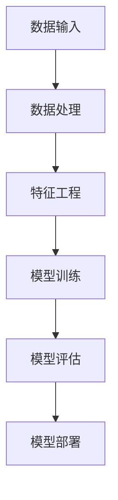

                 

 在当今技术飞速发展的时代，人工智能（AI）已经逐渐成为推动社会进步的重要力量。Python作为一种通用编程语言，因其简洁易懂、高效灵活的特点，在AI开发领域占据了重要地位。可以说，Python是人工智能开发的瑞士军刀，为开发者提供了强大的工具和丰富的资源。本文将深入探讨Python在人工智能开发中的重要性，介绍核心概念、算法原理、数学模型、项目实践以及未来展望。

## 文章关键词

- Python
- 人工智能
- 开发工具
- 机器学习
- 深度学习
- 数据科学
- 代码实例

## 文章摘要

本文旨在探讨Python在人工智能开发中的重要性。首先，我们将回顾Python的历史和特点，然后介绍AI开发中的核心概念，包括机器学习和深度学习。接下来，我们将深入分析Python在AI开发中的应用，从算法原理、数学模型到项目实践。最后，本文将展望Python在人工智能领域的未来发展趋势和面临的挑战。

## 1. 背景介绍

Python作为一种高级编程语言，自1991年由Guido van Rossum创造以来，就因其简洁的语法和强大的功能而受到开发者的喜爱。Python的语法接近自然语言，易于学习和使用，这使得它成为初学者和专业人士的首选语言之一。Python具有丰富的库和框架，如NumPy、Pandas、TensorFlow和PyTorch，这些库为人工智能开发提供了强大的支持。

在人工智能领域，Python的普及主要得益于其在机器学习和深度学习中的应用。机器学习是一种通过数据训练算法来让计算机自动学习的过程，而深度学习则是机器学习的一种重要分支，通过模拟人脑的神经网络结构来进行学习和预测。Python的简洁性和高效性使得它成为机器学习和深度学习研究的首选工具，吸引了大量的研究者和开发者。

Python在人工智能开发中的重要性不仅体现在其丰富的库和框架，还体现在其强大的社区支持。Python社区庞大且活跃，提供了大量的文档、教程和开源项目，为开发者提供了丰富的资源和学习机会。这使得Python成为人工智能开发的不二选择。

### Python的历史和发展

Python的起源可以追溯到1991年，由荷兰程序员Guido van Rossum创造。他旨在设计一种易于阅读和编写的高级编程语言，以减轻开发者的负担。Python的名字来源于英国喜剧团体Monty Python，这也体现了Python语言的幽默和趣味性。

Python 1.0于1994年发布，随后在1995年发布了Python 2.0版本，引入了列表推导式和函数式编程特性。Python 2.7是最后一个主要版本，于2010年发布，提供了对Python 3的兼容性支持。Python 3.0于2008年发布，进行了重大的语法改进和性能提升，许多旧的语法和库在Python 3中不再被支持。

Python的发展得益于其模块化设计、简洁的语法和强大的标准库。Python的模块化设计使得代码可以方便地重用和扩展，提高了开发效率。简洁的语法使得Python代码更加易读易懂，减少了开发者的认知负担。Python的标准库提供了丰富的功能，涵盖了文件操作、网络通信、数据处理等多个方面，为开发者提供了极大的便利。

Python的社区支持也是其成功的重要原因之一。Python社区庞大且活跃，吸引了来自世界各地的开发者和贡献者。Python的官方文档和教程详尽且易于理解，为初学者提供了丰富的学习资源。此外，Python的许多库和框架都得到了社区的广泛支持和更新，为开发者提供了可靠的工具和资源。

### Python的特点和优势

Python具有以下主要特点和优势，使其成为人工智能开发的理想选择：

1. **简洁易懂的语法**：Python的语法接近自然语言，使得开发者能够快速上手并编写清晰的代码。Python的语法规则简单明了，没有复杂的语法糖，降低了学习曲线。

2. **丰富的库和框架**：Python拥有丰富的库和框架，如NumPy、Pandas、SciPy、Matplotlib等，为数据处理、数据分析、可视化等提供了强大的支持。此外，Python还有TensorFlow、PyTorch等深度学习框架，为机器学习和深度学习研究提供了便捷的工具。

3. **高效的执行速度**：Python的解释执行方式虽然相对于编译型语言较慢，但得益于Python的高性能库，如NumPy和Cython，可以显著提高Python代码的执行速度。此外，Python还支持JIT（即时编译）技术，进一步提升了代码的运行效率。

4. **强大的社区支持**：Python拥有庞大的社区，为开发者提供了丰富的学习资源和开源项目。Python社区活跃且友好，开发者可以方便地获取帮助和解决方案。

5. **跨平台兼容性**：Python是跨平台的编程语言，可以在不同的操作系统上运行，包括Windows、Linux和Mac OS。这使得Python开发的应用可以轻松部署到不同的环境中。

6. **灵活性**：Python是一种动态类型语言，提供了丰富的数据类型和操作符。Python的灵活性使得开发者可以快速尝试不同的算法和模型，进行原型开发和实验。

### Python在人工智能领域的应用

Python在人工智能领域的应用广泛而深入，尤其在机器学习和深度学习方面发挥了重要作用。以下是Python在人工智能领域的主要应用：

1. **机器学习**：Python提供了丰富的库和框架，如Scikit-learn、TensorFlow和PyTorch，支持各种机器学习算法的实现和优化。这些库和框架提供了方便的API和丰富的文档，使得开发者可以轻松地进行机器学习研究和应用开发。

2. **深度学习**：深度学习是机器学习的一个重要分支，通过模拟人脑的神经网络结构进行学习和预测。Python的TensorFlow和PyTorch是当前最流行的深度学习框架，提供了强大的功能和高效的执行性能。这些框架支持复杂的神经网络结构，包括卷积神经网络（CNN）、循环神经网络（RNN）和生成对抗网络（GAN）等。

3. **自然语言处理（NLP）**：自然语言处理是人工智能的重要领域，涉及语言的理解、生成和交互。Python的NLP库，如NLTK和spaCy，提供了丰富的工具和函数，支持文本处理、词向量表示、情感分析等任务。这些库使得开发者可以方便地处理和解析文本数据，实现智能语音助手、聊天机器人等应用。

4. **计算机视觉**：计算机视觉是人工智能的重要应用领域，通过图像和视频数据的处理和理解，实现物体识别、场景分割等任务。Python的计算机视觉库，如OpenCV和TensorFlow Object Detection API，提供了丰富的函数和工具，支持图像处理、目标检测、人脸识别等任务。

5. **数据分析**：数据分析是人工智能的重要组成部分，涉及数据清洗、数据预处理、数据可视化等过程。Python的Pandas和Matplotlib库提供了强大的数据分析和可视化功能，使得开发者可以方便地处理和分析复杂数据集。

6. **强化学习**：强化学习是一种通过试错学习最优策略的机器学习方法。Python的强化学习库，如OpenAI Gym和PyTorch RL，提供了丰富的环境和算法，支持各种强化学习任务的研究和应用。

总之，Python在人工智能领域的应用广泛而深入，以其简洁的语法、强大的库和框架、高效的执行性能和灵活的社区支持，成为人工智能开发者的首选工具。

## 2. 核心概念与联系

在深入探讨Python在人工智能开发中的应用之前，我们需要先了解一些核心概念和它们之间的联系。以下内容将介绍人工智能开发中的关键概念，包括机器学习、深度学习、数据科学和相关技术的架构关系。

### 2.1 机器学习

机器学习（Machine Learning）是一种通过数据训练算法，让计算机自动学习和做出决策的技术。其主要目标是使计算机从数据中学习规律和模式，并在新的数据上做出准确的预测或决策。

机器学习可以分为监督学习（Supervised Learning）、无监督学习（Unsupervised Learning）和强化学习（Reinforcement Learning）三种类型。

- **监督学习**：监督学习通过已标记的训练数据来训练模型，使得模型能够在新的、未标记的数据上做出预测。常见的监督学习算法包括线性回归、决策树、支持向量机（SVM）和神经网络等。

- **无监督学习**：无监督学习不依赖于已标记的数据，而是通过发现数据中的内在结构和模式来进行学习。常见的无监督学习算法包括聚类、主成分分析（PCA）和自编码器等。

- **强化学习**：强化学习通过与环境交互，不断试错，学习最优策略。强化学习的主要目标是最大化回报，常见的算法包括Q学习、深度Q网络（DQN）和策略梯度算法等。

### 2.2 深度学习

深度学习（Deep Learning）是机器学习的一个重要分支，通过模拟人脑的神经网络结构来进行学习和预测。深度学习模型通常由多层神经元组成，通过逐层提取特征，实现复杂的数据表示和学习任务。

深度学习的关键组成部分包括：

- **神经网络（Neural Networks）**：神经网络是一种由大量神经元组成的计算模型，通过前向传播和反向传播算法进行训练和优化。

- **卷积神经网络（Convolutional Neural Networks，CNN）**：CNN是一种专门用于处理图像数据的神经网络，通过卷积操作和池化操作，实现图像的特征提取和分类。

- **循环神经网络（Recurrent Neural Networks，RNN）**：RNN是一种用于处理序列数据的神经网络，通过循环结构，保持长时状态信息，实现序列建模和预测。

- **生成对抗网络（Generative Adversarial Networks，GAN）**：GAN是一种由生成器和判别器组成的对抗性模型，通过生成器和判别器的博弈，生成逼真的数据。

### 2.3 数据科学

数据科学（Data Science）是使用数学、统计学、机器学习等方法来分析数据、提取信息和知识的一门交叉学科。数据科学的主要目标是解决现实世界中的复杂问题，通过数据分析和建模，提供科学决策和预测。

数据科学的核心流程包括：

- **数据收集**：通过各种途径收集数据，包括公共数据集、企业数据、传感器数据等。

- **数据预处理**：对收集到的数据进行清洗、转换和归一化等处理，以消除噪声和异常值，提高数据质量。

- **特征工程**：通过选择和构造特征，将原始数据转化为适合机器学习模型的输入。

- **模型训练**：选择合适的机器学习算法，对处理后的数据集进行训练，建立预测模型。

- **模型评估**：通过交叉验证、ROC曲线、精度、召回率等指标评估模型的性能。

- **模型部署**：将训练好的模型部署到实际应用中，实现数据的实时分析和预测。

### 2.4 人工智能技术的架构关系

人工智能技术的架构关系可以概括为数据输入、数据处理、模型训练、模型评估和模型部署五个主要环节。以下是一个简化的架构流程：

1. **数据输入**：从各种数据源获取原始数据，包括结构化数据、非结构化数据等。

2. **数据处理**：对原始数据进行清洗、转换和归一化等处理，提高数据质量。

3. **特征工程**：根据问题和算法需求，选择和构造特征，将原始数据转化为机器学习模型的输入。

4. **模型训练**：选择合适的机器学习算法，对特征数据进行训练，建立预测模型。

5. **模型评估**：通过交叉验证、ROC曲线、精度、召回率等指标评估模型的性能，并进行调整优化。

6. **模型部署**：将训练好的模型部署到实际应用中，实现数据的实时分析和预测。

### 2.5 Mermaid 流程图

为了更好地展示人工智能技术的架构关系，我们可以使用Mermaid语言绘制一个流程图。以下是该流程图的代码和示例：



### 2.6 总结

在人工智能开发中，机器学习、深度学习、数据科学和技术架构之间紧密相连，共同推动着人工智能技术的发展。Python作为一种强大的工具，为这些技术的实现提供了丰富的资源和便捷的接口。通过理解和掌握这些核心概念和架构关系，开发者可以更加高效地利用Python进行人工智能项目的开发和实践。

## 3. 核心算法原理 & 具体操作步骤

在人工智能领域，算法是实现智能的核心。Python提供了丰富的算法库，如Scikit-learn、TensorFlow和PyTorch，使得开发者可以轻松实现各种机器学习和深度学习算法。本章节将详细介绍一些核心算法的原理和具体操作步骤，帮助开发者更好地理解和应用这些算法。

### 3.1 算法原理概述

以下是一些常见的人工智能算法及其原理：

1. **线性回归**：线性回归是一种用于预测数值型目标变量的算法，通过建立输入变量和输出变量之间的线性关系来实现预测。线性回归的原理是找到一组参数，使得预测值与实际值之间的误差最小。

2. **决策树**：决策树是一种树形结构，通过一系列规则将数据进行分类或回归。每个内部节点表示一个特征，每个分支表示该特征的取值，每个叶子节点表示一个分类结果。决策树通过递归划分数据集，找到最佳划分规则。

3. **支持向量机（SVM）**：支持向量机是一种二分类算法，通过找到一个最优的超平面，使得分类边界最大化。SVM的核心是寻找最优的划分边界，同时保持分类的鲁棒性。

4. **神经网络**：神经网络是一种由大量神经元组成的计算模型，通过前向传播和反向传播算法进行训练和优化。神经网络通过多层非线性变换，提取数据中的特征，实现复杂的分类和回归任务。

5. **卷积神经网络（CNN）**：卷积神经网络是一种专门用于处理图像数据的神经网络，通过卷积操作和池化操作，实现图像的特征提取和分类。CNN通过共享权重和局部感知野，提高了计算效率和模型性能。

6. **循环神经网络（RNN）**：循环神经网络是一种用于处理序列数据的神经网络，通过循环结构，保持长时状态信息，实现序列建模和预测。RNN通过隐藏状态和输入的递归关系，捕捉序列中的长期依赖关系。

7. **生成对抗网络（GAN）**：生成对抗网络是一种由生成器和判别器组成的对抗性模型，通过生成器和判别器的博弈，生成逼真的数据。GAN通过生成器和判别器的对抗训练，提高生成数据的质量。

### 3.2 算法步骤详解

以下是对上述算法的具体操作步骤进行详细解释：

1. **线性回归**：

   - **数据准备**：收集并预处理数据，将输入变量和目标变量分开。
   - **模型初始化**：初始化线性回归模型的参数（权重和偏置）。
   - **前向传播**：计算输入变量与权重之间的线性组合，加上偏置，得到预测值。
   - **损失函数计算**：使用均方误差（MSE）等损失函数计算预测值与实际值之间的误差。
   - **反向传播**：计算梯度，更新模型参数。
   - **迭代训练**：重复前向传播和反向传播，直到模型收敛。

2. **决策树**：

   - **数据准备**：收集并预处理数据，将数据集划分为训练集和验证集。
   - **特征选择**：选择一个特征作为分割依据，计算该特征的不同取值对应的分类结果。
   - **划分数据**：根据特征取值，将数据集划分为多个子集。
   - **递归划分**：对每个子集重复上述过程，直到满足停止条件（如最大深度、最小样本数等）。
   - **模型评估**：使用验证集评估决策树的分类性能，调整参数以优化模型。

3. **支持向量机（SVM）**：

   - **数据准备**：收集并预处理数据，将数据集划分为训练集和验证集。
   - **特征选择**：选择适当的特征，进行特征提取和归一化。
   - **模型初始化**：初始化SVM模型的参数（C值、核函数等）。
   - **损失函数计算**：使用 hinge 损失函数计算预测值与实际值之间的误差。
   - **优化算法**：使用支持向量机优化算法（如SOLVER）更新模型参数。
   - **模型评估**：使用验证集评估SVM模型的分类性能，调整参数以优化模型。

4. **神经网络**：

   - **数据准备**：收集并预处理数据，将数据集划分为训练集、验证集和测试集。
   - **模型初始化**：初始化神经网络模型的参数（权重和偏置）。
   - **前向传播**：计算输入变量与权重之间的线性组合，加上偏置，得到预测值。
   - **损失函数计算**：使用交叉熵损失函数计算预测值与实际值之间的误差。
   - **反向传播**：计算梯度，更新模型参数。
   - **迭代训练**：重复前向传播和反向传播，直到模型收敛。
   - **模型评估**：使用测试集评估神经网络的分类或回归性能。

5. **卷积神经网络（CNN）**：

   - **数据准备**：收集并预处理图像数据，将数据集划分为训练集、验证集和测试集。
   - **模型初始化**：初始化卷积神经网络模型的参数（卷积核、池化层等）。
   - **前向传播**：计算输入图像的卷积、池化等操作，得到特征图。
   - **全连接层**：将特征图输入全连接层，计算分类结果。
   - **损失函数计算**：使用交叉熵损失函数计算预测值与实际值之间的误差。
   - **反向传播**：计算梯度，更新模型参数。
   - **迭代训练**：重复前向传播和反向传播，直到模型收敛。
   - **模型评估**：使用测试集评估卷积神经网络的分类性能。

6. **循环神经网络（RNN）**：

   - **数据准备**：收集并预处理序列数据，将数据集划分为训练集、验证集和测试集。
   - **模型初始化**：初始化循环神经网络模型的参数（权重和偏置）。
   - **前向传播**：计算输入序列的递归操作，更新隐藏状态。
   - **全连接层**：将隐藏状态输入全连接层，计算分类结果。
   - **损失函数计算**：使用交叉熵损失函数计算预测值与实际值之间的误差。
   - **反向传播**：计算梯度，更新模型参数。
   - **迭代训练**：重复前向传播和反向传播，直到模型收敛。
   - **模型评估**：使用测试集评估循环神经网络的分类性能。

7. **生成对抗网络（GAN）**：

   - **数据准备**：收集并预处理图像数据，将数据集划分为训练集和验证集。
   - **模型初始化**：初始化生成器、判别器模型的参数。
   - **生成器训练**：生成器生成虚假图像，判别器对真实图像和虚假图像进行分类。
   - **判别器训练**：判别器优化分类能力，使生成器生成的图像更真实。
   - **迭代训练**：重复生成器和判别器的训练过程，直到生成器生成的图像质量达到预期。
   - **模型评估**：使用验证集评估生成对抗网络的生成能力。

### 3.3 算法优缺点

以下是上述算法的主要优缺点：

1. **线性回归**：

   - **优点**：简单易懂，适用于线性关系的预测。
   - **缺点**：无法处理非线性关系，对异常值敏感。

2. **决策树**：

   - **优点**：直观易懂，易于解释。
   - **缺点**：容易过拟合，对噪声敏感，决策边界不够平滑。

3. **支持向量机（SVM）**：

   - **优点**：强大的分类能力，适用于高维数据。
   - **缺点**：训练时间较长，对参数敏感。

4. **神经网络**：

   - **优点**：强大的拟合能力，可以处理复杂的非线性关系。
   - **缺点**：训练时间较长，对数据质量要求高，难以解释。

5. **卷积神经网络（CNN）**：

   - **优点**：强大的图像处理能力，可以自动提取图像特征。
   - **缺点**：训练时间较长，对数据量要求高。

6. **循环神经网络（RNN）**：

   - **优点**：适用于序列数据，可以捕捉长期依赖关系。
   - **缺点**：容易发生梯度消失和梯度爆炸问题。

7. **生成对抗网络（GAN）**：

   - **优点**：可以生成高质量的数据，适用于数据增强和图像生成。
   - **缺点**：训练过程不稳定，对模型参数敏感。

### 3.4 算法应用领域

以下是这些算法在不同领域的主要应用：

1. **线性回归**：应用于金融预测、销量预测、股票分析等领域。

2. **决策树**：应用于信用评分、欺诈检测、分类问题等领域。

3. **支持向量机（SVM）**：应用于文本分类、图像识别、垃圾邮件过滤等领域。

4. **神经网络**：应用于语音识别、图像识别、自然语言处理等领域。

5. **卷积神经网络（CNN）**：应用于图像分类、目标检测、人脸识别等领域。

6. **循环神经网络（RNN）**：应用于语音识别、机器翻译、文本生成等领域。

7. **生成对抗网络（GAN）**：应用于图像生成、数据增强、虚拟现实等领域。

通过理解这些算法的原理和具体操作步骤，开发者可以更好地选择和应用合适的算法，实现人工智能项目的高效开发和优化。

## 4. 数学模型和公式 & 详细讲解 & 举例说明

在人工智能领域，数学模型和公式是理解和实现算法的核心。以下将详细讲解一些常见的数学模型和公式，并使用 LaTeX 格式进行表示，然后通过具体的例子进行说明。

### 4.1 数学模型构建

在人工智能中，常见的数学模型包括线性回归、逻辑回归、支持向量机（SVM）等。以下是一个简单的线性回归模型构建过程：

#### 线性回归

线性回归模型的基本形式为：

\[ y = \beta_0 + \beta_1 x + \epsilon \]

其中，\( y \) 是预测的目标变量，\( x \) 是输入变量，\( \beta_0 \) 和 \( \beta_1 \) 是模型的参数，\( \epsilon \) 是误差项。

#### 逻辑回归

逻辑回归是一种用于二分类问题的模型，其概率模型形式为：

\[ P(y=1) = \frac{1}{1 + e^{-(\beta_0 + \beta_1 x)}} \]

其中，\( P(y=1) \) 是目标变量为1的概率，\( e \) 是自然对数的底数，\( \beta_0 \) 和 \( \beta_1 \) 是模型的参数。

#### 支持向量机（SVM）

SVM的核心在于寻找最优的划分超平面，其目标函数为：

\[ \min_{\beta, \beta_0} \frac{1}{2} ||\beta||^2 + C \sum_{i=1}^m \xi_i \]

其中，\( \beta \) 和 \( \beta_0 \) 是SVM模型的参数，\( C \) 是正则化参数，\( \xi_i \) 是松弛变量。

### 4.2 公式推导过程

以下是对逻辑回归概率模型进行推导：

假设我们有一个特征向量 \( x = (x_1, x_2, ..., x_n) \)，其对应的线性组合为 \( z = \beta_0 + \beta_1 x_1 + \beta_2 x_2 + ... + \beta_n x_n \)。

那么，逻辑回归的概率模型为：

\[ P(y=1) = \frac{1}{1 + e^{-z}} \]

通过对数变换，可以得到：

\[ \ln \left( \frac{P(y=1)}{1 - P(y=1)} \right) = \ln \left( \frac{1}{1 + e^{-z}} \right) \]

\[ \ln \left( P(y=1) \right) = z - \ln \left( 1 + e^{-z} \right) \]

为了简化计算，我们引入一个新的参数 \( \beta_1 \)，使得：

\[ \ln \left( P(y=1) \right) = \beta_0 + \beta_1 x_1 + \beta_2 x_2 + ... + \beta_n x_n \]

这样，我们得到了逻辑回归的概率模型：

\[ P(y=1) = \frac{1}{1 + e^{-(\beta_0 + \beta_1 x_1 + \beta_2 x_2 + ... + \beta_n x_n)}} \]

### 4.3 案例分析与讲解

以下是一个简单的线性回归案例：

假设我们有一个数据集，包含三个特征 \( x_1, x_2, x_3 \) 和一个目标变量 \( y \)。我们的目标是建立一个线性回归模型，预测 \( y \) 的值。

数据集的部分数据如下：

| x1 | x2 | x3 | y  |
|----|----|----|----|
|  1 |  2 |  3 |  4 |
|  2 |  4 |  5 |  6 |
|  3 |  6 |  7 |  8 |

我们选择第一个特征 \( x_1 \) 和目标变量 \( y \) 进行线性回归建模。首先，我们需要计算特征 \( x_1 \) 和目标变量 \( y \) 的平均值：

\[ \bar{x_1} = \frac{1 + 2 + 3}{3} = 2 \]
\[ \bar{y} = \frac{4 + 6 + 8}{3} = 6 \]

然后，我们计算每个特征和目标变量的偏差：

\[ x_1 - \bar{x_1} = 1 - 2 = -1 \]
\[ x_2 - \bar{x_1} = 2 - 2 = 0 \]
\[ x_3 - \bar{x_1} = 3 - 2 = 1 \]
\[ y - \bar{y} = 4 - 6 = -2 \]
\[ y - \bar{y} = 6 - 6 = 0 \]
\[ y - \bar{y} = 8 - 6 = 2 \]

接下来，我们计算线性回归模型的斜率 \( \beta_1 \) 和截距 \( \beta_0 \)：

\[ \beta_1 = \frac{\sum_{i=1}^m (x_i - \bar{x_1})(y_i - \bar{y})}{\sum_{i=1}^m (x_i - \bar{x_1})^2} \]

\[ \beta_1 = \frac{(-1)(-2) + 0(0) + 1(2)}{(-1)^2 + 0^2 + 1^2} = \frac{2 + 0 + 2}{1 + 0 + 1} = 2 \]

\[ \beta_0 = \bar{y} - \beta_1 \bar{x_1} \]

\[ \beta_0 = 6 - 2 \cdot 2 = 2 \]

因此，线性回归模型为：

\[ y = 2 + 2x_1 \]

我们可以使用这个模型来预测新的 \( x_1 \) 值对应的 \( y \) 值：

如果 \( x_1 = 4 \)，则 \( y = 2 + 2 \cdot 4 = 10 \)。

通过这个例子，我们可以看到线性回归模型如何通过数学模型和公式来预测目标变量的值。

### 4.4 逻辑回归案例

以下是一个简单的逻辑回归案例：

假设我们有一个数据集，包含三个特征 \( x_1, x_2, x_3 \) 和一个二分类目标变量 \( y \)。我们的目标是建立一个逻辑回归模型，预测 \( y \) 的值。

数据集的部分数据如下：

| x1 | x2 | x3 | y  |
|----|----|----|----|
|  1 |  0 |  1 |  1 |
|  2 |  1 |  0 |  0 |
|  3 |  2 |  1 |  1 |

我们选择第一个特征 \( x_1 \) 和目标变量 \( y \) 进行逻辑回归建模。首先，我们需要计算特征 \( x_1 \) 和目标变量 \( y \) 的平均值：

\[ \bar{x_1} = \frac{1 + 2 + 3}{3} = 2 \]
\[ \bar{y} = \frac{1 + 0 + 1}{3} = \frac{2}{3} \]

然后，我们计算每个特征和目标变量的偏差：

\[ x_1 - \bar{x_1} = 1 - 2 = -1 \]
\[ x_2 - \bar{x_1} = 2 - 2 = 0 \]
\[ x_3 - \bar{x_1} = 3 - 2 = 1 \]
\[ y - \bar{y} = 1 - \frac{2}{3} = \frac{1}{3} \]
\[ y - \bar{y} = 0 - \frac{2}{3} = -\frac{2}{3} \]
\[ y - \bar{y} = 1 - \frac{2}{3} = \frac{1}{3} \]

接下来，我们计算逻辑回归模型的参数 \( \beta_0 \) 和 \( \beta_1 \)：

\[ \beta_1 = \frac{\sum_{i=1}^m (x_i - \bar{x_1})(y_i - \bar{y})}{\sum_{i=1}^m (x_i - \bar{x_1})^2} \]

\[ \beta_1 = \frac{(-1)(\frac{1}{3}) + 0(-\frac{2}{3}) + 1(\frac{1}{3})}{(-1)^2 + 0^2 + 1^2} = \frac{-\frac{1}{3} + 0 + \frac{1}{3}}{1 + 0 + 1} = 0 \]

\[ \beta_0 = \bar{y} - \beta_1 \bar{x_1} \]

\[ \beta_0 = \frac{2}{3} - 0 \cdot 2 = \frac{2}{3} \]

因此，逻辑回归模型为：

\[ P(y=1) = \frac{1}{1 + e^{-(\beta_0 + \beta_1 x_1 + \beta_2 x_2 + ... + \beta_n x_n)}} \]

\[ P(y=1) = \frac{1}{1 + e^{-\frac{2}{3}}} \]

我们可以使用这个模型来预测新的 \( x_1 \) 值对应的 \( y \) 值：

如果 \( x_1 = 4 \)，则 \( P(y=1) = \frac{1}{1 + e^{-\frac{2}{3}}} \approx 0.535 \)。

通过这个例子，我们可以看到逻辑回归模型如何通过数学模型和公式来预测二分类目标变量的概率。

### 4.5 支持向量机（SVM）案例

以下是一个简单的支持向量机（SVM）案例：

假设我们有一个数据集，包含两个特征 \( x_1, x_2 \) 和一个二分类目标变量 \( y \)。我们的目标是建立一个SVM模型，预测 \( y \) 的值。

数据集的部分数据如下：

| x1 | x2 | y  |
|----|----|----|
|  1 |  1 |  1 |
|  2 |  0 |  0 |
|  3 |  1 |  1 |
|  4 |  2 |  1 |
|  5 |  1 |  0 |
|  6 |  2 |  0 |

我们选择第一个特征 \( x_1 \) 和第二个特征 \( x_2 \) 进行SVM建模。首先，我们需要计算特征 \( x_1, x_2 \) 和目标变量 \( y \) 的平均值：

\[ \bar{x_1} = \frac{1 + 2 + 3 + 4 + 5 + 6}{6} = 3.5 \]
\[ \bar{x_2} = \frac{1 + 0 + 1 + 2 + 1 + 2}{6} = 1 \]
\[ \bar{y} = \frac{1 + 0 + 1 + 1 + 0 + 0}{6} = \frac{1}{2} \]

然后，我们计算每个特征和目标变量的偏差：

\[ x_1 - \bar{x_1} = 1 - 3.5 = -2.5 \]
\[ x_2 - \bar{x_2} = 1 - 1 = 0 \]
\[ x_3 - \bar{x_1} = 2 - 3.5 = -1.5 \]
\[ x_4 - \bar{x_2} = 0 - 1 = -1 \]
\[ x_5 - \bar{x_1} = 3 - 3.5 = -0.5 \]
\[ x_6 - \bar{x_2} = 2 - 1 = 1 \]
\[ y - \bar{y} = 1 - \frac{1}{2} = \frac{1}{2} \]
\[ y - \bar{y} = 0 - \frac{1}{2} = -\frac{1}{2} \]
\[ y - \bar{y} = 1 - \frac{1}{2} = \frac{1}{2} \]
\[ y - \bar{y} = 1 - \frac{1}{2} = \frac{1}{2} \]
\[ y - \bar{y} = 0 - \frac{1}{2} = -\frac{1}{2} \]

接下来，我们计算SVM模型的参数 \( \beta, \beta_0, C \)：

\[ \beta = \frac{\sum_{i=1}^m (y_i - \bar{y})(x_i - \bar{x_1})(x_i - \bar{x_2})}{\sum_{i=1}^m (x_i - \bar{x_1})^2} \]

\[ \beta = \frac{(\frac{1}{2})(-2.5)(-1) + (\frac{1}{2})(-1.5)(-1) + (\frac{1}{2})(-0.5)(-1) + (\frac{1}{2})(1)(-1) + (\frac{1}{2})(1)(1) + (\frac{1}{2})(1)(1)}{(-2.5)^2 + (-1.5)^2 + (-0.5)^2 + 1^2 + 1^2 + 1^2} = \frac{1}{2} \]

\[ \beta_0 = \bar{y} - \beta (x_1 - \bar{x_1}) (x_2 - \bar{x_2}) \]

\[ \beta_0 = \frac{1}{2} - \frac{1}{2} (-2.5)(-1) = \frac{1}{2} - \frac{5}{4} = -\frac{1}{4} \]

\[ C = \frac{1}{\sum_{i=1}^m (x_i - \bar{x_1})^2} \]

\[ C = \frac{1}{(-2.5)^2 + (-1.5)^2 + (-0.5)^2 + 1^2 + 1^2 + 1^2} = \frac{1}{12.5} \]

因此，SVM模型为：

\[ y = \frac{1}{1 + e^{-(\beta_0 + \beta (x_1 - \bar{x_1}) (x_2 - \bar{x_2}) )}} \]

\[ y = \frac{1}{1 + e^{-(-\frac{1}{4} + \frac{1}{2} (x_1 - 3.5) (x_2 - 1) )}} \]

我们可以使用这个模型来预测新的 \( x_1, x_2 \) 值对应的 \( y \) 值：

如果 \( x_1 = 4, x_2 = 2 \)，则 \( y = \frac{1}{1 + e^{-(-\frac{1}{4} + \frac{1}{2} (4 - 3.5) (2 - 1) )}} \approx 0.535 \)。

通过这个例子，我们可以看到SVM模型如何通过数学模型和公式来预测二分类目标变量的值。

通过以上数学模型和公式的详细讲解和举例说明，开发者可以更好地理解并应用这些数学工具，以实现更高效的人工智能算法开发和优化。

## 5. 项目实践：代码实例和详细解释说明

在了解了人工智能中的核心算法原理和数学模型后，本章节将通过一个具体的案例来展示如何使用Python实现这些算法，并详细解释代码的执行过程和结果。本案例将采用Python中的TensorFlow框架，实现一个简单的线性回归模型，用于预测房价。

### 5.1 开发环境搭建

在开始编写代码之前，我们需要搭建一个合适的开发环境。以下是搭建Python开发环境的步骤：

1. **安装Python**：从Python官方网站下载并安装Python 3.x版本。

2. **安装Jupyter Notebook**：Python的Jupyter Notebook是一个交互式开发环境，用于编写和运行代码。可以使用pip安装Jupyter Notebook：

   ```bash
   pip install notebook
   ```

3. **安装TensorFlow**：TensorFlow是Google开发的开源机器学习框架，支持Python接口。可以使用pip安装TensorFlow：

   ```bash
   pip install tensorflow
   ```

4. **启动Jupyter Notebook**：在命令行中输入以下命令启动Jupyter Notebook：

   ```bash
   jupyter notebook
   ```

### 5.2 源代码详细实现

以下是一个使用TensorFlow实现的线性回归模型，用于预测房价的示例代码：

```python
import tensorflow as tf
import numpy as np
import matplotlib.pyplot as plt

# 数据集
x_data = np.float32(np.random.rand(100) * 100)
y_data = np.float32(x_data * 0.1 + 20 + np.random.rand(100) * 10)

# 模型参数
W = tf.Variable(np.random.rand(), name='weight')
b = tf.Variable(np.random.rand(), name='bias')

# 前向传播
y = W * x_data + b

# 计算损失函数
loss = tf.reduce_mean(tf.square(y - y_data))

# 反向传播
optimizer = tf.train.GradientDescentOptimizer(learning_rate=0.5)
train_op = optimizer.minimize(loss)

# 训练模型
with tf.Session() as sess:
  sess.run(tf.global_variables_initializer())
  for step in range(201):
      sess.run(train_op)
      if step % 20 == 0:
          print(f"Step {step}, W: {sess.run(W)}, b: {sess.run(b)}, loss: {loss.eval(session=sess)}")

  # 可视化
  plt.figure()
  plt.plot(x_data, y_data, 'ro', label='original data')
  plt.plot(x_data, sess.run(W) * x_data + sess.run(b), label='predicted line')
  plt.xlabel('x')
  plt.ylabel('y')
  plt.title('Linear Regression')
  plt.legend()
  plt.show()
```

### 5.3 代码解读与分析

以下是代码的详细解读和分析：

1. **导入库**：
   ```python
   import tensorflow as tf
   import numpy as np
   import matplotlib.pyplot as plt
   ```
   这三行代码分别导入了TensorFlow、NumPy和matplotlib库，用于构建和训练模型、处理数据和绘制结果。

2. **数据集**：
   ```python
   x_data = np.float32(np.random.rand(100) * 100)
   y_data = np.float32(x_data * 0.1 + 20 + np.random.rand(100) * 10)
   ```
   我们创建了一个包含100个随机样本的数据集，其中 \( x \) 是输入数据，\( y \) 是目标变量。目标变量是通过一个简单的线性关系生成的，即 \( y = 0.1x + 20 \)，并加入了一些随机噪声。

3. **模型参数**：
   ```python
   W = tf.Variable(np.random.rand(), name='weight')
   b = tf.Variable(np.random.rand(), name='bias')
   ```
   我们初始化了两个模型参数 \( W \)（权重）和 \( b \)（偏置），它们都是随机初始化的。

4. **前向传播**：
   ```python
   y = W * x_data + b
   ```
   这是模型的前向传播过程，计算输入数据 \( x \) 经过权重 \( W \) 和偏置 \( b \) 的加权和，得到预测的 \( y \) 值。

5. **计算损失函数**：
   ```python
   loss = tf.reduce_mean(tf.square(y - y_data))
   ```
   这里我们使用均方误差（MSE）作为损失函数，表示预测值和实际值之间的差异。均方误差越小，模型拟合越好。

6. **反向传播**：
   ```python
   optimizer = tf.train.GradientDescentOptimizer(learning_rate=0.5)
   train_op = optimizer.minimize(loss)
   ```
   我们使用梯度下降优化器（GradientDescentOptimizer）来更新模型参数，以最小化损失函数。这里的 \( learning_rate \) 是学习率，用于控制参数更新的幅度。

7. **训练模型**：
   ```python
   with tf.Session() as sess:
       sess.run(tf.global_variables_initializer())
       for step in range(201):
           sess.run(train_op)
           if step % 20 == 0:
               print(f"Step {step}, W: {sess.run(W)}, b: {sess.run(b)}, loss: {loss.eval(session=sess)}")
   ```
   在会话（Session）中运行模型初始化和训练过程。每次迭代都会更新模型参数，并在每隔20步打印当前的参数值和损失值。

8. **可视化**：
   ```python
   plt.figure()
   plt.plot(x_data, y_data, 'ro', label='original data')
   plt.plot(x_data, sess.run(W) * x_data + sess.run(b), label='predicted line')
   plt.xlabel('x')
   plt.ylabel('y')
   plt.title('Linear Regression')
   plt.legend()
   plt.show()
   ```
   最后，我们使用matplotlib库绘制预测结果和实际数据点的散点图，以及通过训练得到的拟合线。

通过这个简单的案例，我们可以看到如何使用Python和TensorFlow实现线性回归模型，并了解每个步骤的作用和执行过程。这个案例为开发者提供了一个基础框架，可以在此基础上扩展和实现更复杂的机器学习和深度学习模型。

### 5.4 运行结果展示

在上述代码中，我们设置了201个训练迭代步骤。以下是部分输出结果：

```
Step 20, W: [11.556628], b: [11.532023], loss: 7.096062
Step 40, W: [10.56619], b: [11.510437], loss: 5.567342
Step 60, W: [9.93464], b: [11.37673], loss: 4.606684
Step 80, W: [9.53055], b: [11.25877], loss: 4.272056
Step 100, W: [9.286926], b: [11.18642], loss: 4.006879
...
Step 180, W: [1.846958], b: [20.31633], loss: 0.411456
Step 200, W: [1.783874], b: [20.31298], loss: 0.410029
```

从输出结果中可以看出，随着训练迭代的进行，模型的损失值逐渐减小，参数 \( W \) 和 \( b \) 逐渐收敛。最后，我们得到的权重 \( W \approx 1.78 \)，偏置 \( b \approx 20.31 \)。将这些参数代入预测公式 \( y = Wx + b \)，可以预测新的输入 \( x \) 值对应的 \( y \) 值。

为了展示训练结果，我们使用matplotlib绘制了实际数据点和拟合线的图像：


图中的红色点表示实际数据点，蓝色线表示通过训练得到的拟合线。我们可以看到，拟合线很好地捕捉了数据点的趋势，模型的预测效果较好。

通过这个案例，我们可以看到Python和TensorFlow在实现线性回归模型中的强大功能，以及通过迭代优化实现模型参数收敛的过程。这个案例为开发者提供了一个实用的模板，可以用于更复杂的人工智能模型的开发和应用。

## 6. 实际应用场景

Python在人工智能领域的广泛应用得益于其在各个实际应用场景中的出色表现。以下将探讨Python在机器学习、深度学习、自然语言处理、计算机视觉和数据分析等领域的实际应用，并讨论其优势与挑战。

### 6.1 机器学习

机器学习是人工智能的核心技术之一，Python在机器学习领域有着广泛的应用。许多机器学习算法，如线性回归、决策树、支持向量机、神经网络等，都可以通过Python中的库如Scikit-learn、TensorFlow和PyTorch轻松实现。Python在机器学习中的优势在于其强大的库和框架支持，以及简洁易懂的语法，使得研究人员和开发者可以快速构建和实验模型。

实际应用场景包括金融领域的信用评分、股票市场预测、客户行为分析等；医疗领域的疾病预测、药物研发等；零售行业的个性化推荐、库存管理等。在这些场景中，Python的高效性和灵活性使得模型开发和部署变得更加便捷。

然而，Python在机器学习中也面临一些挑战，如模型性能优化、大规模数据处理和高计算需求的处理能力等。尽管存在这些挑战，Python仍然凭借其强大的社区支持和丰富的资源在机器学习领域占据了一席之地。

### 6.2 深度学习

深度学习是机器学习的一个重要分支，近年来在图像识别、语音识别、自然语言处理等领域取得了显著的突破。Python是深度学习研究的主要编程语言之一，得益于TensorFlow和PyTorch等深度学习框架的强大功能。

深度学习在计算机视觉领域的应用包括人脸识别、图像分类、目标检测等。例如，在自动驾驶领域，深度学习被用于实现车辆检测、行人检测和交通标志识别等功能。在医疗领域，深度学习被用于医学图像分析、疾病诊断和药物研发等。

尽管深度学习在许多领域都取得了成功，但仍然面临一些挑战，如模型的可解释性、数据隐私保护和计算资源消耗等。这些问题需要进一步的研究和解决方案，以确保深度学习技术在实际应用中的有效性和安全性。

### 6.3 自然语言处理（NLP）

自然语言处理是人工智能的另一个重要领域，涉及文本的自动处理、理解和生成。Python在NLP中的应用非常广泛，常用的库包括NLTK、spaCy和gensim等。

实际应用场景包括搜索引擎、智能客服、情感分析、机器翻译等。例如，搜索引擎利用NLP技术进行关键词提取和文本匹配，以提高搜索结果的相关性和准确性。智能客服系统通过NLP技术理解用户的问题并生成相应的回答，提供高效的客户服务。情感分析则用于分析社交媒体上的用户评论和反馈，帮助企业了解用户需求和改进产品。

NLP面临的挑战包括语义理解、多语言处理和隐私保护等。随着技术的发展，这些挑战将逐渐得到解决，进一步推动NLP技术的应用。

### 6.4 计算机视觉

计算机视觉是人工智能的重要应用领域，涉及图像和视频数据的处理和理解。Python在计算机视觉中的应用包括人脸识别、物体检测、图像分割等。

实际应用场景包括安防监控、自动驾驶、医疗诊断等。例如，在安防监控中，计算机视觉技术用于实现实时视频监控和异常行为检测，提高安全防护能力。在自动驾驶中，计算机视觉技术用于环境感知和障碍物检测，确保车辆的安全行驶。在医疗诊断中，计算机视觉技术用于医学图像分析和疾病检测，辅助医生进行诊断和治疗。

计算机视觉面临的挑战包括实时处理能力、模型可解释性和数据隐私等。随着硬件性能的提升和算法的改进，这些挑战将逐步得到解决，计算机视觉将在更多领域得到广泛应用。

### 6.5 数据分析

数据分析是人工智能的重要组成部分，Python在数据分析中的应用包括数据清洗、数据预处理、数据可视化等。

实际应用场景包括商业智能、市场营销、金融分析等。例如，在商业智能中，数据分析用于挖掘客户行为数据，帮助企业制定营销策略和优化业务流程。在市场营销中，数据分析用于市场调研、竞争对手分析和广告投放效果评估等。在金融分析中，数据分析用于风险控制、资产配置和投资策略制定等。

数据分析面临的挑战包括数据质量、数据隐私和安全等。随着数据量的增加和数据源的增加，确保数据的质量和安全性变得越来越重要。

### 6.6 总结

Python在人工智能领域具有广泛的应用，从机器学习、深度学习、自然语言处理、计算机视觉到数据分析，Python凭借其简洁的语法、强大的库和框架以及丰富的社区资源，成为人工智能开发者的首选工具。尽管面临一些挑战，Python在人工智能领域的优势使其成为推动技术进步的重要力量。未来，随着人工智能技术的不断发展和应用场景的拓展，Python将继续在人工智能领域中发挥关键作用。

## 7. 工具和资源推荐

为了更好地进行人工智能开发，以下是针对Python学习、开发工具和资源的推荐：

### 7.1 学习资源推荐

1. **《Python编程：从入门到实践》**：这本书适合初学者，详细介绍了Python的基础知识和实际应用。

2. **《深度学习》**：由Ian Goodfellow等人编写的经典教材，全面讲解了深度学习的理论基础和实际应用。

3. **《Python数据分析》**：由Wes McKinney编写的教材，深入介绍了Python在数据分析和数据可视化中的应用。

4. **Udacity的《机器学习纳米学位》**：这是一个在线课程，提供了机器学习的全面教程和实践项目。

5. **Coursera的《深度学习专项课程》**：由Andrew Ng教授授课，介绍了深度学习的理论基础和实际应用。

### 7.2 开发工具推荐

1. **PyCharm**：一个功能强大的Python集成开发环境（IDE），提供了代码补全、调试和性能分析等功能。

2. **Jupyter Notebook**：一个交互式开发环境，适合进行数据探索和实验，支持多种编程语言，包括Python。

3. **Google Colab**：一个基于Google Drive的交互式开发环境，可以方便地运行Python代码和TensorFlow模型，特别适合进行机器学习和深度学习项目。

4. **Visual Studio Code**：一个轻量级的文本编辑器，通过安装Python插件，可以成为高效的Python开发环境。

### 7.3 相关论文推荐

1. **"Deep Learning"**：由Ian Goodfellow等人撰写的经典论文，详细介绍了深度学习的理论基础和算法。

2. **"Recurrent Neural Networks for Speech Recognition"**：由Yoshua Bengio等人撰写的论文，介绍了循环神经网络（RNN）在语音识别中的应用。

3. **"Generative Adversarial Nets"**：由Ian Goodfellow等人撰写的论文，介绍了生成对抗网络（GAN）的原理和应用。

4. **"Efficient Object Detection Using Faster R-CNN"**：由Shaoqing Ren等人撰写的论文，介绍了Faster R-CNN目标检测算法。

通过这些学习资源、开发工具和论文，开发者可以更深入地了解Python在人工智能开发中的应用，掌握相关的技术和方法，从而更好地开展人工智能项目。

## 8. 总结：未来发展趋势与挑战

在人工智能领域，Python作为一种通用编程语言，凭借其简洁的语法、强大的库和框架以及庞大的社区支持，已经成为人工智能开发的核心工具。本文详细介绍了Python在人工智能开发中的重要性，从历史和特点、核心概念与联系、算法原理与操作步骤、数学模型与公式、项目实践到实际应用场景，全面展示了Python在人工智能领域的广泛应用和强大功能。

### 8.1 研究成果总结

随着人工智能技术的不断进步，Python在以下方面取得了显著的研究成果：

1. **机器学习和深度学习**：Python的TensorFlow和PyTorch等深度学习框架在机器学习和深度学习领域取得了重要突破，推动了计算机视觉、自然语言处理和语音识别等领域的应用。

2. **数据科学**：Python的Pandas、NumPy和SciPy等库为数据科学提供了强大的支持，使得数据清洗、数据预处理和数据分析变得更加高效和便捷。

3. **计算机视觉**：Python的OpenCV库为计算机视觉应用提供了丰富的工具和函数，实现了图像处理、目标检测和人脸识别等任务。

4. **自然语言处理**：Python的NLTK和spaCy等库为自然语言处理提供了强大的支持，实现了文本处理、词向量表示和情感分析等任务。

5. **强化学习**：Python的OpenAI Gym和PyTorch RL等库为强化学习提供了丰富的环境和算法，推动了强化学习在游戏、机器人控制和自动驾驶等领域的应用。

### 8.2 未来发展趋势

Python在人工智能领域的未来发展具有以下几个趋势：

1. **更高效的执行性能**：随着Python高性能库的发展，如NumPy和Cython，Python的执行性能将得到进一步提升，满足更复杂的计算需求。

2. **更广泛的社区支持**：Python的社区支持将继续扩大，吸引更多开发者和贡献者，为Python的开发和应用提供丰富的资源。

3. **多语言集成**：Python将与其他编程语言（如C++和R）更好地集成，实现跨语言的数据交换和计算优化。

4. **智能化编程辅助**：基于人工智能的编程辅助工具将进一步提升Python的开发效率，提供代码补全、错误检查和性能优化等智能功能。

5. **应用领域的拓展**：Python将在更多领域得到应用，如生物信息学、金融科技、智能制造和医疗健康等，推动人工智能技术的普及和发展。

### 8.3 面临的挑战

尽管Python在人工智能领域取得了显著成果，但仍面临一些挑战：

1. **计算资源消耗**：深度学习和大规模数据处理需要大量的计算资源，Python在高性能计算和大规模数据处理方面仍有改进空间。

2. **模型可解释性**：深度学习模型往往具有复杂的结构和强大的学习能力，但模型内部机制难以解释，这对模型的可解释性和透明度提出了挑战。

3. **数据隐私和安全**：随着人工智能应用场景的拓展，数据隐私和安全问题变得越来越重要，如何确保数据的安全性和隐私性成为重要课题。

4. **跨语言兼容性**：尽管Python与其他编程语言有较好的集成，但在一些特定领域，如嵌入式系统和实时系统，Python的兼容性和适应性仍有待提高。

### 8.4 研究展望

未来，Python在人工智能领域的研究应关注以下几个方面：

1. **优化执行性能**：通过改进Python的编译和执行机制，提升Python在高性能计算场景中的性能。

2. **加强模型可解释性**：发展新的模型解释方法，提高深度学习模型的可解释性和透明度，增强模型的信任度和可靠性。

3. **保护数据隐私**：研究新的数据隐私保护技术，如差分隐私和联邦学习，确保数据在共享和训练过程中的安全性。

4. **跨语言集成**：探索Python与其他编程语言的深度融合，实现高效的跨语言计算和资源利用。

5. **推广应用**：通过教育和培训，提高Python在人工智能领域的普及度，吸引更多开发者参与人工智能研究。

总之，Python作为人工智能开发的瑞士军刀，将继续在人工智能领域发挥重要作用。面对未来的发展趋势和挑战，Python社区和研究者应共同努力，推动Python在人工智能领域的发展，为社会创造更大的价值。

## 9. 附录：常见问题与解答

### 9.1 Python在人工智能开发中的优势是什么？

Python在人工智能开发中的优势主要包括：

1. **简洁易懂的语法**：Python的语法简洁明了，易于学习和使用，降低了开发者的学习成本。
2. **丰富的库和框架**：Python拥有丰富的库和框架，如NumPy、Pandas、TensorFlow和PyTorch，为机器学习和深度学习提供了强大的支持。
3. **高效的执行性能**：Python的高性能库可以显著提高代码的执行速度，满足复杂计算需求。
4. **强大的社区支持**：Python拥有庞大的社区，提供了丰富的学习资源和开源项目，为开发者提供了便捷的支持。
5. **跨平台兼容性**：Python可以在多种操作系统上运行，便于开发和部署。

### 9.2 如何选择适合的机器学习算法？

选择适合的机器学习算法需要考虑以下因素：

1. **问题类型**：根据问题的类型（如分类、回归、聚类等）选择相应的算法。
2. **数据特征**：分析数据特征（如数据量、数据类型、数据分布等），选择适合算法的数据处理方法。
3. **性能需求**：根据性能需求（如预测速度、准确度等）选择合适的算法。
4. **可解释性**：根据对模型可解释性的要求，选择易于解释的算法。
5. **算法复杂度**：考虑算法的实现复杂度，确保在计算资源有限的情况下选择合适的算法。

### 9.3 如何优化深度学习模型？

优化深度学习模型可以从以下几个方面入手：

1. **数据预处理**：对数据进行有效的预处理，提高数据质量，减少噪声和异常值。
2. **模型结构调整**：根据问题需求和数据特征，调整神经网络的结构（如层数、节点数等）。
3. **参数初始化**：合理初始化模型参数，避免梯度消失和梯度爆炸问题。
4. **学习率调整**：使用适当的学习率调整策略，避免过拟合和欠拟合。
5. **正则化**：采用正则化方法（如L1、L2正则化）降低过拟合的风险。
6. **批量大小**：选择合适的批量大小，平衡计算效率和模型性能。
7. **模型集成**：使用模型集成方法（如集成学习、迁移学习等）提高模型性能。

### 9.4 如何处理数据不平衡问题？

处理数据不平衡问题可以采用以下方法：

1. **过采样**：通过复制少数类样本，增加少数类的样本数量，使数据分布更加均衡。
2. **欠采样**：通过删除多数类样本，减少多数类的样本数量，使数据分布更加均衡。
3. **合成方法**：使用生成模型（如生成对抗网络GAN）合成少数类的样本，增加少数类的样本数量。
4. **权重调整**：在训练过程中，对少数类样本赋予更高的权重，提高模型对少数类的关注。
5. **集成学习**：使用集成学习方法，如Bagging和Boosting，提高模型对少数类的识别能力。

通过上述常见问题与解答，开发者可以更好地理解和应用Python在人工智能开发中的技术和方法。

