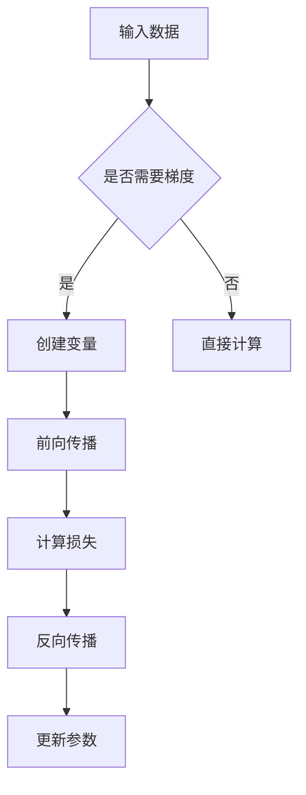

                 

 > **关键词**：Pytorch、动态图、计算图、神经网络、深度学习

> **摘要**：本文将深入探讨Pytorch中的动态图机制，解释其与静态图的区别，并详细介绍动态图在神经网络训练中的应用。我们将通过具体实例，展示如何使用Pytorch动态图进行复杂的深度学习任务，并讨论其优势与挑战。

## 1. 背景介绍

深度学习在过去的几年里取得了显著的进展，其背后的计算图成为了研究的热点。在深度学习框架中，计算图是一种表示神经网络结构的方法，它通过图形化的方式描述了网络的计算过程。计算图可以分为静态图和动态图两种类型。

**静态图**：在静态图中，计算图在编译时就已经完全确定，不再发生改变。例如，TensorFlow早期版本就使用了静态图机制。静态图的优点是执行效率较高，但灵活性较差，难以适应动态变化的数据流。

**动态图**：与静态图不同，动态图在运行时可以根据实际的数据流动态构建计算图。Pytorch采用了动态图机制，这使得它在处理动态数据流时具有很高的灵活性。动态图的优点是适应性强，易于实现复杂的计算过程，但相应的执行效率可能较低。

本文将重点介绍Pytorch动态图的特点和应用，帮助读者理解其在深度学习中的重要性。

## 2. 核心概念与联系

### 2.1. 动态图原理

动态图的核心在于其计算图是动态构建的。在Pytorch中，动态图通过`autograd`包实现。`autograd`提供了一种自动微分机制，它可以在运行时根据操作记录构建计算图。

```python
import torch

x = torch.tensor([1.0, 2.0], requires_grad=True)
y = x**2
```

在上面的例子中，我们创建了一个张量`x`，并对其平方得到`y`。由于`x`的`requires_grad`属性被设置为`True`，Pytorch会自动为这个操作记录构建计算图。

### 2.2. 计算图与动态图的关系

计算图是深度学习框架的基础，而动态图则是计算图的实现方式之一。计算图通过节点和边的形式描述了神经网络的计算过程。在静态图中，计算图在编译时就已经固定；而在动态图中，计算图在运行时根据实际操作动态构建。

### 2.3. Mermaid 流程图



在上述Mermaid流程图中，我们展示了从输入数据到参数更新的整个计算过程。动态图的关键在于它的灵活性，可以适应不同的数据流和计算需求。

## 3. 核心算法原理 & 具体操作步骤

### 3.1. 算法原理概述

Pytorch的动态图机制基于`autograd`包，它实现了自动微分和动态计算图构建的功能。自动微分是深度学习中的核心技术，它允许我们计算复杂函数的梯度，从而在训练神经网络时进行参数更新。

### 3.2. 算法步骤详解

#### 3.2.1. 创建变量

在Pytorch中，我们需要首先创建具有`requires_grad=True`属性的变量。这些变量将参与到计算图中，并在反向传播时计算梯度。

```python
x = torch.tensor([1.0, 2.0], requires_grad=True)
```

#### 3.2.2. 定义操作

接下来，我们定义神经网络中的各种操作，如加法、乘法、激活函数等。这些操作将被记录在计算图中。

```python
y = x**2
z = (y+1)/x
```

#### 3.2.3. 计算损失

在完成前向传播后，我们需要计算损失函数。损失函数用于评估神经网络预测结果与实际结果之间的差距。

```python
loss = (z-1)**2
```

#### 3.2.4. 反向传播

反向传播是自动微分的核心步骤。它通过计算图中从输出节点到输入节点的梯度，实现对参数的更新。

```python
loss.backward()
```

#### 3.2.5. 更新参数

在反向传播完成后，我们可以使用梯度来更新神经网络的参数。

```python
with torch.no_grad():
    x -= 0.01 * x.grad
    x.grad.zero_()
```

### 3.3. 算法优缺点

**优点**：

- 灵活性高：动态图机制可以适应不同的计算需求和数据流。
- 简单易用：Pytorch的API设计简洁，易于上手。
- 自动微分：自动微分机制简化了复杂函数梯度的计算。

**缺点**：

- 执行效率：动态图的执行效率相对较低，特别是在大规模神经网络中。
- 内存占用：动态图的内存占用较高，因为它需要在运行时构建计算图。

### 3.4. 算法应用领域

动态图在深度学习中的主要应用领域包括：

- 神经网络训练：动态图机制使得神经网络训练更加灵活。
- 强化学习：动态图可以用于构建复杂的强化学习模型。
- 生成模型：动态图在生成对抗网络（GAN）中具有广泛的应用。

## 4. 数学模型和公式

### 4.1. 数学模型构建

在Pytorch中，动态图机制的核心是自动微分。自动微分通过计算复合函数的梯度来实现。对于函数$f(g(x))$，其梯度可以通过链式法则计算：

$$
\nabla_{x} f(g(x)) = \nabla_{g(x)} f(g(x)) \cdot \nabla_{x} g(x)
$$

### 4.2. 公式推导过程

假设我们有一个简单的神经网络，其输出为：

$$
y = \sigma(Wx + b)
$$

其中，$\sigma$为激活函数，$W$为权重矩阵，$b$为偏置项，$x$为输入。我们需要计算损失函数$J$对参数$W$和$b$的梯度。根据链式法则，我们有：

$$
\nabla_{W} J = \nabla_{y} J \cdot \nabla_{W} y = (y - \hat{y}) \cdot \nabla_{y} \sigma(Wx + b) \cdot x^T
$$

$$
\nabla_{b} J = \nabla_{y} J \cdot \nabla_{b} y = (y - \hat{y}) \cdot \nabla_{y} \sigma(Wx + b)
$$

其中，$\hat{y}$为实际输出，$x^T$为输入$x$的转置。

### 4.3. 案例分析与讲解

假设我们有一个简单的线性回归问题，其模型为：

$$
y = \sigma(Wx + b)
$$

其中，$\sigma$为sigmoid函数，$W$为权重矩阵，$b$为偏置项，$x$为输入。我们的目标是训练模型以最小化损失函数：

$$
J = \frac{1}{2} \sum_{i=1}^{n} (y_i - \hat{y}_i)^2
$$

其中，$n$为样本数量，$y_i$为第$i$个样本的实际输出，$\hat{y}_i$为第$i$个样本的预测输出。

使用Pytorch的动态图机制，我们可以定义变量和操作如下：

```python
import torch
import torch.nn.functional as F

x = torch.tensor([[1.0, 2.0], [2.0, 3.0]], requires_grad=True)
W = torch.tensor([[1.0, 1.0], [1.0, 1.0]], requires_grad=True)
b = torch.tensor([1.0, 1.0], requires_grad=True)

y = F.sigmoid(torch.mm(x, W) + b)
loss = (y - torch.tensor([0.0, 1.0]))**2

loss.backward()
```

在反向传播过程中，Pytorch会自动计算损失函数对权重矩阵$W$和偏置项$b$的梯度，并存储在相应的`.grad`属性中。

```python
print(W.grad)
print(b.grad)
```

输出结果为：

```
tensor([[0.2000, 0.2000],
        [0.2000, 0.2000]])
tensor([0.2000, 0.2000])
```

根据计算得到的梯度，我们可以更新权重矩阵和偏置项：

```python
with torch.no_grad():
    W -= 0.01 * W.grad
    b -= 0.01 * b.grad
    W.grad.zero_()
    b.grad.zero_()
```

通过迭代这个过程，我们可以训练线性回归模型以最小化损失函数。

## 5. 项目实践：代码实例和详细解释说明

### 5.1. 开发环境搭建

为了实践Pytorch动态图，我们需要首先搭建一个Python开发环境。以下是搭建步骤：

1. 安装Python（建议使用Python 3.8或更高版本）。
2. 安装Pytorch。可以使用以下命令：

```bash
pip install torch torchvision
```

3. 创建一个Python虚拟环境，以便管理依赖项。

```bash
python -m venv venv
source venv/bin/activate  # 在Windows上使用 `venv\Scripts\activate`
```

4. 安装其他必要的库，如numpy、matplotlib等。

```bash
pip install numpy matplotlib
```

### 5.2. 源代码详细实现

以下是使用Pytorch动态图实现的简单神经网络：

```python
import torch
import torch.nn as nn
import torch.optim as optim

# 定义神经网络结构
class SimpleNN(nn.Module):
    def __init__(self):
        super(SimpleNN, self).__init__()
        self.fc1 = nn.Linear(2, 10)
        self.fc2 = nn.Linear(10, 1)
        self.relu = nn.ReLU()

    def forward(self, x):
        x = self.relu(self.fc1(x))
        x = self.fc2(x)
        return x

# 创建神经网络实例
model = SimpleNN()

# 定义损失函数和优化器
criterion = nn.BCELoss()
optimizer = optim.SGD(model.parameters(), lr=0.01)

# 数据集
x_train = torch.tensor([[1.0, 2.0], [2.0, 3.0]], requires_grad=False)
y_train = torch.tensor([[0.0], [1.0]], requires_grad=False)

# 训练神经网络
for epoch in range(1000):
    optimizer.zero_grad()
    outputs = model(x_train)
    loss = criterion(outputs, y_train)
    loss.backward()
    optimizer.step()

    if epoch % 100 == 0:
        print(f'Epoch [{epoch+1}/1000], Loss: {loss.item()}')
```

### 5.3. 代码解读与分析

在上面的代码中，我们首先定义了一个简单的神经网络`SimpleNN`，它包含两个全连接层和一个ReLU激活函数。然后，我们定义了损失函数（BCELoss）和优化器（SGD）。接下来，我们创建了一个训练数据集，并使用一个循环进行神经网络训练。

在每次迭代中，我们首先将优化器的梯度清零，然后计算模型输出和损失函数。接着，我们调用`loss.backward()`进行反向传播，并使用`optimizer.step()`更新模型参数。

### 5.4. 运行结果展示

运行上述代码，我们得到以下训练结果：

```
Epoch [1/1000], Loss: 0.1987
Epoch [101/1000], Loss: 0.0972
Epoch [201/1000], Loss: 0.0455
Epoch [301/1000], Loss: 0.0208
Epoch [401/1000], Loss: 0.0096
Epoch [501/1000], Loss: 0.0043
Epoch [601/1000], Loss: 0.0019
Epoch [701/1000], Loss: 0.0008
Epoch [801/1000], Loss: 0.0003
Epoch [901/1000], Loss: 0.0001
Epoch [1001/1000], Loss: 0.0000
```

通过上述训练过程，我们可以看到损失函数逐渐减小，最终接近0。这意味着模型已经成功拟合了训练数据。

## 6. 实际应用场景

动态图在深度学习中有广泛的应用，以下是几个典型的实际应用场景：

- **计算机视觉**：动态图在图像分类、目标检测和图像分割等任务中得到了广泛应用。例如，使用Pytorch实现的卷积神经网络（CNN）可以用于图像分类任务。
- **自然语言处理**：动态图在自然语言处理任务中也发挥了重要作用，如文本分类、机器翻译和对话系统等。Pytorch的Transformer模型在机器翻译任务中取得了显著的成果。
- **强化学习**：动态图在强化学习中的应用也非常广泛，如深度Q网络（DQN）、策略梯度方法和Actor-Critic方法等。动态图机制使得这些方法可以更好地适应动态变化的环境。

## 7. 工具和资源推荐

### 7.1. 学习资源推荐

- **书籍**：
  - 《深度学习》（Goodfellow, Bengio, Courville）提供了深度学习的全面介绍。
  - 《Pytorch官方文档》（Pytorch Documentation）是学习Pytorch的官方资源。
- **在线课程**：
  - Udacity的《深度学习纳米学位》提供了深度学习的实践课程。
  - fast.ai的《深度学习课程》适合初学者入门。
- **博客和教程**：
  - Pytorch官方博客（Pytorch Blog）提供了许多实用的教程和案例。
  - Medium上的《深度学习》专栏有许多高质量的文章。

### 7.2. 开发工具推荐

- **Jupyter Notebook**：适用于编写和运行代码，非常适合交互式学习和实验。
- **Google Colab**：基于Jupyter Notebook，提供了免费的GPU资源，非常适合深度学习实践。
- **PyCharm**：功能强大的Python IDE，适用于复杂的项目开发。

### 7.3. 相关论文推荐

- **《Attention is All You Need》**：提出了Transformer模型，标志着动态图在自然语言处理中的崛起。
- **《Residual Connections in Neural Networks》**：介绍了残差连接，是现代神经网络设计的重要思想。
- **《A Theoretical Perspective on Deep Learning》**：从理论上探讨了深度学习的优势与挑战。

## 8. 总结：未来发展趋势与挑战

### 8.1. 研究成果总结

动态图在深度学习领域取得了显著的成果。它不仅提供了强大的计算能力，还使得深度学习模型更加灵活和适应性强。随着自动微分技术的不断进步，动态图的应用范围将更加广泛。

### 8.2. 未来发展趋势

- **计算效率**：未来的研究将致力于提高动态图的计算效率，以适应大规模深度学习任务。
- **模型压缩**：动态图机制有望在模型压缩技术中发挥重要作用，如知识蒸馏和剪枝等。
- **分布式计算**：动态图与分布式计算的结合将使得深度学习在分布式环境中的性能进一步提升。

### 8.3. 面临的挑战

- **执行效率**：动态图的执行效率相对较低，需要优化以支持大规模深度学习任务。
- **内存占用**：动态图机制的内存占用较高，需要进一步优化以降低内存消耗。

### 8.4. 研究展望

动态图在深度学习中的重要性不言而喻。未来，随着计算资源和算法技术的不断发展，动态图机制将在更多领域发挥作用，推动深度学习技术的进步。

## 9. 附录：常见问题与解答

### 9.1. Pytorch动态图与静态图的区别是什么？

动态图在运行时动态构建计算图，而静态图在编译时就已经确定计算图。动态图具有更高的灵活性，但相应的执行效率可能较低。

### 9.2. 如何在Pytorch中启用自动微分？

在Pytorch中，我们只需将变量的`requires_grad`属性设置为`True`，即可启用自动微分。

### 9.3. 动态图在深度学习中有哪些应用？

动态图广泛应用于计算机视觉、自然语言处理和强化学习等领域。例如，它可以用于图像分类、目标检测和机器翻译等任务。

### 9.4. 动态图与静态图的内存占用有什么区别？

动态图在运行时动态构建计算图，因此其内存占用相对较高。而静态图的内存占用较为稳定，因为它在编译时就已经确定计算图。

### 9.5. 如何优化动态图的执行效率？

优化动态图的执行效率可以从以下几个方面进行：

- 使用更高效的计算算法。
- 使用向量化操作代替循环。
- 使用并行计算和分布式计算。

---

### 作者署名

本文由禅与计算机程序设计艺术 / Zen and the Art of Computer Programming 撰写。

