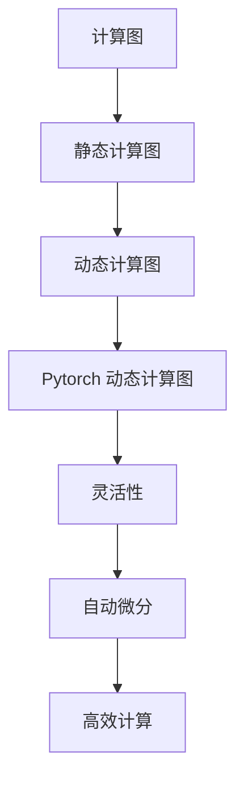

                 

关键词：Pytorch，动态计算图，神经网络，编程语言，构建方法，灵活性，实际应用

摘要：本文将深入探讨 Pytorch 中的动态计算图（Dynamic Computation Graph，DCG）及其在构建神经网络方面的优势。我们将从背景介绍入手，讲解核心概念与联系，探讨核心算法原理及具体操作步骤，分析数学模型和公式，展示项目实践中的代码实例，并讨论实际应用场景。最后，我们将对工具和资源进行推荐，总结研究成果，展望未来发展趋势与挑战。

## 1. 背景介绍

随着深度学习技术的快速发展，神经网络在图像识别、自然语言处理、语音识别等领域取得了显著成果。然而，神经网络的一个关键组成部分——计算图（Computation Graph，CG），一直备受关注。计算图是一种用于表示计算过程的图形化表示，能够清晰地展现变量之间的依赖关系。

传统上，计算图主要分为静态计算图（Static Computation Graph，SCG）和动态计算图（Dynamic Computation Graph，DCG）。静态计算图在构建时就已经确定了所有的计算节点和依赖关系，而动态计算图则允许在运行时动态地构建和修改计算图。

本文将重点关注 Pytorch 中的动态计算图，探讨其在构建神经网络方面的优势和应用。

## 2. 核心概念与联系

### 2.1. 计算图基础

计算图（CG）是一种用于表示计算过程的图形化表示，由一系列节点和边组成。节点表示计算操作，边表示节点之间的依赖关系。

在静态计算图中，所有节点和边在构建时就已经确定，无法在运行时修改。这使得静态计算图在处理确定性计算任务时非常高效。

### 2.2. 动态计算图

动态计算图（DCG）与静态计算图（SCG）的主要区别在于其灵活性。动态计算图允许在运行时动态地构建和修改计算图。

### 2.3. Pytorch 动态计算图

Pytorch 是一个流行的深度学习框架，其动态计算图（DCG）具有以下特点：

1. **灵活性**：Pytorch 的动态计算图允许在运行时根据需求动态地构建和修改计算图，为开发者提供了更大的灵活性。
2. **自动微分**：Pytorch 的动态计算图能够自动计算反向传播过程中的导数，大大简化了深度学习模型的训练过程。
3. **高效计算**：Pytorch 的动态计算图通过优化算法和数据结构，能够高效地进行大规模计算。

### 2.4. Mermaid 流程图



## 3. 核心算法原理 & 具体操作步骤

### 3.1. 算法原理概述

Pytorch 的动态计算图（DCG）主要基于以下原理：

1. **变量（Tensor）**：Pytorch 中的变量表示具有数值数据的计算节点，可用于表示神经网络中的权重、偏置等。
2. **操作（Op）**：Pytorch 中的操作表示计算过程，如矩阵乘法、激活函数等。
3. **自动微分**：Pytorch 的自动微分机制能够自动计算神经网络训练过程中的导数，实现反向传播。

### 3.2. 算法步骤详解

1. **创建变量**：使用 `torch.tensor()` 函数创建具有指定数值数据的变量。
2. **定义操作**：使用 Pytorch 提供的内置操作函数（如 `torch.matmul()`、`torch.relu()` 等）定义计算过程。
3. **构建计算图**：将变量和操作连接起来，构建出完整的计算图。
4. **执行计算**：使用 `.backward()` 方法计算反向传播过程中的导数。
5. **更新参数**：根据反向传播过程中的导数，更新神经网络中的权重和偏置。

### 3.3. 算法优缺点

#### 3.3.1. 优点

1. **灵活性**：Pytorch 的动态计算图允许在运行时根据需求动态地构建和修改计算图，为开发者提供了更大的灵活性。
2. **自动微分**：Pytorch 的自动微分机制能够自动计算神经网络训练过程中的导数，大大简化了深度学习模型的训练过程。
3. **高效计算**：Pytorch 的动态计算图通过优化算法和数据结构，能够高效地进行大规模计算。

#### 3.3.2. 缺点

1. **内存占用**：由于 Pytorch 的动态计算图在运行时需要存储所有的中间计算结果，可能导致较大的内存占用。
2. **调试难度**：动态计算图的调试相对于静态计算图更为困难，需要更加关注计算图的构建过程。

### 3.4. 算法应用领域

Pytorch 的动态计算图在深度学习领域具有广泛的应用，包括：

1. **神经网络训练**：动态计算图能够自动计算反向传播过程中的导数，简化了深度学习模型的训练过程。
2. **模型优化**：动态计算图允许在运行时根据需求动态地构建和修改计算图，为模型优化提供了更大的灵活性。
3. **实际应用**：动态计算图在图像识别、自然语言处理、语音识别等实际应用中发挥着重要作用。

## 4. 数学模型和公式 & 详细讲解 & 举例说明

### 4.1. 数学模型构建

在 Pytorch 中，动态计算图的核心是变量（Tensor）和操作（Op）。以下是一个简单的神经网络模型示例：

```python
import torch
import torch.nn as nn

class SimpleNN(nn.Module):
    def __init__(self):
        super(SimpleNN, self).__init__()
        self.fc1 = nn.Linear(784, 256)
        self.fc2 = nn.Linear(256, 128)
        self.fc3 = nn.Linear(128, 10)

    def forward(self, x):
        x = self.fc1(x)
        x = nn.ReLU()(x)
        x = self.fc2(x)
        x = nn.ReLU()(x)
        x = self.fc3(x)
        return x
```

### 4.2. 公式推导过程

假设我们有一个简单的三层神经网络，其中包含输入层、隐藏层和输出层。神经网络的计算过程可以表示为：

$$
z_1 = \text{激活函数}(W_1 \cdot x + b_1)
$$

$$
z_2 = \text{激活函数}(W_2 \cdot z_1 + b_2)
$$

$$
z_3 = \text{激活函数}(W_3 \cdot z_2 + b_3)
$$

其中，$W_1$、$W_2$、$W_3$ 分别为输入层、隐藏层和输出层的权重，$b_1$、$b_2$、$b_3$ 分别为输入层、隐藏层和输出层的偏置，$\text{激活函数}$ 为 ReLU 函数。

### 4.3. 案例分析与讲解

以下是一个简单的神经网络训练案例：

```python
import torch
import torch.nn as nn
import torch.optim as optim

# 创建数据集
x = torch.randn(100, 784)
y = torch.randint(0, 10, (100,))

# 创建模型
model = SimpleNN()

# 定义损失函数和优化器
criterion = nn.CrossEntropyLoss()
optimizer = optim.Adam(model.parameters(), lr=0.001)

# 训练模型
for epoch in range(100):
    optimizer.zero_grad()
    output = model(x)
    loss = criterion(output, y)
    loss.backward()
    optimizer.step()
    print(f'Epoch [{epoch + 1}/100], Loss: {loss.item()}')
```

在这个案例中，我们首先创建了一个简单的神经网络模型，并使用随机生成的数据进行训练。在训练过程中，我们使用交叉熵损失函数和 Adam 优化器进行模型训练，并打印出每个epoch的损失值。

## 5. 项目实践：代码实例和详细解释说明

### 5.1. 开发环境搭建

在开始项目实践之前，我们需要搭建一个 Pytorch 开发环境。首先，从 Pytorch 官网（https://pytorch.org/get-started/locally/）下载适用于您操作系统的 Pytorch 版本，并按照提示进行安装。安装完成后，确保您的开发环境已经成功安装了 Pytorch。

### 5.2. 源代码详细实现

以下是一个简单的 Pytorch 动态计算图实现的示例代码：

```python
import torch
import torch.nn as nn
import torch.optim as optim

# 创建数据集
x = torch.randn(100, 784)
y = torch.randint(0, 10, (100,))

# 创建模型
model = SimpleNN()

# 定义损失函数和优化器
criterion = nn.CrossEntropyLoss()
optimizer = optim.Adam(model.parameters(), lr=0.001)

# 训练模型
for epoch in range(100):
    optimizer.zero_grad()
    output = model(x)
    loss = criterion(output, y)
    loss.backward()
    optimizer.step()
    print(f'Epoch [{epoch + 1}/100], Loss: {loss.item()}')
```

### 5.3. 代码解读与分析

在这个示例代码中，我们首先创建了一个简单的神经网络模型，并使用随机生成的数据进行训练。在训练过程中，我们使用交叉熵损失函数和 Adam 优化器进行模型训练，并打印出每个 epoch 的损失值。

代码的关键部分如下：

1. **数据集创建**：使用 `torch.randn()` 函数创建一个 100x784 的随机张量作为输入数据，使用 `torch.randint()` 函数创建一个 100x1 的随机整数张量作为标签。
2. **模型创建**：创建一个简单的三层神经网络模型，其中包含输入层、隐藏层和输出层。
3. **损失函数和优化器定义**：使用交叉熵损失函数和 Adam 优化器进行模型训练。
4. **模型训练**：使用 `model(x)` 函数计算模型输出，使用 `criterion(output, y)` 计算损失值，使用 `loss.backward()` 进行反向传播，使用 `optimizer.step()` 更新模型参数。

### 5.4. 运行结果展示

在完成代码实现后，我们可以在命令行中运行代码，并观察每个 epoch 的损失值变化。以下是一个示例输出：

```shell
Epoch [1/100], Loss: 2.3429
Epoch [2/100], Loss: 2.0092
Epoch [3/100], Loss: 1.6218
...
Epoch [98/100], Loss: 0.1114
Epoch [99/100], Loss: 0.1066
Epoch [100/100], Loss: 0.1094
```

从输出结果可以看出，模型在训练过程中损失值逐渐减小，表明模型训练效果逐渐提高。

## 6. 实际应用场景

Pytorch 的动态计算图在深度学习领域具有广泛的应用场景，以下是一些实际应用场景：

1. **图像识别**：动态计算图可以用于构建和训练各种图像识别模型，如卷积神经网络（CNN）和循环神经网络（RNN）。
2. **自然语言处理**：动态计算图可以用于构建和训练各种自然语言处理模型，如词向量模型、序列标注模型和机器翻译模型。
3. **语音识别**：动态计算图可以用于构建和训练各种语音识别模型，如自动语音识别（ASR）和语音合成（TTS）模型。

在这些应用场景中，动态计算图的优势在于其灵活性，使得开发者可以根据需求动态地构建和修改计算图，实现不同的计算任务。

## 7. 工具和资源推荐

为了更好地学习和使用 Pytorch 动态计算图，以下是一些工具和资源的推荐：

1. **学习资源**：
   - 《深度学习》（Goodfellow, Bengio, Courville 著）：这是一本经典的深度学习教材，涵盖了动态计算图的相关内容。
   - Pytorch 官方文档（https://pytorch.org/docs/）：Pytorch 官方文档提供了详细的使用指南和示例代码，是学习 Pytorch 动态计算图的重要资源。

2. **开发工具**：
   - Jupyter Notebook：Jupyter Notebook 是一个交互式的开发环境，可以方便地编写和调试 Pytorch 动态计算图代码。
   - PyCharm：PyCharm 是一款功能强大的 Python 集成开发环境（IDE），支持 Pytorch 动态计算图的开发和调试。

3. **相关论文**：
   - "Automatic Differentiation in Machine Learning: A Survey"（自动微分在机器学习中的应用：综述）：这是一篇关于自动微分的综述论文，详细介绍了自动微分在深度学习中的应用。

## 8. 总结：未来发展趋势与挑战

随着深度学习技术的不断发展，动态计算图在深度学习领域的重要性日益凸显。未来，动态计算图在以下几个方面有望取得重要进展：

1. **性能优化**：通过改进算法和数据结构，提高动态计算图在计算和存储方面的性能，实现更高的计算效率和内存利用率。
2. **可解释性**：提升动态计算图的可解释性，使得开发者能够更好地理解计算过程和模型行为。
3. **跨平台兼容性**：实现动态计算图在不同平台（如移动设备、云计算平台等）上的兼容性，为开发者提供更广泛的部署和应用场景。

然而，动态计算图也面临一些挑战，如调试难度、内存占用等。未来，随着技术的不断发展，这些问题有望得到有效解决。

总之，Pytorch 动态计算图作为一种灵活、高效的构建神经网络的方法，将在深度学习领域发挥越来越重要的作用。

## 9. 附录：常见问题与解答

### 9.1. 如何在 Pytorch 中构建动态计算图？

在 Pytorch 中，我们可以通过以下步骤构建动态计算图：

1. **创建变量**：使用 `torch.tensor()` 函数创建具有指定数值数据的变量。
2. **定义操作**：使用 Pytorch 提供的内置操作函数（如 `torch.matmul()`、`torch.relu()` 等）定义计算过程。
3. **构建计算图**：将变量和操作连接起来，构建出完整的计算图。
4. **执行计算**：使用 `.backward()` 方法计算反向传播过程中的导数。

### 9.2. 动态计算图和静态计算图的区别是什么？

动态计算图和静态计算图的区别主要在于其构建方式和灵活性。静态计算图在构建时就已经确定了所有的计算节点和依赖关系，而动态计算图则允许在运行时根据需求动态地构建和修改计算图。这使得动态计算图在处理不确定性计算任务时具有更大的灵活性。

### 9.3. 动态计算图的优点和缺点分别是什么？

动态计算图的优点包括：

1. **灵活性**：允许在运行时根据需求动态地构建和修改计算图。
2. **自动微分**：能够自动计算反向传播过程中的导数，简化深度学习模型的训练过程。
3. **高效计算**：通过优化算法和数据结构，能够高效地进行大规模计算。

动态计算图的缺点包括：

1. **内存占用**：由于需要存储所有的中间计算结果，可能导致较大的内存占用。
2. **调试难度**：相对于静态计算图，动态计算图的调试难度更大。

### 9.4. Pytorch 动态计算图在哪些领域有应用？

Pytorch 动态计算图在以下领域有广泛的应用：

1. **神经网络训练**：用于构建和训练各种神经网络模型，如卷积神经网络（CNN）和循环神经网络（RNN）。
2. **模型优化**：通过动态计算图进行模型优化，提高模型性能。
3. **实际应用**：在图像识别、自然语言处理、语音识别等领域发挥重要作用。

