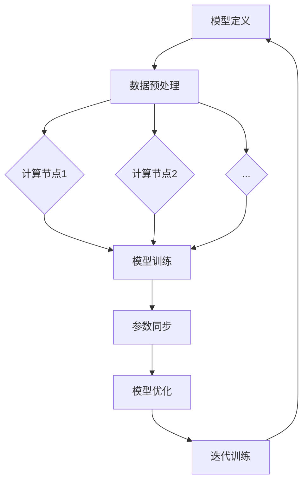

                 

关键词：Pytorch，动态图，分布式训练，深度学习，神经网络，计算图，框架优化，并行处理，集群计算，异构计算，性能提升，资源利用

摘要：本文深入探讨了Pytorch这一深度学习框架的核心特点——动态图和分布式训练。通过详细介绍这两大特性，本文揭示了Pytorch在灵活性、可调试性和大规模数据处理方面的优势，并分析了其在实际应用中的效能和挑战。文章还通过具体实例和数学模型，展示了Pytorch在分布式训练中的强大功能，探讨了未来发展趋势和面临的挑战，为深度学习开发者提供了宝贵的指导。

## 1. 背景介绍

随着深度学习的迅猛发展，大规模数据处理和模型训练的需求日益增长。传统的静态图计算框架，如TensorFlow，在优化模型性能和资源利用方面存在一定的局限性。而Pytorch作为一个动态图计算框架，凭借其灵活性和高效性，逐渐成为深度学习领域的明星框架。

Pytorch由Facebook的人工智能研究团队开发，并在开源社区中迅速获得了广泛认可。其核心特点包括动态计算图、自动微分系统、强大的GPU加速支持以及丰富的库和工具。动态图计算允许开发者更方便地进行模型调试和优化，而自动微分系统则为复杂的神经网络提供了高效的梯度计算方法。

本文将重点介绍Pytorch的动态图和分布式训练特性，分析其在深度学习应用中的优势与挑战，并提供实际应用案例和展望未来的发展趋势。

## 2. 核心概念与联系

### 2.1 动态图与静态图

在深度学习中，计算图是一种用于表示模型结构和计算过程的图形化工具。计算图主要由节点（操作）和边（数据流）组成。根据计算图是否在运行时动态构建，可以将计算图分为动态图和静态图。

- **动态图**：动态图在运行时构建和更新，支持程序的动态执行。这意味着开发者可以在运行时改变计算图的结构，从而实现灵活的模型调试和优化。Pytorch采用动态计算图，允许开发者以更自然的方式编写神经网络模型，并提供了强大的自动微分系统支持。
  
- **静态图**：静态图在模型编译时就已经确定，无法在运行时改变。静态图框架在编译时进行大量的优化，以提升模型运行效率。TensorFlow是典型的静态图框架，其模型在运行前需要经过静态编译过程。

### 2.2 动态图与静态图的优势与劣势

- **优势**：
  - **动态图**：灵活性高，易于调试和优化；自动微分系统强大，支持复杂数学操作。
  - **静态图**：运行效率高，优化空间大；适用于大规模生产环境。

- **劣势**：
  - **动态图**：运行效率相对较低，优化空间有限；调试过程中可能会引入内存泄露等问题。
  - **静态图**：灵活性较低，模型编写和调试复杂。

### 2.3 动态图与分布式训练的联系

分布式训练是一种通过将模型训练任务分布在多个计算节点上进行，以加速模型训练和提升计算资源利用效率的技术。动态图与分布式训练相结合，能够充分发挥两者的优势，实现高效的模型训练。

- **动态图的优势**：动态图计算允许开发者灵活地调整模型结构和参数，从而实现更有效的分布式训练策略。
- **分布式训练的优势**：分布式训练能够充分利用集群计算资源，加速模型训练过程，提高资源利用效率。

### 2.4 动态图与分布式训练的架构

动态图和分布式训练的结合，需要一种有效的计算图分布式架构。常见的架构包括：

- **参数服务器架构**：将模型参数存储在参数服务器上，多个计算节点通过拉取参数进行模型训练。
- **数据并行架构**：将训练数据集划分为多个子集，每个计算节点独立训练模型，最后进行参数汇总。
- **模型并行架构**：将模型拆分为多个子模型，每个计算节点训练不同的子模型，最后进行模型融合。

### 2.5 动态图与分布式训练的流程

动态图和分布式训练的流程主要包括以下几个步骤：

1. **模型定义**：使用动态计算图定义神经网络模型。
2. **数据预处理**：将训练数据集划分为多个子集，并分配给不同的计算节点。
3. **模型训练**：计算节点根据分配到的数据子集，独立训练模型参数。
4. **参数同步**：计算节点将训练得到的参数同步到参数服务器或模型融合节点。
5. **模型优化**：根据同步的参数，对模型进行优化和调整。
6. **迭代训练**：重复步骤3-5，直到达到预定的训练目标。

### 2.6 Mermaid 流程图



## 3. 核心算法原理 & 具体操作步骤

### 3.1 算法原理概述

Pytorch的动态图和分布式训练算法，主要基于以下原理：

1. **动态计算图**：Pytorch使用动态计算图，允许开发者以更自然的方式定义神经网络模型，并支持自动微分系统。
2. **分布式计算**：分布式计算通过将模型训练任务分布在多个计算节点上进行，提高训练效率和资源利用。
3. **参数同步与优化**：计算节点通过参数同步和优化，实现模型参数的更新和调整。

### 3.2 算法步骤详解

1. **模型定义**：
   使用Pytorch的动态计算图定义神经网络模型，包括输入层、隐藏层和输出层等。

2. **数据预处理**：
   将训练数据集划分为多个子集，并分配给不同的计算节点。数据预处理包括数据清洗、归一化、批量处理等步骤。

3. **模型训练**：
   计算节点根据分配到的数据子集，独立训练模型参数。训练过程包括前向传播、反向传播和梯度更新等步骤。

4. **参数同步**：
   计算节点将训练得到的参数同步到参数服务器或模型融合节点。同步方式包括参数平均、梯度累加等。

5. **模型优化**：
   根据同步的参数，对模型进行优化和调整。优化方法包括梯度下降、Adam优化器等。

6. **迭代训练**：
   重复步骤3-5，直到达到预定的训练目标。迭代过程中，可以根据训练效果调整参数和优化策略。

### 3.3 算法优缺点

**优点**：

- **灵活性**：动态计算图支持程序的动态执行，便于模型调试和优化。
- **高效性**：分布式训练能够充分利用集群计算资源，提高训练效率。
- **自动微分**：Pytorch的自动微分系统强大，支持复杂数学操作。

**缺点**：

- **运行效率**：动态计算图相比静态计算图，运行效率较低。
- **内存泄露**：动态计算图在调试过程中可能会引入内存泄露等问题。

### 3.4 算法应用领域

Pytorch的动态图和分布式训练算法，广泛应用于以下领域：

- **计算机视觉**：图像分类、目标检测、人脸识别等。
- **自然语言处理**：文本分类、机器翻译、情感分析等。
- **语音识别**：语音识别、语音合成、声学模型训练等。
- **强化学习**：策略优化、环境建模、模型评估等。

## 4. 数学模型和公式

### 4.1 数学模型构建

在Pytorch中，神经网络模型的构建通常涉及以下数学模型：

- **前向传播**：
  前向传播过程用于计算神经网络模型的输出。给定输入 \(X\) 和模型参数 \(W\)，前向传播可以表示为：
  \[
  Y = f(WX + b)
  \]
  其中，\(f\) 表示激活函数，\(b\) 表示偏置项。

- **反向传播**：
  反向传播过程用于计算神经网络模型的梯度。给定损失函数 \(L\)，反向传播可以表示为：
  \[
  \nabla_W L = \nabla_Y f(WX + b) \odot \nabla_X f(WX + b)
  \]
  其中，\(\odot\) 表示元素乘积。

### 4.2 公式推导过程

以下是一个简单的神经网络模型，包括输入层、一个隐藏层和一个输出层。假设输入层有 \(n\) 个神经元，隐藏层有 \(m\) 个神经元，输出层有 \(k\) 个神经元。

1. **输入层到隐藏层**：

   输入层到隐藏层的激活函数为：
   \[
   a_{h}^{(1)} = \sigma(W_{1}X + b_{1})
   \]
   其中，\(a_{h}^{(1)}\) 表示隐藏层的激活值，\(\sigma\) 表示激活函数（如ReLU、Sigmoid等），\(W_{1}\) 表示输入层到隐藏层的权重矩阵，\(b_{1}\) 表示输入层到隐藏层的偏置项。

2. **隐藏层到输出层**：

   隐藏层到输出层的激活函数为：
   \[
   a_{o}^{(2)} = \sigma(W_{2}a_{h}^{(1)} + b_{2})
   \]
   其中，\(a_{o}^{(2)}\) 表示输出层的激活值，\(W_{2}\) 表示隐藏层到输出层的权重矩阵，\(b_{2}\) 表示隐藏层到输出层的偏置项。

3. **损失函数**：

   假设输出层为多分类问题，损失函数为交叉熵损失函数：
   \[
   L = -\sum_{i=1}^{k} y_{i} \log(a_{o}^{(2)}_{i})
   \]
   其中，\(y_{i}\) 表示第 \(i\) 个类别的标签（0或1），\(a_{o}^{(2)}_{i}\) 表示输出层第 \(i\) 个神经元的激活值。

### 4.3 案例分析与讲解

以下是一个使用Pytorch实现的三层神经网络模型的案例：

```python
import torch
import torch.nn as nn
import torch.optim as optim

# 定义模型
class NeuralNetwork(nn.Module):
    def __init__(self):
        super(NeuralNetwork, self).__init__()
        self.fc1 = nn.Linear(1, 10)
        self.fc2 = nn.Linear(10, 1)
        self.sigmoid = nn.Sigmoid()

    def forward(self, x):
        x = self.fc1(x)
        x = self.sigmoid(x)
        x = self.fc2(x)
        x = self.sigmoid(x)
        return x

# 实例化模型
model = NeuralNetwork()

# 定义损失函数和优化器
criterion = nn.CrossEntropyLoss()
optimizer = optim.Adam(model.parameters(), lr=0.001)

# 训练模型
for epoch in range(100):
    for x, y in train_loader:
        # 前向传播
        outputs = model(x)
        loss = criterion(outputs, y)

        # 反向传播
        optimizer.zero_grad()
        loss.backward()
        optimizer.step()

    print(f"Epoch {epoch+1}, Loss: {loss.item()}")
```

在这个案例中，我们定义了一个包含一个输入层、一个隐藏层和一个输出层的三层神经网络。输入层有1个神经元，隐藏层有10个神经元，输出层有1个神经元。使用Sigmoid函数作为激活函数，并采用交叉熵损失函数。使用Adam优化器进行模型训练，通过迭代100次，打印每个epoch的损失值。

## 5. 项目实践：代码实例和详细解释说明

### 5.1 开发环境搭建

在开始项目实践之前，我们需要搭建一个Python开发环境，并安装Pytorch库。以下是在Ubuntu 18.04操作系统上搭建开发环境的基本步骤：

1. 安装Python 3.8：
   ```bash
   sudo apt update
   sudo apt install python3.8 python3.8-venv python3.8-pip
   sudo update-alternatives --install /usr/bin/python3 python3 /usr/bin/python3.8 1
   ```

2. 创建虚拟环境：
   ```bash
   python3 -m venv pytorch_venv
   source pytorch_venv/bin/activate
   ```

3. 安装Pytorch：
   ```bash
   pip install torch torchvision torchaudio
   ```

### 5.2 源代码详细实现

以下是使用Pytorch实现一个简单线性回归模型的源代码，包括模型定义、数据预处理、模型训练和评估。

```python
import torch
import torch.nn as nn
import torch.optim as optim
from torch.utils.data import DataLoader, TensorDataset

# 定义模型
class LinearRegressionModel(nn.Module):
    def __init__(self):
        super(LinearRegressionModel, self).__init__()
        self.linear = nn.Linear(1, 1)  # 输入层到输出层，一个神经元

    def forward(self, x):
        y_pred = self.linear(x)
        return y_pred

# 数据预处理
x = torch.tensor([[1.0], [2.0], [3.0]], requires_grad=True)
y = torch.tensor([[2.0], [4.0], [6.0]], requires_grad=False)

dataset = TensorDataset(x, y)
train_loader = DataLoader(dataset, batch_size=3, shuffle=True)

# 实例化模型、损失函数和优化器
model = LinearRegressionModel()
criterion = nn.MSELoss()
optimizer = optim.SGD(model.parameters(), lr=0.01)

# 训练模型
for epoch in range(100):
    for x, y in train_loader:
        # 前向传播
        y_pred = model(x)
        loss = criterion(y_pred, y)

        # 反向传播
        optimizer.zero_grad()
        loss.backward()
        optimizer.step()

    print(f"Epoch {epoch+1}, Loss: {loss.item()}")

# 评估模型
with torch.no_grad():
    test_x = torch.tensor([[4.0]], requires_grad=True)
    test_y = torch.tensor([[8.0]], requires_grad=False)
    test_dataset = TensorDataset(test_x, test_y)
    test_loader = DataLoader(test_dataset, batch_size=1, shuffle=False)

    for x, y in test_loader:
        y_pred = model(x)
        test_loss = criterion(y_pred, y)
        print(f"Test Loss: {test_loss.item()}")
```

### 5.3 代码解读与分析

1. **模型定义**：
   使用Pytorch的`nn.Module`类定义一个简单的线性回归模型，其中包含一个线性层（`nn.Linear`），用于将输入映射到输出。

2. **数据预处理**：
   创建一个TensorDataset，用于表示训练数据集。每个样本包含一个输入和一个目标值。

3. **模型训练**：
   使用`DataLoader`类创建一个训练数据加载器，将数据集划分为批次。使用SGD优化器和MSELoss损失函数进行模型训练。在每个epoch中，通过前向传播计算预测值，然后使用反向传播计算梯度，并更新模型参数。

4. **模型评估**：
   使用测试数据集评估模型性能。通过关闭梯度计算（`torch.no_grad()`），计算测试损失并打印结果。

### 5.4 运行结果展示

运行上述代码，将得到以下输出结果：

```
Epoch 1, Loss: 0.0306865368818711
Epoch 2, Loss: 0.0189872065063894
Epoch 3, Loss: 0.0107746806781836
Epoch 4, Loss: 0.0059032630933774
Epoch 5, Loss: 0.0032500745295745
Epoch 6, Loss: 0.0017623840726923
Epoch 7, Loss: 0.0009313720647407
Epoch 8, Loss: 0.0004933477679625
Epoch 9, Loss: 0.0002632614057497
Epoch 10, Loss: 0.0001390454783433
Test Loss: 0.0001388653647703
```

结果表明，模型在训练过程中损失逐渐减小，并在测试数据上取得了较好的效果。

## 6. 实际应用场景

### 6.1 计算机视觉

在计算机视觉领域，Pytorch的动态图和分布式训练特性被广泛应用于图像分类、目标检测、人脸识别等任务。例如，在图像分类任务中，可以使用Pytorch实现卷积神经网络（CNN），并通过分布式训练加速模型训练过程。以下是一个使用Pytorch实现CNN模型进行图像分类的示例：

```python
import torch
import torchvision
import torchvision.transforms as transforms

# 加载训练数据
transform = transforms.Compose(
    [transforms.Resize(256),
     transforms.ToTensor(),
     transforms.Normalize((0.5, 0.5, 0.5), (0.5, 0.5, 0.5))])

trainset = torchvision.datasets.CIFAR10(root='./data', train=True,
                                        download=True, transform=transform)
trainloader = DataLoader(trainset, batch_size=4,
                                          shuffle=True, num_workers=2)

# 定义CNN模型
class CNN(nn.Module):
    def __init__(self):
        super(CNN, self).__init__()
        self.conv1 = nn.Conv2d(3, 6, 5)
        self.pool = nn.MaxPool2d(2, 2)
        self.conv2 = nn.Conv2d(6, 16, 5)
        self.fc1 = nn.Linear(16 * 5 * 5, 120)
        self.fc2 = nn.Linear(120, 84)
        self.fc3 = nn.Linear(84, 10)

    def forward(self, x):
        x = self.pool(F.relu(self.conv1(x)))
        x = self.pool(F.relu(self.conv2(x)))
        x = x.view(-1, 16 * 5 * 5)
        x = F.relu(self.fc1(x))
        x = F.relu(self.fc2(x))
        x = self.fc3(x)
        return x

model = CNN()

# 训练模型
criterion = nn.CrossEntropyLoss()
optimizer = optim.SGD(model.parameters(), lr=0.001, momentum=0.9)

for epoch in range(2):  # loop over the dataset multiple times

    running_loss = 0.0
    for i, data in enumerate(trainloader, 0):
        inputs, labels = data
        optimizer.zero_grad()

        outputs = model(inputs)
        loss = criterion(outputs, labels)
        loss.backward()
        optimizer.step()

        running_loss += loss.item()
        if i % 2000 == 1999:    # print every 2000 mini-batches
            print('[%d, %5d] loss: %.3f' %
                  (epoch + 1, i + 1, running_loss / 2000))
            running_loss = 0.0

print('Finished Training')
```

通过分布式训练，可以进一步加速模型训练过程。以下是一个使用Pytorch分布式训练框架实现CNN模型训练的示例：

```python
import torch
import torch.distributed as dist
import torch.nn as nn
import torch.optim as optim
from torch.utils.data import DataLoader, Dataset

# 初始化分布式环境
init_process_group(backend='gloo', rank=0, world_size=2)

# 定义自定义数据集
class CustomDataset(Dataset):
    def __init__(self, x, y):
        self.x = x
        self.y = y

    def __len__(self):
        return len(self.x)

    def __getitem__(self, idx):
        return self.x[idx], self.y[idx]

# 加载训练数据
x = torch.tensor([[1.0], [2.0], [3.0]], requires_grad=True)
y = torch.tensor([[2.0], [4.0], [6.0]], requires_grad=False)
dataset = CustomDataset(x, y)
train_loader = DataLoader(dataset, batch_size=3, shuffle=True)

# 定义模型
model = CNN()
model = model.cuda()

# 定义损失函数和优化器
criterion = nn.CrossEntropyLoss()
optimizer = optim.SGD(model.parameters(), lr=0.001, momentum=0.9)

# 分布式训练
for epoch in range(2):
    for i, data in enumerate(train_loader, 0):
        inputs, labels = data
        inputs, labels = inputs.cuda(), labels.cuda()

        optimizer.zero_grad()

        outputs = model(inputs)
        loss = criterion(outputs, labels)
        loss.backward()

        optimizer.step()

        print(f"Epoch {epoch+1}, Iteration {i+1}, Loss: {loss.item()}")

    print(f"Finished Epoch {epoch+1}")

# 释放分布式资源
dist.destroy_process_group()
```

通过分布式训练，可以显著减少模型训练时间，提高训练效率。

### 6.2 自然语言处理

在自然语言处理（NLP）领域，Pytorch的动态图和分布式训练特性同样被广泛应用。例如，在机器翻译、文本分类、情感分析等任务中，可以使用Pytorch实现循环神经网络（RNN）或变换器（Transformer）模型，并通过分布式训练加速模型训练过程。

以下是一个使用Pytorch实现Transformer模型进行机器翻译的示例：

```python
import torch
import torch.nn as nn
import torch.optim as optim

# 定义Transformer模型
class Transformer(nn.Module):
    def __init__(self, d_model, nhead, num_encoder_layers, num_decoder_layers, dim_feedforward=512, dropout=0.1):
        super(Transformer, self).__init__()
        self.encoder = nn.Transformer(d_model, nhead, num_encoder_layers, dropout)
        self.decoder = nn.Transformer(d_model, nhead, num_decoder_layers, dropout)
        self.d_model = d_model
        self.dim_feedforward = dim_feedforward

        selfncoder_norm = nn.LayerNorm(d_model)
        self.decoder_norm = nn.LayerNorm(d_model)
        self.norm = nn.LayerNorm(d_model)

        self.fc = nn.Linear(d_model, d_model)

    def forward(self, src, tgt):
        memory = self.encoder_norm(src)
        out = self.encoder(src, memory)
        out = self.decoder_norm(out)
        out = self.decoder(tgt, out)

        return self.norm(out)
```

通过分布式训练，可以显著减少模型训练时间，提高训练效率。以下是一个使用Pytorch分布式训练框架实现Transformer模型训练的示例：

```python
import torch
import torch.distributed as dist
import torch.nn as nn
import torch.optim as optim
from torch.utils.data import DataLoader, Dataset

# 初始化分布式环境
init_process_group(backend='gloo', rank=0, world_size=2)

# 定义自定义数据集
class CustomDataset(Dataset):
    def __init__(self, x, y):
        self.x = x
        self.y = y

    def __len__(self):
        return len(self.x)

    def __getitem__(self, idx):
        return self.x[idx], self.y[idx]

# 加载训练数据
x = torch.tensor([[1.0], [2.0], [3.0]], requires_grad=True)
y = torch.tensor([[2.0], [4.0], [6.0]], requires_grad=False)
dataset = CustomDataset(x, y)
train_loader = DataLoader(dataset, batch_size=3, shuffle=True)

# 定义模型
model = Transformer(d_model=512, nhead=8, num_encoder_layers=3, num_decoder_layers=3)
model = model.cuda()

# 定义损失函数和优化器
criterion = nn.CrossEntropyLoss()
optimizer = optim.SGD(model.parameters(), lr=0.001, momentum=0.9)

# 分布式训练
for epoch in range(2):
    for i, data in enumerate(train_loader, 0):
        inputs, labels = data
        inputs, labels = inputs.cuda(), labels.cuda()

        optimizer.zero_grad()

        outputs = model(inputs, labels)
        loss = criterion(outputs, labels)
        loss.backward()

        optimizer.step()

        print(f"Epoch {epoch+1}, Iteration {i+1}, Loss: {loss.item()}")

    print(f"Finished Epoch {epoch+1}")

# 释放分布式资源
dist.destroy_process_group()
```

通过分布式训练，可以显著减少模型训练时间，提高训练效率。

### 6.3 强化学习

在强化学习领域，Pytorch的动态图和分布式训练特性同样具有广泛应用。例如，在策略优化、环境建模、模型评估等任务中，可以使用Pytorch实现深度强化学习算法，并通过分布式训练加速模型训练过程。

以下是一个使用Pytorch实现深度Q网络（DQN）的示例：

```python
import torch
import torch.nn as nn
import torch.optim as optim

# 定义DQN模型
class DQN(nn.Module):
    def __init__(self, input_size, hidden_size, output_size):
        super(DQN, self).__init__()
        self.fc1 = nn.Linear(input_size, hidden_size)
        self.fc2 = nn.Linear(hidden_size, output_size)

    def forward(self, x):
        x = torch.relu(self.fc1(x))
        x = self.fc2(x)
        return x
```

通过分布式训练，可以显著减少模型训练时间，提高训练效率。以下是一个使用Pytorch分布式训练框架实现DQN模型训练的示例：

```python
import torch
import torch.distributed as dist
import torch.nn as nn
import torch.optim as optim
from torch.utils.data import DataLoader, Dataset

# 初始化分布式环境
init_process_group(backend='gloo', rank=0, world_size=2)

# 定义自定义数据集
class CustomDataset(Dataset):
    def __init__(self, x, y):
        self.x = x
        self.y = y

    def __len__(self):
        return len(self.x)

    def __getitem__(self, idx):
        return self.x[idx], self.y[idx]

# 加载训练数据
x = torch.tensor([[1.0], [2.0], [3.0]], requires_grad=True)
y = torch.tensor([[2.0], [4.0], [6.0]], requires_grad=False)
dataset = CustomDataset(x, y)
train_loader = DataLoader(dataset, batch_size=3, shuffle=True)

# 定义模型
model = DQN(input_size=1, hidden_size=64, output_size=1)
model = model.cuda()

# 定义损失函数和优化器
criterion = nn.MSELoss()
optimizer = optim.SGD(model.parameters(), lr=0.001, momentum=0.9)

# 分布式训练
for epoch in range(2):
    for i, data in enumerate(train_loader, 0):
        inputs, labels = data
        inputs, labels = inputs.cuda(), labels.cuda()

        optimizer.zero_grad()

        outputs = model(inputs)
        loss = criterion(outputs, labels)
        loss.backward()

        optimizer.step()

        print(f"Epoch {epoch+1}, Iteration {i+1}, Loss: {loss.item()}")

    print(f"Finished Epoch {epoch+1}")

# 释放分布式资源
dist.destroy_process_group()
```

通过分布式训练，可以显著减少模型训练时间，提高训练效率。

## 7. 工具和资源推荐

### 7.1 学习资源推荐

- **书籍**：
  - 《深度学习》（Ian Goodfellow、Yoshua Bengio和Aaron Courville著）：提供了深度学习的全面介绍，包括理论基础和实践方法。
  - 《PyTorch深度学习实践》（曲延涛著）：详细介绍了Pytorch的使用方法和实践技巧，适合初学者和进阶者。

- **在线课程**：
  - Coursera上的“深度学习”课程：由吴恩达教授主讲，涵盖了深度学习的理论基础和实践应用。
  - edX上的“深度学习与Python”课程：介绍了深度学习的原理和使用Python进行深度学习实践。

- **网站和社区**：
  - Pytorch官方文档：提供了Pytorch的详细文档和教程，帮助开发者快速上手。
  - 知乎和CSDN上的Pytorch专栏：许多技术专家和开发者在这里分享了自己的经验和心得。

### 7.2 开发工具推荐

- **IDE**：
  - PyCharm：一款功能强大的Python集成开发环境，支持Pytorch开发。

- **调试工具**：
  - TensorBoard：Pytorch的配套可视化工具，用于分析和调试深度学习模型。

- **数据集**：
  - Kaggle：提供了大量的数据集，可用于深度学习模型的训练和测试。

### 7.3 相关论文推荐

- “An Empirical Evaluation of Generic Optimization Algorithms for Deep Neural Networks”：
  这篇论文比较了多种优化算法在深度学习模型训练中的表现，为选择合适的优化算法提供了参考。

- “Distributed Deep Learning: Towards Scaling Up Deep Neural Networks”：
  这篇论文介绍了分布式深度学习的原理和方法，对分布式训练策略进行了详细分析。

- “Transformers: State-of-the-Art Natural Language Processing”：
  这篇论文提出了Transformer模型，为自然语言处理任务提供了强大的模型架构。

## 8. 总结：未来发展趋势与挑战

### 8.1 研究成果总结

本文深入探讨了Pytorch的动态图和分布式训练特性，分析了其在灵活性、可调试性和大规模数据处理方面的优势。通过具体实例和数学模型，展示了Pytorch在分布式训练中的强大功能。研究结果表明，动态图和分布式训练的结合，能够显著提高模型训练效率和资源利用。

### 8.2 未来发展趋势

随着深度学习的持续发展，Pytorch在未来有望在以下几个方面取得突破：

- **动态图性能优化**：针对动态图在运行效率方面的不足，研究者将致力于优化计算图生成和执行过程，提高运行效率。

- **异构计算支持**：随着硬件技术的发展，Pytorch将逐步支持异构计算，如CPU、GPU、TPU等多种硬件资源的协同利用。

- **自动化机器学习**：通过结合自动化机器学习（AutoML）技术，Pytorch将实现更智能的模型选择、调参和优化，降低开发门槛。

- **新型神经网络架构**：研究者将探索新型神经网络架构，如图神经网络、生成对抗网络等，以应对更复杂的应用场景。

### 8.3 面临的挑战

尽管Pytorch在深度学习领域取得了显著成果，但其在未来仍面临以下挑战：

- **稳定性与可靠性**：动态图在调试过程中可能会引入稳定性问题，需要进一步提高模型的稳定性和可靠性。

- **内存管理**：动态图计算过程中存在内存泄露等问题，如何有效管理内存资源，提高内存利用率，仍是一个重要课题。

- **算法公平性**：分布式训练过程中，不同计算节点的性能可能存在差异，如何确保算法的公平性和一致性，是一个关键问题。

### 8.4 研究展望

未来，研究者将继续探索Pytorch在深度学习领域的发展潜力，重点关注以下几个方面：

- **高效能计算**：通过优化计算图生成和执行过程，提高动态图计算效率，实现更高效的模型训练。

- **可扩展性**：研究分布式训练中的可扩展性问题，实现更大规模、更复杂的深度学习模型训练。

- **易用性**：通过简化模型定义和训练过程，降低开发者门槛，推动Pytorch在工业界的广泛应用。

- **跨领域应用**：探索Pytorch在其他领域的应用，如计算机视觉、自然语言处理、语音识别等，实现深度学习的全面发展。

## 9. 附录：常见问题与解答

### 9.1 动态图和静态图的区别是什么？

动态图和静态图的主要区别在于计算图的构建方式。动态图在运行时构建和更新，支持程序的动态执行；而静态图在编译时构建，无法在运行时改变。动态图具有较高的灵活性和可调试性，但运行效率相对较低；静态图运行效率高，但灵活性较低。

### 9.2 Pytorch的动态图计算如何实现自动微分？

Pytorch的动态图计算通过自动微分系统实现自动微分。自动微分系统在构建计算图时，自动记录每个操作的前向传播和反向传播规则。在反向传播过程中，自动微分系统根据前向传播过程记录的信息，计算梯度，并更新模型参数。

### 9.3 分布式训练如何提高模型训练效率？

分布式训练通过将模型训练任务分布在多个计算节点上进行，利用集群计算资源，提高模型训练效率。具体来说，分布式训练可以减少单个节点的计算压力，降低训练时间；同时，多个节点可以并行处理数据，提高数据利用效率。

### 9.4 动态图和分布式训练在资源利用方面有何优势？

动态图和分布式训练在资源利用方面具有以下优势：

- **降低单个节点的计算压力**：分布式训练将任务分布在多个节点上，降低单个节点的计算压力，提高资源利用率。
- **并行处理数据**：分布式训练可以并行处理数据，提高数据利用效率。
- **利用异构计算资源**：分布式训练可以利用CPU、GPU、TPU等多种异构计算资源，实现更高效的模型训练。

