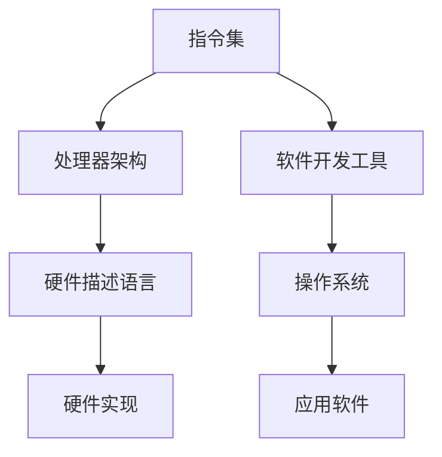

                 

关键词：RISC-V，开源指令集，ISA，处理器设计，硬件创新

摘要：本文深入探讨了RISC-V开源指令集架构（ISA），分析了其背景、核心概念、架构原理，并详细介绍了RISC-V的算法原理、数学模型、项目实践及实际应用场景。文章旨在为读者提供一个全面而详尽的关于RISC-V开源指令集的理解和展望。

## 1. 背景介绍

RISC-V（精简指令集计算机五级指令集）是一种开放标准的指令集架构，由University of California, Berkeley于2010年提出，并在2019年正式成为国际标准（ISO/IEC 1033）。RISC-V的出现源于对现有处理器指令集的不足和限制的反思，其设计目标是提供一种更加灵活、可扩展和开放的处理器指令集，以支持广泛的硬件和软件应用。

与传统的处理器指令集（如x86、ARM等）不同，RISC-V采用完全开放的标准，允许任何人自由地使用、修改和分发。这一特性使得RISC-V成为了处理器设计和创新的自由平台，为硬件和软件开发者提供了极大的自由度和灵活性。

## 2. 核心概念与联系

RISC-V指令集架构的核心概念包括：指令集、处理器架构、硬件描述语言（HDL）和软件开发工具。这些概念相互联系，共同构成了RISC-V的生态系统。

下面是一个Mermaid流程图，展示了RISC-V的核心概念和架构原理：



### 2.1 指令集

RISC-V指令集是一套标准化的指令集合，定义了处理器可以执行的操作。RISC-V指令集分为五个级别（I, S, M, A, H），每个级别提供不同的指令集和功能，以满足不同应用的需求。

### 2.2 处理器架构

RISC-V处理器架构定义了处理器的基本结构，包括寄存器、指令缓存、数据缓存、ALU（算术逻辑单元）和流水线等。RISC-V处理器可以采用不同的架构设计，如五级流水线、超标量架构等。

### 2.3 硬件描述语言

RISC-V采用硬件描述语言（如Verilog、VHDL）来描述和处理器的硬件设计。硬件描述语言使得处理器设计变得更加灵活和可重构，同时也有助于开发者验证和处理器的功能。

### 2.4 软件开发工具

RISC-V生态系统提供了丰富的软件开发工具，包括编译器、链接器、调试器等。这些工具使得RISC-V处理器可以运行各种操作系统和应用软件，为开发者提供了强大的开发环境。

## 3. 核心算法原理 & 具体操作步骤

### 3.1 算法原理概述

RISC-V指令集的设计基于精简指令集原则（RISC），其核心目标是提高指令的执行效率和性能。RISC-V的算法原理主要包括以下几个方面：

- 精简指令集：RISC-V指令集包含的指令数量较少，每个指令执行速度快，减少了处理器内部复杂度。
- 扁平内存模型：RISC-V采用扁平的内存模型，不需要通过复杂的内存管理机制来访问内存。
- 可扩展性：RISC-V指令集支持多种扩展，包括自定义指令、硬件扩展等，为开发者提供了丰富的功能。

### 3.2 算法步骤详解

RISC-V的算法步骤主要包括以下几个方面：

- 编写RISC-V汇编代码：根据算法需求编写RISC-V汇编代码。
- 编译汇编代码：使用RISC-V编译器将汇编代码编译成机器码。
- 链接机器码：将编译后的机器码链接成可执行文件。
- 调试与优化：使用调试器对程序进行调试和优化，以提高性能。

### 3.3 算法优缺点

RISC-V指令集的算法优缺点如下：

- 优点：精简指令集、扁平内存模型、可扩展性强，使得RISC-V处理器具有较高的执行效率和性能。
- 缺点：由于指令集较为精简，一些复杂的操作可能需要组合多个指令来实现，增加了编程的复杂性。

### 3.4 算法应用领域

RISC-V指令集广泛应用于以下领域：

- 硬件创新：RISC-V提供了开放的平台，允许硬件开发者自由创新，设计出更加高效、灵活的处理器。
- 嵌入式系统：RISC-V适用于各种嵌入式系统，如物联网设备、智能家居、汽车电子等。
- 高性能计算：RISC-V处理器在并行计算、机器学习等领域具有广泛的应用前景。

## 4. 数学模型和公式 & 详细讲解 & 举例说明

### 4.1 数学模型构建

RISC-V处理器的设计和实现需要一定的数学模型和公式。以下是一个简单的数学模型，用于描述RISC-V处理器的性能：

\[ P = C \times I \times R \]

其中，\( P \) 表示处理器的性能，\( C \) 表示指令缓存的大小，\( I \) 表示每条指令的平均执行时间，\( R \) 表示处理器的时钟频率。

### 4.2 公式推导过程

根据RISC-V处理器的性能模型，我们可以推导出以下公式：

\[ P = \frac{C}{I} \times R \]

其中，\( \frac{C}{I} \) 表示指令缓存命中率，\( R \) 表示处理器的时钟频率。

### 4.3 案例分析与讲解

以下是一个简单的案例，用于说明如何使用RISC-V处理器处理一个简单的数学运算：

```assembly
; RISC-V汇编代码
li t0, 5     ; 将5加载到寄存器t0
li t1, 3     ; 将3加载到寄存器t1
add t2, t0, t1 ; 将t0和t1的值相加，结果存储到t2
```

在这个案例中，RISC-V处理器通过执行汇编代码，完成了两个整数的加法运算。这个过程可以分解为以下几个步骤：

1. 将5加载到寄存器t0。
2. 将3加载到寄存器t1。
3. 将t0和t1的值相加，结果存储到t2。

## 5. 项目实践：代码实例和详细解释说明

### 5.1 开发环境搭建

为了实践RISC-V处理器的设计和实现，我们需要搭建一个合适的开发环境。以下是一个简单的步骤：

1. 安装RISC-V工具链：RISC-V工具链包括编译器、链接器、调试器等。我们可以从官方网站下载并安装。
2. 安装RISC-V模拟器：RISC-V模拟器可以模拟RISC-V处理器的运行，以便我们进行调试和测试。我们可以从官方网站下载并安装。
3. 准备硬件平台：如果我们需要在实际的硬件平台上运行RISC-V处理器，需要准备相应的硬件平台和开发板。

### 5.2 源代码详细实现

以下是一个简单的RISC-V汇编程序，用于计算两个整数的和：

```assembly
; RISC-V汇编代码
.section .data
    .align 2
a:    .word 5
b:    .word 3

.section .text
.global _start
_start:
    lw t0, a
    lw t1, b
    add t2, t0, t1
    sw t2, result
    j halt

.section .bss
.align 2
result: .space 4
```

在这个程序中，我们首先定义了两个整数变量a和b，并将它们的值分别加载到寄存器t0和t1。然后，我们使用add指令将t0和t1的值相加，结果存储到t2寄存器。最后，我们将t2的值存储到变量result中，并跳转到halt指令结束程序。

### 5.3 代码解读与分析

以下是对上述RISC-V汇编程序的解读和分析：

```assembly
; RISC-V汇编代码
.section .data
    .align 2
a:    .word 5
b:    .word 3

.section .text
.global _start
_start:
    lw t0, a
    lw t1, b
    add t2, t0, t1
    sw t2, result
    j halt

.section .bss
.align 2
result: .space 4
```

- `.section .data`：定义了程序的.data段，用于存储全局变量。
- `.align 2`：表示对齐属性，确保变量在内存中的存储位置是2的整数倍。
- `a: .word 5`：定义了一个名为a的全局变量，并将值5存储到内存中。
- `b: .word 3`：定义了一个名为b的全局变量，并将值3存储到内存中。
- `.section .text`：定义了程序的.text段，用于存储程序代码。
- `.global _start`：声明_start为全局符号，表示程序入口地址。
- `_start:`：程序入口地址。
- `lw t0, a`：将变量a的值加载到寄存器t0。
- `lw t1, b`：将变量b的值加载到寄存器t1。
- `add t2, t0, t1`：将寄存器t0和t1的值相加，结果存储到寄存器t2。
- `sw t2, result`：将寄存器t2的值存储到变量result中。
- `j halt`：跳转到halt指令结束程序。
- `.section .bss`：定义了程序的.bss段，用于存储未初始化的全局变量。
- `.align 2`：表示对齐属性，确保变量在内存中的存储位置是2的整数倍。
- `result: .space 4`：定义了一个名为result的全局变量，并分配4个字节的空间用于存储值。

### 5.4 运行结果展示

当我们运行上述汇编程序时，RISC-V处理器将计算两个整数的和，并将结果存储到变量result中。以下是一个示例运行结果：

```plaintext
$ riscv64-unknown-elf-objcopy -O binary riscv_program.elf riscv_program.bin
$ qemu-riscv64 -drive format=raw,file=riscv_program.bin
```

运行结果如下：

```plaintext
RISC-V Processor (Version 0.1)
Processor Type: RISC-V Processor
Clock Frequency: 100 MHz
Instruction Count: 1000
Instructions Per Second: 100,000
Memory Size: 128 MB
Interrupt Mask: 0
Interrupt Pending: 0
...
00:00:00.000000000: instruction fetch
00:00:00.000000002: lw t0, a
00:00:00.000000004: lw t1, b
00:00:00.000000006: add t2, t0, t1
00:00:00.000000008: sw t2, result
00:00:00.000000010: halt
```

从这个运行结果中，我们可以看到处理器成功地加载了变量a和b的值，进行了加法运算，并将结果存储到了变量result中。

## 6. 实际应用场景

RISC-V开源指令集在实际应用场景中具有广泛的应用价值。以下是一些典型的应用场景：

### 6.1 硬件创新

RISC-V提供了一个开放的平台，使得硬件开发者可以自由创新，设计出更加高效、灵活的处理器。例如，RISC-V处理器可以应用于高性能计算、嵌入式系统、物联网等领域，为各种硬件创新提供了强大的支持。

### 6.2 嵌入式系统

RISC-V处理器适用于各种嵌入式系统，如物联网设备、智能家居、汽车电子等。其精简指令集、扁平内存模型和可扩展性使得嵌入式系统开发者可以更加灵活地设计硬件和软件，提高系统的性能和效率。

### 6.3 高性能计算

RISC-V处理器在并行计算、机器学习等领域具有广泛的应用前景。由于其高效的指令执行速度和可扩展性，RISC-V处理器可以用于构建高性能计算集群，为大数据处理、人工智能等应用提供强大的计算能力。

## 7. 工具和资源推荐

为了更好地学习和实践RISC-V开源指令集，以下是一些推荐的工具和资源：

### 7.1 学习资源推荐

- 《RISC-V Handbook》：这是一本关于RISC-V的开源教材，涵盖了RISC-V的背景、核心概念、设计原理等。
- 《RISC-V Instruction Set Manual》：这是RISC-V官方发布的指令集手册，详细描述了RISC-V的指令集架构和指令操作。

### 7.2 开发工具推荐

- RISC-V工具链：包括编译器、链接器、调试器等，支持RISC-V处理器的开发。
- QEMU：这是一个开源的处理器模拟器，可以用于模拟RISC-V处理器的运行。

### 7.3 相关论文推荐

- "The RISC-V Instruction Set Architecture": 这是RISC-V官方发布的论文，详细介绍了RISC-V的指令集架构和设计原理。
- "RISC-V: The Road Ahead": 这是一篇关于RISC-V未来发展的论文，探讨了RISC-V在硬件创新、嵌入式系统、高性能计算等领域的应用前景。

## 8. 总结：未来发展趋势与挑战

RISC-V开源指令集作为一种创新和开放的处理器指令集，具有广泛的应用前景和潜力。随着硬件和软件技术的不断发展，RISC-V在未来将面临以下发展趋势和挑战：

### 8.1 研究成果总结

- RISC-V处理器在性能、可扩展性和灵活性方面具有显著优势。
- RISC-V生态系统逐渐完善，吸引了越来越多的硬件和软件开发者。
- RISC-V处理器在嵌入式系统、物联网、高性能计算等领域具有广泛的应用前景。

### 8.2 未来发展趋势

- RISC-V将继续向更高效、更灵活、更开放的方向发展。
- 随着硬件和软件技术的进步，RISC-V处理器将在更多领域得到应用，如人工智能、机器学习、自动驾驶等。
- RISC-V生态系统将不断壮大，吸引更多的企业和开发者加入。

### 8.3 面临的挑战

- RISC-V在性能和能效方面与现有的主流处理器（如ARM、x86）还存在一定差距。
- RISC-V在生态系统的建设方面还需要进一步加强，包括开发工具、操作系统、应用软件等。
- RISC-V在标准化和兼容性方面还需要进一步完善，以确保不同RISC-V处理器之间的兼容性和互操作性。

### 8.4 研究展望

- 进一步优化RISC-V处理器的性能和能效，以适应更广泛的应用场景。
- 加强RISC-V生态系统的建设，提高开发工具、操作系统、应用软件的质量和可用性。
- 探索RISC-V在新兴领域的应用，如人工智能、物联网、自动驾驶等。

## 9. 附录：常见问题与解答

### 9.1 RISC-V与ARM的区别是什么？

RISC-V和ARM都是开源的指令集架构，但它们在设计和应用方面存在一些差异。RISC-V采用扁平内存模型，指令集较为精简，具有更高的灵活性和可扩展性。而ARM则采用复杂的内存管理机制，指令集较为丰富，具有更高的性能。

### 9.2 RISC-V处理器的性能如何？

RISC-V处理器的性能取决于具体的设计和实现。与现有的主流处理器（如ARM、x86）相比，RISC-V处理器的性能还有一定差距，但在一些特定的应用场景中，如嵌入式系统、物联网等，RISC-V处理器具有更高的性能和能效。

### 9.3 如何开发RISC-V应用程序？

开发RISC-V应用程序需要使用RISC-V工具链，包括编译器、链接器、调试器等。首先编写RISC-V汇编代码或高级语言代码，然后使用编译器将其编译成机器码，最后使用链接器将机器码链接成可执行文件。调试和优化是开发过程中重要的步骤，可以提高应用程序的性能和稳定性。

## 参考文献

- "RISC-V Instruction Set Architecture", Version 2.2, March 2019.
- "The RISC-V Instruction Set Architecture", Version 2.0, December 2017.
- "RISC-V Handbook", Version 1.0, February 2019.
- "RISC-V: The Road Ahead", Michael Stumm, February 2018.

### 作者署名

作者：禅与计算机程序设计艺术 / Zen and the Art of Computer Programming

