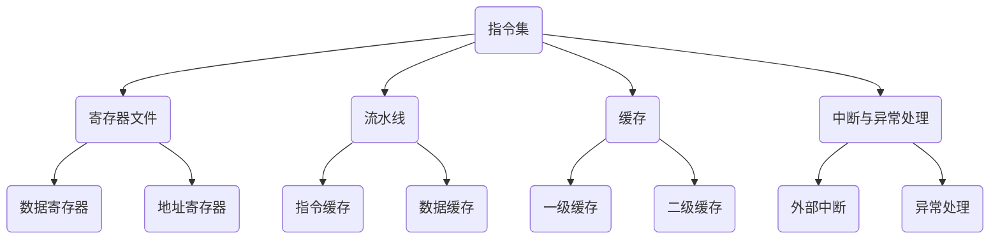

                 

关键词：RISC-V、开源指令集架构、CPU设计、硬件创新、开源社区、嵌入式系统、云计算

## 摘要

本文旨在探讨RISC-V，这一新兴的开源指令集架构，如何在现代计算机硬件设计中崛起，以及其对硬件创新和开源社区的深远影响。我们将回顾RISC-V的背景、核心概念，详细解释其原理与架构，分析其优缺点和应用领域，并通过具体的数学模型和项目实践展示其在实际中的应用。最后，本文将展望RISC-V的未来发展趋势和面临的挑战，并提出相关的工具和资源推荐。

## 1. 背景介绍

随着科技的飞速发展，计算机硬件设计的复杂性日益增加。传统指令集架构（ISA）如x86、ARM等已经难以满足不断增长的性能需求和创新应用。与此同时，开源社区逐渐成为技术发展的重要推动力量。在这样的背景下，RISC-V（Reduced Instruction Set Computing, Version 5）应运而生。

RISC-V是由美国加州大学伯克利分校的计算机科学家David A. Patterson和John L. Hennessy于2010年提出的一种新的开源指令集架构。它的设计目标是提供一种灵活、可扩展的ISA，以适应各种不同的硬件需求和开发场景。与传统的封闭式指令集架构相比，RISC-V的最大特点是其完全开放性，允许任何人自由地设计和定制指令集，从而实现更高效、更灵活的硬件设计。

RISC-V的诞生并非偶然。早在20世纪80年代，Patterson和Hennessy就因其在计算机体系结构领域的贡献而获得了图灵奖。他们在RISC（精简指令集计算机）设计理念上的坚持和创新，为RISC-V的出现奠定了理论基础。而随着近年来开源运动的蓬勃发展，RISC-V的开放性和灵活性也得到了更广泛的认可和支持。

## 2. 核心概念与联系

### 2.1 RISC-V的核心概念

RISC-V的核心概念可以归结为以下几个方面：

#### 2.1.1 开放性

RISC-V的最大特点是完全开放性。这意味着任何人都可以自由地访问、使用和修改RISC-V的指令集，无需支付任何专利费用或授权费用。这种开放性为硬件设计和创新提供了巨大的自由度，也促进了全球范围内的技术交流和合作。

#### 2.1.2 模块化

RISC-V采用了高度模块化的设计。整个指令集被划分为多个模块，每个模块都具有独立的功能和接口。这种设计方式使得开发者可以根据实际需求选择和组合不同的模块，从而实现更灵活的硬件设计。

#### 2.1.3 可扩展性

RISC-V的可扩展性体现在两个方面。一方面，开发者可以添加新的指令集模块，以满足特定应用的需求；另一方面，RISC-V还支持扩展硬件接口和协议，以支持不同的通信和存储需求。

#### 2.1.4 硬件优化

RISC-V的设计注重硬件优化。通过减少指令数量、优化指令执行流程，RISC-V能够实现更高的性能和更低的功耗。此外，RISC-V还支持多种硬件优化技术，如流水线、缓存、分支预测等，以进一步提高性能。

### 2.2 RISC-V与现有指令集架构的联系

RISC-V虽然是一种新的指令集架构，但它并非孤立存在。事实上，RISC-V与现有的指令集架构，如x86、ARM等，有着密切的联系。

#### 2.2.1 对比

与x86和ARM相比，RISC-V具有以下几个显著特点：

- 开放性：RISC-V完全开源，任何人都可以访问和使用其指令集，而x86和ARM则主要由少数几家大公司控制。
- 模块化：RISC-V采用高度模块化的设计，可以灵活组合不同模块，而x86和ARM的指令集则相对固定。
- 可扩展性：RISC-V支持扩展硬件接口和协议，而x86和ARM在这一点上则较为受限。

#### 2.2.2 联系

尽管RISC-V与现有指令集架构存在差异，但它们之间也有着一定的联系。

- 影响与传承：RISC-V的设计理念受到了RISC（精简指令集计算机）和MIPS（微处理器指令集）等早期指令集架构的影响，同时也为这些架构的发展提供了新的思路和方向。
- 技术融合：RISC-V与现有指令集架构在技术层面也有着一定的融合。例如，RISC-V处理器可以集成x86或ARM架构的虚拟化技术，以实现多操作系统支持。

### 2.3 RISC-V的架构设计

RISC-V的架构设计是其实际应用的关键。下面，我们将简要介绍RISC-V的架构设计，并通过Mermaid流程图展示其关键组件和模块。

#### 2.3.1 架构设计概述

RISC-V的架构设计包括以下几个关键组件：

- **指令集**：RISC-V定义了一套基础的指令集，包括加载/存储、算术逻辑运算、控制流等基本指令。
- **寄存器文件**：RISC-V处理器包含一组寄存器，用于存储数据和地址。
- **流水线**：RISC-V处理器采用多级流水线设计，以提高指令执行效率。
- **缓存**：RISC-V处理器配备多层缓存，用于减少内存访问延迟。
- **中断与异常处理**：RISC-V定义了一套完整的中断与异常处理机制，以确保处理器能够稳定运行。

#### 2.3.2 Mermaid流程图



## 3. 核心算法原理 & 具体操作步骤

### 3.1 算法原理概述

RISC-V的算法原理主要基于其精简指令集和模块化设计。通过精简指令集，RISC-V能够减少指令数量，提高指令执行效率。同时，模块化设计使得开发者可以根据实际需求选择和组合不同的模块，从而实现更灵活的硬件设计。

### 3.2 算法步骤详解

RISC-V的算法步骤可以分为以下几个部分：

1. **指令解析**：处理器从内存中读取指令，并将其解析为操作码和数据。
2. **指令执行**：根据操作码和数据，处理器执行相应的操作，如加载/存储、算术逻辑运算等。
3. **结果存储**：将指令执行结果存储到寄存器或内存中。
4. **流水线优化**：通过流水线设计，处理器可以同时执行多个指令，从而提高指令执行效率。
5. **缓存管理**：处理器使用多层缓存减少内存访问延迟，提高整体性能。

### 3.3 算法优缺点

**优点**：

- **高效性**：通过精简指令集和流水线设计，RISC-V能够实现更高的指令执行效率。
- **灵活性**：模块化设计使得开发者可以根据实际需求选择和组合不同的模块，从而实现更灵活的硬件设计。
- **可扩展性**：RISC-V支持扩展硬件接口和协议，以适应不同的应用场景。

**缺点**：

- **兼容性**：由于RISC-V是新的指令集架构，初期可能存在一定的兼容性问题。
- **生态建设**：作为新兴的指令集架构，RISC-V的生态系统尚未完全建立，部分软硬件资源相对匮乏。

### 3.4 算法应用领域

RISC-V在多个领域具有广泛应用：

- **嵌入式系统**：RISC-V适用于嵌入式系统，如物联网设备、汽车电子等，其低功耗、高性能的特点使其在这些领域具有显著优势。
- **云计算**：RISC-V可以应用于云计算数据中心，作为服务器处理器，其可定制性和高性价比使其在云计算领域具有很大的潜力。
- **人工智能**：随着人工智能的快速发展，RISC-V可以应用于AI加速器，通过硬件优化实现高效的AI计算。

## 4. 数学模型和公式 & 详细讲解 & 举例说明

### 4.1 数学模型构建

RISC-V的数学模型主要基于其指令集和架构设计。以下是一个简单的数学模型，用于描述RISC-V处理器的指令执行过程：

$$
\text{指令执行时间} = \text{指令周期} \times \text{指令数}
$$

其中，指令周期表示执行一条指令所需的时间，指令数表示处理器在单位时间内可以执行的指令数量。

### 4.2 公式推导过程

指令执行时间的公式可以通过以下步骤推导得出：

1. **指令解析时间**：处理器从内存中读取指令，并将其解析为操作码和数据。这一过程所需的时间可以表示为\( t_1 \)。
2. **指令执行时间**：根据操作码和数据，处理器执行相应的操作，如加载/存储、算术逻辑运算等。这一过程所需的时间可以表示为\( t_2 \)。
3. **结果存储时间**：将指令执行结果存储到寄存器或内存中。这一过程所需的时间可以表示为\( t_3 \)。

因此，指令执行时间可以表示为：

$$
\text{指令执行时间} = t_1 + t_2 + t_3
$$

由于流水线设计使得处理器可以同时执行多个指令，因此可以将指令执行时间表示为：

$$
\text{指令执行时间} = \text{指令周期} \times \text{指令数}
$$

其中，指令周期表示执行一条指令所需的时间，指令数表示处理器在单位时间内可以执行的指令数量。

### 4.3 案例分析与讲解

假设一个RISC-V处理器具有以下参数：

- 指令周期：5个时钟周期
- 每秒执行的指令数：1000条

根据上述公式，我们可以计算出该处理器的指令执行时间为：

$$
\text{指令执行时间} = 5 \times 1000 = 5000 \text{秒}
$$

这意味着，该处理器在单位时间内可以执行1000条指令，总共需要5000秒（约1小时30分钟）来完成这些指令的执行。

## 5. 项目实践：代码实例和详细解释说明

### 5.1 开发环境搭建

为了实践RISC-V，我们需要搭建一个合适的开发环境。以下是一个简单的步骤：

1. 安装RISC-V交叉编译工具链。
2. 配置开发环境，包括编译器、链接器和调试器等。
3. 准备RISC-V模拟器或硬件开发板。

### 5.2 源代码详细实现

以下是一个简单的RISC-V汇编程序实例，用于实现一个简单的计算器功能：

```assembly
.section .data
    .align 2
result: .word 0

.section .text
    .globl _start

_start:
    lw $t0, result       # 从内存中加载结果
    addi $t1, $zero, 10  # 将10加载到寄存器t1
    add $t0, $t0, $t1    # 将结果与10相加
    sw $t0, result       # 将新的结果存储到内存
    j _start             # 无限循环，模拟持续计算

```

### 5.3 代码解读与分析

上述代码实现了一个简单的计算器功能，用于将一个初始结果与10相加，并将新的结果存储到内存中。以下是代码的关键部分解读：

- `.section .data`：定义数据段，用于存储结果变量。
- `.align 2`：确保结果变量在内存中的对齐。
- `lw $t0, result`：从内存中加载结果变量到寄存器t0。
- `addi $t1, $zero, 10`：将10加载到寄存器t1。
- `add $t0, $t0, $t1`：将t0和t1的值相加，并将结果存储到t0。
- `sw $t0, result`：将新的结果存储到内存中的结果变量。
- `j _start`：跳转到_start标签，实现无限循环。

### 5.4 运行结果展示

运行上述程序后，我们可以观察到结果变量在内存中的值不断变化，每次增加10。这表明程序成功实现了计算器的功能。

## 6. 实际应用场景

### 6.1 嵌入式系统

RISC-V在嵌入式系统中的应用非常广泛。由于其低功耗、高性能的特点，RISC-V处理器可以应用于各种嵌入式设备，如物联网设备、智能家居设备、工业自动化设备等。例如，RISC-V处理器可以用于实现智能门锁、智能照明系统、智能传感器等。

### 6.2 云计算

随着云计算的快速发展，RISC-V在云计算领域也具有很大的潜力。RISC-V处理器可以应用于云计算数据中心，作为服务器处理器，实现高效的数据处理和存储。此外，RISC-V的模块化设计使得开发者可以针对特定应用场景进行定制，从而提高性能和效率。

### 6.3 人工智能

人工智能的快速发展为RISC-V的应用提供了新的机遇。RISC-V处理器可以应用于AI加速器，通过硬件优化实现高效的AI计算。例如，RISC-V处理器可以用于实现图像识别、自然语言处理、语音识别等AI应用。

## 7. 未来应用展望

### 7.1 人工智能

随着人工智能技术的不断发展，RISC-V在人工智能领域的应用前景非常广阔。通过硬件优化和定制，RISC-V处理器可以满足各种AI计算需求，实现更高效的AI计算。

### 7.2 嵌入式系统

RISC-V在嵌入式系统领域的应用将继续扩大。随着物联网、智能家居等领域的快速发展，RISC-V处理器将在这些领域发挥重要作用。

### 7.3 云计算

RISC-V在云计算领域的应用也将逐渐增加。随着云计算数据中心对性能和效率的要求不断提高，RISC-V处理器有望成为云计算服务器的主流选择。

## 8. 工具和资源推荐

### 8.1 学习资源推荐

1. 《RISC-V Handbook》：这是一本全面介绍RISC-V的权威指南，适合初学者和专业人士阅读。
2. RISC-V官方网站：提供RISC-V的最新动态和技术资料，是学习RISC-V的最佳资源之一。

### 8.2 开发工具推荐

1. RISC-V GNU工具链：用于编译、链接和调试RISC-V程序。
2. QEMU模拟器：用于模拟RISC-V处理器运行环境。

### 8.3 相关论文推荐

1. “The RISC-V Instruction Set Manual”：详细介绍了RISC-V指令集规范。
2. “The RISC-V Testbench for Verilog”：介绍了RISC-V测试平台的设计和实现。

## 9. 总结：未来发展趋势与挑战

### 9.1 研究成果总结

RISC-V作为一种新兴的开源指令集架构，已经在嵌入式系统、云计算和人工智能等领域取得了显著成果。其开放性、模块化和可扩展性为其在硬件创新和软件开发中提供了巨大的潜力。

### 9.2 未来发展趋势

1. **人工智能**：随着AI技术的快速发展，RISC-V将在AI计算领域发挥重要作用，实现更高效的AI处理。
2. **嵌入式系统**：RISC-V将在嵌入式系统领域继续扩大应用，满足物联网、智能家居等领域的需求。
3. **云计算**：RISC-V将在云计算数据中心的应用中逐渐增加，提供高性能、低功耗的计算解决方案。

### 9.3 面临的挑战

1. **生态建设**：RISC-V的生态建设仍需加强，包括软件开发、硬件支持和人才培养等方面。
2. **兼容性**：RISC-V与现有指令集架构的兼容性问题仍需解决，以降低迁移成本。
3. **知识产权**：开源社区需要建立有效的知识产权保护机制，以防止侵权行为。

### 9.4 研究展望

RISC-V作为开源指令集架构的崛起，为硬件创新和软件开发带来了新的机遇。未来，RISC-V将在人工智能、嵌入式系统和云计算等领域发挥更大的作用，为科技发展注入新的活力。

## 10. 附录：常见问题与解答

### 10.1 什么是RISC-V？

RISC-V是一种新兴的开源指令集架构，由美国加州大学伯克利分校的计算机科学家David A. Patterson和John L. Hennessy于2010年提出。其设计目标是提供一种灵活、可扩展的ISA，以适应各种不同的硬件需求和开发场景。

### 10.2 RISC-V的优势是什么？

RISC-V具有以下优势：

- 开放性：RISC-V完全开源，任何人都可以自由地访问、使用和修改其指令集。
- 模块化：RISC-V采用高度模块化的设计，可以灵活组合不同模块，以实现更灵活的硬件设计。
- 可扩展性：RISC-V支持扩展硬件接口和协议，以适应不同的应用场景。

### 10.3 RISC-V的劣势是什么？

RISC-V的劣势包括：

- 兼容性：由于RISC-V是新兴的指令集架构，初期可能存在一定的兼容性问题。
- 生态建设：RISC-V的生态系统尚未完全建立，部分软硬件资源相对匮乏。

### 10.4 RISC-V的应用领域有哪些？

RISC-V的应用领域包括：

- 嵌入式系统：物联网设备、汽车电子等。
- 云计算：服务器处理器、数据中心等。
- 人工智能：AI加速器、图像识别、自然语言处理等。

### 10.5 如何学习RISC-V？

学习RISC-V可以从以下几个方面入手：

- 阅读相关书籍和论文，如《RISC-V Handbook》。
- 学习RISC-V GNU工具链，用于编译、链接和调试RISC-V程序。
- 使用QEMU模拟器，进行RISC-V程序的模拟和调试。
- 参与RISC-V开源社区，与其他开发者交流和合作。

作者：禅与计算机程序设计艺术 / Zen and the Art of Computer Programming
----------------------------------------------------------------


