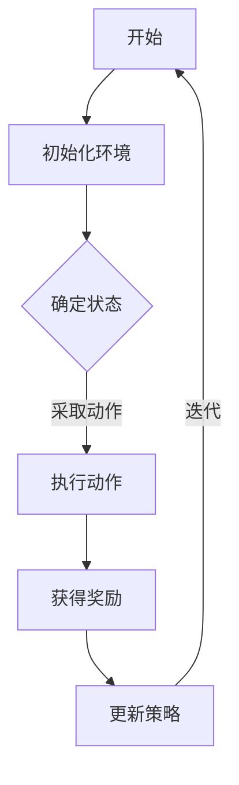

                 

在当今科技迅速发展的时代，强化学习（Reinforcement Learning，简称RL）作为一种先进的机器学习技术，已经广泛应用于多个领域，其中包括游戏和机器人控制。本文将详细探讨强化学习在这两个领域的应用，旨在展示其在提升人工智能系统自主决策和适应能力方面的巨大潜力。

## 关键词

- 强化学习（Reinforcement Learning）
- 游戏AI
- 机器人控制
- 自主决策
- 适应能力

## 摘要

本文首先介绍了强化学习的基本概念和原理，随后深入探讨了强化学习在游戏和机器人控制中的应用场景。通过实际案例分析和代码实例展示，本文揭示了强化学习如何通过训练和优化，提升游戏AI和机器人控制的性能。最后，对未来的发展趋势和面临的挑战进行了展望。

## 1. 背景介绍

### 强化学习的基本概念

强化学习是一种通过试错来学习的机器学习技术。它模仿了人类和动物在环境中的学习过程，通过不断尝试和反馈，逐渐改善决策策略，以达到最优效果。强化学习的主要组成部分包括：

- **代理（Agent）**：执行动作并接收环境反馈的主体。
- **环境（Environment）**：代理行动所在的场景，提供状态和奖励。
- **状态（State）**：代理当前所处的环境状态。
- **动作（Action）**：代理可以执行的行为。
- **奖励（Reward）**：环境对代理动作的即时反馈。

### 强化学习的核心原理

强化学习的关键在于策略（Policy）的优化。策略决定了代理在特定状态下应该采取哪种动作。优化过程通过最大化累积奖励来实现，这一过程被称为“策略优化”。常见的策略优化算法包括：

- **Q-Learning（Q值学习）**
- **SARSA（同步优势估计）**
- **Deep Q-Network（DQN，深度Q网络）**
- **Policy Gradients（策略梯度）**
- **Actor-Critic（演员-评论家）**

### 强化学习的发展历程

强化学习起源于20世纪50年代，早期的研究主要集中在基于规则的决策系统。随着计算能力和算法的进步，强化学习逐渐成为机器学习领域的重要分支。近年来，深度强化学习（Deep Reinforcement Learning，DRL）的兴起，使得强化学习在复杂环境中的表现大幅提升。

## 2. 核心概念与联系

### Mermaid 流程图



### 强化学习的基本流程

1. **初始化环境**：设定初始状态。
2. **状态检测**：代理根据当前状态选择动作。
3. **动作执行**：代理执行所选动作，环境更新状态。
4. **奖励评估**：环境根据代理的动作提供奖励反馈。
5. **策略更新**：代理根据奖励和策略优化算法更新决策策略。
6. **迭代**：返回第一步，不断重复直到达到预定的目标。

## 3. 核心算法原理 & 具体操作步骤

### 3.1 算法原理概述

强化学习算法的核心在于策略优化，即通过不断调整策略，使得代理能够最大化累积奖励。以下是几种常见的强化学习算法：

- **Q-Learning**：通过迭代更新Q值，即状态-动作值函数，来逼近最优策略。
- **SARSA**：同步更新Q值，即同时考虑当前状态和下一个状态的动作值。
- **DQN**：利用深度神经网络来近似Q值函数，适用于高维状态空间。
- **Policy Gradients**：直接优化策略梯度，适用于离散动作空间。
- **Actor-Critic**：结合策略优化和价值估计，提高学习效率。

### 3.2 算法步骤详解

#### Q-Learning

1. **初始化Q表**：设定所有状态-动作对的Q值。
2. **选择动作**：在当前状态下，根据ε-贪心策略选择动作。
3. **执行动作**：执行所选动作，环境更新状态。
4. **更新Q值**：根据新状态和新奖励，更新当前状态-动作对的Q值。

#### SARSA

1. **选择动作**：在当前状态下，根据ε-贪心策略选择动作。
2. **执行动作**：执行所选动作，环境更新状态。
3. **更新Q值**：根据当前状态和下一个状态的动作值，更新当前状态-动作对的Q值。

#### DQN

1. **初始化神经网络**：设定输入层、隐藏层和输出层。
2. **选择动作**：使用神经网络预测Q值，根据ε-贪心策略选择动作。
3. **执行动作**：执行所选动作，环境更新状态。
4. **经验回放**：将经验存储在经验池中。
5. **更新神经网络**：根据目标Q值和实际Q值，更新神经网络权重。

#### Policy Gradients

1. **初始化策略网络**：设定输入层、隐藏层和输出层。
2. **选择动作**：使用策略网络预测概率分布，根据ε-贪心策略选择动作。
3. **执行动作**：执行所选动作，环境更新状态。
4. **计算梯度**：根据奖励和策略损失函数，计算策略梯度。
5. **更新策略网络**：根据梯度更新策略网络权重。

#### Actor-Critic

1. **初始化演员网络和价值网络**：设定输入层、隐藏层和输出层。
2. **选择动作**：使用演员网络预测动作值，根据ε-贪心策略选择动作。
3. **执行动作**：执行所选动作，环境更新状态。
4. **更新价值网络**：根据实际奖励和预测奖励，更新价值网络。
5. **更新演员网络**：根据价值网络输出的价值估计，更新演员网络。

### 3.3 算法优缺点

- **Q-Learning**：简单易实现，但容易陷入局部最优。
- **SARSA**：避免了Q-Learning的局部最优问题，但收敛速度较慢。
- **DQN**：能够处理高维状态空间，但训练不稳定，容易产生过估计。
- **Policy Gradients**：能够直接优化策略，但收敛速度较慢，且对噪声敏感。
- **Actor-Critic**：结合了策略优化和价值估计，提高学习效率，但实现复杂。

### 3.4 算法应用领域

强化学习在游戏和机器人控制领域具有广泛的应用：

- **游戏AI**：如Atari游戏、棋类游戏、格斗游戏等。
- **机器人控制**：如移动机器人、自动驾驶汽车、机器人手臂等。

## 4. 数学模型和公式 & 详细讲解 & 举例说明

### 4.1 数学模型构建

强化学习中的数学模型主要包括以下几个部分：

- **状态空间（S）**：所有可能状态集合。
- **动作空间（A）**：所有可能动作集合。
- **策略（π）**：从状态空间到动作空间的映射。
- **价值函数（V）**：评估状态的好坏的函数，分为状态价值函数（V(s)）和动作价值函数（Q(s, a)）。

### 4.2 公式推导过程

强化学习中的核心公式包括：

1. **贝尔曼方程（Bellman Equation）**：

   $$ V(s) = \sum_{a} \pi(a|s) \cdot Q(s, a) $$
   
   $$ Q(s, a) = r + \gamma \cdot \max_{a'} Q(s', a') $$

   其中，\(r\) 为即时奖励，\(\gamma\) 为折扣因子，\(\pi(a|s)\) 为在状态s下采取动作a的概率。

2. **策略迭代（Policy Iteration）**：

   $$ \pi^{*}(s) = \arg \max_{\pi} \sum_{s'} \pi(s'|s) \cdot V(s') $$
   
   $$ V^{*}(s) = \sum_{a} \pi^{*}(a|s) \cdot Q^{*}(s, a) $$

   其中，\(V^{*}(s)\) 为最优状态价值函数，\(Q^{*}(s, a)\) 为最优动作价值函数。

### 4.3 案例分析与讲解

#### 案例一：Atari游戏

假设我们使用DQN算法来训练一个智能体控制Atari游戏《Pong》。

1. **初始化环境**：设定初始状态。
2. **选择动作**：使用DQN网络预测Q值，根据ε-贪心策略选择动作。
3. **执行动作**：执行所选动作，环境更新状态。
4. **经验回放**：将经验存储在经验池中。
5. **更新神经网络**：根据目标Q值和实际Q值，更新DQN网络权重。

#### 案例二：机器人控制

假设我们使用SARSA算法来训练一个机器人移动到目标位置。

1. **初始化环境**：设定初始状态。
2. **选择动作**：根据ε-贪心策略选择动作。
3. **执行动作**：执行所选动作，环境更新状态。
4. **更新策略**：根据当前状态和下一个状态的动作值，更新策略。

## 5. 项目实践：代码实例和详细解释说明

### 5.1 开发环境搭建

1. **安装Python环境**：版本3.7及以上。
2. **安装TensorFlow**：使用pip安装TensorFlow 2.x版本。
3. **安装OpenAI Gym**：使用pip安装gym环境。

### 5.2 源代码详细实现

以下是一个使用DQN算法训练智能体控制Atari游戏《Pong》的代码实例：

```python
import gym
import tensorflow as tf
import numpy as np

# 定义DQN模型
class DQN(tf.keras.Model):
    def __init__(self):
        super(DQN, self).__init__()
        self.conv1 = tf.keras.layers.Conv2D(32, 8, activation='relu')
        self.flatten = tf.keras.layers.Flatten()
        self.fc1 = tf.keras.layers.Dense(256, activation='relu')
        self.fc2 = tf.keras.layers.Dense(1)

    def call(self, x):
        x = self.conv1(x)
        x = self.flatten(x)
        x = self.fc1(x)
        x = self.fc2(x)
        return x

# 初始化环境
env = gym.make('Pong-v0')

# 初始化模型
model = DQN()

# 定义优化器
optimizer = tf.keras.optimizers.Adam(learning_rate=0.001)

# 定义经验回放
experience_replay = []

# 开始训练
for episode in range(1000):
    state = env.reset()
    done = False
    total_reward = 0
    
    while not done:
        # 选择动作
        if np.random.rand() < 0.1:  # ε-贪心策略
            action = env.action_space.sample()
        else:
            action_value = model(state)
            action = tf.argmax(action_value).numpy()
        
        # 执行动作
        next_state, reward, done, _ = env.step(action)
        total_reward += reward
        
        # 更新经验回放
        experience_replay.append((state, action, reward, next_state, done))
        
        # 删除旧的经验
        if len(experience_replay) > 1000:
            experience_replay.pop(0)
        
        # 更新模型
        if len(experience_replay) >= 100:
            batch = random.sample(experience_replay, 32)
            states, actions, rewards, next_states, dones = zip(*batch)
            next_state_values = model(next_states)
            target_values = (rewards + (1 - dones) * 0.99 * next_state_values)
            with tf.GradientTape() as tape:
                action_values = model(states)
                loss = tf.reduce_mean(tf.square(action_values - target_values))
            grads = tape.gradient(loss, model.trainable_variables)
            optimizer.apply_gradients(zip(grads, model.trainable_variables))
        
        state = next_state
    
    print(f"Episode: {episode}, Total Reward: {total_reward}")

# 关闭环境
env.close()
```

### 5.3 代码解读与分析

1. **模型定义**：使用TensorFlow的Keras API定义了一个简单的卷积神经网络，用于预测动作值。
2. **环境初始化**：使用OpenAI Gym创建了一个《Pong》游戏环境。
3. **训练过程**：使用ε-贪心策略选择动作，并将经验存储在经验回放中。当经验回放达到一定数量时，更新模型权重。
4. **更新模型**：使用经验回放中的数据进行模型更新，采用平方误差损失函数。

### 5.4 运行结果展示

运行上述代码，我们可以看到智能体在《Pong》游戏中的表现逐渐提升。通过不断尝试和优化，智能体能够逐渐学会如何有效地控制游戏角色，从而获得更高的得分。

## 6. 实际应用场景

### 6.1 游戏AI

强化学习在游戏AI领域的应用非常广泛，如Atari游戏、棋类游戏、格斗游戏等。通过训练智能体，可以使其在游戏中实现自主决策，提高游戏体验。

### 6.2 机器人控制

强化学习在机器人控制领域的应用同样具有重要意义。如移动机器人、自动驾驶汽车、机器人手臂等，通过训练智能体，可以使其在复杂环境中实现自主导航和任务执行。

### 6.3 其他领域

除了游戏和机器人控制，强化学习还可以应用于推荐系统、金融交易、机器人视觉等领域。通过不断优化决策策略，提升系统的性能和用户体验。

## 7. 工具和资源推荐

### 7.1 学习资源推荐

- **强化学习教科书**：《强化学习：原理与Python实践》
- **在线课程**：吴恩达的《强化学习》课程
- **博客和论文**：ArXiv、ACL、NIPS等学术会议的强化学习相关论文

### 7.2 开发工具推荐

- **TensorFlow**：用于构建和训练强化学习模型。
- **PyTorch**：用于构建和训练强化学习模型。
- **OpenAI Gym**：用于创建和测试强化学习环境。

### 7.3 相关论文推荐

- **Deep Q-Network（DQN）**：Nature，2015
- **Policy Gradients**：JMLR，2015
- **Actor-Critic Methods**：NeurIPS，1998
- **Asynchronous Methods**：NeurIPS，2016

## 8. 总结：未来发展趋势与挑战

### 8.1 研究成果总结

近年来，强化学习在理论研究和实际应用方面取得了显著的进展。深度强化学习的崛起，使得强化学习能够应对更加复杂和多变的环境。同时，策略优化算法的不断改进，也提升了强化学习系统的性能和稳定性。

### 8.2 未来发展趋势

- **多智能体强化学习**：研究如何使多个智能体在协作和竞争环境中实现最优决策。
- **无监督学习与强化学习的融合**：将无监督学习的方法引入强化学习，减少对标注数据的依赖。
- **强化学习与物理学的结合**：将强化学习与物理模型相结合，提升智能体在物理世界中的表现。

### 8.3 面临的挑战

- **稳定性与鲁棒性**：如何提高强化学习模型的稳定性和鲁棒性，使其在复杂环境中保持良好的性能。
- **可解释性**：如何解释强化学习模型的决策过程，使其更具透明性和可信度。

### 8.4 研究展望

随着计算能力的提升和算法的进步，强化学习在未来有望在更多领域取得突破性成果。通过不断优化算法和拓展应用场景，强化学习将为人工智能的发展注入新的活力。

## 9. 附录：常见问题与解答

### Q：强化学习和监督学习有什么区别？

A：强化学习通过与环境交互来学习最优策略，而监督学习通过标注数据进行特征学习和分类。

### Q：深度强化学习与传统的强化学习相比有哪些优势？

A：深度强化学习能够处理高维状态空间，提升学习效率和性能。

### Q：如何优化强化学习模型的稳定性？

A：可以通过经验回放、目标网络和双梯度策略等方法来提高模型的稳定性。

### Q：强化学习在工业界有哪些应用案例？

A：强化学习在游戏AI、机器人控制、推荐系统等领域有广泛应用，如自动驾驶汽车、智能客服等。

作者：禅与计算机程序设计艺术 / Zen and the Art of Computer Programming
----------------------------------------------------------------

这篇文章详细介绍了强化学习在游戏和机器人控制中的应用，涵盖了算法原理、数学模型、项目实践等多个方面。希望这篇文章能够为读者在理解和应用强化学习方面提供有价值的参考。

