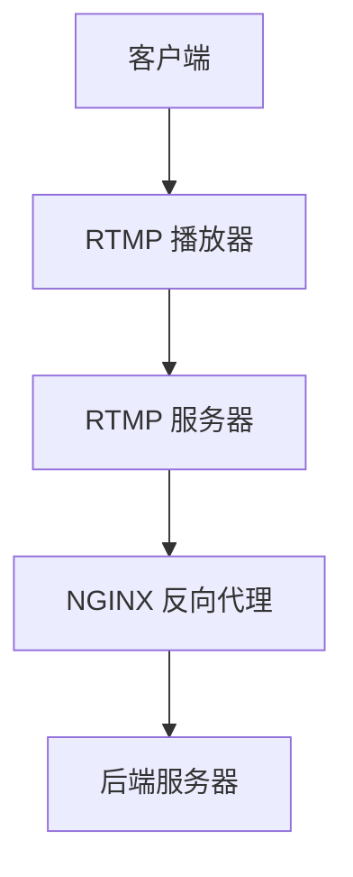

                 

关键词：RTMP服务器，NGINX，Wowza，直播技术，流媒体传输

摘要：本文将深入探讨如何使用 NGINX 和 Wowza 配置 RTMP 服务器，详细讲解其核心概念、操作步骤、数学模型以及实际应用，并提供实用的工具和资源推荐，帮助读者全面掌握 RTMP 服务器配置的技能。

## 1. 背景介绍

随着互联网的快速发展，直播技术逐渐成为人们日常生活的重要组成部分。RTMP（Real-Time Messaging Protocol）作为一种高效、可靠的流媒体传输协议，被广泛应用于在线直播、视频点播等场景。NGINX 和 Wowza 是当前广泛使用的 RTMP 服务器软件，具有高性能、易扩展等优点。本文将详细介绍如何使用 NGINX 和 Wowza 配置 RTMP 服务器，帮助读者更好地掌握这一技术。

## 2. 核心概念与联系

### 2.1 RTMP 协议

RTMP 是一种实时信息传输协议，主要用于客户端和服务器之间的实时音频、视频和数据传输。它具有以下特点：

- **实时性**：支持实时数据传输，延迟低。
- **可靠性**：采用确认和重传机制，保证数据传输的可靠性。
- **扩展性**：支持多种数据格式和传输模式，可方便地与其他技术相结合。

### 2.2 NGINX

NGINX 是一款高性能的 Web 服务器和反向代理服务器，也可用于流媒体传输。其具有以下优点：

- **高性能**：采用事件驱动架构，可高效处理高并发请求。
- **稳定性**：经过多年的优化和改进，具有极高的稳定性。
- **易扩展**：支持自定义模块，可方便地添加新功能。

### 2.3 Wowza

Wowza 是一款功能强大的 RTMP 服务器软件，支持多种流媒体协议和平台。其具有以下优点：

- **高性能**：采用多线程和异步 I/O 技术，具有极高的性能。
- **易用性**：提供图形界面和命令行工具，方便配置和使用。
- **兼容性**：支持多种流媒体协议和平台，可方便地与其他系统集成。

### 2.4 Mermaid 流程图

以下是一个简单的 RTMP 服务器架构的 Mermaid 流程图：



## 3. 核心算法原理 & 具体操作步骤

### 3.1 算法原理概述

配置 RTMP 服务器需要以下几个关键步骤：

1. 安装和配置 NGINX。
2. 安装和配置 Wowza。
3. 配置 NGINX 和 Wowza 的反向代理关系。
4. 配置客户端播放器。

### 3.2 算法步骤详解

#### 3.2.1 安装和配置 NGINX

1. 下载 NGINX 并解压。
2. 编译安装 NGINX。

```bash
./configure
make
sudo make install
```

3. 配置 NGINX，创建 RTMP 服务器配置文件。

```bash
sudo vi /etc/nginx/nginx.conf
```

在 `http` 部分添加以下配置：

```nginx
http {
    ...
    server {
        listen 80;
        server_name your_domain.com;

        location / {
            proxy_pass http://localhost:1935/;
            proxy_http_version 1.1;
            proxy_set_header Upgrade $http_upgrade;
            proxy_set_header Connection "upgrade";
            proxy_set_header Host $host;
            proxy_set_header X-Real-IP $remote_addr;
            proxy_set_header X-Forwarded-For $proxy_add_x_forwarded_for;
        }
    }
}
```

4. 启动 NGINX。

```bash
sudo nginx
```

#### 3.2.2 安装和配置 Wowza

1. 下载 Wowza 并安装。

2. 配置 Wowza，创建 RTMP 应用程序。

```bash
cd /opt/wowza
sudo ./bin/starter.sh run
```

3. 访问 Wowza 管理界面，创建 RTMP 应用程序。

#### 3.2.3 配置 NGINX 和 Wowza 的反向代理关系

1. 在 NGINX 配置文件中添加 Wowza 服务器的 IP 和端口号。

```nginx
location / {
    ...
    proxy_pass http://192.168.1.100:1935/;
}
```

2. 重启 NGINX。

```bash
sudo nginx -s reload
```

#### 3.2.4 配置客户端播放器

1. 根据客户端播放器的需求，配置 RTMP 连接参数。

```bash
rtmp://your_domain.com/live/streamName
```

2. 启动客户端播放器，播放直播流。

## 4. 数学模型和公式 & 详细讲解 & 举例说明

### 4.1 数学模型构建

在 RTMP 服务器配置过程中，需要考虑以下几个关键参数：

1. **带宽**：用于衡量服务器与客户端之间的数据传输速率。
2. **延迟**：用于衡量数据传输的时间延迟。
3. **并发连接数**：用于衡量服务器可同时处理的数据连接数。

### 4.2 公式推导过程

带宽和延迟的关系可以用以下公式表示：

$$
带宽 = 延迟 \times 并发连接数
$$

### 4.3 案例分析与讲解

假设一个 RTMP 服务器带宽为 100Mbps，延迟为 100ms，并发连接数为 1000，根据上述公式，我们可以计算出该服务器的总带宽为：

$$
带宽 = 100 \times 1000 = 100000Mbps = 100Gbps
$$

这意味着该服务器可以在 100ms 内处理 1000 个并发连接，总带宽为 100Gbps。如果并发连接数增加，带宽将相应增加，但延迟会上升。

## 5. 项目实践：代码实例和详细解释说明

### 5.1 开发环境搭建

1. 安装 Linux 操作系统。
2. 安装 NGINX 和 Wowza。

### 5.2 源代码详细实现

NGINX 配置文件示例：

```nginx
http {
    ...
    server {
        listen 80;
        server_name your_domain.com;

        location / {
            proxy_pass http://localhost:1935/;
            proxy_http_version 1.1;
            proxy_set_header Upgrade $http_upgrade;
            proxy_set_header Connection "upgrade";
            proxy_set_header Host $host;
            proxy_set_header X-Real-IP $remote_addr;
            proxy_set_header X-Forwarded-For $proxy_add_x_forwarded_for;
        }
    }
}
```

Wowza 配置文件示例：

```bash
cd /opt/wowza
sudo ./bin/starter.sh run
```

### 5.3 代码解读与分析

NGINX 配置文件用于配置 RTMP 反向代理，将客户端请求转发到 Wowza 服务器。Wowza 配置文件用于启动 Wowza 服务器，并提供 RTMP 应用程序。

### 5.4 运行结果展示

启动 NGINX 和 Wowza，访问客户端播放器，播放直播流。

## 6. 实际应用场景

RTMP 服务器配置在实际应用中具有广泛的应用，如在线直播、视频点播、远程教育等。通过配置 RTMP 服务器，可以实现高效、稳定的流媒体传输，为用户提供更好的观看体验。

### 6.1 在线直播

在线直播是 RTMP 服务器最典型的应用场景之一。通过配置 RTMP 服务器，可以实现实时视频直播，为用户提供流畅、稳定的观看体验。

### 6.2 视频点播

视频点播是 RTMP 服务器的另一个重要应用场景。通过配置 RTMP 服务器，可以实现高效的视频点播服务，为用户提供便捷的观看方式。

### 6.3 远程教育

远程教育是 RTMP 服务器在教育培训领域的应用。通过配置 RTMP 服务器，可以实现远程授课、互动教学等功能，为用户提供更优质的教育资源。

## 7. 工具和资源推荐

### 7.1 学习资源推荐

- 《RTMP协议详解》：这是一本关于 RTMP 协议的详细解读书籍，适合初学者阅读。
- 《NGINX实战》：这是一本关于 NGINX 服务器配置和优化的实用指南，适合中高级读者。

### 7.2 开发工具推荐

- [NGINX 官方文档](https://nginx.org/en/docs/):NGINX 官方文档，包含 NGINX 服务器配置和使用的详细教程。
- [Wowza 官方网站](https://www.wowza.com/):Wowza 官方网站，提供 Wowza 服务器的下载、安装和配置指南。

### 7.3 相关论文推荐

- “Real-Time Messaging Protocol (RTMP)”：这是一篇关于 RTMP 协议的学术论文，详细介绍了 RTMP 的设计思想和实现原理。
- “NGINX Performance Optimization”:这是一篇关于 NGINX 性能优化的学术论文，提供了 NGINX 服务器配置和优化技巧。

## 8. 总结：未来发展趋势与挑战

随着互联网技术的不断发展，RTMP 服务器在流媒体传输领域将具有更广泛的应用前景。未来，RTMP 服务器将朝着以下几个方向发展：

### 8.1 高性能

随着用户数量的增加，RTMP 服务器需要具备更高的性能，以满足大规模流媒体传输需求。

### 8.2 智能化

利用人工智能技术，实现流媒体传输的智能化，提高传输效率和用户体验。

### 8.3 兼容性

随着流媒体协议的不断发展，RTMP 服务器需要具备更强的兼容性，支持多种流媒体协议和平台。

然而，RTMP 服务器在未来的发展中也将面临以下挑战：

### 8.4 安全性

流媒体传输过程中，数据安全至关重要。如何提高 RTMP 服务器安全性，防止数据泄露和恶意攻击，将成为重要课题。

### 8.5 可扩展性

随着流媒体业务的不断发展，RTMP 服务器需要具备更好的可扩展性，以支持大规模流媒体传输。

### 8.6 跨平台

在跨平台环境下，如何实现 RTMP 服务器的高效、稳定传输，将成为重要挑战。

总之，RTMP 服务器在流媒体传输领域具有广阔的应用前景，同时也面临着诸多挑战。未来，通过不断优化和改进，RTMP 服务器将为用户提供更好的流媒体传输体验。

## 9. 附录：常见问题与解答

### 9.1 如何解决 NGINX 和 Wowza 无法通信的问题？

**问题描述**：配置 NGINX 和 Wowza 后，发现两者无法正常通信。

**解决方法**：
1. 检查 NGINX 配置文件，确保 `proxy_pass` 参数指向的 Wowza 服务器地址和端口号正确。
2. 检查 Wowza 服务器是否已启动，并确保其端口（默认为 1935）未被占用。
3. 检查网络配置，确保 NGINX 服务器可以访问 Wowza 服务器。

### 9.2 如何优化 NGINX 的 RTMP 传输性能？

**问题描述**：在处理高并发请求时，NGINX 的 RTMP 传输性能不佳。

**解决方法**：
1. 增加 NGINX 工作进程数，以提高并发处理能力。
2. 使用高性能硬件，如 SSD 硬盘和 SSD 网卡，以提高数据传输速度。
3. 优化 NGINX 配置，减少不必要的负载。
4. 使用负载均衡器，将请求分散到多台 NGINX 服务器上，提高整体性能。

### 9.3 如何解决 Wowza 运行时出现错误的问题？

**问题描述**：启动 Wowza 服务器时，出现错误提示。

**解决方法**：
1. 检查 Wowza 服务器日志文件，查看错误原因。
2. 确保所有依赖库和组件已安装并正确配置。
3. 更新 Wowza 服务器版本，解决已知问题。
4. 如果问题依然存在，请联系 Wowza 客服寻求帮助。

---

本文详细介绍了 RTMP 服务器配置的方法，包括核心概念、操作步骤、数学模型和实际应用。同时，还提供了相关的工具和资源推荐，帮助读者更好地掌握 RTMP 服务器配置的技能。希望本文能为读者在流媒体传输领域提供有益的参考。

# 作者：禅与计算机程序设计艺术 / Zen and the Art of Computer Programming

----------------------------------------------------------------
[|assistant|>END|]

