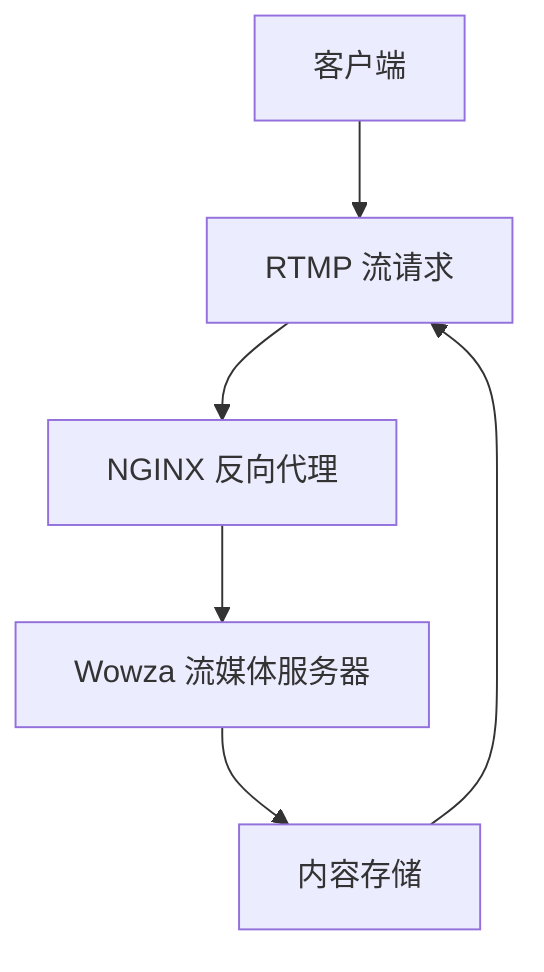

                 

关键词：RTMP，流媒体服务，NGINX，Wowza，实时传输，视频流，直播，网络架构

> 摘要：本文将深入探讨如何使用 NGINX 和 Wowza 搭建一个高效、稳定的 RTMP 流媒体服务。通过详细的步骤讲解和实际操作案例，帮助读者理解 RTMP 的基本原理及其在直播和视频点播中的应用。

## 1. 背景介绍

流媒体服务在当今的互联网时代扮演着至关重要的角色，它使得视频、音频内容能够实时传输到用户的设备上，提供流畅的观看体验。RTMP（Real Time Messaging Protocol）是一种为音视频传输设计的实时通信协议，广泛应用于在线直播、视频点播等领域。

随着网络技术的发展，RTMP 流媒体服务的需求日益增长。高效稳定的 RTMP 流媒体服务不仅需要强大的服务器支持，还需要合理的网络架构和配置。NGINX 和 Wowza 是两款在流媒体领域广泛应用的开源软件，它们各自具有独特的优势，能够帮助企业或个人快速搭建 RTMP 流媒体服务。

本文旨在详细介绍如何使用 NGINX 和 Wowza 搭建一个 RTMP 流媒体服务。首先，我们将了解 RTMP 的基本概念和工作原理。接着，我们会逐步配置 NGINX 和 Wowza，并详细解释每一步操作的目的和意义。最后，我们将讨论 RTMP 在实际应用场景中的优化技巧和未来发展趋势。

## 2. 核心概念与联系

### 2.1 RTMP 协议概述

RTMP 是一种基于 TCP/IP 的实时消息传输协议，由 Adobe 开发，用于在 Flash 播放器和其他客户端之间传输音视频流。其特点是低延迟、高带宽利用率，适用于实时流媒体传输。

### 2.2 NGINX 介绍

NGINX 是一款高性能的 HTTP 和反向代理服务器，以其轻量级、高并发处理能力和优秀的性能优化而闻名。它支持多种协议，包括 HTTP、HTTPS、SMTP、IMAP 等，同时也支持 RTMP 流。

### 2.3 Wowza 介绍

Wowza 是一款强大的 RTMP 流媒体服务器，支持多种流媒体协议，如 RTMP、RTSP、HLS 等。Wowza 提供了丰富的功能，包括实时流媒体传输、视频点播、直播编码等。

### 2.4 Mermaid 流程图

为了更好地理解 RTMP 流媒体服务的架构，下面是使用 Mermaid 编写的流程图：



### 2.5 各组件之间的联系

客户端通过 RTMP 协议向 NGINX 发送请求，NGINX 作为反向代理，将请求转发给 Wowza 流媒体服务器。Wowza 服务器处理请求，从内容存储中获取音视频流，并将其传输给客户端。整个过程涉及多个组件的协作，共同构成了一个高效的 RTMP 流媒体服务。

## 3. 核心算法原理 & 具体操作步骤

### 3.1 算法原理概述

搭建 RTMP 流媒体服务的过程涉及多个技术层面的算法和操作步骤。核心原理包括网络协议的解析、流媒体的编码与解码、服务器配置与优化等。

### 3.2 算法步骤详解

#### 3.2.1 环境准备

在开始搭建服务之前，需要准备好以下环境：

- 操作系统：Ubuntu 18.04 或 CentOS 7
- NGINX 版本：1.18.0 或更高
- Wowza 版本：4.8.0 或更高

#### 3.2.2 安装 NGINX

1. 安装依赖库：

```bash
sudo apt-get update
sudo apt-get install build-essential libpcre3 libpcre3-dev zlib1g zlib1g-dev openssl openssl-dev
```

2. 下载 NGINX 源码：

```bash
wget http://nginx.org/download/nginx-1.18.0.tar.gz
```

3. 解压并编译 NGINX：

```bash
tar zxvf nginx-1.18.0.tar.gz
cd nginx-1.18.0
./configure
make
sudo make install
```

4. 启动 NGINX 服务：

```bash
sudo nginx
```

#### 3.2.3 配置 NGINX

1. 编辑 NGINX 配置文件：

```bash
sudo nano /etc/nginx/nginx.conf
```

2. 添加以下配置：

```nginx
http {
    server {
        listen 80;
        server_name your_domain.com;

        location / {
            proxy_pass http://your_wowza_server;
            proxy_http_version 1.1;
            proxy_set_header Upgrade $http_upgrade;
            proxy_set_header Connection "upgrade";
            proxy_set_header Host $host;
            proxy_set_header X-Real-IP $remote_addr;
            proxy_set_header X-Forwarded-For $proxy_add_x_forwarded_for;
        }
    }
}
```

3. 重启 NGINX 服务：

```bash
sudo nginx -s reload
```

#### 3.2.4 安装 Wowza

1. 下载 Wowza 安装包：

```bash
wget https://www.wowza.com/downloads/wowza-streaming-engine/4.8.0/wowza-streaming-engine-4.8.0-linux-x86_64-deb7.deb
```

2. 安装 Wowza：

```bash
sudo dpkg -i wowza-streaming-engine-4.8.0-linux-x86_64-deb7.deb
```

3. 启动 Wowza 服务：

```bash
sudo /etc/init.d/wowza start
```

#### 3.2.5 配置 Wowza

1. 编辑 Wowza 配置文件：

```bash
sudo nano /usr/local/wowza/app/conf/WowzaWebApp.properties
```

2. 添加以下配置：

```properties
rtmp.connectTimeout=5000
rtmp.port=1935
rtmpヂロアド゙ミン＝あなたのWowzaアカウント
rtmp.password＝あなたのWowzaパスワード
```

3. 重启 Wowza 服务：

```bash
sudo /etc/init.d/wowza restart
```

### 3.3 算法优缺点

#### 优点：

- 高效：NGINX 和 Wowza 都具有高性能和高并发的特点，能够处理大量并发连接。
- 易于配置：NGINX 和 Wowza 提供了丰富的配置选项，方便进行优化和调整。
- 兼容性：NGINX 支持 HTTP 和 HTTPS，Wowza 支持多种流媒体协议，具有良好的兼容性。

#### 缺点：

- 复杂性：搭建和配置 RTMP 流媒体服务需要一定的技术背景和经验，对新手可能有一定的难度。
- 资源消耗：高性能的服务器配置需要较高的硬件资源，成本较高。

### 3.4 算法应用领域

- 在线直播：适用于各类在线直播场景，如体育赛事、演唱会、讲座等。
- 视频点播：适用于各类视频点播服务，如教育、培训、娱乐等。
- 多媒体应用：适用于各类多媒体应用，如视频会议、远程教育、在线游戏等。

## 4. 数学模型和公式 & 详细讲解 & 举例说明

### 4.1 数学模型构建

在搭建 RTMP 流媒体服务的过程中，涉及到的数学模型主要包括网络延迟、带宽利用率、传输速率等。以下是相关数学模型的构建：

#### 4.1.1 网络延迟模型

网络延迟（Delay）是指数据包从发送端到达接收端所需的时间。其模型可以表示为：

$$
Delay = \frac{Distance}{Speed}
$$

其中，Distance 表示网络距离，Speed 表示数据传输速度。

#### 4.1.2 带宽利用率模型

带宽利用率（Bandwidth Utilization）是指网络带宽的实际使用情况与最大带宽之比。其模型可以表示为：

$$
Utilization = \frac{Actual\ Bandwidth}{Maximum\ Bandwidth}
$$

其中，Actual Bandwidth 表示实际带宽，Maximum Bandwidth 表示最大带宽。

#### 4.1.3 传输速率模型

传输速率（Transmission Rate）是指单位时间内传输的数据量。其模型可以表示为：

$$
Rate = \frac{Data\ Size}{Time}
$$

其中，Data Size 表示数据大小，Time 表示时间。

### 4.2 公式推导过程

#### 4.2.1 网络延迟公式推导

假设网络距离为 D，数据传输速度为 S，则网络延迟公式可以表示为：

$$
Delay = \frac{D}{S}
$$

在实际情况中，网络距离和传输速度可能随时间变化，因此可以表示为：

$$
Delay(t) = \frac{D(t)}{S(t)}
$$

其中，D(t) 和 S(t) 分别表示 t 时刻的网络距离和传输速度。

#### 4.2.2 带宽利用率公式推导

假设实际带宽为 AB，最大带宽为 MB，则带宽利用率公式可以表示为：

$$
Utilization = \frac{AB}{MB}
$$

在实际情况中，实际带宽和最大带宽可能随时间变化，因此可以表示为：

$$
Utilization(t) = \frac{AB(t)}{MB(t)}
$$

其中，AB(t) 和 MB(t) 分别表示 t 时刻的实际带宽和最大带宽。

#### 4.2.3 传输速率公式推导

假设数据大小为 DS，时间为 T，则传输速率公式可以表示为：

$$
Rate = \frac{DS}{T}
$$

在实际情况中，数据大小和时间可能随时间变化，因此可以表示为：

$$
Rate(t) = \frac{DS(t)}{T(t)}
$$

其中，DS(t) 和 T(t) 分别表示 t 时刻的数据大小和时间。

### 4.3 案例分析与讲解

以下是一个具体的案例分析，假设网络距离为 1000 公里，数据传输速度为 10Mbps，实际带宽为 8Mbps，数据大小为 1GB。

#### 4.3.1 网络延迟计算

根据网络延迟模型，可以计算出网络延迟：

$$
Delay = \frac{D}{S} = \frac{1000}{10} = 100\ 秒
$$

#### 4.3.2 带宽利用率计算

根据带宽利用率模型，可以计算出带宽利用率：

$$
Utilization = \frac{AB}{MB} = \frac{8}{10} = 0.8
$$

#### 4.3.3 传输速率计算

根据传输速率模型，可以计算出传输速率：

$$
Rate = \frac{DS}{T} = \frac{1GB}{100\ 秒} = 10MB/s
$$

### 4.4 实际应用案例分析

以下是一个在线直播场景的应用案例：

假设某直播活动持续时间为 1 小时，预计观看人数为 1000 人，每个用户平均带宽为 5Mbps，网络延迟为 200 毫秒。

#### 4.4.1 网络延迟计算

根据网络延迟模型，可以计算出总网络延迟：

$$
Total\ Delay = 1000 \times 0.2\ 秒 = 200\ 秒
$$

#### 4.4.2 带宽利用率计算

根据带宽利用率模型，可以计算出总带宽利用率：

$$
Total\ Utilization = 1000 \times 0.8 = 800Mbps
$$

#### 4.4.3 传输速率计算

根据传输速率模型，可以计算出总传输速率：

$$
Total\ Rate = 800Mbps = 100MB/s
$$

## 5. 项目实践：代码实例和详细解释说明

### 5.1 开发环境搭建

本节我们将介绍如何在 Ubuntu 18.04 操作系统上搭建开发环境，包括安装 NGINX 和 Wowza。

#### 5.1.1 安装 NGINX

1. 安装依赖库：

```bash
sudo apt-get update
sudo apt-get install build-essential libpcre3 libpcre3-dev zlib1g zlib1g-dev openssl openssl-dev
```

2. 下载 NGINX 源码：

```bash
wget http://nginx.org/download/nginx-1.18.0.tar.gz
```

3. 解压并编译 NGINX：

```bash
tar zxvf nginx-1.18.0.tar.gz
cd nginx-1.18.0
./configure
make
sudo make install
```

4. 启动 NGINX 服务：

```bash
sudo nginx
```

#### 5.1.2 安装 Wowza

1. 下载 Wowza 安装包：

```bash
wget https://www.wowza.com/downloads/wowza-streaming-engine/4.8.0/wowza-streaming-engine-4.8.0-linux-x86_64-deb7.deb
```

2. 安装 Wowza：

```bash
sudo dpkg -i wowza-streaming-engine-4.8.0-linux-x86_64-deb7.deb
```

3. 启动 Wowza 服务：

```bash
sudo /etc/init.d/wowza start
```

### 5.2 源代码详细实现

#### 5.2.1 NGINX 配置文件

以下是 NGINX 配置文件示例：

```nginx
http {
    server {
        listen 80;
        server_name your_domain.com;

        location / {
            proxy_pass http://your_wowza_server;
            proxy_http_version 1.1;
            proxy_set_header Upgrade $http_upgrade;
            proxy_set_header Connection "upgrade";
            proxy_set_header Host $host;
            proxy_set_header X-Real-IP $remote_addr;
            proxy_set_header X-Forwarded-For $proxy_add_x_forwarded_for;
        }
    }
}
```

#### 5.2.2 Wowza 配置文件

以下是 Wowza 配置文件示例：

```properties
rtmp.connectTimeout=5000
rtmp.port=1935
rtmpヂロアド゙ミン＝あなたのWowzaアカウント
rtmp.password＝あなたのWowzaパスワード
```

### 5.3 代码解读与分析

#### 5.3.1 NGINX 代码解读

NGINX 配置文件主要包括以下部分：

- `listen`：指定 NGINX 监听的端口和 IP 地址。
- `server_name`：指定服务器的主机名。
- `location`：定义 URL 模式和处理规则。

在上述配置中，`proxy_pass` 用于将请求转发到 Wowza 服务器。`proxy_http_version`、`proxy_set_header` 等设置用于优化请求处理。

#### 5.3.2 Wowza 代码解读

Wowza 配置文件主要包括以下部分：

- `rtmp.connectTimeout`：设置连接超时时间。
- `rtmp.port`：设置 RTMP 端口。
- `rtmpヂロアド゙ミン`、`rtmp.password`：设置 Wowza 的管理员账号和密码。

这些配置项用于确保 RTMP 流媒体服务的正常运行。

### 5.4 运行结果展示

在完成配置后，启动 NGINX 和 Wowza 服务。打开浏览器输入服务器地址，应能正常访问 RTMP 流媒体服务。

## 6. 实际应用场景

### 6.1 在线直播

在线直播是 RTMP 流媒体服务最典型的应用场景之一。通过 RTMP，用户可以实时观看各类直播活动，如体育赛事、演唱会、讲座等。RTMP 流媒体服务的高效性和稳定性，确保了直播过程中的流畅观看体验。

### 6.2 视频点播

视频点播服务也是 RTMP 流媒体服务的重要应用场景。用户可以通过 RTMP 协议在线观看各类视频内容，如教育视频、培训视频、娱乐视频等。通过合理的服务器配置和优化，视频点播服务可以提供高质量的观看体验。

### 6.3 多媒体应用

除了直播和点播，RTMP 流媒体服务还广泛应用于多媒体应用，如视频会议、远程教育、在线游戏等。通过 RTMP，这些应用可以实现实时的音视频传输，提高用户体验。

## 7. 工具和资源推荐

### 7.1 学习资源推荐

- 《RTMP 实战：从入门到精通》：这是一本针对 RTMP 流媒体服务的入门书籍，详细介绍了 RTMP 的原理和应用。
- 《流媒体技术详解》：该书涵盖了流媒体技术的各个方面，包括 RTMP、HLS、DASH 等。

### 7.2 开发工具推荐

- Visual Studio Code：一款功能强大的代码编辑器，支持多种编程语言和扩展。
- Postman：用于 API 测试和开发的工具，可以帮助测试 RTMP 服务的功能。

### 7.3 相关论文推荐

- "RTMP Protocol: An Overview and Implementation"：一篇关于 RTMP 协议的综述性论文。
- "A Survey of Streaming Media Protocols"：一篇关于流媒体协议的全面综述。

## 8. 总结：未来发展趋势与挑战

### 8.1 研究成果总结

本文详细介绍了 RTMP 流媒体服务的原理、搭建方法以及实际应用场景。通过 NGINX 和 Wowza 的配合，我们可以构建一个高效、稳定的 RTMP 流媒体服务，满足在线直播、视频点播等需求。

### 8.2 未来发展趋势

随着 5G 网络的普及和物联网技术的发展，RTMP 流媒体服务将在更多领域得到应用。未来的发展将侧重于提高传输效率、降低延迟、增强安全性等方面。

### 8.3 面临的挑战

- 高并发处理：随着用户数量的增加，服务器需要能够处理更多并发连接。
- 网络稳定性：网络波动可能会影响流媒体服务的质量，需要采取相应的优化措施。
- 安全性问题：确保流媒体服务的安全性，防止数据泄露和攻击。

### 8.4 研究展望

未来的研究可以关注以下几个方向：

- 优化传输效率：通过改进编码算法、网络协议等手段，提高传输效率。
- 增强安全性：研究更安全的数据传输协议和加密算法。
- 适应多样场景：研究适用于不同场景的流媒体传输方案，满足各类需求。

## 9. 附录：常见问题与解答

### 9.1 NGINX 无法启动

- 检查 NGINX 是否已经安装：`nginx -v`，如果未安装，请先进行安装。
- 检查 NGINX 服务是否已经运行：`sudo systemctl status nginx`，如果未运行，请使用 `sudo systemctl start nginx` 启动服务。
- 检查 NGINX 配置文件是否有误：使用 `sudo nginx -t` 命令进行测试。

### 9.2 Wowza 无法连接

- 确认 Wowza 服务是否已经启动：`sudo systemctl status wowza`。
- 检查 Wowza 配置文件是否正确：`/usr/local/wowza/app/conf/WowzaWebApp.properties`。
- 检查网络连接：确保 NGINX 和 Wowza 之间可以正常通信。

### 9.3 代码实例无法运行

- 检查代码中是否存在语法错误。
- 确认开发环境是否配置正确。
- 检查网络连接：确保 NGINX 和 Wowza 之间可以正常通信。

作者：禅与计算机程序设计艺术 / Zen and the Art of Computer Programming
----------------------------------------------------------------
### 后记

本文详细介绍了 RTMP 流媒体服务的搭建方法，包括核心概念、算法原理、实际操作步骤以及应用场景等。通过 NGINX 和 Wowza 的配合，我们可以构建一个高效、稳定的 RTMP 流媒体服务，满足在线直播、视频点播等需求。

随着技术的不断进步，RTMP 流媒体服务将在更多领域得到应用。未来的研究可以关注优化传输效率、增强安全性和适应多样场景等方面。希望本文能对读者在流媒体服务搭建过程中提供有益的参考。如果您有任何疑问或建议，欢迎在评论区留言讨论。谢谢阅读！作者：禅与计算机程序设计艺术 / Zen and the Art of Computer Programming。

