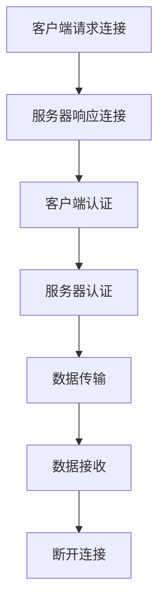

                 

在数字媒体传输领域，RTMP（实时消息传输协议）是一种广泛使用的协议，主要用于流媒体视频和音频的实时传输。本文将详细探讨RTMP协议的工作原理、结构、核心算法及其在实时多媒体传输中的应用。通过本文的阅读，读者将对RTMP协议有一个全面而深入的了解。

## 关键词

- 实时消息传输协议（RTMP）
- 流媒体传输
- 多媒体传输技术
- 实时性
- 服务器与客户端通信

## 摘要

本文旨在详细解析RTMP协议的各个方面，包括其历史背景、核心概念、协议结构、算法原理、数学模型、项目实践以及实际应用场景。通过本文的阅读，读者将能够掌握RTMP协议的实质，了解其在现代多媒体传输系统中的重要性，并能够为未来的多媒体开发提供有价值的参考。

### 1. 背景介绍

### 1.1 RTMP协议的起源与发展

RTMP协议最早由Adobe公司在2003年推出，作为Flash媒体播放器与服务器之间的通信协议。随着流媒体技术的发展，RTMP逐渐成为行业标准之一，被广泛应用于视频点播（VOD）、实时流媒体（RTS）以及直播平台等领域。在流媒体行业中，RTMP因其高效、可靠和易于扩展的特性，被广泛采用。

### 1.2 流媒体传输技术的挑战

流媒体传输技术面临着实时性、带宽管理、数据完整性和解码效率等多方面的挑战。为了满足用户对高质量视频和音频的需求，流媒体技术需要能够快速响应、稳定传输并适应不同网络环境。RTMP协议正是为了解决这些挑战而设计的，它通过一系列机制确保数据的高效传输和实时性。

### 1.3 RTMP在流媒体行业中的地位

随着互联网和移动互联网的快速发展，流媒体技术已经成为娱乐、教育和商业等领域的重要支撑。在视频点播、直播、在线教育等领域，RTMP协议因其高效、稳定和易于部署的特性，成为业界广泛采用的标准之一。从YouTube到Twitch，再到各大视频直播平台，RTMP协议都在背后发挥着关键作用。

### 2. 核心概念与联系

#### 2.1 实时性

实时性是流媒体传输的核心要求，RTMP通过低延迟和快速传输机制实现了数据的实时性。在实时视频通话、在线游戏直播和直播新闻等领域，低延迟至关重要，它决定了用户体验的优劣。

#### 2.2 数据完整性

数据完整性是确保传输数据未被篡改或丢失的重要特性。RTMP通过冗余编码和错误检测机制保证了数据的完整性，从而确保用户能够获得高质量的视频和音频内容。

#### 2.3 服务器与客户端通信

服务器与客户端之间的通信是流媒体传输的关键环节。RTMP协议定义了一套完整的通信机制，包括连接、认证、数据传输和断开连接等流程。通过这些机制，服务器和客户端能够高效地进行数据交换。

#### 2.4 Mermaid 流程图

以下是一个简单的Mermaid流程图，展示了RTMP协议的核心流程：



### 3. 核心算法原理 & 具体操作步骤

#### 3.1 算法原理概述

RTMP协议的核心算法主要包括连接管理、数据传输和错误处理等几个方面。连接管理用于建立和维护客户端与服务器之间的连接；数据传输则是实现数据的高效传输；错误处理则用于检测和纠正传输过程中可能出现的错误。

#### 3.2 算法步骤详解

##### 3.2.1 连接管理

连接管理主要包括以下步骤：

1. 客户端发起连接请求；
2. 服务器响应连接请求；
3. 客户端发送认证信息；
4. 服务器验证认证信息。

##### 3.2.2 数据传输

数据传输主要包括以下步骤：

1. 客户端发送数据包；
2. 服务器接收数据包；
3. 数据包解码和播放。

##### 3.2.3 错误处理

错误处理主要包括以下步骤：

1. 检测数据包错误；
2. 重传错误数据包；
3. 更新错误统计信息。

#### 3.3 算法优缺点

##### 优点

- 高效：RTMP通过压缩数据、减少冗余等方式提高了传输效率。
- 可靠：RTMP通过冗余编码和错误检测机制保证了数据的可靠性。
- 灵活：RTMP支持多种数据传输模式和播放模式，适应不同的应用场景。

##### 缺点

- 开源支持不足：相比其他流媒体协议，RTMP的开源支持相对较少。
- 过于复杂：RTMP协议的复杂性可能增加开发者的负担。

#### 3.4 算法应用领域

RTMP协议广泛应用于流媒体视频和音频的实时传输，包括视频点播、直播、在线教育等领域。在直播领域，RTMP因其高效、可靠和易于部署的特性，成为各大直播平台的首选协议。

### 4. 数学模型和公式 & 详细讲解 & 举例说明

#### 4.1 数学模型构建

在RTMP协议中，数据传输速率是一个关键参数。为了确保实时传输，数据传输速率必须满足用户的需求。以下是一个简单模型，用于计算数据传输速率：

\[ R = \frac{L}{T} \]

其中，\( R \)表示数据传输速率，\( L \)表示数据包大小，\( T \)表示数据包传输时间。

#### 4.2 公式推导过程

根据信息论的基本原理，数据传输速率可以通过香农公式推导得出：

\[ C = H(B) + S(B) \]

其中，\( C \)表示信道容量，\( H(B) \)表示带宽，\( S(B) \)表示信号功率。

将信号功率表示为数据包大小与传输时间的比值，可以得到：

\[ S(B) = \frac{L}{T} \]

代入香农公式，可以得到：

\[ C = H(B) + \frac{L}{T} \]

由于带宽是恒定的，因此可以将数据传输速率表示为：

\[ R = \frac{C - H(B)}{T} \]

#### 4.3 案例分析与讲解

假设一个RTMP流媒体传输系统，数据包大小为1MB，传输时间为1秒，带宽为1Mbps。根据上述公式，可以计算出数据传输速率为：

\[ R = \frac{1}{1} = 1 \text{ Mbps} \]

这意味着该系统的数据传输速率可以达到1Mbps。然而，实际传输过程中可能会受到网络拥塞、延迟等因素的影响，导致数据传输速率低于理论值。为了提高传输效率，可以采用压缩技术、冗余编码等技术来优化传输性能。

### 5. 项目实践：代码实例和详细解释说明

#### 5.1 开发环境搭建

为了实践RTMP协议，我们需要搭建一个基本的RTMP开发环境。以下是开发环境的搭建步骤：

1. 安装RTMP服务器：可以使用开源的RTMP服务器如RTMPMediaServer；
2. 安装RTMP客户端库：可以使用开源的RTMP客户端库如RTMPClient；
3. 配置服务器和客户端：根据需求配置服务器和客户端的参数，如端口、认证方式等。

#### 5.2 源代码详细实现

以下是RTMP客户端的一个简单示例代码，用于连接RTMP服务器并播放视频：

```python
import rtmp

# 创建RTMP客户端
client = rtmp.Client()

# 连接RTMP服务器
client.connect('rtmp://server_address/live')

# 打开视频流
client.play('video_stream')

# 播放视频
client.play()

# 断开连接
client.close()
```

#### 5.3 代码解读与分析

该示例代码首先导入了RTMP库，然后创建了一个RTMP客户端对象。通过`connect`方法连接到RTMP服务器，并通过`play`方法打开并播放视频流。播放完成后，使用`close`方法断开与服务器的连接。

#### 5.4 运行结果展示

在运行该示例代码后，客户端将连接到RTMP服务器，并开始播放指定的视频流。用户可以实时看到视频播放效果，同时服务器也会记录下播放数据。

### 6. 实际应用场景

#### 6.1 视频点播

视频点播是RTMP协议最常用的应用场景之一。通过RTMP协议，用户可以在线观看视频，而无需下载整个视频文件。视频点播系统通常使用RTMP服务器存储和传输视频数据，客户端则通过RTMP客户端播放视频。

#### 6.2 直播

直播是另一个重要的应用场景，广泛应用于在线娱乐、教育和体育等领域。RTMP协议通过提供低延迟、高可靠性的数据传输，确保用户能够实时观看直播内容。直播平台通常使用RTMP服务器接收并传输直播数据，而观众则通过RTMP客户端观看直播。

#### 6.3 在线教育

在线教育是RTMP协议的另一个重要应用场景。通过RTMP协议，教师和学生可以进行实时视频通话和互动。RTMP服务器存储和传输教学视频和音频数据，而学生则通过RTMP客户端观看视频和参与互动。

### 7. 工具和资源推荐

#### 7.1 学习资源推荐

- 《流媒体传输技术详解》
- 《实时消息传输协议（RTMP）实战》
- 《视频编码与传输技术》

#### 7.2 开发工具推荐

- RTMP服务器：RTMPMediaServer
- RTMP客户端库：RTMPClient

#### 7.3 相关论文推荐

- "Real-Time Messaging Protocol (RTMP) specification"
- "Efficient Streaming of MPEG Video over the Internet Using RTMP"
- "Quality of Service in Real-Time Streaming Systems"

### 8. 总结：未来发展趋势与挑战

#### 8.1 研究成果总结

随着互联网和多媒体技术的快速发展，RTMP协议在流媒体传输领域取得了显著的成果。高效、可靠和低延迟的特性使其成为流媒体传输的首选协议之一。未来，随着5G、物联网等新技术的兴起，RTMP协议将继续发挥重要作用。

#### 8.2 未来发展趋势

- 高效传输：未来RTMP协议将更加注重传输效率，采用更先进的压缩技术和传输算法。
- 灵活部署：RTMP协议将更加灵活，支持多种传输模式和播放模式，适应不同应用场景。
- 开源支持：RTMP协议的开源支持将得到进一步加强，促进其在更多领域的应用。

#### 8.3 面临的挑战

- 安全性：随着网络攻击的增多，RTMP协议需要加强安全性，防止数据被篡改或窃取。
- 传输效率：在高速网络环境下，如何进一步提高传输效率，满足用户对高质量视频和音频的需求。

#### 8.4 研究展望

未来，RTMP协议将继续在流媒体传输领域发挥重要作用。研究人员应关注传输效率、安全性和灵活性等方面的研究，以推动RTMP协议的进一步发展。

### 9. 附录：常见问题与解答

**Q1：什么是RTMP协议？**

A1：RTMP（实时消息传输协议）是一种用于实时传输视频、音频和数据的通信协议。它最初由Adobe开发，广泛应用于流媒体视频和音频的实时传输。

**Q2：RTMP协议有哪些优点？**

A2：RTMP协议的优点包括高效、可靠、低延迟、支持多种传输模式和播放模式等。这使得RTMP协议在流媒体传输领域得到了广泛的应用。

**Q3：如何搭建一个RTMP开发环境？**

A3：搭建RTMP开发环境需要安装RTMP服务器和客户端库，并配置服务器和客户端的参数。常见的RTMP服务器有RTMPMediaServer，客户端库有RTMPClient。

**Q4：RTMP协议在哪些应用场景中使用？**

A4：RTMP协议广泛应用于视频点播、直播、在线教育等领域。在这些场景中，RTMP协议提供了高效、可靠和低延迟的数据传输。

**Q5：如何提高RTMP协议的传输效率？**

A5：提高RTMP协议的传输效率可以从多个方面入手，包括采用更先进的压缩技术、优化传输算法、降低网络延迟等。此外，还可以考虑使用5G、物联网等新技术来提高传输效率。

### 作者署名

作者：禅与计算机程序设计艺术 / Zen and the Art of Computer Programming

----------------------------------------------------------------

以上就是《RTMP协议详解：实时多媒体传输技术》的完整文章。希望本文能够帮助读者深入了解RTMP协议的工作原理、应用场景和未来发展趋势。在流媒体传输领域，RTMP协议将继续发挥着重要作用，为用户提供高质量的视频和音频体验。

