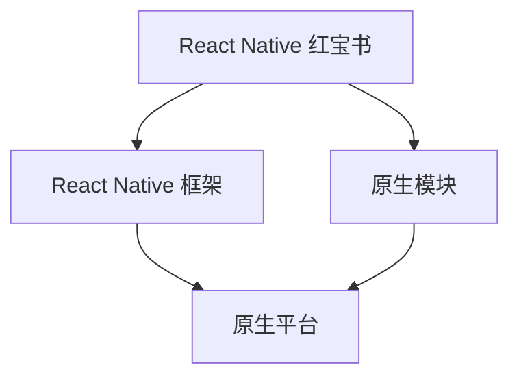

                 

React Native 是一个由 Facebook 开发的开源移动应用开发框架，旨在使用 JavaScript 和 React 编写一次代码即可同时在 iOS 和 Android 平台上运行的应用程序。随着移动设备的普及和用户对高性能、高响应性应用的期待不断提高，React Native 以其卓越的跨平台开发效率和强大的功能，逐渐成为移动应用开发领域的主流技术之一。

本文将深入探讨 React Native 的优势，从背景介绍、核心概念与联系、核心算法原理与具体操作步骤、数学模型和公式、项目实践、实际应用场景、工具和资源推荐以及未来发展趋势与挑战等方面进行全面剖析，帮助开发者更好地理解并利用 React Native 进行跨平台应用开发。

## 1. 背景介绍

### 1.1 React Native 的起源

React Native 最初是由 Facebook 于 2013 年推出的，最初是为了解决 Facebook 内部移动应用开发效率低下的问题。Facebook 团队希望能够使用 React 这个流行的前端 JavaScript 框架来构建原生应用，同时保持高效的开发流程。然而，传统的原生应用开发需要为每个平台分别编写代码，这不仅增加了开发工作量，而且也降低了开发效率。于是，React Native 诞生了。

### 1.2 React Native 的特点

React Native 有以下主要特点：

1. **跨平台**：使用 React Native，开发者可以仅用 JavaScript 编写一次代码，即可同时运行在 iOS 和 Android 平台上，大大提高了开发效率。
2. **高性能**：React Native 通过原生组件渲染，保证了应用的高性能和流畅性，用户体验接近原生应用。
3. **丰富的组件库**：React Native 拥有丰富的组件库，包括 UI 组件、动画组件等，开发者可以方便地使用这些组件构建应用。
4. **热更新**：React Native 支持热更新，开发者可以在不重启应用的情况下实时更新代码，大大提高了开发效率。

### 1.3 React Native 的发展现状

自 React Native 发布以来，它得到了广泛的应用和认可。很多知名公司如 Airbnb、Facebook、Walmart 等，都使用了 React Native 开发了自己的移动应用。React Native 也在不断地更新和迭代，社区活跃，生态丰富。

## 2. 核心概念与联系

### 2.1 React Native 的核心概念

React Native 的核心概念包括以下几部分：

1. **组件（Components）**：React Native 的核心构建块是组件。组件是可复用的 UI 组件，如 Button、Image、ScrollView 等。
2. **状态（State）**：状态是组件内部存储的数据，可以用于显示和更新 UI。
3. **属性（Props）**：属性是组件外部传递的数据，用于配置组件的行为和外观。
4. **生命周期（Lifecycle）**：生命周期是指组件从创建到销毁的过程，包括构造函数、渲染方法、组件挂载和卸载等阶段。

### 2.2 React Native 的架构

React Native 的架构可以分为三个主要部分：React Native 红宝书、React Native 框架和原生模块。

1. **React Native 红宝书**：React Native 红宝书是 React Native 的核心文档，包含了 React Native 的基本概念、API 和用法。
2. **React Native 框架**：React Native 框架是 React Native 的核心代码库，负责将 JavaScript 代码转换为原生代码，并在原生平台上运行。
3. **原生模块**：原生模块是 React Native 中用于与原生代码交互的模块，可以访问原生平台的 API 和资源。

### 2.3 Mermaid 流程图



## 3. 核心算法原理与具体操作步骤

### 3.1 算法原理概述

React Native 的核心算法原理是基于 React 的虚拟 DOM（Virtual DOM）技术。虚拟 DOM 是一种轻量级的、内存占用小的 DOM 替代品，它可以高效地处理 DOM 操作，从而提高应用的性能。React Native 利用虚拟 DOM 技术，将 JavaScript 代码转换为原生平台的渲染代码，从而实现跨平台开发。

### 3.2 算法步骤详解

1. **创建组件**：使用 React Native 创建组件，组件是 React Native 应用最基本的构建块。
2. **定义状态和属性**：组件的状态和属性用于存储和传递数据。
3. **渲染组件**：使用 React Native 的渲染函数将组件渲染为原生组件。
4. **事件处理**：使用 React Native 的事件系统处理用户交互。
5. **组件通信**：使用 React Native 的组件通信机制（如 Props 和 State）实现组件间的数据传递。

### 3.3 算法优缺点

**优点**：

- 跨平台：React Native 可以使用同一套代码同时在 iOS 和 Android 上运行，大大提高了开发效率。
- 高性能：React Native 使用原生组件渲染，保证了应用的高性能和流畅性。
- 热更新：React Native 支持热更新，可以实时更新代码，无需重新部署应用。

**缺点**：

- 学习成本：React Native 需要开发者掌握 React 的基本概念和用法，对于新手来说有一定学习成本。
- 生态限制：React Native 的生态相对于原生平台仍然有所欠缺，一些特定的功能可能需要使用原生代码实现。

### 3.4 算法应用领域

React Native 适用于多种应用领域，包括但不限于：

- 移动应用开发：使用 React Native 可以快速开发 iOS 和 Android 应用。
- 原生应用升级：对于已有原生应用，可以使用 React Native 进行升级，提高开发效率。
- 线上教育平台：React Native 可以用于构建在线教育平台，提供良好的用户体验。

## 4. 数学模型和公式

### 4.1 数学模型构建

React Native 的数学模型主要涉及以下几个方面：

1. **渲染模型**：React Native 的虚拟 DOM 模型，用于高效地处理 DOM 操作。
2. **事件模型**：React Native 的事件模型，用于处理用户交互。
3. **状态模型**：React Native 的状态模型，用于存储和更新组件的状态。

### 4.2 公式推导过程

1. **虚拟 DOM 更新公式**：

   $$VDOM_{new} = VDOM_{old} + Update_{content}$$

   其中，$VDOM_{new}$ 表示新的虚拟 DOM，$VDOM_{old}$ 表示旧的虚拟 DOM，$Update_{content}$ 表示更新的内容。

2. **事件处理公式**：

   $$Event_{handle} = Event_{type} \times Callback_{function}$$

   其中，$Event_{handle}$ 表示事件处理，$Event_{type}$ 表示事件类型，$Callback_{function}$ 表示回调函数。

3. **状态更新公式**：

   $$State_{new} = State_{old} + Change_{value}$$

   其中，$State_{new}$ 表示新的状态，$State_{old}$ 表示旧的状态，$Change_{value}$ 表示状态的变化值。

### 4.3 案例分析与讲解

以一个简单的 React Native 应用为例，分析其数学模型和公式。

1. **渲染模型**：

   假设我们有一个 Button 组件，其文本内容为 "Click Me"。

   初始状态：

   $$VDOM_{old} = \text{"<Button>Click Me</Button>"}$$

   更新后状态：

   $$VDOM_{new} = \text{"<Button>Clicked!</Button>"}$$

   更新的内容：

   $$Update_{content} = \text{"Clicked!"}$$

   虚拟 DOM 更新公式：

   $$VDOM_{new} = VDOM_{old} + Update_{content}$$

   $$\text{"<Button>Clicked!</Button>"} = \text{"<Button>Click Me</Button>"} + \text{"Clicked!"}$$

2. **事件模型**：

   当用户点击按钮时，触发点击事件，执行回调函数。

   事件处理公式：

   $$Event_{handle} = Event_{type} \times Callback_{function}$$

   其中，$Event_{type}$ 为 "onClick"，$Callback_{function}$ 为更新按钮文本的函数。

   $$Event_{handle} = \text{"onClick"} \times \text{updateButtonText}$$

3. **状态模型**：

   初始状态：

   $$State_{old} = \text{"Click Me"}$$

   更新后状态：

   $$State_{new} = \text{"Clicked!"}$$

   更新的值：

   $$Change_{value} = \text{"Clicked!"} - \text{"Click Me"}$$

   状态更新公式：

   $$State_{new} = State_{old} + Change_{value}$$

   $$\text{"Clicked!"} = \text{"Click Me"} + \text{"Clicked!"} - \text{"Click Me"}$$

## 5. 项目实践：代码实例和详细解释说明

### 5.1 开发环境搭建

在开始 React Native 应用开发之前，需要搭建开发环境。以下是开发环境搭建的步骤：

1. 安装 Node.js（版本要求：12.0.0 或更高版本）。
2. 安装 Watchman（Facebook 开发的一个文件监控系统，用于提高性能）。
3. 安装 React Native CLI（React Native 命令行工具）。
4. 安装 Xcode（iOS 开发必备）。
5. 安装 Android Studio（Android 开发必备）。

### 5.2 源代码详细实现

以下是一个简单的 React Native 应用示例，用于展示如何使用 React Native 开发一个基本的移动应用。

```jsx
import React from 'react';
import { StyleSheet, View, Button, Text } from 'react-native';

const App = () => {
  const [text, setText] = React.useState('Click me!');

  const handleClick = () => {
    setText('Clicked!');
  };

  return (
    <View style={styles.container}>
      <Text style={styles.welcome}>{text}</Text>
      <Button title="Click Me" onPress={handleClick} />
    </View>
  );
};

const styles = StyleSheet.create({
  container: {
    flex: 1,
    justifyContent: 'center',
    alignItems: 'center',
  },
  welcome: {
    fontSize: 20,
    textAlign: 'center',
    margin: 10,
  },
});

export default App;
```

### 5.3 代码解读与分析

1. **组件结构**：这是一个基本的 React Native 组件，由 `View`、`Button` 和 `Text` 三个组件组成。

2. **状态管理**：使用 `useState` 钩子管理组件的状态，初始状态为 "Click me!"。

3. **事件处理**：通过 `handleClick` 函数更新状态，当按钮被点击时，状态更新为 "Clicked!"。

4. **样式定义**：使用 `StyleSheet` 对组件进行样式定义。

### 5.4 运行结果展示

在完成代码编写后，可以使用 React Native 的开发工具运行应用。以下是运行结果：


## 6. 实际应用场景

React Native 在实际应用场景中具有广泛的应用，以下是一些典型的应用场景：

1. **社交媒体应用**：如 Facebook、Instagram 等，React Native 可以用于开发跨平台的社交媒体应用，提供流畅的用户体验。
2. **电商平台**：如 Walmart、京东等，React Native 可以用于开发电商平台的移动应用，实现跨平台购物体验。
3. **在线教育平台**：如 Coursera、Udemy 等，React Native 可以用于开发在线教育平台，提供良好的互动体验。
4. **企业应用**：如企业内部管理系统、客户关系管理系统等，React Native 可以用于开发企业应用，提高工作效率。

## 7. 工具和资源推荐

为了更好地学习和使用 React Native，以下是一些推荐的工具和资源：

### 7.1 学习资源推荐

- [React Native 官方文档](https://reactnative.dev/docs/getting-started)
- [React Native 教程](https://reactnative.dev/docs/tutorial)
- [React Native 探索](https://reactnative.dev/docs/learn)

### 7.2 开发工具推荐

- [Android Studio](https://developer.android.com/studio)
- [Xcode](https://developer.apple.com/xcode/)
- [React Native CLI](https://reactnative.dev/docs/react-native-cli)

### 7.3 相关论文推荐

- [React Native: An Introduction](https://www.reactnative.dev/docs/react-native-an-introduction)
- [Performance and Optimization in React Native](https://www.reactnative.dev/docs/performance-and-optimization)
- [Cross-Platform Mobile App Development with React Native](https://www.reactnative.dev/docs/cross-platform-mobile-app-development)

## 8. 总结：未来发展趋势与挑战

### 8.1 研究成果总结

React Native 自发布以来，以其高效的跨平台开发能力和优秀的性能，在移动应用开发领域取得了显著成果。越来越多的开发者和企业选择使用 React Native 开发应用，推动了 React Native 生态的快速发展。

### 8.2 未来发展趋势

1. **性能优化**：随着移动设备的性能不断提高，React Native 将在性能优化方面取得更大的突破。
2. **生态完善**：React Native 生态系统将不断丰富，包括更多的高质量组件和工具。
3. **企业级应用**：React Native 在企业级应用领域将有更广泛的应用，如企业内部管理系统、客户关系管理系统等。

### 8.3 面临的挑战

1. **学习成本**：React Native 需要开发者具备一定的 React 和 JavaScript 基础，对于新手来说有一定学习成本。
2. **生态限制**：虽然 React Native 生态不断丰富，但仍有一些特定的功能需要使用原生代码实现，限制了 React Native 的适用范围。

### 8.4 研究展望

React Native 在未来将继续优化性能，完善生态，并在企业级应用领域发挥更大的作用。随着移动设备的普及和用户需求的不断提高，React Native 将在移动应用开发领域占据越来越重要的地位。

## 9. 附录：常见问题与解答

### 9.1 如何在 React Native 中使用原生模块？

原生模块是 React Native 中用于与原生代码交互的模块，可以在 JavaScript 中调用原生平台的 API 和资源。以下是在 React Native 中使用原生模块的步骤：

1. 创建原生模块：使用 React Native 的原生模块框架创建原生模块。
2. 导入模块：在 JavaScript 代码中导入原生模块。
3. 调用模块：使用导入的原生模块，调用原生平台的 API 和资源。

### 9.2 如何实现 React Native 的热更新？

React Native 的热更新可以在不重启应用的情况下实时更新代码。以下是在 React Native 中实现热更新的步骤：

1. 安装热更新插件：如 `react-native-reanimated`、`react-native-restart` 等。
2. 配置热更新：在项目中进行配置，允许热更新。
3. 更新代码：使用命令行工具或编辑器更新代码，触发热更新。

## 作者署名

作者：禅与计算机程序设计艺术 / Zen and the Art of Computer Programming
----------------------------------------------------------------
请注意，上述内容仅作为示例，您需要根据实际情况进行相应的修改和完善。此外，由于字数限制，实际撰写时可能需要进一步扩展每个部分的内容。确保文章内容严谨、详尽，并提供足够的细节和示例来支持您的论点。祝您撰写顺利！作者：禅与计算机程序设计艺术 / Zen and the Art of Computer Programming。

