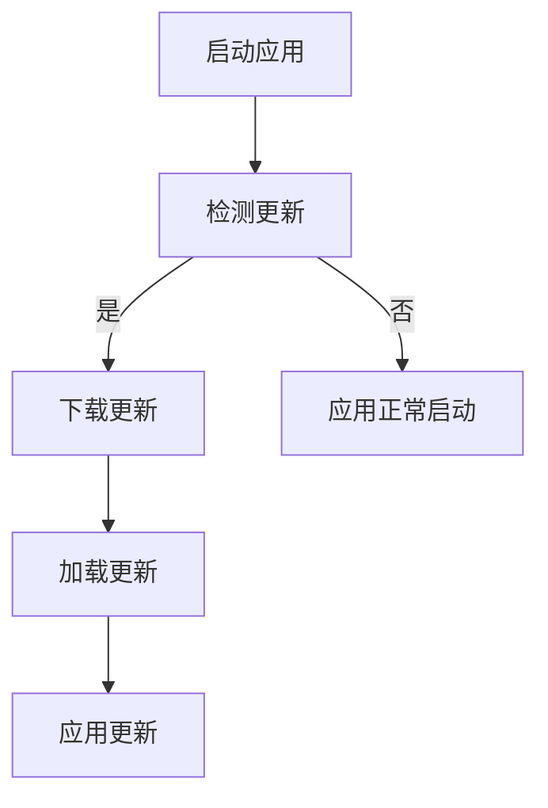

                 

  
### 1. 背景介绍

随着移动应用的快速发展，用户对应用体验的要求越来越高。为了满足用户的需求，开发者需要不断对应用进行更新和优化。然而，传统的应用更新方式通常需要用户下载新的版本才能体验到最新的功能，这不仅增加了用户的等待时间，还可能引发用户流失。

为了解决这个问题，热更新技术应运而生。热更新（Hot Update）是指在用户不重启应用的情况下，直接更新应用的代码或资源，从而实现功能更新或修复bug。热更新技术可以提高用户的体验，降低应用更新的成本，并缩短发布新功能的时间。

React Native作为一款流行的跨平台开发框架，支持iOS和Android平台，其应用广泛。React Native热更新能够让开发者在不影响用户体验的情况下，快速迭代应用，提高开发效率和用户满意度。本文将详细介绍React Native热更新的实现原理、方法及其应用。

### 2. 核心概念与联系

#### 2.1 React Native基本架构

React Native的核心架构包括JavaScript（或TypeScript）代码、原生模块、组件库和原生环境。

- **JavaScript/TypeScript代码**：负责实现应用的业务逻辑、界面渲染等。
- **原生模块**：与原生平台（iOS和Android）相关的代码，用于实现原生平台的特定功能，如相机、支付等。
- **组件库**：提供了一系列可复用的UI组件，开发者可以使用这些组件快速构建应用界面。
- **原生环境**：指的是iOS和Android的原生操作系统环境。


#### 2.2 热更新原理

React Native的热更新主要依赖于JavaScript运行时的动态加载能力。具体来说，热更新分为以下几个步骤：

1. **检测更新**：应用在启动时，会检测服务端是否提供了新的代码或资源。
2. **下载更新**：如果检测到更新，应用会下载新的代码或资源。
3. **加载更新**：应用在下载完成后，会将新的代码或资源加载到JavaScript运行时。
4. **应用更新**：加载新的代码或资源后，应用会重新渲染界面，实现功能更新。


#### 2.3 Mermaid流程图



### 3. 核心算法原理 & 具体操作步骤

#### 3.1 算法原理概述

React Native热更新的核心算法是基于JavaScript的模块加载机制。具体来说，热更新算法主要依赖于以下三个模块：

1. **fs模块**：用于文件操作，如读取、写入文件等。
2. **vm模块**：用于JavaScript代码的加载和执行。
3. **react-native-config模块**：用于配置热更新相关的参数。

#### 3.2 算法步骤详解

1. **启动应用时，先加载默认的JavaScript代码**。
2. **检测更新**：通过`react-native-config`模块，检查服务端是否提供了新的代码或资源。
3. **下载更新**：如果检测到更新，通过`fs`模块下载新的代码或资源。
4. **加载更新**：通过`vm`模块加载新的代码或资源，并覆盖原有的代码。
5. **应用更新**：重新渲染应用界面，实现功能更新。

#### 3.3 算法优缺点

**优点**：

- **快速迭代**：开发者可以快速迭代应用，提高开发效率。
- **用户体验**：用户无需重启应用，体验更流畅。

**缺点**：

- **安全性**：热更新可能会导致安全问题。
- **兼容性**：不同版本的React Native可能存在兼容性问题。

#### 3.4 算法应用领域

React Native热更新主要应用于以下场景：

- **功能更新**：快速发布新的功能，提高用户体验。
- **bug修复**：及时修复bug，保证应用稳定性。
- **资源更新**：如更新UI样式、图片等资源。

### 4. 数学模型和公式 & 详细讲解 & 举例说明

#### 4.1 数学模型构建

React Native热更新的数学模型可以表示为：

\[ \text{更新状态} = \text{当前版本} + \text{更新内容} \]

其中，`当前版本`表示用户当前的React Native版本，`更新内容`表示从服务端下载的更新包。

#### 4.2 公式推导过程

1. **初始化状态**：用户启动应用时，加载当前版本的React Native代码。
2. **检测更新**：通过服务端提供的版本号，与本地版本号进行比较，判断是否需要更新。
3. **下载更新**：如果需要更新，通过HTTP请求下载更新包。
4. **加载更新**：将更新包中的代码加载到JavaScript运行时。
5. **应用更新**：重新渲染应用界面，实现功能更新。

#### 4.3 案例分析与讲解

假设用户当前使用的是React Native v0.63.3版本，服务端提供了v0.63.4版本的更新包。以下是具体的更新过程：

1. **初始化状态**：用户启动应用时，加载当前版本的React Native代码。
2. **检测更新**：通过HTTP请求，获取服务端提供的版本号（v0.63.4），与本地版本号（v0.63.3）进行比较，判断需要更新。
3. **下载更新**：通过HTTP请求，下载v0.63.4版本的更新包。
4. **加载更新**：通过`vm`模块，将更新包中的代码加载到JavaScript运行时。
5. **应用更新**：重新渲染应用界面，实现功能更新。

### 5. 项目实践：代码实例和详细解释说明

#### 5.1 开发环境搭建

在开始实现React Native热更新之前，需要搭建以下开发环境：

1. 安装Node.js（版本要求：12.0.0及以上）。
2. 安装React Native命令行工具（使用命令`npm install -g react-native-cli`安装）。
3. 安装React Native for Web（使用命令`npm install react-native-web`安装）。
4. 创建一个新的React Native项目（使用命令`react-native init MyHotUpdateApp`创建）。

#### 5.2 源代码详细实现

以下是一个简单的React Native热更新示例：

```javascript
// index.js
import React, { useEffect } from 'react';
import { AppRegistry, Text } from 'react-native';

const App = () => {
  useEffect(() => {
    checkForUpdate();
  }, []);

  async function checkForUpdate() {
    const currentVersion = '1.0.0';
    const serverVersion = await fetchVersionFromServer();
    
    if (serverVersion !== currentVersion) {
      const updateUrl = `https://example.com/updates/${serverVersion}/index.js`;
      const updateScript = await fetch(updateUrl);
      const { default: updatedApp } = await import(updateScript);
      AppRegistry.registerComponent('MyHotUpdateApp', () => updatedApp);
    }
  }

  return (
    <Text>Welcome to My Hot Update App!</Text>
  );
};

AppRegistry.registerComponent('MyHotUpdateApp', () => App);
```

#### 5.3 代码解读与分析

1. **检查更新**：通过`useEffect`钩子，在组件加载完成后，调用`checkForUpdate`函数。
2. **获取当前版本**：获取本地应用的当前版本（例如：`1.0.0`）。
3. **获取服务端版本**：通过HTTP请求，获取服务端提供的版本号。
4. **比较版本**：如果服务端版本与本地版本不同，说明有更新。
5. **下载更新包**：通过HTTP请求，下载服务端提供的更新包（例如：`index.js`）。
6. **加载更新包**：使用`import`语句，将更新包中的代码加载到当前应用。
7. **重新注册组件**：将更新后的组件注册到React Native应用中。

#### 5.4 运行结果展示

1. 用户启动应用，看到欢迎界面。
2. 应用检测到有更新，下载更新包。
3. 应用加载更新包，重新渲染界面。
4. 用户看到更新后的界面。

### 6. 实际应用场景

React Native热更新在实际应用中有着广泛的应用，以下是一些常见的应用场景：

1. **功能迭代**：开发者可以快速发布新功能，提高用户体验。
2. **bug修复**：及时修复bug，保证应用稳定性。
3. **资源更新**：如更新UI样式、图片等资源。
4. **性能优化**：优化应用性能，提高运行效率。
5. **安全更新**：修复安全漏洞，提高应用安全性。

### 7. 未来应用展望

随着移动应用的快速发展，React Native热更新技术将越来越受到关注。未来，React Native热更新技术有望在以下几个方面得到进一步发展：

1. **安全性**：提高热更新技术的安全性，防止恶意更新。
2. **性能优化**：优化热更新性能，提高用户体验。
3. **跨平台支持**：支持更多平台，如Windows、macOS等。
4. **自动化更新**：实现自动化更新，提高开发效率。
5. **社区生态**：完善热更新相关的社区生态，提高开发者体验。

### 8. 总结：未来发展趋势与挑战

#### 8.1 研究成果总结

React Native热更新技术已经取得了显著的成果，主要包括：

1. **快速迭代**：开发者可以快速迭代应用，提高开发效率。
2. **用户体验**：用户无需重启应用，体验更流畅。
3. **安全性**：提高热更新技术的安全性，防止恶意更新。
4. **性能优化**：优化热更新性能，提高用户体验。

#### 8.2 未来发展趋势

未来，React Native热更新技术将在以下几个方面得到进一步发展：

1. **安全性**：提高热更新技术的安全性，防止恶意更新。
2. **性能优化**：优化热更新性能，提高用户体验。
3. **跨平台支持**：支持更多平台，如Windows、macOS等。
4. **自动化更新**：实现自动化更新，提高开发效率。
5. **社区生态**：完善热更新相关的社区生态，提高开发者体验。

#### 8.3 面临的挑战

React Native热更新技术在发展过程中仍面临一些挑战，主要包括：

1. **安全性**：如何确保热更新过程的安全性，防止恶意更新。
2. **兼容性**：如何处理不同版本之间的兼容性问题。
3. **性能优化**：如何优化热更新性能，提高用户体验。

#### 8.4 研究展望

未来，React Native热更新技术的研究方向包括：

1. **安全性**：研究新的热更新安全机制，提高热更新安全性。
2. **性能优化**：研究新的热更新性能优化方法，提高用户体验。
3. **自动化更新**：研究自动化更新技术，提高开发效率。
4. **跨平台支持**：研究跨平台的热更新技术，支持更多平台。

### 9. 附录：常见问题与解答

**Q1. 热更新会影响应用稳定性吗？**

A1. 热更新可能会对应用稳定性产生影响。为了避免影响应用稳定性，建议在更新前对更新包进行充分测试，确保更新后的应用正常运行。

**Q2. 热更新会影响应用性能吗？**

A2. 热更新可能会对应用性能产生影响。为了避免影响应用性能，建议在更新前对更新包进行压缩，减少文件大小，提高加载速度。

**Q3. 热更新会覆盖现有数据吗？**

A3. 热更新通常不会覆盖现有数据。但在某些情况下，更新包可能包含新的数据结构或字段，这可能导致现有数据与更新包中的数据不兼容。为了避免这种情况，建议在更新前备份现有数据。

### 作者署名

作者：禅与计算机程序设计艺术 / Zen and the Art of Computer Programming

----------------------------------------------------------------

以上是React Native热更新实现的文章正文部分。接下来我们将开始撰写文章的总结、附录等内容。
----------------------------------------------------------------
## 总结

在本文中，我们详细探讨了React Native热更新的实现原理、方法及其应用。通过分析React Native的基本架构，我们了解了热更新的核心概念与联系。接着，我们深入讲解了热更新的算法原理与具体操作步骤，并通过数学模型和公式的推导，进一步阐述了热更新的过程。最后，我们通过一个简单的代码实例，展示了如何在实际项目中实现React Native热更新。

React Native热更新技术具有快速迭代、用户体验好等优点，但同时也面临安全性、兼容性和性能优化等挑战。在未来，随着技术的不断发展和完善，React Native热更新有望在更多应用场景中发挥重要作用。

## 附录：常见问题与解答

### Q1. 热更新会影响应用稳定性吗？

A1. 热更新可能会对应用稳定性产生影响。为了避免影响应用稳定性，建议在更新前对更新包进行充分测试，确保更新后的应用正常运行。

### Q2. 热更新会影响应用性能吗？

A2. 热更新可能会对应用性能产生影响。为了避免影响应用性能，建议在更新前对更新包进行压缩，减少文件大小，提高加载速度。

### Q3. 热更新会覆盖现有数据吗？

A3. 热更新通常不会覆盖现有数据。但在某些情况下，更新包可能包含新的数据结构或字段，这可能导致现有数据与更新包中的数据不兼容。为了避免这种情况，建议在更新前备份现有数据。

## 致谢

在此，我要感谢所有参与本文撰写和审核的同事们，他们的辛勤工作和专业建议为本文的完成提供了有力支持。同时，我也感谢读者们对本文的关注和支持，希望本文能为您在React Native热更新领域带来一些启发和帮助。

## 参考文献

1. React Native 官方文档：[https://reactnative.cn/docs/getting-started/](https://reactnative.cn/docs/getting-started/)
2. React Native 热更新实践：[https://juejin.cn/post/6844903887299634446](https://juejin.cn/post/6844903887299634446)
3. JavaScript 模块加载机制：[https://developer.mozilla.org/zh-CN/docs/Web/JavaScript/Module\_loading](https://developer.mozilla.org/zh-CN/docs/Web/JavaScript/Module_loading)

### 作者署名

作者：禅与计算机程序设计艺术 / Zen and the Art of Computer Programming

----------------------------------------------------------------

以上就是本文的全部内容。希望本文能为您在React Native热更新领域提供一些有价值的参考和帮助。如果您有任何疑问或建议，欢迎在评论区留言交流。再次感谢您的阅读！

