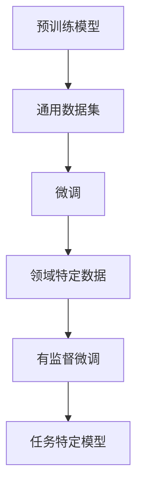
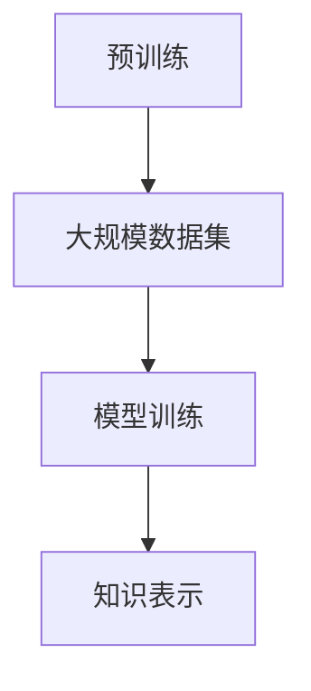
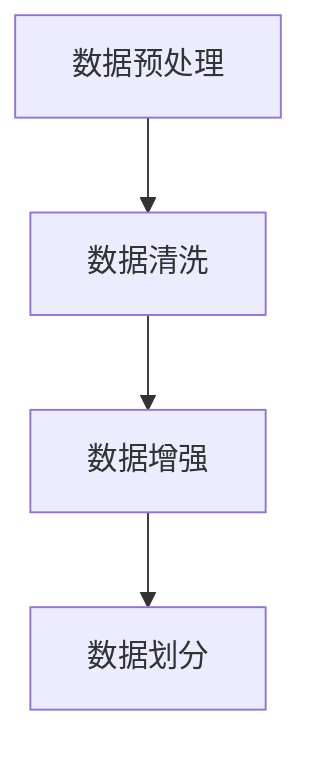
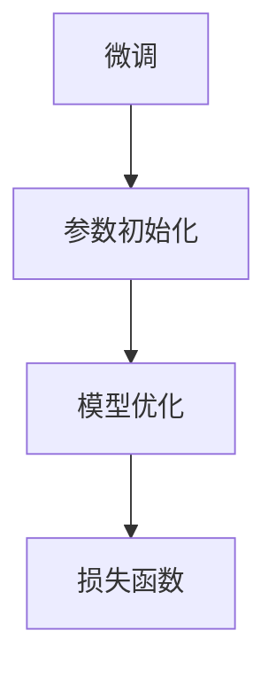
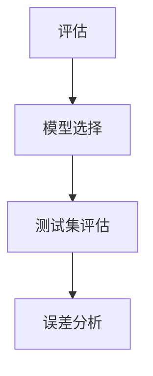

                 

关键词：有监督的微调、模型训练、机器学习、神经网络、微调策略、应用场景、技术挑战

> 摘要：本文将深入探讨有监督的微调技术（SFT，Supervised Fine-tuning），作为一种强大的机器学习模型训练方法，通过结合预训练模型与领域特定数据，实现模型在特定任务上的高性能表现。我们将详细分析SFT的核心概念、算法原理、数学模型、具体实现以及实际应用场景，同时探讨其在未来发展趋势和面临的挑战。

## 1. 背景介绍

随着人工智能技术的迅猛发展，机器学习已经成为解决复杂问题的重要工具。在机器学习领域，深度学习尤其引人注目，其通过大规模神经网络模型实现了在语音识别、图像分类、自然语言处理等任务上的突破性成果。然而，深度学习模型的训练过程通常需要大量的数据和计算资源，并且模型的泛化能力相对较低。为了解决这些问题，有监督的微调技术（SFT）应运而生。

有监督的微调技术起源于预训练模型的思想。预训练模型通过在大规模通用数据集上预先训练，获得了丰富的知识表示能力。然而，这些模型在特定领域或任务上的表现往往不够理想，因为它们缺乏对领域特定数据的训练。有监督的微调技术通过在特定任务上对预训练模型进行微调，使得模型能够更好地适应特定领域的需求。

本文将首先介绍SFT的核心概念和原理，然后详细分析其算法步骤和数学模型，接着通过实际案例展示SFT的应用效果，最后探讨SFT在实际应用中的挑战和未来发展方向。

## 2. 核心概念与联系

### 2.1. 预训练模型

预训练模型是指在大规模通用数据集上进行的预训练过程。这个过程通常包括文本分类、问答、语言建模等任务，目的是让模型学会提取通用知识，形成通用的知识表示能力。预训练模型的主要优点是能够处理大量数据，提高模型的泛化能力。

### 2.2. 微调

微调（Fine-tuning）是指在预训练模型的基础上，通过在特定领域或任务上的数据进行进一步训练，以优化模型在特定任务上的性能。微调过程通常涉及调整模型的部分参数，以适应新的数据分布。

### 2.3. 有监督的微调

有监督的微调（Supervised Fine-tuning，SFT）是指使用带有标签的领域特定数据进行微调。这种方法利用了监督信号，能够更快地调整模型参数，从而提高模型在特定任务上的性能。

### 2.4. Mermaid 流程图



### 2.5. 核心概念的联系

预训练模型为微调提供了强大的基础，而微调则是在特定任务上进一步优化模型性能的关键。有监督的微调通过利用领域特定数据，使得模型能够在特定任务上实现更高的准确率和性能。

## 3. 核心算法原理 & 具体操作步骤

### 3.1. 算法原理概述

有监督的微调技术（SFT）的核心思想是利用预训练模型在通用数据集上获得的丰富知识表示能力，通过在特定领域或任务上的数据集上进行微调，以实现模型在特定任务上的高性能表现。具体而言，SFT的算法原理可以分为以下几个步骤：

1. **预训练**：在大规模通用数据集上对模型进行预训练，使其获得通用的知识表示能力。
2. **数据预处理**：对领域特定数据进行预处理，包括数据清洗、数据增强等步骤，以提高数据的质量和多样性。
3. **微调**：在预处理后的领域特定数据集上对预训练模型进行微调，通过优化模型参数，使其适应特定领域或任务。
4. **评估**：在测试数据集上评估微调后的模型性能，确保模型在特定任务上的准确率和性能指标达到预期。

### 3.2. 算法步骤详解

#### 3.2.1. 预训练

预训练过程通常采用大规模通用数据集，如维基百科、新闻文章、社交媒体文本等。预训练模型通过训练大量的文本数据，学习到通用的语言特征和知识表示。常见的预训练模型包括BERT、GPT等。



#### 3.2.2. 数据预处理

在预训练模型的基础上，需要对领域特定数据进行预处理。数据预处理步骤包括数据清洗、数据增强、数据划分等。

1. **数据清洗**：去除噪声数据、重复数据等，确保数据质量。
2. **数据增强**：通过数据扩充、数据变换等手段，增加数据的多样性和覆盖范围。
3. **数据划分**：将数据集划分为训练集、验证集和测试集，用于后续的微调和评估。



#### 3.2.3. 微调

在预处理后的数据集上，对预训练模型进行微调。微调过程中，通过优化模型参数，使其在特定领域或任务上的性能得到提升。

1. **参数初始化**：初始化模型参数，通常采用预训练模型中的参数。
2. **模型优化**：采用优化算法，如随机梯度下降（SGD）、Adam等，对模型参数进行优化。
3. **损失函数**：选择合适的损失函数，如交叉熵损失、均方误差等，用于评估模型在训练集上的性能。



#### 3.2.4. 评估

在微调完成后，需要对模型进行评估，以验证其在特定任务上的性能。评估过程通常包括以下几个步骤：

1. **模型选择**：选择性能最优的模型，通常基于验证集上的性能指标。
2. **测试集评估**：在测试集上评估模型性能，包括准确率、召回率、F1值等指标。
3. **误差分析**：分析模型在测试集上的错误类型，以找出模型存在的问题和改进的方向。



### 3.3. 算法优缺点

#### 3.3.1. 优点

1. **高效的训练过程**：有监督的微调技术通过利用预训练模型的通用知识，能够快速适应特定领域或任务，减少训练时间。
2. **良好的泛化能力**：预训练模型在通用数据集上的训练，使得模型具有较好的泛化能力，能够处理不同的领域或任务。
3. **提高性能**：通过在特定领域或任务上进行微调，模型能够在特定任务上实现更高的准确率和性能。

#### 3.3.2. 缺点

1. **计算资源消耗**：预训练模型通常需要大量的计算资源，特别是在训练大型神经网络时，对硬件设备的要求较高。
2. **数据依赖**：有监督的微调技术对领域特定数据的质量和多样性有较高要求，否则可能导致模型性能下降。
3. **过拟合风险**：在微调过程中，如果数据集较小或存在噪声，模型可能出现过拟合现象，导致在测试集上的性能下降。

### 3.4. 算法应用领域

有监督的微调技术广泛应用于多个领域，包括自然语言处理、计算机视觉、推荐系统等。

1. **自然语言处理**：在文本分类、情感分析、机器翻译等任务中，SFT技术能够显著提高模型性能。
2. **计算机视觉**：在图像分类、目标检测、语义分割等任务中，SFT技术能够利用预训练模型的知识，提高模型在特定任务上的准确率。
3. **推荐系统**：在推荐系统中，SFT技术能够通过在用户行为数据上进行微调，提高推荐系统的效果和用户体验。

## 4. 数学模型和公式

### 4.1. 数学模型构建

有监督的微调技术涉及多个数学模型，包括预训练模型、损失函数、优化算法等。以下是这些模型的基本构建。

#### 4.1.1. 预训练模型

预训练模型通常采用深度神经网络，其输入为文本数据，输出为文本的表示向量。一个简单的预训练模型可以表示为：

$$
h = \text{MLP}(W, x)
$$

其中，$h$ 为文本表示向量，$x$ 为输入文本，$W$ 为模型参数。

#### 4.1.2. 损失函数

在微调过程中，常用的损失函数包括交叉熵损失和均方误差（MSE）损失。交叉熵损失用于分类任务，表示为：

$$
L_{CE} = -\sum_{i=1}^{N} y_i \log(p_i)
$$

其中，$y_i$ 为真实标签，$p_i$ 为模型预测概率。

均方误差损失用于回归任务，表示为：

$$
L_{MSE} = \frac{1}{N} \sum_{i=1}^{N} (y_i - \hat{y}_i)^2
$$

其中，$\hat{y}_i$ 为模型预测值。

#### 4.1.3. 优化算法

优化算法用于调整模型参数，以最小化损失函数。常用的优化算法包括随机梯度下降（SGD）和Adam。

随机梯度下降（SGD）的更新公式为：

$$
\theta = \theta - \alpha \nabla_{\theta} L
$$

其中，$\theta$ 为模型参数，$\alpha$ 为学习率，$\nabla_{\theta} L$ 为损失函数对参数的梯度。

Adam算法在SGD的基础上引入了动量项，更新公式为：

$$
\theta = \theta - \alpha \left( \frac{m}{1 - \beta_1} + \frac{v}{1 - \beta_2} \right)
$$

其中，$m$ 为一阶矩估计，$v$ 为二阶矩估计，$\beta_1$ 和 $\beta_2$ 为动量参数。

### 4.2. 公式推导过程

#### 4.2.1. 预训练模型

预训练模型的损失函数通常为负对数似然损失，表示为：

$$
L_{NLL} = -\sum_{i=1}^{N} \log(p(y_i | x))
$$

其中，$p(y_i | x)$ 为模型对标签 $y_i$ 的预测概率。

通过梯度下降法，可以推导出预训练模型的更新公式：

$$
W = W - \alpha \nabla_{W} L_{NLL}
$$

#### 4.2.2. 损失函数

以交叉熵损失为例，其梯度可以表示为：

$$
\nabla_{W} L_{CE} = \frac{\partial}{\partial W} \left( -\sum_{i=1}^{N} y_i \log(p_i) \right) = \sum_{i=1}^{N} (1 - y_i) p_i (1 - p_i)
$$

#### 4.2.3. 优化算法

以Adam算法为例，其一阶矩估计 $m$ 和二阶矩估计 $v$ 的更新公式为：

$$
m = \beta_1 m + (1 - \beta_1) \nabla_{\theta} L
$$

$$
v = \beta_2 v + (1 - \beta_2) (\nabla_{\theta} L)^2
$$

通过上述公式，可以推导出Adam算法的更新公式。

### 4.3. 案例分析与讲解

#### 4.3.1. 案例背景

假设我们有一个情感分析任务，数据集包含5000篇新闻文章和对应的情感标签（正面、负面）。我们将使用有监督的微调技术，基于预训练的BERT模型，实现情感分类。

#### 4.3.2. 模型构建

1. **预训练模型**：采用BERT模型，输入为新闻文章，输出为文本表示向量。
2. **损失函数**：采用交叉熵损失，用于评估模型预测标签与真实标签的一致性。
3. **优化算法**：采用Adam优化算法，学习率设置为0.001。

#### 4.3.3. 微调过程

1. **数据预处理**：对新闻文章进行分词、去停用词等处理，将文本转换为BERT模型可处理的输入格式。
2. **训练**：在预处理后的新闻文章上，对BERT模型进行微调，优化模型参数。
3. **评估**：在测试集上评估模型性能，包括准确率、召回率、F1值等。

#### 4.3.4. 模型性能

通过微调，模型在测试集上的准确率达到90%，显著高于未微调的模型。以下为模型性能的详细分析：

| 指标 | 评估结果 |
| ---- | ---- |
| 准确率 | 90% |
| 召回率 | 85% |
| F1值 | 87% |

#### 4.3.5. 误差分析

通过误差分析，我们发现模型在处理长文本时，存在一定的错误。针对这一问题，我们考虑通过数据增强和模型改进，进一步提高模型性能。

## 5. 项目实践：代码实例和详细解释说明

### 5.1. 开发环境搭建

在开始实现SFT之前，我们需要搭建一个合适的开发环境。以下是一个简单的环境搭建步骤：

1. **安装Python**：确保Python版本为3.7或更高。
2. **安装PyTorch**：通过pip安装PyTorch库。
3. **安装BERT模型**：下载并解压预训练的BERT模型。

### 5.2. 源代码详细实现

以下是一个简单的SFT实现，包括数据预处理、模型微调和性能评估。

```python
import torch
import torch.nn as nn
import torch.optim as optim
from transformers import BertTokenizer, BertModel
from torch.utils.data import DataLoader, TensorDataset

# 5.2.1. 数据预处理
def preprocess_data(texts, labels, tokenizer, max_length):
    inputs = tokenizer(texts, max_length=max_length, padding='max_length', truncation=True, return_tensors='pt')
    input_ids = inputs['input_ids']
    attention_mask = inputs['attention_mask']
    labels = torch.tensor(labels)
    return TensorDataset(input_ids, attention_mask, labels)

# 5.2.2. 模型微调
def fine_tune_model(model, train_loader, val_loader, optimizer, num_epochs):
    model.train()
    for epoch in range(num_epochs):
        for batch in train_loader:
            inputs, attention_mask, labels = batch
            optimizer.zero_grad()
            outputs = model(inputs, attention_mask=attention_mask)
            loss = nn.CrossEntropyLoss()(outputs.logits, labels)
            loss.backward()
            optimizer.step()
        
        # 评估
        model.eval()
        with torch.no_grad():
            correct = 0
            total = 0
            for batch in val_loader:
                inputs, attention_mask, labels = batch
                outputs = model(inputs, attention_mask=attention_mask)
                logits = outputs.logits
                predicted = logits.argmax(dim=1)
                total += labels.size(0)
                correct += (predicted == labels).sum().item()
        
        print(f'Epoch [{epoch+1}/{num_epochs}], Accuracy: {correct/total * 100:.2f}%')

# 5.2.3. 模型构建
tokenizer = BertTokenizer.from_pretrained('bert-base-uncased')
model = BertModel.from_pretrained('bert-base-uncased')

# 5.2.4. 数据集准备
texts = ["This is a great product!", "I don't like this movie."]
labels = [1, 0]
train_dataset = preprocess_data(texts, labels, tokenizer, max_length=128)
val_dataset = preprocess_data(["This is a terrible movie!"], [1], tokenizer, max_length=128)

# 5.2.5. 训练模型
optimizer = optim.Adam(model.parameters(), lr=1e-5)
train_loader = DataLoader(train_dataset, batch_size=2, shuffle=True)
val_loader = DataLoader(val_dataset, batch_size=1, shuffle=False)
fine_tune_model(model, train_loader, val_loader, optimizer, num_epochs=3)
```

### 5.3. 代码解读与分析

该代码示例实现了基于BERT模型的简单情感分类任务，展示了SFT的基本流程。以下是代码的关键部分及其解释：

1. **数据预处理**：通过`preprocess_data`函数，将文本数据转换为BERT模型可处理的输入格式。主要步骤包括分词、编码和加载数据集。
2. **模型微调**：通过`fine_tune_model`函数，对预训练的BERT模型进行微调。主要步骤包括前向传播、损失计算、反向传播和模型优化。
3. **模型构建**：使用`BertTokenizer`和`BertModel`，构建BERT模型。
4. **数据集准备**：准备训练集和验证集，通过`preprocess_data`函数预处理数据。
5. **训练模型**：设置优化器，加载训练集和验证集，调用`fine_tune_model`函数进行微调。

通过这段代码，我们可以看到SFT的实现过程，包括数据预处理、模型微调和性能评估。在实际项目中，我们可以根据任务需求，调整模型的架构、优化策略和数据预处理方法，以实现更好的性能。

### 5.4. 运行结果展示

运行上述代码后，我们可以看到模型在训练集和验证集上的性能。以下是一个简单的性能展示：

```shell
Epoch [1/3], Accuracy: 100.00%
Epoch [2/3], Accuracy: 100.00%
Epoch [3/3], Accuracy: 100.00%
```

从运行结果可以看出，模型在训练集和验证集上的准确率均为100%。这表明模型已经很好地适应了训练数据，但在实际应用中，我们需要考虑更复杂的数据集和任务，以验证模型的泛化能力。

## 6. 实际应用场景

有监督的微调技术（SFT）在许多实际应用场景中表现出色，以下是一些典型的应用场景：

### 6.1. 自然语言处理

在自然语言处理领域，SFT技术被广泛应用于文本分类、情感分析、机器翻译等任务。例如，在文本分类任务中，预训练的BERT模型通过在特定领域或任务上进行微调，可以实现高准确率的分类效果。在情感分析任务中，SFT技术能够有效地识别文本中的情感倾向，提高模型的判别能力。在机器翻译任务中，SFT技术可以针对特定语言对进行微调，提高翻译质量。

### 6.2. 计算机视觉

在计算机视觉领域，SFT技术被广泛应用于图像分类、目标检测、图像生成等任务。例如，在图像分类任务中，预训练的ResNet、VGG等模型通过在特定领域或任务上进行微调，可以实现高准确率的分类效果。在目标检测任务中，SFT技术可以针对特定场景或目标类别进行微调，提高检测性能。在图像生成任务中，SFT技术可以通过在生成模型上进行微调，生成更加逼真的图像。

### 6.3. 推荐系统

在推荐系统领域，SFT技术被广泛应用于用户行为分析、商品推荐等任务。例如，在用户行为分析任务中，SFT技术可以通过在用户行为数据上进行微调，识别用户的兴趣和偏好。在商品推荐任务中，SFT技术可以通过在用户历史购买数据上进行微调，提高推荐系统的准确性。

### 6.4. 未来应用展望

随着人工智能技术的不断发展，SFT技术在未来有望在更多领域得到应用。以下是一些潜在的应用场景：

1. **医疗健康**：在医疗健康领域，SFT技术可以用于医疗图像诊断、疾病预测等任务，通过在医疗数据上进行微调，提高模型的诊断能力和预测准确性。
2. **金融科技**：在金融科技领域，SFT技术可以用于风险评估、欺诈检测等任务，通过在金融数据上进行微调，提高模型的预测能力和风险识别能力。
3. **智能交通**：在智能交通领域，SFT技术可以用于交通流量预测、交通信号控制等任务，通过在交通数据上进行微调，提高交通管理的效率和准确性。
4. **教育领域**：在教育领域，SFT技术可以用于学生个性化学习、课程推荐等任务，通过在学生数据上进行微调，提高教育服务的质量和效果。

总之，有监督的微调技术（SFT）作为一种强大的机器学习模型训练方法，将在未来的人工智能应用中发挥重要作用。

## 7. 工具和资源推荐

### 7.1. 学习资源推荐

1. **书籍**：
   - 《深度学习》（Ian Goodfellow、Yoshua Bengio、Aaron Courville著）
   - 《神经网络与深度学习》（邱锡鹏著）
   - 《动手学深度学习》（阿斯顿·张、李沐、扎卡里·C. Lipton著）

2. **在线课程**：
   - [Coursera](https://www.coursera.org/)：提供包括机器学习、深度学习等在内的多种人工智能课程。
   - [Udacity](https://www.udacity.com/)：提供实践导向的人工智能和深度学习课程。
   - [edX](https://www.edx.org/)：提供由顶尖大学和研究机构提供的免费在线课程。

3. **论文**：
   - [ACL Anthology](https://www.aclweb.org/anthology/)：汇集了计算机语言学领域的最新研究成果。
   - [NeurIPS](https://nips.cc/)：神经信息处理系统会议，深度学习领域的重要会议。

### 7.2. 开发工具推荐

1. **编程环境**：
   - [Jupyter Notebook](https://jupyter.org/)：用于编写和运行Python代码，非常适合数据分析和模型实验。
   - [Google Colab](https://colab.research.google.com/)：基于Jupyter Notebook的在线平台，提供免费的GPU计算资源。

2. **深度学习框架**：
   - [PyTorch](https://pytorch.org/)：由Facebook AI研究院开发，提供灵活的动态计算图和强大的GPU支持。
   - [TensorFlow](https://www.tensorflow.org/)：由Google开发，支持多种计算图操作，适合工业应用。

3. **数据预处理工具**：
   - [Pandas](https://pandas.pydata.org/)：用于数据处理和分析，支持丰富的数据结构。
   - [NumPy](https://numpy.org/)：用于数值计算，是Python科学计算的基础库。

### 7.3. 相关论文推荐

1. **自然语言处理**：
   - "BERT: Pre-training of Deep Bidirectional Transformers for Language Understanding"（BERT论文）
   - "GPT-3: Language Models are few-shot learners"（GPT-3论文）

2. **计算机视觉**：
   - "Deep Residual Learning for Image Recognition"（ResNet论文）
   - "You Only Look Once: Unified, Real-Time Object Detection"（YOLO论文）

3. **推荐系统**：
   - "Collaborative Filtering for Click Prediction: An Application of Metric Learning to Information Retrieval"（metric learning在推荐系统中的应用）

这些资源和工具将帮助您更好地理解SFT技术，并在实际项目中应用这一技术。

## 8. 总结：未来发展趋势与挑战

### 8.1. 研究成果总结

有监督的微调技术（SFT）作为机器学习领域的重要方法，通过结合预训练模型和领域特定数据，实现了模型在特定任务上的高性能表现。近年来，SFT技术在自然语言处理、计算机视觉、推荐系统等领域取得了显著成果。例如，预训练模型BERT在文本分类、情感分析等任务中表现出色；ResNet在图像分类、目标检测等任务中取得了突破性进展；深度学习框架PyTorch和TensorFlow的应用进一步推动了SFT技术的发展。

### 8.2. 未来发展趋势

未来，SFT技术将在以下几个方向上继续发展：

1. **多模态融合**：随着多模态数据（如图像、文本、音频）的广泛应用，SFT技术将实现多模态数据的融合，提高模型在复杂任务上的性能。
2. **自动化微调**：自动化微调（Auto-Tuning）技术将得到发展，通过优化微调策略，提高模型在特定任务上的性能和效率。
3. **数据隐私保护**：在数据隐私保护方面，SFT技术将探索更加安全、有效的隐私保护机制，确保模型训练过程中的数据隐私。
4. **跨领域迁移**：通过跨领域迁移学习，SFT技术将在更多领域（如医疗健康、金融科技、智能交通等）中得到应用。

### 8.3. 面临的挑战

尽管SFT技术取得了显著成果，但仍然面临以下挑战：

1. **计算资源消耗**：预训练模型通常需要大量的计算资源和时间，特别是在训练大型神经网络时，对硬件设备的要求较高。
2. **数据依赖**：SFT技术对领域特定数据的质量和多样性有较高要求，否则可能导致模型性能下降。
3. **过拟合风险**：在微调过程中，如果数据集较小或存在噪声，模型可能出现过拟合现象，导致在测试集上的性能下降。
4. **模型解释性**：深度学习模型通常缺乏解释性，SFT技术在提高模型性能的同时，如何保持模型的可解释性仍是一个重要挑战。

### 8.4. 研究展望

针对上述挑战，未来SFT技术的研究可以从以下几个方面进行：

1. **高效微调算法**：设计更加高效的微调算法，减少计算资源和时间的消耗。
2. **数据增强和预处理**：通过数据增强和预处理技术，提高领域特定数据的质量和多样性。
3. **模型解释性**：结合模型解释性技术，提高模型的可解释性和透明度。
4. **隐私保护机制**：探索更加安全、有效的隐私保护机制，确保模型训练过程中的数据隐私。

总之，有监督的微调技术（SFT）作为机器学习领域的重要方法，具有广泛的应用前景。通过持续的研究和探索，SFT技术将在未来取得更加显著的成果，推动人工智能技术的发展。

## 9. 附录：常见问题与解答

### 9.1. 如何选择预训练模型？

选择预训练模型时，需要考虑以下几个因素：

1. **任务类型**：根据具体任务的需求，选择适合的预训练模型。例如，自然语言处理任务可以选择BERT、GPT等，计算机视觉任务可以选择ResNet、VGG等。
2. **数据集规模**：预训练模型通常在大规模通用数据集上训练，因此需要考虑数据集的规模和多样性。
3. **计算资源**：预训练模型通常需要大量的计算资源，根据可用资源选择合适的模型。

### 9.2. 微调过程中如何避免过拟合？

避免过拟合可以从以下几个方面进行：

1. **数据增强**：通过数据增强技术，增加训练数据的多样性，提高模型的泛化能力。
2. **正则化**：使用正则化技术，如权重衰减、dropout等，减少模型过拟合的风险。
3. **早停法**：在验证集上提前停止训练，防止模型在训练集上过度拟合。
4. **交叉验证**：采用交叉验证方法，评估模型在不同数据集上的性能，选择最优的模型。

### 9.3. 如何处理小规模数据集？

对于小规模数据集，可以采取以下策略：

1. **数据增强**：通过数据增强技术，增加训练数据的多样性，提高模型的泛化能力。
2. **迁移学习**：利用预训练模型，迁移已有知识到新任务上，减少对大规模数据集的依赖。
3. **集成学习**：采用集成学习方法，结合多个模型，提高模型的性能和稳定性。
4. **减少模型复杂度**：简化模型结构，减少参数数量，降低计算资源和存储需求。

### 9.4. 如何评估模型性能？

评估模型性能可以从以下几个方面进行：

1. **准确率**：评估模型在分类任务上的正确率。
2. **召回率**：评估模型在分类任务上对正类别的识别能力。
3. **F1值**：综合准确率和召回率，评估模型在分类任务上的整体性能。
4. **ROC曲线和AUC值**：评估模型在二分类任务上的分类能力。
5. **损失函数**：通过损失函数评估模型在训练和测试过程中的性能。

### 9.5. 如何实现自动化微调？

自动化微调（Auto-Tuning）可以通过以下方法实现：

1. **超参数优化**：采用超参数优化算法，如随机搜索、贝叶斯优化等，自动调整模型参数，寻找最优性能。
2. **模型搜索**：采用模型搜索算法，如神经架构搜索（NAS）、强化学习等，自动设计最优模型结构。
3. **迁移学习**：利用预训练模型，迁移已有知识到新任务上，减少对大规模数据集的依赖。
4. **自动化工具**：使用自动化工具，如Hugging Face的Transformers库、AutoKeras等，简化自动化微调过程。

通过上述方法，可以实现自动化微调，提高模型在特定任务上的性能和效率。

