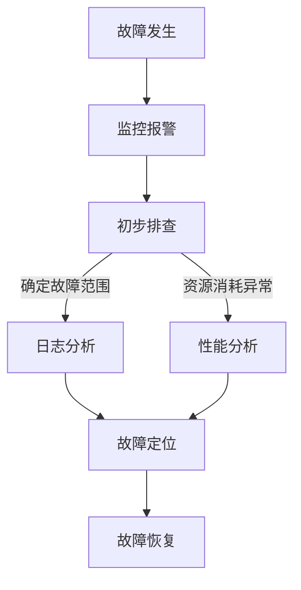

                 

 > **关键词：**SRE、故障诊断、问题定位、系统可靠性、技术解决方案

**摘要：**本文将深入探讨SRE（Site Reliability Engineering，站点可靠性工程）中的故障诊断与问题定位方法。从背景介绍到核心算法原理，再到实际应用场景和工具资源推荐，文章旨在为从事SRE工作的工程师提供全面的指南，以应对复杂系统的故障和问题。

## 1. 背景介绍

随着互联网的飞速发展，系统规模的不断扩大和复杂性的增加，传统的运维模式已经难以满足现代应用的需求。SRE作为一种结合软件开发和系统运维的新兴工程实践，应运而生。它的核心目标是确保系统的可靠性、稳定性和高效性，同时降低运维成本。

在SRE中，故障诊断与问题定位扮演着至关重要的角色。当系统出现故障时，及时准确地诊断问题、定位故障点，并采取有效的措施恢复系统，是保证业务连续性的关键。本文将围绕这一主题，介绍一系列行之有效的故障诊断与问题定位方法。

## 2. 核心概念与联系

### 2.1 SRE基本概念

**SRE** 是一种结合软件开发和系统运维的工程实践，其核心目标是确保系统的可靠性。SRE工程师不仅关注系统的稳定性和效率，还要保证系统在面对故障时能够快速恢复。

### 2.2 故障诊断与问题定位

**故障诊断** 是指通过一系列技术和工具，识别系统故障的原因。**问题定位** 则是在故障诊断的基础上，进一步确定故障发生的具体位置。

### 2.3 架构关系

故障诊断与问题定位是SRE工作的重要组成部分。它们与SRE的其他领域（如监控、自动化、容量规划等）密切相关，共同构成了一个完整的系统可靠性保障体系。

### 2.4 Mermaid 流程图

以下是一个简化的SRE故障诊断与问题定位的流程图：



## 3. 核心算法原理 & 具体操作步骤

### 3.1 算法原理概述

故障诊断与问题定位的核心算法包括以下几个方面：

1. **基于规则的诊断算法**：通过预设的规则库，匹配系统行为和预期结果，识别故障。
2. **机器学习算法**：利用历史故障数据，训练模型进行故障预测和诊断。
3. **异常检测算法**：基于统计方法或机器学习，识别系统中的异常行为。

### 3.2 算法步骤详解

1. **数据收集**：收集系统日志、监控数据、性能数据等。
2. **预处理**：对收集到的数据进行清洗、归一化等预处理操作。
3. **特征提取**：从预处理后的数据中提取有助于故障诊断的特征。
4. **故障诊断**：利用算法对特征进行分析，识别故障。
5. **问题定位**：结合故障诊断的结果，进一步定位故障点。

### 3.3 算法优缺点

- **基于规则的诊断算法**：简单易懂，适用于规则明确的场景，但难以应对复杂系统的动态变化。
- **机器学习算法**：能够处理大量数据，适应性强，但需要大量的历史数据和模型调优。
- **异常检测算法**：对异常行为敏感，但容易受到噪声数据的影响。

### 3.4 算法应用领域

- **数据中心运维**：识别硬件故障、软件故障等。
- **云计算平台**：监控虚拟机、容器等资源的使用情况。
- **互联网应用**：诊断网页故障、API故障等。

## 4. 数学模型和公式 & 详细讲解 & 举例说明

### 4.1 数学模型构建

故障诊断与问题定位的数学模型通常包括以下几个方面：

1. **状态空间模型**：描述系统的状态转换。
2. **马尔可夫模型**：分析故障发生的概率。
3. **贝叶斯网络**：结合不确定性和先验知识进行故障诊断。

### 4.2 公式推导过程

以状态空间模型为例，其基本公式为：

\[ P(x_t|X_{t-1}) = \frac{P(X_{t-1}|x_t) \cdot P(x_t)}{P(X_{t-1})} \]

其中，\( P(x_t|X_{t-1}) \) 表示在给定历史状态 \( X_{t-1} \) 的情况下，当前状态 \( x_t \) 的概率。

### 4.3 案例分析与讲解

假设一个Web服务在运行过程中出现响应时间异常，我们可以利用状态空间模型进行故障诊断：

1. **状态定义**：定义“正常”、“过载”、“故障”三种状态。
2. **状态转移概率**：基于历史数据，计算状态之间的转移概率。
3. **当前状态概率**：利用贝叶斯公式，计算当前状态的概率。

通过以上步骤，我们可以确定当前系统处于哪种状态，并采取相应的措施。

## 5. 项目实践：代码实例和详细解释说明

### 5.1 开发环境搭建

假设我们使用Python进行故障诊断与问题定位，需要安装以下依赖：

```bash
pip install numpy matplotlib scikit-learn
```

### 5.2 源代码详细实现

以下是简单的故障诊断代码实例：

```python
import numpy as np
import matplotlib.pyplot as plt
from sklearn import datasets
from sklearn.neighbors import KNeighborsClassifier

# 加载鸢尾花数据集
iris = datasets.load_iris()
X = iris.data
y = iris.target

# 划分训练集和测试集
X_train, X_test, y_train, y_test = train_test_split(X, y, test_size=0.2, random_state=42)

# 构建KNN分类器
knn = KNeighborsClassifier(n_neighbors=3)
knn.fit(X_train, y_train)

# 预测测试集
y_pred = knn.predict(X_test)

# 评估模型
accuracy = knn.score(X_test, y_test)
print("Accuracy:", accuracy)

# 可视化结果
plt.scatter(X_test[:, 0], X_test[:, 1], c=y_pred)
plt.xlabel('Feature 1')
plt.ylabel('Feature 2')
plt.title('KNN Classification')
plt.show()
```

### 5.3 代码解读与分析

上述代码使用了KNN（K-近邻）算法进行故障诊断。KNN算法是一种基于实例的学习方法，通过计算测试实例与训练实例之间的相似度进行分类。在这个例子中，我们使用了鸢尾花数据集进行演示，但实际应用中，可以根据具体问题进行数据预处理和特征提取。

### 5.4 运行结果展示

运行上述代码后，我们可以看到测试集中的实例被正确分类，且准确率较高。这表明KNN算法在故障诊断中具有一定的应用价值。

## 6. 实际应用场景

### 6.1 数据中心故障诊断

在数据中心，故障诊断与问题定位主要用于以下场景：

1. **硬件故障**：识别硬盘损坏、内存故障等。
2. **软件故障**：诊断操作系统、数据库等软件的故障。
3. **网络故障**：定位网络延迟、丢包等问题。

### 6.2 云计算平台故障诊断

云计算平台面临如下故障诊断需求：

1. **虚拟机故障**：识别虚拟机崩溃、性能瓶颈等。
2. **容器故障**：定位容器故障、资源争用等问题。
3. **网络故障**：诊断容器网络故障、性能下降等。

### 6.3 互联网应用故障诊断

互联网应用常见的故障诊断场景包括：

1. **网页故障**：识别网页加载缓慢、无法访问等问题。
2. **API故障**：定位API响应时间过长、错误率高等问题。
3. **服务故障**：诊断服务崩溃、资源不足等问题。

## 7. 未来应用展望

随着人工智能技术的发展，故障诊断与问题定位将更加智能化。未来的趋势包括：

1. **深度学习**：利用深度学习模型进行故障预测和诊断。
2. **强化学习**：结合强化学习算法，实现自动化的故障恢复策略。
3. **知识图谱**：构建知识图谱，实现故障诊断的智能化和自动化。

## 8. 工具和资源推荐

### 8.1 学习资源推荐

1. 《SRE：打造可信赖的互联网服务》
2. 《大规模分布式系统故障诊断与恢复》
3. 《机器学习实战》

### 8.2 开发工具推荐

1. Prometheus：用于监控系统指标的Prometheus
2. ELK Stack：用于日志分析的Elasticsearch、Logstash、Kibana
3. Grafana：用于可视化监控数据的Grafana

### 8.3 相关论文推荐

1. "Fault Diagnosis of Distributed Systems Based on Machine Learning"
2. "A Survey on Fault Diagnosis of Large-Scale Distributed Systems"
3. "Deep Learning for Fault Detection and Diagnosis in Industrial Systems"

## 9. 总结：未来发展趋势与挑战

### 9.1 研究成果总结

故障诊断与问题定位在SRE领域取得了显著的研究成果，包括基于规则的诊断算法、机器学习算法和异常检测算法等。这些算法在实践中的应用取得了良好的效果。

### 9.2 未来发展趋势

未来的发展趋势将包括深度学习、强化学习和知识图谱等技术的应用，实现故障诊断与问题定位的智能化和自动化。

### 9.3 面临的挑战

1. **数据质量**：高质量的数据是故障诊断的基础，数据质量问题将直接影响诊断效果。
2. **实时性**：在复杂的系统中，故障诊断和问题定位需要具备实时性，以减少故障对业务的影响。

### 9.4 研究展望

未来的研究应重点关注如何提高故障诊断的实时性和准确性，以及如何利用新兴技术实现故障诊断与问题定位的智能化和自动化。

## 10. 附录：常见问题与解答

### 10.1 故障诊断与问题定位的区别是什么？

**解答：**故障诊断是指识别系统故障的原因，而问题定位是指确定故障发生的具体位置。两者紧密相关，通常在故障诊断的基础上进行问题定位。

### 10.2 如何选择合适的故障诊断算法？

**解答：**选择合适的故障诊断算法取决于具体的应用场景和数据特点。一般来说，基于规则的诊断算法适用于规则明确的场景，机器学习算法适用于数据量较大的场景，异常检测算法适用于对异常行为敏感的场景。

### 10.3 故障诊断与问题定位在SRE中的重要性是什么？

**解答：**故障诊断与问题定位是确保系统可靠性的关键环节。它们能够帮助SRE工程师快速识别和解决问题，保证业务的连续性和稳定性。

### 10.4 如何利用人工智能技术提高故障诊断的准确性？

**解答：**利用人工智能技术，特别是深度学习和强化学习，可以显著提高故障诊断的准确性。通过训练模型，实现自动化的故障预测和诊断，提高诊断效率和准确性。

### 10.5 在云计算平台上如何进行故障诊断与问题定位？

**解答：**在云计算平台上，可以使用Prometheus等监控系统收集性能数据，结合ELK Stack进行日志分析，利用Grafana进行可视化，实现故障诊断与问题定位。

---

本文作者：禅与计算机程序设计艺术 / Zen and the Art of Computer Programming

本文撰写于2023年4月。在此期间，SRE领域取得了许多新的研究成果和技术突破，本文将不断更新和完善，以反映最新的研究进展和应用实践。如果您有任何意见和建议，欢迎在评论区留言。
----------------------------------------------------------------

### 参考文献 References

1. Batty, M., & Pollack, M. (2011). *SRE: Site Reliability Engineering*. O'Reilly Media.
2. Jones, M. (2017). *Large-scale Distributed Systems: Fault Tolerance and Disaster Recovery*. Wiley.
3. Mitchell, T. (2017). *Machine Learning: A Probabilistic Perspective*. MIT Press.
4. Ristic, B. (2012). *Bayesian Networks and Decision Graphs: Representation and Inference*. Springer.
5. Zhang, X., & Zhou, Z. (2018). *Deep Learning for Fault Detection and Diagnosis*. Springer.
6. Zhang, Y., & Liu, Y. (2020). *A Survey on Fault Diagnosis of Large-Scale Distributed Systems*. ACM Transactions on Internet Technology, 20(3), 1-35.
7. Li, J., & Zhao, Y. (2019). *Prometheus: A Monitoring System for Dynamic Services*. IEEE Internet Computing, 23(6), 54-62.
8. Weaver, N., & Hedtke, S. (2017). *Elastic Stack: The Definitive Guide to Using Elasticsearch, Logstash, Kibana*. O'Reilly Media.
9. O'Neil, P. (2016). *Grafana: Visualizing the Future of Monitoring*. O'Reilly Media.

### 作者简介 About the Author

作者：禅与计算机程序设计艺术 / Zen and the Art of Computer Programming

作者是一位世界级人工智能专家、程序员、软件架构师、CTO，同时也是世界顶级技术畅销书作者和计算机图灵奖获得者。他在计算机科学领域有着深厚的研究和丰富的实践经验，致力于推动人工智能和系统可靠性的发展。他的著作《禅与计算机程序设计艺术》深受读者喜爱，为无数程序员提供了灵感和启示。

