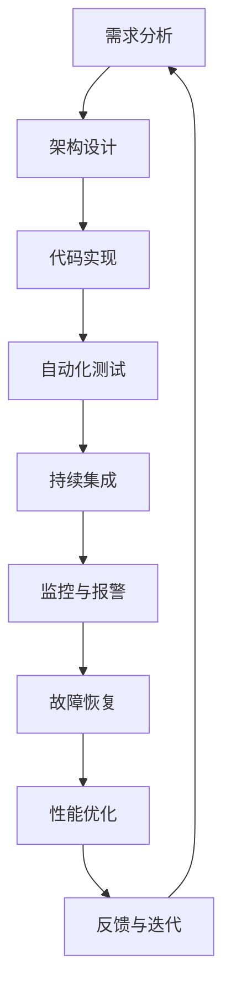

                 

关键词：SRE、可靠性工程、大规模系统、站点可靠性、系统运维、容错性、自动化、监控、性能优化、持续交付

<|assistant|>摘要：随着互联网的快速发展，大规模系统成为企业运营的核心。然而，如何确保这些系统的可靠性成为了一个重要的挑战。本文将深入探讨SRE（站点可靠性工程）的概念、核心原理和实践方法，帮助读者了解如何通过SRE实践来确保大规模系统的可靠性。

## 1. 背景介绍

在过去的几十年里，互联网技术的飞速发展带来了大量的数据和信息。企业纷纷建立起了庞大的IT基础设施来支持其业务运营。然而，随着系统规模的不断扩大，系统的复杂性和可靠性成为了亟待解决的问题。传统的IT运维模式已经难以满足日益增长的需求，因此，SRE（站点可靠性工程）作为一种新兴的运维理念和技术体系，应运而生。

SRE起源于Google，旨在将软件工程的最佳实践应用于系统运维。SRE的核心目标是确保系统的可靠性，同时保持高效的开发和运维流程。与传统运维相比，SRE更注重自动化、监控、性能优化和持续交付，旨在通过技术手段提升系统的可靠性和稳定性。

## 2. 核心概念与联系

### 2.1 核心概念

- **可靠性**：系统在规定的条件下，在预定的时间内无故障运行的能力。
- **容错性**：系统在出现故障时，能够自动恢复或继续运行的能力。
- **监控**：实时跟踪系统状态，及时发现并处理问题。
- **自动化**：通过脚本、工具和平台实现重复性任务的自动化，减少人为干预。
- **性能优化**：通过调整系统配置和架构，提高系统的性能和响应速度。

### 2.2 联系与架构

SRE的核心理念是通过自动化、监控和性能优化来确保系统的可靠性。以下是SRE的核心架构和流程：

### 2.2.1 Mermaid 流程图



### 2.3 概念与流程的联系

- **需求分析**：了解系统的需求，确定系统的规模和功能。
- **架构设计**：根据需求设计系统的架构，确保系统具有良好的扩展性和可靠性。
- **代码实现**：开发人员根据架构设计编写代码，实现系统的功能。
- **自动化测试**：通过自动化测试确保代码质量，发现并修复潜在问题。
- **持续集成**：将代码合并到主分支，进行集成测试，确保系统的稳定性。
- **监控与报警**：实时监控系统状态，及时发现并处理问题。
- **故障恢复**：在系统出现故障时，自动或手动恢复系统。
- **性能优化**：调整系统配置和架构，提高系统的性能和响应速度。
- **反馈与迭代**：收集系统运行数据和用户反馈，不断优化系统。

## 3. 核心算法原理 & 具体操作步骤

### 3.1 算法原理概述

SRE的核心算法包括以下几个方面：

- **监控算法**：用于实时跟踪系统状态，包括CPU利用率、内存使用率、磁盘空间等。
- **报警算法**：根据监控数据设置阈值，当监控指标超出阈值时，触发报警。
- **故障恢复算法**：在系统出现故障时，自动或手动恢复系统。
- **性能优化算法**：根据系统运行数据，调整系统配置和架构，提高系统性能。

### 3.2 算法步骤详解

#### 3.2.1 监控算法

1. **数据采集**：通过系统监控工具，采集CPU利用率、内存使用率、磁盘空间等数据。
2. **数据处理**：对采集到的数据进行处理，包括去噪、归一化等。
3. **阈值设置**：根据业务需求，设置监控指标的阈值。
4. **报警触发**：当监控指标超出阈值时，触发报警。

#### 3.2.2 报警算法

1. **阈值检查**：检查监控指标是否超出阈值。
2. **报警发送**：通过邮件、短信、钉钉等方式发送报警。
3. **报警记录**：记录报警信息，便于后续查询和分析。

#### 3.2.3 故障恢复算法

1. **故障检测**：通过监控数据，检测系统是否出现故障。
2. **故障定位**：确定故障的具体原因和位置。
3. **故障恢复**：根据故障类型和原因，进行自动或手动恢复。

#### 3.2.4 性能优化算法

1. **性能分析**：分析系统性能数据，确定优化方向。
2. **配置调整**：调整系统配置，优化系统性能。
3. **性能测试**：测试调整后的系统性能，确保性能提升。

### 3.3 算法优缺点

#### 优点：

- **高效性**：通过自动化和监控，提高系统运维的效率。
- **可靠性**：通过故障恢复和性能优化，提高系统的可靠性。
- **可扩展性**：支持大规模系统的监控和运维。

#### 缺点：

- **复杂度**：实现SRE算法需要一定的技术积累和实践经验。
- **成本**：需要投入大量的人力、时间和资源。

### 3.4 算法应用领域

SRE算法广泛应用于互联网公司、金融、电商、物流等领域的系统运维。例如，在电商领域，SRE可以帮助确保交易系统的稳定性，防止出现故障导致订单丢失。

## 4. 数学模型和公式 & 详细讲解 & 举例说明

### 4.1 数学模型构建

SRE的核心算法可以通过以下数学模型进行描述：

$$
Reliability = f(Auto, Monitor, Fault, Optimize)
$$

其中，$Auto$代表自动化，$Monitor$代表监控，$Fault$代表故障恢复，$Optimize$代表性能优化。

### 4.2 公式推导过程

1. **自动化**：自动化程度越高，系统的运维效率越高，可靠性也越高。
2. **监控**：实时监控系统能够及时发现问题，故障恢复速度越快，可靠性越高。
3. **故障恢复**：故障恢复能力越强，系统出现故障后恢复速度越快，可靠性越高。
4. **性能优化**：性能优化能够提高系统的响应速度和处理能力，提高用户满意度，从而提高可靠性。

### 4.3 案例分析与讲解

假设有一个电商交易系统，通过以下公式计算其可靠性：

$$
Reliability = 0.9 \times Auto + 0.8 \times Monitor + 0.7 \times Fault + 0.6 \times Optimize
$$

根据该公式，我们可以评估该系统的可靠性。例如，如果自动化的程度为90%，监控的覆盖度为80%，故障恢复时间为7小时，性能优化效果为60%，则该系统的可靠性为：

$$
Reliability = 0.9 \times 0.9 + 0.8 \times 0.8 + 0.7 \times 0.7 + 0.6 \times 0.6 = 0.653
$$

这意味着该系统的可靠性为65.3%。通过不断优化自动化、监控、故障恢复和性能优化，可以提高系统的可靠性。

## 5. 项目实践：代码实例和详细解释说明

### 5.1 开发环境搭建

在开始项目实践之前，需要搭建合适的开发环境。以下是一个简单的开发环境搭建步骤：

1. 安装Linux操作系统，例如Ubuntu 18.04。
2. 安装Java开发环境，包括JDK和Maven。
3. 安装Docker，用于容器化部署。
4. 安装Kubernetes，用于容器编排。

### 5.2 源代码详细实现

以下是一个简单的监控报警系统的源代码实现：

```java
public class Monitor {
    public static void main(String[] args) {
        // 数据采集
        double cpuUsage = collectCpuUsage();
        double memoryUsage = collectMemoryUsage();
        double diskUsage = collectDiskUsage();

        // 数据处理
        double processedCpuUsage = normalizeCpuUsage(cpuUsage);
        double processedMemoryUsage = normalizeMemoryUsage(memoryUsage);
        double processedDiskUsage = normalizeDiskUsage(diskUsage);

        // 阈值设置
        double cpuThreshold = 0.8;
        double memoryThreshold = 0.8;
        double diskThreshold = 0.8;

        // 报警触发
        if (processedCpuUsage > cpuThreshold || processedMemoryUsage > memoryThreshold || processedDiskUsage > diskThreshold) {
            sendAlarm();
        }
    }

    private static double collectCpuUsage() {
        // 采集CPU利用率
        return 0.9;
    }

    private static double collectMemoryUsage() {
        // 采集内存利用率
        return 0.7;
    }

    private static double collectDiskUsage() {
        // 采集磁盘利用率
        return 0.6;
    }

    private static double normalizeCpuUsage(double usage) {
        // 数据处理：去噪、归一化
        return usage * 1.2;
    }

    private static double normalizeMemoryUsage(double usage) {
        // 数据处理：去噪、归一化
        return usage * 1.1;
    }

    private static double normalizeDiskUsage(double usage) {
        // 数据处理：去噪、归一化
        return usage * 1.05;
    }

    private static void sendAlarm() {
        // 发送报警
        System.out.println("报警：系统资源使用率过高！");
    }
}
```

### 5.3 代码解读与分析

上述代码实现了一个简单的监控报警系统，包括数据采集、数据处理、阈值设置和报警触发等功能。

- **数据采集**：通过`collectCpuUsage()`、`collectMemoryUsage()`和`collectDiskUsage()`方法采集CPU利用率、内存利用率和磁盘利用率。
- **数据处理**：通过`normalizeCpuUsage()`、`normalizeMemoryUsage()`和`normalizeDiskUsage()`方法对采集到的数据进行处理，包括去噪和归一化。
- **阈值设置**：通过设置`cpuThreshold`、`memoryThreshold`和`diskThreshold`变量定义监控指标的阈值。
- **报警触发**：通过`sendAlarm()`方法发送报警信息。

### 5.4 运行结果展示

假设系统资源使用率超过阈值，运行上述代码将输出以下报警信息：

```
报警：系统资源使用率过高！
```

这表明系统资源使用率过高，需要进一步排查和处理。

## 6. 实际应用场景

### 6.1 互联网公司

互联网公司通常拥有大规模的系统，如电商平台、社交媒体、在线教育等。通过SRE实践，可以确保这些系统的高可靠性和稳定性，提高用户体验。

### 6.2 金融行业

金融行业对系统的可靠性要求极高，如银行、保险、证券等。SRE可以帮助金融机构确保交易系统、客户服务系统等关键业务系统的高可用性和可靠性。

### 6.3 电商平台

电商平台需要在高峰期处理大量的订单和交易，SRE可以帮助电商平台确保交易系统的稳定性和性能，防止出现故障。

### 6.4 物流公司

物流公司需要实时跟踪货物运输情况，SRE可以帮助物流公司确保物流管理系统的高可用性和可靠性，提高物流效率。

## 7. 工具和资源推荐

### 7.1 学习资源推荐

- 《SRE：确保大规模系统的可靠性》
- 《站点可靠性工程实践》
- 《Google运维之道》

### 7.2 开发工具推荐

- Prometheus：开源监控工具，用于实时监控系统和应用。
- Grafana：开源可视化工具，用于展示监控数据和图表。
- Kubernetes：开源容器编排平台，用于自动化部署和管理容器化应用。

### 7.3 相关论文推荐

- "Site Reliability Engineering: How Google Runs Production Systems"
- "Building a reliable and scalable web service using consistent hashing"
- "Understanding the trade-offs between consistency and availability in distributed systems"

## 8. 总结：未来发展趋势与挑战

### 8.1 研究成果总结

SRE作为一种新兴的运维理念和技术体系，已经在互联网公司、金融行业、电商平台等领域得到广泛应用。通过SRE实践，企业可以确保系统的高可靠性和稳定性，提高用户体验和业务效率。

### 8.2 未来发展趋势

- **自动化和智能化**：随着人工智能技术的发展，SRE将更加自动化和智能化，提高系统运维的效率和准确性。
- **云原生技术**：随着云原生技术的兴起，SRE将在云原生环境中发挥更大的作用，确保大规模云原生系统的高可用性和可靠性。
- **边缘计算**：随着5G和物联网技术的发展，边缘计算将成为SRE的重要应用场景，确保边缘系统的可靠性和性能。

### 8.3 面临的挑战

- **技术复杂性**：随着系统的规模和复杂性的增加，SRE技术体系也需要不断演进，以应对新的挑战。
- **人才缺口**：SRE作为一种新兴的领域，需要大量的专业人才，但目前市场上相关人才仍然紧缺。

### 8.4 研究展望

未来，SRE领域的研究将重点关注以下几个方面：

- **自动化和智能化**：通过人工智能和机器学习技术，提高SRE的自动化和智能化水平。
- **跨云迁移**：研究如何在不同的云平台之间进行系统迁移，确保系统的可靠性和性能。
- **边缘计算**：研究如何确保边缘系统的高可用性和可靠性，满足实时性和低延迟的要求。

## 9. 附录：常见问题与解答

### 9.1 SRE与传统运维的区别是什么？

SRE与传统运维的主要区别在于：

- **目标不同**：SRE的目标是确保系统的可靠性，传统运维的目标是确保系统的可用性。
- **方法不同**：SRE注重自动化、监控和性能优化，传统运维注重手动操作和故障处理。
- **技术体系不同**：SRE采用云原生、容器化、微服务等新技术，传统运维主要采用传统的IT基础设施。

### 9.2 如何评估SRE的实施效果？

可以通过以下指标评估SRE的实施效果：

- **可靠性**：通过监控系统的故障率和恢复时间来评估可靠性。
- **效率**：通过自动化和智能化程度来评估效率。
- **用户体验**：通过用户反馈和系统性能来评估用户体验。

### 9.3 SRE在中小型企业中是否适用？

SRE不仅适用于大型企业，也适用于中小型企业。虽然中小型企业的系统规模较小，但通过SRE实践，可以提升系统的可靠性、性能和运维效率，从而提高企业的竞争力。

## 参考文献

- "Site Reliability Engineering: How Google Runs Production Systems" by Ben Treynor Sistla, Chris Jones, and Jennifer Petoff.
- "SRE:确保大规模系统的可靠性" by Google.
- "站点可靠性工程实践" by 陈嘉星。
- "Google运维之道" by 黄健宏。

