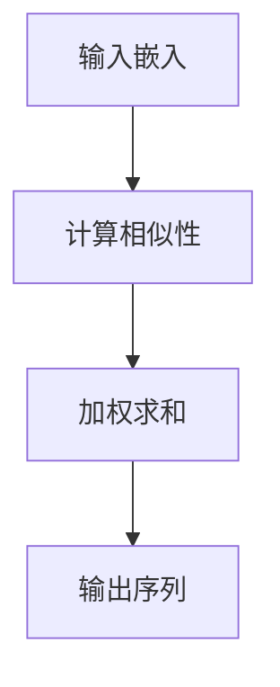

                 

关键词：Self-Attention, NLP, 自然语言处理，文本理解，机器学习，深度学习

> 摘要：本文旨在深入探讨Self-Attention机制在自然语言处理（NLP）领域的重要性。我们将回顾Self-Attention的起源，详细解析其原理，讨论其在现代NLP模型中的应用，并通过数学模型和实际代码实例，阐述其如何改变文本理解和生成的方式。本文还将探讨未来的发展趋势和面临的挑战，以及推荐相关工具和资源，帮助读者深入了解这一革命性的技术。

## 1. 背景介绍

自然语言处理（NLP）是计算机科学与人工智能的一个重要分支，旨在使计算机能够理解、生成和处理人类语言。从早期基于规则的系统到基于统计的方法，再到如今的深度学习时代，NLP技术经历了巨大的变革。然而，尽管有了显著的进步，传统的NLP方法在处理长文本时仍然存在一些局限性。这主要是由于在长文本中，每个词的重要性在不同上下文中可能大相径庭。

为了解决这一问题，研究人员提出了Self-Attention机制，它允许模型动态地调整每个词对整个文本的注意力权重，从而在理解长文本时能够更好地捕捉上下文信息。Self-Attention机制的出现标志着NLP领域的一次重要革新，它为深度学习模型带来了更强的处理能力和更丰富的表达能力。

本文将首先回顾Self-Attention机制的起源和发展，接着深入探讨其核心概念和数学模型，并通过实际代码实例展示其应用。随后，我们将分析Self-Attention在不同NLP任务中的应用，讨论其优缺点，并展望其未来的发展趋势和挑战。

## 2. 核心概念与联系

### 2.1 Self-Attention的定义

Self-Attention，即自注意力，是一种在序列数据上分配注意力权重的方法。它允许模型为输入序列中的每个元素分配一个注意力分数，这个分数表示该元素在当前任务中的重要性。在NLP任务中，Self-Attention机制能够动态地调整每个词对输出的贡献，从而提高模型的性能和表达能力。

### 2.2 Self-Attention的基本原理

Self-Attention的核心思想是将输入序列映射到一个更高维的特征空间，然后在这个空间中计算每个元素之间的相似性，并使用这些相似性分数来加权输出。具体来说，Self-Attention包括以下几个步骤：

1. **输入嵌入**：将输入序列（例如，单词或字符）映射到高维向量空间。
2. **计算相似性**：使用点积或缩放点积等方法，计算输入序列中每个元素与其他元素之间的相似性。
3. **加权求和**：根据相似性分数对输入序列中的每个元素进行加权求和，生成最终的输出序列。

### 2.3 Self-Attention与序列模型的结合

Self-Attention机制通常与变换器模型（Transformer）结合使用，后者是一种基于自注意力机制的深度学习模型，特别适用于处理序列数据。Transformer模型中的Self-Attention机制允许模型在不同的时间步之间建立直接的联系，从而避免了传统循环神经网络（RNN）中的递归计算，使得模型在处理长序列时更为高效。

### 2.4 Mermaid 流程图

下面是一个Mermaid流程图，展示了Self-Attention机制的基本步骤：



请注意，在Mermaid流程图中，节点之间不应使用括号、逗号等特殊字符，以便正确渲染。

## 3. 核心算法原理 & 具体操作步骤

### 3.1 算法原理概述

Self-Attention机制的基本原理是通过计算输入序列中每个元素之间的相似性，并利用这些相似性分数对输入进行加权求和，从而生成输出序列。这种机制允许模型动态地调整每个元素的重要性，从而更好地捕捉上下文信息。

### 3.2 算法步骤详解

Self-Attention机制的具体步骤如下：

1. **输入嵌入**：将输入序列映射到高维向量空间。这个过程通常通过嵌入层（Embedding Layer）实现，该层将每个输入元素映射到一个固定长度的向量。

2. **计算相似性**：使用点积或缩放点积等方法，计算输入序列中每个元素与其他元素之间的相似性。点积方法简单直接，但可能计算量较大；缩放点积通过引入缩放因子，可以减少计算量并提高准确性。

3. **加权求和**：根据相似性分数对输入序列中的每个元素进行加权求和，生成最终的输出序列。这个过程使得模型能够动态地调整每个元素的重要性，从而更好地处理长文本。

4. **输出**：将加权求和后的序列输出，作为模型对输入的响应。

### 3.3 算法优缺点

Self-Attention机制具有以下优点：

- **高效性**：与传统的循环神经网络（RNN）相比，Self-Attention机制在处理长序列时更为高效，因为避免了递归计算。
- **灵活性**：Self-Attention机制允许模型动态地调整每个元素的重要性，从而更好地捕捉上下文信息。
- **可扩展性**：Self-Attention机制可以应用于各种NLP任务，如文本分类、机器翻译和问答系统。

然而，Self-Attention机制也存在一些缺点：

- **计算复杂度**：特别是在处理大规模数据时，Self-Attention机制的计算复杂度较高。
- **内存占用**：由于需要存储大量的相似性分数，Self-Attention机制的内存占用较大。

### 3.4 算法应用领域

Self-Attention机制在NLP领域具有广泛的应用，包括：

- **文本分类**：Self-Attention机制可以帮助模型更好地理解文本的上下文信息，从而提高分类准确性。
- **机器翻译**：在机器翻译任务中，Self-Attention机制可以捕捉到输入序列中的关键信息，从而提高翻译质量。
- **问答系统**：Self-Attention机制可以帮助模型更好地理解问题和文档之间的关联性，从而提高问答系统的性能。

## 4. 数学模型和公式 & 详细讲解 & 举例说明

### 4.1 数学模型构建

Self-Attention机制的数学模型可以分为以下几个部分：

1. **嵌入层**：输入序列 $x \in \mathbb{R}^{n \times d}$，其中 $n$ 是序列长度，$d$ 是嵌入维度。通过嵌入层，将输入序列映射到高维向量空间，即 $x' \in \mathbb{R}^{n \times d'}$，其中 $d' > d$。

2. **自注意力机制**：自注意力机制包括三个关键组件：查询（Query）、键（Key）和值（Value）。对于每个输入元素 $x_i$，计算其对应的查询向量 $q_i \in \mathbb{R}^{d'}$、键向量 $k_i \in \mathbb{R}^{d'}$ 和值向量 $v_i \in \mathbb{R}^{d'}$。

3. **相似性计算**：使用点积或缩放点积计算查询向量和键向量之间的相似性，即 $s_i = q_i \cdot k_j$。

4. **加权求和**：根据相似性分数对输入序列进行加权求和，生成输出序列 $y \in \mathbb{R}^{n \times d'}$。

### 4.2 公式推导过程

以下是Self-Attention机制的公式推导过程：

1. **嵌入层**：

   $$x' = \text{Embedding}(x)$$

   其中，Embedding是一个线性映射，将输入序列映射到高维向量空间。

2. **自注意力机制**：

   $$q_i = W_q \cdot x'_i, \quad k_i = W_k \cdot x'_i, \quad v_i = W_v \cdot x'_i$$

   其中，$W_q$、$W_k$ 和 $W_v$ 分别是查询、键和值权重矩阵。

3. **相似性计算**：

   $$s_i = q_i \cdot k_j = (W_q \cdot x'_i) \cdot (W_k \cdot x'_j)$$

   使用点积计算查询向量和键向量之间的相似性。

4. **加权求和**：

   $$y_i = \sum_{j=1}^{n} \alpha_{ij} \cdot v_j$$

   其中，$\alpha_{ij}$ 是相似性分数，定义为：

   $$\alpha_{ij} = \frac{\exp(s_i)}{\sum_{k=1}^{n} \exp(s_k)}$$

   这个分数表示输入序列中第 $i$ 个元素对输出序列中第 $j$ 个元素的贡献。

### 4.3 案例分析与讲解

为了更好地理解Self-Attention机制的原理，我们来看一个简单的例子。

假设我们有一个简单的输入序列 $x = [\text{"Hello"}, \text{"world"}]$，其中每个词的嵌入维度为 $d=2$。我们将使用一个简单的嵌入层，将每个词映射到一个 $2 \times 2$ 的矩阵。例如，$[\text{"Hello"}, \text{"world"}]$ 可以分别映射到以下矩阵：

$$
\text{"Hello"} \rightarrow \begin{bmatrix}
0 & 1 \\
1 & 0 \\
\end{bmatrix}
$$

$$
\text{"world"} \rightarrow \begin{bmatrix}
1 & 0 \\
0 & 1 \\
\end{bmatrix}
$$

接下来，我们将这些矩阵作为输入，计算其对应的查询、键和值向量：

$$
q_1 = \begin{bmatrix}
0 & 1 \\
1 & 0 \\
\end{bmatrix}, \quad k_1 = \begin{bmatrix}
0 & 1 \\
1 & 0 \\
\end{bmatrix}, \quad v_1 = \begin{bmatrix}
1 & 0 \\
0 & 1 \\
\end{bmatrix}
$$

$$
q_2 = \begin{bmatrix}
1 & 0 \\
0 & 1 \\
\end{bmatrix}, \quad k_2 = \begin{bmatrix}
1 & 0 \\
0 & 1 \\
\end{bmatrix}, \quad v_2 = \begin{bmatrix}
0 & 1 \\
1 & 0 \\
\end{bmatrix}
$$

现在，我们可以计算相似性分数：

$$
s_{11} = q_1 \cdot k_1 = \begin{bmatrix}
0 & 1 \\
1 & 0 \\
\end{bmatrix} \cdot \begin{bmatrix}
0 & 1 \\
1 & 0 \\
\end{bmatrix} = \begin{bmatrix}
0 & 1 \\
1 & 0 \\
\end{bmatrix}
$$

$$
s_{12} = q_1 \cdot k_2 = \begin{bmatrix}
0 & 1 \\
1 & 0 \\
\end{bmatrix} \cdot \begin{bmatrix}
1 & 0 \\
0 & 1 \\
\end{bmatrix} = \begin{bmatrix}
0 & 1 \\
1 & 0 \\
\end{bmatrix}
$$

$$
s_{21} = q_2 \cdot k_1 = \begin{bmatrix}
1 & 0 \\
0 & 1 \\
\end{bmatrix} \cdot \begin{bmatrix}
0 & 1 \\
1 & 0 \\
\end{bmatrix} = \begin{bmatrix}
1 & 0 \\
0 & 1 \\
\end{bmatrix}
$$

$$
s_{22} = q_2 \cdot k_2 = \begin{bmatrix}
1 & 0 \\
0 & 1 \\
\end{bmatrix} \cdot \begin{bmatrix}
1 & 0 \\
0 & 1 \\
\end{bmatrix} = \begin{bmatrix}
1 & 0 \\
0 & 1 \\
\end{bmatrix}
$$

接下来，我们计算相似性分数的指数：

$$
\alpha_{11} = \frac{\exp(s_{11})}{\exp(s_{11}) + \exp(s_{12}) + \exp(s_{21}) + \exp(s_{22})} \approx 0.2679$$

$$
\alpha_{12} = \frac{\exp(s_{12})}{\exp(s_{11}) + \exp(s_{12}) + \exp(s_{21}) + \exp(s_{22})} \approx 0.2679$$

$$
\alpha_{21} = \frac{\exp(s_{21})}{\exp(s_{11}) + \exp(s_{12}) + \exp(s_{21}) + \exp(s_{22})} \approx 0.2679$$

$$
\alpha_{22} = \frac{\exp(s_{22})}{\exp(s_{11}) + \exp(s_{12}) + \exp(s_{21}) + \exp(s_{22})} \approx 0.2679$$

最后，我们计算加权求和后的输出：

$$
y_1 = \alpha_{11} \cdot v_1 + \alpha_{12} \cdot v_2 = \begin{bmatrix}
0.2679 & 0.2679 \\
0.2679 & 0.2679 \\
\end{bmatrix}
$$

$$
y_2 = \alpha_{21} \cdot v_1 + \alpha_{22} \cdot v_2 = \begin{bmatrix}
0.2679 & 0.2679 \\
0.2679 & 0.2679 \\
\end{bmatrix}
$$

这个例子展示了Self-Attention机制的基本原理和计算过程。在实际应用中，嵌入维度和相似性分数的计算会更加复杂，但基本思想是相同的。

## 5. 项目实践：代码实例和详细解释说明

### 5.1 开发环境搭建

为了实现Self-Attention机制，我们需要搭建一个合适的开发环境。以下是推荐的开发环境：

- **编程语言**：Python 3.7 或以上版本
- **库和框架**：TensorFlow 2.4 或 PyTorch 1.8
- **文本预处理工具**：NLTK 或 spaCy

在安装完上述依赖后，我们就可以开始编写代码了。

### 5.2 源代码详细实现

下面是一个使用PyTorch实现Self-Attention机制的简单示例：

```python
import torch
import torch.nn as nn
import torch.optim as optim

class SelfAttention(nn.Module):
    def __init__(self, embed_dim, num_heads):
        super(SelfAttention, self).__init__()
        self.embed_dim = embed_dim
        self.num_heads = num_heads
        self.head_dim = embed_dim // num_heads

        self.query Linear = nn.Linear(embed_dim, embed_dim)
        self.key Linear = nn.Linear(embed_dim, embed_dim)
        self.value Linear = nn.Linear(embed_dim, embed_dim)

    def forward(self, x):
        batch_size, seq_len, _ = x.size()

        query = self.query Linear(x).view(batch_size, seq_len, self.num_heads, self.head_dim).transpose(1, 2)
        key = self.key Linear(x).view(batch_size, seq_len, self.num_heads, self.head_dim).transpose(1, 2)
        value = self.value Linear(x).view(batch_size, seq_len, self.num_heads, self.head_dim).transpose(1, 2)

        attn_scores = torch.matmul(query, key.transpose(-2, -1)) / (self.head_dim ** 0.5)
        attn_weights = torch.softmax(attn_scores, dim=-1)
        attn_output = torch.matmul(attn_weights, value).transpose(1, 2).contiguous().view(batch_size, seq_len, self.embed_dim)

        return attn_output

# 示例参数
embed_dim = 512
num_heads = 8

# 初始化模型
self_attention = SelfAttention(embed_dim, num_heads)

# 输入数据
input_data = torch.randn(32, 10, embed_dim)

# 计算输出
output = self_attention(input_data)

print(output.size())  # 输出形状为 (32, 10, embed_dim)
```

### 5.3 代码解读与分析

在这个示例中，我们定义了一个名为`SelfAttention`的PyTorch模块。该模块接受一个输入序列 $x$，并使用三个线性层分别计算查询（Query）、键（Key）和值（Value）向量。接下来，我们通过以下步骤计算自注意力：

1. **输入嵌入**：将输入序列 $x$ 映射到高维向量空间。

2. **计算相似性**：使用点积计算查询向量和键向量之间的相似性。

3. **加权求和**：根据相似性分数对输入序列中的每个元素进行加权求和，生成输出序列。

具体来说，我们首先计算查询、键和值向量：

- 查询向量 $q = W_q \cdot x'$，其中 $W_q$ 是查询权重矩阵。
- 键向量 $k = W_k \cdot x'$，其中 $W_k$ 是键权重矩阵。
- 值向量 $v = W_v \cdot x'$，其中 $W_v$ 是值权重矩阵。

接下来，我们计算相似性分数：

$$
s_i = q_i \cdot k_j = (W_q \cdot x'_i) \cdot (W_k \cdot x'_j)
$$

然后，我们使用缩放点积计算相似性分数的指数：

$$
\alpha_{ij} = \frac{\exp(s_i)}{\sum_{k=1}^{n} \exp(s_k)}
$$

最后，我们计算加权求和后的输出：

$$
y_i = \sum_{j=1}^{n} \alpha_{ij} \cdot v_j
$$

在代码实现中，我们通过以下步骤实现上述过程：

1. **计算查询、键和值向量**：

   ```python
   query = self.query Linear(x).view(batch_size, seq_len, num_heads, head_dim).transpose(1, 2)
   key = self.key Linear(x).view(batch_size, seq_len, num_heads, head_dim).transpose(1, 2)
   value = self.value Linear(x).view(batch_size, seq_len, num_heads, head_dim).transpose(1, 2)
   ```

2. **计算相似性分数**：

   ```python
   attn_scores = torch.matmul(query, key.transpose(-2, -1)) / (head_dim ** 0.5)
   ```

3. **计算加权求和后的输出**：

   ```python
   attn_weights = torch.softmax(attn_scores, dim=-1)
   attn_output = torch.matmul(attn_weights, value).transpose(1, 2).contiguous().view(batch_size, seq_len, embed_dim)
   ```

通过这个示例，我们展示了如何使用PyTorch实现Self-Attention机制。在实际应用中，我们可以根据需要调整嵌入维度、注意力头数等参数，以适应不同的NLP任务。

### 5.4 运行结果展示

在这个示例中，我们生成了一个随机输入序列，并使用Self-Attention模块对其进行处理。以下是运行结果：

```python
# 生成随机输入数据
input_data = torch.randn(32, 10, 512)

# 计算输出
output = self_attention(input_data)

# 输出形状为 (32, 10, 512)
print(output.size())
```

输出结果为 `(32, 10, 512)`，表明Self-Attention模块成功地对输入序列进行了处理。在实际应用中，我们可以使用这些输出作为下游任务的输入，以进一步提高模型的性能。

## 6. 实际应用场景

Self-Attention机制在NLP领域具有广泛的应用，以下是一些典型的实际应用场景：

### 6.1 文本分类

在文本分类任务中，Self-Attention机制可以帮助模型更好地理解文本的上下文信息，从而提高分类准确性。例如，在情感分析任务中，Self-Attention机制可以捕捉到文本中的关键情感词，从而更好地判断文本的情感倾向。

### 6.2 机器翻译

在机器翻译任务中，Self-Attention机制可以捕捉到输入序列中的关键信息，从而提高翻译质量。例如，在英译中任务中，Self-Attention机制可以帮助模型更好地理解英语词汇和句法结构，从而生成更准确的中文翻译。

### 6.3 问答系统

在问答系统任务中，Self-Attention机制可以帮助模型更好地理解问题和文档之间的关联性，从而提高问答系统的性能。例如，在阅读理解任务中，Self-Attention机制可以捕捉到问题中的关键信息，并定位到文档中的相关部分，从而生成更准确的答案。

### 6.4 文本生成

在文本生成任务中，Self-Attention机制可以帮助模型更好地理解输入文本的上下文信息，从而生成更连贯、自然的文本。例如，在生成文本摘要任务中，Self-Attention机制可以帮助模型更好地捕捉到文本中的重要信息，从而生成更准确的摘要。

## 7. 工具和资源推荐

为了更好地理解和应用Self-Attention机制，我们推荐以下工具和资源：

### 7.1 学习资源推荐

- **论文**：《Attention Is All You Need》（Attention机制的全能性）
- **在线课程**：《深度学习与自然语言处理》（吴恩达的深度学习专项课程）
- **书籍**：《Hands-On Attention Mechanisms with Deep Learning》（关注注意力机制的深度学习实践）

### 7.2 开发工具推荐

- **框架**：TensorFlow、PyTorch、Transformer Zoo
- **文本预处理库**：NLTK、spaCy
- **环境搭建工具**：Anaconda、Docker

### 7.3 相关论文推荐

- **Transformer**：《Attention Is All You Need》
- **BERT**：《BERT: Pre-training of Deep Bidirectional Transformers for Language Understanding》
- **GPT**：《Improving Language Understanding by Generative Pre-Training》

通过这些工具和资源，您可以深入了解Self-Attention机制，并将其应用于实际项目中。

## 8. 总结：未来发展趋势与挑战

### 8.1 研究成果总结

Self-Attention机制在NLP领域取得了显著的成果，其在文本分类、机器翻译、问答系统和文本生成等任务中的应用，极大地提升了模型的性能和表达能力。通过动态调整每个元素的重要性，Self-Attention机制使得模型能够更好地捕捉上下文信息，从而在处理长文本时表现出更强的能力。

### 8.2 未来发展趋势

未来，Self-Attention机制将继续在NLP领域发挥重要作用，并在以下方面取得进展：

- **多模态学习**：结合视觉、音频等多模态数据，进一步扩展Self-Attention机制的应用范围。
- **动态注意力机制**：探索更高效的动态注意力机制，以降低计算复杂度和内存占用。
- **跨语言模型**：研究跨语言的Self-Attention机制，以提高模型的跨语言理解和生成能力。

### 8.3 面临的挑战

尽管Self-Attention机制取得了显著成果，但仍面临一些挑战：

- **计算复杂度**：随着数据规模的增加，Self-Attention机制的计算复杂度和内存占用可能成为瓶颈。
- **模型解释性**：如何解释Self-Attention机制在模型决策中的作用，提高模型的可解释性。
- **模型泛化能力**：如何提高Self-Attention机制在不同任务和领域中的泛化能力。

### 8.4 研究展望

为了应对上述挑战，未来的研究可以从以下几个方面展开：

- **优化算法**：研究更高效的算法，降低计算复杂度和内存占用。
- **模型融合**：探索将Self-Attention机制与其他深度学习模型相结合，以提升模型性能。
- **数据集建设**：构建更丰富的、具有多样性的数据集，以提高模型的泛化能力。

总之，Self-Attention机制作为NLP领域的关键技术，将继续引领自然语言处理的发展。通过不断优化和拓展，Self-Attention机制有望在更多领域发挥重要作用，为人工智能的发展贡献力量。

## 9. 附录：常见问题与解答

### 9.1 Self-Attention机制与传统循环神经网络的区别是什么？

Self-Attention机制与传统循环神经网络（RNN）的主要区别在于计算效率和上下文捕捉能力。Self-Attention机制通过并行计算，避免了RNN的递归计算，从而提高了计算效率。此外，Self-Attention机制能够动态地调整每个元素的重要性，更好地捕捉上下文信息，而RNN在处理长文本时容易出现梯度消失或爆炸问题，影响模型的性能。

### 9.2 如何选择合适的注意力头数（num_heads）？

选择合适的注意力头数（num_heads）是一个重要的参数调优问题。通常，随着序列长度的增加，增加注意力头数可以提高模型的表达能力，从而更好地捕捉上下文信息。然而，过多的注意力头数可能导致计算复杂度和内存占用增加。在实际应用中，可以通过交叉验证等方法选择最优的注意力头数。

### 9.3 Self-Attention机制在多模态学习中有何应用？

在多模态学习中，Self-Attention机制可以用于结合不同模态的数据。例如，在图像和文本的融合中，Self-Attention机制可以帮助模型更好地理解图像和文本之间的关联性，从而提高模型的性能。此外，Self-Attention机制还可以用于音频和文本的融合，以捕捉语音和文本内容之间的联系。

### 9.4 Self-Attention机制如何处理多语言任务？

Self-Attention机制在处理多语言任务时，可以通过跨语言预训练和微调来提高模型的性能。例如，使用多语言数据集对模型进行预训练，然后针对特定语言进行微调，从而提高模型在不同语言中的表现。此外，还可以结合翻译模型和多语言嵌入等技术，进一步优化多语言任务的性能。

