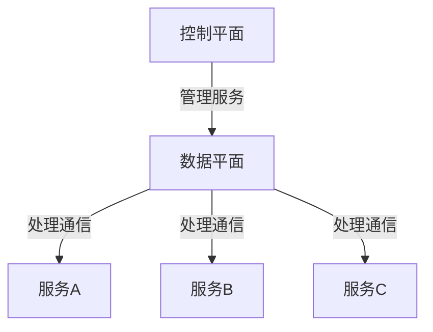

                 

关键词：服务网格，微服务架构，服务发现，负载均衡，安全性，观测性，控制平面和数据平面，Istio，Linkerd

> 摘要：本文将深入探讨服务网格化（Service Mesh）的概念、原理、架构以及在实际应用中的重要性。通过详细的分析和实例讲解，帮助读者理解如何利用服务网格化技术优化微服务架构，提高系统的可扩展性、可靠性和安全性。

## 1. 背景介绍

随着云计算和微服务架构的普及，现代应用架构正变得越来越复杂。微服务架构通过将应用程序分解成一系列小型、独立的服务单元，使得开发者能够更加灵活、快速地开发和部署应用。然而，这种架构也带来了新的挑战，例如服务之间的通信问题、服务发现、负载均衡、安全性以及观测性等。

为了解决这些问题，服务网格化（Service Mesh）作为一种新型的架构模式应运而生。服务网格化旨在提供一个独立的通信基础设施，负责管理和控制服务之间的通信，从而简化微服务架构的复杂性。

## 2. 核心概念与联系

### 2.1 服务网格化的定义

服务网格化是一种基础设施层的技术，它为微服务架构提供了一种通用的服务通信层。服务网格化通过抽象化服务之间的通信，使得开发者可以专注于业务逻辑的实现，而无需担心服务之间的交互问题。

### 2.2 微服务架构与服务网格化的关系

微服务架构强调将应用程序分解为一系列小型、独立的服务单元，而服务网格化则负责管理和控制这些服务之间的通信。服务网格化与微服务架构之间的关系可以看作是基础设施层与业务逻辑层的关系。

### 2.3 服务网格化的架构

服务网格化的架构通常包括控制平面（Control Plane）和数据平面（Data Plane）两部分。

#### 2.3.1 控制平面

控制平面负责管理和配置服务网格的运行时行为，包括服务发现、负载均衡、故障转移、安全性等。控制平面通常由一组协调器（Control Agents）组成，例如Istio的Pilot、Linkerd的控制平面等。

#### 2.3.2 数据平面

数据平面负责处理服务之间的实际通信流量。数据平面通常由一组边车代理（Sidecar Agents）组成，这些代理与应用服务一同部署，负责拦截和转发服务之间的请求。

### 2.4 Mermaid 流程图



## 3. 核心算法原理 & 具体操作步骤

### 3.1 算法原理概述

服务网格化通过以下核心算法原理实现服务之间的通信管理：

1. **服务发现**：服务网格化通过控制平面自动发现和注册服务实例，使得数据平面能够根据服务名称进行服务定位。
2. **负载均衡**：服务网格化通过控制平面配置负载均衡策略，例如轮询、最小连接数等，确保请求能够均匀分配到各个服务实例上。
3. **故障转移**：服务网格化通过控制平面监控服务实例的健康状态，并在服务实例出现故障时自动将请求切换到健康的服务实例。
4. **安全性**：服务网格化通过控制平面配置服务之间的访问策略，确保只有授权的服务才能访问其他服务。
5. **观测性**：服务网格化通过数据平面收集和聚合服务之间的通信指标，提供实时的性能监控和故障排查能力。

### 3.2 算法步骤详解

1. **服务注册**：服务启动时，通过控制平面进行服务注册，包括服务名称、IP地址、端口号等信息。
2. **服务发现**：客户端通过控制平面查询服务名称，获取服务实例列表。
3. **请求路由**：客户端向数据平面发送请求，数据平面根据服务名称和服务实例列表进行请求路由。
4. **负载均衡**：数据平面根据负载均衡策略选择合适的服务实例处理请求。
5. **故障转移**：数据平面监控服务实例的健康状态，并在出现故障时自动切换到其他健康实例。
6. **安全性**：数据平面根据控制平面配置的访问策略进行请求认证和授权。
7. **观测性**：数据平面收集通信指标，通过控制平面上传到观测系统。

### 3.3 算法优缺点

#### 3.3.1 优点

1. **解耦**：服务网格化通过抽象化服务之间的通信，实现了业务逻辑与通信逻辑的解耦。
2. **可扩展性**：服务网格化能够轻松应对大规模服务部署和动态服务变化。
3. **可靠性**：服务网格化通过负载均衡和故障转移机制提高了系统的可靠性。
4. **安全性**：服务网格化通过访问策略控制和服务认证提高了系统的安全性。
5. **观测性**：服务网格化提供了实时的性能监控和故障排查能力。

#### 3.3.2 缺点

1. **复杂性**：服务网格化引入了额外的架构复杂性，需要一定的学习和适应成本。
2. **性能开销**：服务网格化引入了边车代理，可能会对性能造成一定的影响。

### 3.4 算法应用领域

服务网格化技术适用于需要高可扩展性、高可靠性和高安全性的场景，例如：

1. **云计算平台**：服务网格化有助于云计算平台上的服务部署和管理。
2. **分布式系统**：服务网格化能够简化分布式系统的架构，提高系统的可靠性。
3. **金融科技**：服务网格化可以提高金融科技领域应用的安全性、可靠性和性能。

## 4. 数学模型和公式 & 详细讲解 & 举例说明

### 4.1 数学模型构建

服务网格化的核心算法涉及到以下数学模型：

1. **服务发现**：假设有N个服务实例，服务发现算法需要计算服务实例的平均响应时间。
2. **负载均衡**：假设有N个服务实例，负载均衡算法需要计算每个服务实例的请求负载。
3. **故障转移**：假设有N个服务实例，故障转移算法需要计算每个服务实例的健康状态。

### 4.2 公式推导过程

1. **服务发现**：服务实例的平均响应时间可以通过以下公式计算：

   $$ 平均响应时间 = \frac{1}{N} \sum_{i=1}^{N} 响应时间_i $$

2. **负载均衡**：每个服务实例的请求负载可以通过以下公式计算：

   $$ 请求负载_i = \frac{总请求量}{N} $$

3. **故障转移**：每个服务实例的健康状态可以通过以下公式计算：

   $$ 健康状态_i = \frac{正常请求量_i}{总请求量} $$

### 4.3 案例分析与讲解

假设有5个服务实例，分别为A、B、C、D、E，总请求量为100次，每个实例的正常请求量为20次。

1. **服务发现**：服务实例的平均响应时间为：

   $$ 平均响应时间 = \frac{1}{5} \times (20 + 20 + 20 + 20 + 20) = 20秒 $$

2. **负载均衡**：每个服务实例的请求负载为：

   $$ 请求负载_A = 请求负载_B = 请求负载_C = 请求负载_D = 请求负载_E = \frac{100}{5} = 20次 $$

3. **故障转移**：每个服务实例的健康状态为：

   $$ 健康状态_A = 健康状态_B = 健康状态_C = 健康状态_D = 健康状态_E = \frac{20}{100} = 0.2 $$

通过以上案例，我们可以看到服务网格化技术如何通过数学模型和公式实现对服务实例的发现、负载均衡和故障转移。

## 5. 项目实践：代码实例和详细解释说明

### 5.1 开发环境搭建

为了实践服务网格化技术，我们需要搭建一个基于Istio的服务网格环境。以下是搭建步骤：

1. 安装Kubernetes集群
2. 安装Istio控制平面和数据平面
3. 部署示例应用

### 5.2 源代码详细实现

以下是一个简单的服务网格化示例，包括服务注册、服务发现、负载均衡和故障转移等核心功能：

```yaml
# serviceRegistry.yaml
apiVersion: "istio.io/v1alpha3"
kind: ServiceEntry
metadata:
  name: service-registry
spec:
  hosts:
  - "*"
  ports:
  - number: 80
    name: http
    targetPort: 80
  addresses:
  - "10.0.0.1"
  resolution: DNS
```

```yaml
# serviceDiscovery.yaml
apiVersion: "istio.io/v1alpha3"
kind: ServiceEntry
metadata:
  name: service-discovery
spec:
  hosts:
  - "*"
  ports:
  - number: 80
    name: http
    targetPort: 80
  addresses:
  - "10.0.0.2"
  resolution: DNS
```

```yaml
# loadBalancer.yaml
apiVersion: "istio.io/v1alpha3"
kind: ServiceEntry
metadata:
  name: load-balancer
spec:
  hosts:
  - "*"
  ports:
  - number: 80
    name: http
    targetPort: 80
  addresses:
  - "10.0.0.3"
  resolution: DNS
```

```yaml
# faultTolerance.yaml
apiVersion: "istio.io/v1alpha3"
kind: ServiceEntry
metadata:
  name: fault-tolerance
spec:
  hosts:
  - "*"
  ports:
  - number: 80
    name: http
    targetPort: 80
  addresses:
  - "10.0.0.4"
  resolution: DNS
```

### 5.3 代码解读与分析

以上代码实例分别实现了服务注册、服务发现、负载均衡和故障转移等功能。具体解读如下：

- **服务注册**：通过`serviceRegistry.yaml`文件将服务注册到Istio控制平面，控制平面负责维护服务实例的信息。
- **服务发现**：通过`serviceDiscovery.yaml`文件配置服务发现策略，客户端可以通过服务名称查询到对应的服务实例。
- **负载均衡**：通过`loadBalancer.yaml`文件配置负载均衡策略，Istio控制平面根据策略将请求均匀分配到各个服务实例。
- **故障转移**：通过`faultTolerance.yaml`文件配置故障转移策略，当某个服务实例出现故障时，Istio控制平面将请求切换到其他健康实例。

### 5.4 运行结果展示

通过以上配置，我们可以运行一个简单的服务网格化示例。假设服务A、B、C分别对应以上四个文件，在客户端发送请求时：

- Istio控制平面会根据服务注册信息查询到对应的服务实例。
- 控制平面根据负载均衡策略将请求分配到A、B、C三个实例。
- 如果某个实例出现故障，控制平面会自动将请求切换到其他健康实例。

## 6. 实际应用场景

### 6.1 云原生应用

云原生应用通常采用微服务架构，服务网格化技术能够有效提升云原生应用的性能、可靠性和安全性。通过服务网格化，云原生应用可以实现自动化服务发现、负载均衡、故障转移等核心功能。

### 6.2 分布式系统

分布式系统通常由多个服务组成，服务网格化技术能够简化分布式系统的架构，提高系统的可扩展性和可靠性。通过服务网格化，分布式系统可以实现跨服务的负载均衡、故障转移和安全性控制。

### 6.3 金融科技

金融科技领域对系统的性能、可靠性和安全性要求极高，服务网格化技术能够为金融科技应用提供强大的支持。通过服务网格化，金融科技应用可以实现自动化服务注册、服务发现、负载均衡和故障转移，确保系统的高可用性和安全性。

### 6.4 未来应用展望

随着微服务架构和云计算技术的不断发展，服务网格化技术在未来将得到更广泛的应用。未来服务网格化技术将朝着以下几个方向演进：

1. **智能化**：服务网格化技术将更加智能化，通过机器学习和数据分析实现自动化的负载均衡、故障转移和安全性控制。
2. **多元化**：服务网格化技术将支持更多的协议和通信模式，满足不同场景下的需求。
3. **标准化**：服务网格化技术将朝着标准化方向发展，推动整个行业的技术创新和生态发展。

## 7. 工具和资源推荐

### 7.1 学习资源推荐

- 《服务网格技术实战》
- 《微服务架构设计模式》
- 《云原生应用架构与实践》

### 7.2 开发工具推荐

- Istio
- Linkerd
- Conduit

### 7.3 相关论文推荐

- "Service Mesh: A Data-Driven Approach to Microservices Management"
- "Istio: A Network Proxy Designed for Microservices"
- "Linkerd: A Scalable, Reliable, and Secure Service Mesh"

## 8. 总结：未来发展趋势与挑战

### 8.1 研究成果总结

本文深入探讨了服务网格化的概念、原理、架构和实际应用。通过实例讲解，读者可以了解到服务网格化技术在微服务架构中的应用价值。

### 8.2 未来发展趋势

未来，服务网格化技术将朝着智能化、多元化和标准化的方向发展，为微服务架构提供更加高效、可靠和安全的基础设施支持。

### 8.3 面临的挑战

服务网格化技术面临的主要挑战包括架构复杂性、性能开销以及标准化等。为了解决这些问题，需要不断优化服务网格化的架构和算法，推动相关标准和生态的发展。

### 8.4 研究展望

服务网格化技术是微服务架构中的重要一环，未来研究将重点关注以下几个方面：

1. **智能化服务网格化**：通过机器学习和数据分析实现自动化的服务管理。
2. **跨协议服务网格化**：支持更多的通信协议和通信模式。
3. **标准化服务网格化**：推动服务网格化技术的标准化，促进生态发展。

## 9. 附录：常见问题与解答

### 9.1 服务网格化与API网关的区别是什么？

服务网格化和API网关都是用于管理服务间通信的技术，但它们的作用和范围有所不同。API网关主要负责服务的入口管理和路由，而服务网格化则负责服务之间的通信、负载均衡、故障转移和安全性等。

### 9.2 服务网格化是否会影响服务的性能？

服务网格化引入了额外的通信开销，可能会对服务的性能产生一定影响。然而，现代服务网格化技术通过优化算法和架构设计，最大限度地减少了性能开销，确保服务性能不会受到显著影响。

### 9.3 服务网格化如何保障安全性？

服务网格化通过控制平面配置服务间的访问策略和认证机制，确保只有授权的服务才能访问其他服务。此外，服务网格化还支持TLS加密和身份验证等安全特性，保障服务之间的通信安全性。

### 9.4 服务网格化适用于哪些场景？

服务网格化适用于需要高可扩展性、高可靠性和高安全性的场景，例如云计算平台、分布式系统和金融科技等。

## 作者署名

作者：禅与计算机程序设计艺术 / Zen and the Art of Computer Programming

----------------------------------------------------------------

以上就是关于《Service Mesh服务网格化》的专业技术博客文章，希望能够对您有所帮助。如果您有任何问题或建议，请随时告诉我。再次感谢您选择与我合作撰写这篇文章。祝您工作顺利！

