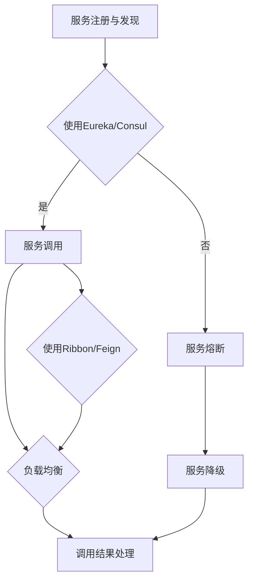

                 

关键词：Spring Cloud, Alibaba, 微服务架构, 分布式系统, 容器化部署, 实践经验

> 摘要：本文将深入探讨Spring Cloud与Alibaba生态系统的集成与实战，涵盖从基础架构到高级应用，再到性能优化和故障处理等多个方面。通过详细的案例分析，帮助读者掌握微服务架构在分布式系统中的实践方法和技巧。

## 1. 背景介绍

在当今信息化时代，企业应用系统日益复杂，传统的单体架构已经无法满足快速变化的市场需求。微服务架构因其高可扩展性、高可用性和松耦合的特性，成为了分布式系统设计的主流方向。Spring Cloud作为一个基于Spring Boot实现的微服务架构开发工具集，提供了众多开箱即用的组件和服务，极大地简化了微服务开发的工作。

与此同时，Alibaba也推出了其自有的微服务解决方案——Alibaba Cloud。Alibaba Cloud不仅集成了Spring Cloud的核心功能，还提供了更多的云原生特性，如容器化部署、服务网格、无服务器架构等，为企业提供了更加全面的微服务支持。

本文将结合Spring Cloud与Alibaba Cloud的实际应用案例，深入探讨微服务架构的实践方法和经验。

## 2. 核心概念与联系

### 2.1 微服务架构的核心概念

微服务架构（Microservices Architecture）是一种架构风格，它通过将应用程序作为一套小的服务集合来构建，每个服务运行在其独立的进程中，服务之间通过轻量级的通信机制（通常是HTTP RESTful API）进行交互。以下是微服务架构的几个核心概念：

- **服务自治**：每个服务都是独立的，可以独立部署、升级和扩展。
- **去中心化**：没有中央控制服务，每个服务都是独立的。
- **垂直拆分**：按照业务功能垂直拆分，而不是水平拆分。
- **独立数据库**：每个服务有自己的数据库，可以独立进行数据库迁移。

### 2.2 Spring Cloud的核心组件

Spring Cloud提供了多个组件来支持微服务开发，其中主要包括：

- **Eureka**：服务发现与注册中心。
- **Ribbon**：客户端负载均衡工具。
- **Hystrix**：断路器，用于服务降级和熔断。
- **Feign**：HTTP客户端，简化了服务调用。
- **Zuul**：API网关，用于路由、过滤器等功能。
- **Consul**：服务发现与配置中心。
- **Config**：分布式配置中心。

### 2.3 Alibaba Cloud的核心特性

Alibaba Cloud提供了以下核心特性，以支持微服务的部署和运维：

- **容器服务（ECS）**：提供弹性计算服务，支持容器化应用。
- **Kubernetes服务**：提供容器编排和管理能力。
- **服务网格（Service Mesh）**：如阿里云的SMN，提供服务间的通信和管理。
- **分布式数据库**：如RDS、MongoDB、Redis等，支持高可用、分布式事务。
- **无服务器架构**：如阿里云的函数计算，实现按需计费。

### 2.4 Mermaid流程图



## 3. 核心算法原理 & 具体操作步骤

### 3.1 算法原理概述

在微服务架构中，算法的核心在于服务治理和服务调用。以下是Spring Cloud和Alibaba Cloud中常用的几个算法原理：

- **服务注册与发现**：通过Eureka或Consul，服务实例在启动时将自己注册到注册中心，其他服务实例可以通过注册中心获取到所有服务实例的信息，实现动态的服务发现。
- **负载均衡**：通过Ribbon或Feign，客户端在调用服务时，根据设定的负载均衡策略，从多个服务实例中选择一个进行调用。
- **断路器模式**：通过Hystrix，当服务发生异常时，断路器会触发熔断，防止系统雪崩，并允许服务进行降级处理。

### 3.2 算法步骤详解

#### 3.2.1 服务注册与发现

1. 启动Eureka或Consul服务，作为服务注册中心。
2. 启动服务实例，在启动参数中添加`--spring.cloud.service-discovery.register-enabled=true`，服务实例将自动注册到注册中心。
3. 其他服务实例可以通过`@DiscoveryClient`注解获取注册中心的服务列表。

#### 3.2.2 负载均衡

1. 在客户端添加Ribbon或Feign依赖。
2. 在客户端配置负载均衡策略，如轮询、随机等。
3. 客户端通过`@LoadBalanced`注解的RestTemplate或Feign接口调用服务。

#### 3.2.3 断路器模式

1. 在服务提供者和服务消费者中添加Hystrix依赖。
2. 使用`@HystrixCommand`注解，为服务方法添加断路器逻辑。
3. 在断路器配置中设置熔断和降级策略。

### 3.3 算法优缺点

#### 优点

- **服务治理简单**：通过注册中心，实现服务实例的自动注册和发现，降低了服务治理的复杂性。
- **高可用性**：通过负载均衡和断路器模式，提高系统的可用性和稳定性。
- **弹性伸缩**：服务实例可以独立部署和扩展，支持水平伸缩。

#### 缺点

- **分布式系统复杂度增加**：随着服务数量的增加，系统复杂度也会增加，需要更加完善的监控和管理。
- **性能开销**：服务调用和治理过程会增加一定的性能开销。

### 3.4 算法应用领域

- **电子商务**：用于处理高并发、分布式的事务，如订单处理、库存管理。
- **金融交易**：用于处理高频、低延迟的交易，如股票交易、支付系统。
- **物联网**：用于处理大规模设备的连接和数据处理。

## 4. 数学模型和公式 & 详细讲解 & 举例说明

### 4.1 数学模型构建

在微服务架构中，数学模型主要用于服务调用和服务治理。以下是一个简单的服务调用模型：

- **服务实例数量**：\( N \)
- **请求频率**：\( R \)
- **负载均衡策略**：\( P \)

### 4.2 公式推导过程

服务调用的平均响应时间（\( T \)）可以通过以下公式计算：

\[ T = \frac{1}{R} \times \sum_{i=1}^{N} \frac{1}{P_i} \]

其中，\( P_i \) 表示第 \( i \) 个服务实例的负载。

### 4.3 案例分析与讲解

假设有10个服务实例，每个服务实例的负载均衡策略是轮询，请求频率为100次/秒。

1. 计算每个服务实例的平均响应时间：

\[ T_i = \frac{1}{100} \times \frac{1}{10} = 0.01 \text{秒} \]

2. 计算总平均响应时间：

\[ T = \frac{1}{100} \times 10 \times 0.01 = 0.001 \text{秒} \]

这意味着，每个请求的平均响应时间为1毫秒。

## 5. 项目实践：代码实例和详细解释说明

### 5.1 开发环境搭建

- **开发工具**：IntelliJ IDEA
- **开发语言**：Java
- **依赖管理**：Maven
- **Spring Cloud版本**：Hoxton.SR1
- **Alibaba Cloud SDK版本**：3.0.0

### 5.2 源代码详细实现

#### 5.2.1 服务注册与发现

```java
@SpringBootApplication
@EnableEurekaServer
public class ServiceRegistryApplication {
    public static void main(String[] args) {
        SpringApplication.run(ServiceRegistryApplication.class, args);
    }
}
```

#### 5.2.2 客户端负载均衡

```java
@SpringBootApplication
@EnableDiscoveryClient
public class CustomerApplication {
    public static void main(String[] args) {
        SpringApplication.run(CustomerApplication.class, args);
    }

    @LoadBalanced
    @Bean
    public RestTemplate restTemplate() {
        return new RestTemplate();
    }
}
```

#### 5.2.3 服务熔断与降级

```java
@Service
public class OrderService {
    @HystrixCommand(fallbackMethod = "orderFallback")
    public String order(String orderId) {
        // 订单逻辑处理
        return "Order processed: " + orderId;
    }

    public String orderFallback(String orderId) {
        return "Order processing failed: " + orderId;
    }
}
```

### 5.3 代码解读与分析

代码实例中，我们分别实现了服务注册与发现、客户端负载均衡以及服务熔断与降级。其中：

- **服务注册与发现**：通过`@EnableEurekaServer`注解，启动Eureka服务注册中心。
- **客户端负载均衡**：通过`@LoadBalanced`注解，配置RestTemplate进行负载均衡调用。
- **服务熔断与降级**：通过`@HystrixCommand`注解，为订单服务添加熔断和降级逻辑。

### 5.4 运行结果展示

1. 启动Eureka服务注册中心，访问`http://localhost:8761`，可以看到所有服务实例的注册信息。
2. 启动客户端服务，通过RestTemplate调用订单服务，例如：

```java
RestTemplate restTemplate = new RestTemplate();
String result = restTemplate.getForObject("http://customer/order/123", String.class);
System.out.println(result);
```

运行结果会显示订单处理成功或失败的消息。

## 6. 实际应用场景

### 6.1 电商平台

电商平台通常需要处理海量的订单和用户请求，通过Spring Cloud和Alibaba Cloud实现微服务架构，可以提供高可用性、高并发处理能力和弹性伸缩能力。

### 6.2 金融系统

金融系统对稳定性和性能要求极高，通过微服务架构可以实现服务的模块化，提高系统的可靠性和可维护性。

### 6.3 物流管理

物流管理涉及大量数据传输和实时处理，通过微服务架构可以实现分布式数据处理和状态管理，提高系统的效率和准确性。

## 7. 工具和资源推荐

### 7.1 学习资源推荐

- **Spring Cloud官方文档**：https://cloud.spring.io/spring-cloud
- **Alibaba Cloud官方文档**：https://www.alibabacloud.com/documentation
- **Spring Cloud中文社区**：https://springcloud.cn
- **Alibaba Cloud社区**：https://developer.aliyun.com

### 7.2 开发工具推荐

- **IntelliJ IDEA**：功能强大的开发工具，支持Spring Cloud和Alibaba Cloud。
- **Visual Studio Code**：轻量级开发工具，适合快速开发和调试。

### 7.3 相关论文推荐

- **"Microservices: Designing Fine-Grained Systems" by Sam Newman**：介绍微服务架构的核心概念和实践。
- **"Service Mesh: A Modern Approach to Service Intercommunication" by Kelsey Hightower et al.**：介绍服务网格的概念和实现。

## 8. 总结：未来发展趋势与挑战

### 8.1 研究成果总结

本文总结了Spring Cloud和Alibaba Cloud在微服务架构中的实践方法，包括服务注册与发现、负载均衡、断路器模式等核心算法，并通过代码实例进行了详细讲解。

### 8.2 未来发展趋势

- **云原生技术的发展**：微服务与云原生的融合，将推动微服务架构的进一步演进。
- **服务网格的普及**：服务网格将逐渐取代传统的服务治理方式，提供更高效、更灵活的服务通信。

### 8.3 面临的挑战

- **分布式系统的复杂度**：随着服务数量的增加，系统的复杂度也会增加，需要更加完善的监控和管理。
- **数据一致性和分布式事务**：分布式系统中，如何保证数据的一致性和事务的完整性是一个重要挑战。

### 8.4 研究展望

未来的研究可以关注以下几个方面：

- **自动化服务治理**：通过机器学习和人工智能技术，实现自动化的服务治理和优化。
- **分布式数据库和存储**：研究如何构建高性能、可扩展的分布式数据库和存储系统。

## 9. 附录：常见问题与解答

### 9.1 服务注册失败

- 确保服务注册中心（如Eureka）已启动并运行。
- 检查服务实例的网络配置，确保能够访问注册中心。
- 检查日志，查找可能的问题和错误信息。

### 9.2 负载均衡策略选择

- 根据具体业务需求选择合适的负载均衡策略，如轮询、随机、权重等。
- 可以结合系统的性能测试结果，选择最优的负载均衡策略。

### 9.3 断路器误触发

- 调整断路器的阈值和超时时间，以避免误触发。
- 添加自定义的逻辑，对异常情况进行判断和处理，减少误触发的概率。

---

本文由“禅与计算机程序设计艺术”撰写，旨在为读者提供关于Spring Cloud Alibaba微服务实践的全面指南。希望本文能够帮助您更好地理解和应用微服务架构，实现高效、稳定的分布式系统开发。

