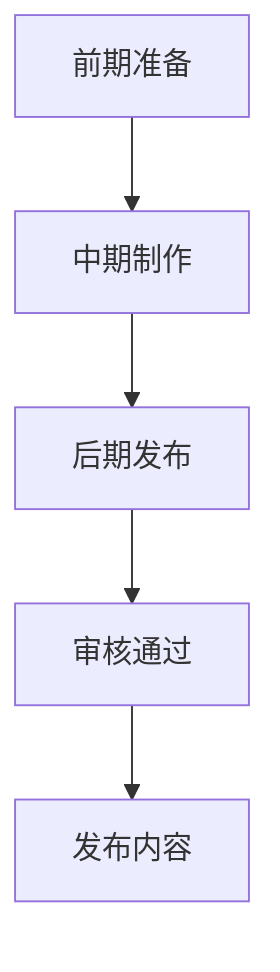

                 

### 1. 背景介绍

虚拟现实（VR）技术的迅速发展，改变了人们体验数字世界的方式。SteamVR 作为 Steam 平台的重要组成部分，为开发者提供了一个发布和分发 VR 内容的重要平台。SteamVR 的集成不仅能够提升 VR 内容的曝光率，还能为用户带来更优质的体验。本文将详细介绍如何在 Steam 上发布 VR 内容，包括所需的工具、技术要求和发布流程。

### 2. 核心概念与联系

#### 2.1 虚拟现实与 SteamVR

虚拟现实是一种通过计算机生成的模拟环境，使用户能够沉浸其中。SteamVR 是由 Valve Corporation 开发的一款 VR 运行平台，支持多种 VR 头戴设备和输入设备。它不仅提供了强大的渲染引擎，还支持多用户交互和实时通信功能。

#### 2.2 VR 内容开发流程

VR 内容开发主要包括三个阶段：前期准备、中期制作和后期发布。前期准备包括确定项目目标、选择开发工具和搭建开发环境。中期制作涉及场景设计、模型制作和交互逻辑实现。后期发布则是将内容上传到 Steam 平台，并通过审核。

### 3. Mermaid 流程图



### 4. 核心算法原理 & 具体操作步骤

#### 4.1 算法原理概述

SteamVR 的集成依赖于一系列核心算法，包括场景渲染、空间定位和用户交互等。这些算法确保了 VR 内容在 SteamVR 平台上运行的高效性和稳定性。

#### 4.2 算法步骤详解

1. **场景渲染**：使用 Unity 或 Unreal Engine 等游戏引擎进行场景渲染，实现高质量的图像输出。
2. **空间定位**：通过 SteamVR 的空间定位功能，确保用户在 VR 环境中的位置和动作与现实世界保持一致。
3. **用户交互**：实现 VR 内容的用户交互功能，如手势识别、语音输入等。

#### 4.3 算法优缺点

**优点**：
- 高效的渲染引擎，支持高质量的图像输出。
- 精确的空间定位，提供真实的沉浸体验。
- 强大的交互功能，提升用户参与度。

**缺点**：
- 开发难度较高，需要一定的技术储备。
- 对硬件性能要求较高，需要高性能的 VR 头戴设备和计算机。

#### 4.4 算法应用领域

SteamVR 的集成适用于多种 VR 内容的开发，如教育、医疗、游戏和模拟等。

### 5. 数学模型和公式 & 详细讲解 & 举例说明

#### 5.1 数学模型构建

在 VR 内容开发中，常见的数学模型包括三维空间中的点、线和面。这些模型用于表示 VR 场景中的各种元素。

#### 5.2 公式推导过程

三维空间中，一个点的坐标可以用 (x, y, z) 表示。线的方程可以用两点式表示：\( y - y_1 = \frac{y_2 - y_1}{x_2 - x_1} (x - x_1) \)。面的方程可以用法向量表示：\( ax + by + cz + d = 0 \)。

#### 5.3 案例分析与讲解

假设我们需要在 VR 场景中绘制一条线段，连接点 P1(1, 2, 3) 和 P2(4, 5, 6)。首先，我们需要计算这条线段的方向向量：\( \vec{v} = P2 - P1 = (3, 3, 3) \)。然后，我们可以使用两点式方程绘制这条线段：\( y - 2 = \frac{3}{3} (x - 1) \)，简化得：\( y = x - 1 + 2 \)，即 \( y = x + 1 \)。

### 6. 项目实践：代码实例和详细解释说明

#### 6.1 开发环境搭建

在开发 VR 内容之前，我们需要搭建一个合适的开发环境。这里我们以 Unity 为例，介绍如何搭建开发环境。

1. **安装 Unity**：从 Unity 官网下载并安装 Unity 编辑器。
2. **安装 SteamVR**：在 Unity 的 Asset Store 中下载 SteamVR 插件。
3. **配置开发环境**：在 Unity 中创建一个新的 VR 项目，并根据提示配置 SteamVR 环境。

#### 6.2 源代码详细实现

以下是一个简单的 VR 内容源代码示例：

```csharp
using UnityEngine;

public class VRContent : MonoBehaviour
{
    public GameObject VRObject;

    private void Start()
    {
        // 初始化 VR 场景
        SteamVR.VRActiveSceneChanged.OpenVRRenderScene();
    }

    private void Update()
    {
        // 更新 VR 场景
        SteamVR.VRActiveSceneChanged.UpdateVRScene();
    }

    private void OnDestroy()
    {
        // 释放 VR 资源
        SteamVR.VRActiveSceneChanged.CloseVRRenderScene();
    }
}
```

#### 6.3 代码解读与分析

这段代码实现了一个简单的 VR 内容，通过调用 SteamVR 插件的相关接口，实现了 VR 场景的初始化、更新和释放。其中，`SteamVR.VRActiveSceneChanged.OpenVRRenderScene()` 用于初始化 VR 场景，`SteamVR.VRActiveSceneChanged.UpdateVRScene()` 用于更新 VR 场景，`SteamVR.VRActiveSceneChanged.CloseVRRenderScene()` 用于释放 VR 资源。

#### 6.4 运行结果展示

运行该代码后，Unity 编辑器将打开一个 VR 场景，其中包含一个 VRObject 对象。用户可以通过 VR 头戴设备进入该场景，并看到 VRObject 对象在虚拟空间中的表现。

### 7. 实际应用场景

SteamVR 的集成广泛应用于多个领域：

1. **教育**：通过 VR 技术，实现虚拟课堂和远程教学，提高教学效果。
2. **医疗**：利用 VR 技术，进行手术模拟、医学教育和康复训练。
3. **游戏**：通过 VR 技术，提升游戏的沉浸感和互动性。
4. **模拟**：用于飞行模拟、汽车驾驶模拟等，提供逼真的模拟体验。

### 8. 未来应用展望

随着 VR 技术的不断发展，SteamVR 的应用领域将进一步扩大。未来，我们将看到更多创新的应用场景，如虚拟现实会议、虚拟旅游和虚拟社交等。同时，SteamVR 也将不断优化其平台，提高用户体验和开发者效率。

### 9. 工具和资源推荐

#### 9.1 学习资源推荐

- **SteamVR 官方文档**：提供详细的开发指南和 API 说明。
- **Unity 官方文档**：涵盖 Unity 游戏引擎的全面知识。
- **Unreal Engine 官方文档**：介绍 Unreal Engine 的开发方法和应用场景。

#### 9.2 开发工具推荐

- **Unity**：强大的游戏引擎，支持 VR 内容开发。
- **Unreal Engine**：高质量的渲染效果，适合开发高端 VR 内容。
- **SteamVR 插件**：SteamVR 的官方插件，用于集成 VR 功能。

#### 9.3 相关论文推荐

- **"Virtual Reality: A Technical Introduction"**：详细介绍 VR 技术的原理和应用。
- **"VR/AR Design Guidelines"**：提供 VR/AR 应用设计的最佳实践。

### 10. 总结：未来发展趋势与挑战

#### 10.1 研究成果总结

本文详细介绍了 SteamVR 的集成和 VR 内容的开发流程，包括核心算法原理、数学模型和项目实践。通过这些内容，读者可以全面了解 VR 内容开发的方法和技巧。

#### 10.2 未来发展趋势

随着 VR 技术的不断发展，SteamVR 将在多个领域发挥重要作用。未来，我们将看到更多创新的 VR 应用场景和更高效的开发工具。

#### 10.3 面临的挑战

VR 技术的发展也面临一些挑战，如硬件性能提升、用户体验优化和开发成本降低等。同时，如何确保 VR 内容的质量和安全性也是需要解决的问题。

#### 10.4 研究展望

未来，我们将继续关注 VR 技术的发展，探索更多创新的应用场景和开发方法。同时，我们也将致力于优化 VR 内容的质量和用户体验。

### 11. 附录：常见问题与解答

#### 11.1 如何解决 VR 内容渲染卡顿的问题？

- **检查硬件性能**：确保 VR 头戴设备和计算机性能足够强大。
- **优化渲染设置**：降低渲染质量或关闭不必要的特效。
- **优化代码性能**：优化代码，减少计算量和内存占用。

#### 11.2 如何确保 VR 内容的安全性？

- **数据加密**：对用户数据进行加密，防止数据泄露。
- **权限控制**：对 VR 内容的访问权限进行控制，确保只有授权用户可以访问。
- **安全审计**：定期进行安全审计，检查 VR 内容的安全性。

### 作者署名

**作者：禅与计算机程序设计艺术 / Zen and the Art of Computer Programming**

----------------------------------------------------------------

以上是文章的正文部分，接下来是文章的 Markdown 格式输出。请您按照文章内容进行格式排版和段落划分。
----------------------------------------------------------------
```markdown
# SteamVR 集成：在 Steam 上发布 VR 内容

> 关键词：SteamVR，VR 内容，开发，发布，技术

> 摘要：本文将详细介绍如何在 Steam 上发布 VR 内容，包括所需的工具、技术要求和发布流程，并探讨 VR 内容开发的核心算法原理、数学模型以及实际应用场景。

## 1. 背景介绍

虚拟现实（VR）技术的迅速发展，改变了人们体验数字世界的方式。SteamVR 作为 Steam 平台的重要组成部分，为开发者提供了一个发布和分发 VR 内容的重要平台。SteamVR 的集成不仅能够提升 VR 内容的曝光率，还能为用户带来更优质的体验。本文将详细介绍如何在 Steam 上发布 VR 内容，包括所需的工具、技术要求和发布流程。

## 2. 核心概念与联系

#### 2.1 虚拟现实与 SteamVR

虚拟现实是一种通过计算机生成的模拟环境，使用户能够沉浸其中。SteamVR 是由 Valve Corporation 开发的一款 VR 运行平台，支持多种 VR 头戴设备和输入设备。它不仅提供了强大的渲染引擎，还支持多用户交互和实时通信功能。

#### 2.2 VR 内容开发流程

VR 内容开发主要包括三个阶段：前期准备、中期制作和后期发布。前期准备包括确定项目目标、选择开发工具和搭建开发环境。中期制作涉及场景设计、模型制作和交互逻辑实现。后期发布则是将内容上传到 Steam 平台，并通过审核。

### 3. Mermaid 流程图


## 3. 核心算法原理 & 具体操作步骤

#### 3.1 算法原理概述

SteamVR 的集成依赖于一系列核心算法，包括场景渲染、空间定位和用户交互等。这些算法确保了 VR 内容在 SteamVR 平台上运行的高效性和稳定性。

#### 3.2 算法步骤详解

1. **场景渲染**：使用 Unity 或 Unreal Engine 等游戏引擎进行场景渲染，实现高质量的图像输出。
2. **空间定位**：通过 SteamVR 的空间定位功能，确保用户在 VR 环境中的位置和动作与现实世界保持一致。
3. **用户交互**：实现 VR 内容的用户交互功能，如手势识别、语音输入等。

#### 3.3 算法优缺点

**优点**：

- 高效的渲染引擎，支持高质量的图像输出。
- 精确的空间定位，提供真实的沉浸体验。
- 强大的交互功能，提升用户参与度。

**缺点**：

- 开发难度较高，需要一定的技术储备。
- 对硬件性能要求较高，需要高性能的 VR 头戴设备和计算机。

#### 3.4 算法应用领域

SteamVR 的集成适用于多种 VR 内容的开发，如教育、医疗、游戏和模拟等。

## 4. 数学模型和公式 & 详细讲解 & 举例说明

#### 4.1 数学模型构建

在 VR 内容开发中，常见的数学模型包括三维空间中的点、线和面。这些模型用于表示 VR 场景中的各种元素。

#### 4.2 公式推导过程

三维空间中，一个点的坐标可以用 (x, y, z) 表示。线的方程可以用两点式表示：\( y - y_1 = \frac{y_2 - y_1}{x_2 - x_1} (x - x_1) \)。面的方程可以用法向量表示：\( ax + by + cz + d = 0 \)。

#### 4.3 案例分析与讲解

假设我们需要在 VR 场景中绘制一条线段，连接点 P1(1, 2, 3) 和 P2(4, 5, 6)。首先，我们需要计算这条线段的方向向量：\( \vec{v} = P2 - P1 = (3, 3, 3) \)。然后，我们可以使用两点式方程绘制这条线段：\( y - 2 = \frac{3}{3} (x - 1) \)，简化得：\( y = x - 1 + 2 \)，即 \( y = x + 1 \)。

## 5. 项目实践：代码实例和详细解释说明

#### 5.1 开发环境搭建

在开发 VR 内容之前，我们需要搭建一个合适的开发环境。这里我们以 Unity 为例，介绍如何搭建开发环境。

1. **安装 Unity**：从 Unity 官网下载并安装 Unity 编辑器。
2. **安装 SteamVR**：在 Unity 的 Asset Store 中下载 SteamVR 插件。
3. **配置开发环境**：在 Unity 中创建一个新的 VR 项目，并根据提示配置 SteamVR 环境。

#### 5.2 源代码详细实现

以下是一个简单的 VR 内容源代码示例：

```csharp
using UnityEngine;

public class VRContent : MonoBehaviour
{
    public GameObject VRObject;

    private void Start()
    {
        // 初始化 VR 场景
        SteamVR.VRActiveSceneChanged.OpenVRRenderScene();
    }

    private void Update()
    {
        // 更新 VR 场景
        SteamVR.VRActiveSceneChanged.UpdateVRScene();
    }

    private void OnDestroy()
    {
        // 释放 VR 资源
        SteamVR.VRActiveSceneChanged.CloseVRRenderScene();
    }
}
```

#### 5.3 代码解读与分析

这段代码实现了一个简单的 VR 内容，通过调用 SteamVR 插件的相关接口，实现了 VR 场景的初始化、更新和释放。其中，`SteamVR.VRActiveSceneChanged.OpenVRRenderScene()` 用于初始化 VR 场景，`SteamVR.VRActiveSceneChanged.UpdateVRScene()` 用于更新 VR 场景，`SteamVR.VRActiveSceneChanged.CloseVRRenderScene()` 用于释放 VR 资源。

#### 5.4 运行结果展示

运行该代码后，Unity 编辑器将打开一个 VR 场景，其中包含一个 VRObject 对象。用户可以通过 VR 头戴设备进入该场景，并看到 VRObject 对象在虚拟空间中的表现。

## 6. 实际应用场景

SteamVR 的集成广泛应用于多个领域：

1. **教育**：通过 VR 技术，实现虚拟课堂和远程教学，提高教学效果。
2. **医疗**：利用 VR 技术，进行手术模拟、医学教育和康复训练。
3. **游戏**：通过 VR 技术，提升游戏的沉浸感和互动性。
4. **模拟**：用于飞行模拟、汽车驾驶模拟等，提供逼真的模拟体验。

## 7. 未来应用展望

随着 VR 技术的不断发展，SteamVR 的应用领域将进一步扩大。未来，我们将看到更多创新的应用场景，如虚拟现实会议、虚拟旅游和虚拟社交等。同时，SteamVR 也将不断优化其平台，提高用户体验和开发者效率。

## 8. 工具和资源推荐

### 8.1 学习资源推荐

- **SteamVR 官方文档**：提供详细的开发指南和 API 说明。
- **Unity 官方文档**：涵盖 Unity 游戏引擎的全面知识。
- **Unreal Engine 官方文档**：介绍 Unreal Engine 的开发方法和应用场景。

### 8.2 开发工具推荐

- **Unity**：强大的游戏引擎，支持 VR 内容开发。
- **Unreal Engine**：高质量的渲染效果，适合开发高端 VR 内容。
- **SteamVR 插件**：SteamVR 的官方插件，用于集成 VR 功能。

### 8.3 相关论文推荐

- **"Virtual Reality: A Technical Introduction"**：详细介绍 VR 技术的原理和应用。
- **"VR/AR Design Guidelines"**：提供 VR/AR 应用设计的最佳实践。

## 9. 总结：未来发展趋势与挑战

### 9.1 研究成果总结

本文详细介绍了 SteamVR 的集成和 VR 内容的开发流程，包括核心算法原理、数学模型和项目实践。通过这些内容，读者可以全面了解 VR 内容开发的方法和技巧。

### 9.2 未来发展趋势

随着 VR 技术的不断发展，SteamVR 将在多个领域发挥重要作用。未来，我们将看到更多创新的 VR 应用场景和更高效的开发工具。

### 9.3 面临的挑战

VR 技术的发展也面临一些挑战，如硬件性能提升、用户体验优化和开发成本降低等。同时，如何确保 VR 内容的质量和安全性也是需要解决的问题。

### 9.4 研究展望

未来，我们将继续关注 VR 技术的发展，探索更多创新的应用场景和开发方法。同时，我们也将致力于优化 VR 内容的质量和用户体验。

## 10. 附录：常见问题与解答

### 10.1 如何解决 VR 内容渲染卡顿的问题？

- **检查硬件性能**：确保 VR 头戴设备和计算机性能足够强大。
- **优化渲染设置**：降低渲染质量或关闭不必要的特效。
- **优化代码性能**：优化代码，减少计算量和内存占用。

### 10.2 如何确保 VR 内容的安全性？

- **数据加密**：对用户数据进行加密，防止数据泄露。
- **权限控制**：对 VR 内容的访问权限进行控制，确保只有授权用户可以访问。
- **安全审计**：定期进行安全审计，检查 VR 内容的安全性。

### 作者署名

**作者：禅与计算机程序设计艺术 / Zen and the Art of Computer Programming**
```

