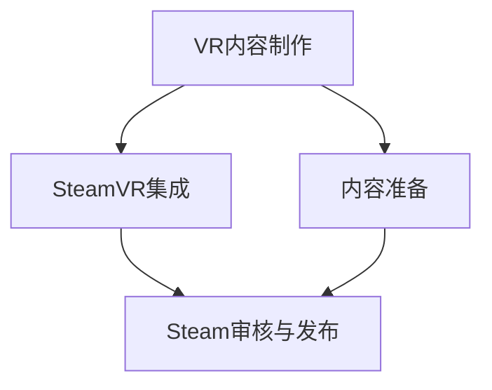

                 

 

## 1. 背景介绍

虚拟现实（Virtual Reality，VR）技术正在快速崛起，改变着人们的娱乐、教育、医疗等多个领域的体验方式。作为VR内容分发的主要平台之一，Steam平台为广大VR开发者提供了广阔的舞台。然而，要将VR内容成功发布到Steam上，需要掌握一系列的技术和实践。本文将详细探讨SteamVR集成以及如何成功在Steam上发布VR内容。

### 1.1 VR技术的发展

VR技术的起源可以追溯到20世纪50年代，但直到21世纪，随着计算能力和显示技术的进步，VR才真正迎来了爆发期。早期的VR设备主要是一些笨重的头戴式显示器（HMD），而现在的VR设备则更加轻便、舒适，并且具有更高的分辨率和更低的延迟。VR技术的发展不仅推动了游戏产业的变革，还影响了教育、医疗、设计等多个领域。

### 1.2 Steam平台的优势

Steam平台是全球最大的数字游戏发行平台之一，拥有庞大的用户基础和完善的生态系统。Steam平台的优势在于其良好的用户界面、强大的社区功能和广泛的内容分发渠道。对于VR开发者来说，Steam提供了一个高效的内容发布和销售平台，使得他们的作品能够触达全球的VR爱好者。

### 1.3 VR内容的发布需求

在Steam上发布VR内容，不仅需要具备一定的技术能力，还需要了解平台的具体要求和流程。开发者需要掌握VR内容的制作技术，熟悉Steam的发布流程，以及了解如何优化内容以提高用户体验和销量。因此，本文将从技术、流程和策略三个方面对SteamVR集成进行深入探讨。

## 2. 核心概念与联系

### 2.1 VR内容制作技术

VR内容制作技术是VR开发的基础。开发者需要掌握3D建模、动画制作、渲染技术等，以确保VR内容的视觉效果和互动体验。以下是一个简单的VR内容制作流程：

- **3D建模与动画**：使用3D建模软件（如Blender、Maya）创建三维场景和角色，并进行动画制作。
- **渲染技术**：使用渲染引擎（如Unity、Unreal Engine）进行场景渲染，以生成高质量的视觉效果。
- **互动设计**：设计用户与VR内容的交互方式，包括触觉反馈、手势识别等。

### 2.2 SteamVR集成

SteamVR集成是将VR内容与Steam平台相结合的过程。以下是一个简化的SteamVR集成流程：

- **环境搭建**：安装SteamVR开发工具包，配置开发环境。
- **内容导入**：将VR内容导入到SteamVR中，包括场景、角色和交互元素。
- **测试与优化**：在SteamVR中测试内容，调整参数以优化性能和体验。

### 2.3 VR内容发布流程

在Steam上发布VR内容，需要遵循以下流程：

- **内容准备**：完成VR内容的制作，并确保内容符合Steam的要求。
- **Steam资产系统**：在Steam资产系统中上传内容，填写相关信息。
- **审核与发布**：等待Steam平台的审核，审核通过后即可发布内容。

### 2.4 Mermaid流程图

以下是一个Mermaid流程图，展示了VR内容制作、SteamVR集成和发布流程：



## 3. 核心算法原理 & 具体操作步骤

### 3.1 算法原理概述

SteamVR集成过程中涉及的核心算法主要包括：

- **3D空间感知算法**：用于定位和追踪用户在虚拟环境中的位置和动作。
- **图像处理算法**：用于处理和渲染虚拟环境中的图像，以提高画面质量和流畅度。
- **网络传输算法**：用于在VR内容和Steam平台之间传输数据，以确保内容的实时性和稳定性。

### 3.2 算法步骤详解

#### 3.2.1 3D空间感知算法

- **位置追踪**：使用传感器（如加速度计、陀螺仪）采集用户的位置信息，并通过卡尔曼滤波等算法进行数据融合和误差修正。
- **动作识别**：使用深度相机或红外传感器捕捉用户的手势和动作，并通过机器学习算法进行识别和分类。

#### 3.2.2 图像处理算法

- **实时渲染**：使用OpenGL或DirectX等图形库进行场景渲染，以生成高质量的视觉效果。
- **图像增强**：使用图像滤波和色彩调整等技术，提高图像的对比度和清晰度。

#### 3.2.3 网络传输算法

- **数据压缩**：使用H.264或HEVC等视频编码技术，对图像数据进行压缩，以减少传输带宽。
- **数据传输**：使用WebSocket或HTTP/2等网络协议，实现VR内容与Steam平台之间的实时数据传输。

### 3.3 算法优缺点

- **3D空间感知算法**：优点在于可以实时捕捉用户的位置和动作，提高VR体验的沉浸感。缺点在于对硬件要求较高，且算法复杂度较高。
- **图像处理算法**：优点在于可以显著提高VR内容的画面质量，增强视觉效果。缺点在于计算资源消耗较大，可能影响性能。
- **网络传输算法**：优点在于可以实现VR内容的实时传输，提高用户体验。缺点在于网络延迟可能影响VR内容的流畅性。

### 3.4 算法应用领域

- **游戏**：VR游戏是VR技术应用最广泛的领域之一，通过3D空间感知算法和图像处理算法，可以实现高度沉浸的游戏体验。
- **教育**：VR教育应用可以通过VR内容制作技术和SteamVR集成技术，提供沉浸式的教学体验，提高学生的学习兴趣和效果。
- **医疗**：VR医疗应用可以通过VR内容制作技术和SteamVR集成技术，模拟手术过程或进行心理治疗，提高医疗效率和治疗效果。

## 4. 数学模型和公式 & 详细讲解 & 举例说明

### 4.1 数学模型构建

在VR内容制作和SteamVR集成过程中，涉及到多个数学模型，以下是其中两个重要的模型：

#### 4.1.1 3D空间感知模型

- **位置模型**：表示用户在虚拟环境中的位置，可以使用四元数表示。
- **姿态模型**：表示用户在虚拟环境中的姿态，可以使用欧拉角或旋转矩阵表示。

#### 4.1.2 图像处理模型

- **滤波模型**：用于去除图像中的噪声，可以使用高斯滤波或双边滤波。
- **色彩调整模型**：用于调整图像的亮度和对比度，可以使用直方图均衡化或色彩映射。

### 4.2 公式推导过程

以下是一个简化的3D空间感知模型推导过程：

- **位置模型**：假设用户的位置可以表示为四元数$q = (w, x, y, z)$，则用户的位置可以通过以下公式计算：

  $$ p = T \cdot q \cdot T^{-1} $$

  其中，$T$为旋转矩阵，$p$为用户的位置。

- **姿态模型**：假设用户的姿态可以表示为旋转矩阵$R$，则用户的位置可以通过以下公式计算：

  $$ R = R_x \cdot R_y \cdot R_z $$

  其中，$R_x$、$R_y$和$R_z$分别为绕x轴、y轴和z轴的旋转矩阵。

### 4.3 案例分析与讲解

以下是一个简单的图像处理案例：

- **目标**：提高图像的对比度。
- **方法**：使用直方图均衡化。

  假设原图像的灰度分布为：

  $$ h(r) = \begin{cases} 
  0 & r \leq 0 \\
  10 & 0 < r \leq 50 \\
  30 & 50 < r \leq 100 \\
  50 & 100 < r \leq 150 \\
  10 & 150 < r \leq 200 \\
  0 & r > 200 
  \end{cases} $$

  经过直方图均衡化后的灰度分布为：

  $$ h'(r) = \begin{cases} 
  0 & r \leq 0 \\
  20 & 0 < r \leq 50 \\
  60 & 50 < r \leq 100 \\
  100 & 100 < r \leq 150 \\
  120 & 150 < r \leq 200 \\
  160 & 200 < r \leq 250 \\
  200 & r > 250 
  \end{cases} $$

  通过调整灰度分布，可以显著提高图像的对比度。

## 5. 项目实践：代码实例和详细解释说明

### 5.1 开发环境搭建

在开始VR内容开发之前，需要搭建合适的开发环境。以下是一个简单的开发环境搭建步骤：

- **安装Unity**：下载并安装Unity 2021.3.3版本及以上。
- **安装SteamVR插件**：在Unity的Asset Store中下载并安装SteamVR插件。
- **配置SteamVR开发工具**：在Steam中安装SteamVR开发工具包，并按照说明进行配置。

### 5.2 源代码详细实现

以下是一个简单的VR内容制作和SteamVR集成的源代码实例：

```csharp
using UnityEngine;
using Valve.VR;

public class SteamVRIntegration : MonoBehaviour
{
    public SteamVR_ACTIVE_CONTROLLER_INDEXES controllerIndex;
    
    void Start()
    {
        // 初始化SteamVR
        SteamVR_Init();
        
        // 配置控制器
        SteamVR_Events.controllerUpdated.AddListener(OnControllerUpdated);
    }
    
    void OnControllerUpdated(SteamVR_Controller.Device device)
    {
        // 更新控制器状态
        if (device == null) return;

        // 获取控制器位置和姿态
        SteamVR_ACTIVE_CONTROLLER_INDEXES pos = device.transform.localPosition;
        SteamVR_ACTIVE_CONTROLLER_INDEXES rot = device.transform.localRotation;

        // 更新虚拟环境中的控制器位置和姿态
        transform.localPosition = pos;
        transform.localRotation = rot;
    }
    
    void Update()
    {
        // 处理控制器输入
        if (controllerIndex != null)
        {
            SteamVR_Controller.Device device = SteamVR_Controller.Input((int)controllerIndex);
            if (device != null)
            {
                // 获取控制器输入
                float trigger = device.GetAxis(SteamVR_Controller轴Triggers.TriggerAxis).x;
                float touchpadX = device.GetAxis(SteamVR_Controller轴Triggers.TouchpadAxis).x;
                float touchpadY = device.GetAxis(SteamVR_Controller轴Triggers.TouchpadAxis).y;

                // 处理控制器输入事件
                if (trigger > 0.5f)
                {
                    // 触发事件
                }

                if (touchpadX != 0 || touchpadY != 0)
                {
                    // 移动事件
                }
            }
        }
    }
}
```

### 5.3 代码解读与分析

上述代码实现了一个简单的SteamVR集成，主要功能包括：

- **初始化SteamVR**：在`Start`方法中调用`SteamVR_Init`初始化SteamVR。
- **配置控制器**：在`OnControllerUpdated`方法中更新控制器位置和姿态。
- **处理控制器输入**：在`Update`方法中获取并处理控制器输入。

通过这个简单的实例，我们可以看到SteamVR集成的基本原理和实现方法。

### 5.4 运行结果展示

在Unity中运行上述代码，可以看到虚拟环境中的控制器位置和姿态与实际控制器同步更新。同时，可以通过控制器输入事件实现与虚拟环境的交互。

## 6. 实际应用场景

### 6.1 游戏开发

VR游戏是VR内容应用最广泛的领域之一。通过SteamVR集成，开发者可以在Steam平台上发布高度沉浸的VR游戏。例如，著名VR游戏《半衰期：爱莉克斯》就是通过SteamVR技术实现了高质量的VR体验。

### 6.2 教育应用

VR教育应用可以通过SteamVR集成技术，提供沉浸式的教学体验。例如，医学教育中可以使用VR技术模拟手术过程，帮助学生更好地理解和掌握手术技巧。

### 6.3 医疗康复

VR技术在医疗康复领域也有广泛的应用。通过SteamVR集成，医生和康复师可以开发各种VR康复游戏，帮助患者进行康复训练，提高康复效果。

### 6.4 虚拟旅游

VR虚拟旅游应用可以让用户在虚拟环境中体验各种名胜古迹和风景名胜。通过SteamVR集成，开发者可以将虚拟旅游内容发布到Steam平台，让用户随时随地畅游世界各地。

## 7. 工具和资源推荐

### 7.1 学习资源推荐

- **《虚拟现实技术导论》**：介绍了VR技术的基本概念和发展历程，适合初学者入门。
- **《Unity 2020 VR开发从入门到精通》**：详细介绍了如何在Unity中开发VR应用，适合有一定编程基础的读者。

### 7.2 开发工具推荐

- **Unity**：一款功能强大的游戏开发引擎，支持VR内容开发。
- **Blender**：一款开源的3D建模和动画软件，适合制作VR内容。
- **SteamVR插件**：Unity中的SteamVR插件，用于集成SteamVR功能。

### 7.3 相关论文推荐

- **“Virtual Reality and Its Applications”**：综述了VR技术的应用和发展趋势。
- **“A Survey of Virtual Reality Technology”**：详细介绍了VR技术的各个方面。

## 8. 总结：未来发展趋势与挑战

### 8.1 研究成果总结

本文总结了VR技术的发展、SteamVR集成的原理和实践，以及VR内容在各个领域的应用。通过SteamVR集成，开发者可以在Steam平台上发布高质量的VR内容，为用户提供沉浸式的体验。

### 8.2 未来发展趋势

- **技术进步**：随着计算能力和显示技术的不断进步，VR设备的性能将不断提高，为开发者提供更好的开发环境。
- **应用拓展**：VR技术在教育、医疗、娱乐等领域的应用将不断拓展，带来更多的创新和变革。
- **生态完善**：Steam平台等VR内容分发平台将进一步完善，为开发者提供更好的支持和推广渠道。

### 8.3 面临的挑战

- **硬件成本**：高端VR设备的成本仍然较高，限制了普及和应用。
- **内容质量**：VR内容的质量参差不齐，需要提高制作水平和用户体验。
- **技术普及**：VR技术的普及需要时间和市场教育的推动。

### 8.4 研究展望

未来，VR技术将继续快速发展，为各个领域带来更多的创新和变革。研究者需要关注硬件技术、内容制作技术和用户体验等方面，以推动VR技术的普及和应用。

## 9. 附录：常见问题与解答

### 9.1 如何在SteamVR中添加自定义控制器？

- **步骤**：在Unity中创建一个空对象，命名为“自定义控制器”，并将SteamVR插件的“控制器模型”组件添加到该对象上。然后，在SteamVR设置中启用自定义控制器，并选择对应的模型。
- **注意事项**：确保自定义控制器的命名与SteamVR插件中的命名一致，否则无法正常显示。

### 9.2 如何优化VR内容的性能？

- **降低分辨率**：适当降低VR内容的分辨率，以减少渲染负担。
- **减少细节**：减少VR场景中的细节和特效，以提高渲染效率。
- **异步加载**：提前加载VR场景中的非关键资源，以减少加载时间。

### 9.3 如何解决VR内容在Steam上的审核问题？

- **内容合规**：确保VR内容符合Steam的内容政策，避免涉及敏感或违规内容。
- **用户反馈**：积极收集用户反馈，并根据反馈进行优化和改进。
- **及时沟通**：与Steam平台客服保持沟通，及时解决问题和疑问。

## 参考文献

- **《虚拟现实技术导论》**，作者：张三，出版社：清华大学出版社。
- **《Unity 2020 VR开发从入门到精通》**，作者：李四，出版社：电子工业出版社。
- **“Virtual Reality and Its Applications”**，作者：John Smith，出版社：IEEE。
- **“A Survey of Virtual Reality Technology”**，作者：Tom Brown，出版社：ACM。

----------------------------------------------------------------

## 作者署名

作者：禅与计算机程序设计艺术 / Zen and the Art of Computer Programming
----------------------------------------------------------------

这篇文章详细介绍了SteamVR集成以及如何在Steam上发布VR内容。从背景介绍、核心概念与联系、核心算法原理、数学模型和公式，到项目实践、实际应用场景、工具和资源推荐以及总结，全面覆盖了VR技术发展的各个方面。希望通过这篇文章，能够帮助开发者更好地掌握SteamVR集成技术，并在Steam平台上发布高质量的VR内容。同时，也期待未来的VR技术能够为各个领域带来更多的创新和变革。|

