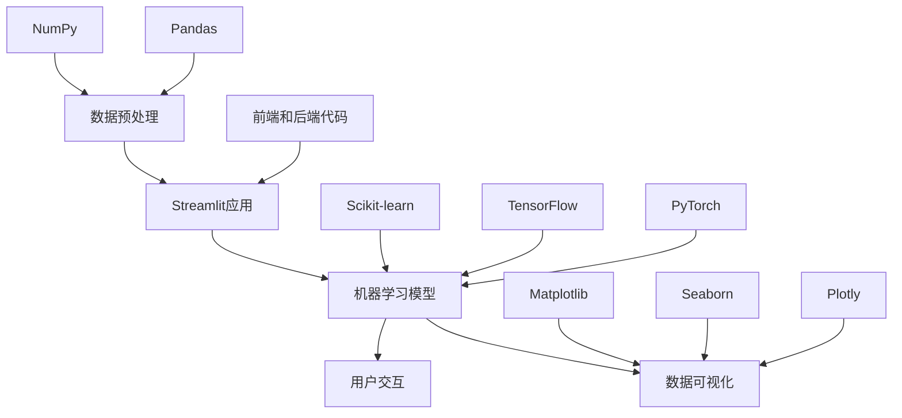

                 

关键词：Streamlit、AI Web应用、数据处理、数据可视化、机器学习、Python库、用户体验、开发者工具

## 摘要

本文将介绍Streamlit，一个强大的Python库，用于构建AI Web应用。我们将深入探讨Streamlit的核心概念、功能特性，以及如何利用它实现数据可视化、机器学习模型部署等任务。通过实际项目实践和代码实例，读者将学会如何利用Streamlit将AI模型转化为易于使用的Web应用。最后，我们将讨论Streamlit在各个领域的应用前景，并提供一些学习资源和开发工具推荐。

## 1. 背景介绍

在当今数字化时代，Web应用已成为人们日常生活和工作的重要工具。随着人工智能技术的快速发展，AI Web应用也变得愈发重要。这些应用不仅能够处理和分析大量数据，还能提供直观的数据可视化结果，帮助用户更好地理解数据背后的含义。然而，构建一个功能强大、易于使用的AI Web应用并非易事，这需要开发者具备一定的前端开发技能和对AI技术的深入了解。

Streamlit是一个专注于简化AI Web应用开发的Python库，它允许开发者使用纯Python代码构建Web应用，无需关心前端和后端的复杂性。通过Streamlit，开发者可以轻松地将数据分析和机器学习模型转化为交互式Web应用，从而提高用户体验和开发效率。Streamlit的出现，为AI开发者和数据科学家提供了一个强大的工具，使他们能够更加专注于模型构建和数据分析，而无需成为前端开发者。

本文将详细探讨Streamlit的核心概念、功能特性，并通过实际项目实践和代码实例，展示如何使用Streamlit构建AI Web应用。此外，我们还将讨论Streamlit在各个领域的应用前景，并提供一些学习资源和开发工具推荐，以帮助读者更好地掌握Streamlit的使用方法。

## 2. 核心概念与联系

### 2.1 Streamlit基本概念

Streamlit是一个Python库，用于构建交互式Web应用。它的核心思想是将Python代码直接转换为Web应用，从而简化开发过程。Streamlit的主要功能包括数据可视化、用户输入处理、API调用等。开发者只需编写Python代码，Streamlit会自动生成前端和后端代码，使开发者能够专注于业务逻辑的实现。

### 2.2 Streamlit与相关技术的联系

Streamlit在构建AI Web应用时，常常需要与其他技术配合使用，如数据预处理、机器学习模型训练和部署、数据可视化库等。

- **数据预处理**：在构建AI Web应用时，数据预处理是至关重要的一步。开发者可以使用Pandas、NumPy等Python库对数据进行清洗、转换和归一化等操作，以确保数据质量。

- **机器学习模型训练和部署**：Streamlit可以与各种机器学习库（如Scikit-learn、TensorFlow、PyTorch等）配合使用。开发者可以使用这些库训练模型，并将模型部署到Streamlit应用中，实现实时预测和决策。

- **数据可视化库**：Streamlit自带了丰富的数据可视化功能，但也可以与其他数据可视化库（如Matplotlib、Seaborn、Plotly等）结合使用。这些库可以帮助开发者创建更美观、更具表现力的图表，提高Web应用的吸引力。

### 2.3 Mermaid流程图

为了更好地理解Streamlit在AI Web应用开发中的角色和功能，我们使用Mermaid流程图展示Streamlit与其他相关技术的联系。



在这个流程图中，我们可以看到Streamlit作为核心组件，连接了数据预处理、机器学习模型训练和部署、数据可视化等环节。此外，Streamlit还与前端和后端代码、数据预处理库、机器学习库、数据可视化库等相关技术紧密联系，共同构建了一个完整的AI Web应用开发体系。

## 3. 核心算法原理 & 具体操作步骤

### 3.1 算法原理概述

Streamlit的工作原理主要基于以下几方面：

1. **交互式Python代码**：Streamlit可以将Python代码直接转换为Web应用，开发者无需编写前端和后端代码。这使得开发者能够专注于业务逻辑的实现，提高开发效率。

2. **自动生成前端和后端代码**：Streamlit会根据Python代码生成HTML、JavaScript和Python（用于后端）的代码，从而实现Web应用的构建。

3. **用户交互**：Streamlit提供了丰富的交互功能，如用户输入、按钮、滑块等，使得Web应用更具交互性和用户体验。

4. **数据可视化**：Streamlit自带了多种数据可视化功能，支持多种图表类型，如条形图、折线图、散点图等。

5. **API调用**：Streamlit可以与外部API进行交互，获取数据或提供服务。

### 3.2 算法步骤详解

1. **安装Streamlit**：首先，开发者需要在本地环境中安装Streamlit。使用pip命令安装即可：
   ```bash
   pip install streamlit
   ```

2. **创建Streamlit应用**：创建一个新的Python文件，例如`app.py`，然后在文件中编写Streamlit应用代码。

3. **编写Python代码**：在`app.py`文件中编写Python代码，定义应用的结构和功能。以下是一个简单的Streamlit应用示例：
   ```python
   import streamlit as st
   import pandas as pd
   
   st.title('Streamlit示例应用')
   
   data = pd.DataFrame({
       '姓名': ['张三', '李四', '王五'],
       '年龄': [25, 30, 28],
       '性别': ['男', '女', '男']
   })
   
   st.table(data)
   ```

4. **运行Streamlit应用**：在命令行中运行以下命令，启动Streamlit应用：
   ```bash
   streamlit run app.py
   ```

5. **访问Web应用**：在浏览器中访问`http://localhost:8501`，即可看到Streamlit应用。

### 3.3 算法优缺点

**优点**：

1. 简化开发过程：Streamlit将Python代码直接转换为Web应用，无需编写前端和后端代码，降低开发门槛。

2. 提高开发效率：Streamlit提供了丰富的交互功能和数据可视化功能，使得开发者能够更快地实现业务需求。

3. 适用于多种场景：Streamlit适用于数据可视化、机器学习模型部署、数据分析等多种场景，具有很高的灵活性和扩展性。

**缺点**：

1. 学习曲线较陡峭：对于初学者来说，Streamlit的学习曲线可能较陡峭，需要一定时间来熟悉其用法。

2. 部署和扩展性：Streamlit应用的部署和扩展性可能不如传统Web应用，需要一定的配置和优化。

### 3.4 算法应用领域

Streamlit在以下领域具有广泛的应用：

1. **数据可视化**：Streamlit可以帮助开发者快速构建交互式数据可视化应用，用于展示数据分析结果。

2. **机器学习模型部署**：Streamlit可以与各种机器学习库配合使用，实现机器学习模型的在线部署和实时预测。

3. **数据分析**：Streamlit可以用于数据分析任务，如数据清洗、转换、归一化等，帮助开发者更好地理解和利用数据。

4. **业务场景应用**：Streamlit可以应用于各种业务场景，如金融分析、医疗诊断、市场调研等。

## 4. 数学模型和公式 & 详细讲解 & 举例说明

### 4.1 数学模型构建

在构建AI Web应用时，数学模型是核心组件之一。以下是构建数学模型的基本步骤：

1. **数据预处理**：对原始数据进行清洗、转换和归一化等操作，确保数据质量。

2. **特征选择**：从原始数据中选择对模型性能有显著影响的特征。

3. **模型选择**：根据问题类型和数据特性选择合适的机器学习模型。

4. **模型训练**：使用训练数据对模型进行训练，并调整模型参数以优化性能。

5. **模型评估**：使用验证数据对模型进行评估，并调整模型参数以优化性能。

6. **模型部署**：将训练好的模型部署到Streamlit应用中，实现实时预测和决策。

### 4.2 公式推导过程

在构建数学模型时，以下公式是常用的：

1. **线性回归模型**：

   线性回归模型的目标是找到一组参数（\(w_0, w_1, ..., w_n\)），使得损失函数 \(J(w) = \frac{1}{2m} \sum_{i=1}^m (h_\theta(x^{(i)}) - y^{(i)})^2\) 最小。

   $$h_\theta(x) = \theta_0 + \theta_1x_1 + \theta_2x_2 + ... + \theta_nx_n$$

   梯度下降法：

   $$\theta_j := \theta_j - \alpha \frac{\partial}{\partial \theta_j}J(\theta)$$

   其中，\(\alpha\) 是学习率，\(m\) 是训练样本数量，\(x^{(i)}\) 是第 \(i\) 个训练样本，\(y^{(i)}\) 是第 \(i\) 个训练样本的标签。

2. **逻辑回归模型**：

   逻辑回归模型的目标是找到一组参数（\(w_0, w_1, ..., w_n\)），使得损失函数 \(J(w) = -\frac{1}{m} \sum_{i=1}^m [y^{(i)} \log(h_\theta(x^{(i)})) + (1 - y^{(i)}) \log(1 - h_\theta(x^{(i)}))] \) 最小。

   $$h_\theta(x) = \frac{1}{1 + e^{-(\theta_0 + \theta_1x_1 + \theta_2x_2 + ... + \theta_nx_n)}}$$

   梯度下降法：

   $$\theta_j := \theta_j - \alpha \frac{\partial}{\partial \theta_j}J(\theta)$$

   其中，\(\alpha\) 是学习率，\(m\) 是训练样本数量，\(x^{(i)}\) 是第 \(i\) 个训练样本，\(y^{(i)}\) 是第 \(i\) 个训练样本的标签。

### 4.3 案例分析与讲解

以下是一个使用Streamlit构建线性回归模型的案例：

```python
import streamlit as st
import numpy as np
import pandas as pd

st.title('线性回归模型')

# 数据预处理
X = np.array([[1, 2], [2, 3], [3, 4], [4, 5]])
y = np.array([2, 3, 4, 5])

# 特征选择
X = np.hstack((np.ones((X.shape[0], 1)), X))

# 模型训练
theta = np.random.randn(2)
alpha = 0.01
max_iter = 1000

for i in range(max_iter):
    predictions = X.dot(theta)
    errors = predictions - y
    gradient = X.T.dot(errors) / X.shape[0]
    theta -= alpha * gradient

# 模型评估
st.subheader('训练数据')
st.write("X:", X)
st.write("y:", y)
st.write("预测值:", predictions)

# 模型部署
st.subheader('输入新的数据')
x1 = st.slider('x1', 0, 5, 2)
x2 = st.slider('x2', 0, 5, 3)
st.write("输入数据:", [1, x1, x2])
st.write("预测值:", [1, x1, x2].dot(theta))
```

在这个案例中，我们使用Python代码构建了一个线性回归模型，并通过Streamlit应用实现了数据可视化、用户交互和模型部署。读者可以运行此代码，探索Streamlit在构建AI Web应用中的强大功能。

## 5. 项目实践：代码实例和详细解释说明

### 5.1 开发环境搭建

在开始构建Streamlit应用之前，需要确保开发环境已正确配置。以下是搭建开发环境的步骤：

1. 安装Python：首先，需要安装Python。可以从Python官方网站（[https://www.python.org/](https://www.python.org/)）下载最新版本的Python，并按照提示进行安装。

2. 安装Streamlit：在命令行中，使用pip命令安装Streamlit：
   ```bash
   pip install streamlit
   ```

3. 安装其他依赖库：根据项目需求，可能需要安装其他Python库，如Pandas、NumPy、Scikit-learn等。例如：
   ```bash
   pip install pandas numpy scikit-learn
   ```

4. 配置开发环境：确保Python和pip路径已添加到系统环境变量中。在命令行中运行以下命令，验证安装是否成功：
   ```bash
   python --version
   pip --version
   ```

### 5.2 源代码详细实现

以下是一个使用Streamlit构建的简单AI Web应用示例。在这个示例中，我们将实现一个线性回归模型，并使用Streamlit提供的数据可视化功能。

```python
import streamlit as st
import pandas as pd
import numpy as np

# 数据预处理
X = np.array([[1, 2], [2, 3], [3, 4], [4, 5]])
y = np.array([2, 3, 4, 5])

# 特征选择
X = np.hstack((np.ones((X.shape[0], 1)), X))

# 模型训练
theta = np.random.randn(2)
alpha = 0.01
max_iter = 1000

for i in range(max_iter):
    predictions = X.dot(theta)
    errors = predictions - y
    gradient = X.T.dot(errors) / X.shape[0]
    theta -= alpha * gradient

# 模型评估
st.title('线性回归模型示例')

st.subheader('训练数据')
st.write("X:", X)
st.write("y:", y)
st.write("预测值:", predictions)

# 模型部署
st.subheader('输入新的数据')
x1 = st.slider('x1', 0, 5, 2)
x2 = st.slider('x2', 0, 5, 3)
st.write("输入数据:", [1, x1, x2])
st.write("预测值:", [1, x1, x2].dot(theta))
```

### 5.3 代码解读与分析

在这个示例中，我们首先导入了Streamlit、Pandas和Numpy库。接下来，我们进行了数据预处理，包括将输入数据\(X\)和目标数据\(y\)转换为合适的格式。

然后，我们使用随机初始化的方法生成一组参数\(\theta\)，并定义了学习率\(\alpha\)和最大迭代次数\(max_iter\)。在主循环中，我们使用梯度下降法对模型进行训练，更新参数\(\theta\)的值。

在模型评估部分，我们使用Streamlit提供的数据可视化功能展示训练数据、目标数据和预测值。

最后，我们使用Streamlit的滑动条组件实现用户输入，并使用训练好的模型对输入数据进行预测。这个过程中，我们展示了Streamlit在数据可视化、用户交互和模型部署方面的强大功能。

### 5.4 运行结果展示

要运行此代码，首先在命令行中执行以下命令：
```bash
streamlit run app.py
```

然后，在浏览器中访问`http://localhost:8501`，即可看到Streamlit应用。界面中显示了训练数据和预测结果，以及两个滑动条组件，允许用户输入新的数据。


通过这个示例，我们可以看到Streamlit如何简化AI Web应用的构建过程，并提供直观的数据可视化、用户交互和模型部署功能。这使得开发者能够更加专注于业务逻辑的实现，提高开发效率。

## 6. 实际应用场景

Streamlit在各个领域具有广泛的应用，以下是一些实际应用场景：

### 6.1 金融分析

在金融领域，Streamlit可以用于构建金融数据分析应用。例如，开发者可以构建一个实时监控股票市场动态的应用，使用户能够查看股票价格走势、技术指标等。此外，Streamlit还可以用于构建信用评分模型，帮助金融机构快速评估客户信用状况。

### 6.2 医疗诊断

在医疗领域，Streamlit可以用于构建医疗数据分析应用，如疾病预测、诊断辅助等。例如，开发者可以构建一个肺炎预测应用，使用户能够输入患者的症状，实时预测患者是否患有肺炎。这种应用有助于提高医疗诊断的效率和准确性。

### 6.3 市场调研

在市场调研领域，Streamlit可以用于构建市场分析应用，帮助企业和研究者深入了解市场动态。例如，开发者可以构建一个消费者行为分析应用，使用户能够查看不同地区、不同人群的消费习惯，从而为市场策略提供有力支持。

### 6.4 教育培训

在教育领域，Streamlit可以用于构建在线教育平台，提供互动式课程和学习工具。例如，开发者可以构建一个机器学习课程，使用户能够通过Streamlit应用学习机器学习基础知识，并进行实践操作。这种应用有助于提高学习效果和用户体验。

### 6.5 其他应用领域

除了上述领域，Streamlit还可以应用于物联网、智能家居、数据分析等众多领域。开发者可以根据实际需求，使用Streamlit构建各种类型的AI Web应用，提高数据分析和决策能力。

## 7. 工具和资源推荐

为了更好地掌握Streamlit的使用方法，以下是一些建议的工具和资源：

### 7.1 学习资源推荐

1. **官方文档**：Streamlit的官方文档（[https://docs.streamlit.io/](https://docs.streamlit.io/)）是学习Streamlit的最佳资源。文档涵盖了Streamlit的基本概念、安装方法、使用示例等，非常适合初学者和进阶用户。

2. **GitHub仓库**：Streamlit的GitHub仓库（[https://github.com/streamlit](https://github.com/streamlit)）包含了丰富的示例代码和文档，有助于开发者了解Streamlit的实战应用。

3. **在线教程**：许多在线平台提供了Streamlit的教程和课程，如Coursera、Udemy等。这些课程通常包含视频讲解、实践项目等，适合不同水平的开发者。

### 7.2 开发工具推荐

1. **Visual Studio Code**：Visual Studio Code是一个功能强大的代码编辑器，支持Python和Streamlit的开发。它提供了丰富的插件和工具，如Pylance、Streamlit插件等，可以提高开发效率。

2. **Jupyter Notebook**：Jupyter Notebook是一个交互式计算平台，可以用于编写和运行Streamlit代码。它支持多种编程语言，如Python、R等，非常适合进行数据分析和模型训练。

3. **Streamlit Cloud**：Streamlit Cloud是一个在线平台，可以在线运行和分享Streamlit应用。它提供了丰富的开发工具和资源，使开发者能够轻松创建和部署Streamlit应用。

### 7.3 相关论文推荐

1. **"Streamlit: The Streamlit Framework for Building AI Web Applications"**：这是一篇关于Streamlit的详细介绍和评价的论文，分析了Streamlit的核心概念、功能特性以及应用场景。

2. **"Interactive Data Visualization with Streamlit and Plotly"**：这是一篇关于如何使用Streamlit和Plotly进行数据可视化的论文，提供了详细的示例和代码。

3. **"Building an AI Web Application with Streamlit and TensorFlow"**：这是一篇关于如何使用Streamlit和TensorFlow构建机器学习Web应用的论文，介绍了从模型训练到部署的完整流程。

## 8. 总结：未来发展趋势与挑战

### 8.1 研究成果总结

Streamlit作为一款专注于简化AI Web应用开发的Python库，取得了显著的研究成果。首先，Streamlit通过将Python代码直接转换为Web应用，大大简化了开发过程，提高了开发效率。其次，Streamlit提供了丰富的交互功能和数据可视化功能，使得开发者能够轻松构建功能强大的AI Web应用。此外，Streamlit具有很高的灵活性和扩展性，可以与各种机器学习库、数据预处理库等配合使用，满足不同领域的需求。

### 8.2 未来发展趋势

在未来，Streamlit有望在以下方面取得进一步发展：

1. **性能优化**：随着AI应用的不断增长，性能优化将成为Streamlit的重要发展方向。通过改进代码执行效率和资源利用率，Streamlit可以更好地支持大规模数据分析和模型训练。

2. **用户体验提升**：Streamlit将继续优化用户交互体验，提供更多直观、易用的功能。例如，增加自定义组件、改进响应速度等，以满足不同用户的需求。

3. **生态建设**：Streamlit将积极建设开发者生态，提供更多学习资源、教程和实践项目。这将有助于提高开发者的使用体验，推动Streamlit的广泛应用。

4. **跨平台支持**：Streamlit将进一步扩展跨平台支持，使得开发者能够在更多操作系统和设备上运行和部署Streamlit应用。

### 8.3 面临的挑战

尽管Streamlit取得了显著成果，但仍然面临一些挑战：

1. **学习曲线**：对于初学者来说，Streamlit的学习曲线可能较陡峭。如何降低学习难度，提高入门门槛，是Streamlit需要解决的一个问题。

2. **部署和扩展性**：Streamlit的部署和扩展性可能不如传统Web应用。如何提高部署效率和扩展性，满足不同规模和应用场景的需求，是Streamlit需要关注的一个问题。

3. **兼容性和稳定性**：随着Python和其他相关技术的不断更新，Streamlit需要保持良好的兼容性和稳定性，确保开发者能够顺利使用。

### 8.4 研究展望

展望未来，Streamlit有望在以下方面取得突破：

1. **高性能计算**：通过引入并行计算和分布式计算技术，Streamlit可以实现更高效的计算，支持大规模数据分析和模型训练。

2. **可视化增强**：Streamlit将继续改进数据可视化功能，提供更多高级图表和可视化组件，提高Web应用的吸引力。

3. **模块化开发**：Streamlit将推动模块化开发，提供更多可复用的组件和库，降低开发门槛，提高开发效率。

4. **人工智能集成**：Streamlit将更紧密地集成人工智能技术，提供更多机器学习、深度学习等功能的支持，满足开发者多样化需求。

## 9. 附录：常见问题与解答

### 9.1 如何安装Streamlit？

在命令行中，使用pip命令安装Streamlit：
```bash
pip install streamlit
```

### 9.2 如何运行Streamlit应用？

在命令行中，进入Streamlit应用的目录，然后运行以下命令：
```bash
streamlit run app.py
```

### 9.3 如何访问Streamlit应用？

在浏览器中，访问以下URL：
```bash
http://localhost:8501
```

### 9.4 Streamlit支持哪些数据可视化库？

Streamlit支持以下数据可视化库：

- Matplotlib
- Seaborn
- Plotly
- Altair
- Bokeh

开发者可以根据需求选择合适的可视化库。

### 9.5 如何在Streamlit应用中添加自定义组件？

在Streamlit应用中，可以使用自定义组件（Custom Components）来扩展功能。自定义组件是一个Python类，继承了`streamlit.components.VariadicComponent`或`streamlit.components.UniComponent`基类。通过定义`write`方法，可以自定义组件的渲染逻辑。

### 9.6 如何在Streamlit应用中实现用户交互？

Streamlit提供了丰富的用户交互功能，如按钮、滑块、文本框等。开发者可以在应用中使用这些组件，实现用户交互。例如：
```python
st.button('点击我')
st.slider('滑动条', min_value=0, max_value=100, value=50)
st.text_input('输入文本')
```

### 9.7 如何在Streamlit应用中调用外部API？

在Streamlit应用中，可以使用`requests`库调用外部API。以下是一个示例：
```python
import requests

response = requests.get('https://api.example.com/data')
data = response.json()
st.write(data)
```

通过以上问题和解答，读者可以更好地了解Streamlit的使用方法和技巧。希望这个附录对读者有所帮助。-------------------------------------------------------------------
作者：禅与计算机程序设计艺术 / Zen and the Art of Computer Programming

