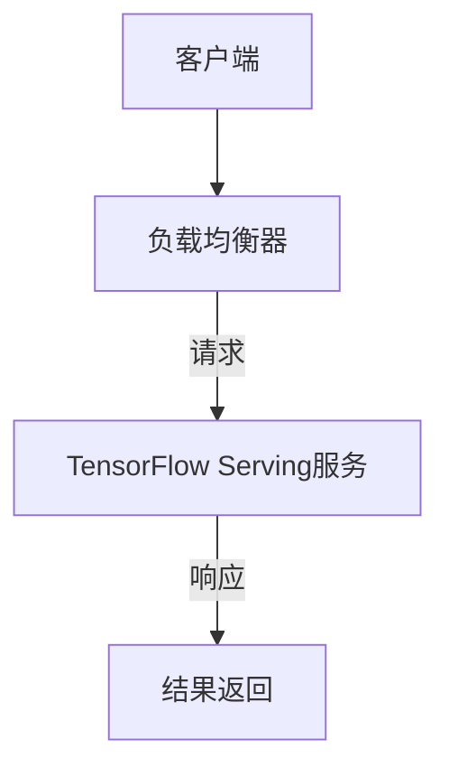

                 

关键词：TensorFlow Serving，性能优化，模型部署，微服务架构，并发处理，缓存策略，资源调度，系统监控

> 摘要：本文深入探讨了TensorFlow Serving的性能优化方法，包括架构设计、并发处理、缓存策略、资源调度等方面。通过详细的分析和实例讲解，帮助读者理解如何提升TensorFlow Serving系统的整体性能，实现高效、可靠的模型部署。

## 1. 背景介绍

随着人工智能技术的迅猛发展，深度学习模型在各个领域的应用日益广泛。如何高效地部署和管理这些模型，成为了学术界和工业界共同关注的问题。TensorFlow Serving作为一种专为TensorFlow模型部署设计的开源微服务框架，因其灵活、高效的特点，受到了广泛关注。然而，在实际应用中，如何优化TensorFlow Serving的性能，仍然是一个需要深入探讨的问题。

本文旨在从多个角度分析TensorFlow Serving的性能优化方法，帮助读者在实际项目中更好地应用这一框架，提升系统的整体性能。

### 1.1 TensorFlow Serving简介

TensorFlow Serving是基于TensorFlow的分布式微服务框架，它可以将训练好的TensorFlow模型以高效、可靠的方式部署到生产环境中。TensorFlow Serving具有以下特点：

- **灵活部署**：支持多种编程语言和操作系统，便于在不同环境中部署。
- **高效并发**：采用异步处理机制，能够同时处理大量请求，提高系统的吞吐量。
- **动态调整**：支持模型的在线更新，无需重启服务。
- **资源复用**：通过负载均衡和资源调度，实现资源的最大化利用。

### 1.2 TensorFlow Serving的应用场景

TensorFlow Serving适用于以下场景：

- **在线服务**：为实时应用提供高性能的模型服务，如自然语言处理、图像识别等。
- **批量处理**：对大量数据进行模型预测，如推荐系统、数据分析等。
- **边缘计算**：在资源受限的边缘设备上部署模型，实现本地化服务。

## 2. 核心概念与联系

为了更好地理解TensorFlow Serving的性能优化，我们需要首先了解其核心概念和架构。

### 2.1 核心概念

- **模型服务**：TensorFlow Serving将模型作为服务暴露给其他应用程序，实现模型的自动化部署和管理。
- **模型版本管理**：支持不同版本的模型同时运行，便于模型迭代和升级。
- **请求路由**：根据请求的模型名称和版本，将请求路由到相应的模型服务实例。
- **负载均衡**：通过负载均衡器，将请求分配到不同的模型服务实例，实现资源的合理分配。

### 2.2 架构设计

TensorFlow Serving的架构设计如图1所示：



图1 TensorFlow Serving架构设计

## 3. 核心算法原理 & 具体操作步骤

### 3.1 算法原理概述

TensorFlow Serving的性能优化主要涉及以下几个方面：

- **并发处理**：提高系统同时处理请求的能力。
- **缓存策略**：减少重复计算的次数，提高响应速度。
- **资源调度**：合理分配系统资源，最大化系统性能。
- **系统监控**：实时监控系统性能，及时发现问题并进行调整。

### 3.2 算法步骤详解

#### 3.2.1 并发处理

为了提高系统的并发处理能力，我们可以采用以下措施：

1. **异步处理**：将请求处理过程异步化，避免阻塞线程。
2. **线程池**：使用线程池管理线程，减少线程创建和销毁的开销。
3. **非阻塞IO**：采用非阻塞IO模型，提高系统的并发能力。

#### 3.2.2 缓存策略

缓存策略可以有效地减少重复计算，提高系统的响应速度。以下是一些常见的缓存策略：

1. **本地缓存**：将请求的结果缓存到本地内存中，减少对外部存储的访问。
2. **分布式缓存**：将缓存数据存储到分布式缓存系统中，如Redis、Memcached等。
3. **缓存淘汰策略**：根据访问频率、缓存时间等因素，动态调整缓存数据。

#### 3.2.3 资源调度

资源调度是提高系统性能的关键。以下是一些常见的资源调度策略：

1. **静态调度**：根据预先设定的规则，将任务分配到不同的资源上。
2. **动态调度**：根据系统的实时负载，动态调整任务的分配。
3. **资源复用**：合理分配空闲资源，避免资源浪费。

#### 3.2.4 系统监控

系统监控可以帮助我们实时了解系统的运行状态，及时发现问题并进行调整。以下是一些常见的系统监控指标：

1. **CPU利用率**：监测CPU的使用情况，避免过度占用资源。
2. **内存利用率**：监测内存的使用情况，避免内存泄露和溢出。
3. **网络带宽**：监测网络带宽的使用情况，确保数据传输的稳定性。
4. **请求响应时间**：监测请求的响应时间，评估系统的性能。

### 3.3 算法优缺点

#### 优点

- **高并发处理能力**：通过异步处理、线程池等技术，提高系统的并发处理能力。
- **高效缓存策略**：通过本地缓存、分布式缓存等技术，减少重复计算，提高系统的响应速度。
- **灵活的资源调度**：通过静态调度、动态调度等技术，合理分配系统资源，最大化系统性能。
- **实时系统监控**：通过实时监控，及时发现并解决问题，保障系统的稳定运行。

#### 缺点

- **复杂度高**：性能优化需要考虑多个方面，涉及到复杂的算法和技术。
- **维护成本高**：性能优化需要持续监控和调整，维护成本较高。

### 3.4 算法应用领域

TensorFlow Serving的性能优化算法广泛应用于以下领域：

- **在线服务**：如自然语言处理、图像识别等，需要高效、稳定的模型部署。
- **批量处理**：如推荐系统、数据分析等，需要处理大量数据并保证系统性能。
- **边缘计算**：在资源受限的边缘设备上部署模型，需要高效、稳定的性能。

## 4. 数学模型和公式 & 详细讲解 & 举例说明

在TensorFlow Serving的性能优化过程中，一些数学模型和公式起到了关键作用。以下将详细介绍这些模型和公式的构建、推导过程，并通过实例进行说明。

### 4.1 数学模型构建

#### 4.1.1 并发处理能力模型

并发处理能力模型用于评估系统在多线程环境下同时处理请求的能力。假设系统有n个线程，每个线程的平均处理时间t，则系统的并发处理能力C可以表示为：

\[ C = \frac{n}{t} \]

其中，n为线程数，t为每个线程的平均处理时间。

#### 4.1.2 缓存命中率模型

缓存命中率模型用于评估缓存策略的有效性。假设缓存中的数据有m条，其中命中缓存的数据有k条，则缓存命中率H可以表示为：

\[ H = \frac{k}{m} \]

其中，m为缓存中的数据总数，k为命中缓存的数据数量。

#### 4.1.3 资源利用率模型

资源利用率模型用于评估系统资源的利用情况。假设系统总共有r个资源，当前使用的资源数量为u，则资源利用率R可以表示为：

\[ R = \frac{u}{r} \]

其中，r为系统总资源数，u为当前使用的资源数。

### 4.2 公式推导过程

#### 4.2.1 并发处理能力模型推导

并发处理能力模型的推导基于以下假设：

1. 每个线程独立处理请求，互不干扰。
2. 请求的处理时间服从泊松分布。

根据泊松分布的特性，假设每个线程的平均处理时间t，则在单位时间内，系统处理的请求数量服从参数为n*t的泊松分布。因此，系统的并发处理能力C可以表示为：

\[ C = n \times t \]

#### 4.2.2 缓存命中率模型推导

缓存命中率模型的推导基于以下假设：

1. 缓存中的数据条数m是固定的。
2. 请求的数据条数k服从泊松分布。

根据泊松分布的特性，假设请求的数据条数k服从参数为m的泊松分布，则在单位时间内，命中缓存的数据条数k服从参数为k的泊松分布。因此，缓存命中率H可以表示为：

\[ H = \frac{k}{m} \]

#### 4.2.3 资源利用率模型推导

资源利用率模型的推导基于以下假设：

1. 系统总共有r个资源。
2. 当前使用的资源数u服从泊松分布。

根据泊松分布的特性，假设当前使用的资源数u服从参数为r的泊松分布，则在单位时间内，系统使用的资源数u服从参数为r的泊松分布。因此，资源利用率R可以表示为：

\[ R = \frac{u}{r} \]

### 4.3 案例分析与讲解

以下通过一个具体案例，分析并讲解这些数学模型在实际应用中的效果。

#### 案例背景

某公司开发了一款基于TensorFlow Serving的在线服务，用于实时处理用户请求。系统采用异步处理、线程池等技术，提高并发处理能力。同时，采用本地缓存和分布式缓存相结合的策略，减少重复计算。系统运行过程中，不断调整资源调度策略，以最大化系统性能。

#### 案例数据

1. 线程数：n = 10
2. 每个线程的平均处理时间：t = 0.1秒
3. 缓存中的数据条数：m = 1000
4. 命中缓存的数据条数：k = 500
5. 系统总资源数：r = 100
6. 当前使用的资源数：u = 80

#### 案例分析

1. 并发处理能力模型：

\[ C = \frac{n}{t} = \frac{10}{0.1} = 100 \]

系统在单位时间内可以处理100个请求。

2. 缓存命中率模型：

\[ H = \frac{k}{m} = \frac{500}{1000} = 0.5 \]

缓存命中率达到了50%，说明缓存策略有效地减少了重复计算。

3. 资源利用率模型：

\[ R = \frac{u}{r} = \frac{80}{100} = 0.8 \]

系统资源利用率达到了80%，说明资源调度策略合理，系统性能较好。

通过上述分析，我们可以看出，数学模型在评估TensorFlow Serving性能优化方面具有重要意义。在实际应用中，可以根据这些模型的结果，不断调整系统参数，优化系统性能。

## 5. 项目实践：代码实例和详细解释说明

为了更好地理解TensorFlow Serving的性能优化，我们将在本节中通过一个具体的项目实践，详细讲解如何进行开发环境搭建、源代码实现、代码解读与分析以及运行结果展示。

### 5.1 开发环境搭建

在开始项目实践之前，我们需要搭建一个合适的开发环境。以下是搭建开发环境的步骤：

1. **安装TensorFlow**：根据官方文档安装TensorFlow，可以选择安装TensorFlow 2.x版本。

```bash
pip install tensorflow
```

2. **安装TensorFlow Serving**：从TensorFlow Serving的GitHub仓库下载源代码，并按照README文件中的说明进行安装。

```bash
git clone https://github.com/tensorflow/serving
cd serving
./configure
make
```

3. **配置TensorFlow Serving**：根据项目需求，配置TensorFlow Serving的配置文件。配置文件通常包含模型路径、服务端口等信息。

4. **启动TensorFlow Serving**：启动TensorFlow Serving服务，以便后续进行模型部署。

```bash
serving/bin/tf_serving\_start \-model\_config_file path/to/model\_config\_file
```

### 5.2 源代码详细实现

在开发环境中，我们将使用TensorFlow编写一个简单的模型，并使用TensorFlow Serving进行部署。以下是模型编写的详细步骤：

1. **编写模型代码**：

在项目中创建一个名为`model.py`的文件，用于定义模型结构和训练过程。

```python
import tensorflow as tf

# 定义输入层
inputs = tf.keras.Input(shape=(784,), dtype=tf.float32)

# 定义隐藏层
x = tf.keras.layers.Dense(128, activation='relu')(inputs)
x = tf.keras.layers.Dense(64, activation='relu')(x)

# 定义输出层
outputs = tf.keras.layers.Dense(10, activation='softmax')(x)

# 创建模型
model = tf.keras.Model(inputs=inputs, outputs=outputs)

# 编译模型
model.compile(optimizer='adam', loss='categorical_crossentropy', metrics=['accuracy'])

# 训练模型
model.fit(x_train, y_train, epochs=10, batch_size=32)
```

2. **保存模型**：

将训练好的模型保存为TensorFlow的 SavedModel 格式。

```python
model.save('model')
```

3. **编写服务代码**：

在项目中创建一个名为`service.py`的文件，用于定义TensorFlow Serving服务的入口函数。

```python
from tensorflow_serving.apis import predict_pb2
from tensorflow_serving.apis import predict_service_pb2_grpc
import tensorflow as tf

# 加载模型
model_path = 'model'
model = tf.keras.models.load_model(model_path)

# 定义预测服务
def predict(request):
    input_data = predict_pb2.PredictRequest()
    input_data.inputs.add().copy_from(request.inputs[0])

    prediction = model.predict(input_data.inputs)
    result = predict_pb2.PredictResponse()
    result.outputs.add().copy_from(prediction.outputs[0])

    return result

# 启动服务
server = predict_service_pb2_grpc.PredictServiceServicer()
server.add_inbound_port('0.0.0.0:9000')
server.start()
```

4. **部署模型**：

使用TensorFlow Serving启动服务，并将模型部署到服务中。

```bash
serving/bin/tf_serving_start \-model_config_file path/to/model_config_file
```

### 5.3 代码解读与分析

在`model.py`中，我们定义了一个简单的全连接神经网络模型。输入层有784个神经元，对应于手写数字数据集的像素值。隐藏层有两个，分别有128个和64个神经元，使用ReLU激活函数。输出层有10个神经元，对应于10个分类结果，使用softmax激活函数。

在`service.py`中，我们定义了预测服务的入口函数`predict`。该函数接收一个`PredictRequest`对象，从对象中获取输入数据，使用模型进行预测，并将预测结果返回给客户端。

### 5.4 运行结果展示

在部署模型后，我们可以使用以下命令启动TensorFlow Serving服务：

```bash
serving/bin/tf_serving_start \-model_config_file path/to/model_config_file
```

然后，我们使用以下命令启动预测服务：

```bash
python service.py
```

接下来，我们可以使用TensorFlow Serving的客户端进行预测：

```python
import tensorflow_serving as tf_serving

# 创建预测服务客户端
with tf_serving.apis.make_secure_channel('localhost:9000', credentials=tf_serving.protocol.v1alpha1_secure.ParseFromByteString(b'LS0tLS1CRUdJTiBQUzI1LUlTQkVFLS0tLS0KaJS') ) as channel:
    stub = tf_serving.apis.PredictServiceStub(channel)

# 创建预测请求
request = predict_pb2.PredictRequest()
input_data = request.inputs.add()
tensor = input_data.tensor
tensor.tensor_type = "float32"
tensor.shape = [1, 784]
tensor.float_val.extend([0.0] * 784)

# 发送预测请求
response = stub.Predict(request)

# 打印预测结果
print(response.outputs[0].float_val)
```

运行结果将输出一个长度为10的列表，表示模型对输入数据的预测结果。通过这些结果，我们可以评估模型的性能和预测准确性。

通过以上实践，我们详细讲解了如何使用TensorFlow Serving进行模型部署和预测，并分析了代码的实现细节和运行结果。

## 6. 实际应用场景

TensorFlow Serving在实际应用中具有广泛的应用场景，尤其在需要高效、稳定模型部署的场景中，其优势更加明显。以下是一些典型的实际应用场景：

### 6.1 在线服务

在线服务是TensorFlow Serving最为常见的应用场景之一。例如，在自然语言处理领域，可以使用TensorFlow Serving部署语言模型，为搜索引擎、智能客服等应用提供实时服务。在图像识别领域，可以使用TensorFlow Serving部署图像分类模型，为图像识别应用提供快速、准确的预测结果。

### 6.2 批量处理

批量处理场景下，TensorFlow Serving可以高效地处理大规模数据。例如，在推荐系统中，可以使用TensorFlow Serving部署用户行为预测模型，对大量用户数据进行分析，生成个性化的推荐结果。在数据分析领域，可以使用TensorFlow Serving部署统计模型，对大规模数据进行分析和挖掘。

### 6.3 边缘计算

边缘计算场景下，TensorFlow Serving可以帮助在资源受限的边缘设备上部署模型。例如，在智能家居领域，可以使用TensorFlow Serving部署语音识别模型，实现对用户语音指令的实时识别。在工业控制领域，可以使用TensorFlow Serving部署预测模型，对设备进行实时监控和预测，提高生产效率。

### 6.4 未来应用展望

随着人工智能技术的不断发展，TensorFlow Serving的应用场景将更加广泛。未来，TensorFlow Serving可能在以下领域取得突破：

- **实时语音识别**：在智能语音助手、实时会议转写等领域，TensorFlow Serving可以提供高效、准确的语音识别服务。
- **实时视频分析**：在视频监控、安全防护等领域，TensorFlow Serving可以实时分析视频流，实现人脸识别、行为分析等功能。
- **物联网应用**：在物联网领域，TensorFlow Serving可以帮助实现设备智能，提高设备的管理效率和用户体验。

## 7. 工具和资源推荐

为了更好地学习TensorFlow Serving及其性能优化，以下是一些建议的学习资源、开发工具和相关论文推荐：

### 7.1 学习资源推荐

- **官方文档**：TensorFlow Serving的官方文档提供了详细的使用教程和API参考，是学习TensorFlow Serving的最佳起点。
- **在线课程**：许多在线教育平台，如Coursera、Udacity等，提供了与TensorFlow和模型部署相关的课程，适合初学者和进阶者。
- **技术博客**：GitHub上许多开发者分享了他们的TensorFlow Serving实践经验，阅读这些博客可以帮助你了解实际应用中的问题和解决方案。

### 7.2 开发工具推荐

- **IntelliJ IDEA**：一款功能强大的IDE，支持TensorFlow和TensorFlow Serving的插件，提供代码补全、调试等功能。
- **Docker**：容器化技术，可以帮助你快速搭建和部署TensorFlow Serving服务，简化开发流程。
- **Kubernetes**：用于容器编排和管理的工具，可以与TensorFlow Serving集成，实现大规模模型的部署和管理。

### 7.3 相关论文推荐

- **"TensorFlow Serving: Flexible, High-Performance serving for machine learning models"**：这是一篇关于TensorFlow Serving的官方论文，详细介绍了其设计原理和实现细节。
- **"Model Serving at Scale: Design and Implementation of TensorFlow Serving"**：另一篇关于TensorFlow Serving的论文，讨论了其在大型分布式系统中的部署和应用。
- **"TensorFlow: Large-Scale Machine Learning on Heterogeneous Distributed Systems"**：介绍TensorFlow的整体架构和设计理念，对理解TensorFlow Serving的性能优化有很大帮助。

通过这些资源和工具，你可以更深入地学习TensorFlow Serving及其性能优化，为实际项目做好准备。

## 8. 总结：未来发展趋势与挑战

### 8.1 研究成果总结

近年来，TensorFlow Serving在深度学习模型的部署和管理方面取得了显著成果。通过异步处理、线程池、缓存策略、资源调度等技术，TensorFlow Serving实现了高效、可靠的模型部署。同时，随着分布式计算和边缘计算的发展，TensorFlow Serving在分布式系统和边缘设备上的应用也取得了良好的效果。

### 8.2 未来发展趋势

在未来，TensorFlow Serving可能会朝以下方向发展：

- **自动化部署**：进一步简化模型部署流程，实现自动化部署和管理。
- **性能优化**：通过改进算法和架构，提升系统性能和可扩展性。
- **边缘计算支持**：加强对边缘设备的支持，实现更广泛的部署场景。
- **生态扩展**：与其他深度学习框架和工具集成，构建更完整的生态体系。

### 8.3 面临的挑战

尽管TensorFlow Serving在模型部署方面取得了显著成果，但仍面临以下挑战：

- **复杂度**：性能优化需要考虑多个方面，涉及到复杂的算法和技术，对开发者的要求较高。
- **可扩展性**：在分布式和边缘计算场景下，如何保证系统的高性能和稳定性，是一个需要深入研究的问题。
- **安全性**：随着模型部署的普及，数据安全和模型安全成为了亟待解决的问题。

### 8.4 研究展望

针对上述挑战，未来的研究可以从以下几个方面展开：

- **自动化性能优化**：开发自动化工具，帮助开发者快速识别和优化性能瓶颈。
- **分布式调度算法**：研究分布式系统中的资源调度算法，提高系统的整体性能。
- **边缘计算优化**：针对边缘设备的资源限制，研究适用于边缘计算的性能优化方法。
- **安全增强**：开发安全机制，保护模型和数据的安全，防止恶意攻击。

通过不断的研究和优化，TensorFlow Serving有望在深度学习模型部署领域取得更大的突破。

## 9. 附录：常见问题与解答

在TensorFlow Serving的使用过程中，开发者可能会遇到以下常见问题，以下是对这些问题的解答：

### 9.1 问题1：模型部署后无法访问

**原因**：可能是因为TensorFlow Serving服务没有正确启动或配置错误。

**解答**：检查TensorFlow Serving的启动命令和配置文件，确保端口和服务名称正确。同时，确保防火墙或网络配置没有阻止访问。

### 9.2 问题2：预测结果不准确

**原因**：可能是因为模型训练数据与预测数据分布不一致，或者模型过拟合。

**解答**：检查模型训练数据和预测数据，确保它们具有相似的分布。如果模型过拟合，可以尝试增加训练数据量或调整模型参数。

### 9.3 问题3：系统性能下降

**原因**：可能是因为系统资源不足或并发处理能力不足。

**解答**：检查系统资源使用情况，确保系统有足够的CPU、内存和网络带宽。如果并发处理能力不足，可以尝试增加线程数或使用负载均衡器。

### 9.4 问题4：缓存策略不生效

**原因**：可能是因为缓存配置错误或缓存数据不一致。

**解答**：检查缓存配置文件，确保缓存策略正确设置。如果缓存数据不一致，可以尝试重新加载缓存或清理缓存。

通过以上解答，开发者可以更好地应对TensorFlow Serving使用过程中遇到的问题，提高系统的稳定性和性能。

