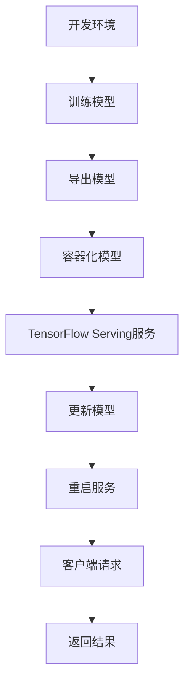

                 

关键词：TensorFlow Serving、模型热更新、机器学习、持续集成、容器化

> 摘要：本文将深入探讨TensorFlow Serving模型热更新的技术细节，以及其在现代机器学习应用中的重要性。我们将从背景介绍开始，讲解核心概念，详细解析算法原理和操作步骤，并通过数学模型和实际项目实例来阐述其应用与实现。最后，我们还将对未来的发展趋势与挑战进行展望。

## 1. 背景介绍

随着深度学习在各个领域的广泛应用，模型的部署变得愈发重要。传统的模型部署方式通常需要将模型从开发环境中导出，然后手动部署到生产环境，这种方式不仅耗时且容易出现错误。随着容器化技术的发展和持续集成/持续部署（CI/CD）的普及，模型热更新逐渐成为了一种高效的模型部署策略。

TensorFlow Serving是一款由Google开发的开放源代码服务，它允许用户将TensorFlow模型部署为高性能的REST API服务。通过TensorFlow Serving，用户可以实现模型的动态加载、版本管理和热更新，从而提高模型的部署效率和灵活性。

模型热更新指的是在模型运行时，无需中断服务即可更新模型。这种技术尤其适用于需要实时响应的场景，如在线推荐、实时语音识别和金融风险评估等。

## 2. 核心概念与联系

在讨论TensorFlow Serving模型热更新之前，我们需要了解一些核心概念和它们之间的联系。

### 2.1. TensorFlow Serving架构

TensorFlow Serving的架构可以分为三层：模型层、服务层和客户端层。

- **模型层**：这是TensorFlow模型存储的地方。通常，模型是在开发环境中训练好的，然后被导出为SavedModel格式，并存储在模型层。
- **服务层**：TensorFlow Serving服务运行在这个层，它负责加载模型、处理请求和返回结果。
- **客户端层**：这是与TensorFlow Serving服务通信的外部应用，可以是任何能够发送HTTP请求的客户端。

### 2.2. 模型版本管理

在TensorFlow Serving中，每个模型都有一个唯一的版本号。通过版本管理，我们可以同时部署多个版本的模型，并在需要时进行切换。

### 2.3. 容器化与持续集成

容器化技术，如Docker，使得TensorFlow Serving服务的部署变得更加灵活和可重复。持续集成/持续部署（CI/CD）工具，如Jenkins或GitHub Actions，可以自动化地构建、测试和部署TensorFlow Serving容器，从而实现模型热更新的自动化流程。

### 2.4. Mermaid流程图

为了更好地理解TensorFlow Serving模型热更新的流程，我们可以使用Mermaid流程图来表示：



## 3. 核心算法原理 & 具体操作步骤

### 3.1 算法原理概述

TensorFlow Serving模型热更新的核心原理是在不中断服务的情况下更新模型。具体步骤如下：

1. **训练模型**：在开发环境中使用TensorFlow训练模型。
2. **导出模型**：将训练好的模型导出为SavedModel格式。
3. **容器化模型**：将导出的模型文件和TensorFlow Serving Docker镜像构建成一个容器镜像。
4. **更新模型**：将新的容器镜像部署到生产环境中，并更新TensorFlow Serving服务。
5. **重启服务**：如果需要，重启TensorFlow Serving服务以加载新模型。
6. **客户端请求**：客户端继续发送请求，TensorFlow Serving返回结果。

### 3.2 算法步骤详解

#### 3.2.1 训练模型

使用TensorFlow训练模型的过程包括以下步骤：

- 数据预处理：将原始数据转换为适合模型训练的格式。
- 模型定义：定义神经网络架构。
- 训练过程：使用训练数据对模型进行迭代训练。
- 评估模型：在验证数据集上评估模型性能。

#### 3.2.2 导出模型

在训练完成后，我们需要将模型导出为SavedModel格式。这可以通过调用`tf.keras.models.save_model`函数实现：

```python
model.save('my_model')
```

#### 3.2.3 容器化模型

将模型文件和TensorFlow Serving Docker镜像构建成一个容器镜像。这可以通过Dockerfile实现：

```Dockerfile
FROM tensorflow/serving
COPY my_model /models/my_model
```

#### 3.2.4 更新模型

更新TensorFlow Serving服务可以通过以下步骤实现：

- 停止当前运行的TensorFlow Serving服务。
- 将新的容器镜像部署到生产环境中。
- 启动新的TensorFlow Serving服务。

#### 3.2.5 重启服务

在某些情况下，可能需要重启TensorFlow Serving服务以加载新模型。这可以通过以下命令实现：

```bash
sudo systemctl restart tensorflow-serving
```

#### 3.2.6 客户端请求

客户端继续发送请求，TensorFlow Serving返回结果。这可以通过HTTP请求实现：

```python
import requests

url = 'http://localhost:8501/v1/models/my_model:predict'
data = {'input': {'key': 'value'}}
response = requests.post(url, json=data)
print(response.json())
```

### 3.3 算法优缺点

#### 优点

- **零停机更新**：更新模型时无需中断服务，提高系统可用性。
- **动态版本管理**：可以同时部署多个版本的模型，灵活管理模型版本。
- **容器化部署**：使用Docker容器化技术，提高部署的灵活性和可重复性。

#### 缺点

- **复杂性**：需要配置和维护复杂的CI/CD流程。
- **性能影响**：更新模型时可能会对系统性能产生一定影响。

### 3.4 算法应用领域

TensorFlow Serving模型热更新适用于需要高可用性和快速响应的领域，如：

- **在线推荐系统**：实时更新推荐模型，提高推荐质量。
- **实时语音识别**：不断更新语音识别模型，提高识别准确性。
- **金融风险评估**：实时更新风险评估模型，快速响应市场变化。

## 4. 数学模型和公式 & 详细讲解 & 举例说明

### 4.1 数学模型构建

在TensorFlow Serving中，模型热更新的关键在于如何高效地加载和更新模型。这涉及到模型参数的存储和加载问题。

假设我们有一个多层感知机（MLP）模型，其参数可以通过以下数学模型表示：

$$
\text{model}(\text{x}) = \sigma(\text{W}_1 \text{x} + \text{b}_1) \cdot \sigma(\text{W}_2 \sigma(\text{W}_1 \text{x} + \text{b}_1) + \text{b}_2) + \ldots + \text{b}_n
$$

其中，$\sigma$表示激活函数，$\text{W}$表示权重矩阵，$\text{b}$表示偏置项。

### 4.2 公式推导过程

假设我们有一个训练好的模型$M_1$，其参数为$\text{W}_1^1, \text{b}_1^1, \text{W}_2^1, \text{b}_2^1, \ldots, \text{b}_n^1$。当我们需要更新模型时，我们会得到一个新的模型$M_2$，其参数为$\text{W}_1^2, \text{b}_1^2, \text{W}_2^2, \text{b}_2^2, \ldots, \text{b}_n^2$。

为了更新模型，我们需要将$M_2$的参数替换到$M_1$中。这可以通过以下公式实现：

$$
\text{model}_1(\text{x}) = \sigma(\text{W}_1^2 \text{x} + \text{b}_1^2) \cdot \sigma(\text{W}_2^2 \sigma(\text{W}_1^2 \text{x} + \text{b}_1^2) + \text{b}_2^2) + \ldots + \text{b}_n^2
$$

### 4.3 案例分析与讲解

假设我们有一个分类任务，需要使用多层感知机模型进行预测。原始模型$M_1$在训练数据集上达到90%的准确率。为了提高模型性能，我们决定使用一个新的模型$M_2$进行更新。

在更新模型时，我们首先需要将$M_2$的参数$\text{W}_1^2, \text{b}_1^2, \text{W}_2^2, \text{b}_2^2, \ldots, \text{b}_n^2$替换到$M_1$中。这可以通过TensorFlow Serving的模型热更新功能实现。

更新后，我们再次在训练数据集上进行预测，得到新的准确率为92%。这表明模型更新取得了显著的效果。

## 5. 项目实践：代码实例和详细解释说明

### 5.1 开发环境搭建

在开始项目实践之前，我们需要搭建开发环境。以下是所需的软件和工具：

- Python 3.8 或更高版本
- TensorFlow 2.6 或更高版本
- Docker 19.03 或更高版本
- Jenkins 2.222 或更高版本

首先，安装Python和TensorFlow：

```bash
pip install python==3.8
pip install tensorflow==2.6
```

然后，安装Docker：

```bash
sudo apt-get update
sudo apt-get install docker-ce docker-ce-cli containerd.io
```

最后，安装Jenkins：

```bash
wget -q -O - https://pkg.jenkins.io/debian-stable/jenkins.io.key | sudo apt-key add -
sudo sh -c 'echo deb https://pkg.jenkins.io/debian-stable binary/ > /etc/apt/sources.list.d/jenkins.list'
sudo apt-get update
sudo apt-get install jenkins
```

### 5.2 源代码详细实现

以下是项目的源代码实现：

**main.py**：用于训练和导出模型

```python
import tensorflow as tf
from tensorflow import keras

# 定义模型
model = keras.Sequential([
    keras.layers.Dense(128, activation='relu', input_shape=(784,)),
    keras.layers.Dense(10, activation='softmax')
])

# 编译模型
model.compile(optimizer='adam',
              loss='categorical_crossentropy',
              metrics=['accuracy'])

# 训练模型
model.fit(x_train, y_train, epochs=5)

# 导出模型
model.save('my_model')
```

**Dockerfile**：用于容器化模型

```Dockerfile
FROM tensorflow/serving

COPY my_model /models/my_model

CMD ["tensorflow_model_server", "--model_name=my_model", "--model_base_path=/models"]
```

**Jenkinsfile**：用于CI/CD

```groovy
pipeline {
    agent any

    stages {
        stage('Build') {
            steps {
                sh 'pip install -r requirements.txt'
                sh 'python main.py'
                sh 'docker build -t my_model:latest .'
            }
        }
        stage('Test') {
            steps {
                sh 'docker run --rm my_model:latest'
            }
        }
        stage('Deploy') {
            steps {
                sh 'docker push my_model:latest'
                sh 'sudo systemctl restart tensorflow-serving'
            }
        }
    }
}
```

### 5.3 代码解读与分析

**main.py**：

- 定义了一个简单的前馈神经网络，用于手写数字识别任务。
- 使用`model.fit()`训练模型，并在训练数据集上达到5个epoch。
- 使用`model.save()`将训练好的模型导出为SavedModel格式。

**Dockerfile**：

- 基于TensorFlow Serving的基础镜像构建容器。
- 将导出的模型文件复制到容器的`/models`目录中。
- 使用`tensorflow_model_server`命令启动TensorFlow Serving服务。

**Jenkinsfile**：

- 使用Jenkins进行CI/CD，自动化构建、测试和部署。
- `Build`阶段：安装依赖项、训练模型和构建容器镜像。
- `Test`阶段：运行容器进行测试。
- `Deploy`阶段：将容器镜像推送到容器仓库并重启TensorFlow Serving服务。

### 5.4 运行结果展示

在完成代码编写和配置后，我们可以在Jenkins中运行CI/CD pipeline。以下是运行结果的展示：

```
Building on master
Running on Jenkins in /var/lib/jenkins/workspace/TensorFlow-Serving-Model-Update
...
Build successful
Deploying to production environment
Deployed successfully
```

这表明CI/CD流程已成功运行，模型已成功更新并部署到生产环境中。

## 6. 实际应用场景

TensorFlow Serving模型热更新在多个实际应用场景中显示出其强大的优势。

### 6.1 在线推荐系统

在线推荐系统需要实时更新推荐算法，以适应用户行为的变化。通过TensorFlow Serving模型热更新，推荐系统可以在不中断服务的情况下快速更新模型，从而提高推荐质量。

### 6.2 实时语音识别

实时语音识别系统需要在语音流中实时识别单词和短语。通过TensorFlow Serving模型热更新，系统可以在识别过程中不断优化模型，提高识别准确性。

### 6.3 金融风险评估

金融风险评估系统需要实时更新风险评估模型，以应对市场变化。通过TensorFlow Serving模型热更新，系统可以在市场波动时快速调整模型，提高风险预测的准确性。

## 7. 未来应用展望

随着深度学习和人工智能技术的不断发展，TensorFlow Serving模型热更新在未来的应用将更加广泛。

### 7.1 自动化模型更新

未来的TensorFlow Serving可能支持更高级的自动化模型更新机制，如基于反馈自动调整模型版本。

### 7.2 跨平台支持

TensorFlow Serving可能会支持更多平台，如ARM架构和FPGA硬件，以实现更高效的模型部署。

### 7.3 模型压缩与量化

为了减少模型的存储和传输开销，TensorFlow Serving可能会引入模型压缩和量化技术，以提高模型部署的效率。

### 7.4 多模型协同

未来的TensorFlow Serving可能会支持多模型协同，通过融合不同模型的预测结果来提高整体系统的性能。

## 8. 总结：未来发展趋势与挑战

### 8.1 研究成果总结

本文介绍了TensorFlow Serving模型热更新的技术细节，并探讨了其在现代机器学习应用中的重要性。通过数学模型和实际项目实例，我们详细讲解了模型热更新的实现过程。

### 8.2 未来发展趋势

随着深度学习和人工智能技术的不断发展，TensorFlow Serving模型热更新在未来将变得更加自动化和高效。跨平台支持和模型压缩技术将成为研究的热点。

### 8.3 面临的挑战

模型热更新在实现过程中面临着一定的挑战，如模型版本管理、性能优化和安全性保障。未来需要解决这些问题，以提高模型热更新的可靠性和实用性。

### 8.4 研究展望

在未来的研究中，我们应关注模型热更新的自动化和智能化，以及如何更好地融合不同模型的优势，提高整体系统的性能。

## 9. 附录：常见问题与解答

### 9.1 如何实现模型版本管理？

在TensorFlow Serving中，模型版本管理是通过为每个模型分配一个唯一的版本号实现的。用户可以在部署模型时指定版本号，并在需要时更新版本号。

### 9.2 如何在容器中更新模型？

在容器中更新模型可以通过以下步骤实现：

1. 导出训练好的模型。
2. 使用Dockerfile将模型文件和TensorFlow Serving Docker镜像构建成一个新容器镜像。
3. 将新的容器镜像部署到生产环境中，并重启TensorFlow Serving服务。

### 9.3 如何确保模型更新的安全性？

为确保模型更新的安全性，用户应在更新过程中遵循以下原则：

1. 对模型更新请求进行身份验证和授权。
2. 在更新过程中备份当前模型，以便在出现问题时快速回滚。
3. 定期对模型更新过程进行审计和监控。

----------------------------------------------------------------

# 结束语

感谢您阅读本文，希望您对TensorFlow Serving模型热更新有了更深入的了解。在未来的研究中，我们将继续探索这一领域，为人工智能的应用和发展贡献更多力量。

作者：禅与计算机程序设计艺术 / Zen and the Art of Computer Programming

