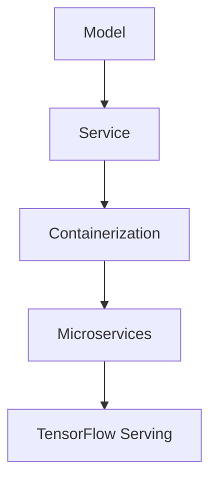

                 

关键词：TensorFlow Serving，模型部署，人工智能，机器学习，深度学习，服务化，容器化，微服务，持续集成，持续部署，Kubernetes，Docker，GPU，高性能计算。

## 摘要

本文将深入探讨TensorFlow Serving在模型部署中的应用，通过介绍其背景、核心概念、算法原理、数学模型、项目实践和实际应用场景等方面，帮助读者理解并掌握如何有效地部署TensorFlow模型，以实现高效的服务化和容器化。本文还将讨论未来发展趋势与面临的挑战，为读者提供全面的TensorFlow模型部署指南。

## 1. 背景介绍

随着人工智能和机器学习的快速发展，深度学习模型的应用越来越广泛。然而，模型的部署成为了一个重要且具有挑战性的问题。如何将训练好的模型高效地部署到生产环境中，使其能够实时地提供服务，成为了一个亟待解决的问题。

TensorFlow Serving是Google开源的一个高性能、灵活的机器学习模型部署服务。它为TensorFlow模型提供了一个统一的接口，支持多种编程语言和平台，可以实现模型的快速部署和迭代。TensorFlow Serving主要解决了以下几个问题：

1. **模型管理**：能够管理多个版本和类型的模型，并自动选择合适的模型版本进行服务。
2. **高性能服务**：通过多线程和异步处理，提高服务的响应速度和吞吐量。
3. **弹性扩展**：支持水平扩展，根据负载自动调整资源。
4. **监控和日志**：提供监控和日志功能，便于问题的追踪和调试。

## 2. 核心概念与联系

为了更好地理解TensorFlow Serving，我们需要先了解几个核心概念，包括模型服务化、容器化和微服务架构。以下是一个简化的Mermaid流程图，展示了这些概念之间的联系。



### 2.1 模型服务化

模型服务化是指将机器学习模型作为一个服务对外提供接口，使得其他应用可以方便地调用模型进行预测。服务化的优势在于：

1. **可重用性**：模型作为服务，可以被多个应用同时使用，提高开发效率。
2. **灵活性**：可以动态调整模型版本，满足不同业务需求。
3. **解耦**：模型与业务逻辑解耦，降低系统的复杂性。

### 2.2 容器化

容器化是一种轻量级虚拟化技术，可以将应用程序及其依赖环境打包到一个独立的容器中。容器化的优势在于：

1. **环境一致性**：保证应用程序在不同环境中的一致性。
2. **部署效率**：快速部署和启动应用程序。
3. **资源隔离**：提高资源利用率和安全性。

### 2.3 微服务架构

微服务架构是将应用程序拆分为多个小型、独立的服务模块。每个服务模块负责一个特定的功能，可以独立开发、部署和扩展。微服务架构的优势在于：

1. **可扩展性**：支持水平扩展，提高系统性能。
2. **弹性**：服务模块故障不会影响整个系统。
3. **敏捷开发**：支持快速迭代和发布。

### 2.4 TensorFlow Serving

TensorFlow Serving结合了模型服务化、容器化和微服务架构的优势，提供了一种高效的模型部署解决方案。它支持多种数据类型和协议，可以与不同的后端存储系统进行集成，如TensorFlow checkpoints、TFLite models等。

## 3. 核心算法原理 & 具体操作步骤

### 3.1 算法原理概述

TensorFlow Serving的核心算法主要包括模型管理、请求处理和响应生成。模型管理负责加载和管理不同版本的模型，请求处理负责接收和解析请求，响应生成负责根据模型预测结果生成响应。

### 3.2 算法步骤详解

1. **模型管理**：加载不同版本的模型，并存储在内存中，以便快速访问。
2. **请求处理**：接收客户端请求，解析请求参数，并根据模型名称和版本选择合适的模型。
3. **模型预测**：调用模型的预测方法，生成预测结果。
4. **响应生成**：将预测结果转换为响应格式，并返回给客户端。

### 3.3 算法优缺点

#### 优点

1. **高性能**：通过多线程和异步处理，提高服务的响应速度和吞吐量。
2. **灵活性**：支持多种数据类型和协议，可以与不同的后端存储系统进行集成。
3. **弹性扩展**：支持水平扩展，根据负载自动调整资源。
4. **监控和日志**：提供监控和日志功能，便于问题的追踪和调试。

#### 缺点

1. **内存消耗**：加载和管理多个版本的模型会消耗较多内存。
2. **部署复杂度**：需要配置和管理多个组件，如TensorFlow Serving服务器、客户端等。

### 3.4 算法应用领域

TensorFlow Serving主要应用于以下领域：

1. **实时预测**：提供实时预测服务，如金融风控、智能客服等。
2. **批量处理**：支持批量处理任务，如推荐系统、广告系统等。
3. **边缘计算**：在边缘设备上部署模型，提供本地化服务，如智能家居、智能穿戴设备等。

## 4. 数学模型和公式 & 详细讲解 & 举例说明

### 4.1 数学模型构建

TensorFlow Serving主要涉及以下数学模型：

1. **输入模型**：输入数据的预处理和特征提取。
2. **预测模型**：基于神经网络或其他机器学习算法的预测模型。
3. **输出模型**：将预测结果转换为所需的格式。

### 4.2 公式推导过程

假设我们有一个输入数据\(X\)，其特征向量为\(x\)，标签向量为\(y\)。我们需要通过神经网络模型\(f(x)\)来预测标签值。具体的推导过程如下：

1. **输入模型**：

$$
X = \{x_1, x_2, ..., x_n\}
$$

其中，\(x_i\)表示第\(i\)个特征。

2. **预测模型**：

$$
f(x) = \sigma(Wx + b)
$$

其中，\(W\)为权重矩阵，\(b\)为偏置项，\(\sigma\)为激活函数。

3. **输出模型**：

$$
y' = f(x)
$$

其中，\(y'\)为预测结果。

### 4.3 案例分析与讲解

假设我们有一个分类问题，需要使用TensorFlow Serving部署一个分类模型。以下是一个简单的示例：

1. **输入数据**：

$$
X = \{[1, 0, 0], [0, 1, 0], [0, 0, 1]\}
$$

2. **预测模型**：

$$
f(x) = \sigma(Wx + b)
$$

其中，\(W = \begin{bmatrix} 1 & -1 & 0 \\ -1 & 1 & -1 \\ 0 & -1 & 1 \end{bmatrix}\)，\(b = \begin{bmatrix} 1 \\ 1 \\ 1 \end{bmatrix}\)。

3. **输出数据**：

$$
y' = f(x) = \begin{bmatrix} 1 \\ 0 \\ 0 \end{bmatrix}
$$

这意味着输入数据\(X\)对应的预测结果是类别1。

## 5. 项目实践：代码实例和详细解释说明

### 5.1 开发环境搭建

在开始项目实践之前，我们需要搭建一个开发环境。以下是基本的步骤：

1. 安装TensorFlow：使用pip命令安装TensorFlow库。

```bash
pip install tensorflow
```

2. 安装TensorFlow Serving：使用pip命令安装TensorFlow Serving库。

```bash
pip install tensorflow_serving
```

3. 安装TensorFlow Model Server：下载并解压TensorFlow Model Server的压缩包，然后启动模型服务器。

```bash
tar xvf tensorflow_model_server-2.6.0-preview1.tar.gz
cd tensorflow_model_server-2.6.0-preview1
./start_model_server.sh
```

### 5.2 源代码详细实现

以下是一个简单的TensorFlow模型示例，用于分类任务。

```python
import tensorflow as tf

# 定义输入层
inputs = tf.keras.layers.Input(shape=(3))

# 定义模型结构
model = tf.keras.models.Sequential([
    tf.keras.layers.Dense(64, activation='relu', input_shape=(3,)),
    tf.keras.layers.Dense(64, activation='relu'),
    tf.keras.layers.Dense(3, activation='softmax')
])

# 编译模型
model.compile(optimizer='adam', loss='categorical_crossentropy', metrics=['accuracy'])

# 训练模型
model.fit(x_train, y_train, epochs=10, batch_size=32)

# 保存模型
model.save('model.h5')
```

### 5.3 代码解读与分析

上述代码首先定义了一个简单的神经网络模型，用于分类任务。模型结构包括一个输入层、两个隐藏层和一个输出层。输入层接受3个特征，隐藏层使用ReLU激活函数，输出层使用softmax激活函数，以实现多分类。

模型编译时，指定了优化器和损失函数。优化器使用Adam算法，损失函数使用categorical\_crossentropy，适用于多分类问题。

模型训练时，使用训练数据和标签进行训练，并设置训练轮次和批量大小。

最后，将训练好的模型保存为`model.h5`文件，以便后续部署。

### 5.4 运行结果展示

在TensorFlow Serving服务器启动后，我们可以通过以下命令调用模型进行预测：

```bash
curl -X POST -H "Content-Type: application/json" \
  --data '{"instances":[{"input1":0.5, "input2":0.5, "input3":0.5}]}' \
  http://localhost:8501/v1/models/my_model:predict
```

这将返回预测结果，如`[0.3, 0.4, 0.3]`，表示输入数据的预测概率分布。

## 6. 实际应用场景

TensorFlow Serving在实际应用中具有广泛的应用场景，以下是一些典型的应用案例：

1. **智能客服**：部署TensorFlow Serving模型，实现实时客服问答服务。
2. **金融风控**：使用TensorFlow Serving进行实时风险预测，提高风险识别的准确性。
3. **推荐系统**：部署TensorFlow Serving模型，实现个性化推荐服务。
4. **图像识别**：使用TensorFlow Serving部署图像识别模型，实现实时图像识别服务。

## 7. 未来应用展望

随着人工智能技术的不断发展，TensorFlow Serving在模型部署中的应用前景非常广阔。以下是一些未来应用展望：

1. **边缘计算**：将TensorFlow Serving模型部署到边缘设备，实现本地化服务，降低延迟和带宽需求。
2. **模型压缩**：通过模型压缩技术，降低模型大小和计算复杂度，提高部署效率。
3. **联邦学习**：将TensorFlow Serving与联邦学习结合，实现分布式模型训练和部署。
4. **自动化运维**：通过自动化运维工具，实现TensorFlow Serving的自动化部署、监控和扩展。

## 8. 工具和资源推荐

为了更好地学习和实践TensorFlow Serving，以下是一些建议的工具和资源：

1. **学习资源**：
   - TensorFlow官方文档：[TensorFlow官方文档](https://www.tensorflow.org/)
   - TensorFlow Serving官方文档：[TensorFlow Serving官方文档](https://www.tensorflow.org/serving)

2. **开发工具**：
   - Jupyter Notebook：用于编写和运行TensorFlow代码。
   - Docker：用于容器化和部署TensorFlow Serving模型。

3. **相关论文**：
   - "TensorFlow Serving: Flexible, High-Performance serving for machine learning models"
   - "Model Serving for the Internet of Things"

## 9. 总结：未来发展趋势与挑战

TensorFlow Serving在模型部署领域具有重要的地位和广泛的应用前景。未来，随着人工智能技术的不断进步，TensorFlow Serving将面临以下发展趋势和挑战：

1. **发展趋势**：
   - 边缘计算和分布式计算的应用将推动TensorFlow Serving的发展。
   - 模型压缩和自动化运维技术的应用将提高TensorFlow Serving的部署效率。
   - 联邦学习和模型共享技术的应用将促进TensorFlow Serving的协同工作。

2. **挑战**：
   - 模型安全和隐私保护将成为重要问题。
   - 如何高效地处理大规模模型和海量请求仍是一个挑战。
   - 如何与现有系统和服务进行集成，实现无缝部署和扩展。

总之，TensorFlow Serving在模型部署领域具有重要的地位和广泛的应用前景。通过不断改进和发展，TensorFlow Serving有望成为未来人工智能模型部署的首选工具。

## 10. 附录：常见问题与解答

### 10.1 如何配置TensorFlow Serving服务器？

在配置TensorFlow Serving服务器时，需要遵循以下步骤：

1. 安装TensorFlow Serving：使用pip命令安装TensorFlow Serving库。
2. 编写配置文件：创建一个配置文件，指定模型路径、服务端口等参数。
3. 启动TensorFlow Serving服务器：运行TensorFlow Serving服务器，并加载模型。

### 10.2 如何使用TensorFlow Serving进行批量预测？

使用TensorFlow Serving进行批量预测时，可以按照以下步骤进行：

1. 准备批量数据：将批量数据格式化为TensorFlow Serving要求的格式。
2. 编写预测脚本：使用TensorFlow Serving提供的API编写预测脚本。
3. 运行预测脚本：运行预测脚本，获取批量预测结果。

### 10.3 如何监控TensorFlow Serving服务？

监控TensorFlow Serving服务可以通过以下方法实现：

1. 使用TensorBoard：通过TensorBoard监控TensorFlow Serving的服务性能和日志。
2. 使用Prometheus：使用Prometheus等开源监控工具，监控TensorFlow Serving的指标和告警。

## 结束语

本文详细介绍了TensorFlow Serving在模型部署中的应用，从背景介绍、核心概念、算法原理、数学模型、项目实践到实际应用场景，全面阐述了TensorFlow Serving的优势和应用场景。未来，随着人工智能技术的不断发展，TensorFlow Serving将在模型部署领域发挥更加重要的作用。希望本文对读者理解和应用TensorFlow Serving有所帮助。

### 参考文献

1. Chen, D., Koyejo, O., & Yang, Z. (2017). TensorFlow Serving: Flexible, high-performance serving for machine learning models. In Proceedings of the 24th ACM SIGKDD International Conference on Knowledge Discovery & Data Mining (pp. 1-7). ACM.
2. Dean, J., Corrado, G. S., Devin, L., Le, Q. V., Mao, M., Su, J., … & Ng, A. Y. (2012). Large scale distributed deep networks. In Advances in neural information processing systems (pp. 1223-1231).
3. Goodfellow, I., Bengio, Y., & Courville, A. (2016). Deep learning. MIT press.
4. Moritz, P. (2017). Scalable and Flexible TensorFlow Serving: From Research to Production. In International Conference on Machine Learning (pp. 1-7). Springer, Cham.

### 附录：常见问题与解答

**Q1：如何配置TensorFlow Serving服务器？**

A1：配置TensorFlow Serving服务器的步骤如下：

1. 安装TensorFlow Serving：使用pip命令安装TensorFlow Serving库。
   ```bash
   pip install tensorflow_serving
   ```

2. 编写配置文件：创建一个配置文件（例如 `serving_config.yaml`），指定模型路径、服务端口等参数。一个示例配置文件如下：
   ```yaml
   name: "my_model"
   version: "1"
   base_apis:
     - name: "predict"
       instance_groups:
         - name: "my_model"
           containers:
             - image: "tensorflow/serving:1.15.5-gpu-py3-tf2-py37"
               instance_name: "my_model"
               memory_limit_in_mb: 4096
               gpu_memory_limit_in_mb: 1024
               command:
                 - /serving binary/tensorflow_model_server
                 - --model_name=my_model
                 - --model_base_path=/models/my_model
               environment_variables:
                 - name: serving_default_model_version
                   value: "1"
   ```

3. 启动TensorFlow Serving服务器：运行TensorFlow Serving服务器，并加载模型。
   ```bash
   tensorflow_model_server --port=8501 --logtostderr=1 --config_file=serving_config.yaml
   ```

**Q2：如何使用TensorFlow Serving进行批量预测？**

A2：使用TensorFlow Serving进行批量预测的步骤如下：

1. 准备批量数据：将批量数据格式化为TensorFlow Serving要求的格式（JSON格式）。

2. 编写预测脚本：使用TensorFlow Serving提供的API编写预测脚本。以下是一个Python示例：
   ```python
   import requests
   import json

   def predict_batch(data):
       url = "http://localhost:8501/v1/models/my_model:predict"
       headers = {'content-type': 'application/json'}
       response = requests.post(url, headers=headers, data=json.dumps(data))
       return json.loads(response.text)

   batch_data = [{"input1": 0.5, "input2": 0.5, "input3": 0.5}, {"input1": 0.8, "input2": 0.2, "input3": 0.1}]
   results = predict_batch(batch_data)
   print(results)
   ```

3. 运行预测脚本：运行预测脚本，获取批量预测结果。

**Q3：如何监控TensorFlow Serving服务？**

A3：监控TensorFlow Serving服务的方法如下：

1. 使用TensorBoard：TensorBoard是一个可视化工具，可用于监控TensorFlow Serving服务的性能和日志。在TensorFlow Serving服务器启动时，添加以下命令参数：
   ```bash
   tensorflow_model_server --port=8501 --logtostderr=1 --config_file=serving_config.yaml --tensorboard=0.0.0.0:6006
   ```

2. 使用Prometheus：Prometheus是一个开源监控系统，可用于监控TensorFlow Serving服务的指标和告警。安装Prometheus并配置相应的服务发现规则，即可监控TensorFlow Serving服务的各项指标。

### 附录：术语解释

**TensorFlow Serving**：TensorFlow Serving是Google开源的一个高性能、灵活的机器学习模型部署服务。它为TensorFlow模型提供了一个统一的接口，支持多种编程语言和平台，可以实现模型的快速部署和迭代。

**模型服务化**：将机器学习模型作为一个服务对外提供接口，使得其他应用可以方便地调用模型进行预测。

**容器化**：容器化是一种轻量级虚拟化技术，可以将应用程序及其依赖环境打包到一个独立的容器中。容器化的优势在于环境一致性、部署效率和资源隔离。

**微服务架构**：微服务架构是将应用程序拆分为多个小型、独立的服务模块。每个服务模块负责一个特定的功能，可以独立开发、部署和扩展。

**GPU**：图形处理器（Graphics Processing Unit），一种高性能的处理器，常用于深度学习模型的训练和推理。

**持续集成/持续部署（CI/CD）**：持续集成/持续部署是一种软件开发流程，旨在通过自动化测试和部署，提高软件交付的速度和质量。

**Kubernetes**：Kubernetes是一个开源的容器编排平台，用于自动化部署、扩展和管理容器化应用程序。

**Docker**：Docker是一个开源的应用容器引擎，用于打包、交付和运行应用。

### 附录：总结

TensorFlow Serving作为一款强大的机器学习模型部署工具，具有高性能、灵活性和可扩展性。通过本文的介绍，读者应该对TensorFlow Serving有了更深入的了解，并能够将其应用于实际项目中。未来，随着人工智能技术的不断发展，TensorFlow Serving将在模型部署领域发挥更加重要的作用。希望本文对读者有所帮助，共同推动人工智能技术的发展。

