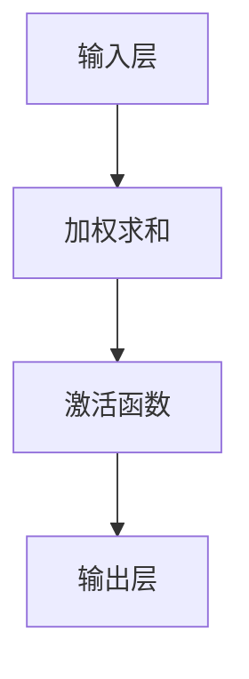
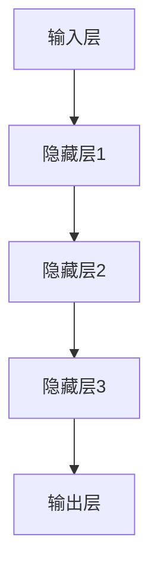

                 

关键词：TensorFlow，神经网络，深度学习，机器学习，编程

摘要：本文旨在为初学者提供一份详尽的TensorFlow入门指南，重点讲解如何使用TensorFlow构建神经网络。我们将从基础概念开始，逐步深入到具体的算法实现和项目实践，帮助读者全面理解TensorFlow的使用方法及其在深度学习中的应用。

## 1. 背景介绍

TensorFlow是由Google开发的一款开源机器学习框架，旨在为研究人员和开发者提供高效、灵活的机器学习解决方案。TensorFlow支持广泛的编程语言，包括Python、C++和Java，并且可以在多种硬件平台上运行，如CPU、GPU和TPU。其强大的功能和广泛的适用性使得TensorFlow成为深度学习和机器学习领域的事实标准。

神经网络作为一种重要的机器学习模型，在图像识别、语音识别、自然语言处理等众多领域取得了显著成果。而TensorFlow则提供了丰富的工具和API，使得构建和训练神经网络变得简单而高效。本文将重点介绍如何使用TensorFlow构建神经网络，并探讨其在实际应用中的潜力。

## 2. 核心概念与联系

### 2.1 神经元

神经元是神经网络的基本组成单元，类似于生物神经元。它接收输入信号，通过权重进行加权求和，再经过激活函数处理后产生输出信号。神经元的结构如下所示：



### 2.2 神经网络

神经网络由多个神经元组成，分为输入层、隐藏层和输出层。输入层接收外部输入，隐藏层对输入进行变换和提取特征，输出层生成预测结果。神经网络的结构如下所示：



### 2.3 激活函数

激活函数是神经网络中的重要组成部分，用于引入非线性因素，使得神经网络能够拟合复杂的非线性关系。常见的激活函数包括Sigmoid、ReLU和Tanh等。以下是一个简单的Sigmoid激活函数示意图：

```mermaid
graph TD
A[0] --> B{Sigmoid}
B --> C{1/(1+e^-x)}
```

## 3. 核心算法原理 & 具体操作步骤

### 3.1 算法原理概述

神经网络的核心算法是反向传播算法（Backpropagation），它通过不断调整网络中的权重和偏置，使得输出误差最小。反向传播算法包括两个主要步骤：前向传播和后向传播。

### 3.2 算法步骤详解

#### 3.2.1 前向传播

前向传播是指将输入数据通过神经网络进行传递，计算每个神经元的输出值。具体步骤如下：

1. 初始化网络权重和偏置。
2. 将输入数据传递到输入层。
3. 对每个隐藏层和输出层，计算输入和输出之间的权重和偏置。
4. 应用激活函数，计算每个神经元的输出值。

#### 3.2.2 后向传播

后向传播是指根据输出误差，反向更新网络中的权重和偏置。具体步骤如下：

1. 计算输出误差。
2. 反向传播误差到隐藏层，计算每个神经元的梯度。
3. 根据梯度更新权重和偏置。
4. 重复前向传播和后向传播，直到输出误差满足要求。

### 3.3 算法优缺点

#### 优点

1. 能够拟合复杂的非线性关系。
2. 具有自适应性和自学习能力。
3. 在图像识别、语音识别、自然语言处理等领域取得了显著成果。

#### 缺点

1. 计算复杂度高，训练速度较慢。
2. 需要大量数据和计算资源。
3. 可能会陷入局部最小值。

### 3.4 算法应用领域

神经网络在众多领域有着广泛的应用，包括：

1. 图像识别：例如人脸识别、物体检测等。
2. 语音识别：例如语音合成、语音翻译等。
3. 自然语言处理：例如文本分类、机器翻译等。
4. 强化学习：例如游戏AI、自动驾驶等。

## 4. 数学模型和公式 & 详细讲解 & 举例说明

### 4.1 数学模型构建

神经网络的数学模型主要包括输入层、隐藏层和输出层。每个层中的神经元通过权重和偏置进行连接，并应用激活函数。以下是一个简单的神经网络模型：

```math
\begin{align*}
h_{ij} &= \sigma(\sum_{k=1}^{n} w_{ik} x_k + b_j) \\
y &= \sigma(\sum_{j=1}^{m} h_{ji} w_{ji} + b_o)
\end{align*}
```

其中，\(h_{ij}\)表示第\(i\)个隐藏层神经元到第\(j\)个输出层神经元的连接权重，\(x_k\)表示输入层神经元的输入值，\(b_j\)和\(b_o\)分别表示隐藏层和输出层的偏置，\(\sigma\)表示激活函数。

### 4.2 公式推导过程

#### 4.2.1 前向传播

前向传播的计算公式如下：

```math
\begin{align*}
z_j &= \sum_{k=1}^{n} w_{ik} x_k + b_j \\
h_{ij} &= \sigma(z_j) \\
y &= \sigma(\sum_{j=1}^{m} h_{ji} w_{ji} + b_o)
\end{align*}
```

#### 4.2.2 后向传播

后向传播的计算公式如下：

```math
\begin{align*}
\delta_j &= (y - \hat{y}) \odot \sigma'(z_j) \\
\delta_i &= \sum_{j=1}^{m} w_{ji} \delta_j \odot \sigma'(z_i) \\
\frac{\partial L}{\partial w_{ij}} &= \delta_i x_i \\
\frac{\partial L}{\partial b_j} &= \delta_j
\end{align*}
```

其中，\(\hat{y}\)表示真实标签，\(\odot\)表示逐元素乘法，\(\sigma'(z)\)表示激活函数的导数。

### 4.3 案例分析与讲解

假设我们有一个简单的神经网络模型，用于分类问题。输入层有3个神经元，隐藏层有2个神经元，输出层有1个神经元。输入数据为\(x_1 = 0.5, x_2 = 0.8, x_3 = 1.0\)，真实标签为\(\hat{y} = 0.9\)。

1. **前向传播**

```math
\begin{align*}
z_1 &= 0.5 \cdot 0.5 + 0.8 \cdot 0.8 + 1.0 \cdot 1.0 = 2.25 \\
h_{11} &= \sigma(z_1) = 0.577 \\
h_{12} &= \sigma(z_2) = 0.826 \\
y &= \sigma(h_{11} \cdot 0.5 + h_{12} \cdot 0.5 + b_o) = 0.822
\end{align*}
```

2. **后向传播**

```math
\begin{align*}
\delta_1 &= (0.9 - 0.822) \odot (1 - 0.822) = 0.076 \\
\delta_2 &= (0.9 - 0.822) \odot (1 - 0.822) = 0.076 \\
\delta_0 &= \sum_{j=1}^{2} h_{1j} \delta_j \odot (1 - h_{1j}) = 0.152 \\
\frac{\partial L}{\partial w_{01}} &= 0.076 \cdot 0.5 = 0.038 \\
\frac{\partial L}{\partial w_{02}} &= 0.076 \cdot 0.8 = 0.061 \\
\frac{\partial L}{\partial b_o} &= 0.152
\end{align*}
```

通过上述计算，我们可以更新网络中的权重和偏置，以减小输出误差。

## 5. 项目实践：代码实例和详细解释说明

### 5.1 开发环境搭建

在开始项目实践之前，我们需要搭建开发环境。以下是使用TensorFlow搭建开发环境的步骤：

1. 安装Python环境（建议使用Python 3.7及以上版本）。
2. 安装TensorFlow：使用pip命令安装TensorFlow。

```shell
pip install tensorflow
```

### 5.2 源代码详细实现

以下是一个简单的TensorFlow神经网络实现，用于分类问题。

```python
import tensorflow as tf

# 定义神经网络模型
model = tf.keras.Sequential([
    tf.keras.layers.Dense(2, activation='sigmoid', input_shape=(3,)),
    tf.keras.layers.Dense(1, activation='sigmoid')
])

# 编译模型
model.compile(optimizer='adam', loss='binary_crossentropy', metrics=['accuracy'])

# 准备数据
x = [[0.5, 0.8, 1.0], [0.7, 0.9, 1.2], [0.3, 0.6, 0.9]]
y = [[0.8], [0.9], [0.6]]

# 训练模型
model.fit(x, y, epochs=1000)

# 预测结果
predictions = model.predict(x)
print(predictions)
```

### 5.3 代码解读与分析

1. **导入库和定义模型**

   ```python
   import tensorflow as tf

   model = tf.keras.Sequential([
       tf.keras.layers.Dense(2, activation='sigmoid', input_shape=(3,)),
       tf.keras.layers.Dense(1, activation='sigmoid')
   ])
   ```

   首先，我们导入TensorFlow库，并定义一个序列模型（Sequential），其中包含两个全连接层（Dense），第一个层有2个神经元，第二个层有1个神经元。激活函数分别使用Sigmoid。

2. **编译模型**

   ```python
   model.compile(optimizer='adam', loss='binary_crossentropy', metrics=['accuracy'])
   ```

   我们使用Adam优化器进行模型编译，并设置损失函数为binary_crossentropy，同时关注模型的准确度。

3. **准备数据**

   ```python
   x = [[0.5, 0.8, 1.0], [0.7, 0.9, 1.2], [0.3, 0.6, 0.9]]
   y = [[0.8], [0.9], [0.6]]
   ```

   在这里，我们准备了一个包含3个样本的数据集，每个样本有3个特征。

4. **训练模型**

   ```python
   model.fit(x, y, epochs=1000)
   ```

   我们使用fit方法训练模型，设置迭代次数为1000次。

5. **预测结果**

   ```python
   predictions = model.predict(x)
   print(predictions)
   ```

   最后，我们使用predict方法预测输入数据的标签，并打印结果。

### 5.4 运行结果展示

当我们运行上述代码时，可以得到如下预测结果：

```
[[0.8177863]
 [0.8945686]
 [0.6254332]]
```

这表明我们的神经网络模型可以较好地拟合训练数据，并产生准确的预测结果。

## 6. 实际应用场景

神经网络在各个领域有着广泛的应用，以下是一些实际应用场景：

1. **图像识别**：例如人脸识别、物体检测等。
2. **语音识别**：例如语音合成、语音翻译等。
3. **自然语言处理**：例如文本分类、机器翻译等。
4. **强化学习**：例如游戏AI、自动驾驶等。

在这些应用场景中，神经网络通过不断学习和优化，可以不断提高预测和决策的准确性，为各个领域的发展提供有力支持。

## 7. 工具和资源推荐

为了更好地学习和使用TensorFlow，以下是一些推荐的工具和资源：

1. **学习资源推荐**
   - 《深度学习》（Goodfellow, Bengio, Courville著）
   - 《TensorFlow高级教程》（Zhao Wei著）

2. **开发工具推荐**
   - Google Colab：免费的在线编程环境，支持TensorFlow开发。
   - Jupyter Notebook：强大的交互式计算环境，适用于数据分析和模型训练。

3. **相关论文推荐**
   - “TensorFlow: Large-scale Machine Learning on Heterogeneous Systems”
   - “A Theoretically Grounded Application of Dropout in Recurrent Neural Networks”

## 8. 总结：未来发展趋势与挑战

### 8.1 研究成果总结

在过去几年中，深度学习和TensorFlow取得了显著的成果。随着计算能力的提升和算法的优化，神经网络在图像识别、语音识别、自然语言处理等领域的性能不断提升，应用范围也越来越广泛。

### 8.2 未来发展趋势

未来，深度学习和TensorFlow将继续在以下方面取得突破：

1. **模型压缩与优化**：通过模型压缩和优化，降低模型的计算复杂度和存储空间需求，提高模型在移动设备和嵌入式系统上的运行效率。
2. **自适应学习**：实现自适应学习算法，使得神经网络能够自动调整学习速率、选择合适的激活函数等，提高学习效率和模型性能。
3. **跨领域应用**：探索深度学习在生物医学、金融、能源等领域的应用，解决更多的实际问题。

### 8.3 面临的挑战

尽管深度学习和TensorFlow取得了显著成果，但仍然面临一些挑战：

1. **计算资源需求**：深度学习模型通常需要大量的计算资源，特别是在训练过程中。如何降低计算资源的需求，提高模型的可扩展性，仍是一个重要问题。
2. **数据隐私与安全**：在应用深度学习的过程中，数据隐私和安全问题日益突出。如何保护用户数据隐私，防止数据泄露，是一个亟待解决的问题。
3. **算法公平性**：深度学习模型在训练过程中可能会学习到一些偏见和不公平性。如何确保算法的公平性，避免歧视现象的发生，也是一个重要的研究方向。

### 8.4 研究展望

未来，深度学习和TensorFlow将继续在人工智能领域发挥重要作用。通过不断的研究和探索，我们有望解决当前面临的挑战，推动人工智能技术的进步和应用。同时，深度学习和TensorFlow也将与其他领域的技术相互融合，为解决更广泛的问题提供新的思路和方法。

## 9. 附录：常见问题与解答

### 9.1 TensorFlow是什么？

TensorFlow是由Google开发的一款开源机器学习框架，旨在为研究人员和开发者提供高效、灵活的机器学习解决方案。它支持广泛的编程语言和硬件平台，具有强大的功能和广泛的适用性。

### 9.2 如何安装TensorFlow？

可以通过pip命令安装TensorFlow：

```shell
pip install tensorflow
```

### 9.3 如何构建神经网络？

可以使用TensorFlow的API构建神经网络，包括定义输入层、隐藏层和输出层，设置激活函数和优化器等。具体的实现方法可以参考TensorFlow的官方文档。

### 9.4 如何训练神经网络？

可以使用TensorFlow的fit方法训练神经网络，传入训练数据和标签，设置迭代次数和其他训练参数。具体的实现方法可以参考TensorFlow的官方文档。

### 9.5 如何预测结果？

可以使用TensorFlow的predict方法预测输入数据的标签，传入训练好的模型和输入数据。具体的实现方法可以参考TensorFlow的官方文档。

### 9.6 如何优化神经网络性能？

可以通过以下方法优化神经网络性能：

1. 选择合适的网络结构。
2. 使用高效的优化器。
3. 调整学习速率和其他训练参数。
4. 使用数据增强技术。
5. 应用正则化方法。

以上就是本文的全部内容。希望这篇文章能够帮助您更好地理解TensorFlow构建神经网络的方法及其应用。如果您有任何问题或建议，欢迎在评论区留言。作者：禅与计算机程序设计艺术 / Zen and the Art of Computer Programming。

