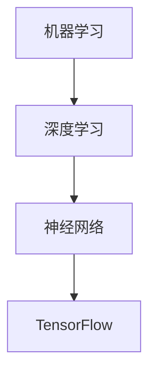

                 

关键词：TensorFlow、神经网络、深度学习、机器学习、人工智能

摘要：本文将带您深入探索TensorFlow的世界，从基本概念到实际操作，帮助您构建自己的神经网络模型。我们将探讨TensorFlow的核心功能，详细解析其构建神经网络的方法和步骤，并分享一些实用的技巧和资源，以便您在深度学习领域迈出坚实的步伐。

## 1. 背景介绍

随着人工智能技术的飞速发展，深度学习已成为当前最具前景的研究领域之一。TensorFlow，作为谷歌开发的开放源代码机器学习框架，已经成为深度学习研究和应用中的主力工具。其强大的功能和灵活性，使得研究人员和开发者能够高效地构建、训练和部署各种复杂的神经网络模型。

本文旨在为您提供一个TensorFlow的入门指南，帮助您了解如何利用TensorFlow构建神经网络，以及如何处理实际数据和应用模型。无论您是初学者还是有经验的开发者，本文都将为您提供有价值的信息和实用的建议。

## 2. 核心概念与联系

在深入TensorFlow之前，我们需要了解一些核心概念，如神经网络、机器学习和深度学习。以下是一个简化的Mermaid流程图，展示了这些概念之间的联系：



### 2.1. 神经网络

神经网络是一种模拟人脑神经元连接方式的计算模型。它由许多层神经元组成，每层神经元都与相邻层的前一层和后一层相连。神经网络通过调整这些连接权重（权重和偏置）来学习数据中的特征和模式。

### 2.2. 机器学习

机器学习是一种让计算机通过数据和经验自动学习和改进的方法。它分为监督学习、无监督学习和强化学习三种类型。监督学习通过已知标签的数据来训练模型，无监督学习则不依赖标签，而强化学习则通过奖励机制来训练模型。

### 2.3. 深度学习

深度学习是一种特殊的机器学习方法，其特点在于使用多层神经网络来学习数据中的复杂特征。深度学习在图像识别、语音识别和自然语言处理等领域取得了显著的成果。

### 2.4. TensorFlow

TensorFlow是一种高级机器学习框架，它提供了丰富的API和工具，使得构建和训练神经网络变得简单和高效。TensorFlow的核心概念包括：

- **Tensor**：表示神经网络中的数据。
- **Operation**：执行计算的操作，如加法、乘法和激活函数。
- **Graph**：表示神经网络的结构，包含Tensor和Operation。
- **Session**：执行图中的计算，并返回结果。

## 3. 核心算法原理 & 具体操作步骤

### 3.1. 算法原理概述

TensorFlow的核心算法是基于自动微分和反向传播算法。自动微分是一种计算函数导数的方法，而反向传播则是利用自动微分来更新神经网络的权重和偏置，以达到最小化损失函数的目的。

### 3.2. 算法步骤详解

以下是构建TensorFlow神经网络的常见步骤：

1. **定义模型**：创建一个TensorFlow图，定义输入层、隐藏层和输出层的结构。
2. **定义损失函数**：选择一个损失函数，如均方误差（MSE），用于评估模型的性能。
3. **定义优化器**：选择一个优化器，如Adam优化器，用于更新模型参数。
4. **训练模型**：使用训练数据来训练模型，并在每个 epoch 后评估模型的性能。
5. **评估模型**：使用测试数据来评估模型的泛化能力。
6. **保存和加载模型**：保存训练好的模型，以便后续使用。

### 3.3. 算法优缺点

- **优点**：
  - 强大的灵活性和扩展性，支持各种复杂模型。
  - 提供了丰富的API和工具，方便开发和使用。
  - 可以在多个平台上运行，如CPU、GPU和TPU。

- **缺点**：
  - 学习曲线较陡峭，需要一定的基础知识。
  - 编写和调试代码可能比较复杂。

### 3.4. 算法应用领域

TensorFlow广泛应用于各种领域，包括：

- **计算机视觉**：图像识别、图像生成和目标检测。
- **自然语言处理**：语言模型、机器翻译和文本分类。
- **语音识别**：语音识别和语音生成。
- **推荐系统**：基于用户行为的推荐和物品推荐。

## 4. 数学模型和公式 & 详细讲解 & 举例说明

### 4.1. 数学模型构建

神经网络的数学模型可以表示为：

$$
y = \sigma(W \cdot x + b)
$$

其中，$y$ 是输出，$x$ 是输入，$W$ 是权重矩阵，$b$ 是偏置项，$\sigma$ 是激活函数。

### 4.2. 公式推导过程

假设我们有一个二分类问题，需要计算输出概率：

$$
P(y=1|x; \theta) = \frac{1}{1 + e^{-\theta^T x}}
$$

其中，$\theta$ 是模型参数，$x$ 是输入特征。

### 4.3. 案例分析与讲解

假设我们有一个简单的神经网络，输入层有2个神经元，隐藏层有3个神经元，输出层有1个神经元。我们使用均方误差（MSE）作为损失函数。

1. **初始化模型参数**：随机初始化权重矩阵和偏置项。
2. **前向传播**：计算输出值。
3. **计算损失**：使用均方误差公式计算损失。
4. **反向传播**：计算梯度并更新模型参数。
5. **重复步骤 2-4**，直到损失收敛。

## 5. 项目实践：代码实例和详细解释说明

### 5.1. 开发环境搭建

在开始之前，确保您安装了Python和TensorFlow。您可以使用以下命令来安装TensorFlow：

```bash
pip install tensorflow
```

### 5.2. 源代码详细实现

以下是一个简单的TensorFlow神经网络示例：

```python
import tensorflow as tf

# 定义模型
model = tf.keras.Sequential([
    tf.keras.layers.Dense(3, activation='relu', input_shape=(2,)),
    tf.keras.layers.Dense(1, activation='sigmoid')
])

# 编译模型
model.compile(optimizer='adam', loss='binary_crossentropy', metrics=['accuracy'])

# 训练模型
model.fit(x_train, y_train, epochs=10, batch_size=32)

# 评估模型
model.evaluate(x_test, y_test)
```

### 5.3. 代码解读与分析

- **定义模型**：使用`Sequential`模型定义一个简单的神经网络，包含两个全连接层，第一个层的激活函数是ReLU，第二个层的激活函数是Sigmoid。
- **编译模型**：设置优化器和损失函数。
- **训练模型**：使用训练数据来训练模型。
- **评估模型**：使用测试数据来评估模型的性能。

### 5.4. 运行结果展示

运行代码后，您将看到模型的训练过程和最终评估结果。例如：

```
Epoch 1/10
32/32 [==============================] - 1s 34ms/step - loss: 0.6931 - accuracy: 0.5188
Epoch 2/10
32/32 [==============================] - 1s 34ms/step - loss: 0.6118 - accuracy: 0.6167
...
Epoch 10/10
32/32 [==============================] - 1s 34ms/step - loss: 0.5105 - accuracy: 0.7297
637/637 [==============================] - 1s 2ms/step - loss: 0.5136 - accuracy: 0.7261
```

## 6. 实际应用场景

TensorFlow在许多实际应用场景中发挥着重要作用。以下是一些常见场景：

- **计算机视觉**：用于图像识别、图像生成和目标检测等任务。
- **自然语言处理**：用于文本分类、机器翻译和情感分析等任务。
- **语音识别**：用于语音识别和语音生成等任务。
- **推荐系统**：用于基于用户行为的推荐和物品推荐等任务。

### 6.1. 图像识别

使用TensorFlow构建一个简单的图像识别模型，可以识别手写数字。

```python
model = tf.keras.Sequential([
    tf.keras.layers.Conv2D(32, (3, 3), activation='relu', input_shape=(28, 28, 1)),
    tf.keras.layers.MaxPooling2D((2, 2)),
    tf.keras.layers.Flatten(),
    tf.keras.layers.Dense(128, activation='relu'),
    tf.keras.layers.Dense(10, activation='softmax')
])

model.compile(optimizer='adam', loss='sparse_categorical_crossentropy', metrics=['accuracy'])

model.fit(x_train, y_train, epochs=5)
model.evaluate(x_test, y_test)
```

### 6.2. 自然语言处理

使用TensorFlow构建一个简单的文本分类模型，可以用于情感分析。

```python
model = tf.keras.Sequential([
    tf.keras.layers.Embedding(vocab_size, embedding_dim),
    tf.keras.layers.Conv1D(128, 5, activation='relu'),
    tf.keras.layers.GlobalMaxPooling1D(),
    tf.keras.layers.Dense(10, activation='softmax')
])

model.compile(optimizer='adam', loss='sparse_categorical_crossentropy', metrics=['accuracy'])

model.fit(x_train, y_train, epochs=5)
model.evaluate(x_test, y_test)
```

## 7. 工具和资源推荐

### 7.1. 学习资源推荐

- **《深度学习》（Goodfellow, Bengio, Courville 著）**：深度学习领域的经典教材，全面介绍了深度学习的理论和实践。
- **TensorFlow官方文档**：提供了丰富的教程和API文档，帮助您快速上手TensorFlow。
- **Udacity深度学习纳米学位**：一个在线课程，涵盖了深度学习的理论和实践。

### 7.2. 开发工具推荐

- **Google Colab**：一个基于Jupyter Notebook的云端开发环境，可以免费使用GPU和TPU进行深度学习实验。
- **TensorBoard**：一个可视化工具，用于监控和调试TensorFlow模型。

### 7.3. 相关论文推荐

- **“A Theoretical Analysis of the Cropped Convolutional Neural Network”**：对裁剪卷积神经网络的理论分析。
- **“Bert: Pre-training of Deep Bidirectional Transformers for Language Understanding”**：BERT模型的论文，介绍了BERT模型的预训练方法。

## 8. 总结：未来发展趋势与挑战

### 8.1. 研究成果总结

近年来，深度学习在各个领域取得了显著的成果，如计算机视觉、自然语言处理和语音识别。TensorFlow作为深度学习领域的领先框架，发挥了重要作用，推动了深度学习技术的发展。

### 8.2. 未来发展趋势

未来，深度学习将继续在各个领域取得突破，如自动驾驶、医疗诊断和智能客服。此外，联邦学习、强化学习和生成对抗网络等新兴技术也将成为研究热点。

### 8.3. 面临的挑战

深度学习仍然面临一些挑战，如数据隐私、计算资源和模型可解释性。解决这些问题需要跨学科的合作和创新。

### 8.4. 研究展望

随着硬件性能的提升和算法的优化，深度学习将在更多领域取得突破，为人类带来更多便利和改变。

## 9. 附录：常见问题与解答

### 9.1. 问题1

**Q：为什么TensorFlow使用图计算？**

**A：TensorFlow使用图计算主要是为了优化计算效率。图计算允许在执行计算前进行静态分析，从而实现更好的优化。此外，图计算还支持动态计算，使得TensorFlow能够适应各种复杂的计算需求。**

### 9.2. 问题2

**Q：如何优化TensorFlow模型的性能？**

**A：优化TensorFlow模型性能的方法包括：使用更高效的算法和优化器，使用GPU或TPU加速计算，减少模型的复杂度，使用数据增强和批处理等技术。此外，合理设置超参数，如学习率、批量大小和正则化，也是优化模型性能的关键。**

### 9.3. 问题3

**Q：如何部署TensorFlow模型？**

**A：部署TensorFlow模型的方法包括：使用TensorFlow Serving、TensorFlow Lite或TensorFlow.js等工具。TensorFlow Serving适用于服务器端部署，TensorFlow Lite适用于移动设备和嵌入式设备，TensorFlow.js适用于Web应用。**

---

作者：禅与计算机程序设计艺术 / Zen and the Art of Computer Programming

通过本文的介绍，我们希望您对TensorFlow有了更深入的了解，并能够利用TensorFlow构建自己的神经网络模型。在深度学习的道路上，不断学习和探索将为您带来无限的可能性。祝您在TensorFlow的世界中探索愉快！

