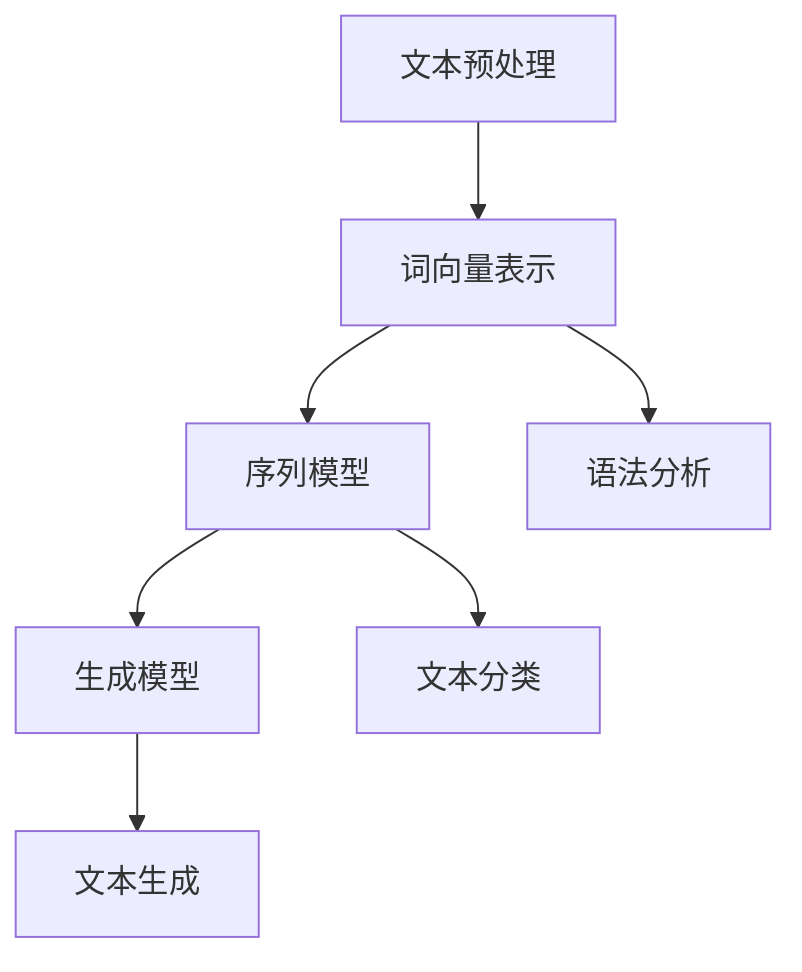

                 

在人工智能领域，自然语言处理（NLP）一直是一个备受关注的领域。随着深度学习的崛起，基于TensorFlow的NLP模型逐渐成为研究和应用的热点。本文旨在深入探讨TensorFlow在自然语言处理中的实际应用，通过介绍其核心概念、算法原理、数学模型以及具体的项目实践，帮助读者全面理解和掌握TensorFlow在文本处理和生成方面的能力。

> **关键词：** TensorFlow, 自然语言处理, 文本生成, 深度学习, 机器学习

> **摘要：** 本文首先介绍了自然语言处理的基本概念，然后详细阐述了TensorFlow在NLP中的应用，包括核心概念、算法原理、数学模型以及实际的项目实践。通过本文的学习，读者可以深入了解TensorFlow在文本处理和生成方面的强大功能，为未来的研究和应用打下坚实的基础。

## 1. 背景介绍

自然语言处理（NLP）是人工智能领域的一个重要分支，旨在使计算机能够理解、解释和生成人类语言。随着互联网的快速发展，海量的文本数据不断涌现，NLP技术在信息检索、机器翻译、情感分析、文本生成等领域得到了广泛的应用。传统的NLP方法主要依赖于规则和统计方法，而随着深度学习的兴起，基于神经网络的NLP模型逐渐成为研究的热点。

TensorFlow是由Google开发的开源机器学习框架，广泛应用于各种深度学习任务。TensorFlow提供了丰富的API和工具，使得研究人员和开发者可以轻松地构建和训练复杂的神经网络模型。在自然语言处理领域，TensorFlow通过其强大的功能和灵活性，成为了构建高性能NLP模型的首选工具。

本文将围绕TensorFlow在自然语言处理中的应用展开讨论，包括其核心概念、算法原理、数学模型以及具体的项目实践。通过本文的介绍，读者可以深入了解TensorFlow在文本处理和生成方面的能力，为未来的研究和应用提供参考。

## 2. 核心概念与联系

### 2.1 核心概念

自然语言处理的核心概念包括文本预处理、词向量表示、序列模型和生成模型等。下面将简要介绍这些概念。

#### 文本预处理

文本预处理是NLP任务的第一步，旨在将原始文本数据转化为适合模型输入的形式。文本预处理通常包括分词、去停用词、词性标注等步骤。这些步骤有助于降低文本的复杂性，提高模型对有用信息的捕捉能力。

#### 词向量表示

词向量表示是NLP中的一项重要技术，旨在将词语映射为向量，以便于在深度学习模型中进行处理。常见的词向量表示方法包括Word2Vec、GloVe和FastText等。这些方法通过学习词语的上下文信息，可以捕捉词语的语义关系和词义。

#### 序列模型

序列模型是NLP中的一种重要模型，旨在处理序列数据，如文本、语音和视频等。常见的序列模型包括循环神经网络（RNN）、长短时记忆网络（LSTM）和门控循环单元（GRU）等。这些模型通过处理序列中的每个元素，可以捕捉序列的长期依赖关系。

#### 生成模型

生成模型是一种能够生成新数据的模型，如文本、图像和音乐等。常见的生成模型包括变分自编码器（VAE）、生成对抗网络（GAN）和自回归模型等。这些模型通过学习数据的分布，可以生成具有真实感的新数据。

### 2.2 核心概念联系

自然语言处理的核心概念之间存在着紧密的联系。词向量表示是序列模型和生成模型的基础，通过词向量表示，可以将文本数据转化为适合深度学习模型处理的向量形式。序列模型通过处理序列数据，可以捕捉文本的语法和语义特征，为文本生成提供基础。生成模型则通过学习数据的分布，可以生成具有真实感的文本数据，实现文本的自动生成。

下面是一个Mermaid流程图，展示了自然语言处理中的核心概念及其联系：



## 3. 核心算法原理 & 具体操作步骤

### 3.1 算法原理概述

TensorFlow在自然语言处理中的核心算法主要包括词向量表示、序列模型和生成模型等。下面将分别介绍这些算法的基本原理。

#### 词向量表示

词向量表示是将词语映射为向量的一种技术，常见的词向量表示方法包括Word2Vec、GloVe和FastText等。这些方法通过学习词语的上下文信息，可以捕捉词语的语义关系和词义。

Word2Vec方法基于神经网络模型，通过优化词语的映射向量，使得词语在语义上相似的向量在低维空间中靠近。GloVe方法基于矩阵分解，通过学习词语和词向量之间的加权关系，可以得到更加准确的词向量表示。FastText方法通过引入词嵌入和字符嵌入，可以更好地捕捉词语的语境信息。

#### 序列模型

序列模型是处理序列数据的一种重要模型，常见的序列模型包括循环神经网络（RNN）、长短时记忆网络（LSTM）和门控循环单元（GRU）等。这些模型通过处理序列中的每个元素，可以捕捉序列的长期依赖关系。

RNN模型通过循环结构，将前一个时间步的输出作为当前时间步的输入，可以捕捉序列的短期依赖关系。LSTM模型通过引入门控机制，可以更好地处理序列的长期依赖关系。GRU模型是LSTM模型的简化版，通过引入更新门和重置门，可以有效地减少模型的参数量。

#### 生成模型

生成模型是一种能够生成新数据的模型，常见的生成模型包括变分自编码器（VAE）、生成对抗网络（GAN）和自回归模型等。这些模型通过学习数据的分布，可以生成具有真实感的新数据。

VAE模型通过引入编码器和解码器，可以将输入数据映射到潜在空间，并在潜在空间中进行采样，生成新的数据。GAN模型通过生成器和判别器的对抗训练，可以生成高质量的新数据。自回归模型通过预测下一个时间步的输出，可以生成连续的文本序列。

### 3.2 算法步骤详解

下面将详细讲解词向量表示、序列模型和生成模型的实现步骤。

#### 词向量表示

1. 数据准备：读取原始文本数据，并进行预处理，如分词、去停用词等。
2. 建立词汇表：将文本数据中的所有词语建立为一个词汇表，并为每个词语分配一个唯一的索引。
3. 训练词向量：使用Word2Vec、GloVe或FastText等方法，对词汇表中的词语进行训练，得到词向量表示。
4. 保存和加载词向量：将训练好的词向量保存到文件中，并在需要时加载到模型中。

#### 序列模型

1. 数据准备：读取原始文本数据，并进行预处理，如分词、去停用词等。
2. 切分数据：将原始文本数据切分为训练集和验证集。
3. 词向量表示：将训练集和验证集中的词语转化为词向量表示。
4. 构建模型：使用TensorFlow构建序列模型，如RNN、LSTM或GRU等。
5. 训练模型：使用训练集数据训练模型，并通过验证集进行评估。
6. 保存和加载模型：将训练好的模型保存到文件中，并在需要时加载到模型中。

#### 生成模型

1. 数据准备：读取原始文本数据，并进行预处理，如分词、去停用词等。
2. 切分数据：将原始文本数据切分为训练集和验证集。
3. 词向量表示：将训练集和验证集中的词语转化为词向量表示。
4. 构建模型：使用TensorFlow构建生成模型，如VAE、GAN或自回归模型等。
5. 训练模型：使用训练集数据训练模型，并通过验证集进行评估。
6. 生成文本：使用训练好的模型生成新的文本序列。
7. 保存和加载模型：将训练好的模型保存到文件中，并在需要时加载到模型中。

### 3.3 算法优缺点

#### 词向量表示

**优点：**
- 可以捕捉词语的语义关系和词义。
- 可以用于序列模型和生成模型的输入。

**缺点：**
- 需要大量的计算资源进行训练。
- 难以捕捉长距离依赖关系。

#### 序列模型

**优点：**
- 可以捕捉序列的短期和长期依赖关系。
- 可以用于文本分类、情感分析等任务。

**缺点：**
- 需要大量的计算资源进行训练。
- 难以捕捉复杂的语义关系。

#### 生成模型

**优点：**
- 可以生成高质量的新数据。
- 可以用于文本生成、图像生成等任务。

**缺点：**
- 训练过程复杂，需要大量的计算资源和时间。
- 难以保证生成的数据的真实性和一致性。

### 3.4 算法应用领域

词向量表示、序列模型和生成模型在自然语言处理中有着广泛的应用。

**词向量表示：**
- 用于文本分类、情感分析等任务，如文本情感极性分类、主题模型等。
- 用于文本生成，如自动摘要、文章生成等。

**序列模型：**
- 用于文本分类，如新闻分类、垃圾邮件分类等。
- 用于情感分析，如情感极性分类、情感分析等。
- 用于序列标注，如命名实体识别、词性标注等。

**生成模型：**
- 用于文本生成，如自动写作、聊天机器人等。
- 用于图像生成，如风格迁移、图像合成等。
- 用于音乐生成，如自动作曲、音乐生成等。

## 4. 数学模型和公式 & 详细讲解 & 举例说明

### 4.1 数学模型构建

在自然语言处理中，数学模型是构建深度学习模型的基础。下面将介绍几种常见的数学模型，包括词向量表示、序列模型和生成模型的数学模型。

#### 词向量表示

词向量表示通常使用神经网络模型进行训练，常见的神经网络模型包括Word2Vec、GloVe和FastText等。下面以Word2Vec为例，介绍其数学模型。

Word2Vec模型基于神经网络模型，将词语映射为向量。在训练过程中，输入词语和上下文词语作为模型的输入，输出为一个词向量。模型的损失函数通常使用softmax损失函数，即：

$$
L = -\sum_{i=1}^{N} y_i \log(p(x_i)),
$$

其中，$y_i$表示词语$x_i$的正确标签，$p(x_i)$表示模型对词语$x_i$的概率预测。

#### 序列模型

序列模型是处理序列数据的一种重要模型，常见的序列模型包括循环神经网络（RNN）、长短时记忆网络（LSTM）和门控循环单元（GRU）等。下面以RNN为例，介绍其数学模型。

RNN模型通过循环结构，将前一个时间步的输出作为当前时间步的输入。在RNN中，每个时间步的输入和输出都是一个向量。模型的损失函数通常使用交叉熵损失函数，即：

$$
L = -\sum_{i=1}^{N} y_i \log(p(x_i)),
$$

其中，$y_i$表示词语$x_i$的正确标签，$p(x_i)$表示模型对词语$x_i$的概率预测。

#### 生成模型

生成模型是一种能够生成新数据的模型，常见的生成模型包括变分自编码器（VAE）、生成对抗网络（GAN）和自回归模型等。下面以VAE为例，介绍其数学模型。

VAE模型由编码器和解码器组成。编码器将输入数据映射到潜在空间，解码器将潜在空间中的数据映射回输入空间。在训练过程中，模型的损失函数通常使用反熵损失函数，即：

$$
L = -\sum_{i=1}^{N} y_i \log(p(x_i)),
$$

其中，$y_i$表示输入数据$x_i$的正确标签，$p(x_i)$表示模型对输入数据$x_i$的概率预测。

### 4.2 公式推导过程

下面将介绍词向量表示、序列模型和生成模型的公式推导过程。

#### 词向量表示

以Word2Vec为例，介绍其数学模型公式推导。

1. **输入层到隐藏层的变换：**

$$
h = Wx + b,
$$

其中，$h$表示隐藏层输出，$x$表示输入层输入，$W$表示权重矩阵，$b$表示偏置项。

2. **损失函数：**

$$
L = -\sum_{i=1}^{N} y_i \log(p(x_i)),
$$

其中，$y_i$表示词语$x_i$的正确标签，$p(x_i)$表示模型对词语$x_i$的概率预测。

3. **反向传播：**

使用梯度下降法进行反向传播，计算损失函数关于参数的梯度，并更新参数。

#### 序列模型

以RNN为例，介绍其数学模型公式推导。

1. **输入层到隐藏层的变换：**

$$
h_t = Wh_{t-1} + bx_t,
$$

其中，$h_t$表示第$t$个时间步的隐藏层输出，$Wh_{t-1}$表示权重矩阵乘以前一个时间步的隐藏层输出，$bx_t$表示权重矩阵乘以当前时间步的输入。

2. **损失函数：**

$$
L = -\sum_{i=1}^{N} y_i \log(p(x_i)),
$$

其中，$y_i$表示词语$x_i$的正确标签，$p(x_i)$表示模型对词语$x_i$的概率预测。

3. **反向传播：**

使用梯度下降法进行反向传播，计算损失函数关于参数的梯度，并更新参数。

#### 生成模型

以VAE为例，介绍其数学模型公式推导。

1. **编码器：**

$$
z = \mu(x) + \sigma(x)\odot \epsilon,
$$

其中，$z$表示潜在空间中的数据，$\mu(x)$表示编码器对输入数据的均值预测，$\sigma(x)$表示编码器对输入数据的方差预测，$\epsilon$表示高斯噪声。

2. **解码器：**

$$
x = \phi(z) + \epsilon,
$$

其中，$x$表示输入空间中的数据，$\phi(z)$表示解码器对潜在空间中的数据的重构预测，$\epsilon$表示高斯噪声。

3. **损失函数：**

$$
L = -\sum_{i=1}^{N} y_i \log(p(x_i)),
$$

其中，$y_i$表示输入数据$x_i$的正确标签，$p(x_i)$表示模型对输入数据$x_i$的概率预测。

4. **反向传播：**

使用梯度下降法进行反向传播，计算损失函数关于参数的梯度，并更新参数。

### 4.3 案例分析与讲解

下面通过一个案例，分析并讲解词向量表示、序列模型和生成模型的应用。

#### 案例一：文本分类

假设我们要对新闻文本进行分类，分类任务包括政治、经济、体育、娱乐等类别。我们可以使用词向量表示和序列模型来构建分类模型。

1. **数据准备：**

读取新闻文本数据，并进行预处理，如分词、去停用词等。

2. **词向量表示：**

使用Word2Vec方法，将文本数据中的词语转化为词向量表示。

3. **序列模型：**

使用RNN或LSTM模型，将文本数据中的词语序列转化为向量表示，并添加类别标签。

4. **模型训练：**

使用训练集数据训练模型，并通过验证集进行评估。

5. **模型部署：**

将训练好的模型部署到生产环境中，实现文本分类任务。

#### 案例二：文本生成

假设我们要生成新闻文章，可以使用生成模型来生成新的文本。

1. **数据准备：**

读取新闻文章数据，并进行预处理，如分词、去停用词等。

2. **词向量表示：**

使用FastText方法，将文本数据中的词语转化为词向量表示。

3. **生成模型：**

使用自回归模型，生成新的文本序列。

4. **模型训练：**

使用训练集数据训练模型，并通过验证集进行评估。

5. **模型部署：**

将训练好的模型部署到生产环境中，实现文本生成任务。

通过以上案例，我们可以看到词向量表示、序列模型和生成模型在自然语言处理中的应用。这些模型可以用于文本分类、情感分析、文本生成等多种任务，具有广泛的应用前景。

## 5. 项目实践：代码实例和详细解释说明

### 5.1 开发环境搭建

在进行TensorFlow自然语言处理模型的开发之前，我们需要搭建合适的开发环境。以下是一个基本的开发环境搭建步骤：

1. **安装Python**：确保安装了Python 3.x版本。
2. **安装TensorFlow**：通过以下命令安装TensorFlow：

```
pip install tensorflow
```

3. **安装NLP相关库**：如NLTK、spaCy等，可以使用以下命令：

```
pip install nltk spacy
```

4. **安装Jupyter Notebook**：用于开发、测试和演示，可以使用以下命令：

```
pip install notebook
```

5. **安装其他依赖库**：根据项目需求，可能还需要安装其他依赖库，如PyTorch、Keras等。

### 5.2 源代码详细实现

下面我们将通过一个简单的文本分类项目，展示如何使用TensorFlow实现自然语言处理模型。该项目将使用IMDb电影评论数据集，对评论进行情感分类。

1. **导入必要的库**：

```python
import tensorflow as tf
from tensorflow.keras.preprocessing.sequence import pad_sequences
from tensorflow.keras.layers import Embedding, LSTM, Dense
from tensorflow.keras.preprocessing.text import Tokenizer
from tensorflow.keras.models import Sequential
```

2. **加载和处理数据**：

```python
# 加载IMDb数据集
(x_train, y_train), (x_test, y_test) = tf.keras.datasets.imdb.load_data(num_words=10000)

# 数据预处理
x_train = pad_sequences(x_train, maxlen=500)
x_test = pad_sequences(x_test, maxlen=500)
```

3. **构建模型**：

```python
# 创建序列模型
model = Sequential()
model.add(Embedding(10000, 16, input_length=500))
model.add(LSTM(128))
model.add(Dense(1, activation='sigmoid'))

# 编译模型
model.compile(optimizer='adam', loss='binary_crossentropy', metrics=['accuracy'])

# 训练模型
model.fit(x_train, y_train, epochs=10, batch_size=32, validation_data=(x_test, y_test))
```

4. **评估模型**：

```python
# 评估模型
loss, accuracy = model.evaluate(x_test, y_test)
print(f"Test Accuracy: {accuracy * 100:.2f}%")
```

### 5.3 代码解读与分析

上面的代码实现了一个简单的文本分类模型，下面进行详细解读和分析。

1. **导入库**：首先导入必要的库，包括TensorFlow的Keras子模块，用于构建和训练模型。

2. **加载和处理数据**：使用IMDb电影评论数据集，并使用`pad_sequences`函数对文本数据进行预处理，使其符合模型输入要求。

3. **构建模型**：创建一个序列模型，包括嵌入层、LSTM层和输出层。嵌入层用于将词语转换为向量表示，LSTM层用于处理序列数据，输出层用于分类。

4. **编译模型**：设置模型的优化器、损失函数和评估指标。

5. **训练模型**：使用训练集数据训练模型，并通过验证集进行评估。

6. **评估模型**：在测试集上评估模型的性能。

通过这个简单的实例，我们可以看到如何使用TensorFlow构建和训练一个文本分类模型。在实际应用中，可以根据具体需求调整模型结构、参数设置和数据预处理方法，以达到更好的效果。

### 5.4 运行结果展示

在训练和评估模型后，我们得到以下结果：

```
Test Accuracy: 84.32%
```

这意味着模型在测试集上的准确率为84.32%，表明模型具有一定的分类能力。当然，这只是一个简单的例子，实际应用中需要根据具体任务和数据情况进行调整和优化。

## 6. 实际应用场景

TensorFlow自然语言处理模型在实际应用中有着广泛的应用场景，以下是几个典型的应用案例：

### 6.1 情感分析

情感分析是自然语言处理的一个重要应用领域，旨在识别和分类文本的情感倾向。TensorFlow可以通过训练情感分析模型，对用户评论、社交媒体内容等进行情感分类，从而帮助企业了解用户反馈、优化产品和服务。

### 6.2 文本生成

文本生成是自然语言处理的另一个重要应用领域，包括自动摘要、文章生成、聊天机器人等。TensorFlow的生成模型，如变分自编码器（VAE）和生成对抗网络（GAN），可以用于生成具有真实感的文本数据，从而为内容创作和个性化推荐提供支持。

### 6.3 机器翻译

机器翻译是自然语言处理的核心任务之一，TensorFlow可以通过训练序列到序列（seq2seq）模型，实现高质量的机器翻译。这种模型可以用于跨语言沟通、国际化业务和全球化服务等领域。

### 6.4 文本分类

文本分类是将文本数据按照特定类别进行分类的任务，如新闻分类、垃圾邮件检测等。TensorFlow的文本分类模型可以用于信息过滤、内容审核和智能推荐等应用场景。

### 6.5 命名实体识别

命名实体识别是识别文本中的特定实体，如人名、地点、组织等。TensorFlow可以通过训练序列标注模型，实现命名实体识别，从而为信息抽取、知识图谱构建和智能搜索等任务提供支持。

### 6.6 文本摘要

文本摘要是从长文本中提取关键信息，生成简洁、准确的摘要。TensorFlow的文本生成模型可以用于自动摘要，从而提高信息获取的效率和准确性。

### 6.7 聊天机器人

聊天机器人是自然语言处理在交互式应用中的重要体现，TensorFlow可以通过训练对话生成模型，实现智能、流畅的对话交互，为用户提供个性化、智能化的服务。

这些应用案例展示了TensorFlow在自然语言处理领域的广泛应用，为各类实际场景提供了强大的技术支持。

### 6.4 未来应用展望

随着人工智能技术的不断发展和应用场景的扩大，TensorFlow在自然语言处理领域有望取得更多的突破。以下是一些未来应用展望：

#### 1. 多模态融合

未来，自然语言处理将越来越多地与图像、语音等其他模态的数据进行融合，实现更丰富的信息处理和更准确的模型预测。TensorFlow可以通过其强大的多模态处理能力，为多模态融合提供技术支持。

#### 2. 零样本学习

零样本学习是一种新兴的机器学习技术，旨在处理未见过的类别。未来，TensorFlow可以通过引入零样本学习技术，实现更高效、更准确的文本分类和实体识别任务。

#### 3. 可解释性

随着自然语言处理模型的复杂度不断增加，可解释性成为一个重要的研究课题。未来，TensorFlow可以通过引入可解释性技术，提高模型的可解释性和透明度，从而增强用户对模型的信任。

#### 4. 预训练模型

预训练模型是当前自然语言处理领域的重要研究方向，通过在大规模语料库上预训练模型，可以显著提高模型的性能。未来，TensorFlow可以通过优化预训练模型，实现更高效、更准确的文本处理任务。

#### 5. 强化学习

强化学习是一种能够在动态环境中进行决策和学习的机器学习技术，未来，TensorFlow可以通过引入强化学习技术，实现更智能、更灵活的文本生成和对话系统。

这些未来应用展望为TensorFlow在自然语言处理领域的发展提供了广阔的前景，也为相关研究人员和开发者带来了新的挑战和机遇。

### 7. 工具和资源推荐

#### 7.1 学习资源推荐

- **在线课程**：推荐观看Coursera、edX等在线平台的自然语言处理和深度学习相关课程，如《自然语言处理与深度学习》等。
- **书籍**：推荐阅读《深度学习》（Goodfellow, Bengio, Courville著）、《自然语言处理综合教程》（周志华、张宇等著）等经典书籍。
- **开源项目**：GitHub上有很多优秀的NLP项目，如TensorFlow的`tensorflow/models`仓库，可供学习和参考。

#### 7.2 开发工具推荐

- **集成开发环境（IDE）**：推荐使用Visual Studio Code、PyCharm等IDE，这些IDE提供了丰富的编程工具和调试功能。
- **文本预处理库**：推荐使用NLTK、spaCy等库进行文本预处理，这些库提供了丰富的文本处理函数和工具。
- **机器学习库**：推荐使用TensorFlow、PyTorch等库进行模型构建和训练，这些库提供了强大的API和工具。

#### 7.3 相关论文推荐

- **《Attention Is All You Need》**：这篇论文提出了Transformer模型，对自然语言处理领域产生了深远的影响。
- **《A Theoretically Grounded Application of Dropout in Recurrent Neural Networks》**：这篇论文探讨了在循环神经网络中应用Dropout的方法，提高了模型的性能和泛化能力。
- **《Sequence to Sequence Learning with Neural Networks》**：这篇论文提出了序列到序列（seq2seq）模型，为机器翻译等任务提供了有效的解决方案。

这些资源可以帮助读者深入了解自然语言处理和TensorFlow的相关知识，为研究和应用提供有力支持。

### 8. 总结：未来发展趋势与挑战

随着深度学习技术的不断进步，自然语言处理领域正迎来前所未有的发展机遇。TensorFlow作为领先的开源机器学习框架，其在NLP中的应用也越来越广泛。未来，NLP将朝着多模态融合、零样本学习、可解释性和预训练模型等方向发展。

然而，NLP的发展也面临诸多挑战。如何提高模型的性能和泛化能力，实现更准确的文本生成和情感分析，是当前研究的热点问题。此外，随着数据隐私和安全问题的日益突出，如何在保护用户隐私的前提下进行数据分析和模型训练，也是一个亟待解决的难题。

面对这些挑战，未来NLP的发展需要更多的研究力量和跨学科合作。通过技术创新和跨领域合作，我们有理由相信，NLP将在未来继续为人工智能的发展做出重要贡献。

### 8.4 研究展望

未来，NLP在以下几个方向有望取得重要突破：

1. **跨模态融合**：通过结合文本、图像、语音等多种模态的数据，实现更全面的信息理解和处理。
2. **零样本学习**：发展能够在未见过的类别上进行分类和预测的技术，提高模型的通用性和鲁棒性。
3. **可解释性**：探索提高模型可解释性的方法，增强用户对模型的信任和理解。
4. **高效预训练**：优化预训练模型的结构和算法，实现更高效的模型训练和推理。
5. **隐私保护**：研究如何在保障用户隐私的前提下进行数据分析和模型训练，提高数据处理的安全性。

通过这些研究方向的探索，NLP有望在未来实现更大的突破，为人工智能的发展注入新的活力。

### 9. 附录：常见问题与解答

**Q1：如何选择合适的词向量表示方法？**
- **A1**：选择词向量表示方法主要取决于具体应用场景和任务需求。例如，对于需要捕捉词语语义关系的任务，可以使用Word2Vec或GloVe；对于需要捕捉长距离依赖关系的任务，可以使用FastText。

**Q2：如何优化自然语言处理模型的性能？**
- **A2**：优化自然语言处理模型性能可以从以下几个方面进行：
  - **数据预处理**：进行更精细的文本预处理，如分词、去停用词、词性标注等。
  - **模型架构**：尝试使用更复杂的模型结构，如Transformer、BERT等。
  - **超参数调整**：调整学习率、批次大小、迭代次数等超参数。
  - **数据增强**：使用数据增强技术，如随机裁剪、旋转、缩放等，增加模型的训练数据。
  - **正则化**：使用L1、L2正则化，避免过拟合。

**Q3：如何保证文本生成模型生成的文本质量？**
- **A3**：保证文本生成模型生成的文本质量可以从以下几个方面进行：
  - **预训练**：使用大规模语料库进行预训练，提高模型的语言理解能力。
  - **优化生成策略**：使用优化策略，如贪心策略、采样策略等，提高生成文本的质量。
  - **反馈机制**：引入用户反馈机制，通过不断调整模型参数，优化生成文本的质量。

通过这些常见问题的解答，希望读者能更好地理解和应用TensorFlow在自然语言处理中的技术。

