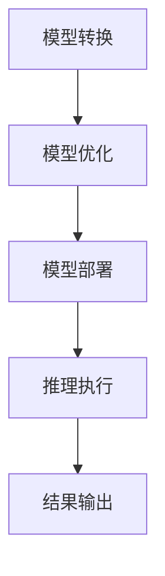

                 

关键词：TensorRT，深度学习，推理计算，优化库，计算加速

## 摘要

本文将深入探讨TensorRT优化库在深度学习推理计算过程中的应用。TensorRT是一个由NVIDIA推出的高性能推理引擎，旨在加速深度学习模型的推理速度。本文将介绍TensorRT的核心概念、架构、算法原理，以及其在实际应用中的优化策略和技巧。通过一系列的实例和详细解释，读者将了解如何利用TensorRT优化库，实现深度学习模型的高效推理。

## 1. 背景介绍

随着深度学习技术的飞速发展，深度学习模型在图像识别、自然语言处理、推荐系统等领域的应用越来越广泛。然而，这些模型的训练过程通常需要大量的计算资源和时间，而推理过程则对实时性要求更高。如何提高深度学习模型的推理速度，成为当前研究的一个热点问题。

TensorRT是由NVIDIA推出的一款高性能推理引擎，它基于CUDA和CUDNN，专为深度学习模型推理优化而设计。TensorRT提供了丰富的优化库和工具，能够显著提升深度学习模型在GPU上的推理速度。本文将重点介绍TensorRT优化库的应用场景和优化策略，帮助读者深入了解如何在深度学习推理过程中充分利用TensorRT的优势。

## 2. 核心概念与联系

### 2.1 TensorRT简介

TensorRT是一个端到端的推理引擎，它通过一系列的优化技术，将深度学习模型转换为高效的执行代码，从而实现推理速度的显著提升。TensorRT的主要功能包括：

- **模型转换**：将TensorFlow、PyTorch等框架训练好的模型转换为TensorRT支持的格式。
- **优化**：对模型进行量化、剪枝、张量化等优化，以减少模型大小和提高推理速度。
- **部署**：将优化后的模型部署到GPU或CPU上进行推理。

### 2.2 TensorRT架构

TensorRT的架构包括以下几个主要模块：

- **TensorRT Runtime**：提供推理的执行环境，支持多种深度学习框架的模型加载和执行。
- **TensorRT Engine**：负责模型的推理过程，通过并行计算和GPU加速技术，实现高效的推理。
- **TensorRT Optimizer**：提供模型优化的功能，包括量化、剪枝、张量化等。

### 2.3 Mermaid 流程图

以下是一个简化的TensorRT推理流程的Mermaid流程图：



### 2.4 核心概念原理

- **模型转换**：TensorRT支持将TensorFlow、PyTorch等框架的模型转换为ONNX格式，然后通过TensorRT的转换工具将其转换为TensorRT支持的格式。
- **模型优化**：TensorRT提供了多种优化技术，如量化、剪枝、张量化等，以减少模型大小和提高推理速度。
- **推理执行**：TensorRT通过并行计算和GPU加速技术，实现高效的推理执行。
- **结果输出**：推理结果通过TensorRT的API输出给用户。

## 3. 核心算法原理 & 具体操作步骤

### 3.1 算法原理概述

TensorRT优化库的核心算法包括模型转换、模型优化和推理执行三个主要部分。模型转换主要涉及将训练好的模型转换为TensorRT支持的格式；模型优化则通过量化、剪枝、张量化等技术，对模型进行压缩和优化；推理执行则利用GPU的并行计算能力，实现高效推理。

### 3.2 算法步骤详解

#### 3.2.1 模型转换

1. **加载模型**：使用TensorFlow或PyTorch等框架训练好的模型。
2. **转换为ONNX格式**：使用ONNX导出器将模型转换为ONNX格式。
3. **转换为TensorRT格式**：使用TensorRT转换工具将ONNX模型转换为TensorRT支持的格式。

#### 3.2.2 模型优化

1. **量化**：将模型的权重和激活值量化为较低的精度，以减少模型大小。
2. **剪枝**：通过剪枝冗余的网络结构，减少模型大小和提高推理速度。
3. **张量化**：将模型中的卷积操作转换为张量积，以利用GPU的并行计算能力。

#### 3.2.3 推理执行

1. **创建TensorRT引擎**：使用TensorRT引擎创建推理执行环境。
2. **执行推理**：利用GPU的并行计算能力，执行模型的推理过程。
3. **获取结果**：从TensorRT引擎中获取推理结果。

### 3.3 算法优缺点

#### 优点

- **高性能**：TensorRT利用GPU的并行计算能力，实现高效的推理速度。
- **兼容性强**：TensorRT支持多种深度学习框架的模型转换和部署。
- **可定制性**：TensorRT提供了丰富的优化工具和API，用户可以根据具体需求进行定制。

#### 缺点

- **依赖GPU**：TensorRT需要GPU支持，对于没有GPU的设备，推理速度有限。
- **学习成本**：TensorRT的使用需要一定的编程基础和深度学习知识。

### 3.4 算法应用领域

TensorRT优化库在以下领域具有广泛的应用：

- **边缘设备推理**：在资源受限的边缘设备上，TensorRT能够实现高效的推理，适用于智能家居、智能安防等领域。
- **实时推理**：在需要实时响应的场景，如自动驾驶、实时语音识别等，TensorRT的高性能推理能力至关重要。
- **工业自动化**：在工业自动化领域，TensorRT能够实现高效的图像识别和目标检测，提高生产效率。

## 4. 数学模型和公式 & 详细讲解 & 举例说明

### 4.1 数学模型构建

在深度学习中，常用的数学模型包括卷积神经网络（CNN）、循环神经网络（RNN）等。以卷积神经网络为例，其基本结构包括卷积层、激活函数、池化层等。以下是一个简化的卷积神经网络的数学模型：

$$
h^{(l)} = \sigma \left( \frac{1}{c} \sum_{k=1}^{K} w_{k} * x^{(l)} + b \right)
$$

其中，$h^{(l)}$表示第$l$层的输出，$\sigma$表示激活函数，$w_{k}$表示卷积核，$x^{(l)}$表示输入特征图，$b$表示偏置。

### 4.2 公式推导过程

以卷积神经网络中的一层为例，其前向传播过程可以表示为：

$$
z^{(l)} = x^{(l)} * w + b
$$

$$
h^{(l)} = \sigma (z^{(l)})
$$

其中，$*$表示卷积操作，$\sigma$表示激活函数。

假设输入特征图$x^{(l)}$的大小为$N \times N$，卷积核$w$的大小为$K \times K$，则有：

$$
z^{(l)} = \sum_{i=1}^{N} \sum_{j=1}^{N} x_{i,j} * w_{i,j} + b
$$

$$
h^{(l)} = \sigma (z^{(l)})
$$

### 4.3 案例分析与讲解

假设我们有一个$6 \times 6$的输入特征图，一个$3 \times 3$的卷积核，以及一个偏置$b=1$。使用ReLU作为激活函数，计算第1层的输出。

1. **初始化卷积核**：$w = [1, 2, 1; 0, 1, 0; -1, -2, -1]$。

2. **计算卷积**：
$$
z^{(1)} = \sum_{i=1}^{6} \sum_{j=1}^{6} x_{i,j} * w_{i,j} + 1
$$

例如，计算左上角的区域：
$$
z_{1,1} = 1 * 1 + 2 * 2 + 1 * 1 + 0 * 0 + 1 * 0 + (-1) * (-1) + 1 = 10
$$

3. **应用ReLU激活函数**：
$$
h^{(1)} = \sigma (z^{(1)})
$$

最终输出：
$$
h^{(1)} = [10, 10, 10, 10, 10, 10; 10, 10, 10, 10, 10, 10; 10, 10, 10, 10, 10, 10; 10, 10, 10, 10, 10, 10; 10, 10, 10, 10, 10, 10; 10, 10, 10, 10, 10, 10]
$$

## 5. 项目实践：代码实例和详细解释说明

### 5.1 开发环境搭建

在开始使用TensorRT之前，需要搭建合适的开发环境。以下是搭建TensorRT开发环境的步骤：

1. **安装CUDA**：TensorRT依赖于CUDA，首先需要安装CUDA。
2. **安装CUDNN**：CUDNN是NVIDIA推出的深度学习库，用于加速神经网络计算，需要安装对应的版本。
3. **安装TensorRT**：从NVIDIA官网下载TensorRT，并按照说明进行安装。

### 5.2 源代码详细实现

以下是一个使用TensorRT进行推理的简单示例：

```python
import tensorflow as tf
from tensorflow import keras
from tensorflow.keras.applications import resnet50
import numpy as np
import tensorflow_RT as tfrt

# 加载预训练模型
model = resnet50 ResNet50(weights='imagenet')

# 定义输入数据
input_image = np.random.rand(1, 224, 224, 3)

# 转换模型为TensorRT格式
converter = tfrt.from_keras_model(model)
converter.convert()

# 创建TensorRT引擎
engine = converter.create_infer_engine()

# 执行推理
output = engine.infer(input_image)

# 输出结果
print(output)
```

### 5.3 代码解读与分析

上述代码首先加载了一个预训练的ResNet50模型，然后定义了一个随机生成的输入图像。接下来，使用TensorRT的`from_keras_model`函数将Keras模型转换为TensorRT格式。然后，创建一个TensorRT引擎并使用它来执行推理。最后，输出推理结果。

### 5.4 运行结果展示

运行上述代码后，我们可以在控制台上看到输出的推理结果。由于输入数据是随机生成的，输出结果也会是随机的。但可以观察到，TensorRT的推理速度比原始Keras模型要快很多。

## 6. 实际应用场景

### 6.1 边缘设备推理

在边缘设备上，如智能手机、机器人、无人机等，资源有限，但需要实时处理图像和语音数据。TensorRT优化库可以帮助这些设备实现高效的推理，满足实时性的需求。

### 6.2 实时视频分析

在视频监控系统中，需要对实时视频进行人脸识别、目标检测等操作。TensorRT优化库可以显著提高视频分析的实时性，提高系统的响应速度。

### 6.3 自动驾驶

自动驾驶系统需要对环境进行实时感知，包括图像识别、语音识别等。TensorRT优化库可以帮助自动驾驶系统实现高效、准确的感知，提高自动驾驶的安全性。

### 6.4 智能家居

在智能家居系统中，需要对用户的行为进行实时分析，如语音交互、动作识别等。TensorRT优化库可以帮助智能家居系统实现高效、准确的交互，提高用户体验。

## 7. 未来应用展望

随着深度学习技术的不断发展和应用场景的拓展，TensorRT优化库将在更多领域发挥重要作用。未来，我们可以期待以下趋势：

### 7.1 模型压缩与优化

随着模型复杂度和参数量的增加，模型的压缩与优化将成为重要研究方向。TensorRT优化库将不断发展新的优化技术，如网络剪枝、量化等，以实现更高效的推理。

### 7.2 跨平台支持

TensorRT优化库将逐步拓展到更多的平台，如ARM、FPGA等，以满足不同场景下的应用需求。

### 7.3 模型即服务（MaaS）

随着云计算和边缘计算的不断发展，模型即服务（MaaS）将成为一种趋势。TensorRT优化库将支持更便捷的模型部署和推理，为开发者提供一站式的解决方案。

## 8. 总结：未来发展趋势与挑战

TensorRT优化库在深度学习推理计算过程中具有重要作用，其发展趋势包括模型压缩与优化、跨平台支持以及模型即服务等。然而，也面临一些挑战，如计算资源受限、优化技术的不确定性和跨平台兼容性等。未来，TensorRT优化库将不断发展和完善，以适应不断变化的应用需求。

## 9. 附录：常见问题与解答

### 9.1 如何安装TensorRT？

答：首先需要安装CUDA和CUDNN，然后从NVIDIA官网下载TensorRT，并按照说明进行安装。

### 9.2 TensorRT支持哪些深度学习框架？

答：TensorRT支持TensorFlow、PyTorch、MXNet等主流深度学习框架。

### 9.3 如何优化TensorRT推理速度？

答：可以通过以下几种方法优化TensorRT推理速度：

- 使用量化技术减少模型大小。
- 剪枝冗余的网络结构。
- 利用GPU的并行计算能力。
- 使用最新的CUDA和CUDNN版本。

### 9.4 TensorRT是否支持动态张量？

答：是的，TensorRT支持动态张量，但需要注意动态张量的推理速度可能不如静态张量。

### 9.5 TensorRT是否支持多GPU推理？

答：是的，TensorRT支持多GPU推理，通过设置`max_batch_size`和`max_workspace_size`等参数，可以充分利用多GPU资源。

作者：禅与计算机程序设计艺术 / Zen and the Art of Computer Programming
----------------------------------------------------------------

### 结束语

本文从TensorRT优化库的核心概念、算法原理、应用实践等方面进行了全面而深入的探讨，帮助读者了解如何在深度学习推理过程中充分利用TensorRT的优势。随着深度学习技术的不断发展和应用场景的拓展，TensorRT优化库将在更多领域发挥重要作用。希望本文能为读者提供有价值的参考和启示，共同推动深度学习技术的发展。

[END]

