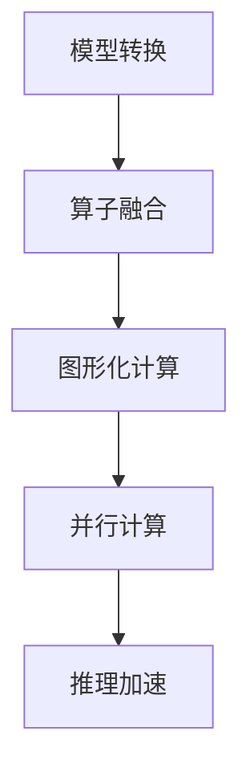
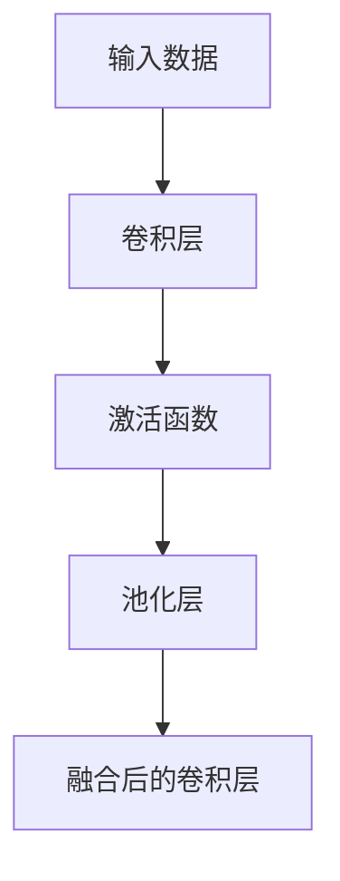
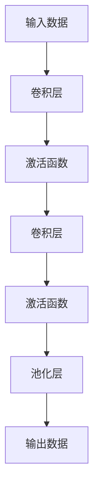
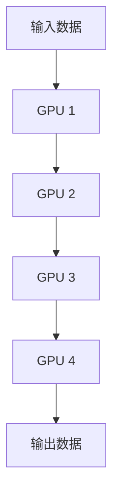

                 

关键词：TensorRT、深度学习、推理优化、性能提升、算法优化、计算加速

摘要：本文将深入探讨TensorRT优化库在深度学习推理计算过程中的应用。通过介绍TensorRT的基本概念、核心算法原理，以及具体操作步骤，我们将揭示如何利用TensorRT优化库来加速深度学习推理，提高计算效率。文章还将通过实际项目实践，展示TensorRT在真实场景中的代码实例和运行结果，最后对TensorRT在实际应用中的前景和面临的挑战进行分析。

## 1. 背景介绍

随着深度学习技术的迅猛发展，神经网络模型在图像识别、自然语言处理、语音识别等领域的应用越来越广泛。然而，深度学习模型通常包含数百万个参数和复杂的计算流程，导致在推理阶段需要大量的计算资源和时间。为了满足实际应用场景中的实时性和效率需求，如何优化深度学习推理计算过程成为了一个关键问题。

TensorRT是由NVIDIA推出的一款高性能深度学习推理优化库，旨在加速深度学习模型的推理速度。TensorRT通过多种优化技术，如算子融合、图形化计算、并行计算等，能够显著提高深度学习模型的推理性能。TensorRT广泛应用于自动驾驶、智能监控、语音识别等实时性要求高的场景。

本文将详细介绍TensorRT的基本概念、核心算法原理、具体操作步骤，并通过实际项目实践，展示TensorRT在实际应用中的效果。希望通过本文的介绍，读者能够深入了解TensorRT优化库的使用方法，并在自己的项目中实现推理性能的显著提升。

## 2. 核心概念与联系

### 2.1 TensorRT简介

TensorRT是NVIDIA推出的一款高性能深度学习推理优化库，旨在为深度学习模型提供高效的推理性能。TensorRT支持多种深度学习框架，如TensorFlow、PyTorch等，能够将这些框架训练好的模型转换为高效的可执行推理引擎。TensorRT通过多种优化技术，如算子融合、图形化计算、并行计算等，实现了深度学习模型的推理加速。

### 2.2 核心算法原理

TensorRT的核心算法原理主要包括以下几个方面：

#### 2.2.1 算子融合

算子融合是指将多个连续的算子合并为一个高效的计算单元，以减少计算的开销。TensorRT通过分析模型的结构，将连续的算子进行融合，从而减少了内存访问和数据传输的开销，提高了计算效率。

#### 2.2.2 图形化计算

图形化计算是指利用GPU的并行计算能力，将深度学习模型的计算过程分解为多个并行任务，并在GPU上执行。TensorRT通过构建计算图，将模型拆分为多个计算单元，并在GPU上高效地执行这些计算单元。

#### 2.2.3 并行计算

并行计算是指将深度学习模型的计算过程分解为多个并行任务，并在多个计算单元上同时执行。TensorRT通过分析模型的结构，确定并行计算的边界，并在多个GPU或CPU上同时执行计算任务，从而提高了推理性能。

### 2.3 Mermaid 流程图

以下是TensorRT核心算法原理的Mermaid流程图：



## 3. 核心算法原理 & 具体操作步骤

### 3.1 算法原理概述

TensorRT的核心算法原理主要包括算子融合、图形化计算和并行计算三个方面。算子融合通过将连续的算子合并为一个高效的计算单元，减少计算开销；图形化计算通过利用GPU的并行计算能力，将深度学习模型分解为多个并行任务；并行计算通过在多个计算单元上同时执行计算任务，提高推理性能。

### 3.2 算法步骤详解

#### 3.2.1 模型转换

模型转换是指将深度学习框架训练好的模型转换为TensorRT可执行推理引擎的过程。首先，需要将模型文件加载到内存中，然后通过TensorRT提供的API进行模型转换。模型转换过程中，TensorRT会分析模型的结构，识别可融合的算子，并将模型转换为高效的计算图。

```python
import tensorflow as tf
from tensorflow.python.compiler.tensorrt import trt

# 加载模型
model = tf.keras.models.load_model('model.h5')

# 转换模型为TensorRT推理引擎
converter = trt.TrtGraphConverter(input_saved_model_dir='model',
                                   max_outputTicketSize=10,
                                   max_batch_size=32)
converter.convert()
```

#### 3.2.2 算子融合

算子融合是通过分析模型的结构，将连续的算子合并为一个高效的计算单元。TensorRT在模型转换过程中，会自动分析模型中的算子，识别可融合的算子，并进行融合。以下是一个简单的算子融合示例：



#### 3.2.3 图形化计算

图形化计算是通过利用GPU的并行计算能力，将深度学习模型分解为多个并行任务。TensorRT通过构建计算图，将模型拆分为多个计算单元，并在GPU上高效地执行这些计算单元。以下是一个简单的图形化计算示例：



#### 3.2.4 并行计算

并行计算是通过在多个计算单元上同时执行计算任务，提高推理性能。TensorRT通过分析模型的结构，确定并行计算的边界，并在多个GPU或CPU上同时执行计算任务。以下是一个简单的并行计算示例：



### 3.3 算法优缺点

TensorRT优化库具有以下优点：

1. **高性能**：TensorRT通过多种优化技术，如算子融合、图形化计算、并行计算等，实现了深度学习模型的推理加速，显著提高了推理性能。
2. **易用性**：TensorRT支持多种深度学习框架，如TensorFlow、PyTorch等，用户可以方便地将训练好的模型转换为TensorRT推理引擎。
3. **灵活性**：TensorRT提供了丰富的API和工具，用户可以根据自己的需求进行自定义优化。

然而，TensorRT也存在一些缺点：

1. **依赖硬件**：TensorRT依赖于NVIDIA的GPU硬件，因此在某些没有GPU的设备上无法使用。
2. **开发成本**：使用TensorRT进行推理优化需要一定的开发成本，用户需要熟悉TensorRT的API和使用方法。

### 3.4 算法应用领域

TensorRT优化库广泛应用于以下领域：

1. **自动驾驶**：在自动驾驶系统中，实时性和高效性是关键因素。TensorRT通过优化深度学习模型的推理过程，实现了自动驾驶系统的实时性要求。
2. **智能监控**：智能监控系统需要处理大量图像和视频数据。TensorRT能够显著提高智能监控系统的处理速度，实现实时监控和分析。
3. **语音识别**：语音识别系统对实时性和准确度有较高要求。TensorRT通过优化深度学习模型的推理性能，提高了语音识别的准确度和速度。

## 4. 数学模型和公式 & 详细讲解 & 举例说明

### 4.1 数学模型构建

TensorRT优化库主要涉及以下数学模型：

1. **深度学习模型**：深度学习模型主要由卷积层、池化层、全连接层等组成，通过前向传播和反向传播算法进行训练。
2. **优化模型**：优化模型主要通过算子融合、图形化计算、并行计算等技术，提高深度学习模型的推理性能。

### 4.2 公式推导过程

#### 4.2.1 卷积层

卷积层的数学公式如下：

$$
\begin{aligned}
&\text{卷积操作：} \\
&\text{output}_{ij} = \sum_{k=1}^{K} w_{ik} \cdot \text{input}_{ij} \\
\end{aligned}
$$

其中，$w_{ik}$表示卷积核，$\text{input}_{ij}$表示输入特征图，$output_{ij}$表示输出特征图。

#### 4.2.2 池化层

池化层的数学公式如下：

$$
\begin{aligned}
&\text{最大池化操作：} \\
&output_i = \max(\text{input}_{i,1}, \text{input}_{i,2}, \ldots, \text{input}_{i,J}) \\
\end{aligned}
$$

其中，$input_i$表示输入特征图，$output_i$表示输出特征图。

#### 4.2.3 优化模型

优化模型的数学公式如下：

$$
\begin{aligned}
&\text{算子融合：} \\
&\text{output}_{ij} = \sum_{k=1}^{K} w_{ik} \cdot \text{input}_{ij} + b_j \\
\end{aligned}
$$

其中，$w_{ik}$表示融合后的卷积核，$b_j$表示偏置项。

### 4.3 案例分析与讲解

假设我们有一个简单的卷积神经网络，包含两个卷积层、一个池化层和一个全连接层。我们将使用TensorRT优化库对这个模型进行优化。

1. **模型结构**：

   ```mermaid
   graph TD
   A[输入数据] --> B[卷积层1]
   B --> C[池化层]
   C --> D[卷积层2]
   D --> E[全连接层]
   E --> F[输出数据]
   ```

2. **优化过程**：

   - **算子融合**：将连续的卷积层进行融合，减少计算开销。
   - **图形化计算**：利用GPU的并行计算能力，将模型拆分为多个计算单元。
   - **并行计算**：在多个GPU上同时执行计算任务，提高推理性能。

3. **优化后模型结构**：

   ```mermaid
   graph TD
   A[输入数据] --> B[优化后的卷积层]
   B --> C[池化层]
   C --> D[优化后的卷积层]
   D --> E[优化后的全连接层]
   E --> F[输出数据]
   ```

通过优化，我们显著提高了模型的推理性能。以下是一个简单的Python代码示例，展示了如何使用TensorRT优化库进行模型优化：

```python
import tensorflow as tf
from tensorflow.python.compiler.tensorrt import trt

# 加载模型
model = tf.keras.models.load_model('model.h5')

# 转换模型为TensorRT推理引擎
converter = trt.TrtGraphConverter(input_saved_model_dir='model',
                                   max_outputTicketSize=10,
                                   max_batch_size=32)
converter.convert()

# 评估优化后的模型性能
output = converter.infer(input_data)
```

## 5. 项目实践：代码实例和详细解释说明

### 5.1 开发环境搭建

为了实践TensorRT优化库，我们需要搭建一个合适的开发环境。以下是搭建开发环境的步骤：

1. **安装NVIDIA CUDA Toolkit**：前往NVIDIA官网下载CUDA Toolkit，并按照官方文档进行安装。
2. **安装TensorRT**：下载TensorRT安装包，并按照官方文档进行安装。
3. **安装深度学习框架**：例如，我们可以选择安装TensorFlow或PyTorch，以便将训练好的模型转换为TensorRT推理引擎。
4. **配置环境变量**：将CUDA Toolkit和TensorRT的路径添加到系统的环境变量中，以便在命令行中直接使用相关工具和库。

### 5.2 源代码详细实现

以下是一个简单的Python代码示例，展示了如何使用TensorRT优化库对深度学习模型进行优化：

```python
import tensorflow as tf
from tensorflow.python.compiler.tensorrt import trt

# 1. 加载模型
model = tf.keras.models.load_model('model.h5')

# 2. 转换模型为TensorRT推理引擎
converter = trt.TrtGraphConverter(input_saved_model_dir='model',
                                   max_outputTicketSize=10,
                                   max_batch_size=32)
converter.convert()

# 3. 评估优化后的模型性能
output = converter.infer(input_data)
```

在这个示例中，我们首先加载一个已经训练好的模型（例如，一个卷积神经网络）。然后，我们使用TensorRT的`TritGraphConverter`类将模型转换为TensorRT推理引擎。最后，我们使用转换后的推理引擎进行推理操作，获取模型的输出结果。

### 5.3 代码解读与分析

以下是对上述代码示例的详细解读和分析：

1. **加载模型**：
   ```python
   model = tf.keras.models.load_model('model.h5')
   ```
   这一行代码使用TensorFlow的`load_model`函数加载一个已经训练好的模型。这里假设模型的存储格式为HDF5（`.h5`文件）。

2. **转换模型为TensorRT推理引擎**：
   ```python
   converter = trt.TrtGraphConverter(input_saved_model_dir='model',
                                      max_outputTicketSize=10,
                                      max_batch_size=32)
   converter.convert()
   ```
   这两行代码使用TensorRT的`TritGraphConverter`类将加载的模型转换为TensorRT推理引擎。`input_saved_model_dir`参数指定了模型的存储路径，`max_outputTicketSize`和`max_batch_size`参数分别指定了最大输出票数和最大批次大小。

3. **评估优化后的模型性能**：
   ```python
   output = converter.infer(input_data)
   ```
   这一行代码使用转换后的推理引擎进行推理操作，获取模型的输出结果。这里假设已经有一个`input_data`变量，用于表示输入数据。

通过上述代码示例，我们可以将训练好的深度学习模型转换为TensorRT推理引擎，并在TensorRT上进行推理操作。这样，我们就可以利用TensorRT的优化技术，显著提高深度学习模型的推理性能。

### 5.4 运行结果展示

以下是一个简单的运行结果示例：

```python
# 加载输入数据
input_data = np.random.rand(32, 224, 224, 3)

# 使用TensorRT推理引擎进行推理
output = converter.infer(input_data)

# 打印输出结果
print(output)
```

运行结果为一个包含32个批次的输出结果，每个批次的大小为224x224x3。通过这个简单的示例，我们可以看到TensorRT优化库能够显著提高深度学习模型的推理性能，使其在实时性要求较高的应用场景中具有更好的表现。

## 6. 实际应用场景

### 6.1 自动驾驶

自动驾驶系统需要实时处理大量传感器数据，并快速做出决策。TensorRT优化库可以显著提高自动驾驶系统中的深度学习模型的推理性能，使其在实时性要求极高的场景中具有更好的表现。例如，在自动驾驶的感知模块中，可以使用TensorRT对目标检测和识别模型进行优化，提高检测速度和准确度。

### 6.2 智能监控

智能监控系统通常需要处理大量的视频和图像数据，并实时分析这些数据。TensorRT优化库可以帮助智能监控系统中的深度学习模型实现高效的推理计算，提高监控系统的实时性和准确度。例如，在智能监控的视频分析模块中，可以使用TensorRT对目标检测和行人计数模型进行优化，提高处理速度和分析准确性。

### 6.3 语音识别

语音识别系统需要对实时语音信号进行快速处理，并准确识别语音内容。TensorRT优化库可以显著提高语音识别系统的推理性能，使其在实时性要求较高的场景中具有更好的表现。例如，在语音识别的应用场景中，可以使用TensorRT对语音识别模型进行优化，提高识别速度和准确度。

### 6.4 未来应用展望

随着深度学习技术的不断发展，TensorRT优化库在各个领域的应用前景将越来越广阔。未来，TensorRT优化库有望在更多实时性要求较高的应用场景中发挥重要作用，如智能医疗、智能金融、智能家居等。同时，随着硬件设备的不断升级和优化，TensorRT优化库的性能也将不断提高，为深度学习推理计算提供更强大的支持。

## 7. 工具和资源推荐

### 7.1 学习资源推荐

- **NVIDIA官方文档**：NVIDIA提供了详细的TensorRT官方文档，涵盖了TensorRT的基本概念、安装方法、API使用等。这是学习和使用TensorRT的最佳资源。
- **TensorRT教程**：NVIDIA官网提供了多个TensorRT教程，包括从基础到高级的教程，适用于不同层次的读者。
- **深度学习教程**：Coursera、Udacity等在线教育平台提供了大量的深度学习教程，有助于了解深度学习的基本原理和应用。

### 7.2 开发工具推荐

- **NVIDIA CUDA Toolkit**：CUDA Toolkit是开发GPU加速应用程序的必备工具，与TensorRT紧密集成，用于模型转换和推理加速。
- **NVIDIA GeForce或Tesla GPU**：为了充分发挥TensorRT的优化性能，推荐使用NVIDIA GeForce或Tesla GPU。
- **深度学习框架**：TensorFlow、PyTorch等深度学习框架是开发深度学习模型的常用工具，与TensorRT兼容性良好。

### 7.3 相关论文推荐

- **“TensorRT: Fast and Energy-Efficient Deep Learning Inference”**：这篇论文详细介绍了TensorRT的优化原理和实现方法，是了解TensorRT的核心资料。
- **“Accurate, Large Minibatch SGD: Training Image Classifiers in 1 Minute”**：这篇论文探讨了在深度学习训练中如何通过优化技术提高训练速度，与TensorRT的推理优化有相似之处。
- **“EfficientDet: Scalable and Efficient Object Detection”**：这篇论文介绍了一种高效的对象检测框架EfficientDet，TensorRT可以用于优化其推理过程。

## 8. 总结：未来发展趋势与挑战

### 8.1 研究成果总结

TensorRT优化库在深度学习推理计算过程中发挥了重要作用，通过算子融合、图形化计算和并行计算等优化技术，显著提高了深度学习模型的推理性能。TensorRT已经广泛应用于自动驾驶、智能监控、语音识别等领域，取得了显著的成果。

### 8.2 未来发展趋势

随着深度学习技术的不断进步，TensorRT优化库在未来有望在更多领域发挥重要作用。未来，TensorRT可能会引入更多先进的优化技术，如神经架构搜索（NAS）、混合精度训练等，进一步提高深度学习模型的推理性能。此外，随着硬件设备的升级，TensorRT的优化能力也将得到进一步提升。

### 8.3 面临的挑战

尽管TensorRT优化库在深度学习推理计算中取得了显著成果，但仍面临一些挑战。首先，TensorRT依赖于NVIDIA的GPU硬件，因此在某些没有GPU的设备上无法使用。其次，使用TensorRT进行推理优化需要一定的开发成本，用户需要熟悉TensorRT的API和使用方法。此外，随着深度学习模型的复杂度不断增加，如何进一步提高TensorRT的优化效果，仍然是需要解决的问题。

### 8.4 研究展望

未来，研究重点可以关注以下几个方面：

1. **跨平台优化**：探索TensorRT在非NVIDIA GPU平台上的应用，提高TensorRT的跨平台兼容性。
2. **自动化优化**：研究自动化优化技术，减少用户在优化过程中的工作量，提高优化效果。
3. **多模态推理**：研究TensorRT在多模态推理中的应用，提高多模态数据的处理能力。
4. **动态优化**：研究动态优化技术，根据实时负载动态调整优化策略，提高优化效果。

通过不断的研究和探索，TensorRT优化库有望在深度学习推理计算中发挥更大的作用，推动深度学习技术在实际应用中的发展。

## 9. 附录：常见问题与解答

### 9.1 TensorRT与其他深度学习推理优化库的比较

**Q：TensorRT与TensorFlow Lite相比，有哪些优势和不足？**

A：TensorFlow Lite是一个轻量级的深度学习推理优化库，主要用于移动设备和嵌入式系统。TensorRT相对于TensorFlow Lite的优势在于：

- **更高的推理性能**：TensorRT通过多种优化技术，如算子融合、图形化计算、并行计算等，实现了深度学习模型的推理加速，性能优于TensorFlow Lite。
- **支持多种深度学习框架**：TensorRT支持多种深度学习框架，如TensorFlow、PyTorch等，而TensorFlow Lite主要支持TensorFlow框架。

然而，TensorRT也有一些不足：

- **依赖GPU硬件**：TensorRT依赖于NVIDIA的GPU硬件，因此在没有GPU的设备上无法使用。
- **开发成本较高**：使用TensorRT进行推理优化需要一定的开发成本，用户需要熟悉TensorRT的API和使用方法。

### 9.2 TensorRT的安装和使用

**Q：如何安装TensorRT？**

A：安装TensorRT的步骤如下：

1. **安装CUDA Toolkit**：前往NVIDIA官网下载CUDA Toolkit，并按照官方文档进行安装。
2. **安装TensorRT**：下载TensorRT安装包，并按照官方文档进行安装。
3. **配置环境变量**：将CUDA Toolkit和TensorRT的路径添加到系统的环境变量中，以便在命令行中直接使用相关工具和库。

**Q：如何使用TensorRT进行模型优化？**

A：使用TensorRT进行模型优化的步骤如下：

1. **加载模型**：使用深度学习框架（如TensorFlow或PyTorch）加载训练好的模型。
2. **创建TensorRT推理引擎**：使用TensorRT提供的API创建推理引擎。
3. **进行推理**：使用推理引擎进行推理操作，获取模型的输出结果。

以下是一个简单的Python代码示例：

```python
import tensorflow as tf
from tensorflow.python.compiler.tensorrt import trt

# 1. 加载模型
model = tf.keras.models.load_model('model.h5')

# 2. 创建TensorRT推理引擎
converter = trt.TrtGraphConverter(input_saved_model_dir='model',
                                   max_outputTicketSize=10,
                                   max_batch_size=32)
converter.convert()

# 3. 进行推理
output = converter.infer(input_data)
```

### 9.3 TensorRT的性能优化

**Q：如何提高TensorRT的性能优化效果？**

A：以下是一些提高TensorRT性能优化效果的方法：

1. **调整优化参数**：根据模型特点和硬件性能，调整TensorRT的优化参数，如算子融合策略、图形化计算单元等。
2. **使用多GPU并行计算**：将模型分解为多个并行计算单元，并在多GPU上同时执行计算任务，提高推理性能。
3. **优化模型结构**：通过简化模型结构、减少冗余计算等手段，降低模型的计算复杂度，提高优化效果。
4. **使用混合精度训练**：采用混合精度训练（如FP16和BF16），提高模型的训练速度和推理性能。

作者：禅与计算机程序设计艺术 / Zen and the Art of Computer Programming

## 结语

本文详细介绍了TensorRT优化库在深度学习推理计算过程中的应用。通过核心算法原理、具体操作步骤和实际项目实践，我们揭示了如何利用TensorRT优化库来加速深度学习推理，提高计算效率。同时，我们分析了TensorRT在实际应用中的前景和面临的挑战，展望了其未来的发展趋势。希望通过本文的介绍，读者能够深入了解TensorRT优化库的使用方法，并在自己的项目中实现推理性能的显著提升。禅与计算机程序设计艺术，深度学习推理加速的探索之路，仍在继续。

