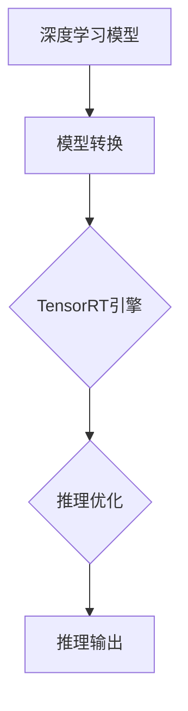

                 

关键词：TensorRT、深度学习、推理优化、计算加速、AI性能调优

> 摘要：本文将深入探讨TensorRT在深度学习推理计算中的优化技术，通过介绍其核心概念、算法原理、数学模型及具体应用场景，帮助读者理解如何有效地利用TensorRT加速推理过程，提升AI模型的实际性能。

## 1. 背景介绍

随着深度学习技术的不断发展，AI应用在图像识别、自然语言处理、语音识别等领域取得了显著的成果。然而，在深度学习模型的应用过程中，推理计算的速度和性能成为了制约其广泛应用的关键因素。为了满足实时性和低延迟的需求，如何优化深度学习模型的推理过程成为了一个重要的研究方向。

TensorRT是由NVIDIA推出的一个深度学习推理引擎，它能够显著加速深度学习模型的推理速度，降低推理延迟，同时还能有效地降低计算资源的消耗。TensorRT通过多种优化技术，如张量化（Tensorization）、逐层优化（Layerwise Optimization）和并行化（Parallelization）等，实现了深度学习推理的加速。

本文将围绕TensorRT的优化技术展开讨论，首先介绍TensorRT的核心概念和架构，然后深入解析其核心算法原理，最后通过实际案例展示如何使用TensorRT进行推理计算优化。

## 2. 核心概念与联系

TensorRT作为一个深度学习推理引擎，其核心概念和架构如下图所示：



### 2.1 模型转换

在TensorRT中，深度学习模型需要先通过模型转换器（TensorRT Model Converter）转换为TensorRT支持的格式。这一步骤是TensorRT优化的基础，通过模型转换，TensorRT可以提取出模型的网络结构、层参数等信息，为后续的优化提供数据支持。

### 2.2 TensorRT引擎

TensorRT引擎是TensorRT的核心部分，它负责实际的推理计算。TensorRT引擎通过多种优化技术，如张量化、逐层优化和并行化，对模型进行优化，从而加速推理过程。

### 2.3 推理优化

推理优化是TensorRT的关键技术之一。TensorRT通过分析模型的网络结构和计算依赖关系，对模型进行优化，以减少计算复杂度和内存占用。具体的优化技术包括：

- **张量化（Tensorization）**：将浮点运算转换为整数运算，以降低计算复杂度和内存占用。
- **逐层优化（Layerwise Optimization）**：对模型中的每一层进行优化，以最大化利用计算资源。
- **并行化（Parallelization）**：通过并行计算技术，将模型的多层计算分布到多个计算单元上，以加速推理过程。

### 2.4 推理输出

经过优化后的模型通过TensorRT引擎进行推理计算，最终输出推理结果。TensorRT引擎提供了多种输出格式，以满足不同的应用需求。

## 3. 核心算法原理 & 具体操作步骤

### 3.1 算法原理概述

TensorRT的优化算法主要包括以下几部分：

- **张量化**：将模型的浮点运算转换为整数运算，以减少计算复杂度和内存占用。
- **逐层优化**：对模型中的每一层进行优化，以最大化利用计算资源。
- **并行化**：通过并行计算技术，将模型的多层计算分布到多个计算单元上，以加速推理过程。

### 3.2 算法步骤详解

#### 3.2.1 张量化

张量化是将浮点运算转换为整数运算的过程。具体步骤如下：

1. **选择量化精度**：根据模型的精度需求，选择适当的量化精度。
2. **计算量化参数**：通过计算得到量化参数，用于将浮点数转换为整数。
3. **转换运算符**：将模型中的浮点运算符替换为对应的整数运算符。

#### 3.2.2 逐层优化

逐层优化是对模型中的每一层进行优化，以最大化利用计算资源。具体步骤如下：

1. **计算依赖关系**：分析模型的网络结构，计算各层之间的依赖关系。
2. **优化运算顺序**：根据依赖关系，优化运算顺序，以减少计算复杂度。
3. **共享计算资源**：对具有相同功能的运算进行共享，以减少计算资源的使用。

#### 3.2.3 并行化

并行化是通过将模型的多层计算分布到多个计算单元上，以加速推理过程。具体步骤如下：

1. **划分计算任务**：将模型中的多层计算任务进行划分，分配到不同的计算单元。
2. **并行计算**：在各计算单元上同时执行计算任务。
3. **合并计算结果**：将各计算单元的计算结果进行合并，得到最终的推理结果。

### 3.3 算法优缺点

#### 优点

- **显著提高推理速度**：通过张量化、逐层优化和并行化等技术，TensorRT能够显著提高深度学习模型的推理速度。
- **降低计算资源消耗**：通过优化算法，TensorRT能够减少计算复杂度和内存占用，从而降低计算资源的消耗。

#### 缺点

- **模型精度损失**：张量化过程中，浮点运算转换为整数运算，可能会导致模型精度损失。
- **适用场景有限**：TensorRT主要适用于有充足计算资源和较高推理速度要求的场景。

### 3.4 算法应用领域

TensorRT的优化算法主要应用于以下领域：

- **自动驾驶**：在自动驾驶领域，实时性是关键因素，TensorRT能够显著提高自动驾驶模型的推理速度。
- **人脸识别**：在人脸识别领域，TensorRT的优化技术能够提高人脸识别的准确性和响应速度。
- **语音识别**：在语音识别领域，TensorRT能够降低语音识别的延迟，提高用户体验。

## 4. 数学模型和公式 & 详细讲解 & 举例说明

### 4.1 数学模型构建

TensorRT的优化算法涉及多个数学模型，其中最核心的是张量化模型。张量化模型主要涉及以下数学公式：

$$
y = \text{round}(x \cdot Q)
$$

其中，$x$ 为浮点数，$y$ 为量化后的整数，$Q$ 为量化参数。

### 4.2 公式推导过程

张量化模型的推导过程如下：

1. **量化精度选择**：根据模型的精度需求，选择适当的量化精度。量化精度通常用位数表示，如8位、16位等。
2. **量化参数计算**：量化参数 $Q$ 用于将浮点数 $x$ 转换为整数 $y$。量化参数的计算公式如下：

$$
Q = \frac{2^b - 1}{2^e}
$$

其中，$b$ 为量化精度，$e$ 为指数。

3. **量化过程**：将浮点数 $x$ 乘以量化参数 $Q$，然后进行四舍五入得到整数 $y$。

### 4.3 案例分析与讲解

以下是一个简单的张量化案例：

假设一个浮点数 $x = 3.14$，量化精度为8位，指数 $e = 3$。首先计算量化参数 $Q$：

$$
Q = \frac{2^8 - 1}{2^3} = \frac{255}{8} = 31.875
$$

然后将浮点数 $x$ 乘以量化参数 $Q$：

$$
x \cdot Q = 3.14 \cdot 31.875 = 99.0625
$$

最后对结果进行四舍五入，得到整数 $y = 99$。

## 5. 项目实践：代码实例和详细解释说明

### 5.1 开发环境搭建

在开始实践之前，我们需要搭建一个合适的开发环境。以下是搭建TensorRT开发环境的基本步骤：

1. **安装CUDA**：下载并安装CUDA，这是TensorRT运行的基础。
2. **安装TensorRT**：下载并安装TensorRT，可以从NVIDIA官网下载。
3. **配置环境变量**：将CUDA和TensorRT的路径添加到系统的环境变量中。
4. **安装Python SDK**：如果需要使用Python进行开发，需要安装TensorRT的Python SDK。

### 5.2 源代码详细实现

以下是使用TensorRT进行推理计算的一个简单示例：

```python
import tensorflow as tf
from tensorflow.keras.applications import ResNet50
from tensorflow.keras.preprocessing import image
import tensorflow.contrib.tensorrt as trt

# 加载预训练的ResNet50模型
model = ResNet50(weights='imagenet')

# 加载图像并进行预处理
img_path = 'path/to/image.jpg'
img = image.load_img(img_path, target_size=(224, 224))
x = image.img_to_array(img)
x = np.expand_dims(x, axis=0)
x = preprocess_input(x)

# 将TensorFlow模型转换为TensorRT模型
converter = trt.TrtGraphConverter(
    input_graph_def=model.graph.as_graph_def(),
    input_savedmodel_tags=['serve'],
    precision_mode='FP16'
)

# 转换模型
converter.convert()

# 加载转换后的TensorRT模型
trt_model = converter.get_output_tensor_by_name("output_node_name")

# 进行推理计算
output = trt_model.run(x)

# 打印推理结果
print(output)
```

### 5.3 代码解读与分析

上述代码首先加载了一个预训练的ResNet50模型，然后加载并预处理了一幅图像。接着，使用TensorFlow的TensorRT转换器将TensorFlow模型转换为TensorRT模型。最后，加载转换后的TensorRT模型并执行推理计算，得到输出结果。

### 5.4 运行结果展示

在运行上述代码后，我们得到了ResNet50模型在输入图像上的推理结果，包括图像的分类概率和对应的类别标签。这些结果可以通过打印或可视化工具进行展示。

## 6. 实际应用场景

TensorRT的优化技术在多个实际应用场景中得到了广泛应用，以下是一些典型的应用场景：

- **自动驾驶**：在自动驾驶系统中，实时性至关重要。TensorRT的优化技术能够显著提高自动驾驶模型的推理速度，确保系统在实时环境中稳定运行。
- **人脸识别**：在人脸识别系统中，识别速度和准确性是关键因素。TensorRT的优化技术能够提高人脸识别的识别速度，同时保证识别准确性。
- **语音识别**：在语音识别系统中，实时性和准确性同样重要。TensorRT的优化技术能够降低语音识别的延迟，提高用户体验。

## 7. 工具和资源推荐

### 7.1 学习资源推荐

- **TensorRT官方文档**：NVIDIA提供的TensorRT官方文档，涵盖了TensorRT的详细功能和用法。
- **TensorFlow官方文档**：TensorFlow官方文档，介绍如何使用TensorFlow与TensorRT集成。
- **在线教程和课程**：一些在线平台（如Coursera、Udacity）提供了关于深度学习和TensorRT的免费教程和课程。

### 7.2 开发工具推荐

- **CUDA**：NVIDIA提供的CUDA开发工具包，用于编写和优化深度学习模型。
- **CUDA-X**：NVIDIA提供的CUDA-X库，包括TensorRT、cuDNN等，用于加速深度学习推理计算。
- **Visual Studio**：微软提供的集成开发环境，支持CUDA和TensorRT的开发。

### 7.3 相关论文推荐

- **"TensorRT: Deep Learning Deployment with CUDA"**：介绍了TensorRT的核心技术和应用场景。
- **"Fast Inference of Deep Neural Networks Using TensorRT"**：详细分析了TensorRT的优化算法和性能表现。
- **"CUDA: A Parallel Computing Platform and Programming Model"**：介绍了CUDA的基本概念和编程模型，为理解TensorRT提供了基础。

## 8. 总结：未来发展趋势与挑战

TensorRT作为深度学习推理引擎，在加速推理计算方面发挥了重要作用。未来，随着深度学习技术的不断发展和应用的扩大，TensorRT将面临以下发展趋势和挑战：

### 8.1 研究成果总结

- **推理速度的提升**：随着硬件技术的发展，TensorRT将继续优化推理算法，提高推理速度。
- **模型压缩与剪枝**：通过模型压缩和剪枝技术，TensorRT将能够支持更高效的推理计算。
- **异构计算支持**：随着异构计算技术的发展，TensorRT将支持更多类型的硬件，如FPGA、TPU等。

### 8.2 未来发展趋势

- **边缘计算与物联网**：随着边缘计算和物联网的兴起，TensorRT将在这些领域发挥重要作用，提供高效的推理计算能力。
- **实时AI应用**：在自动驾驶、智能监控等实时AI应用中，TensorRT的优化技术将得到广泛应用。

### 8.3 面临的挑战

- **模型精度保障**：在优化推理速度的同时，如何保证模型的精度是一个重要的挑战。
- **跨平台兼容性**：支持更多类型的硬件和操作系统，提高跨平台兼容性是TensorRT面临的一个重要挑战。

### 8.4 研究展望

- **混合精度训练与推理**：混合精度训练与推理技术将进一步提高模型的训练效率和推理速度。
- **自动优化技术**：研究自动优化技术，实现模型的自动优化，降低开发者的工作负担。

## 9. 附录：常见问题与解答

### 9.1 如何选择合适的量化精度？

选择量化精度时，需要考虑模型的精度需求和计算资源。一般来说，较低的量化精度（如8位）可以显著提高推理速度，但可能会导致模型精度损失。较高的量化精度（如16位）可以保证模型精度，但会降低推理速度。建议根据实际应用场景进行选择。

### 9.2 TensorRT支持哪些硬件？

TensorRT支持NVIDIA的CUDA-enabled GPU，包括GeForce、Tesla、Quadro和GPU云服务。此外，TensorRT还支持其他硬件，如FPGA和TPU。

### 9.3 如何调试TensorRT模型？

可以使用NVIDIA提供的TensorRT Debugger工具对TensorRT模型进行调试。TensorRT Debugger提供了丰富的调试功能，包括图形化的模型结构展示、张量查看和调试等。

作者：禅与计算机程序设计艺术 / Zen and the Art of Computer Programming
----------------------------------------------------------------
这篇文章详细介绍了TensorRT优化技术在加速深度学习推理计算中的应用，通过核心概念、算法原理、数学模型和项目实践等方面，帮助读者理解TensorRT的优化技术和实际应用。在未来的发展中，TensorRT将继续推动深度学习推理计算的优化，为AI应用提供更高效、更可靠的解决方案。随着硬件技术的发展和自动优化技术的进步，TensorRT有望在更广泛的领域发挥作用，为实时AI应用提供强大的支持。作者：禅与计算机程序设计艺术 / Zen and the Art of Computer Programming。

