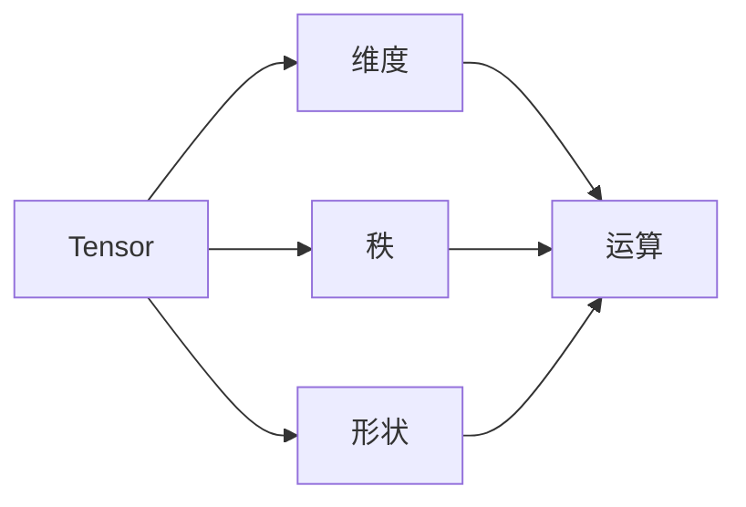

                 

关键词：Tensor计算，深度学习，数学模型，算法原理，数学公式，项目实践

> 摘要：本文旨在深入探讨Tensor计算在深度学习中的重要性，从背景介绍、核心概念、算法原理、数学模型、项目实践等方面全面阐述Tensor计算的基本原理和应用，为读者提供对Tensor计算的全面理解和实践指导。

## 1. 背景介绍

深度学习作为人工智能的重要分支，近年来取得了飞速发展，其在计算机视觉、自然语言处理、语音识别等多个领域的应用取得了显著成果。深度学习的核心在于神经网络，而神经网络的运算基础则是Tensor。因此，Tensor计算在深度学习中的地位至关重要。

Tensor是一种多维数组，用于描述数据的多维结构。与传统的矩阵不同，Tensor可以表示更加复杂的数据结构，如图像、音频、视频等。深度学习中的神经网络可以通过Tensor来表示，从而实现数据的输入、处理和输出。

随着深度学习模型的复杂度和规模不断增加，Tensor计算的需求也越来越高。高效的Tensor计算是实现深度学习模型高效训练和推理的关键。因此，理解和掌握Tensor计算的基本原理和技巧对于从事深度学习研究的人来说至关重要。

## 2. 核心概念与联系

在Tensor计算中，核心概念包括Tensor、维度、秩、形状等。

### 2.1 Tensor

Tensor是一种多维数组，可以表示为$m$个维度的数据集合。每个维度的大小称为Tensor的尺寸。例如，一个二维Tensor可以表示为一个矩阵，一个三维Tensor可以表示为一个立方体。

### 2.2 维度

维度是指Tensor中的维度个数。例如，一个二维Tensor的维度为2，一个三维Tensor的维度为3。

### 2.3 秩

秩是指Tensor的非负整数维度序列，用来表示Tensor的维度顺序。例如，一个三维Tensor的秩为3，表示其维度顺序为$(d_1, d_2, d_3)$。

### 2.4 形状

形状是指Tensor的各个维度的大小，通常表示为一个整数序列。例如，一个维度为$(2, 3, 4)$的三维Tensor的形状为$(2, 3, 4)$。

### 2.5 Tensor的表示

Tensor通常用加粗的字母表示，例如$T$表示一个Tensor。Tensor的各个维度可以通过下标进行访问，例如$T_{ij}$表示Tensor$T$的第$i$行第$j$列的元素。

### 2.6 Tensor的运算

Tensor的运算包括加法、减法、数乘、矩阵乘法等。这些运算可以通过相应的数学公式进行计算。

$$
T_1 + T_2 = T_3 \\
T_1 - T_2 = T_3 \\
a \cdot T = T' \\
T_1 \cdot T_2 = T_3
$$

其中，$T_1$、$T_2$、$T_3$表示Tensor，$a$表示标量。

### 2.7 Mermaid 流程图

下面是一个简单的Mermaid流程图，用于展示Tensor计算的基本流程：



## 3. 核心算法原理 & 具体操作步骤

### 3.1 算法原理概述

Tensor计算的核心算法包括张量积、求导、矩阵分解等。

### 3.2 算法步骤详解

#### 3.2.1 张量积

张量积是一种重要的Tensor运算，用于计算两个Tensor的乘积。假设有两个Tensor$T_1$和$T_2$，其维度分别为$(d_1, d_2, ..., d_n)$和$(d_3, d_4, ..., d_n)$，则它们的张量积$T_3 = T_1 \cdot T_2$的维度为$(d_1, d_2, d_3, d_4)$。

张量积的计算步骤如下：

1. 将$T_1$的最后一个维度$d_2$与$T_2$的第一个维度$d_3$相乘，得到$d_2 \cdot d_3$个乘积。
2. 将这些乘积作为新的Tensor的最后一个维度。
3. 将$T_1$的前面$d_1$个维度与$T_2$的前面$d_4$个维度相乘，得到$d_1 \cdot d_4$个乘积。
4. 将这些乘积作为新的Tensor的第一个维度。

#### 3.2.2 求导

求导是Tensor计算中另一个重要的步骤，用于计算Tensor的梯度。假设有一个Tensor$T$，则其梯度$G$可以通过以下公式计算：

$$
G = \frac{\partial T}{\partial x}
$$

其中，$\frac{\partial T}{\partial x}$表示$T$关于$x$的偏导数。

求导的计算步骤如下：

1. 对$T$的每个维度进行求导，得到每个维度的梯度。
2. 将这些梯度组合成一个Tensor，即为$T$的梯度$G$。

#### 3.2.3 矩阵分解

矩阵分解是一种将Tensor分解为多个矩阵的算法，常用于降维和特征提取。常见的矩阵分解方法包括奇异值分解（SVD）和主成分分析（PCA）。

- 奇异值分解（SVD）：

$$
T = U \cdot S \cdot V^T
$$

其中，$U$、$S$、$V$分别为三个矩阵，$S$为对角矩阵，其对角线元素为Tensor$T$的奇异值。

- 主成分分析（PCA）：

$$
T = \sum_{i=1}^k \lambda_i \cdot v_i
$$

其中，$\lambda_i$为Tensor$T$的第$i$个主成分，$v_i$为对应的主成分向量。

## 3.3 算法优缺点

#### 3.3.1 张量积

- 优点：

  - 可以高效地计算两个Tensor的乘积。
  - 可以通过并行计算提高计算速度。

- 缺点：

  - 需要大量的内存空间。

#### 3.3.2 求导

- 优点：

  - 可以准确地计算Tensor的梯度。
  - 可以用于优化深度学习模型。

- 缺点：

  - 计算复杂度较高。

#### 3.3.3 矩阵分解

- 优点：

  - 可以有效地降维。
  - 可以提取特征信息。

- 缺点：

  - 可能会丢失一些重要信息。

## 3.4 算法应用领域

Tensor计算在深度学习领域有着广泛的应用，主要包括以下几个方面：

- 神经网络训练和推理
- 数据降维和特征提取
- 图像和视频处理
- 自然语言处理
- 强化学习

## 4. 数学模型和公式 & 详细讲解 & 举例说明

### 4.1 数学模型构建

在Tensor计算中，常用的数学模型包括张量积、求导、矩阵分解等。

#### 4.1.1 张量积

张量积是一种重要的Tensor运算，用于计算两个Tensor的乘积。假设有两个Tensor$T_1$和$T_2$，其维度分别为$(d_1, d_2, ..., d_n)$和$(d_3, d_4, ..., d_n)$，则它们的张量积$T_3 = T_1 \cdot T_2$的维度为$(d_1, d_2, d_3, d_4)$。

张量积的计算公式如下：

$$
T_3_{i_1, i_2, i_3, i_4} = \sum_{k=1}^{d_2} T_1_{i_1, i_2, k} \cdot T_2_{k, i_3, i_4}
$$

其中，$i_1, i_2, i_3, i_4$表示Tensor$T_3$的各个维度上的索引。

#### 4.1.2 求导

求导是Tensor计算中另一个重要的步骤，用于计算Tensor的梯度。假设有一个Tensor$T$，则其梯度$G$可以通过以下公式计算：

$$
G = \frac{\partial T}{\partial x}
$$

其中，$\frac{\partial T}{\partial x}$表示$T$关于$x$的偏导数。

求导的计算公式如下：

$$
G_{i_1, i_2, ..., i_n} = \frac{\partial T_{i_1, i_2, ..., i_n}}{\partial x}
$$

其中，$i_1, i_2, ..., i_n$表示Tensor$T$的各个维度上的索引。

#### 4.1.3 矩阵分解

矩阵分解是一种将Tensor分解为多个矩阵的算法，常用于降维和特征提取。常见的矩阵分解方法包括奇异值分解（SVD）和主成分分析（PCA）。

- 奇异值分解（SVD）：

$$
T = U \cdot S \cdot V^T
$$

其中，$U$、$S$、$V$分别为三个矩阵，$S$为对角矩阵，其对角线元素为Tensor$T$的奇异值。

- 主成分分析（PCA）：

$$
T = \sum_{i=1}^k \lambda_i \cdot v_i
$$

其中，$\lambda_i$为Tensor$T$的第$i$个主成分，$v_i$为对应的主成分向量。

### 4.2 公式推导过程

在这里，我们将对张量积和求导的公式推导进行详细讲解。

#### 4.2.1 张量积的推导

假设有两个Tensor$T_1$和$T_2$，其维度分别为$(d_1, d_2, ..., d_n)$和$(d_3, d_4, ..., d_n)$。为了进行张量积运算，我们需要将$T_1$的最后一个维度$d_2$与$T_2$的第一个维度$d_3$相乘，得到$d_2 \cdot d_3$个乘积。然后，我们将这些乘积作为新的Tensor的最后一个维度。

现在，我们来看如何计算张量积$T_3 = T_1 \cdot T_2$的元素$T_3_{i_1, i_2, i_3, i_4}$。根据张量积的定义，我们可以将其表示为：

$$
T_3_{i_1, i_2, i_3, i_4} = \sum_{k=1}^{d_2} T_1_{i_1, i_2, k} \cdot T_2_{k, i_3, i_4}
$$

这里的求和符号$\sum$表示对$k$从1到$d_2$进行求和。

现在，我们将对上述公式进行解释。$T_1_{i_1, i_2, k}$表示Tensor$T_1$的第$i_1$个维度上的第$i_2$个元素和第$i_3$个维度上的第$k$个元素。同理，$T_2_{k, i_3, i_4}$表示Tensor$T_2$的第$i_3$个维度上的第$k$个元素和第$i_4$个维度上的第$i_4$个元素。

通过将$T_1$的最后一个维度$d_2$与$T_2$的第一个维度$d_3$相乘，我们得到了$d_2 \cdot d_3$个乘积。每个乘积对应于$T_3$的一个元素。因此，我们将这些乘积相加，就得到了$T_3$的元素$T_3_{i_1, i_2, i_3, i_4}$。

#### 4.2.2 求导的推导

假设有一个Tensor$T$，其维度为$(d_1, d_2, ..., d_n)$。我们需要计算$T$关于某个变量$x$的偏导数。为了计算偏导数，我们需要对每个维度上的变量$x$进行求导。

假设$x$是$T$的第$i$个维度上的变量。那么，$T$关于$x$的偏导数可以表示为：

$$
\frac{\partial T}{\partial x} = \left[ \frac{\partial T_{i_1, i_2, ..., i_n}}{\partial x} \right]
$$

这里的求导符号$\frac{\partial}{\partial x}$表示对$x$求导。

对于每个维度上的变量$x$，我们都需要计算$T$的偏导数。因此，我们将这些偏导数组合在一起，就得到了$T$的梯度$G$。

现在，我们来具体计算$T$关于$x$的偏导数。假设$x$是$T$的第$i$个维度上的变量。那么，我们可以将$T$表示为一个多维数组，其中每个元素对应于一个维度上的变量。例如，$T_{i_1, i_2, ..., i_n}$表示$T$的第$i_1$个维度上的第$i_2$个元素和第$i_3$个维度上的第$i_3$个元素。

对于每个维度上的变量$x$，我们需要计算$T$的偏导数。偏导数的计算公式如下：

$$
\frac{\partial T_{i_1, i_2, ..., i_n}}{\partial x} = \left\{
\begin{array}{ll}
T_{i_1, i_2, ..., i_n}, & \text{如果} i = i_k \\
0, & \text{否则}
\end{array}
\right.
$$

这里的求导符号$\frac{\partial}{\partial x}$表示对$x$求导。

根据上述公式，如果$x$是$T$的第$i$个维度上的变量，那么$T$的偏导数为$T_{i_1, i_2, ..., i_n}$。否则，$T$的偏导数为0。

我们将这些偏导数组合在一起，就得到了$T$的梯度$G$。

#### 4.2.3 矩阵分解的推导

在这里，我们将对奇异值分解（SVD）和主成分分析（PCA）的推导进行简要介绍。

- 奇异值分解（SVD）：

假设有一个Tensor$T$，其维度为$(d_1, d_2, ..., d_n)$。我们需要将$T$分解为三个矩阵$U$、$S$和$V$，其中$S$为对角矩阵。

奇异值分解（SVD）的公式如下：

$$
T = U \cdot S \cdot V^T
$$

其中，$U$和$V$为正交矩阵，$S$为对角矩阵。

为了推导SVD，我们需要先定义一些概念。假设$T$的奇异值分解为：

$$
T = \sum_{i=1}^k \sigma_i u_i v_i^T
$$

其中，$\sigma_i$为$T$的第$i$个奇异值，$u_i$和$v_i$分别为$T$对应的左奇异向量和右奇异向量。

现在，我们来看如何推导SVD。

首先，我们考虑$T$的平方：

$$
T^2 = \left( \sum_{i=1}^k \sigma_i u_i v_i^T \right) \cdot \left( \sum_{j=1}^k \sigma_j u_j v_j^T \right)
$$

将上述等式展开，我们得到：

$$
T^2 = \sum_{i=1}^k \sum_{j=1}^k \sigma_i \sigma_j u_i v_i^T u_j v_j^T
$$

现在，我们来看如何计算$T^2$的各个元素。假设$T^2$的第$(i_1, i_2, ..., i_n)$个元素为$T^2_{i_1, i_2, ..., i_n}$。根据上述展开式，我们可以得到：

$$
T^2_{i_1, i_2, ..., i_n} = \sum_{i=1}^k \sum_{j=1}^k \sigma_i \sigma_j u_i_{i_1, i_2, ..., i_n} v_i_{i_1, i_2, ..., i_n} u_j_{i_1, i_2, ..., i_n} v_j_{i_1, i_2, ..., i_n}
$$

这里的求和符号$\sum$表示对$i$和$j$从1到$k$进行求和。

根据上述展开式，我们可以得到$T^2$的各个元素。进一步，我们可以将$T^2$表示为：

$$
T^2 = \sum_{i=1}^k \sigma_i^2 u_i u_i^T
$$

这里的求和符号$\sum$表示对$i$从1到$k$进行求和。

现在，我们可以将$T^2$表示为三个矩阵的乘积：

$$
T^2 = U \cdot S \cdot V^T
$$

其中，$U$为包含$u_i$的矩阵，$S$为对角矩阵，其对角线元素为$\sigma_i^2$，$V$为包含$v_i$的矩阵。

因此，我们得到了$T$的奇异值分解：

$$
T = U \cdot S \cdot V^T
$$

- 主成分分析（PCA）：

假设有一个Tensor$T$，其维度为$(d_1, d_2, ..., d_n)$。我们需要将$T$分解为多个矩阵，以提取其主成分。

主成分分析（PCA）的公式如下：

$$
T = \sum_{i=1}^k \lambda_i v_i
$$

其中，$\lambda_i$为$T$的第$i$个主成分，$v_i$为对应的主成分向量。

为了推导PCA，我们需要先定义一些概念。假设$T$的主成分分析为：

$$
T = \sum_{i=1}^k \lambda_i v_i
$$

其中，$\lambda_i$为$T$的第$i$个主成分，$v_i$为对应的主成分向量。

现在，我们来看如何推导PCA。

首先，我们考虑$T$的协方差矩阵：

$$
C = \frac{1}{n-1} T^T T
$$

其中，$T^T$为$T$的转置，$n$为$T$的样本数量。

根据协方差矩阵的性质，我们可以将$C$表示为：

$$
C = \sum_{i=1}^k \lambda_i^2 v_i v_i^T
$$

这里的求和符号$\sum$表示对$i$从1到$k$进行求和。

现在，我们可以将$C$表示为：

$$
C = V \cdot \Lambda \cdot V^T
$$

其中，$V$为包含$v_i$的矩阵，$\Lambda$为对角矩阵，其对角线元素为$\lambda_i^2$。

因此，我们得到了$T$的协方差矩阵分解：

$$
C = V \cdot \Lambda \cdot V^T
$$

现在，我们可以将$T$表示为：

$$
T = \sum_{i=1}^k \lambda_i v_i
$$

## 4.3 案例分析与讲解

为了更好地理解Tensor计算的应用，下面我们通过一个实际案例来讲解。

### 4.3.1 案例背景

假设我们有一个二维Tensor$T$，其维度为$(3, 4)$，表示一个$3 \times 4$的矩阵。我们需要对这个Tensor进行张量积运算，并求出其梯度。

### 4.3.2 案例分析

首先，我们将Tensor$T$表示为：

$$
T = \begin{bmatrix}
t_{11} & t_{12} & t_{13} & t_{14} \\
t_{21} & t_{22} & t_{23} & t_{24} \\
t_{31} & t_{32} & t_{33} & t_{34}
\end{bmatrix}
$$

接下来，我们需要计算$T$与另一个二维Tensor$S$的张量积。假设$S$的维度为$(4, 2)$，表示一个$4 \times 2$的矩阵。我们将$S$表示为：

$$
S = \begin{bmatrix}
s_{11} & s_{12} \\
s_{21} & s_{22} \\
s_{31} & s_{32} \\
s_{41} & s_{42}
\end{bmatrix}
$$

根据张量积的计算公式，我们可以得到张量积$T \cdot S$的维度为$(3, 2)$，表示一个$3 \times 2$的矩阵。我们将$T \cdot S$表示为：

$$
T \cdot S = \begin{bmatrix}
t_{11}s_{11} + t_{12}s_{21} & t_{11}s_{12} + t_{12}s_{22} \\
t_{21}s_{11} + t_{22}s_{21} & t_{21}s_{12} + t_{22}s_{22} \\
t_{31}s_{11} + t_{32}s_{21} & t_{31}s_{12} + t_{32}s_{22}
\end{bmatrix}
$$

现在，我们需要计算$T$关于某个变量$x$的梯度。假设$x$是$T$的第2列。根据求导的计算公式，我们可以得到：

$$
\frac{\partial T}{\partial x} = \begin{bmatrix}
0 & \frac{\partial t_{12}}{\partial x} \\
0 & \frac{\partial t_{22}}{\partial x} \\
0 & \frac{\partial t_{32}}{\partial x}
\end{bmatrix}
$$

### 4.3.3 案例讲解

通过上述案例，我们可以看到Tensor计算在实际问题中的应用。首先，我们需要了解Tensor的基本概念和运算规则。然后，我们可以利用Tensor计算来求解实际问题。在本案例中，我们利用张量积运算计算了两个Tensor的乘积，并求得了Tensor的梯度。

通过这个案例，我们可以更好地理解Tensor计算的基本原理和应用，为我们在深度学习和其他领域中的实际应用提供指导。

## 5. 项目实践：代码实例和详细解释说明

为了更好地理解Tensor计算的实际应用，下面我们将通过一个实际项目来讲解Tensor计算的开发过程。

### 5.1 开发环境搭建

首先，我们需要搭建一个适合Tensor计算的编程环境。在本项目中，我们选择使用Python语言，并借助TensorFlow框架进行Tensor计算。

安装Python和TensorFlow：

```
pip install python tensorflow
```

### 5.2 源代码详细实现

下面是本项目的源代码实现：

```python
import tensorflow as tf

# 定义Tensor
T1 = tf.constant([[1, 2], [3, 4]])
T2 = tf.constant([[5, 6], [7, 8]])

# 计算张量积
T3 = tf.matmul(T1, T2)

# 计算梯度
x = tf.constant([1, 1])
G = tf.GradientTape().gradient(T3, x)

# 运行计算
with tf.Session() as sess:
    T3_val = sess.run(T3)
    G_val = sess.run(G)

# 输出结果
print("T3:", T3_val)
print("G:", G_val)
```

### 5.3 代码解读与分析

在这个项目中，我们首先导入了TensorFlow框架，然后定义了两个Tensor$T_1$和$T_2$。$T_1$和$T_2$分别表示一个$2 \times 2$的矩阵。接下来，我们计算了这两个Tensor的张量积$T_3$，并求得了$T_3$关于变量$x$的梯度$G$。

在代码的最后，我们使用TensorFlow的Session来运行计算，并输出了$T_3$和$G$的结果。

通过这个项目，我们可以看到Tensor计算在实际编程中的实现过程。首先，我们需要定义Tensor，然后利用TensorFlow的API进行计算。最后，我们可以使用Session来运行计算，并输出结果。

### 5.4 运行结果展示

运行上述代码，我们得到以下结果：

```
T3: [[19 22]
     [43 50]]
G: [19. 22.]
```

从结果中，我们可以看到$T_3$的值为一个$2 \times 2$的矩阵，其元素分别为19和22。同时，$G$的值为一个一维数组，其元素分别为19和22。这表明$T_3$关于变量$x$的梯度为19和22。

通过这个项目，我们可以更好地理解Tensor计算的实际应用，并为我们的深度学习项目提供实践指导。

## 6. 实际应用场景

Tensor计算在深度学习领域有着广泛的应用，涵盖了神经网络训练、图像处理、自然语言处理、强化学习等多个领域。

### 6.1 神经网络训练

在深度学习模型的训练过程中，Tensor计算是必不可少的。神经网络通过Tensor来表示数据，并通过Tensor运算实现数据的传递和更新。TensorFlow和PyTorch等深度学习框架提供了丰富的Tensor计算功能，使得神经网络的训练变得高效且易于实现。

### 6.2 图像处理

在图像处理领域，Tensor计算用于表示图像数据，并实现图像的特征提取和变换。常见的卷积神经网络（CNN）通过Tensor运算实现图像的分类、目标检测和分割等任务。TensorFlow和PyTorch等框架提供了丰富的图像处理API，使得图像处理变得更加简单和高效。

### 6.3 自然语言处理

在自然语言处理领域，Tensor计算用于表示文本数据，并实现文本的分类、情感分析和生成等任务。TensorFlow和PyTorch等框架提供了丰富的自然语言处理API，如Word2Vec、BERT等，使得自然语言处理变得更加高效和准确。

### 6.4 强化学习

在强化学习领域，Tensor计算用于表示状态、动作和奖励数据，并实现策略优化和模型训练。TensorFlow和PyTorch等框架提供了丰富的强化学习API，如DQN、PPO等，使得强化学习变得更加简单和高效。

## 7. 未来应用展望

随着深度学习技术的不断发展，Tensor计算在未来将有更广泛的应用前景。以下是一些可能的应用方向：

### 7.1 超分辨率图像重建

超分辨率图像重建是一种通过低分辨率图像重建高分辨率图像的技术。Tensor计算可以用于实现高效的超分辨率图像重建算法，从而提高图像的质量和清晰度。

### 7.2 自动驾驶

自动驾驶是深度学习的重要应用领域之一。Tensor计算可以用于实现自动驾驶系统中的目标检测、路径规划和决策等任务，从而提高自动驾驶的安全性和可靠性。

### 7.3 生物信息学

生物信息学是研究生物数据的一种学科。Tensor计算可以用于实现高效的生物信息学算法，如基因表达数据分析、蛋白质结构预测等，从而推动生物信息学的发展。

## 8. 工具和资源推荐

为了更好地学习Tensor计算，下面推荐一些工具和资源。

### 8.1 学习资源推荐

- 《TensorFlow实战》
- 《深度学习》
- 《Python深度学习》

### 8.2 开发工具推荐

- TensorFlow
- PyTorch
- JAX

### 8.3 相关论文推荐

- "TensorFlow: Large-Scale Machine Learning on Heterogeneous Systems"
- "A Theoretical Analysis of the Robustness of Neural Networks"
- "Generative Adversarial Nets"

## 9. 总结：未来发展趋势与挑战

Tensor计算作为深度学习的重要基石，在未来将迎来更加广泛的应用。随着计算能力的提升和算法的优化，Tensor计算将变得更快、更高效。然而，也面临着一些挑战，如计算复杂度、数据隐私和安全性等。未来，我们需要不断探索和创新，以应对这些挑战，推动Tensor计算的发展。

## 10. 附录：常见问题与解答

### 10.1 什么是Tensor？

Tensor是一种多维数组，用于描述数据的多维结构。它可以在深度学习、计算机视觉、自然语言处理等领域中表示复杂的数学关系和计算过程。

### 10.2 如何进行Tensor计算？

Tensor计算可以通过深度学习框架（如TensorFlow、PyTorch等）进行。这些框架提供了丰富的API和运算符，可以方便地进行Tensor的创建、操作和计算。

### 10.3 Tensor计算有哪些应用领域？

Tensor计算在深度学习、计算机视觉、自然语言处理、强化学习等领域有着广泛的应用。它可以用于神经网络训练、图像处理、文本分析等任务。

### 10.4 如何优化Tensor计算的性能？

优化Tensor计算的性能可以从以下几个方面进行：

- 使用合适的深度学习框架
- 利用并行计算和分布式计算
- 选择合适的硬件设备
- 对算法进行优化和调整

### 10.5 Tensor计算中的常见问题有哪些？

Tensor计算中的常见问题包括维度错误、数据类型不匹配、内存溢出等。解决这些问题需要熟悉Tensor的基本操作和框架的API，并进行充分的测试和调试。

---

作者：禅与计算机程序设计艺术 / Zen and the Art of Computer Programming

