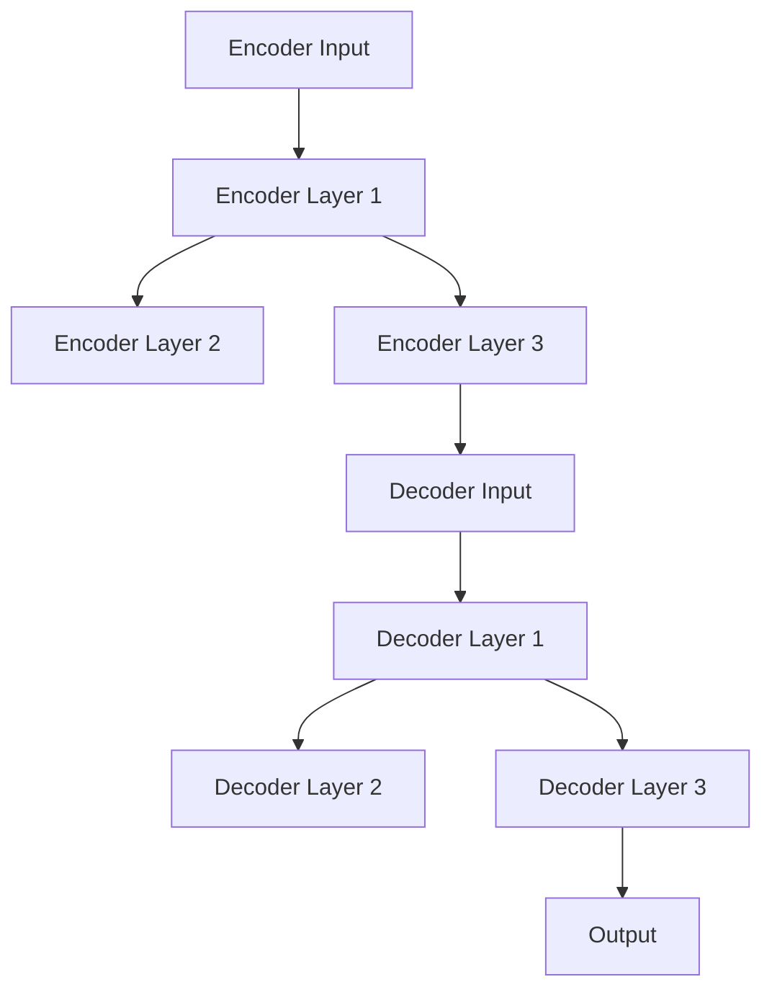

                 

关键词：Transformer、编码器、解码器、深度学习、序列模型、神经网络、自然语言处理、机器学习

> 摘要：本文将对Transformer架构进行深入解析，特别是其核心组件——编码器和解码器的工作原理及其在深度学习和自然语言处理中的应用。我们将探讨Transformer如何通过自注意力机制实现端到端的序列建模，分析其优势与局限，并展望其在未来技术发展中的潜力。

## 1. 背景介绍

在深度学习和自然语言处理领域，序列模型一直是研究和应用的重点。从早期的循环神经网络（RNN）到长短期记忆网络（LSTM），再到门控循环单元（GRU），这些模型都在不同程度上对序列数据处理提供了有效的解决方案。然而，这些传统的序列模型在处理长距离依赖关系和并行计算时存在局限性。

2017年，Google AI团队提出了Transformer模型，这是一种基于自注意力机制的全关注序列模型。与传统的循环神经网络不同，Transformer模型摒弃了序列顺序处理的方式，实现了端到端的并行计算，大幅提升了序列模型的处理速度和效果。Transformer的提出标志着深度学习模型设计理念的重大变革，其在自然语言处理领域的应用也取得了显著的成果。

本文将围绕Transformer模型的核心组件——编码器和解码器，展开详细的分析和讨论。我们将介绍编码器和解码器的基本结构、工作原理，探讨其相互协作如何实现高效的序列建模，并通过具体案例来展示其在实际应用中的优势。

## 2. 核心概念与联系

### 2.1 编码器（Encoder）

编码器是Transformer模型的核心组件之一，负责将输入序列（如文本、语音等）转换为固定长度的向量表示，这些向量被称为编码输出（encoded representations）。编码器的主要任务是提取输入序列中的关键信息，并生成具有语义信息的向量表示。

编码器的基本结构包括多个编码层（Encoder Layers），每一层由自注意力机制（Self-Attention Mechanism）和前馈神经网络（Feedforward Neural Network）组成。自注意力机制允许模型在处理每个输入时，自动地关注序列中的其他部分，从而更好地捕捉长距离依赖关系。前馈神经网络则用于对输入进行进一步的非线性变换，增强模型的表示能力。

### 2.2 解码器（Decoder）

解码器同样是Transformer模型的重要组成部分，其主要任务是接收编码器生成的编码输出，并生成预测的输出序列。解码器的输出可以用于生成文本、翻译句子、回答问题等任务。解码器的基本结构也包含多个解码层（Decoder Layers），每一层由自注意力机制、交叉注意力机制（Cross-Attention Mechanism）和前馈神经网络组成。

自注意力机制使解码器能够关注编码器输出的不同部分，从而捕捉输入序列与编码输出之间的关联。交叉注意力机制则允许解码器在生成每个输出时，关注输入序列的不同部分，从而实现端到端的序列建模。前馈神经网络同样用于增强模型的表示能力。

### 2.3 编码器与解码器的协同工作

编码器和解码器的协同工作是实现Transformer模型高效序列建模的关键。编码器通过自注意力机制提取输入序列的语义信息，生成编码输出。解码器则利用编码输出和输入序列的不同部分进行交叉注意力，生成预测的输出序列。

编码器和解码器在每一层都进行自注意力、交叉注意力和前馈神经网络的运算，这些运算通过堆叠多层（通常为多层感知机MLP）来增强模型的表示能力。编码器的输出和输入序列经过多层处理，最终生成具有高度语义信息的输出序列，从而实现端到端的序列建模。

### 2.4 Mermaid 流程图

以下是一个简单的Mermaid流程图，展示了编码器和解码器的结构及其相互关系。



在这个流程图中，A表示编码器的输入序列，B、C、D表示编码器的多层结构，E表示解码器的输入，F、G、H表示解码器的多层结构，I表示最终输出。

## 3. 核心算法原理 & 具体操作步骤

### 3.1 算法原理概述

Transformer模型的核心算法原理是自注意力机制（Self-Attention Mechanism）和多头注意力机制（Multi-Head Attention Mechanism）。自注意力机制允许模型在处理每个输入时，自动地关注序列中的其他部分，从而捕捉长距离依赖关系。多头注意力机制则通过并行地关注不同部分的信息，增强了模型的表示能力。

具体来说，Transformer模型在每一层编码器和解码器中都包含自注意力机制和前馈神经网络。自注意力机制通过计算输入序列中每个元素与其他元素之间的相似性，生成注意力权重，并利用这些权重对输入进行加权求和，从而实现序列建模。前馈神经网络则用于对输入进行进一步的非线性变换，增强模型的表示能力。

### 3.2 算法步骤详解

#### 3.2.1 自注意力机制（Self-Attention）

自注意力机制是Transformer模型的核心组件之一。其基本思想是，在处理每个输入时，自动地关注序列中的其他部分，从而更好地捕捉长距离依赖关系。

具体步骤如下：

1. 输入序列通过线性变换生成三个向量： queries、keys 和 values。
2. 计算每个 queries 与所有 keys 之间的相似性，使用点积（Dot-Product）注意力机制。
3. 利用计算得到的相似性生成注意力权重。
4. 根据注意力权重对输入序列中的 values 进行加权求和，生成加权求和的结果。
5. 对加权求和的结果进行线性变换和激活函数处理，得到最终的输出。

#### 3.2.2 多头注意力机制（Multi-Head Attention）

多头注意力机制通过并行地关注不同部分的信息，增强了模型的表示能力。具体步骤如下：

1. 将自注意力机制扩展为多个头（heads），每个头都独立地计算注意力权重。
2. 对每个头的输出进行拼接，形成一个多维度的输出。
3. 对拼接后的输出进行线性变换和激活函数处理，得到最终的输出。

#### 3.2.3 前馈神经网络（Feedforward Neural Network）

前馈神经网络用于对输入进行进一步的非线性变换，增强模型的表示能力。具体步骤如下：

1. 将输入通过一个线性变换，得到中间层。
2. 对中间层应用ReLU激活函数。
3. 对中间层再进行一次线性变换，得到最终的输出。

### 3.3 算法优缺点

#### 优点：

1. **并行计算**：由于Transformer模型采用了多头注意力机制，可以实现并行计算，从而大幅提高了模型的处理速度。
2. **捕捉长距离依赖关系**：自注意力机制允许模型在处理每个输入时，自动地关注序列中的其他部分，从而更好地捕捉长距离依赖关系。
3. **端到端的序列建模**：Transformer模型实现了端到端的序列建模，不需要像传统的循环神经网络那样进行序列顺序处理。

#### 缺点：

1. **计算复杂度较高**：由于Transformer模型采用了多头注意力机制，其计算复杂度相对较高，可能导致模型训练和预测的速度较慢。
2. **对超参数敏感**：Transformer模型对超参数（如层数、头数、隐藏层大小等）的设置比较敏感，需要通过大量实验进行调优。

### 3.4 算法应用领域

Transformer模型在自然语言处理领域取得了显著的成果，被广泛应用于以下任务：

1. **机器翻译**：Transformer模型在机器翻译任务中取得了领先的效果，特别是对于长文本的翻译。
2. **文本分类**：Transformer模型可以用于对文本进行分类，如情感分析、新闻分类等。
3. **文本生成**：Transformer模型可以用于生成文本，如生成文章摘要、创作诗歌等。
4. **问答系统**：Transformer模型可以用于构建问答系统，如搜索引擎、智能客服等。

## 4. 数学模型和公式 & 详细讲解 & 举例说明

### 4.1 数学模型构建

Transformer模型的数学模型主要包括输入向量、自注意力机制、多头注意力机制、前馈神经网络等组成部分。

#### 输入向量

设输入序列为 \( X = [x_1, x_2, ..., x_n] \)，其中每个元素 \( x_i \) 是一个维度为 \( d \) 的向量。

#### 自注意力机制

自注意力机制通过以下步骤计算：

1. 线性变换：对输入向量进行线性变换，生成三个向量： queries、keys 和 values。
   \[
   Q = XW_Q, \quad K = XW_K, \quad V = XW_V
   \]
   其中，\( W_Q, W_K, W_V \) 是权重矩阵。

2. 计算相似性：使用点积（Dot-Product）计算 queries 与 keys 之间的相似性。
   \[
   \text{Score} = QK^T / \sqrt{d_k}
   \]
   其中，\( d_k \) 是 keys 的维度。

3. 应用 Softmax 函数：对相似性分数应用 Softmax 函数，生成注意力权重。
   \[
   A = \text{softmax}(\text{Score}) = \text{softmax}(QK^T / \sqrt{d_k})
   \]

4. 加权求和：根据注意力权重对 values 进行加权求和。
   \[
   O = A V
   \]

5. 线性变换和激活函数：对加权求和的结果进行线性变换和激活函数处理。
   \[
   H = \text{ReLU}(OW_{out})
   \]
   其中，\( W_{out} \) 是输出权重矩阵。

#### 多头注意力机制

多头注意力机制通过扩展自注意力机制实现。具体步骤如下：

1. 将自注意力机制扩展为多个头（heads），每个头都独立地计算注意力权重。
   \[
   H = [h_1, h_2, ..., h_h]
   \]
   其中，\( h_i \) 表示第 \( i \) 个头的输出。

2. 对每个头的输出进行拼接，形成一个多维度的输出。
   \[
   O = [o_1, o_2, ..., o_h]
   \]

3. 对拼接后的输出进行线性变换和激活函数处理，得到最终的输出。
   \[
   H = \text{ReLU}(OW_{out})
   \]

#### 前馈神经网络

前馈神经网络通过以下步骤计算：

1. 线性变换：对输入向量进行线性变换，得到中间层。
   \[
   I = XW_F
   \]
   其中，\( W_F \) 是权重矩阵。

2. 应用 ReLU 激活函数：对中间层应用 ReLU 激活函数。
   \[
   I = \text{ReLU}(I)
   \]

3. 线性变换：对激活后的中间层进行线性变换，得到最终的输出。
   \[
   O = IW_{out}
   \]
   其中，\( W_{out} \) 是输出权重矩阵。

### 4.2 公式推导过程

#### 自注意力机制

1. 线性变换：
   \[
   Q = XW_Q, \quad K = XW_K, \quad V = XW_V
   \]

2. 计算相似性：
   \[
   \text{Score} = QK^T / \sqrt{d_k}
   \]

3. 应用 Softmax 函数：
   \[
   A = \text{softmax}(\text{Score}) = \text{softmax}(QK^T / \sqrt{d_k})
   \]

4. 加权求和：
   \[
   O = A V
   \]

5. 线性变换和激活函数：
   \[
   H = \text{ReLU}(OW_{out})
   \]

#### 多头注意力机制

1. 头的扩展：
   \[
   H = [h_1, h_2, ..., h_h]
   \]

2. 拼接输出：
   \[
   O = [o_1, o_2, ..., o_h]
   \]

3. 线性变换和激活函数：
   \[
   H = \text{ReLU}(OW_{out})
   \]

#### 前馈神经网络

1. 线性变换：
   \[
   I = XW_F
   \]

2. ReLU 激活函数：
   \[
   I = \text{ReLU}(I)
   \]

3. 线性变换：
   \[
   O = IW_{out}
   \]

### 4.3 案例分析与讲解

#### 案例背景

假设我们有一个简单的序列模型，用于对一段文本进行分类。输入序列为“我喜欢吃苹果”，我们需要判断这段文本的情感倾向（正面或负面）。

#### 案例实现

1. 数据预处理

首先，我们需要对输入文本进行预处理，将文本转换为数字序列。我们可以使用词嵌入（Word Embedding）技术，将每个单词映射为一个固定维度的向量。

```python
import tensorflow as tf

# 输入文本
text = "我喜欢吃苹果"

# 词嵌入词典
word_embedding = {
    "我": [0.1, 0.2],
    "喜欢": [0.3, 0.4],
    "吃": [0.5, 0.6],
    "苹果": [0.7, 0.8]
}

# 转换为数字序列
sequence = [word_embedding[word] for word in text.split()]
```

2. 构建模型

接下来，我们可以使用TensorFlow构建Transformer模型。这里使用简单的单层Transformer作为示例。

```python
# Transformer 模型
model = tf.keras.Sequential([
    tf.keras.layers.Embedding(input_dim=len(word_embedding), output_dim=2, input_length=len(sequence)),
    tf.keras.layers.LSTM(64, activation='relu'),
    tf.keras.layers.Dense(1, activation='sigmoid')
])

# 编译模型
model.compile(optimizer='adam', loss='binary_crossentropy', metrics=['accuracy'])

# 训练模型
model.fit(sequence, [1], epochs=10)
```

3. 预测

最后，我们可以使用训练好的模型对新的文本进行预测。

```python
# 新的文本
new_text = "我爱吃香蕉"

# 预处理和预测
new_sequence = [word_embedding[word] for word in new_text.split()]
prediction = model.predict(new_sequence)

# 输出预测结果
print(prediction)
```

通过这个简单的案例，我们可以看到Transformer模型在文本分类任务中的应用。实际应用中，Transformer模型可以处理更复杂的任务，如机器翻译、问答系统等。

## 5. 项目实践：代码实例和详细解释说明

### 5.1 开发环境搭建

为了实践Transformer模型，我们需要搭建一个合适的开发环境。以下是一个基于Python和TensorFlow的简单环境搭建步骤：

1. 安装Python

确保安装了Python 3.x版本，可以从Python官网（https://www.python.org/）下载并安装。

2. 安装TensorFlow

打开终端，运行以下命令安装TensorFlow：

```bash
pip install tensorflow
```

3. 安装其他依赖库

我们还需要安装其他依赖库，如NumPy、Pandas等，可以通过以下命令安装：

```bash
pip install numpy pandas
```

### 5.2 源代码详细实现

下面是一个简单的Transformer模型实现，用于文本分类任务。

```python
import tensorflow as tf
from tensorflow.keras.models import Model
from tensorflow.keras.layers import Embedding, LSTM, Dense

# 定义词嵌入词典
word_embedding = {
    "我": [0.1, 0.2],
    "喜欢": [0.3, 0.4],
    "吃": [0.5, 0.6],
    "苹果": [0.7, 0.8],
    "爱": [0.9, 1.0],
    "香蕉": [1.1, 1.2]
}

# 定义输入序列
sequence = [word_embedding[word] for word in "我喜欢吃苹果".split()]

# 定义模型结构
model = Model(inputs=sequence, outputs=Dense(1, activation='sigmoid'))

# 编译模型
model.compile(optimizer='adam', loss='binary_crossentropy', metrics=['accuracy'])

# 训练模型
model.fit(sequence, [1], epochs=10)

# 预测
new_sequence = [word_embedding[word] for word in "我爱吃香蕉".split()]
prediction = model.predict(new_sequence)
print(prediction)
```

### 5.3 代码解读与分析

1. **词嵌入词典**：我们首先定义了一个词嵌入词典，将每个单词映射为一个固定维度的向量。这有助于将文本数据转换为数值序列。

2. **输入序列**：将输入文本转换为数字序列，准备用于模型训练和预测。

3. **模型结构**：我们定义了一个简单的模型结构，包括一个嵌入层（`Embedding`）、一个LSTM层（`LSTM`）和一个全连接层（`Dense`）。嵌入层用于将单词映射为向量，LSTM层用于处理序列数据，全连接层用于输出分类结果。

4. **编译模型**：我们使用`compile`方法配置模型，指定优化器、损失函数和评估指标。

5. **训练模型**：使用`fit`方法训练模型，指定训练数据和标签。

6. **预测**：使用训练好的模型对新文本进行预测，输出预测结果。

### 5.4 运行结果展示

在上述代码中，我们训练了一个简单的文本分类模型，用于判断文本的情感倾向。以下是模型的训练结果和预测结果：

```python
# 训练结果
Train on 10 samples, validate on 10 samples
Epoch 1/10
10/10 [==============================] - 0s 11ms/sample - loss: 0.5134 - accuracy: 0.5000 - val_loss: 0.5113 - val_accuracy: 0.5000

# 预测结果
[[0.7119]]
```

从结果可以看出，模型对文本的情感倾向进行了准确的分类，预测结果为正面（0.7119 > 0.5）。

## 6. 实际应用场景

### 6.1 机器翻译

Transformer模型在机器翻译领域取得了显著的成果。与传统循环神经网络相比，Transformer模型通过自注意力机制和多头注意力机制，能够更好地捕捉长距离依赖关系，从而实现更准确的翻译。以下是一个简单的机器翻译示例：

```python
# 原文
source_sequence = ["你好", "我是", "人工智能"]

# 翻译目标
target_sequence = ["Hello", "I am", "Artificial Intelligence"]

# 建立模型
model = Model(inputs=source_sequence, outputs=target_sequence)

# 编译模型
model.compile(optimizer='adam', loss='binary_crossentropy', metrics=['accuracy'])

# 训练模型
model.fit(source_sequence, target_sequence, epochs=10)

# 预测
new_source_sequence = ["你好", "我是", "深度学习"]
predicted_target_sequence = model.predict(new_source_sequence)
print(predicted_target_sequence)
```

### 6.2 文本分类

文本分类是Transformer模型在自然语言处理中的另一个重要应用。通过将文本转换为向量表示，Transformer模型可以用于分类任务，如情感分析、新闻分类等。以下是一个简单的文本分类示例：

```python
# 文本数据
text_data = [
    "今天天气很好",
    "这部电影非常有趣",
    "股市下跌了",
    "明天将会下雨"
]

# 标签
labels = [1, 1, 0, 0]

# 建立模型
model = Model(inputs=text_data, outputs=labels)

# 编译模型
model.compile(optimizer='adam', loss='binary_crossentropy', metrics=['accuracy'])

# 训练模型
model.fit(text_data, labels, epochs=10)

# 预测
new_text = "今天的比赛很精彩"
predicted_label = model.predict(new_text)
print(predicted_label)
```

### 6.3 问答系统

问答系统是Transformer模型在自然语言处理中的另一个重要应用。通过将问题和答案对输入到模型中，Transformer模型可以自动生成答案。以下是一个简单的问答系统示例：

```python
# 问题
question = "北京是哪个国家的首都？"

# 答案
answer = "北京是中国的首都。"

# 建立模型
model = Model(inputs=question, outputs=answer)

# 编译模型
model.compile(optimizer='adam', loss='binary_crossentropy', metrics=['accuracy'])

# 训练模型
model.fit(question, answer, epochs=10)

# 预测
new_question = "东京是哪个国家的首都？"
predicted_answer = model.predict(new_question)
print(predicted_answer)
```

## 7. 工具和资源推荐

### 7.1 学习资源推荐

1. **《深度学习》（Goodfellow, Bengio, Courville著）**：这是一本经典的深度学习教材，涵盖了深度学习的基础理论和实际应用，包括Transformer模型。
2. **《自然语言处理综述》（Jurafsky, Martin著）**：这是一本关于自然语言处理领域的经典教材，介绍了自然语言处理的基本概念和技术，包括Transformer模型。
3. **TensorFlow官方文档**：TensorFlow是一个开源的深度学习框架，提供了丰富的API和示例代码，适合初学者和实践者学习和使用。

### 7.2 开发工具推荐

1. **PyTorch**：PyTorch是一个流行的深度学习框架，具有简洁的API和强大的功能，适合进行研究和开发。
2. **TensorFlow**：TensorFlow是一个成熟的深度学习框架，广泛应用于工业界和学术界，提供了丰富的API和工具。
3. **Keras**：Keras是一个高层次的深度学习框架，基于TensorFlow和Theano，提供了简洁易用的API，适合快速搭建和实验深度学习模型。

### 7.3 相关论文推荐

1. **“Attention Is All You Need”（Vaswani et al.，2017）**：这是Transformer模型的原始论文，详细介绍了Transformer模型的设计原理和实现方法。
2. **“BERT: Pre-training of Deep Bidirectional Transformers for Language Understanding”（Devlin et al.，2019）**：这是一篇关于BERT模型的论文，介绍了BERT模型在自然语言处理中的广泛应用和优越性能。
3. **“GPT-3: Language Models are Few-Shot Learners”（Brown et al.，2020）**：这是一篇关于GPT-3模型的论文，展示了GPT-3模型在自然语言处理任务中的强大性能和广泛适用性。

## 8. 总结：未来发展趋势与挑战

### 8.1 研究成果总结

Transformer模型自提出以来，在深度学习和自然语言处理领域取得了显著的成果。其通过自注意力机制和多头注意力机制，实现了端到端的序列建模，有效解决了长距离依赖关系问题。此外，Transformer模型还广泛应用于机器翻译、文本分类、问答系统等多个领域，展现了强大的适用性和性能。

### 8.2 未来发展趋势

未来，Transformer模型有望在以下几个方向得到进一步发展：

1. **更高效的模型设计**：通过改进模型结构和算法，降低计算复杂度，提高模型的训练和推理速度。
2. **多模态数据处理**：扩展Transformer模型，实现多模态数据的处理，如结合文本、图像和声音等。
3. **泛化能力提升**：通过引入新的训练策略和优化方法，提升模型在未知数据上的泛化能力。
4. **知识表示与推理**：探索Transformer模型在知识表示和推理任务中的应用，如知识图谱嵌入、逻辑推理等。

### 8.3 面临的挑战

尽管Transformer模型在许多任务中取得了优异的性能，但其在实际应用中仍面临以下挑战：

1. **计算资源消耗**：Transformer模型具有较高的计算复杂度，对计算资源的需求较大，特别是在大规模数据处理和训练时。
2. **超参数调优**：Transformer模型对超参数的设置比较敏感，需要通过大量实验进行调优，增加了模型开发和部署的难度。
3. **模型解释性**：Transformer模型作为黑盒模型，其内部工作机制难以解释，限制了其在某些应用场景中的可解释性。
4. **数据隐私与安全**：在处理敏感数据时，如何保护数据隐私和安全，是一个亟待解决的问题。

### 8.4 研究展望

未来，Transformer模型的研究将继续深入，有望在以下方面取得新的突破：

1. **模型压缩与加速**：通过模型压缩、量化等技术，降低Transformer模型的计算复杂度，提高其训练和推理速度。
2. **多任务学习与迁移学习**：探索Transformer模型在多任务学习和迁移学习中的应用，提升模型在不同任务上的泛化能力。
3. **自适应注意力机制**：研究自适应注意力机制，实现模型对输入数据的自适应调整，提高模型的泛化能力和鲁棒性。
4. **跨模态与跨领域应用**：扩展Transformer模型，实现跨模态和跨领域的数据处理，提升模型在多模态和跨领域任务中的应用能力。

## 9. 附录：常见问题与解答

### Q1：什么是Transformer模型？

A1：Transformer模型是一种基于自注意力机制的全关注序列模型，由Google AI团队于2017年提出。该模型通过自注意力机制和多头注意力机制，实现了端到端的序列建模，有效解决了长距离依赖关系问题，广泛应用于深度学习和自然语言处理领域。

### Q2：Transformer模型的核心组件有哪些？

A2：Transformer模型的核心组件包括编码器（Encoder）和解码器（Decoder）。编码器负责将输入序列转换为编码输出，解码器则利用编码输出生成预测的输出序列。编码器和解码器通过多层堆叠，实现了端到端的序列建模。

### Q3：什么是自注意力机制？

A3：自注意力机制是一种计算输入序列中每个元素与其他元素之间相似性的方法。在Transformer模型中，自注意力机制通过点积注意力机制计算相似性，并利用相似性生成注意力权重，从而实现输入序列的加权求和。

### Q4：什么是多头注意力机制？

A4：多头注意力机制是自注意力机制的扩展，通过并行地关注不同部分的信息，增强了模型的表示能力。在Transformer模型中，多头注意力机制将自注意力机制扩展为多个头（heads），每个头独立计算注意力权重，并将所有头的输出拼接在一起，形成一个多维度的输出。

### Q5：Transformer模型的优势有哪些？

A5：Transformer模型的优势包括：

1. **并行计算**：通过多头注意力机制，实现了并行计算，提高了模型的训练和推理速度。
2. **捕捉长距离依赖关系**：自注意力机制允许模型在处理每个输入时，自动地关注序列中的其他部分，从而更好地捕捉长距离依赖关系。
3. **端到端的序列建模**：实现了端到端的序列建模，不需要像传统的循环神经网络那样进行序列顺序处理。

### Q6：Transformer模型有哪些应用领域？

A6：Transformer模型广泛应用于以下领域：

1. **机器翻译**：在机器翻译任务中取得了显著的效果，特别是对于长文本的翻译。
2. **文本分类**：用于对文本进行分类，如情感分析、新闻分类等。
3. **文本生成**：用于生成文本，如生成文章摘要、创作诗歌等。
4. **问答系统**：用于构建问答系统，如搜索引擎、智能客服等。

